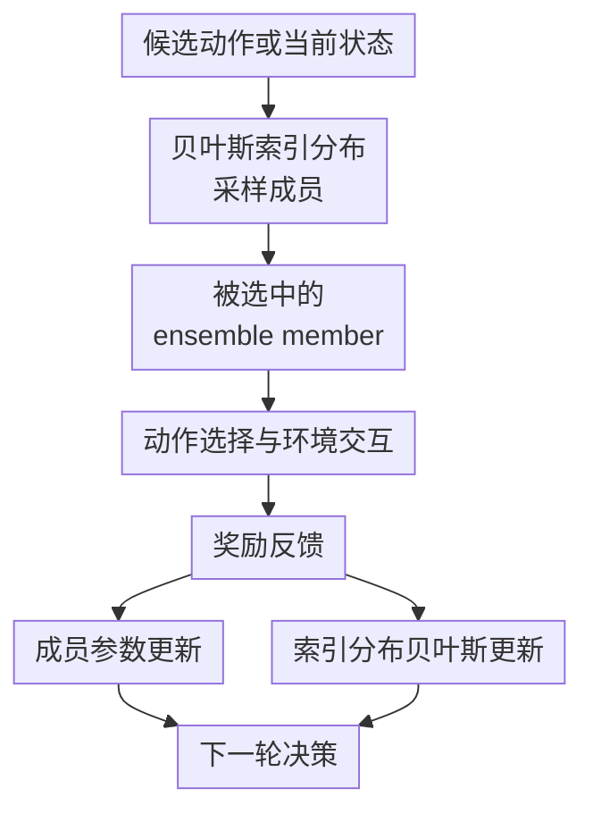

# Bayesian Ensemble for Sequential Decision-Making

**会议**: ICLR2026  
**OpenReview**: [https://openreview.net/forum?id=s2hxd8JghB](https://openreview.net/forum?id=s2hxd8JghB)  
**代码**: 未公开  
**领域**: 强化学习 / 序贯决策  
**关键词**: 贝叶斯集成, Thompson Sampling, 上下文 bandit, DQN, 不确定性建模  

## 一句话总结
本文提出 Bayesian Ensemble，把“从集成模型里选哪个成员”本身建模成一个带贝叶斯更新的内层 bandit，从而在 contextual bandit 和 DQN 中用反馈奖励动态调整集成成员的采样分布，在几乎不增加 ensemble+ 开销的情况下显著降低 regret，并在 MiniGrid 强化学习任务上提升累计回报。

## 研究背景与动机
**领域现状**：序贯决策里的核心难题是探索与利用的平衡。Thompson Sampling 的经典思路是维护奖励模型参数的后验分布，每轮从后验中采样一个可能的世界，再按这个世界里最优的动作去行动；在神经网络场景下，精确后验太难维护，所以实际系统常用 deep ensemble、随机 prior function、hypermodel 等近似后验采样方法。

**现有痛点**：这些 ensemble-based Thompson Sampling 方法通常把每个 ensemble member 看作后验样本，但“抽哪个成员”的 index distribution 大多是固定的，例如均匀离散分布或标准高斯分布。这样做很方便，却忽略了一个实际现象：不同成员的质量并不相同，随机初始化、prior function、训练路径都会让某些成员更早学到有用的不确定性，另一些成员则可能长期给出差的探索方向。

**核心矛盾**：已有 ensemble 方法只更新成员自身的网络参数，却不更新成员被采样的概率。换句话说，模型参数和环境反馈之间有学习闭环，但 index distribution 和奖励之间没有直接闭环；成员多样性被当成静态资源，而不是可被反馈校准的决策对象。

**本文目标**：作者希望在不重写现有 ensemble 架构的前提下，为成员选择增加一个轻量但有原则的贝叶斯层。这个层需要同时适配 contextual bandit 和 reinforcement learning：在 bandit 中降低 regret、在 DQN 中稳定 Q 估计并提高探索效率，同时不能带来过高的额外计算成本。

**切入角度**：本文的关键观察是，index distribution 的参数量通常远小于 neural ensemble 的参数量。与其只用 surrogate loss 训练庞大的网络，不如直接把“哪个成员带来了好 reward”作为证据，用贝叶斯推断更新成员选择分布。这等于把 ensemble member selection 再看成一个小型 bandit 问题。

**核心 idea**：Bayesian Ensemble 用奖励反馈动态更新 ensemble member 的采样分布，让被证明更有用的成员在后续决策中更可能被选中，同时保留 posterior sampling 的随机性和探索能力。

## 方法详解
Bayesian Ensemble 不是一个全新的网络结构，而是一层可以叠在已有 ensemble 方法上的 index distribution updater。它保留每个 base model 的常规训练方式，同时额外维护一个关于成员索引 $z$ 的概率分布 $p^{(t)}$；每轮先从 $p^{(t)}$ 采样成员，再用该成员指导动作选择，最后用实际 reward 更新网络参数和 $p^{(t)}$。

### 整体框架
整体流程可以理解成“两层学习”：外层是普通序贯决策 agent，在环境中选择动作并收集奖励；内层是 Bayesian Ensemble，把每个 ensemble member 当成候选策略评估器，用奖励反馈更新“下次更该相信谁”。这种设计同时覆盖 bandit 和 RL：bandit 版本叫 Bayesian Ensemble Bandit（BEB），DQN 版本叫 Bayesian Ensemble DQN（BE-DQN）。

在 BEB 中，成员 $f(x; z, \theta)$ 输出离散奖励空间上的概率分布。给定候选动作集合 $X^{(t)}$，算法先采样 $z^{(t)} \sim p^{(t)}$，再选择期望奖励最大的动作：$x^{(t)}=\arg\max_{x\in X^{(t)}} \sum_i R_i f(x;z^{(t)},\theta^{(t)})_i$。在 BE-DQN 中，每个成员是一个 Q-network，采样出来的成员负责行为策略，而所有成员的加权平均参与 target 构造。

### 关键设计
**1. 贝叶斯索引分布：把成员选择从固定随机数改成可学习后验**

传统 ensemble sampling 的成员索引通常来自固定分布，例如 $z\sim \mathrm{Uniform}([K])$ 或 $z\sim \mathcal{N}(0,I)$。本文认为这个固定分布其实浪费了 reward 信息：如果某个成员连续在当前任务上带来好 reward，它后续就应该更容易被采到；如果某个成员经常导致失败，它仍然可以保留探索机会，但不应和高质量成员完全同权。

Bayesian Ensemble 因此维护随时间变化的 $p^{(t)}(z)$。它不是替代 ensemble member 的参数学习，而是补上“成员选择”这一层的后验更新。网络参数 $\theta$ 仍通过经验风险最小化训练，即最小化 $\sum_{(x,r)\in D}\mathbb{E}_{z\sim p}[\ell(r,f(x;z,\theta))]$；索引分布 $p$ 则直接用 reward 更新，因为它参数少、更新便宜，也更贴近最终目标。

**2. BEB：用 reward 对 ensemble+ 和 hypermodel 做内层 Thompson Sampling**

在离散 ensemble+ 场景中，每个成员对应一个 Beta 分布 $w_i\sim \mathrm{Beta}(\alpha_i,\beta_i)$。每轮从所有 Beta 分布中采样权重，选择 $z=\arg\max_i w_i$ 的成员行动；如果该成员得到二值 reward $r^{(t)}\in\{0,1\}$，就执行共轭更新 $(\alpha_i,\beta_i)\leftarrow(\alpha_i,\beta_i)+(r^{(t)},1-r^{(t)})$。这相当于对“哪个成员更可能带来成功”做一层 Thompson Sampling，而且更新是精确贝叶斯推断。

对于 hypermodel 这类连续索引方法，原始索引来自标准高斯。BEB 把它扩展为每个 index component 都有可学习均值和方差的高斯分布，用变分推断近似更新这些参数。这里的代价高于 Beta-Bernoulli 更新，但好处是能把连续 index 的不确定性也纳入反馈闭环，而不是永远从固定标准高斯里采样。

**3. BE-DQN：行为采样用单个 Q 网络，target 学习用贝叶斯加权集成**

在 RL 版本里，BE-DQN 维护 $K$ 个 Q-network，并为每个 Q-network 维护一个 Beta 分布。每个 iteration 先采样 $w_1,\ldots,w_K$，归一化为 $p_k=w_k/\sum_j w_j$，再选择采样权重最大的第 $j$ 个 Q-network 来执行动作。这样，行为策略仍然具有“单个成员驱动”的时间一致性，避免每一步都由平均 Q 值抹平探索差异。

同时，训练 target 不只依赖被选中的 Q-network，而是使用所有 Q-network 的加权平均：$y_{s,a}=\mathbb{E}_B[r+\gamma\max_{a'}\sum_{k=1}^{K}p_k Q(s',a';\theta^k_{i-1})\mid s,a]$。这让 BE-DQN 在行为选择上保留深度探索，在 bootstrapping target 上利用 ensemble 的方差降低效果，避免单个 Q-function 的过估计或不稳定主导训练。

**4. 方差界：在 DQN 稳定性和 ensemble 探索之间给出理论支撑**

作者用一个 $M$ 状态单向 MDP 分析 target approximation error（TAE）对 Q 值估计方差的影响。在零奖励设定下，DQN 的方差是 $\sum_{m=0}^{M-1}\gamma^{2m}\sigma^2_{s_m}$，E-DQN 因为均匀平均 $K$ 个独立估计器，方差缩小到 $\frac{1}{K}\sum_{m=0}^{M-1}\gamma^{2m}\sigma^2_{s_m}$。

BE-DQN 的整体 Q 估计方差为 $\sum_{k=1}^{K}p_k^2\sum_{m=0}^{M-1}\gamma^{2m}\sigma^2_{s_m}$。由于 $\sum_k p_k=1$，它的方差落在 E-DQN 和 DQN 之间：下界对应均匀权重，上界对应几乎只信一个成员。这个结论说明 BE-DQN 不会比单 DQN 更不稳定，同时又比简单平均更偏向高 reward 成员；附录还讨论了非零有界 reward 下结论主要仍由 TAE 方差主导，但随机 reward 会影响严格的 $1/K$ 下界。

### 一个完整示例
假设一个新闻推荐 bandit 每轮有 20 篇候选文章，ensemble 中有 3 个成员。初始时三个成员的 Beta 分布都是 $\mathrm{Beta}(1,1)$，所以系统大致等概率地尝试它们。第 1 轮采样后成员 2 的权重最大，agent 用成员 2 预测各文章点击概率，选择期望点击最高的文章；用户点击了，成员 2 的分布更新为 $\mathrm{Beta}(2,1)$。

接下来几轮如果成员 2 和成员 3 经常带来点击，它们的 $\alpha$ 会更快增长，被采样为最大权重的概率也随之上升；成员 1 即使暂时表现差，也不会被永久排除，因为 Beta 采样仍会偶尔给它探索机会。相比固定 uniform ensemble，这个过程把“谁更适合当前用户流量和候选文章分布”变成在线可学习对象。

在 BE-DQN 里可以类比成 MiniGrid 导航。某个 Q-network 更早学会穿过门洞到达目标，它的 Beta 分布会因成功轨迹得到更多正反馈，之后更常被选作行为网络；但 target 仍由多个 Q-network 加权平均，训练不会完全被单个成员的偶然高估值牵着走。

### 损失函数 / 训练策略
BEB 的成员参数仍按任务损失训练。对于有限离散奖励，模型输出 $\Delta_N$ 上的 reward distribution，常见损失是二分类或多分类交叉熵；训练目标是对数据集 $D$ 和索引分布 $p$ 下的经验风险取期望。BEB 的新增部分只在 index distribution 上发生：ensemble+ 用 Beta-Bernoulli 共轭更新，hypermodel 用变分推断更新高斯 index 的均值和方差。

BE-DQN 的每个 Q-network 使用标准 DQN 的平方 Bellman error 训练，经验来自共享 replay buffer。训练超参在附录中给出：ensemble size 为 5，折扣因子 $0.99$，学习率 $5\times10^{-4}$，batch size 32，replay buffer size $5\times10^4$，target network 每 500 步更新一次，$\epsilon$ 从 0.1 衰减到 0.02。不同 DQN baseline 使用一致的网络结构和主要超参，以便把差异集中在 ensemble weighting / sampling 机制上。

## 实验关键数据

### 主实验
本文实验覆盖三类场景：合成 contextual bandit（Neural Testbed 与 Mushroom）、真实推荐 bandit（Yahoo!R6B）和 MiniGrid 强化学习。bandit 部分用 regret 或累计点击衡量探索效率，RL 部分用训练 $10^5$ frames 后的平均奖励衡量策略质量。

| 场景 | 对比对象 | 本文方法 | 关键结果 | 说明 |
|------|----------|----------|----------|------|
| Neural Testbed, $d=2$ | ensemble+ | ensemble+(BEB) | regret 降低 37.0% | 固定 uniform index 改为 Beta 更新 |
| Neural Testbed, $d=10$ | hypermodel | hypermodel(BEB) | regret 降低 22.8% | 连续 index 用变分推断更新 |
| Neural Testbed, $d=50$ | ensemble+ | ensemble+(BEB) | regret 降低 42.2% | 高维动作下收益更明显 |
| Mushroom | ensemble+ | ensemble+(BEB) | regret 降低 8.7% | 真实分类数据构造 bandit |
| Yahoo!R6B | hypermodel | hypermodel(BEB) | 50,322.1 次点击 | 高于 hypermodel 的 49,676.8 次 |

MiniGrid 结果显示 BE-DQN 在多个导航任务上优于 DQN、E-DQN、RE-DQN 和 UAAC。尤其在 LavaGapS5-6x6 和 MultiRoom-N2-S4 上，BE-DQN 的平均奖励分别达到 0.350 和 0.118，而 ensemble baselines 明显更低。

| MiniGrid 环境 | vanilla DQN | Ensemble DQN | Random Ensemble DQN | UAAC | BE-DQN |
|---------------|-------------|--------------|---------------------|------|--------|
| FourRooms | 0.004 | 0.012 | 0.010 | 0.036 | 0.040 |
| Empty-6x6 | 0.026 | 0.162 | 0.186 | 0.082 | 0.248 |
| LavaGapS5-6x6 | 0.026 | 0.178 | 0.120 | 0.022 | 0.350 |
| GoToDoor-5x5 | 0.066 | 0.120 | 0.128 | 0.106 | 0.142 |
| MultiRoom-N2-S4 | 0.002 | 0.042 | 0.030 | 0.004 | 0.118 |

### 消融实验
论文没有做“去掉某个子模块”的传统 ablation，而是通过计算开销、ensemble size 和 index update frequency 分析 BE 层的代价与收益。最关键的发现是，Beta 共轭更新几乎不增加 ensemble+ 的时间成本，而 hypermodel(BEB) 的收益需要支付变分推断的额外开销。

| 分析项 | 配置 | 关键指标 | 说明 |
|--------|------|----------|------|
| wall time, ensemble+, $d=50$ | baseline vs BEB | 1165.07s vs 1162.82s | Beta 更新开销可忽略 |
| wall time, hypermodel, $d=50$ | baseline vs BEB | 60.16s vs 84.20s | 变分更新带来约 20% 以上额外成本 |
| ensemble size | 25 / 50 / 100 | regret reduction 28.23% / 33.21% / 47.97% | ensemble 越大，BEB 越能利用成员差异 |
| reduced update frequency | index dim 36 | wall time 90.39s 降到 76.99s | 降低更新频率能省成本，但 regret reduction 从 16.47% 降到 4.37% |
| Yahoo!R6B subset | ensemble+ vs ensemble+(BEB) | 点击数 2185.4 vs 2255.5 | 在 1M 子集上 BEB 仍有约 3% 提升 |

### 关键发现
- BE 的主要收益来自“成员选择分布也参与学习”：同样的 base ensemble，只要让 index distribution 根据 reward 自适应，regret 就能稳定下降。
- 对离散 ensemble+ 来说，Beta-Bernoulli 共轭更新非常划算，几乎没有 wall time 增量；对 hypermodel 来说，连续 index 的变分更新更贵，需要根据任务预算调节更新频率。
- BE-DQN 在 MiniGrid 中不是简单平均所有 Q-network，而是用单成员行动、加权集成训练 target，因此同时保留深度探索和方差降低。
- 理论方差界给出的不是“BE-DQN 一定低于 E-DQN 方差”，而是说明它位于 E-DQN 与 DQN 之间；实验收益来自稳定性、成员选择和探索行为之间的综合平衡。

## 亮点与洞察
- 把 ensemble member selection 显式建模成一个内层 bandit 是最清晰的创新点。它没有推翻 ensemble sampling 的原有范式，而是指出原范式里被忽略的一块后验：成员索引本身也应该随 reward 更新。
- 这个框架很适合工程系统，因为它是“加一层”而不是“换整套模型”。已有 ensemble+、hypermodel、DQN ensemble 都能接入，只是 index distribution 的具体参数化和更新方式不同。
- BE-DQN 的行为网络采样与 target 加权平均之间有一个有趣分工：前者鼓励 temporally coherent exploration，后者降低 bootstrapping target 的波动。这比“所有网络简单平均后行动”更适合需要连续探索轨迹的 RL 任务。
- 论文把 bandit 推荐场景和 MiniGrid RL 放在同一框架下讲，说明 Bayesian Ensemble 关注的是更抽象的序贯决策不确定性，而不是某个特定 benchmark trick。

## 局限与展望
- BEB 的效果依赖 reward 是否能为成员质量提供足够清晰的信号。若 reward 极稀疏、强延迟或高度随机，简单 Beta 更新可能会把偶然成功误判为成员质量差异。
- 理论分析主要围绕简化 MDP 中的 TAE 方差，能解释稳定性边界，但还不能完整覆盖随机 reward、函数逼近误差和复杂策略分布共同作用下的 regret 或 sample complexity。
- hypermodel(BEB) 的连续 index 更新需要变分推断，成本明显高于离散 Beta 更新。实际大规模系统里，如何选择更新频率、近似族和 replay 数据窗口仍需要更细的工程研究。
- BE-DQN 实验集中在 MiniGrid 和少量附加环境，尚未验证 Atari、连续控制或离线 RL 等更复杂设置。尤其在离线数据分布偏移下，偏向高 reward 成员可能放大 extrapolation error，需要额外约束。
- 当前设计主要根据二值 reward 更新 Beta 分布。对于多值、连续或风险敏感 reward，可以考虑使用更匹配的 likelihood 和 posterior approximation，而不是把奖励粗糙二值化。

## 相关工作与启发
- **vs deep ensemble / ensemble+**: deep ensemble 用多个随机初始化模型表达 epistemic uncertainty，ensemble+ 加入随机 prior function 增强不确定性；本文不改变这些成员构造，而是让成员采样概率从固定 uniform 变成 reward-adaptive posterior。
- **vs hypermodel / HyperAgent**: hypermodel 用连续 index 映射到模型参数，适合可扩展后验采样；本文把固定标准高斯 index 扩展为可学习高斯分布，并用变分推断更新，让连续 index 也能吸收在线反馈。
- **vs Ensemble DQN / Random Ensemble DQN**: E-DQN 通过平均多个 Q-function 降低方差，RE-DQN 用随机权重增强离线 RL 稳定性；BE-DQN 的区别在于权重不是固定或无反馈随机，而是由 reward 通过 Beta posterior 调整。
- **vs Thompson Sampling**: 经典 TS 直接维护 arm reward 参数的后验；本文更像是把 TS 嵌入 ensemble 内部，用它决定“相信哪个近似后验样本”，适合神经网络后验难以精确维护的场景。
- 对后续工作的启发是：很多 ensemble 方法都有一个默认的 aggregation 或 sampling rule，这个规则本身也可以被看作可学习对象。只要反馈信号可靠，就可以用贝叶斯更新、bandit 或元学习来校准它，而不是让它长期保持均匀或随机。

## 评分
- 新颖性: ⭐⭐⭐⭐☆ 把 index distribution 纳入贝叶斯反馈闭环很自然但抓得准，对现有 ensemble TS 和 DQN 都有统一解释。
- 实验充分度: ⭐⭐⭐⭐☆ 覆盖合成 bandit、真实推荐和 MiniGrid RL，并有成本分析；但更大规模 RL 和离线 RL 验证还不够。
- 写作质量: ⭐⭐⭐⭐☆ 主线清楚，算法和理论边界交代完整；部分表格编号和 typo 略影响阅读，例如 Yahoo!R6B 表格引用编号有混乱。
- 价值: ⭐⭐⭐⭐☆ 作为轻量插件很有实用价值，特别适合已有 ensemble 系统；长期价值取决于复杂 reward 下 index posterior 更新的稳健性。

<!-- RELATED:START -->

## 相关论文

- [\[ICLR 2026\] EMFuse: Energy-based Model Fusion for Decision Making](emfuse_energy-based_model_fusion_for_decision_making.md)
- [\[ICLR 2026\] Ada-Diffuser: Latent-Aware Adaptive Diffusion for Decision-Making](ada-diffuser_latent-aware_adaptive_diffusion_for_decision-making.md)
- [\[ICML 2025\] Counterfactual Effect Decomposition in Multi-Agent Sequential Decision Making](../../ICML2025/reinforcement_learning/counterfactual_effect_decomposition_in_multi-agent_sequential_decision_making.md)
- [\[ICLR 2026\] Information-based Value Iteration Networks for Decision Making Under Uncertainty](information-based_value_iteration_networks_for_decision_making_under_uncertainty.md)
- [\[ICML 2026\] Multi-Agent Decision-Focused Learning via Value-Aware Sequential Communication](../../ICML2026/reinforcement_learning/multi-agent_decision-focused_learning_via_value-aware_sequential_communication.md)

<!-- RELATED:END -->
