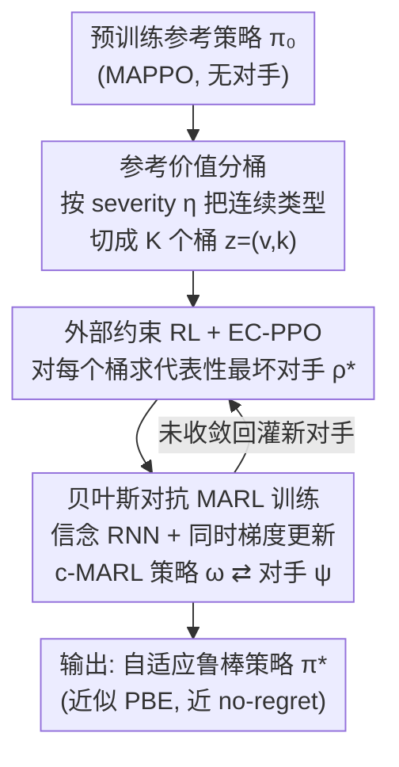

# Bayesian Robust Cooperative Multi-Agent Reinforcement Learning Against Unknown Adversaries

**会议**: ICLR 2026  
**OpenReview**: [https://openreview.net/forum?id=G3gm7QBeMc](https://openreview.net/forum?id=G3gm7QBeMc)  
**代码**: https://github.com/kiarashkaz/BATPAL  
**领域**: 强化学习 / 多智能体 / 鲁棒性  
**关键词**: 协作多智能体RL, 对抗鲁棒, 贝叶斯博弈, 完美贝叶斯均衡, 信念估计

## 一句话总结
针对协作多智能体强化学习（c-MARL）部署时可能遇到「目标未知」的对手，本文不再只学一条最坏情况下的 max–min 策略，而是按对手「破坏严重程度」把无穷多种对抗策略离散成有限个类型，对每类各学一个代表性最坏对手，再用带信念网络的同时梯度更新训出一条能随对手行为自适应的鲁棒策略 BATPAL，在四个基准上面对各种已见/未见攻击都稳定优于现有 SOTA。

## 研究背景与动机

**领域现状**：c-MARL 在自动驾驶、5G、机器人、智能电网等场景已经很能打，但只要其中一个 agent 被攻陷（被直接操纵动作或被污染观测），整队的表现就可能崩盘，因此需要对故障和对抗攻击鲁棒的策略。现有鲁棒方法主要靠数据增强（训练时注入扰动）或对抗训练（把防御方和对手放进一个零和 Stackelberg 博弈里求鞍点）。

**现有痛点**：这类方法几乎都假设对手是「最坏情况对手」——即一心要把团队回报压到最低。它们最终只产出**一条**针对最坏对手优化的策略，在全员协作的正常情形下往往是次优的，更糟的是，部署时真实对手的目标可能根本不是「最小化团队回报」（比如只是想偏向某个私有目标，或仅仅是硬件故障导致的非协作行为）。

**核心矛盾**：基于「最坏情况 + 梯度下降求鞍点」的鲁棒学习有三个根本缺陷。其一，最坏情况假设无法刻画目标各异的对手，max–min 策略对真实对手可能远非最优；其二，鞍点优化本质非凸，算法容易卡在局部稳定点，得到的只是局部 Stackelberg 均衡；其三，训练时只见过「单一对抗策略的扰动版本」会让 agent 对对抗动态过拟合，遇到没见过的对手类型时甚至连 max–min 理论保证的最低性能都达不到。

**本文目标**：训出一条能适应**多样化**对抗行为的鲁棒 MARL 策略，既不在正常情形下牺牲最优性，又能在面对未知目标的对手时自适应。

**切入角度**：与其学一条单一 max–min 策略，不如把对抗策略的集合**切成若干互不相交的子集**——按它们会施加的团队回报范围（即「严重程度」）来划分，然后对每个子集里的「代表性最坏对手」都求鲁棒。这样既把搜索限制在更小、彼此隔离的可行集里（缓解局部最优），又保证不同子集里的对手行为差异明显（保证训练时见过的对手足够多样）。

**核心 idea**：把「目标未知」建成一个带连续对手类型的贝叶斯 Dec-POMDP 博弈，用「相对参考策略的破坏严重程度」把连续类型空间离散成有限类，求其完美贝叶斯均衡（PBE），再用带信念的同时梯度更新把这条均衡策略训出来。

## 方法详解

### 整体框架

BATPAL（Bayesian Type-Partitioned Adversarial Learning）的目标是最小化**贝叶斯遗憾**（Bayesian regret）$R(\pi) = \mathbb{E}_{(v,\theta_v)\sim b_0}[\max_{\pi'} V^{\pi',\rho_{v,\theta_v}} - V^{\pi,\rho_{v,\theta_v}}]$，即在「对手身份 $v$ 与类型 $\theta_v$ 服从先验 $b_0$」下，防御方策略与「针对该对手的最优策略」之间的期望差距。问题在于对手能从（可能无穷）多种策略里挑，直接求 PBE 不可行。

BATPAL 把整条流水线拆成三步串行：① 先用 MAPPO 预训练一条无对手的参考策略 $\pi_0$，并据此定义每个对抗策略的**严重程度** $\eta$，把连续类型空间 $[0,1]$ 切成 $K$ 个桶，从而把问题转成有限类型的贝叶斯博弈；② 对每个桶 $z=(v,k)$，用「外部约束 RL + EC-PPO」求出该桶里的最坏对手策略，作为这一类型的代表；③ 用带信念 RNN 的同时梯度更新，让 c-MARL 策略与这 $K$ 个对手策略同时迭代，最终收敛到博弈 $\hat{\mathcal{M}}_B$ 的 PBE。三步对应下面三个关键设计。

### 关键设计

**1. 参考价值分桶：用「相对参考策略掉了多少分」把无穷对手类型离散成有限类**

困难在于每个对手类型 $\Theta_v$ 的私有奖励函数是别人看不到的，协作 agent 唯一能区分两种对手的办法，就是用一条固定策略跟它们对打、观察各自拿到的回报。于是本文用「对手相对参考策略 $\pi_0$ 的破坏程度」来定义类型。设 $V_{\max}=V^{\pi_0}$ 是无对手时的回报，$V^v_{\min}=\min_{\rho_v}V^{\pi_0,\rho_v}$ 是对手 $v$ 在其他人都用 $\pi_0$ 时能压到的最低回报，则任一对抗策略的严重程度定义为

$$\eta_{\rho_v} = \frac{V_{\max}-V^{\pi_0,\rho_v}}{V_{\max}-V^v_{\min}} \in [0,1].$$

把 $[0,1]$ 均匀切成 $K$ 段，落在 $(\frac{k-1}{K},\frac{k}{K}]$ 的对抗策略就归到类型 $z=(v,k)$，每个对抗策略恰好属于一个桶。这种分桶有理论支撑：作者证明严重程度差异大的两个对手，其策略的 KL 散度也有下界（Prop. 3.2/3.3），即「掉分差得多 ⇒ 行为差得开 ⇒ 训练时见到的对手足够多样」；而且分桶把单条 max–min 的遗憾上界从 $V_{\max}-V^v_{\min}$ 收紧成与严重程度相关的 $\frac{k(V_{\max}-V^v_{\min})}{K}$（Prop. 3.4），低严重度攻击的最优性差距更小。这正是它比「学一条 max–min」更鲁棒的根本原因。

**2. 外部约束 RL 与 EC-PPO：在指定严重度区间内求最坏对手**

求每个桶的代表对手，等价于求解一个「目标在一个 MDP、约束在另一个 MDP」的特殊约束问题：

$$\min_{\rho} \mathbb{E}[V^\rho_{(1)}]\quad \text{s.t.}\quad l \le \mathbb{E}[V^\rho_{(0)}] \le h,$$

其中 $V_{(1)}$ 是对手作用在「固定当前防御策略 $\pi$ 后诱导出的 MDP1」上的回报（对手要最小化它），$V_{(0)}$ 是作用在「固定参考策略 $\pi_0$ 的 MDP0」上的回报（用来卡住严重度区间 $[l,h]$）。这与安全 RL 里的约束 RL 有本质差别——后者的约束代价和目标奖励来自同一条轨迹，而这里目标和约束分属**不同 MDP、不同轨迹**，故作者称之为「外部约束 RL」。求解上先用对数障碍法把约束问题近似成无约束目标 $\min_\rho V^\rho_{(1)} - \lambda\log(V^\rho_{(0)}-l) - \lambda\log(h-V^\rho_{(0)})$ 并给出可证收敛的梯度算法（Prop. 4.2，尽管梯度估计有偏，配合自适应步长仍能收敛到 KKT 点）。但自适应步长计算昂贵、边界附近的障碍梯度对噪声极敏感，实用性差。为此作者把 PPO 的裁剪机制塞进来得到 **EC-PPO**：裁剪天然约束每步策略更新幅度，隐式防止高方差梯度把策略推出可行域，同时免去算自适应步长；当初始策略在可行域外时，更新方向会被翻转以把对手拉回可行集。

**3. 贝叶斯对抗 MARL 训练：信念 RNN + 同时梯度更新逼近 PBE**

有了每类的最坏对手，最后要把 c-MARL 策略训成「在所有桶上都表现最优」的 PBE 策略。PBE 策略要在给定信念下期望最优，于是把信念 $b^i$ 作为防御策略的输入 $\pi^i(\cdot|\tau^i, b^i, \theta^i{=}0)$。作者证明有限类型博弈 $\hat{\mathcal{M}}_B$ 等价于一个 $N{+}1$ 玩家的部分可观随机博弈（第 $N{+}1$ 个玩家是对手），从而可借助「带 min-oracle 的对抗训练」框架：c-MARL 方求 $\arg\max_\omega \min_\psi \bar V^{\omega,\psi}$，而上面的外部约束 RL 恰好充当对每个桶返回最优对手 $\psi_z^*$ 的 oracle。由于精确最小化和精确梯度在实践中都不可得，作者改用**同时梯度更新**（两时间尺度的同时梯度下降-上升）：$\psi_{n+1}=\psi_n-\alpha_n\hat g^{\text{EC-PPO}}_\psi$，$\omega_{n+1}=\omega_n+\beta_n\hat g_\omega$，并取 $\alpha_n\ge\beta_n$，使对手更新更快、近似充当 min-oracle，而从对手视角看 c-MARL 策略近乎静止。信念本身用一个 RNN $b_{\chi^i}(\theta^{-i}|\tau^i)$ 拟合，输入观测历史 $\tau^i$，用对真实类型 $\theta^{-i}$ 的交叉熵损失训练；把 $(b^i,\tau^i)$ 喂进策略网络、配合 critic 的价值估计，就能像标准 actor-critic 那样算出 $\hat g_\omega$。

### 损失函数 / 训练策略
对手侧用 EC-PPO 梯度（PPO 目标 + 对数障碍项，式 14）；c-MARL 侧用标准 actor-critic 策略梯度（式 17）。信念 RNN 用交叉熵损失对齐真实对手类型。实现上用 MAPPO 同时承担「预训练参考策略 $\pi_0$」和「对抗学习中更新 c-MARL 策略」两职；所有 agent 参数共享，c-MARL 共一个网络、$K$ 类对手各一个网络；每次 c-MARL 更新只随机更新 $K$ 个对手网络中的一个。实验取 $K=4$ 个严重度等级，训练时对所有类型用均匀先验。

## 实验关键数据

四个 c-MARL 环境：LBF（关卡式觅食，5 agent）、MPE-Spread（3 agent）、SMAC-2s3z（5 agent）、SMAC-MMM（10 agent）。SMAC 用团队胜率，其余用归一化后的平均回合回报。对手共 10 个：BATPAL 训练出的按严重度索引的对手 + 针对各 baseline 训出的「A-X」对手；外加三个所有方法都没见过的动态对手 ACT / DYN-1 / DYN-2（DYN-2 更强调低可检测性）。

### 主实验

下表为 SMAC-2s3z 上几个代表攻击下的胜率（数值越高越鲁棒；KT 为「已知对手类型」的经验上界，仅作参考不参与排名）。

| 场景（SMAC-2s3z） | BATPAL | EIR-MAPPO | Gen-Maxmin | RAP | MAPPO | KT |
|---|---|---|---|---|---|---|
| No Attack | 0.98 | 0.96 | 0.98 | 0.94 | 0.96 | 1.00 |
| Severity 2 | 0.55 | 0.12 | 0.18 | 0.39 | 0.11 | 0.94 |
| Severity 3 | 0.60 | 0.09 | 0.00 | 0.09 | 0.00 | 0.73 |
| 未见 ACT | 0.50 | 0.15 | 0.64 | 0.47 | 0.08 | 0.69 |
| 未见 DYN-2 | 0.71 | 0.56 | 0.57 | 0.74 | 0.38 | 0.90 |

关键结论：① 无攻击时 BATPAL 至少与原版 MAPPO 持平，说明鲁棒化没牺牲正常情形最优性；② 尽管只训一条协作策略，它在多数情况下甚至比各 baseline「面对自己被训练去对抗的那个攻击」时还强；③ 各 baseline 的最差表现常常出现在面对「为训练 BATPAL 生成的攻击」时（而非它们自己的对手），印证了对抗训练容易卡局部稳定点、而本文在不相交子集上搜索能跳出这种局部解；④ 不少情况下 BATPAL 逼近 KT 上界，即便面对未见攻击也近乎 no-regret。

### 消融实验

| 变体（MPE-Spread / SMAC-2s3z，取 ACT 攻击） | MPE-Spread | SMAC-2s3z |
|---|---|---|
| BATPAL（完整） | 0.81 | 0.72 |
| No Belief（去掉信念网络） | 0.70 | 0.33 |
| Perfect Belief（直接喂真实类型） | 0.75 | 0.34 |
| EC PG（对手更新去掉 PPO 裁剪） | 0.75 | 0.41 |
| Fixed Types（用固定对手集合替代分桶） | 0.78 | 0.42 |

### 关键发现
- **信念网络贡献最大**：去掉信念（No Belief）在 SMAC-2s3z 上从 0.72 掉到 0.33，连正常情形性能都受影响；有意思的是即便喂入「完美信念」（真实类型）也救不回未见攻击，因为信念捕捉的是攻击的**严重度等级**而非真实攻击类型，恰恰说明 BATPAL 学到的是「按严重度自适应」而非「认出具体对手」。
- **EC-PPO 的裁剪不可省**：换成无裁剪的 EC PG 后，正常情形性能接近，但对不同类型攻击普遍不鲁棒——没有裁剪，对手策略容易跑出可行域，导致训练时遇到的对手不再能代表其设定类型。
- **多样性必要但不充分**：Fixed Types 用四个不同 severity/可检测性权衡的固定动态对手做集合训练（已保证多样），性能仍明显低于 BATPAL，说明「分桶 + 各桶求最坏」带来的覆盖性，是固定对手集合给不了的。

## 亮点与洞察
- **把「目标未知」从最坏情况假设里解放出来**：用「相对参考策略的掉分比例」$\eta$ 这一个可观测、可计算的标量，把私有、不可见的对手奖励函数映射到 $[0,1]$ 并离散化，巧妙绕过了「无法直接知道对手目标」的死结。
- **「外部约束 RL」是个可迁移的新抽象**：目标与约束分属不同 MDP/轨迹的约束优化，区别于安全 RL 的同轨迹约束，配合对数障碍 + PPO 裁剪的 EC-PPO 求解器，可复用到任何「想在某个性能区间内训出代表性策略」的场景。
- **分桶把局部最优问题化整为零**：把对抗策略空间切成互不相交的小可行集分别求最坏，既提升找到好解的概率，又附带「严重度相关的遗憾上界」这一理论甜头。
- **信念学的是严重度而非身份**：消融揭示鲁棒性来自「按破坏程度自适应」，这一观察对设计其他自适应防御很有启发——不必非要认出对手是谁，认出它有多狠就够了。

## 局限与展望
- 作者承认局部最优问题没被根除，只是通过限制搜索到更小的隔离可行集来缓解。
- 威胁模型假设对手只控制**单个**受害 agent、且类型在一个 episode 内不变；多受害者、episode 内类型切换的情形未覆盖。
- 多数收敛/均衡的理论保证（如收敛到 Markov 博弈的 Nash）依赖直接参数化、状态完全可观、精确最小化等简化条件，实际用的是同时梯度更新这一近似。
- 分桶数 $K$、对数障碍系数 $\lambda$ 等超参对「最优性-可行性」权衡有影响，论文未给出大规模敏感性分析；KT 上界是经验估计，未必是真实可达上界。

## 相关工作与启发
- **vs EIR-MAPPO (Li et al. 2024)**：同样维护「队友是否被攻陷」的信念状态，但只考虑最坏情况对手，面对未见对手时无防御；本文用贝叶斯类型 + 分桶覆盖了非最坏、目标各异的对手，实验中对未见攻击鲁棒性显著更好。
- **vs Gen-Maxmin (Liu et al. 2024a)**：研究两 agent 场景下可调的非最坏对手；本文推广到多 agent、多类型，并用 PBE 而非单一鞍点刻画解。
- **vs RAP (Vinitsky et al. 2020)**：用对手种群提升鲁棒性，但对手是固定/采样得到、缺乏「按严重度系统覆盖」的保证；本文的分桶 + 各桶求最坏给出了多样性的理论下界（Prop. 3.3）。
- **vs 安全 RL 的约束 RL**：二者形式相似，但安全 RL 的代价与奖励同轨迹，本文目标与约束分属不同 MDP，故提出「外部约束 RL」这一新问题类。

## 评分
- 新颖性: ⭐⭐⭐⭐⭐ 「严重度分桶 + 外部约束 RL + 贝叶斯 PBE」三件套把「未知目标对手」这一难题做了系统化的重新建模。
- 实验充分度: ⭐⭐⭐⭐ 四环境 ×10 攻击 + 含未见动态对手 + 完整消融，但单受害者假设限制了场景广度。
- 写作质量: ⭐⭐⭐⭐ 理论命题与直觉解释穿插，框架清晰；部分公式较密需对照附录。
- 价值: ⭐⭐⭐⭐⭐ 给 c-MARL 部署期鲁棒性提供了「不靠认出对手、靠按严重度自适应」的新范式，且外部约束 RL 抽象可迁移。

<!-- RELATED:START -->

## 相关论文

- [\[ICLR 2026\] Distributionally Robust Cooperative Multi-agent Reinforcement Learning with Value Factorization](distributionally_robust_cooperative_multi-agent_reinforcement_learning_with_valu.md)
- [\[ICLR 2026\] When Is Diversity Rewarded in Cooperative Multi-Agent Learning?](when_is_diversity_rewarded_in_cooperative_multi-agent_learning.md)
- [\[ICLR 2026\] Learning to Play Multi-Follower Bayesian Stackelberg Games](learning_to_play_multi-follower_bayesian_stackelberg_games.md)
- [\[ICLR 2026\] Robust Deep Reinforcement Learning against Adversarial Behavior Manipulation](robust_deep_reinforcement_learning_against_adversarial_behavior_manipulation.md)
- [\[ICLR 2026\] Potentially Optimal Joint Actions Recognition for Cooperative Multi-Agent Reinforcement Learning](potentially_optimal_joint_actions_recognition_for_cooperative_multi-agent_reinfo.md)

<!-- RELATED:END -->
