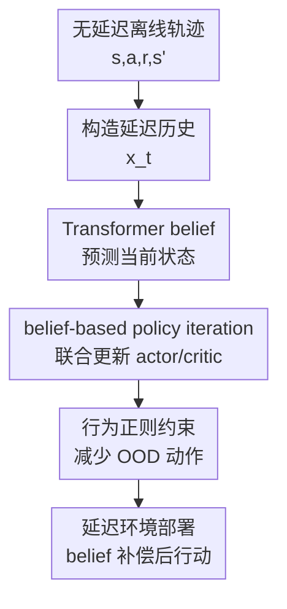

# Belief-Based Offline Reinforcement Learning for Delay-Robust Policy Optimization

**会议**: ICLR 2026  
**OpenReview**: [https://openreview.net/forum?id=3C1U86DcW4](https://openreview.net/forum?id=3C1U86DcW4)  
**论文**: [OpenReview Forum](https://openreview.net/forum?id=3C1U86DcW4)  
**代码**: https://github.com/SimonZhan-code/DT-CORL  
**领域**: 强化学习  
**关键词**: 离线强化学习, 延迟鲁棒控制, belief state, Transformer, D4RL  

## 一句话总结
DT-CORL 用 Transformer belief model 从延迟观测和历史动作中预测当前潜在状态，并把这个 belief 表示直接嵌入保守离线策略迭代，使只在无延迟离线数据上训练的策略也能在部署时面对确定或随机延迟保持较稳的控制性能。

## 研究背景与动机
**领域现状**：离线强化学习的核心目标，是在不继续与环境交互的前提下，从固定数据集里学出可部署策略；延迟强化学习则关注另一类现实问题，即传感、通信、计算或执行链路存在时滞，agent 拿到的观测并不对应真实当前状态。前者强调“不能再采样”，后者强调“状态不再 Markov”，两者在真实系统里经常同时出现：模拟器或历史控制器日志往往是无延迟的，真正部署到机器人、无人机、云端控制或高频决策系统时却会有延迟。

**现有痛点**：如果直接把离线 RL 算法训练在无延迟数据上，部署时策略会基于过期观测行动，价值函数和策略都在训练分布之外工作；如果用延迟 RL 的常见状态增强做法，把过去 $\\Delta$ 步动作甚至状态都堆进状态，维度会随延迟长度增长，离线数据覆盖更稀薄，OOD 问题反而更严重；如果先训练一个 belief model 再冻结它，然后接 CQL/IQL 这类离线 RL，belief 误差不会被下游价值学习纠正，长 rollout 中的小偏差会不断放大。

**核心矛盾**：这篇论文面对的矛盾不是“有没有办法处理延迟”，而是“只有 delay-free offline data 时，如何同时处理延迟造成的非 Markov 性和离线 RL 的分布外风险”。延迟补偿需要从历史里推断当前状态，但离线策略优化又要求策略不要离开数据支持；两件事分开做会导致 belief、critic 和 actor 看到的状态分布不一致。

**本文目标**：作者希望在训练阶段完全不访问带延迟的环境，也不需要 delayed transitions，只利用静态的无延迟轨迹 $\\mathcal{D}=\{(s_t,a_t,r_t,s_{t+1})\}$，学出部署时能处理固定延迟或有界随机延迟的策略。更具体地说，方法要避免增强状态空间的维度爆炸，降低 belief prediction 的累积误差，并让离线策略更新仍然保持足够保守。

**切入角度**：论文把延迟 MDP 中的增强状态 $x_t=\{s_{t-\\Delta},a_{t-\\Delta},\ldots,a_{t-1}\}$ 看成一个可压缩的历史摘要问题：与其让策略直接在高维 $x_t$ 上行动，不如学习一个 belief function $b_\\Delta(s_t\mid x_t)$，把过期观测和动作历史映射回“当前状态”的潜在估计。关键不是单独训练这个 belief，而是让 value estimation 和 policy improvement 都在这个 belief 表示上发生。

**核心 idea**：DT-CORL 用 Transformer 预测延迟补偿后的 belief state，并在离线 constrained policy iteration 中联合使用 belief、critic 和 behavior-regularized actor，从而把 delay-free 数据转成 delay-robust policy optimization 的训练信号。

## 方法详解
DT-CORL 的方法可以理解成一个“离线构造延迟输入，在线用 belief 补偿延迟”的闭环。训练时，论文从无延迟轨迹中人工构造不同延迟长度下的历史序列，让 Transformer belief 学会从 $x_t$ 预测当前状态 $s_t$；随后 actor 和 critic 不再直接吃原始增强状态，而是基于 belief 预测得到的 $\\hat{s}_t$ 做离线策略评估和策略改进。部署时，agent 接收延迟观测，把最近动作缓冲拼成同样格式的输入，先由 belief model 预测当前状态，再由离线训练好的策略输出动作。

### 整体框架
整体流程分成离线训练和在线部署两部分。离线阶段先从 delay-free trajectory buffer 里构造带 $\\Delta$ 步历史的伪延迟输入，预训练 Transformer belief，使其能从过期状态和动作序列预测当前 latent state；然后在 belief state 上执行保守的 offline policy iteration，让 critic、actor 与 belief 表示对齐。在线阶段不再更新环境数据，只维护动作缓冲，将 delayed observation 和历史动作送入 belief transformer，得到 $\\hat{s}_t$ 后由策略 $\\pi(\cdot\mid \\hat{s}_t)$ 选动作。

论文的理论部分先从增强 delayed MDP 出发，把策略约束的 offline RL 写成增强状态上的 policy evaluation 与 policy improvement。随后作者利用 belief distribution $b_\\Delta(s\mid x)$ 把增强状态上的 $Q_\\Delta(x,a)$ 与原始状态空间里的 $Q(s,a)$ 联系起来，并通过 Wasserstein 距离界定 delayed policy 与 belief-induced policy 之间的差异。这样得到的目标不要求策略直接处理高维历史，而是在 $\hat{s}\sim b_\\Delta(\cdot\mid x)$ 上进行价值学习和策略更新。

### 关键设计
**1. Transformer belief：把延迟历史压缩成可用于控制的当前状态估计**

延迟观测的问题在于，策略看到的 $o_t$ 实际可能对应过去的状态；仅把过去 $\\Delta$ 步动作拼接起来虽然恢复了形式上的 Markov 性，却让状态维度膨胀为 $S\times A^\\Delta$，离线数据很难覆盖。DT-CORL 的 belief model 接收 $x_t=\{s_{t-\\Delta},a_{t-\\Delta},a_{t-\\Delta+1},\ldots,a_{t-1}\}$，输出从 $\\hat{s}_{t-\\Delta+1}$ 到 $\\hat{s}_t$ 的状态预测序列，最终用 $\\hat{s}_t$ 作为策略和价值函数的输入。

这里选择 Transformer 而不是普通 MLP 的重点，是序列建模能力和推理成本之间的折中。ensemble MLP 参数少但长延迟下误差快速累积；diffusion predictor 预测精度强但推理需要多步去噪，在线控制延迟太高；Transformer 能用注意力在历史动作和旧观测之间建立长程依赖，同时推理速度明显快于 diffusion。论文在 Hopper-medium、16 步延迟预测上报告，Transformer 最终 MSE 约 $0.315$，推理约 $22.27$ ms；diffusion MSE 更低但推理约 $665.21$ ms，难以作为实时控制前端。

**2. Belief-based constrained policy iteration：让 critic 在部署会看到的 latent state 上学习**

两阶段 belief baseline 的核心缺陷，是 belief model 被当作一个固定预处理器：critic 训练时以为输入是干净状态或固定 belief，部署时 policy 的动作却会改变后续 belief 分布。DT-CORL 把 Bellman target 写在 belief state 上，例如在抽象层面让 critic 拟合 $E_{\hat{s}\sim b_\\Delta(\cdot\mid x)}[Q^\pi(\hat{s},a)]$ 与基于下一步 belief 的目标之间的差距。这样，critic 学到的是 policy 真正会查询的 latent state-action 区域，而不是假设 belief 完美无误后的静态样本。

论文通过两个 delayed performance / Q-value difference bound 说明，增强状态上的延迟策略和 belief-induced policy 之间的差距可以由 Wasserstein 距离控制；再把增强 delayed MDP 的 constrained offline PI 转回原始状态空间。得到的 policy improvement 仍保留行为约束项，形式上类似在最大化 $Q$ 的同时惩罚 $\\pi$ 与延迟增强后的行为策略 $\\mu_\\Delta$ 的偏离。这个设计把“补偿延迟”和“离线保守”放进同一套更新，而不是先补偿再交给一个互不知情的离线算法。

**3. 简化的行为正则：用动作 MSE 近似策略-行为距离，保持离线更新可算**

理论上可以用 KL、MMD 或 Wasserstein 距离约束 learned policy 和 behavior policy，但在连续控制里精确估计这些距离很重。DT-CORL 借鉴 TD3+BC 和 ReBRAC 的实用做法，用 learned policy 采样动作 $\\hat{a}$ 与数据动作 $a$ 的均方误差作为替代正则，策略改进目标可理解为：

$$
\max_\\pi\; E_{(x,a)\sim \\mathcal{D},\hat{s}\sim b_\\Delta(\cdot\mid x),\hat{a}\sim \\pi(\cdot\mid \hat{s})}
\left[\hat{Q}^{\pi_k}(\hat{s},\hat{a}) - \alpha\lVert a-\hat{a}\rVert_2^2\right].
$$

这个近似有两个好处：一是不需要额外训练一个延迟增强的 behavior model；二是保留了离线 RL 最重要的安全阀，即 actor 不能为了追求高估的 Q 值任意跑到数据支持之外。对于确定性 MDP，论文还指出 reward 可以直接使用离线数据里的 $r(s_t,a_t)$，无需单独建 reward model，这让整体实现更接近一个 belief 前端加保守 actor-critic 的框架。

**4. 在线动作缓冲与 mask：让训练输入格式和部署输入格式一致**

部署时 agent 并不知道真实当前状态，只能收到延迟观测 $o_t$。DT-CORL 维护一个长度为 $\\Delta$ 的循环动作缓冲，把 $o_t$ 和最近动作 $a_{t-\\Delta},\ldots,a_{t-1}$ 拼成 $x_t$，交给 Transformer belief 预测 $\\hat{s}_t$。策略只基于 $\\hat{s}_t$ 输出动作，所以延迟补偿发生在策略前端，而不是通过在线 finetuning 或额外采样完成。

序列开头和 episode 结束附近会出现历史动作不足的问题。论文的处理方式是在缺失位置插入特殊 `[MASK]` token，并使用 Transformer 自带 masking 机制，使不同时间步都能用同一套模型接口。这一点看似工程细节，但对离线到在线的一致性很重要：如果训练时输入总是完整历史、部署初期却用随机填充或零填充，belief 误差会在前几步直接传给策略。

### 一个完整示例
假设我们在 Hopper-medium-v2 上训练一个最大观测延迟 $\\Delta=8$ 的策略。离线数据里原本只有正常的 $(s_t,a_t,r_t,s_{t+1})$，没有任何真实延迟轨迹；DT-CORL 会从同一条 trajectory 中取出 $s_{t-8}$ 和中间执行过的 $a_{t-8},\ldots,a_{t-1}$，构造 $x_t$，让 Transformer 预测从 $t-7$ 到 $t$ 的状态序列，监督目标则来自原始无延迟轨迹中的真实状态。

训练 actor-critic 时，critic 不是问“在 $x_t$ 这个巨大增强状态下动作 $a$ 值多少”，而是先通过 belief 得到 $\\hat{s}_t$，再估计 $Q(\\hat{s}_t,a)$。如果 actor 选择的 $\\hat{a}$ 离数据动作 $a_t$ 太远，MSE 行为正则会惩罚它；如果 belief 预测让 critic 在某些 latent state 上出现系统误差，联合训练会通过价值目标暴露这种误差，而冻结 belief 的两阶段方法没有这条反馈路径。

部署到有 8 步延迟的环境时，agent 在时刻 $t$ 只拿到旧观测 $o_t$，动作缓冲里保存最近 8 个动作。Transformer 根据“旧观测 + 这 8 个动作”推断当前身体状态，策略再决定下一步控制。这样，策略训练和部署看到的都是 belief-compensated state，而不是训练看真实状态、部署看延迟状态的错位组合。

### 损失函数 / 训练策略
belief model 的训练被写成 dynamics prediction。对确定性环境，Transformer belief 用 MSE 预测真实状态序列；对随机环境，则可用最大似然目标拟合状态分布。论文主实验的 Transformer belief 超参包括 batch size 256、10 层、hidden dim 256、4 个 attention heads、AdamW、学习率 $10^{-4}$、weight decay $10^{-4}$，并使用 attention/residual/hidden dropout $0.1$。

策略优化实现基于 CORL / CleanRL 风格的 actor-critic。DT-CORL 的 actor learning rate 为 $3\times 10^{-4}$，critic learning rate 为 $10^{-3}$，critic 每步更新、actor 每 2 步更新一次，soft update factor 为 $5\times 10^{-3}$，batch size 256。论文强调，与其追求精确计算 $D(\\pi,\\mu_\\Delta)$，实际实现中用动作 MSE 正则已经能在连续控制任务上提供足够的保守性。

## 实验关键数据

### 主实验
论文在 D4RL 的 AntMaze、MuJoCo locomotion 和 Adroit dexterous manipulation 上测试确定性延迟 $\\Delta\in\{4,8,16\}$ 与随机延迟 $\\Delta\sim U(1,k)$。对比对象包括直接增强状态的 Augmented-BC / Augmented-CQL / Augmented-COMBO、在线 delayed RL 方法 DBPT-SAC，以及把同一个 Transformer belief 接到 CQL/IQL 后面的 Belief-CQL / Belief-IQL。

| 场景 | 延迟设置 | 代表指标 | 本文 DT-CORL | 对比方法 | 结论 |
|------|----------|----------|--------------|----------|------|
| AntMaze umaze | stochastic, $k=16$ | normalized return | 67.3 | Augmented-BC 24.7 / Augmented-CQL 12.7 / DBPT-SAC 0.0 | 随机长延迟下优势明显 |
| AntMaze umaze-diverse | deterministic, $\\Delta=8$ | normalized return | 62.0 | Augmented-BC 58.7 / Augmented-CQL 23.7 / Augmented-COMBO 19.0 | belief 方法比增强 CQL/COMBO 更稳 |
| Hopper medium-expert | deterministic, $\\Delta=16$ | normalized return | 109.9 | Belief-CQL 35.2 / Belief-IQL 24.7 | joint belief-policy 显著优于冻结 belief |
| Walker2d medium | deterministic, $\\Delta=16$ | normalized return | 86.8 | Belief-CQL 39.2 / Belief-IQL 24.6 | 长延迟下退化更慢 |
| Adroit Hammer expert | deterministic, $\\Delta=16$ | normalized return | 105.20 | Aug-CQL 0.21 / Belief-CQL 0.22 | 接触丰富任务中基线几乎失效 |

从 AntMaze 表看，DBPT-SAC 这类在线 delayed RL 方法在完全离线设置下基本崩溃，说明“能在线处理延迟”不等于“能从无延迟离线数据学出延迟鲁棒策略”。在 MuJoCo 中，DT-CORL 对 Hopper 和 Walker2d 的提升尤其稳定；HalfCheetah 的 expert 长延迟场景仍有退化，说明 belief 补偿不是万能的，和任务动力学、数据质量有关。

### 消融实验
| 配置 | 关键指标 | 说明 |
|------|---------|------|
| Separate belief training | Hopper suite, $\\Delta=16$: 68.3 / 73.1 | 先训 belief 再冻结，两个数对应确定/随机设置，长延迟下明显掉点 |
| DT-CORL joint training | Hopper suite, $\\Delta=16$: 98.5 / 94.2 | belief 与策略评估/改进对齐后，长延迟表现更稳 |
| Transformer belief | inference 22.27 ms, final MSE 0.315 | 精度和速度较均衡，适合在线部署 |
| Diffusion belief | inference 665.21 ms, final MSE 0.157 | 预测更准但推理太慢，不适合作为实时前端 |
| Ensemble MLP belief | inference 69.50 ms, final MSE 11.790 | 长 horizon 误差快速累积 |
| 25% offline data | HalfCheetah-medium, $\\Delta=8$: DT-CORL 9.8 | 低数据量下仍优于 Belief-CQL 3.08 和 Aug-CQL 2.47 |
| 100% offline data | HalfCheetah-medium, $\\Delta=8$: DT-CORL 27.8 | 数据越多，joint 方法与基线差距越大 |

### 关键发现
- DT-CORL 的主要收益来自把 belief prediction 纳入 policy evaluation，而不是单纯换一个更强的状态预测器；Belief-CQL 与 Belief-IQL 使用同类 belief 仍明显落后，说明冻结 belief 会带来价值目标偏差和分布错位。
- 状态增强方法在小延迟、简单任务上偶尔还能工作，但延迟变长或随机化后容易因为输入维度和离线覆盖不足而快速退化；这种趋势在 AntMaze 和 MuJoCo 多个任务上都出现。
- Transformer 不是因为预测 MSE 最低而胜出，而是因为它在长序列预测质量、推理速度和训练稳定性之间更均衡；diffusion 虽准，但每步控制多出数百毫秒推理成本，和“delay-robust”目标相冲突。
- Adroit Hand 结果很有说服力：Pen、Door、Hammer 都涉及高维接触动力学，DT-CORL 在 Hammer 上把基线近乎 0 的表现拉到 100+，说明 belief 对细粒度时序结构的捕捉确实能帮助复杂控制。

## 亮点与洞察
- 这篇论文最有价值的地方，是把 delay compensation 和 offline conservatism 放在同一个 policy iteration 里处理。很多方法会把“状态估计”和“策略学习”拆开，但延迟环境中估计误差正是策略分布漂移的来源，拆开后很难闭环修正。
- 理论推导没有停留在直觉层面，而是从 augmented delayed MDP 出发，用 belief distribution 和 Wasserstein bound 把增强状态上的策略迭代转回原始状态空间。这让方法不只是工程上接了一个 Transformer 前端，而是解释了为什么 belief-based PI 可以替代高维增强 PI。
- 工程选择很克制：行为约束没有追求复杂 divergence estimator，而是使用动作 MSE 近似，这和 TD3+BC / ReBRAC 的经验一致。对离线连续控制来说，简单可稳定优化的正则往往比形式更漂亮但估计噪声大的约束更实用。
- 从控制角度看，DT-CORL 有点像学习版 Smith Predictor：训练时依赖 delay-free 数据，部署时预测“现在”的系统状态来抵消 dead time。这个视角很容易迁移到网络控制、云端机器人、远程操控等有系统延迟的场景。
- 论文把随机延迟也纳入评估，并发现 belief-based 方法在某些随机延迟设置下反而受益于有效平均延迟更短；这提醒我们延迟鲁棒性不只看最大 $\\Delta$，还要看延迟分布、方差和时间相关性。

## 局限与展望
- DT-CORL 仍假设训练和部署时知道最大延迟或固定延迟边界，并用这个 $\\Delta$ 组织输入序列。真实系统里延迟可能未知、随负载变化、传感和执行链路异步，如何自动估计或适配延迟仍是开放问题。
- 当前实验主要基于低维状态的 D4RL / Adroit 控制任务。若输入变成视觉、点云或多模态感知，单纯的状态序列 Transformer 可能不够，需要结合空间注意力、world model 或 representation learning。
- belief 预测依赖离线轨迹覆盖。如果数据从很窄的 behavior policy 来，Transformer 可能只能在有限状态区域内补偿延迟；一旦部署策略靠近数据边界，belief 和 Q 的误差仍可能共同放大。
- 论文在 AntMaze medium-play 和 large-play 上所有方法整体都很低，说明 goal-conditioned delayed offline RL 还需要额外设计，比如目标条件 belief、子目标分解或 hindsight-style 数据增强。
- 方法的训练成本不低。作者报告 Hopper-medium-v2、4 步延迟约 2 小时，Adroit-Pen、16 步延迟约 7 小时；对更大状态空间或更长延迟，belief 训练和策略迭代的成本可能成为瓶颈。

## 相关工作与启发
- **vs augmented delayed RL**: DIDA、ADRL、BPQL、VDPO 等方法通过堆叠历史恢复 Markov 性，直观但维度随延迟增长；DT-CORL 用 belief 压缩历史，把策略学习留在原始状态空间附近，离线样本效率更高。
- **vs DATS / D-Dreamer / DFBT 等 belief-based delayed RL**: 这些方法强调在线延迟环境中的 belief 或 world model，但通常需要 delayed interaction；DT-CORL 的难点是训练数据没有延迟，必须从 delay-free offline trajectories 合成训练信号并保持离线保守性。
- **vs CQL / IQL / TD3+BC / ReBRAC**: 传统离线 RL 主要解决 OOD 动作和价值高估，不处理部署时观测延迟；DT-CORL 借鉴它们的行为正则思想，但把输入换成 belief-compensated state。
- **vs two-stage Belief-CQL / Belief-IQL**: 两阶段方法把 belief 当作固定特征，critic 无法感知 belief 误差如何影响策略分布；DT-CORL 让 value target 和 policy update 都经过 belief，从实验上明显降低分布错位。
- **对后续工作的启发**: 可以把这种“从理想日志学习、部署时补偿现实系统缺陷”的框架推广到其他 sim-to-real gap，例如传感噪声、控制频率不一致、执行丢包或通信抖动；关键是找到能进入策略迭代闭环的 latent compensation model。

## 评分
- 新颖性: ⭐⭐⭐⭐⭐ 首次系统处理“无延迟离线数据训练、延迟环境部署”的 offline delayed RL 问题，并把 belief 与 constrained policy iteration 联合起来。
- 实验充分度: ⭐⭐⭐⭐ 覆盖 AntMaze、MuJoCo、Adroit、多种延迟和多类 baseline，消融也较完整；但视觉/真实机器人实验缺失。
- 写作质量: ⭐⭐⭐⭐ 问题定义和实验故事清楚，理论推导给了支撑；部分表格很密，AntMaze 困难任务上的低结果需要更深入分析。
- 价值: ⭐⭐⭐⭐⭐ 对机器人、网络控制和离线到在线部署都有直接参考价值，尤其适合不能采集延迟交互数据但必须面对部署时 latency 的系统。

<!-- RELATED:START -->

## 相关论文

- [\[ICLR 2026\] Preference-based Policy Optimization from Sparse-reward Offline Dataset](preference-based_policy_optimization_from_sparse-reward_offline_dataset.md)
- [\[ICLR 2026\] Dual-Robust Cross-Domain Offline Reinforcement Learning Against Dynamics Shifts](dual-robust_cross-domain_offline_reinforcement_learning_against_dynamics_shifts.md)
- [\[ICLR 2026\] In-Context Compositional Q-Learning for Offline Reinforcement Learning](in-context_compositional_q-learning_for_offline_reinforcement_learning.md)
- [\[ICLR 2026\] Guided Flow Policy: Learning from High-Value Actions in Offline Reinforcement Learning](guided_flow_policy_learning_from_high-value_actions_in_offline_reinforcement_lea.md)
- [\[ICLR 2026\] Adaptive Scaling of Policy Constraints for Offline Reinforcement Learning](adaptive_scaling_of_policy_constraints_for_offline_reinforcement_learning.md)

<!-- RELATED:END -->
