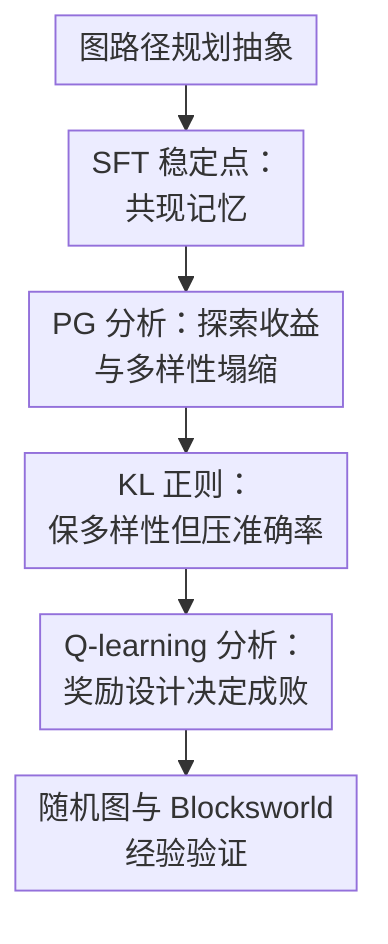

# Benefits and Pitfalls of Reinforcement Learning for Language Model Planning: A Theoretical Perspective

**会议**: ICLR 2026  
**OpenReview**: [https://openreview.net/forum?id=34a6DfHOUF](https://openreview.net/forum?id=34a6DfHOUF)  
**代码**: 有（随 supplementary materials 提供）  
**领域**: 强化学习 / 语言模型规划理论  
**关键词**: 强化学习后训练, 语言模型规划, 策略梯度, Q-learning, 多样性塌缩  

## 一句话总结
本文用图上路径规划作为可分析的语言模型规划抽象，理论说明 SFT 容易学成共现记忆，策略梯度的优势主要来自探索但会牺牲输出多样性，而带过程奖励的 Q-learning 有望同时保留正确性、多样性与 off-policy 训练能力。

## 研究背景与动机
**领域现状**：LLM 的规划能力已经从简单的 next-token prediction 走向以 RL 为核心的后训练范式。以 o1、DeepSeek-R1 这类推理模型为代表，RL 被用来奖励长链条推理、工具调用、游戏策略、视觉语言导航和机器人长程任务中的正确行为；在很多实验里，RL 后训练确实比只做 supervised fine-tuning（SFT）更能提升规划和泛化。

**现有痛点**：经验结果越来越多，但机制解释仍然很薄。常见说法是“RL generalizes, SFT memorizes”，可这句话本身并没有回答几个更细的问题：SFT 到底记住了什么？RL 的收益来自优化目标本身，还是来自训练时不断采样新轨迹？为什么 policy gradient 类方法在训练后期会变得越来越单一？Q-learning 这类在游戏中成熟的值函数方法，为什么很少被用于 LLM 后训练，它理论上又可能补上 PG 的哪些短板？

**核心矛盾**：语言模型规划同时需要两件事：一方面要输出一条可执行的正确路径，另一方面不能只塌缩到训练中见过的少数路径，因为真实测试问题往往需要组合未见过的边、节点和中间状态。SFT 的交叉熵训练天然绑定固定数据分布，PG 可以探索但容易把概率质量推向少数成功轨迹，Q-learning 则要面对奖励设计和 Q 值偏差问题。论文的核心矛盾正是“正确性、泛化、多样性和训练可实现性”之间的关系。

**本文目标**：作者希望在一个足够简单、但仍保留规划本质的模型里，给出可证明的学习动态解释。具体来说，论文要回答四个问题：SFT 在路径规划上收敛到什么结构；PG 相比 SFT 的收益从哪里来；PG 的多样性塌缩是否可以被理论刻画；Q-learning 在什么奖励设计下可以恢复图结构，并且相比 PG 具备什么优势。

**切入角度**：论文采用有向图路径规划抽象：每个节点是一个 token，一条边代表一步合法转移，规划任务就是给定 source 和 target 后生成一条从 source 到 target 的有效路径。这个抽象既能对应工具调用依赖图、证明依赖图、Blocksworld 状态转移图等实际规划场景，又足够简单，可以把 Transformer 的 next-token 预测、PG loss 和 Q-learning update 写成可分析的形式。

**核心 idea**：把“LLM 规划后训练”化约为图上路径生成的学习动态问题，从稳定点和梯度更新角度解释：RL 的真正优势是探索带来的数据扩展，PG 的代价是多样性塌缩，而过程奖励 Q-learning 能更直接恢复邻接与可达结构。

## 方法详解

### 整体框架
本文不是提出一个工程上可直接替换 PPO 的新系统，而是搭建一个理论分析框架。它先把规划任务抽象为未知有向图 $G=(V,E)$ 上的路径生成，再分别分析 SFT、policy gradient（PG）和 Q-learning 在这个任务上的损失、稳定点和训练动态，最后用随机图与 Blocksworld 的小型 Transformer 实验验证这些理论现象确实会出现。

输入是一组 source-target 对 $(s,t)$ 和图上的有效路径样本；模型输出形如 `s t s a b c t \n` 的 token 序列，其中后半段是从 $s$ 到 $t$ 的路径。SFT 只能看固定路径数据，PG 由当前策略采样轨迹并根据 0-1 outcome reward 更新，Q-learning 则把模型 logit 当作近似 Q 值，并比较 outcome reward 与 process reward 两种奖励设计。

### 关键设计
**1. 图路径规划抽象：把语言模型规划变成可证明的 next-node 学习问题**

论文的第一步是把“规划”从自然语言表面剥离出来，只保留最核心的结构：一个节点集合 $V$、一组有向边 $E$、邻接矩阵 $A$ 和可达矩阵 $R$。给定 source $s$ 与 target $t$，模型需要输出一条合法路径；在 Blocksworld 里，一个节点可以理解为一种积木配置，一条边就是一次合法移动，所以自然语言行动序列被转成了图上的状态转移序列。

这个抽象的好处是，它让“规划能力”有了明确的判据。若当前节点是 $j$、目标是 $i$，一个好模型应该选择那些同时满足 $A[j,k]=1$ 且 $R[i,k]=1$ 的下一节点 $k$：也就是从当前节点一步可走到 $k$，并且 $k$ 还能继续走到目标。作者用集合 $C(i,j)$ 表示这类正确候选。后面所有关于 SFT、PG、Q-learning 的定理，其实都在问同一个问题：训练动态能不能把概率或 logit 推到这个正确候选集合上。

**2. SFT 稳定点刻画：解释“记忆共现”而不是学习可达传递性**

作者对 SFT 加了一个自然的表达假设：模型在预测下一 token 时，logit 可以看作目标节点 $u_{target}$ 和当前节点 $u_m$ 的函数 $f(u_{target},u_m)$。实验中的一层和两层 Transformer 注意力图也支持这个假设，因为模型主要看 target token，并通过 residual 保留 current token 信息。

在这个假设下，SFT 的最优解非常直白：对于任意三元组 $(u_{target},u_m,k)$，softmax 后的输出概率等于训练集中“目标是 $u_{target}$、当前是 $u_m$、下一步是 $k$”的经验频率，即

$$
\mathrm{softmax}(f(u_{target},u_m))[k]
=\frac{N_{u_{target},u_m,k}}{\sum_{k'}N_{u_{target},u_m,k'}}.
$$

这一定理把 SFT 的局限说得很准：它不是不会拟合训练路径，而是拟合成了三元共现统计。训练路径里频繁出现的转移会被放大，低频边即便真实存在也可能学不好；更关键的是，SFT 不会自动利用传递性补全训练集中没直接出现过的可达关系。因此，在需要组合未见路径的测试对上，SFT 很容易表现为“像会规划，实则记忆训练路径片段”。

**3. Policy Gradient 分析：RL 的收益来自探索，代价是成功轨迹越来越单一**

PG 部分先给出一个很重要的等价关系：当 reward 是最简单的 0-1 outcome reward，正确路径得 1、错误路径得 0，且没有 KL 正则时，PG 在某一轮生成数据上的 loss 等价于“只对本轮采样出的正确路径做 SFT”。换句话说，PG 本身并没有神秘地改变 next-token 学习形式；它比原始 SFT 强，主要是因为训练过程中模型会不断采样新轨迹，找到一些原始 SFT 数据里没有的正确路径，从而把训练集动态扩展为 $(\cup_t D_{RL,t})\cap P$。

但这个机制也带来副作用。作者证明，对于错误候选 $k\notin C(i,j)$，PG 梯度会持续压低其 logit，因此训练准确率可以趋向完美；同时，在正确候选集合内部，PG 的随机更新会让分布越来越偏离均匀分布。论文用 $KL(U_{C(i,j)}\|\mathrm{softmax}(f^t(i,j)))$ 衡量这种偏离，其中 $U_{C(i,j)}$ 是所有正确下一步上的均匀分布。定理说明，即便错误动作已经被压到近似 $-\infty$，PG 更新后这个 KL 仍会在期望上变大。直观说，PG 不只是学会“别走错”，还会逐渐把多个正确选择压成一个最常见或最早被强化的选择，这就是 diversity collapse。

KL 正则在这里的角色也被写成稳定点形式：最终概率近似受 base model 概率 $q_{base}(i,j)[k]$ 和成功概率项 $p(i,j)[k]$ 共同控制，形式上类似 $q(i,j)[k]\propto q_{base}(i,j)[k]\exp(p(i,j)[k]/\lambda)$。这说明 KL 确实是显式的多样性保护项，因为它把训练后策略拉回 base model；但如果 base model 原本对某些有效动作概率很低，KL 也会限制模型把这些动作学起来。因此 KL 不是免费午餐：强一点，多样性更好但训练准确率和新任务学习受限；弱一点，准确率提升更快但更容易塌缩和过拟合。

**4. Q-learning 与过程奖励：用局部结构信号恢复邻接和可达性**

Q-learning 部分的关键不是“Q-learning 一定优于 PG”，而是“Q-learning 的奖励设计决定它是否能学到图结构”。如果只给 outcome reward，即整条路径正确才在到达 target 时奖励，稳定点会产生 Q-value bias：对于固定目标 $i$，许多非目标动作的 logit 会塌成只依赖 $i$ 的常数，无法区分当前节点 $j$ 下哪些边是真正可走的。这说明 outcome reward 太粗，只告诉模型整条序列成败，却不能给每一步的合法性提供足够信息。

作者于是引入 process reward：到达 target 给正奖励，走到非邻接节点给负奖励。写成公式就是

$$
R(u,m)=\delta_{u_{m+1}=u_{target}}-\delta_{(u_m,u_{m+1})\notin E}.
$$

在持续探索假设下，过程奖励 Q-learning 的稳定点可以恢复三类结构：如果 $k$ 既是当前节点 $j$ 的邻居，又能到达目标 $i$，则 $f(i,j)[k]\to 1$；如果只满足邻接或只满足可达中的一个，则 $f(i,j)[k]\to 0$；如果二者都不满足，则 $f(i,j)[k]\to -1$。这比 PG 更结构化，因为所有可行下一步都会收敛到相同高值，从而天然保留多个正确动作的多样性。论文还在一个线性 Transformer 设定下证明，模型参数可以分解为 $WM[j,k]=A[j,k]-1+c_k$ 与 $WV[i,k]=R[i,k]-c_k$，两项相加后正好编码 $A[j,k]+R[i,k]-1$，进一步说明过程奖励让模型分别学到“当前一步是否合法”和“下一状态能否到达目标”。

### 一个完整示例
可以用一个简化 Blocksworld 规划来理解整篇论文。假设 source 是“所有积木都在桌上”，target 是“Red 在 Grey 上，Grey 在 Black 上，Black 在 White 上”。图抽象里，每种积木摆放是一个节点；一次合法移动，比如把 Black 放到 White 上，是一条边。训练数据可能只给过若干条从 source 到 target 的路径，但没有覆盖所有中间配置组合。

SFT 会统计“目标是该 target、当前是某个配置、下一步常出现什么配置”。如果训练里“先移动 Black”出现得很多，它就更倾向于复现这条路径；如果另一条同样正确的路径很少出现，SFT 可能学不到。PG 会让模型自己采样，当它偶然走出一条新的成功路径时，这条路径就会被加入有效训练信号，因此泛化可能变好；但训练越久，模型可能越来越偏向某一条高概率成功路径，最后同一个 source-target 对采样 100 次也几乎只给一条方案。Q-learning 若使用过程奖励，则每一步都被检查：走到相邻合法状态不惩罚，到达目标奖励，跳到不相邻状态惩罚。这样模型学到的是局部状态转移结构，而不是只记住整条路径是否成功。

### 损失函数 / 训练策略
SFT 使用标准 autoregressive cross-entropy，对固定路径数据 $D_{SFT}$ 中每个位置预测下一 token。PG 的轨迹 loss 包含 outcome reward 加权的 log probability，并可加 KL 项：

$$
\ell=-\sum_{m\ge 1}\left(R(u)\log \hat u_m[u_{m+1}]+\lambda \log \hat u_m[u_{m+1}]\left\{\log \frac{\hat u_m[u_{m+1}]}{\hat u^{base}_m[u_{m+1}]}\right\}\right).
$$

其中 $R(u)=r\delta_{u\in P}+p$，论文主要分析 $r=1,p=0$ 的 0-1 reward 情况。Q-learning 则把模型 logit $\tilde u_m$ 当作 Q 值，最小化一步 Bellman 误差：

$$
\ell=\sum_{m\ge 1}\left(\tilde u_m[u_{m+1}]-R(u,m)-\left\{\max_k \tilde u_{m+1}[k]\right\}\right)^2.
$$

实验中模型为一层单头 Transformer，embedding size 为 120。主随机图使用 Erdős-Rényi 生成，$|V|=100$，边概率 0.15，约 20% source-target pair 进入训练，SFT 每个可达训练对采样 $K=10$ 条路径。Blocksworld 实验使用 4 个积木构成的 73 节点状态转移图。论文还比较 on-policy 与 off-policy Q-learning，后者用 base model 采样轨迹，模拟实践中量化 rollout、大 batch 或异步框架导致的数据分布偏移。

## 实验关键数据

### 主实验
论文的实验重点不是追求大模型 benchmark SOTA，而是验证理论预测的训练动态。下面表格概括 Figure 2、Figure 3 和 Blocksworld 实验中的核心现象。

| 设置 | 训练准确率趋势 | 测试准确率趋势 | 输出多样性 | 主要结论 |
|------|----------------|----------------|------------|----------|
| Continual SFT | 继续拟合固定数据 | 随训练下降 | 无明显探索扩展 | 固定数据上继续 SFT 会加重记忆，不能带来规划泛化 |
| PG, $\lambda=0$ | 可达到并保持 100% | 先升后随多样性下降而变差 | 逐步塌缩，最终趋近一条路径 | 探索带来收益，但无 KL 时会 diversity collapse |
| PG, $\lambda=0.001$ | 高但受 KL 限制 | 通常比 SFT 好 | 保留部分多样性 | 小 KL 在准确率和多样性之间折中 |
| PG, $\lambda=0.01$ | 更受限制 | 过强时提升受限 | 多样性更高 | KL 强度越大越接近 base model，学习新路径越慢 |
| Q-learning, process reward | 训练准确率高 | 测试准确率显著好于 outcome reward | 能保留多个正确动作 | 过程奖励帮助恢复图结构，是 Q-learning 成功关键 |
| Q-learning, outcome reward | 接近崩溃 | 接近零准确率 | 无有效结构 | 只看整条路径成败会导致 Q-value bias |

第二组主结果来自 Q-learning 与 PG 的直接比较。Figure 3a 显示，使用 process reward 的 Q-learning，无论 on-policy 还是 off-policy，都能达到与 PG 相当甚至更好的训练/测试表现；而 outcome reward Q-learning 在训练和测试上都塌到很低。Figure 3b 则展示了 accuracy-diversity Pareto frontier：process-reward Q-learning 相比 PG 更靠近“高准确率 + 高多样性”的区域。

| 方法 | Reward / 采样 | 图结构学习 | Off-policy 能力 | 相对 PG 的意义 |
|------|---------------|------------|-----------------|----------------|
| PG | outcome reward, on-policy | 通过成功轨迹间接学习 | 不天然支持 | 当前 LLM RL 常用机制，但容易受采样分布和多样性塌缩影响 |
| Q-learning | outcome reward | 学不到当前状态相关结构 | 理论上可 off-policy，但奖励信号失效 | 验证“Q-learning 不是只要套上就行”，奖励太粗会失败 |
| Q-learning | process reward, on-policy | 能恢复邻接与可达结构 | 支持 | 正确动作 logit 收敛到相近高值，多样性更稳定 |
| Q-learning | process reward, off-policy | 与 on-policy 接近 | 明确支持 | 对实践中的 quantized rollout、大 batch、异步采样更友好 |

### 消融实验
论文的消融主要围绕 KL 正则强度、奖励设计和数据划分。PG 的 KL 消融显示，$\lambda$ 从 0 增大到 0.1 时，输出多样性逐步提高，但训练准确率下降；在额外随机图 split 中，过强 KL 会阻碍模型学习 SFT 阶段没见过的新 source-target 对，而无 KL 又会忘记部分原 SFT 对。

| 消融项 | 观察到的变化 | 说明 |
|--------|--------------|------|
| PG 去掉 KL（$\lambda=0$） | 训练准确率最高，但输出多样性持续下降 | 支持 Theorem 4.3：即便已全对，PG 仍会把正确路径分布推得更尖 |
| PG 增大 KL（如 $\lambda=0.01$ 或 0.1） | 多样性提升，训练准确率和学习新 pair 的能力下降 | 支持 Theorem 4.4：KL 是 diversity-preserving term，同时也是学习约束 |
| Q-learning 使用 outcome reward | 训练/测试准确率都接近崩溃 | 支持 Theorem 5.1：粗粒度 outcome signal 会造成 Q-value bias |
| Q-learning 改用 process reward | 可恢复有效动作结构，测试准确率明显更好 | 支持 Theorem 5.2/5.3：局部邻接惩罚 + target 奖励能编码图结构 |
| Off-policy Q-learning | 表现接近 on-policy Q-learning | 说明 Q-learning 对现实 rollout 分布偏移更稳健 |
| Blocksworld 中比较 SFT、PG、Q-learning 学到的 adjacency | SFT 漏掉低频边，PG 改善，Q-learning 最接近完整邻接 | 把随机图理论现象迁移到真实规划基准抽象上 |

### 关键发现
- SFT 的失败不是因为模型完全不会图结构，而是稳定点目标只要求匹配固定训练数据的共现频率；低频边和未出现的可达传递关系天然学不好。
- PG 优于 SFT 的关键来自探索生成的新正确路径，而不是 0-1 outcome reward 本身创造了全新的监督形式；在 reward 为 1/0 且无 KL 时，它等价于对采样出的成功轨迹做 SFT。
- PG 的多样性塌缩在理论和实验上都很清楚：训练准确率可以达到 100%，但同一 pair 的可采样正确路径数继续下降，测试准确率也可能随之下降。
- KL 正则能缓解多样性下降，但会压制模型偏离 base model；因此它适合 base model 已经比较强的场景，不适合靠 RL 大幅发现新行为的场景。
- Q-learning 的潜力依赖过程奖励。只给 outcome reward 时，Q 值会变成缺少状态区分的偏置；加入邻接检查后，Q-learning 才能把“合法一步”和“能到目标”拆开学。
- Off-policy Q-learning 的结果很有实践意义，因为大规模 LLM RL 往往不能保证 rollout policy 与更新 policy 完全一致。

## 亮点与洞察
- 论文把“RL 为什么让 LLM 更会规划”拆成了可检验的机制链：SFT 学共现、PG 靠探索扩充数据、PG 后期塌缩、Q-learning 需要过程奖励。这比泛泛说“RL improves reasoning”更有解释力。
- Theorem 4.1 很关键：它提醒我们 outcome-reward PG 的成功并不神秘，核心在于训练数据从固定样本变成模型主动探索到的成功样本。这个观点对理解 GRPO/PPO 这类 LLM 后训练也有启发，因为很多收益可能来自采样分布而非算法名本身。
- 多样性塌缩的理论刻画很漂亮。论文不是只观察 entropy 下降，而是把“所有正确下一步上的均匀分布”作为理想多样性基准，证明 PG 更新会在期望上远离它。
- Q-learning 部分给了一个具体方向：如果能设计可靠的过程奖励或 verifier，让模型每一步都知道转移是否合法，那么值函数式训练可能比纯 policy gradient 更适合保持规划空间中的多解结构。
- 对 off-policy 的强调很现实。LLM RL 工程中 rollout 可能由旧模型、量化模型或异步 worker 生成，严格 on-policy 假设常常不成立；Q-learning 在理论上天然支持这种设定，是未来扩展到大模型训练时值得关注的优点。
- Blocksworld 验证让理论不只是停留在随机图上。虽然仍是抽象化版本，但它说明这些学习动态会在经典规划 benchmark 的状态转移图里复现。

## 局限与展望
- 理论模型仍然很简化。主要分析基于图路径规划、一层单头 Transformer、目标/当前节点决定 next-token 的假设；真实 LLM 的多层注意力、自然语言语义、长上下文和工具环境反馈要复杂得多。
- 过程奖励在真实任务里不一定容易获得。图路径实验中是否相邻、是否到达目标可以精确判断；但数学证明、代码 agent 或开放式工具调用中，每一步是否“合法且通向目标”往往需要昂贵或不完美的 verifier。
- Q-learning 的工程可扩展性仍未被真正证明。论文指出理论优势和小模型实验现象，但没有在大规模 LLM 上训练 Q-learning 后训练系统，也没有比较实际内存、稳定性和 reward hacking 风险。
- PG 的多样性塌缩被刻画得很好，但与真实 LLM 中 entropy regularization、采样温度、PPO clipping、advantage normalization、group relative reward 等机制之间的关系还需要进一步连接。
- 实验表格多以曲线和热力图展示，缺少完整数值表。作为理论论文这可以接受，但若要指导工程实践，还需要更系统的超参、随机种子和不同图结构规模对比。
- 未来可以沿两个方向推进：一是把 process reward 扩展为可学习 verifier 或 model-based planning signal；二是研究混合 PG/Q-learning 的 LLM 后训练，让 PG 的探索能力和 Q-learning 的 off-policy、多样性优势结合起来。

## 相关工作与启发
- **vs SFT Memorizes, RL Generalizes**: Chu 等工作从经验上指出 SFT 更像记忆、RL 更能泛化；本文补上了理论层解释，说明 SFT 稳定点就是三元共现频率，而 RL 泛化主要来自探索数据扩展。
- **vs ALPINE / path planning in autoregressive learning**: Wang et al. 2024b 分析了 autoregressive learning 如何在图路径任务中编码邻接和可达结构；本文沿用其路径规划框架，但重点转向 RL learning dynamics，比较 SFT、PG 和 Q-learning。
- **vs PPO / GRPO for reasoning LLMs**: PPO、GRPO 是当前 LLM RL 后训练主流工具；本文分析的是基础 PG，并说明 unclipped PPO 与 vanilla PG 在梯度上等价，因此给这些实践算法提供了一个底层解释，但还没有覆盖 clipping 和 advantage 估计等工程细节。
- **vs entropy / diversity collapse studies**: Cui 等关于 reasoning RL entropy 机制的工作关注训练中 entropy 与准确率的 trade-off；本文在路径规划里给出更结构化的多样性定义，并证明 PG 会持续远离正确动作上的均匀分布。
- **vs graph reasoning with LLMs**: GraphWiz、GraphInstruct、G1 等工作用 instruction tuning、DPO 或 RL 提升图任务能力；本文不追求 benchmark 提升，而是用图任务作为显微镜，解释为什么不同训练范式会学到不同结构。
- **vs classical Q-learning / DQN**: Q-learning 在游戏和控制里很成熟，但很少用于 LLM 后训练；本文指出它在语言模型规划中可能有两个被低估的优势：off-policy 学习和收敛时保留多个可行动作。

## 评分
- 新颖性: ⭐⭐⭐⭐☆ 用图路径规划统一解释 SFT、PG、Q-learning 的后训练动态很有洞察，但抽象框架部分延续了已有 ALPINE/图规划分析。
- 实验充分度: ⭐⭐⭐☆☆ 对理论现象的验证足够清楚，包括随机图和 Blocksworld，但缺少大规模 LLM 实验和完整数值表。
- 写作质量: ⭐⭐⭐⭐☆ 论文结构清晰，takeaway 组织得好，定理与实验对应紧密；附录证明完整，但部分 Q-learning 推导对非理论读者门槛较高。
- 价值: ⭐⭐⭐⭐☆ 对理解 LLM RL 后训练很有价值，尤其是“PG 靠探索但会塌缩、Q-learning 需过程奖励且支持 off-policy”这条结论链，能直接启发后续算法设计。

<!-- RELATED:START -->

## 相关论文

- [\[ICLR 2026\] The Sample Complexity of Online Reinforcement Learning: A Multi-Model Perspective](the_sample_complexity_of_online_reinforcement_learning_a_multi-model_perspective.md)
- [\[ICLR 2026\] On the Generalization of SFT: A Reinforcement Learning Perspective with Reward Rectification](on_the_generalization_of_sft_a_reinforcement_learning_perspective_with_reward_re.md)
- [\[ICLR 2026\] Model Predictive Adversarial Imitation Learning for Planning from Observation](model_predictive_adversarial_imitation_learning_for_planning_from_observation.md)
- [\[AAAI 2026\] Language Model Distillation: A Temporal Difference Imitation Learning Perspective](../../AAAI2026/reinforcement_learning/language_model_distillation_a_temporal_difference_imitation_learning_perspective.md)
- [\[ICLR 2026\] GRACE: A Language Model Framework for Explainable Inverse Reinforcement Learning](grace_a_language_model_framework_for_explainable_inverse_reinforcement_learning.md)

<!-- RELATED:END -->
