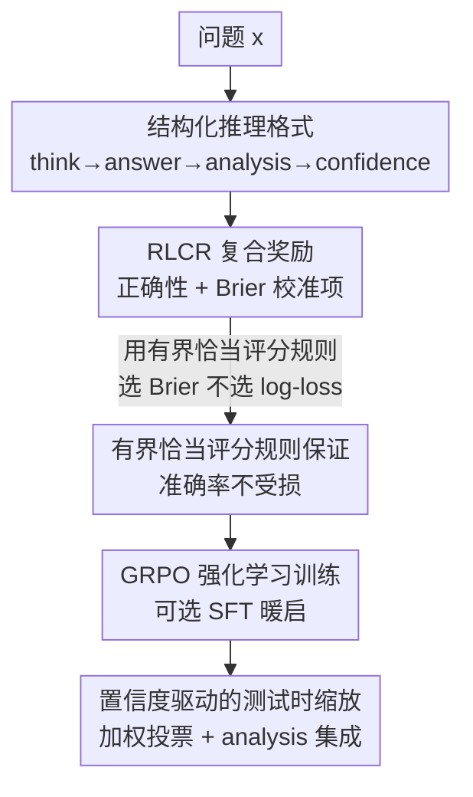

# Beyond Binary Rewards: Training LMs to Reason About Their Uncertainty

**会议**: ICLR2026  
**OpenReview**: [https://openreview.net/forum?id=ASQ649zdHm](https://openreview.net/forum?id=ASQ649zdHm)  
**代码**: 待确认  
**领域**: LLM推理 / 强化学习 / 不确定性校准  
**关键词**: RLVR、校准奖励、Brier 分数、恰当评分规则、置信度推理

## 一句话总结
这篇论文提出 RLCR（Reinforcement Learning with Calibration Rewards），在标准的"二元正确性奖励"上叠加一个 Brier 分数项，让推理模型在给出答案的同时输出一个**校准过的置信度**，在几乎不损失准确率的前提下把期望校准误差从 0.37 降到 0.03（HotpotQA），并在分布外任务上反转了普通 RL"越训越自信、越训越乱"的退化趋势。

## 研究背景与动机
**领域现状**：当下最成功的推理模型（DeepSeek-R1 一类）几乎都用 RLVR（Reinforcement Learning with Verifiable Rewards）训练——给模型一个二元奖励 $R_{\text{correctness}}(y,y^*)=\mathbb{1}_{y\equiv y^*}$，答对得 1、答错得 0，靠它在数学、编程等可验证任务上刷到 SOTA。

**现有痛点**：这个二元奖励有个隐蔽的副作用——它对"自信地答对"和"瞎猜蒙对"给同样的奖励，对"老实弃答"和"自信答错"给同样的惩罚。换句话说，它**鼓励过度自信的猜测**。多项研究证实，即便初始校准良好的模型，经过 RL 训练后也会变得过度自信；推理模型尤其明显，校准恶化、幻觉率升高。在医疗、法律这类高风险场景里，模型不光要准，还要在该犹豫的时候表达犹豫——而 RLVR 恰恰把这个能力训没了。

**核心矛盾**：奖励里只有"对不对"这一个维度，没有任何信号约束"模型对自己有多确定"。准确率和校准之间看似存在 trade-off：如果硬加一个校准惩罚，会不会逼着模型故意输出"确定会错"的答案去换一个小的校准损失？

**本文目标**：拆成两个具体问题——(1) 能不能让推理模型同时为正确性和校准做优化？(2) 推理链本身的内容能不能用来改进校准？

**切入角度**：作者从统计决策论里的**恰当评分规则（proper scoring rule）**入手。一个评分规则被称为"恰当"，当且仅当它的期望在置信度 $q$ 等于真实正确概率 $p$ 时取到最优。Brier 分数 $-(q-\mathbb{1}_{y\equiv y^*})^2$ 就是典型代表。这类规则在天气预报等领域用了几十年，却几乎没被用进 LLM 的 RL 训练。

**核心 idea**：把"二元正确性奖励 + Brier 校准奖励"拼成一个复合奖励，让模型在推理后既输出答案又输出口头置信度（verbalized confidence），用一个模型、一次 RL 就同时学会"答得对"和"知道自己有多对"。

## 方法详解

### 整体框架
RLCR 的改动出奇地小：保留 RLVR 的整套 RL 流程（GRPO 算法、从 base 模型冷启、不加 KL 正则），只动两个地方——**让模型多输出一个置信度标量**，以及**在奖励里多加一个 Brier 项**。

具体地，模型被提示用结构化标签生成输出：先在 `<think>` 里推理、在 `<answer>` 里给答案，再在 `<analysis>` 里专门分析"这题我有多大把握、为什么"、最后在 `<confidence>` 里吐出一个 $q\in[0,1]$ 的置信度。训练时奖励为

$$R_{\text{RLCR}}(y,q,y^*) = \mathbb{1}_{y\equiv y^*} - (q-\mathbb{1}_{y\equiv y^*})^2$$

第一项管"答对"，第二项管"置信度别离真相太远"——答错却高置信、答对却低置信都会被罚。论文进一步用 Theorem 1 证明这个看似有 trade-off 的奖励其实**不牺牲准确率**：在 Bernoulli 假设下，它的期望在 $q=p_y$（真实正确概率）时最大，且在所有校准好的预测里，期望奖励由正确概率最高的那个答案取到。训练完后，口头置信度还能反哺测试时缩放——拿置信度当无需额外监督的代理奖励去做加权投票。

### 关键设计

**1. RLCR 复合奖励：用 Brier 分数把"校准"焊进 RL 目标**

这是全文的核心，直接针对"二元奖励鼓励瞎猜"的痛点。RLVR 的奖励 $\mathbb{1}_{y\equiv y^*}$ 只有 0/1 两挡，对置信度完全失明；RLCR 在它后面减去一个 Brier 项 $(q-\mathbb{1}_{y\equiv y^*})^2$，把"你报的置信度离真实对错有多远"也算进奖励。直观上：答对（$\mathbb{1}=1$）时模型想最大化奖励就得把 $q$ 推向 1，答错（$\mathbb{1}=0$）时就得把 $q$ 推向 0，于是高置信的错答和低置信的对答都被惩罚。妙处在于校准项**不需要任何额外标注**——正确与否本来就在 RLVR 里算好了，Brier 只是把它复用了一次。

**2. 有界恰当评分规则：为什么必须是 Brier，不能是 log-loss**

光说"加个校准项"还不够，作者要回答一个更尖锐的问题：会不会因为有了校准项，模型学会输出"确定答错"的答案来换小损失？Theorem 1 给出否定回答——在 $\mathbb{1}_{y\equiv y^*}\sim\text{Bernoulli}(p_y)$ 的假设下，$R_{\text{RLCR}}$ 的期望同时满足"校准激励"（对任意 $y$，期望奖励在 $q=p_y$ 时最大）和"正确性激励"（在所有校准预测里，正确概率 $p_y$ 最大的答案期望奖励最高）。

关键的细节是：这个保证**依赖评分规则有界**。对数损失 $\mathbb{1}_{y\equiv y^*}\log q+(1-\mathbb{1}_{y\equiv y^*})\log(1-q)$ 虽然也是恰当评分规则，但它无界——当置信度逼近边界时惩罚会冲到无穷，反而可能激励模型输出错误答案。论文给出一般化结论：只要评分规则满足 $S(p,1)-S(p,0)<\lambda$（有界），就存在类似 Theorem 1 的保证。这把"为什么挑 Brier"从工程偏好上升成了理论必然。

**3. 结构化置信度推理：让模型先答后审，把不确定性拉进 CoT**

第二个问题是"推理链内容能否改进校准"。RLCR 不只在奖励上动刀，还在生成格式上设计了 `<think>/<answer>/<analysis>/<confidence>` 四段式：先思考给答案，再单开一段 `<analysis>` 专门复盘"证据是否充分、这题为什么难、我哪里没把握"，最后才落一个数字置信度。这相当于强迫模型把"对答案的元认知"显式写出来，再据此报置信度，而不是凭一个孤立的 token 概率拍脑袋。

消融（Table 2）证明这一段不是摆设：在 RLVR 上仅加 analysis 提示（不改奖励）就能把 OOD 的 ECE 从 0.46 降到 0.39；但它远不如改奖励有效。两个组件**各自独立贡献**校准提升，叠加最好——这也回答了论文开头的第二个问题：推理链内容确实能改进校准。

**4. 置信度驱动的测试时缩放：让校准过的置信度当免费的代理奖励**

既然模型输出的置信度是校准的，它就能在推理时当一个"无需外部奖励模型"的打分器用。论文给出两个简单算法：**max-confidence**（从 N 个候选里选置信度最高的，对应 Best-of-N）和**置信度加权多数投票**（按置信度给每票加权，对应 weighted majority vote）。实验显示置信度加权投票稳定超过普通多数投票、max-confidence 以及基于似然的两个 baseline。另外，对固定答案再采样 $K$ 条 `<analysis>` 链、把它们的置信度平均（$\bar q=\frac1K\sum_i q_i$），可以进一步降低残余噪声、温和改善 Brier——虽然增益有限，因为大多数题目"对不确定性的不确定性"本就很低。

### 损失函数 / 训练策略
基础算法是 GRPO（Group Relative Policy Optimization），从 Qwen2.5-7B base 冷启、不用 KL 正则。数学任务上额外训了一个 `SFT+RLCR` 变体：先用 base 模型在 500 题上采样、用 DeepSeek-R1 生成不确定性分析做轻量 SFT 暖启，再走 RLCR。这个暖启能进一步提升校准，但代价是 OOD 准确率明显下滑（疑似 SFT 引起的灾难性遗忘），所以纯 RLCR 在 OOD 上反而是更稳的取舍。

## 实验关键数据

### 主实验
在 HotpotQA（多跳，含可控的相关段落删除以制造不同信息完整度）和 Big-Math 上训练，并在各自的 6/5 个分布外数据集上评测。指标含准确率、AUROC、Brier、ECE。

| 训练集 | 方法 | 域内 Acc | 域内 ECE | OOD Acc | OOD ECE |
|--------|------|---------|---------|---------|---------|
| HotpotQA | Base | 39.7% | 0.53 | 53.3% | 0.40 |
| HotpotQA | RLVR | 63.0% | 0.37 | 53.9% | 0.46 |
| HotpotQA | RLVR + BCE 分类器 | — | 0.07 | — | 0.24 |
| HotpotQA | **RLCR (本文)** | 62.1% | **0.03** | 56.2% | **0.21** |
| Big-Math | RLVR | 72.9% | 0.26 | 52.5% | 0.49 |
| Big-Math | **RLCR (本文)** | 72.7% | **0.10** | 50.9% | **0.25** |
| Big-Math | SFT+RLCR (本文) | 72.2% | 0.08 | 43.8% | 0.18 |

核心结论：RLCR 的准确率与 RLVR 基本持平（62.1% vs 63.0%、72.7% vs 72.9%），说明校准项不伤准确率；但校准全面碾压——域内 ECE 0.37→0.03、0.26→0.10。更关键的是 **OOD 上 RLVR 让校准恶化（0.40→0.46）而 RLCR 改善校准**（降到 0.21），且 RLCR 甚至略胜需要训练两个大模型的 BCE/Brier 分类器，而后者推理成本翻倍。

### 消融实验
Table 2 拆解"校准奖励"和"显式不确定性推理"两个组件（HotpotQA 训练）：

| 配置 | 域内 ECE | OOD ECE | 域内 Tokens | 说明 |
|------|---------|---------|------------|------|
| RLCR | 0.03 | 0.21 | 249 | 完整方法 |
| RLCR w/o Analysis | 0.09 | 0.26 | 113 | 去掉分析段，仍远超 RLVR |
| RLVR w/ Analysis | 0.34 | 0.39 | 224 | 只加分析提示、不改奖励 |
| RLVR | 0.37 | 0.46 | 92 | 二元奖励基线 |

### 关键发现
- **两个组件独立有效，奖励比提示更重要**：仅给 RLVR 加分析提示能把 ECE 从 0.37 降到 0.34（OOD 0.46→0.39），但远不如改奖励——RLCR w/o Analysis 不带分析段也能到 0.09。
- **效率友好的降级方案**：RLCR w/o Analysis 的 token 数（113）和准确率（61.7%）几乎和 RLVR（92 token / 63.0%）持平，校准却天差地别（ECE 0.09 vs 0.37），是一个低成本 drop-in 替代。
- **置信度自洽**：对同一答案重采样多条分析链，置信度标准差普遍很低，说明"对不确定性的不确定性"小；同一题不同答案的置信度之和，RLCR 紧贴理想值 1，RLVR 则明显超 1（过度自信），不过 OOD 上 RLCR 也仍有残余过度自信。

## 亮点与洞察
- **改动最小、收益最大**：整套方法只是在 RLVR 奖励后面减一个 Brier 项、让模型多吐一个数，却把"RL 越训越过度自信"这个老问题直接反转，工程上几乎零迁移成本。
- **"有界"是被忽视的关键**：直觉上 log-loss 和 Brier 都是恰当评分规则、应该都能用，但论文点破 log-loss 无界会激励错误答案，唯有有界规则才有 Theorem 1 的双重保证——这是一个容易踩坑、值得记住的理论细节。
- **校准本身能反哺准确率**：把校准过的口头置信度拿去做加权投票，无需任何外部奖励模型就超过似然投票，说明"会表达不确定性"不只是安全属性，还能直接转化成测试时性能。
- **单模型共享表征的红利**：用同一个模型既解题又报置信度，让校准任务复用解题过程的内部表征，作者推测这正是 RLCR 在 OOD 上校准泛化更好的原因之一，可迁移到任何需要自评估的生成任务。

## 局限与展望
- **OOD 仍有残余过度自信**：Fig. 4b 显示 OOD 上 RLCR 的置信度之和仍超过 1，校准并未完全解决，分布外鲁棒性还有提升空间。
- **SFT 暖启的双刃剑**：SFT+RLCR 校准最好却在 OOD 准确率上明显掉点（疑似灾难性遗忘），暖启数据与 RL 数据的协调尚未理顺。
- **理论假设较强**：Theorem 1 建立在"成功指示服从 Bernoulli($p_y$)"的假设上，且不区分认知不确定性与偶然不确定性；真实模型的置信度是否真能逼近这个理想 $p_y$，主要靠经验证据支撑。
- **依赖可验证的正确性**：奖励里的 $\mathbb{1}_{y\equiv y^*}$ 需要精确匹配/可验证答案，对开放式生成、无标准答案的任务如何迁移仍是开放问题。

## 相关工作与启发
- **vs RLVR（普通 RL）**：RLVR 只奖励正确性、对置信度失明，导致过度自信和 OOD 校准恶化；RLCR 在同一框架里加一个零额外标注的 Brier 项，准确率持平而校准全面改善，是对 RLVR 的最小侵入式升级。
- **vs 事后置信度分类器（BCE / Brier Classifier / Probe）**：这些方法在 RLVR 输出之上再训一个模型/探针来打分，成本高（两个大模型）且校准弱于 RLCR；RLCR 单模型端到端，既省又好。
- **vs 答案 token 概率（Answer Probability）**：用 `<answer>` 内 token 平均概率当置信度的 baseline 表现很差，因为模型在 CoT 阶段往往已经"想定"答案、token 概率被推高，无法反映真实不确定性——这凸显了让模型**显式推理**不确定性的必要性。
- **启发**：恰当评分规则是一个被 LLM RL 长期忽视的工具箱，"有界恰当评分规则 + RL 奖励"这一范式可推广到任何希望模型输出校准信号的场景（检索、工具调用、agent 的自我评估）。

## 评分
- 新颖性: ⭐⭐⭐⭐ 把恰当评分规则引入 RL 奖励并给出有界性理论保证，角度清晰但单点
- 实验充分度: ⭐⭐⭐⭐⭐ 多任务、域内+OOD、对比 6 种 baseline、组件消融与测试时缩放都覆盖
- 写作质量: ⭐⭐⭐⭐⭐ 问题—理论—实验链条干净，理论细节（有界性）讲得透
- 价值: ⭐⭐⭐⭐⭐ 改动极小却直击 RL 推理模型过度自信的痛点，落地成本低、可复用性强

<!-- RELATED:START -->

## 相关论文

- [\[ICLR 2026\] Rubrics as Rewards: Reinforcement Learning Beyond Verifiable Domains](rubrics_as_rewards_reinforcement_learning_beyond_verifiable_domains.md)
- [\[ICLR 2026\] Learning to Reason as Action Abstractions with Scalable Mid-Training RL](learning_to_reason_as_action_abstractions_with_scalable_mid-training_rl.md)
- [\[ICLR 2026\] Learning to Be Uncertain: Pre-training World Models with Horizon-Calibrated Uncertainty](learning_to_be_uncertain_pre-training_world_models_with_horizon-calibrated_uncer.md)
- [\[ICLR 2026\] ExGRPO: Learning to Reason from Experience](exgrpo_learning_to_reason_from_experience.md)
- [\[NeurIPS 2025\] Training Language Models to Reason Efficiently](../../NeurIPS2025/reinforcement_learning/training_language_models_to_reason_efficiently.md)

<!-- RELATED:END -->
