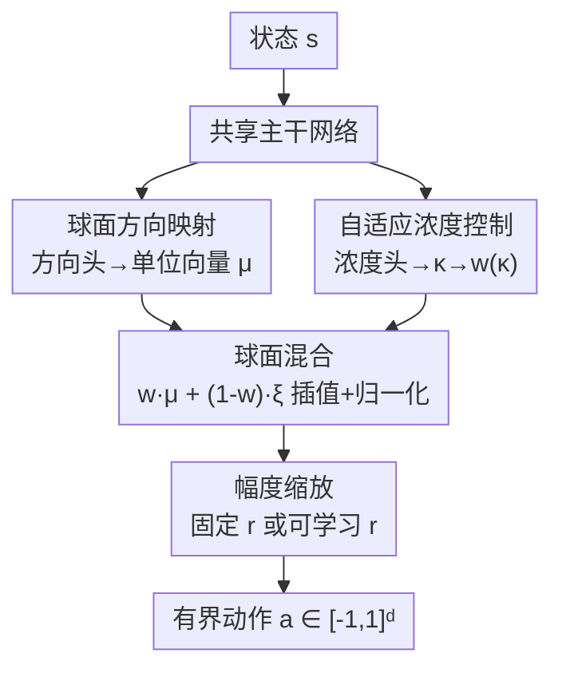

# Beyond Distributions: Geometric Action Control for Continuous Reinforcement Learning

**会议**: ICLR2026  
**OpenReview**: [https://openreview.net/forum?id=6VqCOnTVXa](https://openreview.net/forum?id=6VqCOnTVXa)  
**代码**: 待确认  
**领域**: 强化学习 / 连续控制  
**关键词**: 连续控制, 几何动作生成, 球面策略, 无分布策略, SAC

## 一句话总结
针对高斯策略在有界动作空间里"无界支撑 + tanh 压扁"带来的几何失真，本文提出 GAC（几何动作控制）——把动作生成拆成"单位球面上的方向向量 + 一个可学习的浓度标量"，用球面插值代替概率采样，参数量从 $2d$ 降到 $d+1$、采样复杂度从 $O(dk)$ 降到 $O(d)$，在 6 个 MuJoCo 与 6 个 DMControl 任务上整体追平或超过 SAC（Ant-v4 +37.6%、quadruped-run +112%）。

## 研究背景与动机
**领域现状**：深度强化学习里的连续控制（机器人、自动驾驶等），十多年来默认用**高斯策略**——神经网络输出均值和方差，从 DDPG 到 SAC、PPO、TRPO 都沿用这一选择。它流行的原因纯粹是数学方便：熵有闭式解、重参数化简单、优化性质成熟。

**现有痛点**：高斯分布的支撑是整个 $\mathbb{R}^d$（无界），而物理系统的动作空间是有界的 $[-1,1]^d$。标准补救是用 $\tanh$ 把样本压进有界区间，但这个变换会扭曲分布几何、在边界附近产生梯度消失、并破坏动作空间的天然对称性。训练后期策略越来越确定，动作就往边界堆积，正好落在 $\tanh$ 梯度趋零的区域——作者在 HalfCheetah 上观察到约 40% 的 SAC 训练步会出现这种现象。这类不稳定常被误判为"探索不足"，实质是高斯策略和有界动作空间之间的**几何错配**。

**核心矛盾**：有人转向 von Mises–Fisher（vMF）分布——它直接定义在单位球面上，天然尊重有界约束，理论上很优雅。但优雅的代价是计算昂贵：采样要用拒绝法，复杂度 $O(dk)$（$k$ 是期望拒绝次数，高浓度时接受率可低到 0.1）；密度计算涉及修正 Bessel 函数 $I_v(\kappa)$，大 $\kappa$ 时数值溢出；而且浓度参数对实践者不直观。于是落入两难：要么接受高斯的几何缺陷，要么付出复杂分布的计算代价。

**切入角度**：作者干脆质疑"分布范式本身是否必要"。物理系统里的动作天然可分解成**方向**和**大小**——机械臂朝某方向用某力，汽车以某角度加某速。这暗示有效的动作生成也许根本不需要显式建模概率密度。

**核心 idea**：用**直接的球面几何操作**代替概率采样——网络只输出一个单位方向向量和一个浓度标量，通过"确定方向"与"均匀球面噪声"之间的线性插值生成动作，把从复杂分布采样这件事变成简单的插值，同时保住有界动作空间所需要的几何一致性。

## 方法详解

### 整体框架
GAC 要解决的是"如何在有界动作空间里生成动作"。它彻底抛弃"策略=动作上的概率密度"这一假设，把策略表示成两个网络头：一个**方向头**输出单位球面上的方向 $\mu$，一个**浓度头**输出标量 $\kappa$ 控制探索强度；最终动作由**球面混合**把确定方向和均匀球面噪声插值、归一化、再按半径 $r$ 缩放得到。整个流程没有任何 log 概率、熵项或重参数化技巧——探索不是外部注入的噪声或熵奖励，而是被编织进动作生成结构里的内在几何属性。GAC 作为即插即用的策略模块嵌进 SAC 框架，用 $\kappa$ 取代温度系数 $\alpha$ 控制的熵正则。

### 关键设计

**1. 球面方向映射：把动作的"朝向"约束到单位球面上**

针对高斯策略"无界支撑必须靠 $\tanh$ 压扁"的几何错配，GAC 让方向网络 $f_\mu: \mathcal{S} \to \mathbb{R}^d$ 输出原始向量后直接 L2 归一化：$\mu(s) = f_\mu(s) / \lVert f_\mu(s)\rVert_2$，使 $\mu(s) \in \mathbb{S}^{d-1}$ 始终落在单位球面上。这一步的意义在于：动作的支撑天然就和有界约束对齐，不需要任何压扁函数，因此也不会有边界处梯度消失的问题。它呼应了高维空间的浓度现象——在高维里方向才承载主要的语义信息，幅度反而次要，所以"先定方向"是符合几何直觉的拆解。

**2. 自适应浓度控制：用一个可学习标量 κ 把探索内化进策略结构**

针对 SAC 必须手调温度 $\alpha$、靠外部熵奖励维持探索的麻烦，GAC 用独立网络 $f_\kappa: \mathcal{S} \to \mathbb{R}$ 预测浓度分数，经 sigmoid 变成混合权重 $w(\kappa) = \sigma(\kappa) \in (0,1)$。$w$ 越大动作越确定，越小则噪声占比越高、探索越强。关键是 $\kappa$ 不是外挂的探索旋钮，而是从价值地形里**直接学出来**的：嵌入 SAC 后，actor 目标变成 $L_{\text{actor}}(\phi) = \mathbb{E}_{s\sim D}\big[\kappa(s) - \min_{i=1,2} Q_{\theta_i}(s,a)\big]$，软 Q 目标里也把熵项替换成 $-\kappa(s')$：$y(r_t, s') = r_t + \gamma\big(\min_{i} Q_{\theta'_i}(s', a') - \kappa(s')\big)$。这样 $\kappa(s)$ 就成了一个"软置信度"——在确定的状态给高浓度、在不确定的区域保留多样性——既省掉了温度调度，又比均匀最大化熵更可解释。理论上作者证明（Theorem 1）混合向量的期望恰为 $\mathbb{E}_\xi[v] = w(\kappa)\mu$，即 $\kappa$ 增大时方差消失、样本向 $\mu$ 收缩，实现了**类 vMF 的浓度效果但不需要 Bessel 函数**。

**3. 球面混合：用一次线性插值代替整套分布采样**

这是 GAC 的核心算子，把"从复杂分布采样"压缩成一行插值。动作生成为
$$a = r \cdot \text{normalize}\big(w(\kappa) \cdot \mu + (1-w(\kappa)) \cdot \xi\big),$$
其中 $\xi \sim \text{Uniform}(\mathbb{S}^{d-1})$（由归一化高斯噪声采得，提供球面上各向同性的探索），$r$ 是任务相关的缩放半径（默认 $r=2.5$）。混合后再归一化是关键：即便噪声占比很大（如 $\kappa\approx 1$ 时约 30% 来自 $\xi$），球面归一化也只改方向、不破坏幅度，动作始终连贯。整个采样只有归一化和线性插值两种操作，复杂度 $O(d)$，对比 vMF 拒绝采样的 $O(dk)$（$k$ 典型在 2–10）。同时它彻底免去了密度评估、重参数化和显式熵计算，也绕开了 $\tanh$ 的梯度饱和。

**4. 自适应幅度缩放：给不对称/接触密集任务一个可学习的逐维半径**

固定半径 $r$ 有个几何动机：单位向量在 $\mathbb{R}^d$ 里每维期望幅度约 $1/\sqrt{d}$（$d=17$ 时约 0.24），不缩放的话动作太弱推不动；取 $r=2.5$、典型 $w(\kappa)\approx0.85$ 时，逐维动作幅度落在 0.6–0.9，正好在 $[-1,1]$ 内。但固定半径暗含"所有维度同性"的先验，对四足、鱼类这类**各向异性**的协调任务太死板。于是作者扩展出可学习的逐维幅度向量 $r \in \mathbb{R}^d$（由一个带 softplus 的小网络头输出保证为正），把标量 $r$ 换成逐元素乘：
$$a = r \odot \text{normalize}\big(w(\kappa) \cdot \mu + (1-w(\kappa)) \cdot \xi\big).$$
它保留 GAC 的核心球面结构，又给每个关节/腿独立的幅度自由度，从而在 DMControl 的四足任务上拿到大幅提升。实验显示学到的 $r$ 在约 100K 步后稳定在理论区间 $[1.5, 3.0]$：Walker 类任务收敛到接近均匀的 1.7–2.4（贴近固定 $r=2.5$），Quadruped 类则呈现明显的逐维异质，印证了各向异性控制的需求。

### 损失函数 / 训练策略
GAC 直接复用 SAC 的 actor-critic 训练流程，只把高斯策略换成几何动作生成器：actor 最小化 $L_{\text{actor}}(\phi) = \mathbb{E}_{s\sim D}[\kappa(s) - \min_i Q_{\theta_i}(s,a)]$，critic 用双 Q 网络取最小值做软更新（式见上）。由于动作空间有界、几何操作光滑，软 Bellman 算子仍是收缩映射，保证收敛性。训练 1M 环境步、8 并行环境、5 个随机种子，baseline（SAC/TD3/PPO）用 CleanRL 推荐超参。

## 实验关键数据

### 主实验
六个 MuJoCo 基准（固定半径变体，多数任务 $r=2.5$、Ant-v4 用 $r=1.0$），GAC 在 6 个任务里 4 个夺得最优：

| 环境（动作维度） | GAC | SAC | TD3 | PPO |
|------|------|------|------|------|
| HalfCheetah-v4 (6D) | **12750 ± 758** | 12540 ± 517 | 12208 ± 799 | 1608 ± 793 |
| Ant-v4 (8D) | **5633 ± 158** | 4094 ± 1039 | 3531 ± 1263 | 1969 ± 778 |
| Humanoid-v4 (17D) | **5823 ± 121** | 5717 ± 123 | 5819 ± 278 | 619 ± 59 |
| Walker2d-v4 | **5165 ± 334** | 5152 ± 608 | 4457 ± 457 | 2874 ± 517 |
| Hopper-v4 | 1952 ± 285 | 2094 ± 604 | **2896 ± 749** | 2118 ± 124 |
| Pusher-v4 | -32 ± 0 | **-23 ± 2** | -27 ± 1 | -78 ± 9 |

亮点是高维任务：Ant-v4 上 GAC 比 SAC 高 37.6%、比 TD3 高 59.5%，且方差显著更低；Ant 上约 200K 步即接近最优，而 SAC/TD3 要到 400K 步。短板在 Hopper-v4 和 Pusher-v4——球面归一化偏好"近单位范数"动作，对接触密集/不对称任务有束缚。

DMControl 六个更难的任务（用自适应缩放变体 GAC-Scale），5/6 追平或超过 SAC，四足任务提升 +34%–+112%：

| 环境 | GAC-Scale | SAC | TD3 | PPO |
|------|------|------|------|------|
| quadruped-run | **638 ± 75** | 301 ± 8 | 576 ± 212 | 119 ± 22 |
| quadruped-walk | **925 ± 17** | 690 ± 336 | 873 ± 94 | 131 ± 18 |
| cheetah-run | **762 ± 24** | 661 ± 185 | 753 ± 27 | 150 ± 32 |
| walker-run | **742 ± 15** | 700 ± 56 | 651 ± 87 | 69 ± 16 |
| walker-walk | **960 ± 4** | 956 ± 10 | 952 ± 5 | 186 ± 11 |
| fish-upright | 858 ± 35 | **923 ± 5** | 866 ± 39 | 311 ± 78 |

### 消融实验
HalfCheetah-v4 上对半径 $r$ 和各组件做消融（5 种子均值）：

| 配置 | 最终回报 | 相对变化 | 关键观察 |
|------|---------|---------|---------|
| GAC（默认 $\kappa$，$r=2.5$） | 12750 ± 758 | 基线 | 最优平衡 |
| $r=3.5$ | 12229 ± 422 | -4.1% | 略过度缩放，已饱和 |
| $r=1.5$ | 7272 ± 1235 | -43.0% | 动作幅度严重不足 |
| w/o $\kappa$ 控制器 | 11370 ± 643 | -10.8% | 失去自适应探索 |
| w/o 归一化 | 发散 | N/A | 5k 步内梯度爆炸 |
| 原始动作输出 | 崩溃 | N/A | 无界动作，NaN 损失 |

### 关键发现
- **球面归一化是稳定性的命门**：去掉归一化 5k 步内就因梯度爆炸发散，直接用原始无界输出立刻 NaN 崩溃。归一化让所有动作共享相同范数，消除尺度歧义，相当于一个隐式正则。
- **半径 $r$ 不对称地敏感**：从 2.5 降到 1.5 掉 43%（动作太弱推不动），但升到 3.5 只掉 4.1%（已饱和），说明"够大"比"精确"更重要，$[1.0, 3.5]$ 区间内性能波动 <10%，$r$ 是稳定的几何缩放因子而非脆弱超参。
- **$\kappa$ 提供的自适应探索贡献明确**：去掉可学习 $\kappa$ 掉 10.8% 且收敛变慢，证实"按状态置信度调探索"优于均匀熵正则。

## 亮点与洞察
- **"无分布"的动作生成范式**：最让人"啊哈"的是它质疑了连续控制里"策略必须是概率密度"的默认假设——动作终究是状态的确定函数加随机性，用球面插值直接生成结构化动作，既省掉密度评估/重参数化/熵计算，又天然有界。
- **探索从"外挂"变成"内生"**：随机方向 $\xi$ 不是辅助扰动而是策略结构的一部分，$\kappa$ 作为内生控制信号自适应调节探索-利用，免去温度调度，这个思路可迁移到任何需要在有界空间探索的策略（如机器人关节控制、连续动作的 model-based RL）。
- **用几何"做减法"而非"做加法"**：与 hyperbolic RL / Riemannian 策略用几何增加表达力相反，GAC 用几何来简化，呼应了 TRPO→PPO、DDPG→TD3 这条"简化即创新"的脉络。
- **类 vMF 浓度但无 Bessel 函数**（Theorem 1：$\mathbb{E}_\xi[v]=w(\kappa)\mu$）是个干净的可复用 trick——想要球面上的可控浓度时，混合+归一化是拒绝采样的轻量替代。

## 局限与展望
- **球面先验对不对称/接触密集任务有束缚**：作者自己承认 Hopper-v4、Pusher-v4 上掉点，根因是固定球面归一化偏好近单位范数动作。可学习 $r$ 变体缓解了一部分，但增加了 $2d+1$ 输出、抵消了固定变体 $d+1$ 的参数优势。
- **单作者、benchmark 仅限 MuJoCo/DMControl**：没有真实机器人或更高维、更长视野任务的验证；"几何简洁原则"是否在稀疏奖励、离散-连续混合动作上成立未知。
- **缺乏与 vMF 策略的直接实证对比**：论文主要对比 SAC/TD3/PPO，但动机大量针对 vMF，若能给出 GAC vs vMF 策略的同条件曲线会更有说服力。
- **$\kappa$ 与 SAC 熵框架的理论关系仍偏经验**：把熵项换成 $-\kappa(s)$ 的合理性靠"高浓度对应低熵"的直觉支撑，收缩性证明在附录，但 $\kappa$ 与真实策略熵的定量对应没有完全闭合。

## 相关工作与启发
- **vs 高斯 + tanh 策略（SAC/TD3/PPO）**：它们用无界分布 + 压扁函数适配有界空间，导致边界梯度消失、对称性破坏；GAC 直接在球面上操作，支撑天然有界、梯度一致，参数从 $2d$ 降到 $d+1$。
- **vs vMF 球面策略**：两者都尊重球面几何，但 vMF 要拒绝采样（$O(dk)$）+ Bessel 函数（数值溢出）；GAC 用球面混合（$O(d)$）+ sigmoid 浓度，工程上可落地，且 Theorem 1 给出类 vMF 的浓度控制。
- **vs Beta / 归一化流 / 混合分布**：这些靠增加分布表达力，但 Beta 难扩到多维、流慢 2–3 倍且训练不稳、混合分布加剧边界问题；GAC 反其道用几何结构替代分布复杂度。
- **vs 几何 RL（hyperbolic / Riemannian / 四元数策略）**：同样关注非欧几何，但前者增加算法复杂度换表达力，GAC 把这些零散的几何直觉统一成"用几何做简化"的连续控制框架。

## 评分
- 新颖性: ⭐⭐⭐⭐⭐ 质疑"策略=概率密度"的默认假设，提出无分布的球面几何动作生成，范式层面的转变。
- 实验充分度: ⭐⭐⭐⭐ 12 个任务 + 完整消融，但缺真实机器人验证和与 vMF 的直接对比。
- 写作质量: ⭐⭐⭐⭐⭐ 动机层层递进、公式清晰、消融把每个组件的作用讲透。
- 价值: ⭐⭐⭐⭐ 简单高效、即插即用进 SAC，"几何简洁原则"对连续控制有启发，但球面先验的适用边界需进一步探明。

<!-- RELATED:START -->

## 相关论文

- [\[ICLR 2026\] Learning Massively Multitask World Models for Continuous Control](learning_massively_multitask_world_models_for_continuous_control.md)
- [\[ICLR 2026\] WIMLE: Uncertainty-Aware World Models with IMLE for Sample-Efficient Continuous Control](wimle_uncertainty-aware_world_models_with_imle_for_sample-efficient_continuous_c.md)
- [\[NeurIPS 2025\] Actor-Free Continuous Control via Structurally Maximizable Q-Functions](../../NeurIPS2025/reinforcement_learning/actorfree_continuous_control_via_structurally_maximizable_qf.md)
- [\[ICML 2026\] DR.Q: Debiased Model-based Representations for Sample-efficient Continuous Control](../../ICML2026/reinforcement_learning/debiased_model-based_representations_for_sample-efficient_continuous_control.md)
- [\[ICLR 2026\] Recurrent Action Transformer with Memory](recurrent_action_transformer_with_memory.md)

<!-- RELATED:END -->
