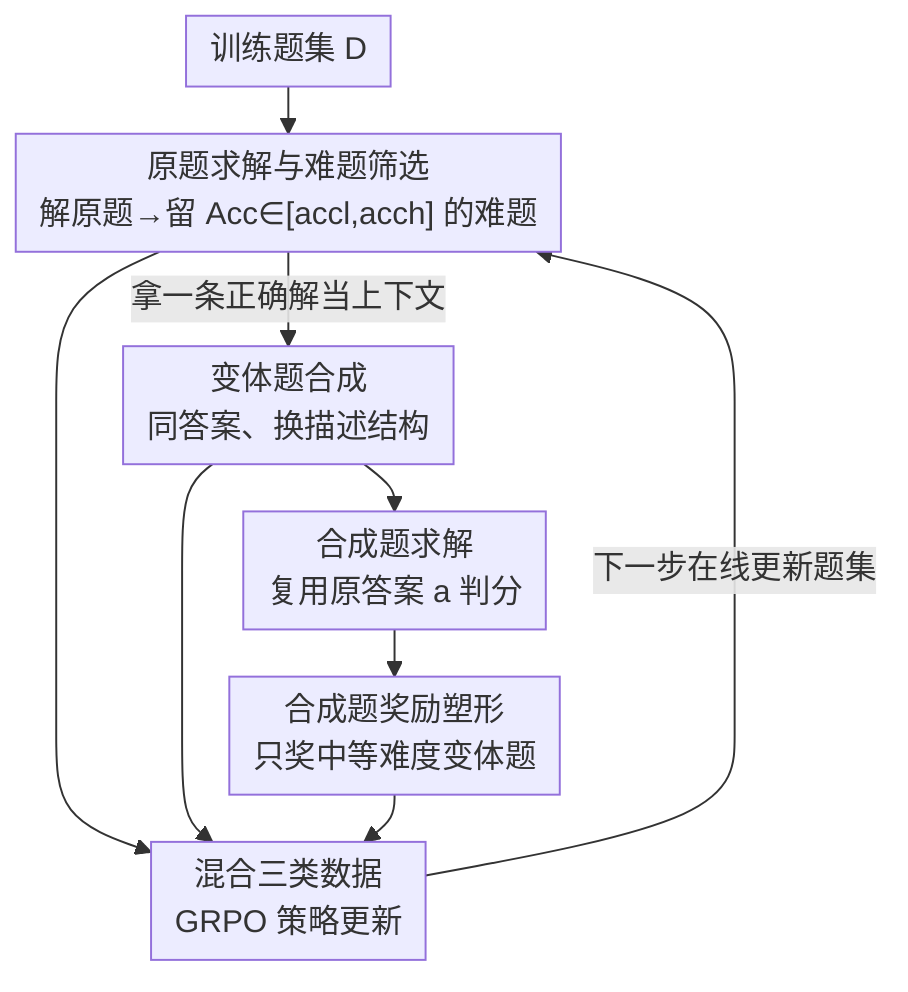

# Beyond Pass@1: Self-Play with Variational Problem Synthesis Sustains RLVR

**会议**: ICLR2026  
**OpenReview**: [https://openreview.net/forum?id=Wjf3OMJxpn](https://openreview.net/forum?id=Wjf3OMJxpn)  
**代码**: https://github.com/MasterVito/SvS  
**领域**: LLM推理 / 强化学习  
**关键词**: RLVR, 自博弈, 问题合成, 策略熵, Pass@k  

## 一句话总结
针对标准 RLVR 训练熵塌缩、Pass@k 停滞的问题，本文提出 **SVS（Self-play with Variational problem Synthesis）**：让策略模型用自己对难题的正确解去"反向"合成一批答案不变的变体新题、再去解这些新题，在线扩充训练数据从而维持策略熵，在 AIME24/25 上把 Pass@32 绝对提升 18.3% / 22.8%。

## 研究背景与动机
**领域现状**：RLVR（Reinforcement Learning with Verifiable Rewards，可验证奖励强化学习）已经成为后训练 LLM、尤其是强化复杂推理能力的主流范式，代表方法是 GRPO 这类把答案对错当奖励的策略优化。

**现有痛点**：近期一批工作（Yue et al. 2025；Cui et al. 2025b）观察到，标准 RLVR 提升 Pass@1 是以牺牲**策略熵**（policy entropy，刻画输出多样性）为代价的——训练久了熵单调下降直到塌缩到接近 0，模型对训练题反复吐出同一条"记住的"正确轨迹来骗奖励，这种行为近似"hacking" RLVR。结果是 Pass@k（k 较大时通常代表 LLM 推理能力的上界）几乎不涨甚至不如 base model，最终连 Pass@1 也因为没探索空间而饱和。

**核心矛盾**：熵与性能之间存在 trade-off，且根因是**在固定的、有限的题集上反复训练**。直觉上的解法是不断换新题、增大数据多样性，但为 RLVR 收集大量带可验证标准答案的高质量新题非常困难：人工标注题集稀缺、且未必匹配现代 LLM 的强推理水平；合成数据虽常用，却缺少精确的参考答案，而参考答案恰恰是 RLVR 唯一的训练信号。

**本文目标**：找一个简单有效的题目增广策略，同时满足三个条件——(1) 可迭代在线更新以持续维持数据多样性；(2) 自带精确参考答案；(3) 与策略当前能力对齐（只增广它"够得着但没掌握"的题）。

**切入角度**：作者先做了一组诊断实验（第 2 节）验证"多样化、周期性更新的题集能减缓熵下降、提升 Pass@k"，并发现外部 LLM 改写题（rephrasing）会引入语义不一致、破坏答案标注、且因为以原题为上下文导致多样性受限。

**核心 idea**：与其向外找题，不如**让策略用自己对难题的正确解来反向合成变体题**——因为正确解包含了原题的全部信息，由它生成的变体题天然共享同一个参考答案，既不用额外标注、又对齐了模型自身能力，纯靠自我改进（self-play）维持训练熵。

## 方法详解

### 整体框架
SVS 把每一步 RLVR 的经验采集（experience collection）从"只解题"扩展成"解题 ↔ 出题"交替的自博弈循环，在线把合成的变体题灌进训练 buffer $B$。一个训练步的数据由三部分构成：(1) **原题求解**——策略对采样的训练题 $x$ 生成一组 $G$ 个解 $\{y_i\}$，按是否命中标准答案 $a$ 给二元奖励，过滤掉全对/全错的组，并挑出"答对了但整体偏难"的欠表现题；(2) **变体题合成**——拿这些难题的某条正确解 $y_i$ 当上下文，让策略生成 $G_v$ 个变体题 $\{\hat{x}_i^j\}$，要求换描述换结构但保持答案不变；(3) **合成题求解**——策略再去解这些变体题，复用原答案 $a$ 判分。三类数据经过过滤与奖励塑形后混合，用 GRPO 统一更新策略 $\pi_\theta$。整套流程只依赖策略模型自己，无任何外部指导或蒸馏，且与具体 RLVR 算法解耦（可接 PPO / GSPO / Reinforce++）。

### 关键设计

**1. 变体题合成：用正确解反向出题，零额外标注拿到新题**

这一步直击"合成题没有精确答案"这个 RLVR 增广的死结。作者的关键观察是：一条正确解 $y_i$ 已经蕴含了原题 $x$ 的全部必要信息，所以把 $y_i$ 当上下文喂回策略、让它"逆向"写出新题，生成的变体题就**天然共享原题的参考答案 $a$**——既省掉了额外标注，又把"答案一致性"当成验证变体题是否合法的天然准则。形式上，对每条正确解 $y_i$ 合成一组 $G_v$ 个变体题 $\{\hat{x}_i^j\}_{j=1}^{G_v}$，它们在结构和措辞上和原题差异显著，从而逼出策略新的/更多样的推理路径。这种"从解到题"的逆映射本身也被纳入奖励训练，迫使策略更深地理解题目的语义和结构，而不只是会解题。

**2. 难题定向增广：只增广模型能力前沿的欠表现题**

如果不加选择地对所有题增广，要么浪费在已掌握的简单题上、要么在完全不会的题上空转。SVS 因此只挑**欠表现题（underperforming problems）**：定义为一组解的平均准确率 $\mathrm{Acc}(x)$ 落在区间 $[\mathrm{acc}_l,\mathrm{acc}_h]$ 内的题，即排除"太简单"和"根本解不出"两端，把增广算力聚焦在和当前模型能力前沿对齐的题上。消融（SvS-Asp，把增广对象换成准确率 37.5%–75% 的简单题）证明：增广简单题只会加速对已掌握能力的过拟合、限制探索，Pass@32 反而更低——说明"挑难题"是这套增广有效的必要条件。注意此处还有一层 GRPO 自带的过滤：原题求解阶段会先剔除整组全对（Acc=1）或全错（Acc=0）的题，因为它们在 GRPO 里优势为零、没有训练信号。

**3. 合成题奖励塑形：只奖"中等难度"的变体题，堵住作弊捷径**

最朴素的合成奖励（Eq. 3）是"只要策略能采到一个对的答案就给变体题正奖励"：$\mathbf{R}_{\mathrm{v}}(\hat{x}_i^j)=\mathbb{I}\left(\mathrm{Acc}(\hat{x}_i^j,a)>0\right)$。但作者发现这极易被策略钻空子——因为变体题是基于正确解生成的，策略会往题目里塞过多提示、甚至直接把答案写进题面，造出一眼能解的"水题"轻松拿奖。这类过简变体题无法激发更强推理，会让整个 pipeline 退化、收敛变差。于是引入奖励塑形约束（Eq. 4），只对**中等难度**的合成题给正奖励：

$$\mathbf{R}_{\mathrm{v}}(\hat{x}_i^j)=\mathbb{I}\left(\hat{\mathrm{acc}}_l \le \mathrm{Acc}(\hat{x}_i^j,a) \le \hat{\mathrm{acc}}_h\right)$$

也就是说，如果一个变体题被策略"全解出来"（太简单、含答案泄漏）或"采不到任何与 $a$ 一致的解"（不可解/答案漂移），都给负奖励。这样就同时压制了"塞提示作弊"和"出无效题"两种退化，保证合成题始终对策略保持适当挑战、提供有效学习信号。

**4. 三类数据联合 GRPO 更新：解题与出题在一个 loop 里互相强化**

经验采集后，训练 buffer $B$ 里有三类 (prompt, response, reward) 三元组：原题求解 $(x,y_i,R_c(y_i,a))$、变体题合成 $(y_i,\hat{x}_i^j,R_v(\hat{x}_i^j))$、合成题求解 $(\hat{x}_i^j,\hat{y}_k,R_c(\hat{y}_k,a))$。其中求解奖励统一是答案命中指示 $R_c(y,a)=\mathbb{I}(\mathrm{Extract}(y)=a)$。这三类数据混在一起按 GRPO 目标更新同一个策略，使它**同时学会**：解给定训练题、为自己造出有挑战的题、解自己造的题——形成一个自我增强的闭环。正是这个"题集永远在变"的在线更新，让策略无法靠记忆少数题刷分，从而把策略熵稳在一个不塌也不爆的区间，支撑长期持续探索。

### 一个完整示例
以一道复多项式求根题为例（论文 Figure 4）：原始难题问"对一族函数 $f_n$ 求所有正虚部根、四舍五入后求和"，策略初始 8 次采样多半答错（如 ❌✔❌✔…），但偶尔能给出一条正确解。SVS 拿这条正确解当上下文去合成变体题，得到三类候选：① 一个换了表述但太抽象的变体，策略采样全 0.0 → 不可解，判 ❌；② 一个保持难度、措辞结构都变了的变体，采样得到 [0,1,1,1,0,1,0,1] 的混合命中 → 中等难度，判 ✔ 留用；③ 一个被策略偷偷塞进解题提示、几乎全对 [1,1,1,1,0,1,1,1] 的"水题" → 太简单，判 ❌。只有第②个变体题进入训练 buffer，既保证答案与原题一致、又维持了挑战性——这就是奖励塑形在实际中如何过滤掉"不可解"和"作弊过简"两端、只留下有效新题。

### 损失函数 / 训练策略
策略更新沿用 GRPO 的组相对优势目标（论文 Eq. 6），对全对/全错组做零优势过滤。模型从 3B 到 32B（Qwen2.5-3B-Instruct、LLaMA-3.1-8B-Instruct、Qwen2.5-32B-Instruct），训练集为 MATH-12k，32B 额外用 DAPO-17k 强化竞赛级推理；为缓解 DAPO 仅整数答案带来的过拟合，还可混入 8k 开放式答案题（DeepMath）得到 D25k 配置。SVS 与优化算法无关，可换插到 PPO / GSPO / Reinforce++。

## 实验关键数据

### 主实验
在 Qwen2.5-32B-Instruct 上，SVS 相比标准 RLVR 在竞赛级基准上的 Pass@1（avg@32）与 Pass@32 均有大幅且持续的提升（Table 1，DAPO-17k 训练）：

| 训练/指标 | AIME24 P@1 | AIME25 P@1 | Avg P@1 | AIME24 P@32 | AIME25 P@32 | Avg P@32 |
|-----------|-----------|-----------|---------|-------------|-------------|----------|
| RLVR (D17k) | 28.8 | 30.0 | 22.5 | 52.5 | 42.4 | 44.6 |
| **SVS (D17k)** | **39.3** | **40.5** | **27.9** | **70.8** | **65.2** | **53.1** |
| ∆ | +10.5 | +10.5 | +5.4 | +18.3 | +22.8 | +8.5 |

MATH-12k 训练下 SVS 的 Pass@32 平均比 RLVR 高 +16.0（Avg 38.6 → 54.6）。跨规模看（Table 2，Pass@1 总均分），SVS 对 3B / 8B / 32B 分别带来约 +2.9 / +1.7 / +2.5 的整体提升，全规模、全基准一致优于 RLVR。

### 消融实验
在 Qwen2.5-32B-Instruct + DAPO-17k 上对比替代增广策略（Table 3，Avg）：

| 配置 | Pass@1 Avg | Pass@32 Avg | 说明 |
|------|-----------|-------------|------|
| RLVR | 22.5 | 44.6 | 标准基线 |
| Ext（延长 RLVR 训练至同样样本量） | 24.6 | 46.3 | 只是堆样本，仍远不如 SVS |
| Eup（对难题加一轮 rollout） | 21.7 | 50.9 | Pass@32 升、Pass@1 降，偏探索 |
| SvS-Asp（增广简单题而非难题） | 22.8 | 42.8 | 加速过拟合，Pass@32 最低 |
| **Full SVS** | **27.9** | **53.1** | 完整方法，两项均最高 |

### 关键发现
- **熵稳定是因，性能持续是果**：Figure 5 显示 RLVR 熵单调下降直至塌缩，而 SVS 把熵稳在一个区间，正对应 Figure 1 里 SVS 的 Pass@1/Pass@32 持续上涨而 RLVR 约 450 步后饱和。
- **真正推开推理边界**：把 Pass@k 从 1 扫到 1024（Figure 6），SVS 在 AIME 全 k 段稳超 RLVR 和 base；MATH-500 上 RLVR 在大 k 反被 base 超越，而 SVS 始终领先——说明涨点不是缩小探索换来的采样效率，而是真扩了推理边界。
- **两条增广铁律**：(1) 响应式增广应聚焦欠表现难题（Eup > SvS-Asp）；(2) 维持题集多样性、在线更新比固定题集更关键（Full SVS > Eup）。延长训练（Ext）只能小涨，证明 SVS 的收益不是单纯"样本变多"。
- **可迁移到代码生成**：第 5.4 节在 TACO / Codeforces / APPS / CodeContests 上，SVS 同样稳超 RLVR 并维持更高熵，说明方法不限于数学。
- **格式过拟合是隐患**：纯 DAPO-17k（仅整数答案）训练会让 SVS 在开放式答案基准上掉点，混入开放式题（D25k）后恢复并取得最佳总分。

## 亮点与洞察
- **"从解反向出题"是点睛之笔**：用正确解当上下文生成变体题，一举解决合成数据"没有精确答案"的核心难题——答案天然继承自原题，零额外标注，这是整套自博弈能闭环的关键。
- **奖励塑形堵住了 self-play 的退化口**：自出题最大的风险是策略"出水题骗奖"，作者用"只奖中等难度"把它精准堵死，这个 reward hacking 的发现与修法很有迁移价值，凡是让模型自我生成训练信号的范式都该警惕同类作弊。
- **把熵当成可观测的训练健康指标**：诊断实验直接展示"更新题集 → 熵止跌回升 → Pass@k 提升"的因果链，给 RLVR"为什么会饱和、怎么救"提供了清晰的机制解释。
- **算法解耦、纯自改进**：不依赖外部教师/蒸馏、与 PPO/GSPO/Reinforce++ 等正交，工程上容易嫁接到现有 RLVR 流水线。

## 局限与展望
- **作者承认的格式过拟合**：在仅整数答案的 DAPO-17k 上 SVS 会过拟合答案格式，导致开放式基准掉点，需要靠混入开放式题来缓解——说明变体题的"答案不变"约束在答案空间单一时会放大格式偏置。
- **验证机制是"代理"而非真验证**：合成题的正确性靠"策略能否采到与原答案一致的解"来近似（Eq. 4），并非真正核验题目语义是否守恒；若策略系统性地用错误推理凑对答案，可能放进噪声题。原文也将其标注为 proxy criterion。
- **难度阈值依赖超参**：欠表现区间 $[\mathrm{acc}_l,\mathrm{acc}_h]$ 与奖励塑形区间 $[\hat{\mathrm{acc}}_l,\hat{\mathrm{acc}}_h]$ 都是人为设定，对不同模型/数据集的鲁棒性、如何自适应未充分展开。
- **改进思路**：可引入更强的语义一致性校验（如交叉模型互验答案、或对变体题做答案分布检验），并探索把难度区间随训练进度自适应调度。

## 相关工作与启发
- **vs 标准 RLVR / GRPO**：它们在固定题集上优化、提升 Pass@1 但熵塌缩、Pass@k 停滞；SVS 通过在线自合成新题维持熵，主打把 Pass@k 推上去、再反哺 Pass@1。
- **vs 外部 LLM 改写增广（rephrasing，如 MetaMath）**：改写题靠外部模型、易引入语义不一致破坏答案标注，且以原题为上下文导致多样性受限；SVS 用策略自己的正确解出题，答案天然守恒、纯自改进、对齐自身能力。
- **vs "难题加 rollout"的探索增强（Eup 这类）**：单纯给难题多采几轮能提 Pass@32 但牺牲 Pass@1；SVS 既维持多样性又靠正确解利用，两项指标同时拿下，证明"多样性 + 难题聚焦"缺一不可。

## 评分
- 新颖性: ⭐⭐⭐⭐⭐ "用正确解反向出题保证答案守恒"的自博弈增广视角很巧，干净地绕开了合成数据无答案的死结。
- 实验充分度: ⭐⭐⭐⭐⭐ 3B–32B、12 个推理基准 + 代码生成、Pass@k 扫到 1024、四个替代策略消融，证据链完整。
- 写作质量: ⭐⭐⭐⭐ 机制叙述清晰、诊断实验与方法衔接好；部分阈值/超参细节散在附录。
- 价值: ⭐⭐⭐⭐⭐ 直击 RLVR 熵塌缩这一核心痛点，方法算法解耦、易嫁接，对持续可扩展的 RLVR 训练有实际意义。

<!-- RELATED:START -->

## 相关论文

- [\[ICLR 2026\] Self-Harmony: Learning to Harmonize Self-Supervision and Self-Play in Test-Time Reinforcement Learning](self-harmony_learning_to_harmonize_self-supervision_and_self-play_in_test-time_r.md)
- [\[ICLR 2026\] SPELL: Self-Play Reinforcement Learning for Evolving Long-Context Language Models](spell_self-play_reinforcement_learning_for_evolving_long-context_language_models.md)
- [\[ICLR 2026\] SPIRAL: Self-Play on Zero-Sum Games Incentivizes Reasoning via Multi-Agent Multi-Turn Reinforcement Learning](spiral_self-play_on_zero-sum_games_incentivizes_reasoning_via_multi-agent_multi-.md)
- [\[ICLR 2026\] Goedel-Prover-V2: Scaling Formal Theorem Proving with Scaffolded Data Synthesis and Self-Correction](goedel-prover-v2_scaling_formal_theorem_proving_with_scaffolded_data_synthesis_a.md)
- [\[ICLR 2026\] MATH-Beyond: A Benchmark for RL to Expand Beyond the Base Model](math-beyond_a_benchmark_for_rl_to_expand_beyond_the_base_model.md)

<!-- RELATED:END -->
