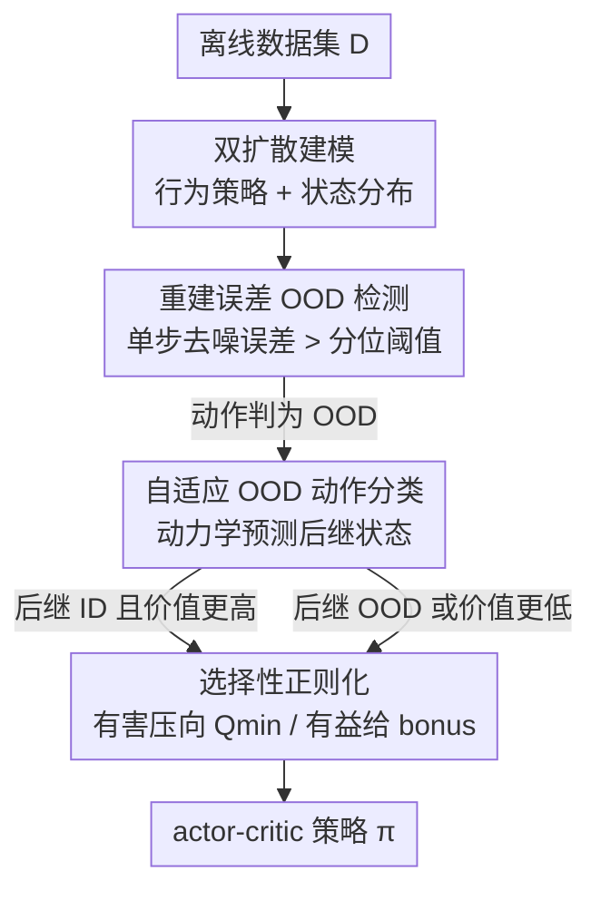

# Beyond Penalization: Diffusion-based Out-of-Distribution Detection and Selective Regularization in Offline Reinforcement Learning

**会议**: ICLR2026  
**OpenReview**: [https://openreview.net/forum?id=a4DbIONcpb](https://openreview.net/forum?id=a4DbIONcpb)  
**代码**: https://github.com/7ingw24/DOSER  
**领域**: 强化学习 / 离线RL  
**关键词**: 离线强化学习, 分布外检测, 扩散模型, 选择性正则化, 价值高估

## 一句话总结
DOSER 用两个扩散模型分别建模行为策略与状态分布，以单步去噪重建误差作为可靠的 OOD（分布外）指标，再借动力学模型把 OOD 动作细分为"有益"与"有害"两类，对前者给奖励、对后者才惩罚，从而在离线 RL 中既压住价值高估又不扼杀有潜力的探索，在 D4RL 上尤其在次优数据集上刷出领先成绩。

## 研究背景与动机

**领域现状**：离线强化学习只从静态数据集 $D=\{(s,a,r,s')\}$ 中学策略，不与环境交互，适合机器人、医疗、自动驾驶这类在线探索昂贵或危险的场景。但把标准 off-policy 算法直接搬到离线设定会遇到分布漂移：当策略生成的动作偏离数据分布时，价值函数会向未见区域错误外推，造成严重的价值高估，最终训练崩溃。

**现有痛点**：主流缓解手段分两类——策略约束法（让学到的策略贴近行为策略，多用 VAE 建模行为分布）和价值正则法（学习对 OOD 动作做惩罚的保守 Q 函数）。两者都有硬伤：VAE 难以刻画真实行为的多模态结构，常把多样动作塌缩成低密度区里的"平均"动作；价值正则法则普遍在整个 out-of-support 区域施加**均匀惩罚**，把那些本可提升性能的有价值探索也一并压死。

**核心矛盾**：问题根子在于"OOD 识别不准" + "惩罚一刀切"这两个相互纠缠的缺陷。识别端依赖表达力有限的分布模型（VAE 的单模态高斯假设），分不清哪些动作真在分布外；处置端又不区分 OOD 动作的好坏，于是保守性与探索性之间被强行对立。近期 CCVL、ACL-QL、DoRL-VC 试图细粒度调节保守程度，但要么靠 Q-ensemble 增加训练开销，要么继承了关于行为策略的强高斯假设，仍然识别不准。

**本文目标**：把"识别 OOD"和"处置 OOD"两件事都做对——既要一个不依赖强分布假设、能刻画多模态行为的 OOD 检测器，又要一套能区分有益/有害 OOD 动作、对症下药的正则化策略。

**切入角度**：作者注意到扩散模型天然擅长捕捉复杂多模态分布，而"加噪后单步去噪的重建误差"恰好可作为一个 likelihood-free 的分布贴合度代理——离分布越远，重建越差。再叠加一个动力学模型预测 OOD 动作会把系统带到哪个后继状态，就能判断这次越界是"踩坑"还是"捡漏"。

**核心 idea**：用扩散重建误差代替 VAE 似然来精准检测 OOD，再用预测后继状态的价值来区分有益/有害 OOD 动作，从而把"均匀惩罚"升级为"选择性正则化"——惩罚有害、奖励有益。

## 方法详解

### 整体框架
DOSER（Diffusion-based OOD Detection and SElective Regularization）的输入是离线数据集 $D$，输出是一个在 actor-critic 框架下学到的策略 $\pi_\varphi$。它先在预训练阶段拟合两个扩散模型（行为策略 $\hat\pi_\beta(a|s)$ 与状态分布 $d_0(s)$）和一个动力学模型 $p_\psi(s'|s,a)$，并在训练集上算出重建误差的分位数阈值 $\tau_a,\tau_s$；随后进入策略优化循环：每步先用扩散重建误差判断策略动作是否 OOD，再用动力学模型预测后继状态、结合状态 OOD 判定与价值比较把 OOD 动作分成有益/有害两类，最后在 critic 损失里对有害动作压向 $Q_{min}$、对有益动作给一个自适应 bonus。

### 关键设计

**1. 双扩散模型分别建模行为策略与状态分布：用生成模型替掉单模态高斯假设**

针对"VAE 识别不准、塌缩多模态"的痛点，DOSER 训练两个基于 EDM 框架的扩散模型。一个是条件扩散模型，学习经验行为策略 $\hat\pi_\beta(a|s)$，去噪网络 $\epsilon_{\theta_a}(a_t,\sigma_t,s)$ 的训练目标是从加噪动作 $a_t=a_0+\sigma_t\epsilon$ 重建干净动作：$L(\theta_a)=\mathbb{E}\big[\lambda(\sigma_t)\|a_0-\epsilon_{\theta_a}(a_t,\sigma_t,s)\|_2^2\big]$。另一个无条件扩散模型学习状态分布 $d_0(s)$，目标同理 $L(\theta_s)=\mathbb{E}\big[\lambda(\sigma_t)\|s_0-\epsilon_{\theta_s}(s_t,\sigma_t)\|_2^2\big]$。之所以用扩散而非 VAE，是因为扩散模型能自然捕捉多模态分布，避免把多样行为压成一个平均动作——这正是后续 OOD 判定可靠性的根基。这里两个模型各管一摊：动作扩散用于判"动作越界没有"，状态扩散用于判"动作会不会把系统带到没见过的状态"。

**2. 单步去噪重建误差作为 OOD 指标：likelihood-free 的分布贴合度度量**

有了扩散模型，如何判 OOD？DOSER 不做显式密度估计，而是用重建误差当代理。对策略优化时遇到的状态-动作对 $(s,a_0)$，采一个噪声尺度 $\sigma_t$、加噪成 $a_t=a_0+\sigma_t\epsilon$，定义动作 OOD 分数为原动作与去噪结果的 L2 距离 $E_a(s,a_0)=\|a_0-\epsilon_{\theta_a}(a_t,\sigma_t,s)\|_2$；状态同理 $E_s(s_0)=\|s_0-\epsilon_{\theta_s}(s_t,\sigma_t)\|_2$。指标函数为 $I_{ood}(a_0)=\{E_a(s,a_0)>\tau_a\}$、$I_{ood}(s_0)=\{E_s(s_0)>\tau_s\}$，阈值 $\tau_a,\tau_s$ 取训练集重建误差的第 $p$ 百分位，$p$ 直接控制保守程度。这套设计有三个好处：重建误差是 likelihood-free 的、直接衡量数据流形贴合度而无需密度估计；扩散模型刻画多模态分布、避开单模态高斯假设；每个样本只需一次前向传播、检测高效。作者还指出用**随机采样多个扩散时间步**而非固定噪声尺度能提升鲁棒性，因为不同噪声尺度对应数据分布中不同程度的信息瓶颈。

**3. 自适应 OOD 动作分类：用预测后继状态把"越界"分成捡漏与踩坑**

检测出 OOD 还不够——均匀惩罚会误伤有潜力的探索。DOSER 引入一个两阶段评估，借预训练动力学模型 $p_\psi(s'|s,a)$ 预测 OOD 动作 $a_{ood}$ 的后继状态 $s'_\pi$，再沿两个维度判断好坏：其一，$s'_\pi$ 是否仍在分布内（由状态重建误差 $E_s$ 判定）；其二，若在分布内，$V(s'_\pi)$ 是否超过 $V(s'_{id})$——其中 $s'_{id}$ 是执行最优 ID 动作 $a^*_{id}=\arg\max_{a\sim\pi_\beta}Q(s,a)$ 后的预测后继状态。形式化为有益集与有害集：$A^+_{ood}:=\{a\mid E_s(s'_\pi)\le\tau_s \wedge V(s'_\pi)\ge V(s'_{id})\}$，$A^-_{ood}:=\{a\mid E_s(s'_\pi)>\tau_s \vee V(s'_\pi)<V(s'_{id})\}$。直白说：只有"越界后落点仍在分布内、且比老老实实选最优 ID 动作还更值钱"的动作才算有益，其余一律算有害。实现上最优 ID 动作近似为从行为策略采 $N=10$ 个候选取 Q 最大者。这一步把 OOD 处理从二分类（ID/OOD）升级成对后果负责的细粒度判别。

**4. 选择性正则化的 critic 损失：惩罚有害、奖励有益的双重项**

分类之后，处置才落地。DOSER 的策略评估损失在标准 Bellman 误差之外加了两项相反方向的正则：对有害 OOD 动作，把 $Q_\theta(s,a)$ 拉向理论最小值 $Q_{min}=R_{min}/(1-\gamma)$（系数 $\beta$）以抑制高估；对有益 OOD 动作，给一个自适应 bonus，目标设为 $\eta(Q_{\theta'}(s,a^*_{id})+\delta_V)$（系数 $\lambda$），其中 $\delta_V=V(s'_\pi)-V(s'_{id})$ 衡量这次越界相对最优 ID 动作多赚了多少价值。完整损失为：

$$L(\theta)=\mathbb{E}_{D}\big[(Q_\theta-(R+\gamma\,\mathbb{E}_{a'\sim\pi_\beta}Q_{\theta'}))^2\big]+\beta\,\mathbb{E}\big[I(a\in A^-_{ood})(Q_\theta-Q_{min})^2\big]+\lambda\,\mathbb{E}\big[I(a\in A^+_{ood})(Q_\theta-\eta(Q_{\theta'}(s,a^*_{id})+\delta_V))^2\big]$$

这个 bonus 补偿了价值估计在 OOD 区域的外推误差、把策略往高价值区引，即便 OOD 动作的 Q 估计本身还不准也能起作用——这正是"beyond penalization"的题眼。理论上作者证明该算子是 $\gamma$-收缩，因而有唯一不动点且价值估计有界；并给出在模型近似误差与 OOD 检测误差下相对最优策略的渐近性能保证。

### 损失函数 / 训练策略
价值网络仿 IQL 用 expectile 回归 $L_\tau^2$ 训练；动力学模型 $p_\psi$ 以 $\|p_\psi(\cdot|s,a)-s'\|_2^2$ 监督回归；策略 $\pi_\varphi$ 用最大熵正则 $L(\varphi)=\mathbb{E}[\alpha\log\pi_\varphi(\cdot|s)-Q_\theta(s,a)]$ 优化、$\alpha$ 动态调节以维持目标熵。整体流程为：先预训练动力学与两个扩散模型并算阈值，再在每次迭代中依次更新 critic（含选择性正则）、actor 与 target 网络。

## 实验关键数据

### 主实验
在 D4RL 基准（Gym-MuJoCo v2、Adroit v1）上，与策略约束（TD3+BC/IQL/A2PR）、价值正则（CQL/SVR/ACL-QL）与扩散类（DQL/SfBC/IDQL/QGPO/SRPO/DTQL）多类基线对比，报告 4 个随机种子末次迭代平均归一化分数。

| 数据集 | 指标 | DOSER | A2PR | SVR | DTQL | 说明 |
|--------|------|-------|------|-----|------|------|
| halfcheetah-m-r | 归一化分 | **63.0 ± 1.1** | 56.6 | 52.5 | 50.9 | 次优数据集优势明显 |
| hopper-m | 归一化分 | **104.0 ± 0.5** | 100.8 | 103.5 | 99.6 | 领先 |
| MuJoCo-v2 平均 | 归一化分 | **93.2** | 93.0 | 91.4 | 88.7 | 整体最高 |
| Adroit-v1 平均 | 归一化分 | **83.6** | - | 71.7 | 72.7 | 大幅领先 |
| pen-human | 归一化分 | **87.8 ± 14.7** | - | 73.1 | 64.1 | 难任务上突出 |

DOSER 在"medium"与"medium-replay"这类含大量次优、异质行为的设定上优势尤其突出，印证了精准 OOD 检测 + 选择性正则的价值。

### 消融实验

| 配置 | MuJoCo 代表任务（hopper-m / halfcheetah-m-r） | 说明 |
|------|---------|------|
| DOSER w/o AC and VC | 102.1 / 58.8 | 只用扩散重建误差检测 OOD，均匀惩罚不分好坏 |
| DOSER w/o VC | 99.4 / 61.9 | 加入动作分类，只惩罚有害动作、不给 bonus |
| DOSER（Full） | **104.0 / 63.0** | 完整：分类 + 价值补偿 |

### 关键发现
- 即便只剩扩散检测 + 均匀惩罚（w/o AC and VC），已能与现有 SOTA 打平，说明**扩散重建误差作为 OOD 检测器本身就很强**——这是方法的地基。
- 均匀惩罚会过度压制有益 OOD 动作导致掉点；加入分类（w/o VC）只罚有害动作即明显回血；再加价值补偿（Full）进一步提升，验证细粒度分类 + 补偿确实在保守与探索间取得更好平衡。
- 在 1D 导航玩具任务与 MuJoCo 上，扩散重建误差对 ID/OOD 的区分都显著优于 model ensemble、MC dropout 和 CVAE 重建误差——后者因过平滑重建而对异常动作不敏感。
- 阈值分位 $p$（80/90/99 百分位）控制保守程度，是主要敏感超参。

## 亮点与洞察
- **把"重建误差"从异常检测搬到离线 RL 的 OOD 动作识别**：扩散单步去噪误差是个 likelihood-free、计算只需一次前向、且天然多模态的指标，比 VAE 似然干净得多，这套思路可迁移到任何需要"判断样本是否在支撑集内"的 RL 子问题。
- **"越界不等于该罚"的判别框架很巧**：用动力学模型预测后继状态、再用状态 OOD + 价值比较把 OOD 动作二分为捡漏/踩坑，把保守性从"区域级一刀切"细化到"按后果定夺"，这是对 conservatism 的一次有意义的解耦。
- **自适应 bonus $\delta_V$ 的设计**：它衡量越界相对最优 ID 动作多赚的价值，即使 OOD 动作 Q 估计不准也能引导策略向高价值区移动，是"beyond penalization"的关键机制。
- 理论上还补了 $\gamma$-收缩与渐近性能保证，给经验方法兜了底。

## 局限与展望
- 整套流程要额外训两个扩散模型 + 一个动力学模型，预训练与采样开销高于纯 VAE 方法；虽然 EDM 把采样步数压到几十步，但相比单次 VAE 前向仍重。
- 有益/有害分类高度依赖动力学模型 $p_\psi$ 的预测精度与价值估计 $V$ 的可靠性——在高维或随机性强的环境里，动力学预测误差会直接污染分类结果（作者的渐近保证也是建立在 OOD 检测/模型误差有界的前提上）。
- 阈值 $\tau_a,\tau_s$ 取训练集分位数，跨数据集质量（expert/medium/random）是否需要重调、对分位 $p$ 的敏感性在不同任务上如何，仍需更系统的研究。
- 实验集中在 D4RL 连续控制（MuJoCo/Adroit），离散动作空间、像素观测等场景尚未验证。

## 相关工作与启发
- **vs CQL / SVR（均匀惩罚的价值正则）**：它们对整个 out-of-support 区域一刀切惩罚，DOSER 用扩散精准检测 + 选择性正则，只罚有害、还奖励有益，因而在次优数据上不扼杀探索。
- **vs A2PR（动作判别 + CVAE）**：A2PR 的判别器只作用于增强 CVAE 识别出的 ID 动作，把策略学习限制在可能不准的支撑集近似里；DOSER 直接针对 OOD 动作做判别，且用扩散而非 CVAE 检测，识别更准。
- **vs DoRL-VC / ACL-QL（细粒度保守）**：前者靠 VAE 检测器分 OOD 属性、继承高斯假设，后者把行为策略建成高斯并学权重函数，都受单模态假设限制；DOSER 以扩散摆脱该假设。
- **vs DQL / IDQL 等扩散类离线 RL**：它们主要把扩散用于表达式行为克隆/策略表示，DOSER 则把扩散用于 OOD 检测并叠加显式动作分类，得到更精细的价值估计。

## 评分
- 新颖性: ⭐⭐⭐⭐ 把扩散重建误差用于离线 RL 的 OOD 检测、并配上"有益/有害"选择性正则，组合新颖且动机清晰
- 实验充分度: ⭐⭐⭐⭐ D4RL 多域多基线 + 玩具任务可视化 + 组件消融 + 敏感性分析，较完整；但限于连续控制
- 写作质量: ⭐⭐⭐⭐ 动机—方法—理论—实验链条顺畅，图 1/图 2 把核心直觉讲清
- 价值: ⭐⭐⭐⭐ 给离线 RL 的"如何不一刀切地处理 OOD"提供了可迁移的检测+处置范式，理论保证也较扎实

<!-- RELATED:START -->

## 相关论文

- [\[ICLR 2026\] ADM-v2: Pursuing Full-Horizon Roll-out in Dynamics Models for Offline Policy Learning and Evaluation](adm-v2_pursuing_full-horizon_roll-out_in_dynamics_models_for_offline_policy_lear.md)
- [\[ICLR 2026\] One-Step Flow Q-Learning: Addressing the Diffusion Policy Bottleneck in Offline RL](one-step_flow_q-learning_addressing_the_diffusion_policy_bottleneck_in_offline_r.md)
- [\[ICLR 2026\] DEAS: DEtached value learning with Action Sequence for Scalable Offline RL](deas_detached_value_learning_with_action_sequence_for_scalable_offline_rl.md)
- [\[ICLR 2026\] Accelerating Diffusion Planners in Offline RL via Reward-Aware Consistency Trajectory Distillation](accelerating_diffusion_planners_in_offline_rl_via_reward-aware_consistency_traje.md)
- [\[NeurIPS 2025\] Structural Information-based Hierarchical Diffusion for Offline Reinforcement Learning](../../NeurIPS2025/reinforcement_learning/structural_information-based_hierarchical_diffusion_for_offline_reinforcement_le.md)

<!-- RELATED:END -->
