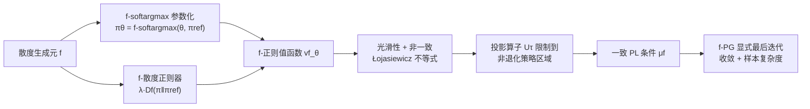

# Beyond Softmax and Entropy: Convergence Rates of Policy Gradients with $f$-SoftArgmax Parameterization & Coupled Regularization

**会议**: ICLR 2026  
**OpenReview**: [https://openreview.net/forum?id=O93c9H4SXc](https://openreview.net/forum?id=O93c9H4SXc)  
**代码**: [https://github.com/Labbi-Safwan/f-regularised-policy-gradient](https://github.com/Labbi-Safwan/f-regularised-policy-gradient)  
**领域**: reinforcement learning / policy gradient theory  
**关键词**: 策略梯度, softmax 参数化, f-散度, Tsallis 散度, 最后迭代收敛, 样本复杂度  

## 一句话总结
把 RL 里默认的「softmax 参数化 + 熵正则」换成「$f$-softargmax 参数化 + 同源 $f$-散度正则」这对**耦合搭档**，作者证明耦合后的正则目标满足 Polyak-Łojasiewicz 不等式，从而首次给出无需预条件的随机策略梯度**显式最后迭代收敛保证**；其中 Tsallis 散度把 softmax 的指数级样本复杂度改进为多项式级。

## 研究背景与动机
**领域现状**：策略梯度（TRPO/PPO 这类）是现代 RL 的基石，但其收敛行为对一些看似底层的设计选择极度敏感，其中策略参数化是核心一环。离散控制场景里默认选 softmax 参数化、并配上熵正则，这套组合几乎成了不假思索的标配。

**现有痛点**：近年的理论工作揭示了 softmax 的根本缺陷——无正则时它会在优化地形上制造极其平坦的区域（图 1a），导致收敛速率有一个不可避免的**指数级下界**（Li et al. 2023）。人们引入熵正则想缓解，但即便加了熵，地形依旧平坦，至今没有任何多项式收敛保证。已有的两条补救路线也都不理想：预条件（如自然策略梯度）能改善病态但更新代价高、难扩展；log-barrier 正则虽给出多项式速率却没有最后迭代保证、实践中不稳定。

**核心矛盾**：大家一直在「softmax 内部换正则器」上打转，却没人质疑过 softmax 本身。问题是——**真正限制收敛的到底是正则器，还是参数化这个底座**？

**本文目标**：把策略参数化本身当成一个可设计的对象，跳出 softmax，寻找能让优化地形天然良态、且不依赖预条件 / 指数级 batch 的参数化。

**核心 idea**：**（耦合设计）** 用 $f$-散度的生成元 $f$ 同时诱导出参数化（$f$-softargmax）和正则器（$f$-散度），让二者共享同一个 $f$。这种「同源耦合」把经典的 softmax-熵搭档推广为一整个家族；当选 Tsallis 散度时，优化地形被显著改善，收敛速率比 softmax-熵指数级地快。

## 方法详解

### 整体框架
方法围绕「参数化与正则器必须是一对耦合搭档」这一核心信念展开：先用 $f$-散度生成元定义 $f$-softargmax 参数化（softmax 是其 KL 特例），再用同一个 $f$ 诱导的 $f$-散度作正则器，二者天然匹配（最优正则策略恰好就是某个 $f$-softargmax）。在这个耦合结构上，作者逐层建立正则值函数的正则性——光滑性、非一致 Łojasiewicz 不等式，再借助一个「投影到非退化策略区域」的算子把它升级成一致的 Polyak-Łojasiewicz（PL）条件，最终在 PL 框架下给出随机策略梯度算法 f-PG 的显式收敛与样本复杂度。

### 关键设计

**1. $f$-softargmax 参数化：用散度生成元统一一整族参数化。** 给定严格凸、$f(1)=0$ 的生成元 $f$ 和满支撑参考分布 $q$，定义 $f\text{-softargmax}(x,q):=\arg\max_{\nu\in\mathcal P(A)}\{\langle\nu,x\rangle - D_f(\nu\|q)\}$，策略则为 $\pi^f_\theta(\cdot|s):=f\text{-softargmax}(\theta(s,\cdot),\pi_{\mathrm{ref}}(\cdot|s))$。取 KL 生成元就退化成熟悉的 softmax，取 Tsallis（$0<\alpha<1$）则得到 $\pi\propto\nu_{\mathrm{ref}}(1+(\alpha-1)(x-\mu^\alpha_x))^{1/(\alpha-1)}$ 这类「重尾但仍光滑」的新参数化。这一族每个成员都只需解一个一维求根问题（二分法）即可计算，工程上廉价。值得注意的是 $\alpha>1$ 的 Tsallis 因 $f'(0)$ 有限会诱导**稀疏**（非光滑）策略，被排除在分析之外。

**2. 参数化与正则器同源耦合：让参数化恰好对齐正则问题的几何。** 作者没有把参数化孤立地挑选，而是从 $f$-正则问题的最优解结构反推：$f$-正则 MDP 的最优策略满足 $\pi^f_\star(\cdot|s)=f\text{-softargmax}(q^f_\star(s,\cdot)/\lambda,\pi_{\mathrm{ref}})$。这意味着只要令 logits $\theta^f_\star=q^f_\star/\lambda+b(s)$，$f$-softargmax 就**精确复现**最优正则策略。换言之，在这种耦合下「学策略」等价于「学正则最优 Q 函数」，正则器不是外加的惩罚而是从最优策略的变分刻画里自然长出来的。正是这种「参数化↔正则器」的几何对齐，才让后续的良态分析成为可能——用熵正则去配 Tsallis 参数化是配不上的。

**3. 从非一致 Łojasiewicz 到一致 PL：靠投影算子砍掉退化策略。** 作者先证耦合目标 $v^f_\theta(\rho)$ 是 $L_f$-光滑的，并满足非一致 Łojasiewicz 不等式 $\|\nabla_\theta v^f_\theta(\rho)\|^2\ge\mu_f(\theta)(v^f_\star-v^f_\theta)$，其系数 $\mu_f(\theta)\propto\min_{s,a}w^f_\theta(a|s)^2$ 会随策略趋于确定性而退化为 0。证明思路很干净：用 $f$-softmax 的二阶 Taylor 展开把次优间隙写成 $\frac\lambda2(\zeta^f_\theta)^\top\nabla^2 f\text{-softmax}(\xi)\zeta^f_\theta$，再配合梯度下界，避开了 softmax-熵证明里强依赖对数特殊性质的技巧，因而能推广到一般 $f$。为把系数一致下界，作者设计了一个投影类算子 $U_\tau$，把任何「太确定」（某动作概率逼近 0）的策略拉回到阈值 $\pi_{\mathrm{ref}}\tau$ 之上，并证明这样做只会**提高**正则值（这些退化策略可证次优）。在合适阈值 $\tau_\lambda$ 下，$\mu_f$ 在受限区域上获得一致下界 $\underline\mu_f$，于是非一致 Łojasiewicz 被升级为一致 PL 条件。

**4. f-PG 算法与显式收敛：在 PL 框架下做带投影的 REINFORCE。** 算法 f-PG 每步采一批长度 $H$ 的截断轨迹，用 REINFORCE 式估计器 $g^f_Z(\theta)$ 估计 $\nabla v^f_\theta$，再做带投影的更新 $\theta_{t+1}=T_{\tau_\lambda}(\theta_t+\eta g^f_{Z_t}(\theta_t))$。在 PL 条件 + 估计器偏差/方差界（$\|g^f-\nabla v^f_\theta\|\le\beta_f$、方差 $\le\sigma_f^2/B$）下，作者证明 $\mathbb E[\Delta_t]\le(1-\tfrac{\eta\underline\mu_f}{4})^t\Delta_0+\tfrac{6\eta\sigma_f^2}{B\underline\mu_f}+\tfrac{6\beta_f^2}{\underline\mu_f}$，且所有常数都对问题参数显式可写——这是该类方法**首个不靠预条件、不靠指数级 batch 的显式最后迭代保证**。把温度 $\lambda$ 调到 $O((1-\gamma)\epsilon)$ 还能把结论搬到无正则目标上，最终的样本复杂度由 $(f^\star)''$ 的渐近行为主导：$(f^\star)''$ 增长越快、条件数越好、收敛越快。代入具体 $f$ 后得到鲜明对比——softmax-熵（KL）的样本数随 $\exp(1/((1-\gamma)\epsilon))$ 指数爆炸，而 $\alpha$-Tsallis 只随 $1/(1-\gamma)$ **多项式**增长；进一步还能解出最优精度自适应的 $\alpha^\star(\epsilon)\approx 11/(2\log(1/\epsilon))$，说明最佳 $\alpha$ 既不是 0 也不是 1，而随目标精度变化。

## 实验关键数据

实验目的不是刷分，而是证明这套理论框架能无缝塞进现代 on-policy 算法：作者把 PPO 的参数化和熵正则同时替换成 Tsallis 版本，得到 **$\alpha$-Tsallis PPO**，在两类环境上对比标准 PPO。

### 主实验设置

| 环境 | 设置 | 考察点 |
|------|------|--------|
| Noisy CartPole | 标准 + 奖励加噪 $\sigma^2\in\{0.5,2.0,10.0\}$ | 高方差回报下的稳健性 |
| DeepSea | 网格尺寸 $L\in\{20,30,40,50\}$，稀疏奖励 | 深度探索能力 |

每条曲线取该 $\alpha$ 下最优温度与步长，阴影为 25 个随机种子的 ±1 标准误。

### 关键发现
- **Noisy CartPole**：$\alpha<1$ 在标准与低噪设置下系统性优于 PPO baseline，且**噪声越大优势越明显**（$\sigma^2=10$ 时差距最大）——重尾 Tsallis 参数化对高方差回报更稳健。
- **DeepSea**：随网格 $L$ 增大，相对 PPO 的提升越发显著；最难的 $L=40,50$ 上 $\alpha=0.7$ 取得最高回报和最快学习——深度探索任务偏好中间 $\alpha$。
- **没有万能 $\alpha$**：高噪环境与深探索问题偏好 Tsallis 家族的不同区域，印证理论里「最优 $\alpha$ 依赖问题与精度」的结论，支持把「参数化-正则器搭档」做成可调超参。

## 亮点与洞察
- **把参数化从「孤立选择」提升为「与正则器耦合的几何对象」**，是本文最锋利的视角转换：参数化好不好不能脱离正则器单独评判，二者必须同源匹配才能良态。
- **首个显式、无预条件、无指数 batch 的最后迭代保证**，把过去靠 NPG 预条件或 log-barrier 才能拿到的多项式速率，用「换参数化」这一更轻量的方式实现。
- **理论指导超参**：$\alpha^\star(\epsilon)\approx 11/(2\log(1/\epsilon))$ 给出了一个可操作的、随精度自适应的散度选择法则，而非拍脑袋调参。
- 证明技术上摆脱了 softmax-熵证明对对数特殊性质的依赖，改用 Taylor 展开，这是能推广到整个 $f$-散度家族的关键。

## 局限与展望
- **理论局限在有限 tabular MDP**：所有显式常数与 PL 分析都建立在有限状态/动作 + 满支撑参考策略 + $\rho_{\min}>0$ 探索假设之上，连续/函数逼近场景尚无保证。
- **生成元假设排除稀疏策略**：$\alpha>1$ 的 Tsallis 因非光滑被排除，意味着该框架暂时覆盖不了「天然稀疏」这一实用区域。
- **温度 $\lambda$ 需取得足够小**才能保证 PL 条件成立，且无正则结论是靠精心调 $\lambda$ 间接得到的，实践中如何选仍需工程化。
- **实验规模偏小**：仅 CartPole / DeepSea 两类玩具环境，$\alpha$-Tsallis PPO 在 Atari / MuJoCo 等大规模任务上的表现尚未验证；样本复杂度 $\epsilon^{-12}$ 这类阶数离实用还有距离。

## 相关工作与启发
- **softmax 策略梯度的指数下界**（Mei et al. 2020a/b; Li et al. 2023）是本文要绕开的痛点根源；**escort transform**（Mei et al. 2020a）与 **Hadamard 参数化**（Liu et al. 2025）是同方向的替代参数化尝试，但前者依赖递增步长、不适用随机梯度，后者无显式常数，本文以「更灵活的家族 + 随机设置显式保证」胜出。
- **耦合参数化-正则器**的思想借自监督学习（Blondel et al. 2020; Roulet et al. 2025），本文首次系统搬进 RL。
- 与 **(lazy) mirror descent** 的辨析很有启发：f-PG 在「对偶参数 $\theta$」上求梯度，而 mirror descent 在策略 $\pi$ 上求梯度并隐含一个策略 Jacobian 逆的预条件项——这正是 f-PG 能保持可扩展性的原因。
- 最优 $\alpha$ 随精度变化的结论与 **bandit 文献**（Zimmert & Seldin 2021）相互印证，提示 Tsallis-softargmax 在更广的在线学习里也可能加速。

## 评分
- **新颖性**: ⭐⭐⭐⭐⭐ 把「参数化与正则器同源耦合」这一视角系统引入 RL，并由此拿到该类首个显式最后迭代保证，思想原创度高。
- **实验充分度**: ⭐⭐⭐ 概念验证清晰（噪声/探索两类任务上 Tsallis 优于 PPO），但环境为玩具规模，缺大规模基准与统计显著性的系统比较。
- **写作质量**: ⭐⭐⭐⭐ 动机—结构—证明—实验脉络连贯，图 1 的地形可视化与 Table 1 的定位对比都很到位；不足是公式密集、对非理论读者门槛偏高。
- **价值**: ⭐⭐⭐⭐ 为「跳出 softmax」提供了坚实理论依据和可操作的 $\alpha$ 选择法则，对策略梯度收敛理论与 PPO 实践都有指导意义，但落地到大规模仍需后续工作。

<!-- RELATED:START -->

## 相关论文

- [\[ICLR 2026\] Does “Do Differentiable Simulators Give Better Policy Gradients?” Give Better Policy Gradients?](does_do_differentiable_simulators_give_better_policy_gradients_give_better_polic.md)
- [\[ICLR 2026\] ResT: Reshaping Token-Level Policy Gradients for Tool-Use Large Language Models](rest_reshaping_token-level_policy_gradients_for_tool-use_large_language_models.md)
- [\[ICLR 2026\] Relative Entropy Pathwise Policy Optimization](relative_entropy_pathwise_policy_optimization.md)
- [\[ICLR 2026\] Convergence of an actor-critic gradient flow for entropy regularised MDPs in general spaces](convergence_of_an_actor-critic_gradient_flow_for_entropy_regularised_mdps_in_gen.md)
- [\[ICLR 2026\] Beyond Penalization: Diffusion-based Out-of-Distribution Detection and Selective Regularization in Offline Reinforcement Learning](beyond_penalization_diffusion-based_out-of-distribution_detection_and_selective_.md)

<!-- RELATED:END -->
