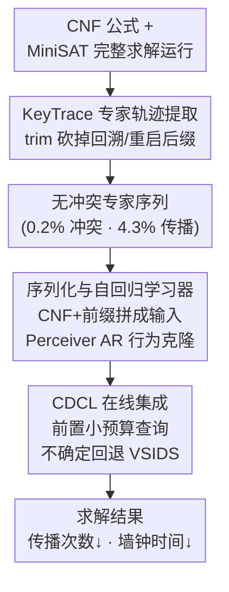

# Boolean Satisfiability via Imitation Learning

**会议**: ICLR2026  
**arXiv**: [2509.25411](https://arxiv.org/abs/2509.25411)  
**代码**: [https://github.com/zewei-Zhang/ImitSAT](https://github.com/zewei-Zhang/ImitSAT)  
**领域**: 强化学习  
**关键词**: SAT, 模仿学习, CDCL, 分支策略, 自回归, Transformer  

## 一句话总结
提出 ImitSAT，首个基于模仿学习的 CDCL 求解器分支策略：通过将求解器运行压缩为无冲突的 KeyTrace 专家序列，将分支决策建模为前缀条件的自回归预测任务，以少量查询预算显著减少传播次数和求解时间，并在结构化 SAT 问题上展现良好泛化能力。

## 研究背景与动机

**领域现状**：布尔可满足性问题 (SAT) 是理论 CS 和 AI 的基石。现代求解器以 CDCL 框架为主，其中分支（branching）决策决定搜索轨迹，而单元传播 (unit propagation) 占运行时间的 80%-90%。

**现有痛点**：
   - 经典分支启发式（如 VSIDS）是手动设计的，适应性有限
   - SATformer 仅在初始化时调整变量活跃度，搜索开始后无法影响分支
   - Graph-Q-SAT 使用强化学习在线代理，但 RL 需要大量探索、奖励稀疏不稳定，且仅基于当前状态快照，不利用完整历史

**核心洞察**：传播占 CDCL 运行时间约 88.9%（MiniSAT 实测），因此减少传播次数是加速求解的主要路径。高质量的分支决策能直接减少传播。

**切入角度**：用模仿学习替代强化学习——从专家轨迹中直接学习，获得密集的决策级监督信号，避免探索开销。

## 核心问题
如何从 CDCL 求解器的运行轨迹中提取高质量的专家信号，并训练一个可即插即用的分支策略来减少传播次数？

## 方法详解

### 整体框架
ImitSAT 想解决的是 CDCL 求解器里「分支该选哪个变量」这件事——分支决定了搜索轨迹，而占去 80%-90% 运行时间的单元传播又被分支牵着走，所以一个好的分支策略能直接把传播次数压下来。它的做法分两步：先把一次完整的求解器运行「榨干」成一条只保留有用决策的专家轨迹（KeyTrace），再用这条轨迹训练一个自回归模型，让它在求解时根据「到目前为止走过的路径」预测下一步该分哪个变量。训练好的模型作为插件挂进标准 CDCL 求解器，每个决策点查一次，不确定时退回原来的 VSIDS，其余组件原封不动。

### 关键设计

**1. KeyTrace 专家轨迹提取：把冗长的求解器运行压成一条无冲突的专家序列**

原始的 CDCL 运行轨迹 $\mathcal{T}_t$ 里塞满了走错被回溯掉的死路，直接拿来当监督信号既冗长又混入大量噪声。KeyTrace 的思路是从左到右扫描这条轨迹、维护一个工作序列 $\mathcal{K}$：遇到决策或传播事件就直接追加；一旦遇到回溯事件，就用 $\text{trim}_{\leq h}$ 把所有高于回溯层级 $h$ 的后缀事件砍掉，再接上新的决策；重启则视为裁剪到层级 0。这样保留下来的全是「最终存活、真正通向解」的决策。压缩效果极为夸张——重放一条 KeyTrace 只需原始 MiniSAT 运行 0.2% 的冲突、19.6% 的决策、4.3% 的传播，几乎不再产生冲突，正好成为干净、密集的专家示范，这也是模仿学习能稳过强化学习的根本原因。

**2. 序列化与自回归学习器：把分支决策建模成前缀条件的下一个变量预测**

分支决策天生依赖「已经走过的前缀历史」，这和自回归语言模型预测下一个 token 的结构完全契合，于是把 CNF 公式和当前 KeyTrace 前缀拼成统一输入喂给模型：`[CNF] || F_DIMACS || [SEP] || enc(K_t) || [D]`，其中末尾的 `[D]` 是决策探针标记，提示模型「在此处输出下一个签名变量」。训练用行为克隆，最小化专家决策的负对数似然（即交叉熵）。骨干网络选 Perceiver AR（Hawthorne et al., 2022），它把输出潜在数组长度压到 1，使每次查询复杂度从 $O(N^2)$ 降到 $O(N)$，对动辄上百变量的 SAT 实例尤为关键；具体配置为 16 头注意力、12 个 Transformer 块。

**3. CDCL 在线集成：小预算查询 + 前置调度，不确定就退回 VSIDS**

推理时模型作为即插即用分支器挂进求解器，每个决策点只以很小的查询预算（每个实例 3-5 次）问一次学习器，模型不确定时直接回退到 VSIDS，因此完备性不受影响——传播、冲突分析、子句学习这些 CDCL 组件全部保持不变。预算怎么花有讲究：采用前置查询调度（front-loaded），把有限的查询集中在求解初期，因为早期决策对整棵搜索树的形状影响最大，越靠后单次决策的边际收益越小。

### 训练策略
两个增强手段让模型在小数据上学得更稳。**变量置换增强**随机打乱变量 ID 来构造等价但形式各异的训练样本，有效缓解过拟合——不加增强时验证损失会先降后升。**分阶段课程学习**从小规模变量起步、逐步扩展到大规模，加速模型在简单实例上的收敛。

## 实验关键数据

### 主实验：随机 3-SAT 测试集 (MRPP $\tilde{r}$↓, 越低越好)

| 方法 | 5-15 | 16-30 | 31-60 | 61-100 | 50 | 100 |
|------|------|-------|-------|--------|-----|-----|
| Graph-Q-SAT (3calls) | 1.00 | 0.94 | 0.89 | 1.15 | 0.71 | 0.85 |
| SATformer | 1.00 | 0.89 | 0.84 | 0.78 | 0.88 | 0.81 |
| **ImitSAT (3calls)** | **0.75** | **0.83** | **0.75** | **0.78** | **0.74** | **0.76** |

ImitSAT 在几乎所有变量范围上取得最低 MRPP，且 1% 胜率 $W_{1\%}$ 也是最高的（3calls 下所有范围最佳）。

### 泛化：结构化 SAT 家族 (MRPP $\tilde{r}$↓)

| 方法 | JNH | AIM | PARITY | PHOLE | PRET |
|------|-----|-----|--------|-------|------|
| Graph-Q-SAT (5calls) | 1.11 | 1.18 | 0.56 | 0.82 | 0.92 |
| SATformer | 1.36 | 1.01 | 0.73 | 1.00 | 1.00 |
| **ImitSAT (5calls)** | **0.85** | **0.81** | **0.30** | **0.82** | **0.42** |

仅在随机 3-SAT 上训练，无需微调即可泛化到结构化问题，在 PARITY 和 PRET 上优势尤为明显。

### 墙钟时间
- 在较难的 61-100 变量范围，ImitSAT 达到最低墙钟时间（传播节省超过查询开销）
- 在较易的 16-30、31-60 范围，纯 MiniSAT 仍更快，但 ImitSAT 是最强的学习方法且差距很小

## 亮点与洞察
- **首个基于模仿学习的 CDCL 分支策略**：避免了 RL 的探索不稳定性，提供密集的决策级监督信号
- **KeyTrace 设计精巧**：将冗长的求解器轨迹压缩到极致（4.3% 传播），且重放几乎无冲突，是理想的专家信号
- **前缀条件建模与序列预测的自然契合**：分支决策本质上依赖前缀历史，自回归模型完美匹配这一结构
- **即插即用**：不改变 CDCL 其他组件，保持完备性，仅需少量查询（3-5次/实例）

## 局限与展望
- 受限于上下文窗口，仅在 ≤100 变量的实例上训练和评估，未扩展到工业级大规模实例
- 在简单实例（16-30 变量）上，模型推理开销无法被传播节省覆盖，墙钟时间不如纯 MiniSAT
- 当前使用 Python 版 MiniSAT，C++ 实现可能进一步扩大效率差距
- 未探索混合模仿-强化学习方案（论文自身提到的 future work）
- 课程学习和查询预算调度的最优策略尚需更系统的研究

## 与相关工作的对比
- **vs SATformer**：SATformer 仅在初始化时影响 VSIDS 分数，搜索中不再干预；ImitSAT 在搜索过程中直接指导分支，更直接
- **vs Graph-Q-SAT**：GQSAT 用 RL + 当前状态快照，奖励稀疏且不利用历史；ImitSAT 用 IL + 完整前缀历史，训练更稳定
- **vs MIP branch-and-bound 的 IL 方法**：MIP 的 B&B 是单调树搜索；SAT 的 CDCL 有非单调搜索、重启和子句学习，动态更复杂。ImitSAT 训练全序列的自回归策略而非局部排序模型

## 评分
- 新颖性: ⭐⭐⭐⭐ 首次将模仿学习引入 CDCL 分支，KeyTrace 专家构造方法新颖
- 实验充分度: ⭐⭐⭐⭐ 多种 SAT 家族、消融、墙钟时间评估全面，但变量规模受限
- 写作质量: ⭐⭐⭐⭐ 动机到方法的推导连贯清晰，KeyTrace 的可视化直观
- 价值: ⭐⭐⭐⭐ 为学习增强 SAT 求解开辟了新方向，但实际工业应用仍需突破规模瓶颈

<!-- RELATED:START -->

## 相关论文

- [\[ICLR 2026\] Latent Wasserstein Adversarial Imitation Learning](latent_wasserstein_adversarial_imitation_learning.md)
- [\[ICLR 2026\] On Discovering Algorithms for Adversarial Imitation Learning](on_discovering_algorithms_for_adversarial_imitation_learning.md)
- [\[NeurIPS 2025\] Quantifying Generalisation in Imitation Learning](../../NeurIPS2025/reinforcement_learning/quantifying_generalisation_in_imitation_learning.md)
- [\[ICLR 2026\] Model Predictive Adversarial Imitation Learning for Planning from Observation](model_predictive_adversarial_imitation_learning_for_planning_from_observation.md)
- [\[ICML 2026\] Noise-Guided Transport: Imitation Learning from Random Priors](../../ICML2026/reinforcement_learning/noise-guided_transport_for_imitation_learning.md)

<!-- RELATED:END -->
