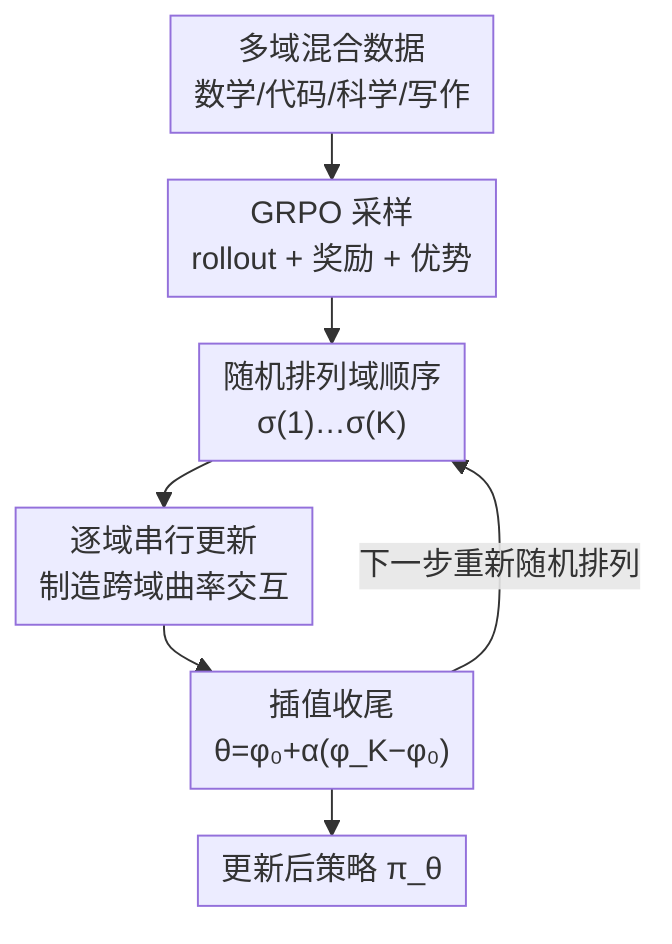

# Boosting Multi-Domain Reasoning of LLMs via Curvature-Guided Policy Optimization

**会议**: ICLR2026  
**OpenReview**: [https://openreview.net/forum?id=R2EZtdHWJT](https://openreview.net/forum?id=R2EZtdHWJT)  
**代码**: https://github.com/MIRALab-USTC/CGPO  
**领域**: 强化学习 / RLHF / LLM 推理  
**关键词**: 多领域 RL、跨域冲突、曲率引导、梯度对齐、GRPO  

## 一句话总结
针对多领域 RL 训练 LLM 时「学好数学就学坏写作」的跨域冲突问题，CGPO 借鉴牛顿法「用曲率给梯度做预条件」的思想，但不显式算 Hessian，而是把一个 batch 拆成各领域子 batch、**按随机顺序逐域串行更新**——后更新的域天然感受到先更新域留下的曲率扰动，从而在期望上等价于最大化各域梯度内积、隐式对齐跨域梯度；在 Qwen2.5-3B/7B、四领域七基准上平均分稳超联合训练与梯度均衡基线（7B 59.59 vs 联合 56.62），且几乎零额外开销。

## 研究背景与动机
**领域现状**：用 RL（PPO、GRPO）提升 LLM 的推理能力已成主流，近期工作从单领域（只刷数学或只刷代码）走向**多领域联合训练**——把数学、代码、科学问答、创意写作等混在一个数据集里，期望训出一个全能模型。

**现有痛点**：多领域混合训练会产生极其复杂、互相打架的奖励面。经验研究反复观察到**跨域冲突**：某个能力涨了，往往以另一个能力掉点为代价。更糟的是 RL 的在线采样（rollout）让不同域样本之间的交互不可预测，而生成 rollout 又很贵，一旦跨域梯度互相抵消，这些昂贵的算力就白费了。

**核心矛盾**：跨域冲突本质上表现为**梯度冲突**，但现有缓解手段在「RL for LLM」这个场景下都不好使。一类是梯度均衡/投影方法（PCGrad、CAGrad、FAMO 等），它们在冲突发生后被动地去平衡或投影各域梯度——既不利用奖励面的几何结构，在 rollout 噪声梯度上反而放大方差、损害稳定性；而且大多需要**同时把所有域的梯度存在显存里**操作，显存随域数快速膨胀，动辄 OOM，根本扩不到 LLM。另一类是二阶方法（牛顿法、SOAP），它们确实能用曲率信息化解梯度冲突（已在 PINN 上验证），但要算/求逆 Hessian，在 LLM 这种高维、rollout 密集的设定下完全不可行。

**本文目标**：找到一种**既契合 RL 本质（噪声梯度、在线采样）、又能在规模上高效**的跨域冲突缓解机制，从而提升 LLM 的多领域推理能力。

**切入角度**：作者重新审视牛顿更新 $H^{-1}g$ 的结构。把它做一个启发式展开，$H^{-1}g \approx 2g - Hg + \dots$，在多域设定下 $g=\sum_k g_k$、$H=\sum_k H_k$，于是 $-Hg$ 里就含有**跨域项** $-H_j g_i\ (i\neq j)$——即域 $j$ 的曲率去调制域 $i$ 的梯度。正是这种「一个域的曲率搅动另一个域的梯度」的耦合，让二阶方法能协调冲突梯度。作者的洞察是：**我不需要真去算 Hessian，只要想办法把这种跨域曲率-梯度耦合「制造」出来就行**。

**核心 idea**：用「按随机顺序逐域串行更新」来隐式制造 $H_j g_i$ 这种跨域曲率-梯度交互——先更新的域改动了参数，后更新域在新参数处的梯度自然吸收了前者的曲率信息；对域顺序做随机化后，所有域对在期望上都被耦合，最终等价于推动各域梯度内积变大、把参数引向跨域一致的区域。

## 方法详解

### 整体框架
CGPO（Curvature-Guided Policy Optimization）以 GRPO 为基础策略梯度算法，要解决的是「多领域混合 RL 时怎么不让各域互相拆台」。一次更新步内，它做的事可以概括为：先像普通多域训练那样对所有域采样 rollout、算奖励与优势；然后把原本要「一次性聚合所有域梯度做一步」的更新，改成「**把各域梯度按一个随机排列依次走一遍**」，每个域在前面所有域更新留下的新参数处计算并应用自己的梯度；最后把这一串串行更新后的参数 $\phi_K$ 与起点 $\phi_0$ 做插值 $\theta_{\text{new}}=\phi_0+\alpha(\phi_K-\phi_0)$ 收尾。

关键在于，这套串行流程的参数总变化量可以近似拆成两项：一项是普通的**聚合梯度**（每个域各自学习），另一项是 $\sum H_{\sigma(k)}g_{\sigma(l)}$ 这样的**跨域曲率-梯度交互项**（域之间互相传递曲率、协调更新）。后者正是单纯一阶联合训练所没有、却又是缓解冲突所需要的成分。整套机制只是把一个 mini-batch 切成几块顺序处理 + 一次向量插值，几乎不增加计算量。

### 关键设计

**1. 串行逐域更新：不算 Hessian 也能拿到跨域曲率交互**

这是 CGPO 的核心，直接针对「想要 $H_j g_i$ 的跨域耦合，却付不起 Hessian 计算」这个痛点。作者的做法是用「**观察一个域的梯度在另一个域更新后如何变化**」来近似曲率-梯度乘积。考虑两个域 $i,j$：让域 $i$ 先把参数从 $\theta^{(i)}_{\text{pre}}$ 更新到 $\theta^{(i)}_{\text{post}}$，那么域 $j$ 的梯度变化按一阶 Taylor 展开就是

$$g_j\big(\theta^{(i)}_{\text{post}}\big)-g_j\big(\theta^{(i)}_{\text{pre}}\big)\approx H_j\big(\theta^{(i)}_{\text{pre}}\big)\big(\theta^{(i)}_{\text{post}}-\theta^{(i)}_{\text{pre}}\big)\approx \eta\,H_j\big(\theta^{(i)}_{\text{pre}}\big)\,g_i\big(\theta^{(i)}_{\text{pre}}\big),$$

正好就是想要的 $H_j g_i$。也就是说，**只要让域 $j$ 在域 $i$ 更新后的参数上算梯度，曲率信息就自动注入进来了**，全程只用一阶梯度，没碰二阶量。CGPO 因此把一步更新拆成 $K$ 个域按顺序走（算法 1 的 Line 13-14）：从 $\phi_0=\theta_{\text{new}}$ 出发，第 $k$ 个域在 $\phi_{k-1}$ 处更新得到 $\phi_k$，每个域的梯度按其 mini-batch 占比 $\frac{|D_{\sigma(k)}|}{\sum_s|D_{\sigma(s)}|}$ 缩放（避免多次更新把有效学习率放大）。展开可证，单趟串行后的参数变化里，除了聚合梯度项 $-\frac{\eta}{K}\sum_k g_k$，还多出二阶交互项 $\frac{\eta^2}{K^2}\sum_k\sum_{l<k}H_{\sigma(k)}g_{\sigma(l)}$——这正是联合训练「一次聚合一步」拿不到的东西。

**2. 随机化域顺序：让所有域对都被对称耦合，隐式对齐跨域梯度**

如果域顺序固定，串行更新只会产生「靠前的域单向影响靠后的域」这种有偏交互——早更新的域主导更新方向，晚更新的域只能被动适应。设计 1 给的交互项 $\sum_{l<k}H_{\sigma(k)}g_{\sigma(l)}$ 也只覆盖了部分有序对。作者的解法是**每个 iteration 重新随机抽一个域排列 $\sigma$**。对 $\sigma$ 取期望后，任意有序对 $(i,j)$ 出现概率相等，对称化它们的贡献就得到

$$H_i(\phi_0)g_j(\phi_0)+H_j(\phi_0)g_i(\phi_0)=\frac{\partial}{\partial\phi_0}\big(g_i(\phi_0)^\top g_j(\phi_0)\big),$$

即更新在期望上沿着「**增大各域梯度内积 $g_i^\top g_j$**」的方向走——这正是梯度对齐（让不同域的梯度尽量同向、减少互相抵消）的数学刻画。直观上：每个域都「感受到」其他域的曲率，一个域轻推参数、另一个域随之响应，产生协调一致的更新来调和冲突目标。消融实验也证实随机顺序（59.59）确实优于固定顺序 CGPOfix（58.48）。

**3. 插值系数 α：在「稳定」与「充分利用曲率」之间调档**

串行走完得到的方向 $\phi_K-\phi_0$ 是一个被跨域交互富化过的「几何感知更新方向」，但直接整步走可能走出局部光滑区、让一阶近似失效而训练不稳。CGPO 因此用 $\theta_{\text{new}}=\phi_0+\alpha(\phi_K-\phi_0)$ 做最后插值：$\alpha$ 控制沿这个方向走多远。$\alpha$ 太小则更新退化为近似恒等、白白浪费了串行交互攒下的信息；$\alpha$ 太大又像学习率开太猛会失稳。实验里 $\alpha=1.2$ 最优，且 $0.9/1.2/1.5$ 三个取值的平均分都超过最强基线 FAMO（57.26），说明方法对 $\alpha$ 不敏感；同时 $\alpha$ 都接近 1.0，说明插值并没有实质改变有效学习率——**增益确实来自曲率感知的串行更新，而非步长调整**。

### 损失函数 / 训练策略
基础目标是 GRPO 的裁剪 + KL 正则代理目标（式 1）。作者特别论证了「**代理目标是忠实的梯度近似器**」：PPO 的裁剪、GRPO 的裁剪 + KL 都让 $\nabla_\theta L$ 在信任域内稳定逼近真实策略梯度 $\nabla_\theta J$，因此 CGPO 诱导出的梯度对齐不仅作用在代理梯度上，也作用在真实多域目标 $\sum_k J_k(\theta)$ 上。四个域的奖励各自定制：数学用规则奖励；代码用 SandboxFusion 跑单元测试；科学问答用 1.5B General-Verifier 判一致性；创意写作用 Qwen2.5-72B-Instruct 对照参考答案打分；并要求把推理过程包在 `<think></think>` 内、违规则惩罚。超参：学习率 $1\times10^{-6}$，prompt batch 128，mini-batch 64，group size 8，rollout 温度 1.0，$\varepsilon_{\text{low}}=0.2,\varepsilon_{\text{high}}=0.28,\beta=0.001$。

## 实验关键数据

### 主实验
四领域（数学、代码、科学问答、创意写作）混合约 20k 样本，在 Qwen2.5-3B/7B-Instruct 上训练，跨七个基准评测（WritingBench 分数 ×10 以统一量纲）。

| 模型 | 方法 | MATH500 | AMC | HumanEval | MBPP | GPQA-d | SuperGPQA | WritingBench | AVG |
|------|------|---------|-----|-----------|------|--------|-----------|--------------|-----|
| 3B | Joint Learning | 64.50 | 39.38 | 72.39 | 59.40 | 24.87 | 24.12 | 58.61 | 49.04 |
| 3B | Omni-Thinker | 65.65 | 41.50 | 71.95 | 58.80 | 21.34 | 26.75 | 57.90 | 49.13 |
| 3B | FAMO | 63.80 | 39.12 | 72.48 | 59.20 | 23.47 | 26.51 | 58.46 | 49.01 |
| 3B | **CGPO** | 64.20 | 39.71 | 74.29 | 60.80 | 24.37 | 26.63 | **63.04** | **50.42** |
| 7B | Joint Learning | 76.00 | 56.25 | 79.88 | 68.60 | 19.70 | 32.75 | 63.15 | 56.62 |
| 7B | FAMO | 75.65 | 55.63 | 82.54 | 68.80 | 23.07 | 31.49 | 63.62 | 57.26 |
| 7B | **CGPO** | 75.55 | **59.38** | **84.15** | **72.00** | **26.77** | 32.75 | **66.52** | **59.59** |

CGPO 在两个模型规模上平均分都最高，且大多数单域排第一或第二。增益最明显的是**代码生成和创意写作**——尤其创意写作（更主观、与其他域冲突最大）涨幅突出，是 CGPO 化解跨域冲突的有力证据。7B 上增益比 3B 更大，说明方法收益随模型容量放大。训练奖励曲线（图 2）显示 CGPO 各域曲线全程高于联合训练，奖励提升更快。

### 消融实验

| 配置 | AVG (7B) | 说明 |
|------|----------|------|
| CGPO（随机顺序） | **59.59** | 完整方法 |
| CGPOfix（固定顺序） | 58.48 | 去掉随机化，早更新域主导、晚更新域被动适应 |
| α=0.9 | 58.15 | 插值过保守，欠利用曲率信息 |
| α=1.2 | **59.59** | 稳定与曲率利用的最佳折中 |
| α=1.5 | 58.04 | 步子太大，逼近失稳 |

计算开销对比（1 epoch，表 2）：7B 上 CGPO 18.6h vs 联合 17.8h，每步 7.02min vs 6.72min——串行更新本质只是把 mini-batch 切块顺序处理 + 一次向量插值，额外开销可忽略。

### 关键发现
- **随机化域顺序是必需的**：固定顺序让 Hessian-梯度交互产生系统性偏置（靠前域占便宜），随机化才能让所有域对被均衡耦合，+1.1 平均分。
- **α 都接近 1.0 仍有效**：说明增益不是来自变相调大学习率，而是来自曲率感知的串行更新本身；且对 α 鲁棒（三档都超 FAMO）。
- **梯度均衡/课程学习只能部分缓解**：FAMO、Omni-Thinker 比联合训练有提升但弱于 CGPO；Self-paced CL 整体最弱（域难度不均、信息性响应覆盖不足）——只靠任务难度/loss/梯度幅值不够，必须用上奖励面的几何信息。

## 亮点与洞察
- **「制造交互」而非「计算交互」**：最巧的地方是把牛顿法里昂贵的 $H_j g_i$ 用「换个参数点再算一次一阶梯度」白嫖出来——串行更新让曲率信息自动注入，绕开了所有二阶计算，这个视角很值得迁移到其他「想要二阶效应但算不起 Hessian」的场景。
- **随机排列 → 梯度内积对齐的等式很漂亮**：对域顺序取期望后，有偏的串行交互对称化成 $\frac{\partial}{\partial\phi}(g_i^\top g_j)$，把一个看似工程化的 trick（打乱顺序）和一个清晰的优化目标（最大化跨域梯度内积）严格挂上钩。
- **几乎零成本**：在 rollout/reward 才是 RL-for-LLM 真正瓶颈的背景下，CGPO 的额外开销只是切 batch + 一次插值，落地友好，可直接套在现有 GRPO 训练管线上。
- **可迁移**：随机串行更新 + 插值的范式不限于这四个域，原则上可推广到任意多任务/多目标 RL 微调。

## 局限与展望
- **理论是启发式近似**：核心推导基于一阶 Taylor 展开和对牛顿更新的非严格展开（原文明确说 "informal"），$O(\eta^2)$ 高阶项被略去，严格收敛保证尚缺。
- **域数与初始能力差异未深究**：不同域初始奖励差异大（7B 上写作约 −0.4、代码约 0.1），CGPO 对起点相近的域也给出不同加速，作者把「为什么加速幅度不同」留作未来工作；域数更多时的扩展性也未充分验证。
- **规模与域类型有限**：只在 3B/7B、四个域上验证（32B/72B 仅有计时实验在附录），更大模型、更多/更异质域上的表现待考。
- **改进方向**：把插值系数 $\alpha$、域采样顺序做成自适应（按域难度或冲突强度动态调），或与显式梯度对齐度量结合，可能进一步榨取增益。

## 相关工作与启发
- **vs FAMO / PCGrad / CAGrad（梯度均衡/投影）**：它们在冲突发生后被动平衡或投影梯度，不利用奖励面几何，且常需在显存里同存所有域梯度（PCGrad 在 RL-for-LLM 直接 OOM）。CGPO 主动用曲率信息引导更新、显存友好（一次只处理一个域子 batch），且在 7B 上 59.59 明显超 FAMO 57.26。
- **vs 牛顿法 / SOAP（二阶方法）**：它们靠真算 Hessian 来预条件梯度、缓解冲突（PINN 上有效），但 LLM 维度太高不可行。CGPO 蒸馏其「曲率引导」内核但完全规避二阶计算。
- **vs EVIC（多域 SFT 的梯度交互课程）**：EVIC 用演化的梯度交互指导课程学习提升多域 SFT，但难迁到 RL——RL 响应在线生成、梯度无法预先算好。CGPO 正是为在线 rollout 设计。
- **vs Reptile / FedAvg（串行更新先例）**：元学习的 Reptile、联邦学习的 FedAvg 也用串行更新，但 CGPO 的串行更新源自对牛顿法曲率-梯度交互的观察，并结合随机排列 + GRPO 代理忠实性 + 插值稳定化，针对多域 RL-for-LLM 量身定制。

## 评分
- 新颖性: ⭐⭐⭐⭐⭐ 「用串行更新白嫖跨域曲率交互、规避 Hessian」的视角很新，且随机排列→梯度内积对齐的推导干净。
- 实验充分度: ⭐⭐⭐⭐ 双规模、四域七基准、消融到位，但仅 3B/7B、域数固定为 4，更大规模与更多域待验证。
- 写作质量: ⭐⭐⭐⭐⭐ 动机—理论—算法—实验逻辑严密，对近似的非严格性也诚实标注。
- 价值: ⭐⭐⭐⭐⭐ 近零开销、可直接套现有 GRPO 管线，对多域 RLHF 训练有很强实用价值。

<!-- RELATED:START -->

## 相关论文

- [\[ICLR 2026\] Multi-Agent Guided Policy Optimization](multi-agent_guided_policy_optimization.md)
- [\[ACL 2026\] Visually-Guided Policy Optimization for Multimodal Reasoning](../../ACL2026/reinforcement_learning/visually-guided_policy_optimization_for_multimodal_reasoning.md)
- [\[ICLR 2026\] FAPO: Flawed-Aware Policy Optimization for Efficient and Reliable Reasoning](fapo_flawed-aware_policy_optimization_for_efficient_and_reliable_reasoning.md)
- [\[ICLR 2026\] Correlated Policy Optimization in Multi-Agent Subteams](correlated_policy_optimization_in_multi-agent_subteams.md)
- [\[ICLR 2026\] Revisiting Group Relative Policy Optimization: Insights into On-Policy and Off-Policy Training](revisiting_group_relative_policy_optimization_insights_into_on-policy_and_off-po.md)

<!-- RELATED:END -->
