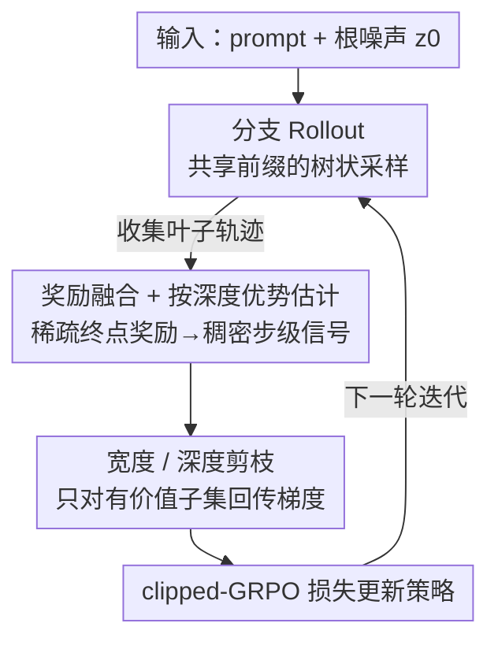

# BranchGRPO: Stable and Efficient GRPO with Structured Branching in Diffusion Models

**会议**: ICLR2026  
**OpenReview**: [https://openreview.net/forum?id=T2nP2IQasd](https://openreview.net/forum?id=T2nP2IQasd)  
**代码**: 未公开（论文未给出链接）  
**领域**: 对齐RLHF / 扩散模型  
**关键词**: GRPO, 扩散模型对齐, 树状 rollout, 稠密奖励, 信用分配

## 一句话总结
BranchGRPO 把扩散/流模型上 GRPO 的"逐条独立采样"改造成一棵共享前缀的分支树，靠树结构同时解决两件事——分支复用前缀摊薄采样开销、叶子奖励反向融合成按深度归一的稠密步级优势——再叠加宽/深剪枝只对有价值子集回传梯度，在 HPSv2.1 图像对齐上比 DanceGRPO 提升最高 16%、单轮训练时间降近 55%，混合变体可达 4.7× 加速。

## 研究背景与动机

**领域现状**：扩散模型和流匹配模型已经是图像/视频生成的主流，但仅靠大规模预训练无法保证输出对齐人类偏好（美学、语义、时序）。于是 RLHF 被搬到视觉生成上，其中 Group Relative Policy Optimization（GRPO）凭借在文生图/文生视频上的稳定性和可扩展性成为主流方案，代表工作有 DanceGRPO、Flow-GRPO。

**现有痛点**：把 GRPO 套到扩散/流模型上时有两个结构性瓶颈。其一是**低效**：标准 GRPO 用顺序 rollout，组内每条轨迹都要在新旧策略下从头独立采样，复杂度是 $O(N \cdot T)$（$T$ 为去噪步数、$N$ 为组大小），大量重复计算，难以放大规模。其二是**奖励稀疏**：现有方法把单个终点奖励**均匀地**摊到所有去噪步上，完全忽略中间状态携带的信息，导致信用分配不可靠、梯度方差高。

**核心矛盾**：去噪过程里不同时间步的"决策关键性"是不一样的——早期步决定大结构、晚期步只是细化。但稀疏终点奖励的均匀传播把所有步一视同仁，于是冒出一个根本问题：**怎么把稀疏的结果奖励归因到真正塑造最终质量的那些去噪步上？**

**本文目标**：在不破坏边际采样分布、不牺牲探索多样性的前提下，(1) 摊薄 rollout 的采样成本，(2) 把稀疏终点奖励转成稠密的步级信号，(3) 进一步压低反向传播开销。

**切入角度**：去噪过程本身是逐步展开的，天然适合组织成一棵树——只要在若干"分裂步"让轨迹分叉，分叉前的公共前缀就能被复用；而树结构又让"内部节点的价值 = 其后代叶子奖励的聚合"这件事顺理成章，从而把终点奖励反向传播下去。

**核心 idea**：用一棵**结构化分支树**取代顺序 rollout——共享前缀摊薄计算、叶子奖励按路径概率融合再按深度归一化得到稠密优势、宽/深剪枝裁掉低价值路径与冗余深度，把效率和稳定性一起拿下。

## 方法详解

### 整体框架

BranchGRPO 是一套面向扩散/流模型的**树状策略优化框架**。对每个 prompt，它从同一个根噪声 $z_0 \sim \mathcal{N}(0, I)$ 出发沿反向 SDE 逐步去噪；在预设的若干**分裂步**上，当前状态随机扩展成 $K$ 个子节点，生成多条共享早期前缀、之后分岔的子轨迹，直到最大深度 $T$ 收集所有叶子做奖励评估。拿到叶子奖励后，先把奖励沿树**向上融合**到内部节点、再**按深度归一化**成边上的稠密优势，最后做**宽度/深度剪枝**只对选中的节点子集回传梯度，用标准 clipped-GRPO 目标更新策略。整条管线串成"采样树 → 奖励融合 → 优势归一 → 剪枝 → 更新"。

### 关键设计

**1. 分支 Rollout：用共享前缀的树取代逐条独立采样**

针对的是顺序 rollout 的 $O(N \cdot T)$ 冗余。BranchGRPO 让一棵树里所有轨迹共用同一个根噪声和早期去噪前缀，只在指定分裂步 $B$ 上分叉，所以前缀段的计算被多条子轨迹摊薄。分叉靠在 SDE 转移里注入随机扰动实现：在分裂步 $i \in B$（步长 $h_i = t_i - t_{i+1}$），不再采单个后继而是生成 $K$ 个相关子节点

$$z_{i+1}^{(b)} = \mu_\theta(z_i, t_i) + g_{t_i}\sqrt{h_i}\,\xi_b, \quad \xi_b = \frac{\xi_0 + s\,\eta_b}{\sqrt{1+s^2}}, \quad b = 1,\dots,K$$

其中 $\xi_0$ 在各分支间共享、$\eta_b$ 是分支专属扰动，二者都 i.i.d. 采自 $\mathcal{N}(0,I)$。超参 $s \ge 0$ 调子节点间相关性：$s$ 小则分支高度相关但稳定，$s$ 大则分支近乎独立、探索更广。关键在于按构造每个 $\xi_b \sim \mathcal{N}(0,I)$，所以每个子节点 $z_{i+1}^{(b)}$ 的**边际分布和原始 SDE 单步完全一致**——这就保证了"分支复用前缀"不会偷偷改变采样分布。作者还专门验证分支 rollout 不伤多样性：用 DanceGRPO 和 BranchGRPO 各采 4096 个样本比分布，Inception 空间 KID=0.0057、CLIP 空间 KID=0.00022，两个分布在语义层面几乎不可分。

**2. 奖励融合 + 按深度优势估计：把稀疏终点奖励变成稠密步级信号**

针对的是"单个终点奖励均匀摊给所有步"导致的高方差、不可靠信用分配。树结构让内部节点的价值能用其后代叶子奖励表达，于是分两步把叶子信号反向传成稠密优势。第一步是**奖励融合**，对内部节点 $n$（后代叶子集 $L(n)$）做软加权聚合：

$$\bar{r}(n) = \sum_{\ell \in L(n)} w_\ell^{(n)} r_\ell, \quad w_\ell^{(n)} = \frac{\exp(\beta s_\ell)}{\sum_{j \in L(n)} \exp(\beta s_j)}, \quad s_\ell = \log p_{\text{beh}}(\ell \mid n)$$

$p_{\text{beh}}$ 是行为策略、$\beta$ 控制集中度：$\beta=0$ 退化为均匀平均（对 log-prob 校准误差鲁棒、保留低概率叶子利于探索，但分支多时方差大），$\beta=1$ 退化为按行为策略分布加权（方差小、更稳，但深树里可能过度集中到高似然叶子）。第二步是**按深度归一化**：同一深度的节点共享同一噪声水平、彼此可比，而跨深度的奖励量级因噪声状态变化差异巨大，所以在每个深度 $d$ 内单独标准化

$$A_d(n) = \frac{\bar{r}(n) - \mu_d}{\sigma_d + \epsilon}, \quad \mu_d = \text{mean}_{n \in N_d}\bar{r}(n), \quad \sigma_d = \text{std}_{n \in N_d}\bar{r}(n)$$

每条边的优势 $A(e)$ 继承自其子节点并可裁剪到 $[-A_{\max}, A_{\max}]$。这种逐深度标准化防止方差更小的晚期去噪步主导梯度，得到"过程稠密且均衡"的信用信号——相比 GRPO 那种把单一终点奖励广播到 prompt 级的归一化，这里能给真正要紧的去噪步更细粒度的信用。

**3. 宽度 / 深度剪枝：只对有价值的节点子集回传梯度**

针对的是分支过多会让轨迹数指数爆炸、反向传播代价过高。关键约束是**剪枝只在奖励融合和按深度归一化之后进行、只影响反向传播、不动前向 rollout 和奖励评估**——所以所有轨迹照样贡献奖励信号，只是梯度只算选中子集。**宽度剪枝**裁叶子数：Parent-Top1 在最后一个分裂步上每个父节点只保留奖励更高的那个子节点，大致砍掉一半梯度计算、覆盖所有父节点，稳定但多样性略降；Extreme 选择则保留全局最好和最差的 $b$ 个叶子，显式维持强正/负信号、利于探索但方差更高。**深度剪枝**跳过部分时间步的梯度：维护一组被剪深度 $D$ 并忽略这些层节点的梯度，为避免永久丢弃某些步，采用滑动窗口调度——窗口初始化在最后一个分裂点、固定大小为 4、每 30 个训练迭代向更晚的时间步滑一步，直到预设停止深度。实验里深度剪枝拿到最好的最终奖励，揭示晚期时间步存在大量冗余。

整套优化沿树的边做标准 clipped-GRPO 目标：

$$J(\theta) = \mathbb{E}\left[\frac{1}{|E|}\sum_{e \in E} \min\left(\rho_e(\theta)A(e),\, \text{clip}(\rho_e(\theta), 1-\epsilon, 1+\epsilon)A(e)\right)\right]$$

其中边 $e$ 表示深度 $t$ 处的转移 $(s_t, a_t)$，$\rho_e(\theta) = \pi_\theta(a_t \mid s_t)/\pi_{\text{old}}(a_t \mid s_t)$。

### 损失函数 / 训练策略

训练流程（Algorithm 1）：每轮迭代先把行为策略 $\pi_{\theta_{\text{old}}}$ 同步为当前策略，对每个 prompt 采根噪声、用行为策略建 rollout 树（到分裂步就分 $K$ 叉、否则单步去噪），评估叶子奖励 → 奖励融合 → 按深度归一化赋边优势 → 剪枝选回传节点 → 按 $|E(c)|$ 平均的 clipped-GRPO 损失更新策略。实现上树深 $d=20$、分支因子 $K=2$（剪枝前每次 rollout 16 个叶子），分裂步默认用 Dense 预设 $(0,3,6,9)$，分支相关性默认 $s=4$；训练 300 步、梯度累积 12、16×H200、AdamW（lr $1\times10^{-5}$）、bf16。此外受 MixGRPO 启发设计了**混合 ODE–SDE** 变体（BranchGRPO-Mix）：所有分裂步保持 SDE、滑动窗口再定一批额外 SDE 步、其余更新换成 ODE，把单轮时间压到 148s（对比 MixGRPO 289s、DanceGRPO 469s）且仍稳定。

## 实验关键数据

### 主实验

在 HPDv2.1（10.3 万训练 prompt、400 平衡测试 prompt）、骨干 FLUX.1-Dev 上对比效率与对齐质量：

| 方法 | 单轮时间(s)↓ | HPS-v2.1↑ | PickScore↑ | ImageReward↑ | Unified Reward↑ |
|------|------|------|------|------|------|
| FLUX（未微调） | - | 0.313 | 0.227 | 1.112 | 3.370 |
| DanceGRPO(tf=1.0) | 698 | 0.360 | 0.234 | 1.612 | 3.388 |
| MixGRPO (20,5) | 289 | 0.359 | 0.228 | 1.594 | 3.380 |
| BranchGRPO | 493 | 0.363 | 0.229 | 1.603 | 3.386 |
| BranchGRPO-DepPru | 314 | **0.369** | **0.235** | **1.625** | **3.404** |
| BranchGRPO-Mix | 148 | 0.363 | 0.230 | 1.598 | 3.384 |

深度剪枝变体拿下全部对齐指标最优（HPS-v2.1 从 DanceGRPO 的 0.360 提到 0.369），同时单轮时间 314s（比 DanceGRPO 的 698s 降约 55%）；Mix 变体把时间压到 148s（约 4.7× 加速）质量几乎不掉。换到 SD3.5-M 骨干、插进 FlowGRPO 管线时，GPU 小时从 2000 降到 1460（不到一半算力）却全面提升 HPS-v2.1/PickScore/ImageReward/GenEval，说明方法能跨骨干、跨 GRPO 管线干净迁移。

### 消融实验

| 配置维度 | 关键发现 | 说明 |
|------|------|------|
| 分支相关性 $s$ | $s=4$ 最优 | $s=1,2$ 探索不足收敛慢；$s=8$ 早期不稳定 |
| 分裂步位置 | 早分裂更好 | $(0,3,6,9)$ 早期奖励涨得快；$(9,12,15,18)$ 延迟探索、奖励更低 |
| 分裂密度 | 越密早期越快 | 密集分裂加速早期训练、稀疏收敛慢，最终收敛水平相近 |
| 奖励融合 | 路径加权($\beta=1$)更稳 | 均匀平均($\beta=0$)方差高、晚期平台；路径加权全程更高更稳 |
| 剪枝策略 | 深度剪枝最终奖励最高 | 宽度剪枝(Parent-Top1)曲线最平滑方差最低但最终略低 |

### 关键发现
- **晚期去噪步存在大量冗余**：深度剪枝靠滑动窗口跳过晚期步梯度反而拿到最好的最终奖励，反证晚期步对信用分配贡献小，这正好呼应"不同步关键性不同"的动机。
- **奖励-KL 效率更优**：BranchGRPO-DepthPruning 的奖励-KL 曲线在整个 KL 区间都压在 DanceGRPO 前沿之上，即每单位 KL 散度换到更多奖励，反映更稳的信用分配。
- **遵循分支扩展的 scaling law**：DanceGRPO 扩展性差（81 样本一步 >3500s），BranchGRPO 同规模只要 680s；增大分支因子（$K=2,3,4$ → 16/81/256 叶子）或增加分裂步数都让奖励曲线持续走高。
- **多样性几乎不变**：prompt 条件下 LPIPS-MPD（0.713 vs DanceGRPO 0.723）和 TCE（4.42 vs 4.45）都和基线非常接近。

## 亮点与洞察
- **"树"这一个抽象同时撬动了两个瓶颈**：共享前缀天然摊薄采样（解决低效），内部节点价值 = 后代叶子奖励聚合天然支持反向稠密信用（解决稀疏奖励）——一个数据结构换来两个收益，是这篇最优雅的地方。
- **分支不改边际分布的构造很关键**：用 $\xi_b = (\xi_0 + s\eta_b)/\sqrt{1+s^2}$ 保证每个子节点边际仍是 $\mathcal{N}(0,I)$，所以"复用前缀加速"在理论上不以扭曲采样分布为代价，这让加速变成"免费午餐"而非偷工减料。
- **剪枝只动反传不动前向**这个分工很巧：所有轨迹照常评奖励、保留完整探索，只在梯度上做减法，把"省算力"和"保探索"解耦，可迁移到任何树状/多 rollout 的 RL 训练。
- **按深度归一化**点破了扩散 RL 一个易被忽略的事实：跨噪声水平的奖励量级不可直接比，逐深度标准化才能防止低方差晚期步主导梯度——这个思路对任何"过程奖励随状态量级漂移"的场景都有借鉴价值。

## 局限与展望
- 论文未公开代码，且实验主要在 H200×16 这类大算力下展开，分支树带来的显存/并行调度成本对小资源复现是个门槛。
- 多个关键超参（分支相关性 $s$、分裂步位置/密度、融合温度 $\beta$、剪枝窗口）都需要按任务调，论文给了经验最优但缺乏自适应方案，换数据集/骨干可能要重新 sweep。
- 视频生成（WanX）一侧只给了定性"运动质量更高、帧更锐更时序一致"的描述，缺少和图像侧同等强度的定量表格，跨模态泛化的说服力略弱于图像。
- 奖励融合的两种极端（均匀 vs 路径加权）各有方差/集中度问题，是否存在随训练阶段自适应调 $\beta$ 的策略值得继续探。

## 相关工作与启发
- **vs DanceGRPO / Flow-GRPO**：它们最早把 GRPO 经 SDE 重构搬到视觉生成，但用顺序 rollout + 单一终点奖励均匀传播；本文换成树状 rollout + 按深度稠密优势，同时改善效率（采样摊薄）和稳定性（细粒度信用）。
- **vs TempFlow-GRPO**：同样指出稀疏终点奖励均匀信用分配的问题，但它走"时序感知加权"路线；本文走"树结构反向融合 + 按深度归一"，靠数据结构本身产生稠密信号。
- **vs MixGRPO**：MixGRPO 用混合 ODE–SDE 滑窗提效率但在开销/性能间有取舍；本文把这个思路吸收成 BranchGRPO-Mix 变体，叠在分支+剪枝之上拿到更快速度（148s vs 289s）和更强对齐。
- **vs TreePO（LLM 领域）**：都用树状 rollout，但 TreePO 面向 LLM；本文把树状 rollout 专门适配到扩散动力学（分裂步、SDE 注扰、按噪声深度归一），是把 LLM 的树搜索思想"翻译"到扩散 RL 的一次落地。

## 评分
- 新颖性: ⭐⭐⭐⭐ 用一棵分支树同时解决扩散 GRPO 的低效与稀疏奖励两个瓶颈，组合干净有洞见，但分支/剪枝各自的零件在 LLM RL 里有先例。
- 实验充分度: ⭐⭐⭐⭐ 两个骨干、多基线、效率-质量双维度、丰富消融与 scaling law；视频侧定量略薄。
- 写作质量: ⭐⭐⭐⭐ 动机-方法-实验逻辑清晰，公式与图配合到位，术语和树搜索对齐易读。
- 价值: ⭐⭐⭐⭐ 在不改边际分布前提下把扩散对齐训练提速近 2–4.7× 还提升对齐质量，对工业级 RLHF 微调有直接实用价值。

<!-- RELATED:START -->

## 相关论文

- [\[ICLR 2026\] Balancing the Experts: Unlocking LoRA-MoE for GRPO via Mechanism-Aware Rewards](balancing_the_experts_unlocking_lora-moe_for_grpo_via_mechanism-aware_rewards.md)
- [\[ICLR 2026\] Composition of Memory Experts for Diffusion World Models](composition_of_memory_experts_for_diffusion_world_models.md)
- [\[ACL 2026\] d-TreeRPO: Towards More Reliable Policy Optimization for Diffusion Language Models](../../ACL2026/reinforcement_learning/d-treerpo_towards_more_reliable_policy_optimization_for_diffusion_language_model.md)
- [\[ICLR 2026\] SPG: Sandwiched Policy Gradient for Masked Diffusion Language Models](spg_sandwiched_policy_gradient_for_masked_diffusion_language_models.md)
- [\[ICML 2026\] Learning Unmasking Policies for Diffusion Language Models](../../ICML2026/reinforcement_learning/learning_unmasking_policies_for_diffusion_language_models.md)

<!-- RELATED:END -->
