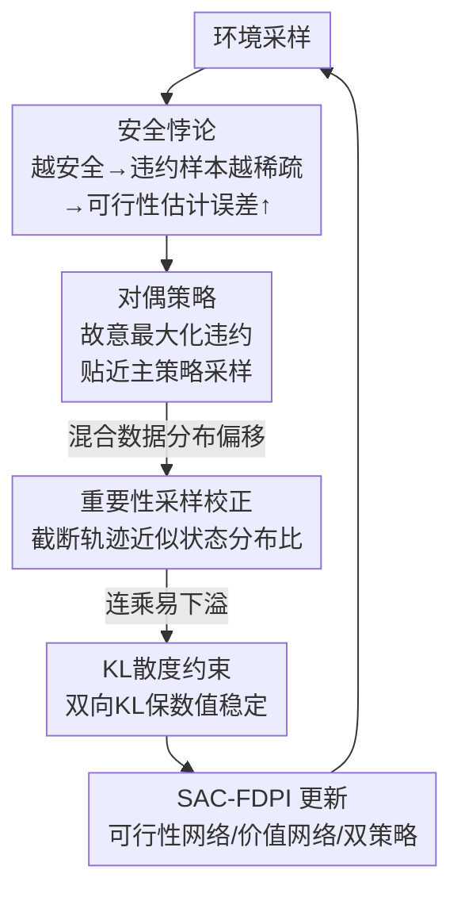

# Breaking Safety Paradox with Feasible Dual Policy Iteration

**会议**: ICLR2026  
**OpenReview**: [https://openreview.net/forum?id=BHSSV1nHvU](https://openreview.net/forum?id=BHSSV1nHvU)  
**代码**: 待确认  
**领域**: 安全强化学习  
**关键词**: 安全RL, 可行性函数, 安全悖论, 对偶策略, 重要性采样

## 一句话总结
本文发现安全 RL 里一个反直觉的"安全悖论"——策略越安全、违约样本越稀疏，可行性函数估计反而越差，最终拖垮安全性；并提出 FDPI 用一个专门"故意违约"的对偶策略往回灌违约样本、配合重要性采样和 KL 约束，在 Safety-Gymnasium 上同时拿到最低违约和近乎最高回报。

## 研究背景与动机
**领域现状**：安全强化学习（safe RL）要的不只是回报最大化，而是要在每一步都严格满足约束 $h(x)\le 0$，理想目标是"零违约"。这类方法的核心是一个**可行性函数**（feasibility function），用来判断一个状态在无限时域内能不能一直保持安全——它既定义了策略的可行域，又充当"面向安全的学习目标"。常见的可行性函数有 cost value function (CVF)、Hamilton-Jacobi 可达函数、以及本文用作主例的约束衰减函数 CDF。这些函数都靠类似 Bellman 方程的"风险自洽条件"做定点迭代来学，需要从采样数据里估出来。

**现有痛点**：可行性函数是从采样数据里估的，而它本质上依赖**违约样本**（constraint-violating samples）才能学准——只有看到"踩线"的转移，才能知道哪些状态危险、危险到什么程度。但安全 RL 的目标恰恰是把策略训得越来越安全，于是策略产生的违约样本越来越稀疏。

**核心矛盾**：作者把这个矛盾点名为**安全悖论**（safety paradox）——策略变安全 → 违约样本变稀疏 → 可行性函数估计误差变大 → 可行域识别不准、学习目标有偏 → 安全性反而被拖垮。这和标准 RL 里的稀疏奖励问题有本质区别：标准 RL 里拿到更高奖励会直接促进下一步奖励提升（正反馈），而安全悖论是一个**自我拆台的负反馈环**——越安全越难继续变安全。

**现有手段为何不够**：处理样本稀疏的老办法分两类，都救不了这个悖论。被动类（如 PER 优先经验回放）只是给 buffer 里已有的关键样本加权，可当关键样本本就稀缺时无能为力；主动类（如好奇心驱动探索）会修改环境或智能体行为去造关键样本，但这会让策略偏离最优，且常需侵入式改任务，实际不可行。

**核心 idea**：训练一个**专门最大化违约的对偶策略**，在不增加总样本量的前提下提高违约样本占比，把可行性函数估计误差压下去，从而把策略安全性推到更高水平——并用重要性采样修正两个策略的数据分布、用 KL 约束保证数值稳定。

## 方法详解

### 整体框架
FDPI（feasible dual policy iteration）的出发点是：要打破安全悖论，唯一的路是**增加违约样本**。它沿用 Yang 等人的可行策略迭代 FPI 框架，并叠加 SAC 的最大熵 RL，得到 SAC-FDPI。系统里同时存在两个策略：**主策略**（primal policy $\pi_p$）追求"高回报 + 安全"，**对偶策略**（dual policy $\pi_d$）则被刻意训成"在贴近主策略的前提下故意撞向约束"。两个策略一起采样、按比例混合进同一个 buffer——主策略保证整体安全，对偶策略持续注入一小股可控的违约转移，让可行性函数始终有足够违约样本可学。

混合数据带来的问题是**分布偏移**：loss 里的期望本该在主策略的状态-动作分布上算，现在掺了对偶策略采的样本。FDPI 用**重要性采样（IS）**把分布校正回来，并用**截断轨迹**近似难算的边缘状态分布比值；再用两策略间的 **KL 散度约束**防止 IS 比值连乘下溢。整套东西最终落到 FPI 的网络更新上：学两个动作-可行性网络、一个动作-价值网络、两个策略网络。

### 关键设计

**1. 安全悖论：从理论上证明"越安全估计越差"**

这是全文的灵魂，也是后续方法的全部动机。作者用约束衰减函数 CDF 作为可行性函数的具体例子：$F^\pi(x)=\mathbb{E}_{\tau\sim\pi}[\gamma^{N(\tau)}\mid x_0=x]$，其中 $N(\tau)$ 是轨迹 $\tau$ 里第一次违约的时间步。CDF 通过风险自洽条件 $F^\pi(x)=\mathbb{E}[c(x)+(1-c(x))\gamma F^\pi(x')]$ 做定点迭代来学（$c(x)=\mathbb{I}[h(x)>0]$ 是违约指示）。为分析方便，作者用 Monte Carlo 估计 $\hat F^\pi(x)=\frac1K\sum_i\gamma^{N(\tau_i)}$。

定理 1 给出了相对估计误差的上界，它只跟两个量有关：到首次违约步数的期望 $\mu^\pi_N$ 和方差 $\sigma^{2,\pi}_N$，误差界正比于 $\big(|\ln\gamma|\sigma^\pi_N+(\ln\gamma)^2\sigma^{2,\pi}_N\big)/\gamma^{\mu^\pi_N}$。直觉上策略越安全 $\mu^\pi_N$ 越大（更晚才违约），让分母 $\gamma^{\mu^\pi_N}$ 变小、误差界变大。但方差怎么变并不显然，于是定理 2 在温和假设下（引入"到违约的距离函数" $D$、相邻状态 $D$ 变化有界、首段步数与后续弱相关）证明：**更安全的策略在远离违约的不可行状态上，到违约步数的方差更大**。两个定理合起来给出结论——策略越安全，CDF 估计误差界越大。这一步把一个工程上模糊的"采样不够"现象，钉成了一个有理论保证的根本障碍，也直接指明解法只能是"增加违约样本"。

**2. 对偶策略：用一个"反派"专门去造违约样本**

既然唯一出路是增加违约样本，FDPI 就额外训练一个对偶策略 $\pi_d$，让它故意去违约。为此引入一个对偶可行性函数 $G_d(x,u)=\mathbb{E}_{\tau\sim\pi_d}[\gamma^{N(\tau)}\mid x_0=x,u_0=u]$（相比 $F_d$ 多固定了当前动作 $u_0$），对偶策略的更新目标就是**最大化**它：$\max_{\pi_d}\mathbb{E}_{x,u\sim\pi_d}[G_d(x,u)]$——也就是尽量早违约。主、对偶策略都参与采样，比例由一个**对偶阈值** $d$（实验固定 0.95）控制：当滑动平均的可行状态占比超过 $d$（说明策略已经太安全、违约样本快没了），就激活对偶策略，让它采集一半样本。关键是**总样本量不变**——对偶策略是把一部分采样配额拿去专门造违约，而不是额外加样本，所以这是在"不增加交互预算"下提高违约占比。可视化里主策略红线绕开危险区、对偶策略青线直接穿过危险区，画面很直观。

**3. 重要性采样校正：用截断轨迹近似难算的状态分布比**

直接把对偶策略采的数据喂进主策略的 loss 会引入分布偏移。以主可行性函数的 loss 为例，期望里的状态 $x$ 和动作 $u$ 都有一部分来自对偶策略，分布被改了。动作 $u$ 的 IS 比值好算（两策略概率之比），但状态 $x$ 的 IS 比值 $r_{pd}(x)=p^{\pi_p}(x)/p^{\pi_d}(x)$ 涉及边缘状态分布，需要对所有轨迹求和，**不可解**。FDPI 的巧招是用一条包含 $x$ 的轨迹 $\tau$ 来近似这个比值，并**截断到 $x$ 出现的时刻** $t(x)$：$\hat r_{pd}(x)=\prod_{s=0}^{t(x)}\frac{\pi_p(u_s|x_s)}{\pi_d(u_s|x_s)}$。截断的依据是——$x$ 出现之后的动作不影响"到达 $x$"这件事的概率，砍掉它们还能降低 IS 方差。状态-动作对的比值再补一项动作比 $\hat r_{pd}(x,u)=\hat r_{pd}(x)\pi_p(u|x)/\pi_d(u|x)$。这样就把一个本质上不可计算的边缘分布比，化成了沿单条轨迹的可算连乘。

**4. KL 散度约束：给 IS 连乘兜底，防止比值塌缩到零**

IS 比值是一串概率比的连乘，而一个动作在"另一个策略"下的概率通常比在行为策略下低，连乘很容易数值下溢、塌缩到零，让校正失效。作者发现**约束两策略间的 KL 散度**能有效缓解：因为 $\mathbb{E}_{u\sim\pi_d}[\log\frac{\pi_p(u|x)}{\pi_d(u|x)}]\ge-\delta$ 等价于把每一项对数的期望托住，从而保证整条连乘不会无限制变小。这个 KL 约束同时还服务于对偶策略的设计初衷——让对偶策略"故意违约但别跑太远"，始终贴近主策略，这样它造出来的违约样本才和主策略要面对的状态分布相关、才有用。约束用拉格朗日乘子法落地：对偶策略的 loss 为 $L_{\pi_d}=-\mathbb{E}[\hat r_d(x)G_d(x,u)]+\lambda_{dp}D_{KL}(\pi_d\|\pi_p)+\lambda_{pd}D_{KL}(\pi_p\|\pi_d)$，两个乘子 $\lambda_{dp},\lambda_{pd}$ 按违反量做投影梯度上升更新。

### 损失函数 / 训练策略
SAC-FDPI 在 FPI 框架上学五个网络：两个动作-可行性网络 $G_{p,\phi_p}, G_{d,\phi_d}$、一个动作-价值网络 $Q_\omega$、两个策略网络 $\pi_{p,\theta_p}, \pi_{d,\theta_d}$。可行性网络与价值网络的 loss 都带上 IS 权重 $\hat r$（来自对偶策略的样本乘校正比、来自主策略的样本权重为 1），目标用 target 网络做自洽 bootstrap。主策略 loss 在可行域内（$G_{p}\le\epsilon$）最大化价值、在可行域外最小化可行性：$L_{\pi_p}=\mathbb{E}[\hat r_p(x)(\mathbb{I}_f(\alpha\log\pi_p-Q_\omega)+(1-\mathbb{I}_f)G_{p})]$。这里用一个松弛阈值 $\epsilon=0.1$ 近似可行性判定（因为近似误差会让 CDF 几乎处处为正），实验里对所有环境都好用。

## 实验关键数据

### 主实验
覆盖 Safety-Gymnasium 上 14 个环境（Point/Car 机器人 × Goal/Push/Button/Circle 导航任务，以及 6 个 MuJoCo 速度约束的运动任务）。评估两个指标：episode cost（平均每回合违约步数）和 episode return（平均累计回报）。分数先用 PPO 归一化再在 14 个环境上平均。

| 对比维度 | SAC-FDPI（本文） | 主要基线 |
|----------|------------------|----------|
| 归一化 cost | **全场最低** | CPO / RCPO / FOCOPS / CUP / PPO-Lag / SAC-Lag / DSAC-T-Pen 均更高 |
| 归一化 return | 近乎并列最高（与 SAC-FPI 持平） | 多数基线更低 |
| 训练后期违约 | 几乎零违约，无尖峰 | SAC-FPI 后期仍有持续 cost 尖峰 |

基线涵盖迭代式无约束 RL（RCPO、PPO-Lag、SAC-Lag）、约束策略优化（CPO、FOCOPS、CUP）、以及 SOTA 无约束 RL + 惩罚（DSAC-T-Pen），并特别包含**去掉对偶策略**的消融版 SAC-FPI。

### 消融实验
核心消融就是 SAC-FPI（去掉对偶策略）vs SAC-FDPI，围绕三个问题 Q2/Q3 展开：

| 配置 | 违约样本占比 | 可行性估计误差 | 训练后期违约 |
|------|--------------|----------------|--------------|
| SAC-FDPI（完整） | 多数环境高一个数量级（约 10×） | 误差分布在 0 附近尖锐对称（低偏差） | 近零、平稳 |
| SAC-FPI（无对偶策略） | 几乎所有环境 <1% | 误差分布扁平、离散（误差界被放大） | 持续 cost 尖峰 |

### 关键发现
- **对偶策略确实灌进了违约样本（Q2）**：SAC-FDPI 在 buffer 里维持的违约样本占比比 SAC-FPI 高约一个数量级；SAC-FPI 的违约占比在几乎所有环境都跌破 1%，正是它后期 cost 尖峰的根源。
- **更多违约样本 → 更准的可行性估计（Q3）**：把违约占比图（图 3）和估计误差分布图（图 4）对照，10× 的违约样本直接换来显著更低的估计误差，实证支持了定理 1/2 的理论分析。
- **探索模式可视化**：主策略保守绕开危险区（零违约），对偶策略在贴近主策略的同时故意穿过危险区注入违约样本——这种安全/不安全数据的混合让可行性函数始终估得准，反过来让主策略收敛到更高性能、更低违约。
- 作者强调方法面向**仿真器训练**，对偶策略的额外违约不会造成真实损害。

## 亮点与洞察
- **把"采样不够"升格成有理论保证的根本障碍**：安全悖论最妙的地方是它指出了一个反直觉的负反馈——越安全越学不准。定理 1/2 把误差界精确挂到"到违约步数的均值与方差"上，这比泛泛说"违约样本少"深刻得多，也直接锁死了"必须增加违约样本"这条解法路径。
- **"以毒攻毒"的对偶策略**：用一个故意违约的反派策略去喂养可行性函数，且总样本量不变（只是重新分配采样配额），既不改环境也不做 reward shaping，保持了任务完整性——这正是它优于被动 PER 和主动好奇心探索的地方。
- **截断轨迹近似 IS 比值**：边缘状态分布比本不可算，用单条轨迹连乘 + 截断到状态出现时刻来近似，理由（后续动作不影响到达概率、且降方差）干净漂亮，是个可迁移到其它 off-policy 校正场景的 trick。
- **KL 约束一石二鸟**：既保证 IS 连乘不下溢（数值层面），又约束对偶策略别跑太远（语义层面，让违约样本相关有用）。

## 局限与展望
- **只在仿真器里成立**：方法明确依赖"额外违约不造成真实损害"，对偶策略主动撞约束的做法无法直接搬到真实世界在线训练。
- **理论分析以 MC 估计为主**：定理基于 Monte Carlo 估计推导，TD 估计的扩展靠"方差会传播到 TD target"的论证（放在附录），严谨度上略弱于主结论。
- **多处温和假设**：定理 2 依赖距离函数 $D$ 存在、相邻状态 $D$ 变化有界、首段步数与后续弱相关等假设，在更复杂或非连续动力学系统里是否成立需验证。
- **超参依赖经验值**：对偶阈值 $d=0.95$、松弛阈值 $\epsilon=0.1$、KL 上界 $\delta$ 等都靠固定经验值，跨环境鲁棒性和敏感性分析可以更充分。

## 相关工作与启发
- **vs 被动样本增强（PER 等优先经验回放）**：PER 只是给 buffer 里已有的高 TD 误差样本加权，当违约样本本就稀缺时它无米下锅，也打不破安全悖论的负反馈环；FDPI 是从源头主动制造违约样本。
- **vs 主动样本增强（好奇心探索 / 对抗策略）**：好奇心驱动或对抗策略通过改环境/改行为造关键样本，但会让策略偏离最优、且常需侵入式改任务；FDPI 不改环境、不做 reward shaping，用 IS 把对偶数据校正回主策略分布，保持任务完整。
- **vs SAC-FPI（本文去对偶版）**：FPI 是 FDPI 的底座，但没有对偶策略时违约样本随训练消失，可行性函数估计退化、出现 cost 尖峰；FDPI 正是在 FPI 上补了对偶策略 + IS + KL 三件套来续命。
- **vs 约束策略优化（CPO / FOCOPS / CUP）**：这类方法在每轮策略优化里直接加安全约束（信赖域、投影、一阶法），但同样要从采样数据估可行性/成本，因此同样受安全悖论困扰；FDPI 的视角正交——不改优化形式，而是改采样数据的违约占比。

## 评分
- 新颖性: ⭐⭐⭐⭐⭐ "安全悖论"这个反直觉发现 + 理论刻画 + 对偶策略解法，是少见的"问题与解法都新"的工作
- 实验充分度: ⭐⭐⭐⭐ 14 环境、8 个基线、5 seed，Q1/Q2/Q3 闭环验证；但缺更细的超参敏感性
- 写作质量: ⭐⭐⭐⭐⭐ 从悖论 → 定理 → 解法层层递进，动机与方法咬合极紧
- 价值: ⭐⭐⭐⭐ 揭示并解决了安全 RL 一个普遍存在的根本障碍，对依赖可行性函数的方法有普适启发

<!-- RELATED:START -->

## 相关论文

- [\[ACL 2026\] Breaking the Impasse: Dual-Scale Evolutionary Policy Training for Social Language Agents](../../ACL2026/reinforcement_learning/breaking_the_impasse_dual-scale_evolutionary_policy_training_for_social_language.md)
- [\[ICLR 2026\] DOPPLER: Dual-Policy Learning for Device Assignment in Asynchronous Dataflow Graphs](doppler_dual-policy_learning_for_device_assignment_in_asynchronous_dataflow_grap.md)
- [\[ICLR 2026\] Primal-Dual Policy Optimization for Linear CMDPs with Adversarial Losses](primal-dual_policy_optimization_for_linear_cmdps_with_adversarial_losses.md)
- [\[ICLR 2026\] Breaking Barriers: Do Reinforcement Post Training Gains Transfer To Unseen Domains?](breaking_barriers_do_reinforcement_post_training_gains_transfer_to_unseen_domain.md)
- [\[ICLR 2026\] Frozen Policy Iteration: Computationally Efficient RL under Linear $Q^{\pi}$ Realizability for Deterministic Dynamics](frozen_policy_iteration_computationally_efficient_rl_under_linear_qpi_realizabil.md)

<!-- RELATED:END -->
