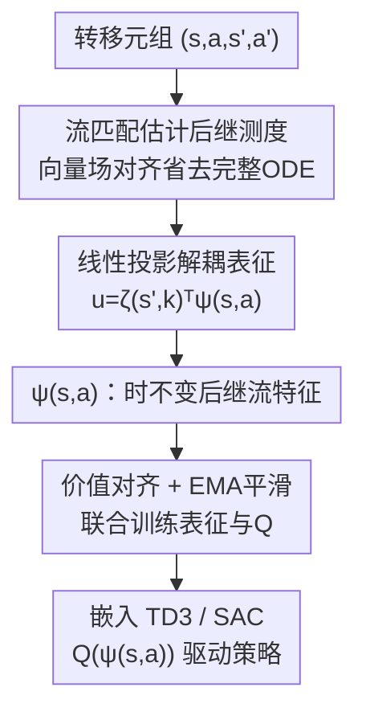

# Bridging Successor Measure and Online Policy Learning with Flow Matching-Based Representations

**会议**: ICLR2026  
**OpenReview**: [https://openreview.net/forum?id=jA3KmR18S7](https://openreview.net/forum?id=jA3KmR18S7)  
**代码**: https://github.com/Shiien/successor-flow-representation-implementation  
**领域**: 强化学习 / 表示学习  
**关键词**: 后继测度, 流匹配, 后继特征, 在线强化学习, 表示学习

## 一句话总结
本文提出 Successor Flow Features（SF2），用流匹配生成模型逼近后继测度（Successor Measure, SM），并把向量场强制分解成「时不变的状态-动作嵌入 $\psi(s,a)$ + 时变投影 $\zeta(s',k)$」的线性结构，从而把 SM 估计和在线策略优化打通——在 DeepMind Control 七个连续控制任务上嵌入 TD3/SAC 后，样本效率和训练稳定性都优于强后继特征基线。

## 研究背景与动机
**领域现状**：在线深度强化学习的成功很大程度上依赖能自动学到「跨观测泛化、给出准确价值估计、支持长程规划」的状态表示。一条很有吸引力的路线是后继表示（Successor Representation, SR）：它把奖励函数从环境动力学里解耦出来，刻画某策略下的折扣未来状态占用分布，既可当作价值函数的线性基，又是动力学的紧凑表征。SR 的连续化版本——后继特征（Successor Feature, SF）和更一般的后继测度（SM）——近年开始用生成模型来估计，其中 TDFlow 用流匹配（Flow Matching）直接建模 SM，因为流匹配是 simulation-free 的、能缓解长程预测的累积误差，天然适合连续高维状态。

**现有痛点**：SM 虽然预测能力强，但它是定义在（原则上无限维的）分布空间里的对象，**缺少为在线 RL 量身定做的紧凑表示**。SF 这条线又卡在「特征映射怎么设计」这个公开难题上；而把 SM 直接当生成模型用，每次采样都要多次网络前向、跑完整 ODE 积分，计算开销大，没法直接塞进 off-policy 算法和价值函数联合训练。

**核心矛盾**：在线 RL 既要 SM 那种「鲁棒的长期预测能力」，又要表示能「随新经验快速适应、并能和价值函数联合优化」——而现成的 SM 生成模型只满足前者，输出的是采样器而非可复用的低维特征。

**本文目标**：设计一个框架，把（1）SM 的长程预测、（2）流匹配稳定高效的生成训练、（3）在线 RL 需要的快速适应性，三者统一起来，产出能直接接入 TD3/SAC 的紧凑状态-动作特征。

**切入角度**：作者注意到，如果把流匹配的向量场 $u_\theta(s',k,s,a)$ 强制写成「时不变项 $\psi(s,a)$」和「时变投影矩阵场 $\zeta(s',k)$」的**线性内积**，那么 $\psi(s,a)$ 这个时不变项恰好就是想要的紧凑表征——它和时间无关、只在最后一步与 $\zeta$ 相乘，因此可以单独拎出来和价值函数一起训练。

**核心 idea**：用流匹配逼近后继测度，但把向量场做「时不变嵌入 × 时变投影」的线性分解，让时不变嵌入 $\psi(s,a)$ 成为可直接用于在线 RL 的后继流特征（SF2）。

## 方法详解

### 整体框架
SF2 要解决的是「怎么从 SM 里榨出一个能直接喂给在线 RL 的紧凑特征」。整条流水线从一条转移元组 $(s,a,s',a')$ 出发：先用流匹配把后继测度 $\mu^\pi(\cdot|s,a)$ 学出来（但用一种避免完整 ODE 采样的向量场对齐目标来省算力）；同时把流匹配的向量场强制写成线性投影结构 $u_\theta(s',k,s,a)=\zeta(s',k)^\top\psi(s,a)$，于是 $\psi(s,a)$ 就是与时间无关、可复用的后继流特征；这个 $\psi(s,a)$ 被同时用来构建状态-动作价值 $Q(\psi_\theta(s,a))$，通过价值对齐损失和 EMA 平滑与表示学习联合训练，最终整套表征嵌入 TD3 或 SAC，由 $\nabla_a Q(\psi_\theta(s,a))$ 隐式驱动策略改进。

### 关键设计

**1. 流匹配估计后继测度：用向量场对齐替代完整 ODE 采样**

SM 满足一个 Bellman 式的混合结构——它是「即时转移分布」（权重 $1-\gamma$）和「自举的未来状态分布」（权重 $\gamma$）的混合：$\mu^\pi(s'|s,a)=(1-\gamma)P(s'|s,a)+\gamma\,\mathbb{E}_{s''\sim P,a''\sim\pi}\mu^\pi(s'|s'',a'')$。这种混合结构天然契合流匹配，可以直接建模「即时转移」到「未来状态分布」之间的插值，给出一个分成两项的训练目标 $L_{\text{flow}}(\theta)=(1-\gamma)L_P(\theta)+\gamma L_{\text{bootstrapping}}(\theta)$，前一项学转移分布、后一项是 TD 式的自举项。

痛点在于：自举项原本需要先用 $\mu_\theta$ 采出完整的后继状态 $\tilde s$（要多步 ODE 积分、多次网络前向），开销很大。作者借鉴 TDFlow 的 TD2-CFM 思路，**不去生成完整状态再比较，而是在同一噪声水平下直接对齐两个条件向量场**：

$$L_{\text{bootstrapping}}(\theta)\approx \mathbb{E}\big[\,\lVert u_\theta(x_k,k,s,a)-u_\theta(x_k,k,s',a')\rVert^2\,\big],\quad x_k=\text{ODE}(\epsilon,k,u_\theta(\cdot,\cdot,s',a')).$$

直觉是：如果两个向量场在演化方向上一致，它们生成的分布也会一致。这样就避免了昂贵的 ODE 积分，把所需的积分步数压到很小（实验里默认只用 1–2 个去噪步就够），同时保持局部流方向的一致性。

**2. 线性投影解耦表征：时不变嵌入 × 时变投影**

这是把 SM 变成「可用特征」的关键一步。常规条件生成模型把条件、时间戳、加噪输入用复杂非线性混在一起，没法单独抽出一个与时间无关的表征。作者改成线性投影（定义 3.1）：向量场写作 $u(s',k,s,a)=\zeta(s',k)^\top\psi(s,a)$，其中 $\psi:\,\mathbb{R}^{\dim S}\times\mathbb{R}^{\dim A}\to\mathbb{R}^d$ **时不变**、只在最后一步和时变矩阵场 $\zeta(s',k)$ 做内积。这迫使所有时间结构都编码进 $\zeta$，而 $\psi(s,a)$ 成为干净的、与时间解耦的状态-动作特征，即 Successor Flow Feature。

这样设计的好处有理论支撑：$\psi(s,a)$ 满足充分降维（Sufficient Dimension Reduction, SDR）性质，即条件独立 $\tilde s\perp\!\!\!\perp(s,a)\mid\psi(s,a)$，意味着 $\mu^\pi(\tilde s|s,a)=\mu^\pi(\tilde s|\psi(s,a))$——$\psi$ 已经把「状态-动作如何关联到后继状态」的全部相关信息压进了低维表征里；同时该线性形式具备万能逼近性质。换句话说，时变投影 $\zeta$ 负责重建 SM 并解耦掉策略相关与环境结构，时不变嵌入 $\psi$ 则是真正喂给下游 RL 的紧凑特征。

**3. 与后继表示的理论联系：半梯度更新还原出 SR 式递归**

为了说明 $\psi$ 学到的确实是「后继」语义，作者做了 $k\to 0$ 的极限分析。取条件路径 $\phi_k(\epsilon,x)=kx+(1-k)\epsilon$，对 $\psi$ 网络做一步半梯度更新（停掉自举目标上的梯度）后，损失梯度可整理成

$$\nabla_\theta L\approx 2\big[\psi(s,a)^\top\zeta(\epsilon,0)-\big((1-\gamma)(s'-\epsilon)+\gamma\,\psi(s',a')^\top\zeta(\epsilon,0)\big)\big]\nabla_\theta\psi(s,a),$$

进一步重排成 Bellman 式递归 $\psi(s,a)\leftarrow(1-\gamma)(\zeta(\epsilon,0)^\top)^{+}(s'-\epsilon)+\gamma\,\psi(s',a')$（$(\cdot)^+$ 为 Moore-Penrose 伪逆）。这正是 Dayan 定义下的后继表示结构：前一项是捕捉即时转移的基础特征、后一项是折扣自举。区别在于这里的下一状态 $s'-\epsilon$ 先被高斯噪声扰动、再投影到 $(\zeta(\epsilon,0)^\top)^+$ 的列空间，相当于在学一组对扰动鲁棒的状态空间基。作者诚实地强调这只是 $k\to 0$ 的近似、用来解释设计动机，并不声称与 SR 严格等价；$\gamma\to 0$ 时该方法还会退化到只建模一步转移的扩散谱表示。

**4. 价值对齐与 EMA 平滑：把表征塞进 off-policy RL 并稳住训练**

最后一步是把 $\psi$ 真正用于在线 RL。表征只用来构建价值函数 $Q(\psi_\theta(s,a))$，策略则通过 $\nabla_a Q(\psi_\theta(s,a))$ 被隐式影响。为此引入两个互补技巧：其一是**价值对齐**，在流匹配目标上加价值预测项 $L_{\text{total}}=L_{\text{flow}}+\lambda L_{\text{value}}$，其中 $L_{\text{value}}=\mathbb{E}\big[(Q(\psi_\theta(s,a))-(r+\gamma\max_{a'}Q(\psi_\theta(s',a'))))^2\big]$，让表征同时服务于动力学重建和价值估计，兼容 double Q 等技巧。其二是**生成模型平滑**，对 $\psi,\zeta$ 用指数滑动平均（EMA）维护目标网络 $\theta_{\psi'}=(1-\tau)\theta_{\psi'}+\tau\theta_\psi$，在自举阶段提供稳定的目标，且 EMA 后的 $\psi'$ 还复用到价值函数的目标网络里，再加一层稳定性。对 TD3 取 $y'=r+\gamma\min(Q_1',Q_2')$，对 SAC 则额外减去熵项 $-\alpha\log\pi(a'|s')$。

### 损失函数 / 训练策略
总目标为 $L_{\text{total}}=(1-\gamma)L_P+\gamma L_{\text{bootstrapping}}+\lambda L_{\text{value}}$（见原文 Algorithm 1）：采样 $\epsilon\sim\mathcal N(0,I)$、$k\sim U(0,1)$，构造 $s_k=k\cdot s'+\epsilon\cdot(1-k)$、$s_{\text{target}}=s'-\epsilon$ 算转移项 $L_P=\lVert\psi(s,a)^\top\zeta(s_k,k)-s_{\text{target}}\rVert^2$；用极少步数值积分（默认中点法 1 步）生成 $x$ 算自举对齐项 $L_{\text{bootstrapping}}$；价值项 $L_{\text{value}}=(Q(\psi(s,a))-y')^2$。流采样默认 Euler 积分 2 次函数评估（NFE）。实现基于 JAX + Haiku，算法改自 Brax。

## 实验关键数据

### 主实验
在 DeepMind Control Suite（GPU 加速版 MuJoCo Playground）的 7 个连续控制任务上，把 SF2 嵌入 TD3 与 SAC，每个变体跑 15 个随机种子，用归一化的 Area-Under-Curve（AUC，按每个环境的最小/最大线性缩放到 $[0,1]$）聚合，报告 Median / IQM / Mean / Optimality Gap（95% 置信区间，5000 次采样）。对比对象包括 vanilla TD3/SAC、强 SF 基线（基于 Chua et al. 2024 实现的 TD3Sim/SACSim 及其去掉 Q 对齐、改用图拉普拉斯正交目标的 TD3SimLap/SACSimLap）、以及 SPR 基线。

| 设置 | 聚合指标 | SF2 ($\gamma=0.99$) | 转移版 ($\gamma=0.0$) / 基线 | 结论 |
|--------|------|------|----------|------|
| TD3 家族（7 env, 归一化 AUC） | Median/IQM/Mean | 全面领先 | 低于 SF2 | 完整后继版（$\gamma=0.99$）在多数环境优于 vanilla 与 SF 基线 |
| SAC 家族（7 env, 归一化 AUC） | Median/IQM/Mean | 领先 | 低于 SF2 | 提升存在但幅度小于 TD3 |
| $\gamma=0.99$ vs $\gamma=0.0$ | 归一化 AUC | 更高 | 更低 | 长时间视野（更大 $\gamma$）对表示学习确有价值 |

关键观察：TD3 上的提升比 SAC 更明显，作者推测该方法对「探索/表示学习困难」的算法更有益，确定性策略可能更利于在线 SM 学习；许多情形下标准差下降，说明 SF2 不只提性能还提稳定性。SF 类方法在稀疏奖励任务上（多数转移奖励为 0，难以学到任务权重 $w$）会吃亏，而 SF2 不依赖该机制因而避开了这种退化。

### 消融实验
在 AcrobotSwingup 上分析三个关键超参（用最后 50k 步平均回报衡量）：

| 配置 | 关键现象 | 说明 |
|------|---------|------|
| EMA 系数 $\tau$ | TD3 峰值在 $\tau=0.1$、SAC 在 $\tau=0.01$；$\tau\to 1.0$ 显著掉点 | 更稳的目标网络更新（小 $\tau$）利于学习，需谨慎标定 |
| 去噪步数 1–4 | 性能相当，但耗时随步数线性增长 | 1–2 步即可保持稳健性能，自举对齐不需精细迭代采样 |
| 特征维度 | SAC 各维度回报稳定、方差小；TD3 偏好更大特征但方差增大 | 确定性策略梯度更受益于更丰富的表征 |

### 关键发现
- 去噪步数可压到 1–2 步而几乎不掉点，说明「向量场对齐」式自举对采样精度不敏感，是省算力的关键来源。
- 计算开销：在 AcrobotSwingup 上原始 TD3 约 659 秒，TD3+SF2（1 去噪步）约 1300 秒，约 2 倍——每步多了 $\zeta$ 网络 7 次前向/1 次反向、$\psi$ 网络 2 次前向/1 次反向；作者认为下游性能提升值得这个开销。
- 完整后继版（$\gamma=0.99$）稳定优于只建一步转移的 $\gamma=0.0$ 变体，验证了「把长时间视野编码进表征」的必要性。

## 亮点与洞察
- **线性内积解耦是点睛之笔**：把向量场写成 $\zeta(s',k)^\top\psi(s,a)$ 后，时不变项 $\psi$ 自动成为可复用特征——这是「从生成模型里抠出表征」的通用思路，可迁移到其他用扩散/流匹配做预测对象、却想要紧凑表征的场景。
- **向量场对齐替代完整采样**省掉了 SM 生成模型最贵的 ODE 积分，把「生成式后继测度」从 1–N 次采样降到 1–2 步去噪，让生成式 SR 真正能进在线 RL 的训练循环。
- **理论与工程都诚实**：$k\to 0$ 的 SR 还原分析给了设计动机，但作者明确说这是近似、不声称严格等价，也坦言这是「初步一步」而非完整方案——这种克制比过度宣称更可信。

## 局限与展望
- 作者明确表示 SF2 只是「打通 SM 与策略优化」方向上的**初步一步**，缺乏严格理论保证和更广泛的实证验证。
- SR 等价性只在 $k\to 0$ 近似成立；当 $k$ 远离 0 时表征会捕捉什么性质，仍是开放问题。
- 计算开销约为基线 2 倍，虽换来性能提升，但训练成本优化留待未来工作。
- 评测局限在 DMC/MuJoCo 七个连续控制任务、且属于 preliminary 规模；像素观测、稀疏奖励大规模任务、离散动作空间等是否同样有效未充分检验。

## 相关工作与启发
- **vs 后继特征 SF（如 Chua et al. 2024）**：SF 依赖预定义特征映射和任务权重 $w$，在稀疏奖励下难以学到 $w$ 而退化；SF2 直接用流匹配建模折扣未来分布、不依赖该机制，因而在稀疏奖励任务上更稳。
- **vs 扩散谱表示（Shribak et al. 2024）**：后者用扩散模型、只针对一步转移概率；SF2 用流匹配并显式编码策略相关的折扣未来视野，$\gamma\to 0$ 时退化为前者，实验上 SF2 的 AUC 更高，说明长视野有用。
- **vs 世界模型 / 重建式表示**：世界模型与谱方法忽略策略相关的视野，重建式方法只关注还原观测；SF2 同时考虑策略与环境动力学，并从环境动力学（而非仅价值对齐）优化 $\psi(s,a)$。
- **vs 双模拟（bisimulation）度量**：双模拟强调带奖励的状态相似性，SF2 则把动力学结构而非奖励相似性作为表征的主要信号。

## 评分
- 新颖性: ⭐⭐⭐⭐ 首个把后继测度与在线策略优化显式打通的框架，线性解耦想法干净
- 实验充分度: ⭐⭐⭐ 仅 DMC 7 任务、preliminary 规模，缺像素/稀疏奖励大规模验证
- 写作质量: ⭐⭐⭐⭐ 理论动机与工程取舍交代清晰，且对局限很诚实
- 价值: ⭐⭐⭐⭐ 为「生成式后继表示进在线 RL」提供了可行路径和可复用的解耦思路

<!-- RELATED:START -->

## 相关论文

- [\[ICML 2026\] Reverse Flow Matching: A Unified Framework for Online Reinforcement Learning with Diffusion and Flow Policies](../../ICML2026/reinforcement_learning/reverse_flow_matching_a_unified_framework_for_online_reinforcement_learning_with.md)
- [\[ICLR 2026\] floq: Training Critics via Flow-Matching for Scaling Compute in Value-Based RL](floq_training_critics_via_flow-matching_for_scaling_compute_in_value-based_rl.md)
- [\[ICLR 2026\] Q-Learning with Adjoint Matching](q-learning_with_adjoint_matching.md)
- [\[ICLR 2026\] Guided Flow Policy: Learning from High-Value Actions in Offline Reinforcement Learning](guided_flow_policy_learning_from_high-value_actions_in_offline_reinforcement_lea.md)
- [\[ICLR 2026\] One-Step Flow Q-Learning: Addressing the Diffusion Policy Bottleneck in Offline RL](one-step_flow_q-learning_addressing_the_diffusion_policy_bottleneck_in_offline_r.md)

<!-- RELATED:END -->
