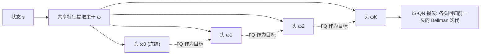

# Bridging the Performance-Gap Between Target-Free and Target-Based Reinforcement Learning

**会议**: ICLR 2026  
**OpenReview**: [https://openreview.net/forum?id=ltcxS7JE0c](https://openreview.net/forum?id=ltcxS7JE0c)  
**代码**: [https://github.com/theovincent/iS-DQN](https://github.com/theovincent/iS-DQN)  
**领域**: reinforcement learning  
**关键词**: 目标网络, 价值函数学习, 内存高效RL, iterated Q-learning, 共享特征  

## 一句话总结
用在线网络最后一层线性头的旧副本充当目标网络、其余参数全部共享，再叠加 iterated Q-learning 并行学多步 Bellman 迭代，在几乎不增加显存的前提下补齐了 target-free 与 target-based 之间的性能差距。

## 研究背景与动机
**领域现状**：深度 Q-learning 自 DQN 以来普遍依赖目标网络（target network）——把回归目标 $\Gamma Q_{\bar\theta}$ 建立在一份周期性同步的旧参数 $\bar\theta$ 上，借此缓解半梯度自举与函数逼近带来的训练不稳定（deadly triad 的一部分）。大量消融实验都证明目标网络对维持性能至关重要，甚至一些最初宣称"无目标网络"的方法在重新引入目标网络后反而更好。

**现有痛点**：目标网络的代价是把 Q-network 占用的内存翻倍。这直接限制了在线网络的规模，尤其在显存受限的边缘设备、高维状态空间、多模态输入、混合专家等天然需要大网络的场景里成了硬约束。于是社区分化出 target-free 这一支，试图彻底去掉目标网络以省内存。

**核心矛盾**：target-free 省内存但牺牲了样本效率与稳定性（去掉目标网络后 AUC 普遍掉 10%，无归一化层时甚至掉 60%）；target-based 稳但费内存。已有工作要么在 target-free 上叠加各种正则化（Fourier 特征、MellowMax、BatchNorm）勉强补救，要么走 iterated Q-learning 提速但需要额外保存整份参数副本，内存开销不降反升。两条路都没能同时拿到"低内存 + 高样本效率"。

**本文目标**：跳出 target-free / target-based 的二元选择，设计一个既保持 target-free 低内存足迹、又能复用 target-based 文献全部成果（含 iterated Q-learning）的统一框架。

**核心 idea**：**仅复制最后一层线性头作为目标网络，其余层全部与在线网络共享**——目标网络几乎不额外占内存；再把 **iterated Q-learning 的多头并行 Bellman 迭代** 嫁接到这个共享骨干上，用极少的线性头参数换取样本效率，得到 **iterated Shared Q-Network (iS-QN)**。

## 方法详解

### 整体框架
iS-QN 用**单个 Q-network 配 $K{+}1$ 个线性头**取代"在线网络 + 独立目标网络"的双网络结构。共享参数 $\omega$（特征提取主干）被所有头复用，第 $k$ 个头的参数记作 $\omega_k$，于是 $\theta_k=(\omega,\omega_k)$，整体 $\theta=(\omega,\omega_0,\dots,\omega_K)$。每个头 $Q_{\theta_k}$ 被训练去逼近前一个头的 Bellman 迭代 $\Gamma Q_{\theta_{k-1}}$，从而 $Q_{\theta_K}\approx\Gamma Q_{\theta_{K-1}}\approx\cdots\approx\Gamma^K Q_{\theta_0}$，一次前向就并行学了 $K$ 步 Bellman 更新。$K=1$ 时退化为"Shared Features"（单目标头共享特征），$K$ 个独立完整副本则退化回 i-QN。

### 关键设计

**1. 共享特征 + 冻结线性头当目标网络：用一层的内存换稳定性。** 传统目标网络存的是整份旧参数 $\bar\theta$，内存翻倍；iS-QN 只保留最后一层线性头的旧副本 $\omega_0$（不参与梯度），目标网络的其余层全部借用最新在线主干 $\omega$。这样回归目标 $\Gamma Q$ 既"半新半旧"（特征实时、读出头滞后），又几乎零额外内存——因为线性头相对整个主干的参数量可忽略。论文进一步用梯度分析说明这不是权宜之计：iS-DQN $K=1$ 的梯度与 target-based 损失梯度的余弦相似度，明显高于 target-free 与 target-based 的相似度，尤其在训练初期，说明仅共享特征 + 冻结头就已把学习动力学拉向 target-based 一侧。作者还提出 **target churn**（一次 batch 更新前后回归目标的绝对变化量）来量化：target-based 因目标网络完全隔离 churn 恒为零，而共享特征让 iS-QN 的 target churn 被压低，逼近 target-based 的稳定性。

**2. iterated Q-learning 嫁接到共享骨干：用多头并行换样本效率。** 单纯共享特征只能补一部分差距，真正提速靠把 iterated Q-learning 接进来。训练损失把每个头对前一头的回归叠加起来：

$$\mathcal{L}^{\text{iS-QN}}_d(\theta)=\sum_{k=1}^{K}\mathcal{L}^{\text{QN}}_d(\theta_k,\theta_{k-1}),\quad \mathcal{L}^{\text{QN}}_d(\theta_k,\theta_{k-1})=\big(\lceil r+\gamma\max_{a'}Q_{\theta_{k-1}}(s',a')\rceil-Q_{\theta_k}(s,a)\big)^2$$

其中 $\lceil\cdot\rceil$ 是停止梯度。$\omega_0$ 永不学习；每 $T$ 步执行一次"链式平移" $\omega_k\leftarrow\omega_{k+1}$，使整个 Bellman 迭代窗口向最优 Q 方向前移一格。相比 target-based 每 $T$ 步只前进一步 Bellman 迭代，iS-QN 同一份样本就同时学了窗口内多步，样本效率显著提升。其中 $\mathcal{L}^{\text{QN}}$ 可换成任意 TD 算法的损失（DQN/CQL/SAC 的 categorical/ILQL），因此该设计与底层算法解耦。

**3. 与正则化技巧正交、且不止于 iterated 这一种共享方式。** iS-QN 不与 target-free 的正则化手段冲突，而是叠加增益：离散动作下用 LayerNorm（连 target-based 也受益），连续控制下用 BatchNorm（SimbaV2），MellowMax 等也能组合。作者还验证"共享线性头"这个内核不局限于 iterated 一种拓扑——把它套到 Ensemble DQN 上得到 **Ensemble Shared Features (ES-CQL)**：用 5 对（共 10 个）线性头，每对一个冻结头当目标、一个学习头当在线，同样跑赢 target-free，说明"共享主干 + 线性头表示目标"是一条通用的省内存路线。多头数 $K$ 并非越大越好——表征容量不足时（如 CNN + 无归一化）过多线性头会因主干表达不够而退化。

## 实验关键数据

### 主实验表格（各场景 AUC，归一化到对应 target-based = 100%）

| 场景 / 算法 | 架构 | TF（无目标网络） | iS-QN 最佳 | 备注 |
|---|---|---|---|---|
| 在线离散 (15 Atari) | CNN + LN | 90% | **iS-DQN K=9 → 106%** | 反超 target-based 6%，参数≈TF |
| 在线离散 (15 Atari) | CNN 无归一化 | 40% | **iS-DQN K=3 → 85%** | 差距 60%→15%，缩到 1/4 |
| 在线离散 (10 Atari) | IMPALA + LN | 92% | iS-DQN K=49 补平 | 富表征下 K 可更大 |
| 离线离散 (10 Atari) | IMPALA + LN | 74% | **iS-CQL K=9 → 94%** | 差距 26%→6% |
| 在线连续 (7 DMC Hard) | SimbaV2 + BN | 50%+ | **iS-SAC K=1 即补平** | 总参数省 49% |
| 离线语言 (Wordle) | GPT-2 small | <100% | **iS-ILQL K=9 → 105%+** | 反超 target-based，省 88M 参数(33% RAM) |
| 流式 (7 Atari) | CNN + LN | 100%(基准) | **iS-Stream Q(λ) K=3 → 110%+** | 6/7 游戏持平或更优 |

### 消融实验表格

| 消融维度 | 设置 | 发现 |
|---|---|---|
| 头数 $K$ | 1 / 4 / 9 / 49 | $K$ 增大差距递减；但 CNN 上 K=49 退化（主干表征不足），IMPALA 上 K=49 仍有益 |
| 共享拓扑 | iterated (iS) vs Ensemble (ES) | 两者均跑赢 TF-CQL，证明"共享+线性头"不限于 iterated |
| 归一化层 | 有/无 LN、BN | LN 对多头表征关键；BN 在连续控制提样本效率、但在 target-based 离散下反而掉点 |
| 损失加权 | 均匀 vs 折扣 0.25 | 连续控制下给靠前 Bellman 项更大权重更稳，未来可用 meta-gradient 学权重 |

### 关键发现
- iS-DQN $K=1$（仅存一个旧线性头）就已稳定优于 target-free，说明"共享特征 + 冻结头"本身就是有效的轻量目标网络。
- 多个场景下 iS-QN 不仅补平、还能**反超** target-based（Atari +6%、Wordle +5%），同时把 Q-network 参数砍掉约一半。
- 梯度余弦相似度 + target churn 两项诊断指标，从学习动力学角度解释了为什么共享特征能把行为拉近 target-based。

## 亮点与洞察
- **极简却普适**：核心改动只是"复制最后一层线性头 + 共享其余参数"，却能横跨在线/离线、离散/连续、CNN/IMPALA/SimbaV2/GPT-2、Atari/DMC/Wordle/流式七大设置一致生效。
- **统一视角**：把 target-free 重新诠释为"每步都同步目标网络的极端 target-based"，从而把二元对立放进同一连续谱（窗口平移频率），框架上很优雅。
- **省内存是真省**：DMC 上省 49% 参数、Wordle 上省 88M 参数（33% RAM），而非只是理论分析，对边缘/大模型 RL 有现实意义。
- **诊断扎实**：target churn 这一新指标 + 梯度相似度，给"为什么 work"提供了可量化证据，而非仅靠跑分。

## 局限与展望
- 多头损失各项的加权方式尚未解决——连续控制需手调折扣 0.25，作者把 meta-gradient 自适应权重列为 future work。
- $K$ 的最优值强依赖主干表征容量与归一化层，缺乏自动选 $K$ 的机制；表征不足时过大 $K$ 反而退化。
- 线性头共享要求目标只用最后一层线性映射就能良好逼近 Bellman 迭代，对需要深层非线性差异的目标可能受限。
- 流式无 batch 场景方差大，过多头会让共享参数更新不稳，适用 $K$ 偏小。

## 相关工作与启发
本文站在 **iterated Q-learning**（Vincent et al. 2025b / 2024、Schmitt et al. 2022）和**去目标网络**两条线的交叉点上。去目标网络一支包括流式 RL（Action Value Gradient、Stream Q(λ)）、Gradient TD（需双倍计算与额外网络）、以及靠正则化补救的 MellowMax(Kim 2019)、Fourier 特征(Li & Pathak 2021)、BatchNorm(Bhatt 2024)、LayerNorm(Gallici 2025)。本文的差异化在于：不是再发明一种正则化，而是提出一种**与所有这些技巧正交的轻量目标网络构造方式**，并能直接复用 iterated Q-learning 的提速红利。对后续研究的启发是：目标网络与在线网络的"分离程度"是一个可调设计维度，共享主干 + 少量冻结读出头，可能是平衡稳定性与内存的通用范式。

## 评分
- 新颖性: ⭐⭐⭐⭐ 把"目标网络只保留最后一层"与 iterated Q-learning 结合，视角统一且改动极简，但两个组件分别源自已有工作，属于巧妙嫁接而非全新机制。
- 实验充分度: ⭐⭐⭐⭐⭐ 覆盖在线/离线/连续/语言/流式五大场景、四种架构，含梯度相似度与 target churn 诊断，统计用 IQM + 自助置信区间，扎实。
- 写作质量: ⭐⭐⭐⭐ 动机清晰、图示（训练路径窗口平移）直观，统一谱视角讲得好；部分符号与多场景结论略密集。
- 价值: ⭐⭐⭐⭐ 直击 RL 显存瓶颈，省一半参数还常反超 target-based，对边缘设备与大模型 RL 有实际落地意义。

<!-- RELATED:START -->

## 相关论文

- [\[ICLR 2026\] Q-Learning with Fine-Grained Gap-Dependent Regret](q-learning_with_fine-grained_gap-dependent_regret.md)
- [\[ICLR 2026\] On the Tension Between Optimality and Adversarial Robustness in Policy Optimization](on_the_tension_between_optimality_and_adversarial_robustness_in_policy_optimizat.md)
- [\[ICLR 2026\] A Reward-Free Viewpoint on Multi-Objective Reinforcement Learning](a_reward-free_viewpoint_on_multi-objective_reinforcement_learning.md)
- [\[ICLR 2026\] RLAC: Reinforcement Learning with Adversarial Critic for Free-Form Generation Tasks](rlac_reinforcement_learning_with_adversarial_critic_for_free-form_generation_tas.md)
- [\[ICLR 2026\] MIRACLE: Model-free Imitation and Reinforcement Learning for Adaptive Cut-Selection](miracle_model-free_imitation_and_reinforcement_learning_for_adaptive_cut-selecti.md)

<!-- RELATED:END -->
