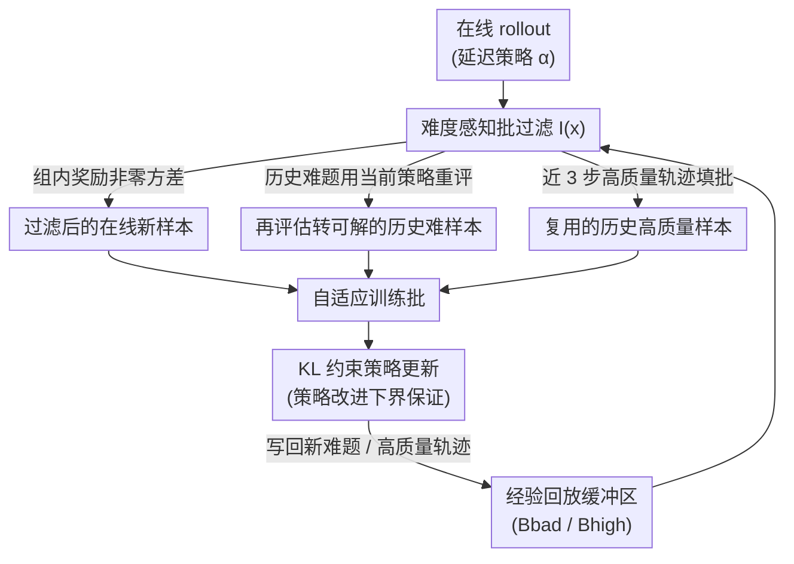

# Buffer Matters: Unleashing the Power of Off-Policy Reinforcement Learning in Large Language Model Reasoning

**会议**: ICLR2026  
**OpenReview**: [https://openreview.net/forum?id=RduOiisl1S](https://openreview.net/forum?id=RduOiisl1S)  
**代码**: 有（原文以 "The code is available in Here" 形式给出链接，⚠️ 具体仓库以原文为准）  
**领域**: LLM推理 / 强化学习 / RLVR / 离策略RL  
**关键词**: 离策略RLVR, 经验回放, 难样本, GRPO, 自适应批构造

## 一句话总结
针对在线（on-policy）RLVR 训练中"难样本学不动、采样数据用一次就扔"两大浪费，本文提出离策略框架 **BAPO（Batch Adaptation Policy Optimization）**，用一个"难度感知的经验回放 + 自适应批构造"机制把历史难题和历史高质量轨迹重新拉回训练批次，并在理论上证明改造后的批次仍满足策略改进下界，最终在数学、规划、视觉几何三类推理任务上平均比 GRPO 提升 12.5%，还把基座模型一直做不对的 40.7% 难题给解决了。

## 研究背景与动机
**领域现状**：用可验证奖励做强化学习（RLVR，Reinforcement Learning with Verifiable Rewards）已经成为 LLM 后训练提升推理能力的主流路线。它用一个确定性的验证函数（答案对/错给 0/1 奖励）替代昂贵且易被 hack 的神经奖励模型。代表方法是 GRPO（Group Relative Policy Optimization），以及它的变体 DAPO、GSPO 等，在数学、代码、下游推理上都拿到了亮眼成绩。

**现有痛点**：作者用一张实验图点出了问题——经过 GRPO 后训练，模型对"难样本"几乎没有长进，尤其是那些在初始 rollout 组里准确率为 0 的题目，训练前后数量几乎不变。背后是两个具体毛病：

- **奖励同质化（Homogeneous rewards）**：GRPO 系方法的优势估计 $\hat{A}_{i,t} = \frac{r_i - \mathrm{mean}(\{r_\ell\})}{\sqrt{\mathrm{std}^2(\{r_\ell\}) + \varepsilon}}$ 完全依赖组内奖励的相对差异。当一组采样全对或全错（组内奖励一模一样），方差为零、优势为零，梯度贡献几乎可以忽略，策略改进的下界直接坍塌。极难和极易的样本就这样白白浪费。
- **经验浪费（Waste of experience）**：因为策略改进对组内奖励方差很敏感，难度分布不均时，真正"有效"（组内奖励非同质）的样本数远少于配置的 batch size。而 on-policy 方法天生没有经验回放，每个 rollout 组用一次就丢，大量宝贵的采样数据被白扔。

**核心矛盾**：一个直觉的解法是改用离策略（off-policy）训练，复用历史经验来提升样本效率——这在传统 RL 里早被验证可行。但**直接把"复用样本"塞进 LLM 后训练会出事**：历史样本来自不同时刻的旧策略，分布漂移会引入噪声，导致熵坍塌（entropy collapse）、训练不稳定，最终性能反而下降。更糟的是，盲目复用高准确率的历史样本会让模型死磕已有高优势推理路径，压制探索，过早收敛到次优解。

**本文目标**：系统性地拆解"陈旧的离策略经验到底怎么用才有效"，把多种离策略策略融进 on-policy RLVR 框架，找到既能复用历史数据、又不破坏训练稳定性的路径。

**核心 idea**：与其简单地把缓冲区数据和在线数据一锅混，不如**按难度分类地复用**——对历史难题用当前策略重新生成回答、挑出"已经能做对一点"的拿来探索；对历史高质量轨迹设动态质量阈值直接复用填批；并给整个自适应批构造配上 KL 约束和策略改进下界的理论保证。

## 方法详解

### 整体框架
BAPO 是一个离策略 RLVR 后训练框架，目标是把 GRPO 那种"采一次、用一次、丢一次"的批次，改造成"在线新样本 + 两类历史经验"混合而成的自适应批次，同时保证每一步训练的批次都维持**非同质奖励**和**合适的难度分布**。

训练目标 $\mathcal{L}_\alpha(\pi_\theta)$ 被写成"在线新样本贡献 + 历史缓冲样本贡献 − KL 正则"三块：

$$\mathcal{L}_\alpha(\pi_\theta) = \mathbb{E}_{(x,y)\sim\alpha}\big[\rho_\alpha(\theta)\hat{A}(x,y)\big] + \mathbb{E}_{(x,y)\sim B}\big[\rho_{\alpha_B}(\theta)\hat{A}(x,y)\big] - \beta\cdot D_{KL}(\pi_\theta\|\alpha)$$

其中 $\alpha=\pi_{\theta_{t-v}}$ 是带 $v$ 步延迟的 rollout 策略，$B$ 是经验回放缓冲区，$\rho_\alpha$、$\rho_{\alpha_B}$ 是对应的重要性采样比。整个流程的核心是一个**批过滤函数** $I(x)$：它在每一步把候选数据切成三个互补的子集——经过过滤的在线新样本 $X_1$、被重新评估后"转可解"的历史难样本 $X_2$、被复用来填满批次的历史高质量样本 $X_3$。三者拼成一个 batch 去更新策略，再把新产生的难题和高质量轨迹按规则写回缓冲区，形成闭环。

### 关键设计

**1. 难度感知的批过滤函数：把"哪些样本进批"显式拆成三条标准**

这是 BAPO 的总开关，直接针对"奖励同质化 + 经验浪费"两个痛点。作者定义期望奖励 $\mu_{\pi,r}(x) = \mathbb{E}_{y\sim\pi(\cdot|x)}[r(x,y)]$，然后把指示函数 $I(x)$ 写成三个条件之和：

$$I(x) = \underbrace{\mathbf{1}_{\{\frac{1}{G}\le\mu_{\alpha,r}(x)\le\frac{G-1}{G}\}}}_{\text{过滤新样本}} + \underbrace{\mathbf{1}_{\{\mu_{\alpha_B,r}(x)\le c_1\,\wedge\,\mu_{\pi_{\theta_t},r}(x)>c_1\}}}_{\text{转可解的历史难题}} + \underbrace{\mathbf{1}_{\{c_2\le\mu_{\alpha_B,r}(x)\le c_3\}}}_{\text{历史高质量}}$$

它的巧妙在于：不是简单地把缓冲数据和在线数据按固定比例混合（那样无法控制难度和奖励方差），而是**按每个样本当前的期望奖励落点**决定它的去向。三个条件分别产出 $X_1, X_2, X_3$，共同保证一个批次里既没有"全对/全错"的零梯度样本，又始终塞满了有学习价值的题目。

**2. 转可解历史难样本 $X_2$：让"以前不会、现在会一点"的难题重回训练**

针对痛点——极难样本（组内平均奖励落在 $[0, c_1]$）当下对策略毫无贡献，但随着模型进化，这些题"将来"可能变得可解。BAPO 维护一个专放难题的 FIFO 缓冲区 $B_{bad}$，每隔 $m$ 步就用**当前策略** $\pi_{\theta_t}$ 对这些历史难题重新生成回答，挑出确实出现进步的：

$$X_2 = \big\{(x, y') \mid (x,y)\in B_{bad},\, y'\sim\pi_{\theta_t}(\cdot|x),\, c_1 < \mu_{\pi_{\theta_t},r}(x) < 1\big\}$$

只有当重评后期望奖励落进 $(c_1, 1)$（即从"全错"变成"做对一部分"）才入选。$B_{bad}$ 容量被限制为等于 batch size、用 FIFO 自动淘汰陈旧样本以控制重评开销。这一步用**当前策略重新生成 $y'$**（而非直接复用旧回答），所以它不是被动复用，而是用历史难题作为线索主动驱动探索——这正是其他离策略方法所缺的。

**3. 复用历史高质量样本 $X_3$：用近期高质量轨迹填满批次、又不引入陈旧噪声**

针对痛点——$X_1$（有效在线样本）和 $X_2$（转可解难题）数量都不够时，批次会被填不满，浪费算力。BAPO 维护辅助 FIFO 缓冲区 $B_{high}$，**只保留最近三步**的高质量轨迹（限制时效以缓解陈旧数据带来的不稳定），随机采样补齐剩余容量：

$$X_3 = S\big(B_{high},\, \min(|B_{high}|,\, B - |X_1| - |X_2|)\big)$$

关键的一招是**动态质量阈值**：为了让模型逐步啃下越来越难的题，$c_2, c_3$ 不是定死的，而是随全局平均表现 $r_{tot}$ 线性平移——$c_i = r_{tot}\cdot(c_i^{high} - c_i^{low}) + c_i^{low}$。模型整体变强后，"高质量"的判定标准也跟着抬高，把复用的样本从简单题逐渐推向难题，避免模型死守低难度高优势路径而过早收敛。

**4. 带 KL 约束的策略改进下界保证：从理论上证明改造后的批次不会训崩**

针对痛点——离策略复用最大的风险是分布漂移引发训练不稳定。作者基于 Mroueh 等人的定理证明了 **Theorem 3.2（自适应训练批的策略改进下界）**：在奖励有界 $0\le r\le 1$、且各子集的 TV 距离约束 $\mathrm{TV}(\pi_{\theta_t}(\cdot|x), \alpha_i(\cdot|x))\le\delta_i$ 足够小的假设下，过滤样本上的期望策略改进满足

$$\mathbb{E}_{x\sim\rho_X}\big[I(x)(J(\pi_\theta(\cdot|x)) - J(\pi_{\theta_t}(\cdot|x)))\big] \ge \sum_{i=1}^{3} \mathcal{L}_i(\pi_\theta, \alpha_i)$$

其中常数 $K_1, K_2, K_3$ 都是有限正值（由 $G$、$c_1$、$c_2$、$c_3$ 决定），保证训练数值稳定、理论有界（**有界稳定性**）；同时信任域方法本身约束了单步更新幅度，加上严格 FIFO + 有限缓冲容量只保留近期策略的样本，使批次内策略一致性得以维持（**离策略容忍度**）。这套理论正是 BAPO 敢于复用陈旧经验、却不像朴素复用那样训崩的底气。

### 损失函数 / 训练策略
优化目标即上文 $\mathcal{L}_\alpha(\pi_\theta)$：在线样本与缓冲样本各自用对应的重要性采样比加权优势，再减去对延迟 rollout 策略 $\alpha$ 的 KL 正则项 $\beta\cdot D_{KL}(\pi_\theta\|\alpha)$。三个子集 $X_1, X_2, X_3$ 拼成自适应批后做策略更新；难题缓冲 $B_{bad}$ 每 $m$ 步触发一次重评，高质量缓冲 $B_{high}$ 仅留近 3 步样本。实现基于 Verl 框架，全部对比实验在 8 张 A100（80GB）上跑，所有方法用相同参数以保证公平。

## 实验关键数据

### 主实验
任务覆盖三类推理：数学（DeepScaleR 数据集，DeepSeek-R1-Distill-Qwen-1.5B / Qwen3-8B）、规划（Countdown 数字游戏，Qwen2.5-Math-1.5B/7B）、视觉几何（Geometry3K，Qwen2.5-VL-3B/7B）。准确率为 32 次运行平均。

数学基准（DeepSeek-R1-Distill-Qwen-1.5B）：

| 方法 | 类型 | AIME24 | AMC | MATH500 | Minerva | Olympiad | Avg ↑ | Rollouts ↓ |
|------|------|--------|-----|---------|---------|----------|-------|------------|
| 基座 | - | 28.80 | 62.90 | 82.80 | 26.50 | 44.42 | 48.90 | - |
| +GRPO | on | 30.73 | 67.47 | 85.40 | 28.95 | 45.33 | 51.58 | 677k |
| +DAPO | on | 35.73 | 70.08 | 86.05 | 30.70 | 48.48 | 54.20 | 1921k |
| +GRPO(v=5) | off | 30.49 | 65.09 | 86.72 | 28.16 | 46.18 | 51.57 | 677k |
| +RePO | off | 30.42 | 64.76 | 83.75 | 28.33 | 45.44 | 50.54 | 677k |
| +Remix-GRPO | off | 33.33 | 65.06 | 84.60 | 26.10 | 43.55 | 50.53 | - |
| **+BAPO（本文）** | off | **38.54** | **72.74** | **89.18** | 29.55 | **50.06** | **56.01** | 733k |

BAPO 在数学上比 GRPO 高约 4.4 个点，且整体平均比 baseline 提升约 12.5%。值得注意的是：DAPO 虽然在部分指标接近 BAPO，但它消耗约 **2.5 倍的 rollout**（1921k vs 733k），算力负担沉重；BAPO 在 off-policy 阵营里也是唯一稳定胜过 on-policy GRPO 的方法。

### 消融实验
规划（Countdown）与视觉几何（Geometry3K）上去掉关键子集的对比：

| 配置 | CD-34 | CD-4 | Avg | Geo-3K(val) | Geo-3K(test) | Avg |
|------|-------|------|-----|-------------|--------------|-----|
| +GRPO | 62.94 | 35.88 | 49.41 | 36.44 | 43.12 | 39.78 |
| +DAPO | 70.56 | 45.87 | 58.22 | 40.11 | 45.18 | 42.65 |
| +BAPO w/o $X_2$ | 60.31 | 35.31 | 47.81 | 30.57 | 36.92 | 33.75 |
| +BAPO w/o $X_3$ | 64.43 | 38.75 | 51.59 | 32.22 | 39.79 | 36.01 |
| **+BAPO（完整）** | **73.00** | **47.50** | **60.25** | **40.11** | **46.33** | **43.22** |

（以 Qwen2.5-Math-1.5B / Qwen2.5-VL-3B 为基座）

### 关键发现
- **$X_2$（转可解历史难题）贡献最大**：去掉它后视觉几何平均从 43.22 暴跌到 33.75（掉近 10 个点），甚至跌破 GRPO，说明"用当前策略重评历史难题、挑出转可解的"这一步是 BAPO 解决难样本的核心引擎。
- **$X_3$（复用高质量样本）也不可或缺**：去掉后几何平均掉到 36.01、规划掉到 51.59，证明动态阈值的高质量复用对填满有效批次、稳定收敛确有价值。
- **样本效率上 off-policy 真香**：BAPO 用与 GRPO 相近的 rollout 数（733k vs 677k）就取得显著更优的结果，而 DAPO 要靠 2.5× rollout 才接近；机制分析进一步表明 BAPO 的收益主要来自离策略组件的结构逻辑，而非敏感的超参调校——即便在"无参数"的极简验证设置下框架依然有效。
- **解决基座顽固难题**：BAPO 成功解决了 40.7% 基座模型始终做不对的题目，直接回应了开篇"GRPO 后训练对难样本几乎无效"的观察。

## 亮点与洞察
- **"按难度分流"而非"按比例混合"**：BAPO 最巧的地方是不把缓冲区当成一锅大杂烩，而是用期望奖励把样本切成三类各司其职——这让"复用历史经验"第一次能精确控制批次的难度分布和奖励方差，规避了朴素复用的熵坍塌。这个分流思路可迁移到任何带经验回放的 LLM-RL 框架。
- **历史难题不是直接复用，而是"重评探索"**：$X_2$ 用当前策略对旧难题重新采样、只留转可解的，把"复用"从被动变主动——这相当于给探索装了一个"难度课程表"，随模型能力自然推进。
- **理论与工程同时落地**：策略改进下界（Theorem 3.2）+ FIFO 有限缓冲 + 动态阈值三者配合，把"离策略容易训崩"的老问题用有界常数 $K_1,K_2,K_3$ 给框住，是少见的"理论保证真的指导了工程设计"的例子。
- **样本效率视角的提醒**：DAPO 用 2.5× rollout 才追平 BAPO，说明后训练方法的比较不能只看准确率，rollout 预算同样是核心指标——这对算力受限的团队尤其有参考价值。

## 局限与展望
- **理论假设较强**：策略改进下界依赖 TV 距离 $\delta_1, \delta_3$"足够小"以及奖励有界，实际训练中分布漂移能否始终满足约束、阈值 $c_1, c_2, c_3$ 的选取是否鲁棒，仍需更多边界情形验证。
- **超参与缓冲机制仍有调校空间**：重评周期 $m$、$B_{bad}$/$B_{high}$ 容量、近 3 步的时效窗口都是经验设定；虽然作者用"极简验证"论证收益主要来自结构而非调参，但不同任务/基座下这些设置的可迁移性还需更广泛检验。
- **任务与规模覆盖有限**：实验集中在数学、规划、视觉几何三类有明确可验证奖励的任务，最大到 7B/8B 模型；在代码生成、开放式推理、更大规模模型上的表现尚未展示。
- **改进方向**：可以探索把难度感知过滤与课程学习、自动阈值搜索结合，或把"重评难题"的思路扩展到多步/工具调用类长程推理任务。

## 相关工作与启发
- **vs GRPO**：GRPO 是纯 on-policy、组内相对优势、用一次即弃；BAPO 在其框架上加离策略经验回放，用难度分流批构造解决了 GRPO 在难样本和奖励同质化上的失效，平均提升约 12.5%。
- **vs DAPO**：DAPO 同样想解决 $\hat{A}=0$ 的问题，靠动态采样 + 双侧 clip，但要消耗约 4×（实测约 2.5×）的 rollout；BAPO 用近似 GRPO 的预算就达到更优效果，样本效率显著更高。
- **vs 朴素离策略方法（RePO / Remix-GRPO / GRPO(v=5)）**：这些方法用各种回放/延迟策略检索缓冲样本，但大多忽略了经验的策略稳定性，复用陈旧高准确率样本反而抑制探索、过早收敛；BAPO 用 FIFO 时效限制 + 当前策略重评 + 动态阈值规避了这一陷阱，是 off-policy 阵营里唯一稳定超过 on-policy GRPO 的。
- **vs ReLIFT / DOTS / Kimi-K1.5 等缓冲策略**：它们或存高质量解做交错 SFT、或维护 FIFO 复用近期轨迹、或存完整+部分轨迹降时序相关；BAPO 的差异在于把"难题重评探索"和"高质量动态阈值复用"统一进一个带理论下界的批过滤函数里。

## 评分
- 新颖性: ⭐⭐⭐⭐ 难度感知三路批构造 + 难题重评探索的组合在离策略 RLVR 里较新颖，理论下界为工程设计提供了支撑。
- 实验充分度: ⭐⭐⭐⭐ 覆盖数学/规划/视觉几何三类任务、多基座、多 on/off-policy baseline，并有针对性消融，但规模和任务类型仍可更广。
- 写作质量: ⭐⭐⭐⭐ 痛点→机制→理论的逻辑清晰，公式与定义完整，三类子集命名直观易懂。
- 价值: ⭐⭐⭐⭐ 用相近 rollout 预算显著提升难样本解决率，对算力受限的 LLM 后训练有实际参考价值。

<!-- RELATED:START -->

## 相关论文

- [\[ICLR 2026\] Squeeze the Soaked Sponge: Efficient Off-Policy RFT for Large Language Model](squeeze_the_soaked_sponge_efficient_off-policy_rft_for_large_language_model.md)
- [\[ICLR 2026\] Structured In-context Environment Scaling for Large Language Model Reasoning](structured_in-context_environment_scaling_for_large_language_model_reasoning.md)
- [\[ICLR 2026\] Revisiting Group Relative Policy Optimization: Insights into On-Policy and Off-Policy Training](revisiting_group_relative_policy_optimization_insights_into_on-policy_and_off-po.md)
- [\[ICLR 2026\] Toward Efficient Exploration by Large Language Model Agents](toward_efficient_exploration_by_large_language_model_agents.md)
- [\[ICML 2026\] Coupled Variational Reinforcement Learning for Language Model General Reasoning](../../ICML2026/reinforcement_learning/coupled_variational_reinforcement_learning_for_language_model_general_reasoning.md)

<!-- RELATED:END -->
