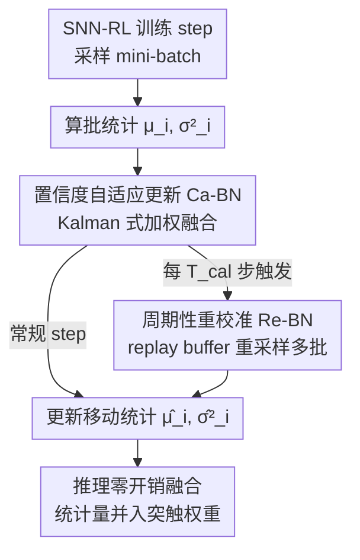

# CaRe-BN: Precise Moving Statistics for Stabilizing Spiking Neural Networks in Reinforcement Learning

**会议**: ICLR2026  
**OpenReview**: [https://openreview.net/forum?id=AaZVrbElhC](https://openreview.net/forum?id=AaZVrbElhC)  
**代码**: https://github.com/xuzijie32/CaRe-BN  
**领域**: 强化学习 / 脉冲神经网络 / 批归一化  
**关键词**: 脉冲神经网络, 在线强化学习, 批归一化, 移动统计量, 置信度自适应

## 一句话总结
针对脉冲神经网络（SNN）在在线 RL 中因 BN 移动统计量估计不准而训练不稳的问题，本文提出 CaRe-BN：用「置信度自适应更新」（Kalman 式加权）实时低方差地估计 BN 统计量，再用「周期性重校准」（从 replay buffer 重采样大批量）纠偏，使 SNN 智能体在 Atari/MuJoCo 上性能提升最高 22.6%，甚至反超对应 ANN 5.9%，且推理零额外开销。

## 研究背景与动机
**领域现状**：脉冲神经网络（SNN）以事件驱动、二值脉冲的方式计算，天然适合神经形态硬件上的低延迟、低功耗推理，把它和强化学习结合（SNN-RL）有望训练出既能学复杂控制策略、又能在边缘设备上极低能耗运行的智能体。但 SNN 的脉冲是离散、不可微的，反向传播只能靠 surrogate gradient 近似，直接训练时梯度极易爆炸或消失，因此**批归一化（BN）对 SNN 不是可有可无、而是稳定训练的关键部件**——它通过规整激活统计量来稳住膜电位和梯度流。

**现有痛点**：BN 在监督学习里工作得很好，但搬到在线 RL 就「崩」了。BN 推理时用的是训练过程中累积的移动统计量 $(\hat\mu_i, \hat\sigma_i^2)$，通常用 EMA 估计。问题在于 RL 的数据分布是**非平稳**的：智能体策略一直在变，激活分布随之漂移。这时 EMA 陷入「噪声—延迟」两难——动量小则平稳但跟不上快速漂移（估计滞后），动量大则跟得快但放大了小批量估计的噪声。论文 Figure 1 直观地展示了这一点：分布快速变化时估计落后，分布相对稳定时估计含噪。

**核心矛盾**：在监督学习里，训练用 mini-batch 统计、推理用移动统计，两者不一致是可以容忍的，因为不准的移动统计**不直接参与梯度更新**。但在线 RL 里，智能体要靠当前的（推理）统计量去**探索和利用**，统计量一旦不准，就会选出次优动作、产生劣质轨迹，这些轨迹又被放回 replay buffer 训练，形成恶性循环、拖慢收敛甚至发散。

**本文目标**：在非平稳分布下，设计一个能**实时、低方差**地估计 BN 推理统计量的机制，让 SNN 在 RL 训练全程都拿到准确的归一化。这一问题对 SNN 尤其致命——传统 ANN-RL 算法（DQN/DDPG/TD3/PPO）干脆不要 BN 也能稳定训练，但 SNN 离开 BN 会严重梯度不稳、性能大幅退化，没有「去掉 BN」这条退路。

**核心 idea**：把 BN 移动统计量的估计当成一个**带噪声观测的滤波问题**——用 Kalman 思想按「置信度」自适应地加权融合「上一步估计」和「当前 mini-batch 观测」（Ca-BN），再周期性地从 replay buffer 重采样大批量做精确重校准（Re-BN）纠偏，从而在分布漂移下逼出准确统计量，且只改训练、不动推理。

## 方法详解

### 整体框架
CaRe-BN 要解决的是「在线 RL 非平稳分布下，BN 移动统计量估不准」这一个问题，整套方法只动统计量的**估计方式**，不碰梯度更新、不碰推理结构。它由两个互补机制组成：**Ca-BN**（置信度自适应更新）在**每个训练 step** 都跑，给出在线、低方差的统计量估计；**Re-BN**（重校准）**每隔 $T_{cal}$ 步**跑一次，从 replay buffer 重采样多批数据算一次更精确的统计量来纠偏累积误差。训练时这两套估计协同更新 BN 的 $(\hat\mu, \hat\sigma^2)$；推理时 CaRe-BN 退化为普通 BN，统计量直接融进突触权重，部署零额外开销。

### 关键设计

**1. Ca-BN 置信度自适应更新：按可信度动态加权，绕开 EMA 的噪声—延迟两难**

普通 BN 用固定动量 $\alpha$ 的 EMA 更新统计量：$\hat\mu_i \leftarrow (1-\alpha)\hat\mu_{i-1} + \alpha\mu_i$。固定 $\alpha$ 没法同时应付「分布快变」和「分布稳定」两种相反场景，这正是前面说的噪声—延迟两难。本文受 Kalman 滤波启发，把「上一步估计」$\hat\mu_{i|i-1}$ 和「当前批观测」$\mu_i$ 都看作总体真值 $\mu_i^*$ 的两个无偏估计，求使均方误差最小的最优线性组合（Theorem 1）：

$$\hat\mu_i = (1-K_i^\mu)\hat\mu_{i|i-1} + K_i^\mu \mu_i,\qquad K_i^\mu = \frac{D(\mu_i^*-\hat\mu_{i|i-1})}{D(\mu_i^*-\hat\mu_{i|i-1}) + D(\mu_i^*-\mu_i)}$$

其中 $D(\cdot)$ 是广义方差，置信度定义为方差的倒数 $1/D$。直觉很清晰：谁更可信（方差更小），最优权重 $K$ 就更偏向谁。两个方差怎么估？对 mini-batch 观测，在高斯假设下有解析式 $D(\mu_i^*-\mu_i)=\sigma_i^{*2}/N \approx \sigma_i^2/N$、$D(\sigma_i^{*2}-\sigma_i^2)\approx 2\sigma_i^4/(N-1)$（批越大越可信）；对上一步估计的误差因为真值未知无法直接算，就用平方偏差 $(\mu_i-\hat\mu_{i|i-1})^2$ 作为无偏但带噪的探针，再用一个带动量 $\alpha$ 的 EMA 平滑成 $D_i^\mu$。这样自适应权重自然成立：分布快变时 $D_i^\mu$ 变大、$K_i^\mu$ 增大、加速跟踪；分布稳定时 $D_i^\mu$ 缩小、$K_i^\mu$ 减小、抑制小批量噪声——一个权重把两种场景都覆盖了。

**2. Re-BN 周期性重校准：用 replay buffer 重采样大批量纠偏累积误差**

Ca-BN 给的是逐步在线估计，再准也会因为 mini-batch 随机噪声而慢慢偏离真值。最准的做法是每步都拿整个数据集前向一遍重算精确统计量，但 RL 里这等于每步处理上百万样本，完全不可行。Re-BN 取折中：每隔固定间隔 $T_{cal}$，从 replay buffer 抽 $M$ 个校准批 $\{B_1,\dots,B_M\}$，对每批算 $\mu_j,\sigma_j^2$，再聚合成重校准统计量

$$\hat\mu_i = \frac{1}{M}\sum_{j=1}^{M}\mu_j,\qquad \hat\sigma_i^2 = \frac{1}{M}\sum_{j=1}^{M}(\sigma_j^2+\mu_j^2) - \hat\mu_i^2$$

这相当于用一个远大于训练 mini-batch 的有效样本量重新「对表」，把 Ca-BN 累积的偏差拉回来。额外开销上界是总训练成本的 $\frac{M}{T_{cal}}$ 倍，由于设置 $T_{cal}\gg M$，开销可忽略，却显著提升了统计量精度。Ca-BN 负责「消除训练—推理统计量的失配」，Re-BN 负责「纠正累积误差」，二者一个高频一个低频，互补叠加。

**3. 只改训练、不动推理的 SNN 友好集成：推理零开销、对 ANN 无害**

CaRe-BN 把上面两套机制整合进通用在线 RL 流程（Algorithm 1）：每次迭代选动作存转移、采 mini-batch 更新智能体后，按 Ca-BN 公式更新移动统计量，到重校准时刻再跑一次 Re-BN。关键的工程价值在于它**只改统计量估计、完全不碰梯度更新过程**——因此实验里 SNN 性能提升「纯粹」来自更准的统计量，而非更强的 RL 机制。推理时 CaRe-BN 与普通 BN 完全一致，统计量被无缝融进突触权重，部署时不引入任何额外计算，保住了 SNN 的能效优势。论文还验证了它的「SNN 专属性」：把 CaRe-BN 加到浅层 ANN（两层 256 维）上几乎没有提升，因为浅 ANN 本就能不靠归一化稳定训练——这反过来说明 CaRe-BN 的增益确实是为 SNN 对归一化的强依赖量身定制的，而非偷偷换了个更强的 RL 算法。

### 损失函数 / 训练策略
CaRe-BN 不引入新的损失项，沿用各 RL 算法（DQN/DDPG/TD3/SAC）原本的目标函数。所有 SNN 智能体用 Spatio-Temporal Backpropagation（STBP）训练，CaRe-BN 模块插在每对相邻层之间；每个环境 step 做一次包含 5 个仿真时间步的前向，之后重置所有神经元状态。所有对比模型共享同一套超参以保证公平。

## 实验关键数据

### 主实验
在 MuJoCo 连续控制（TD3 + CLIF 神经元，5 随机种子取最大平均回报）上对比各类 SNN-RL 方法与 SNN 专用 BN 变体，指标为相对 ANN 基线的平均性能增益 APG（见公式 13）：

| 方法 | IDP-v4 | Ant-v4 | HalfCheetah-v4 | Hopper-v4 | Walker2d-v4 | APG |
|------|--------|--------|----------------|-----------|-------------|-----|
| ANN（基线） | 7503 | 4770 | 10857 | 3410 | 4340 | 0.00% |
| ANN-SNN 转换 | 3859 | 3550 | 8703 | 3098 | 4235 | −21.11% |
| pop-SAN | 9351 | 4590 | 9594 | 2772 | 3307 | −6.66% |
| MDC-SAN | 9350 | 4800 | 9147 | 3446 | 3964 | +0.37% |
| ILC-SAN | 9352 | 5584 | 9222 | 3403 | 4200 | +4.64% |
| tdBN | 9346 | 4403 | 9402 | 3592 | 3464 | −2.28% |
| TEBN | 9349 | 4408 | 9452 | 3472 | 4235 | +0.69% |
| TABN | 9348 | 4382 | 9784 | 3585 | 4537 | +3.25% |
| **CaRe-BN** | 9348 | 5373 | 9563 | 3586 | 4296 | **+5.90%** |

CaRe-BN 在 APG 上全面领先所有 SNN-RL 方法和 SNN 专用 BN 变体，并以 +5.9% 反超 ANN 基线，说明「合适的归一化」比「改神经元/网络结构」对 SNN-RL 性能的贡献更关键。

### 消融实验
在所有环境上（CLIF + TD3）做归一化最大性能（Figure 6c）：

| 配置 | 归一化性能 | 说明 |
|------|-----------|------|
| 普通 BN | 92.2% | 基线 |
| 仅 Ca-BN | 95.3% | 置信度自适应更新单用即有提升 |
| 仅 Re-BN | 94.0% | 周期性重校准单用即有提升 |
| **CaRe-BN（全量）** | **100%** | 两者结合提升最显著 |

### 关键发现
- **Ca-BN 与 Re-BN 互补、各有分工**：Ca-BN 单用 95.3%、Re-BN 单用 94.0%，二者都有效；合起来 100%，因为 Ca-BN 消除训练—推理统计失配、Re-BN 纠正累积误差，一高频一低频叠加最优。
- **统计量更准 → 探索更好的正反馈**：CaRe-BN 在各层都把估计统计量与真分布的 Wasserstein 距离压低（Figure 3），探索回报随之更高（Figure 4），由于不改梯度更新，提升「纯粹」来自更准的统计量，形成「准统计 → 好探索 → 优轨迹 → 强策略」的正反馈环。
- **方差更低、复现性更好**：最终策略相对方差 DDPG 降到 17.71%、TD3 降到 21.24%，比 ANN 基线还低，训练更稳更可复现。
- **是 SNN 专属增益**：同样的 CaRe-BN 加到浅层 ANN 上几乎无提升（Figure 6d），佐证增益来自 SNN 对归一化的强依赖，而非更强的 RL 机制。

## 亮点与洞察
- **把 BN 统计量估计重新表述成 Kalman 滤波问题**：这是最漂亮的一步——固定动量 EMA 是「权重写死的滤波器」，本文用置信度（方差倒数）自适应算最优权重，一套机制同时解决分布快变和稳定两种相反需求，从根上化解噪声—延迟两难。
- **「只改训练、不动推理」的克制设计**：CaRe-BN 不碰梯度、不碰推理结构，推理时直接融进权重，因此能干净地把性能提升归因到「统计量更准」，也保住了 SNN 部署的零额外开销——这种「最小侵入」让它能当 drop-in 替换塞进任何现有 SNN-RL 管线。
- **用 ANN 对照反证机制的针对性**：把方法加到浅 ANN 上「没用」反而是强证据，说明作者想清楚了问题的边界——这是 SNN 因强依赖 BN 才有的痛点，迁移这一思路时要先确认目标模型是否真的对归一化敏感。
- **可迁移的洞见**：任何「非平稳分布下要在线维护移动统计量」的场景（如持续学习、在线分布漂移检测）都可以借鉴这套置信度加权 + 周期重校准的组合。

## 局限与展望
- **高斯性假设**：置信度公式建立在激活服从 $\mathcal{N}(\mu^*,\sigma^{*2})$ 的标准 BN 假设上，当激活分布严重偏离高斯（如强稀疏脉冲、重尾）时，方差解析式与最优权重的最优性会打折扣。
- **超参引入**：Re-BN 新增了校准间隔 $T_{cal}$ 和校准批数 $M$，论文靠 $T_{cal}\gg M$ 保证开销可忽略，但这两个超参在不同任务/buffer 规模下如何选、是否敏感，正文未系统给出。
- **评测范围**：主要在 Atari（RAM 观测）和 MuJoCo 上验证，更复杂的高维像素观测、真实机器人/神经形态硬件上的端到端效果仍待检验；ANN-SNN 对照也只在浅层网络上做。
- **改进方向**：可探索非高斯置信度建模、把 $T_{cal}/M$ 也做成自适应、或将该思路推广到 layer norm / 其他归一化在非平稳学习中的稳定化。

## 相关工作与启发
- **vs SNN 专用 BN（tdBN / BNTT / TEBN / TABN）**: 这些方法都假设分布**静态**，为监督学习设计，搬到在线 RL 的非平稳分布就失效；CaRe-BN 直面分布漂移，用置信度自适应 + 重校准在线逼准统计量，APG 全面胜出。
- **vs SNN-RL 结构改进（pop-SAN / MDC-SAN / ILC-SAN）**: 它们靠改 spiking actor 结构/神经元动力学提升性能；本文证明「把归一化做对」比「改结构」更关键，CaRe-BN 用更简单的网络就反超它们并超过 ANN。
- **vs 传统 ANN-RL（DQN/DDPG/TD3/SAC）**: ANN-RL 普遍直接去掉 BN 也能稳定训练，所以没人去解决 RL 里的 BN 估计问题；SNN 离不开 BN，本文把这个被忽视的问题摆上台面并给出首个针对 SNN-RL 的 BN 方案。
- **vs Kalman 滤波**: 借用其「按可信度加权融合预测与观测」的核心思想，但落到 BN 统计量估计这一具体载体上，并配套给出 mini-batch 与历史估计两种方差的实用近似。

## 评分
- 新颖性: ⭐⭐⭐⭐⭐ 首个针对 SNN-RL 的 BN 方法，用 Kalman 思想重构统计量估计，视角新颖
- 实验充分度: ⭐⭐⭐⭐ 覆盖离散/连续控制、多神经元、多 RL 算法，消融与机制分析到位；高维像素与硬件实测略缺
- 写作质量: ⭐⭐⭐⭐⭐ 动机层层递进、理论推导清晰、图表把「统计更准→探索更好」讲得很透
- 价值: ⭐⭐⭐⭐⭐ 让 SNN 在控制任务上反超 ANN 且推理零开销，对能效敏感的边缘/神经形态部署有实际意义

<!-- RELATED:START -->

## 相关论文

- [\[ICML 2026\] Learning to Approximate Uniform Facility Location via Graph Neural Networks](../../ICML2026/reinforcement_learning/learning_to_approximate_uniform_facility_location_via_graph_neural_networks.md)
- [\[ICLR 2026\] BAPO: Stabilizing Off-Policy Reinforcement Learning for LLMs via Balanced Policy Optimization with Adaptive Clipping](bapo_stabilizing_off-policy_reinforcement_learning_for_llms_via_balanced_policy_.md)
- [\[ICLR 2026\] Neural+Symbolic Approaches for Interpretable Actor-Critic Reinforcement Learning](neuralsymbolic_approaches_for_interpretable_actor-critic_reinforcement_learning.md)
- [\[ICLR 2026\] Flowing Through States: Neural ODE Regularization for Reinforcement Learning](flowing_through_states_neural_ode_regularization_for_reinforcement_learning.md)
- [\[ICLR 2026\] From Ticks to Flows: Dynamics of Neural Reinforcement Learning in Continuous Environments](from_ticks_to_flows_dynamics_of_neural_reinforcement_learning_in_continuous_envi.md)

<!-- RELATED:END -->
