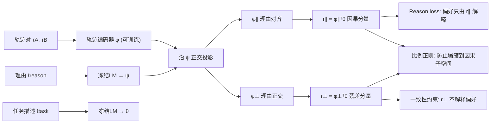

# Causally Robust Reward Learning from Reason-Augmented Preference Feedback

**会议**: ICLR 2026  
**OpenReview**: [https://openreview.net/forum?id=wviOOX5JVn](https://openreview.net/forum?id=wviOOX5JVn)  
**代码**: [https://github.com/mj-hwang/ReCouPLe](https://github.com/mj-hwang/ReCouPLe)  
**领域**: reinforcement_learning  
**关键词**: 偏好学习, 奖励建模, 因果混淆, 自然语言理由, 正交投影, 任务迁移  

## 一句话总结
ReCouPLe 用一句自然语言理由（如"因为它避免了碰撞"）当作嵌入空间里的投影轴，把轨迹表征拆成"理由对齐"和"理由正交"两部分、只让偏好由对齐分量解释，从而剥离与偏好虚假相关的干扰特征，在分布偏移和跨任务零样本迁移上显著超过纯二元偏好基线。

## 研究背景与动机
- **领域现状**：基于偏好的强化学习（PbRL）让人对两条轨迹做二选一比较来代替手工奖励，已是 RLHF / 机器人奖励塑形的主流范式（Christiano 2017、Sadigh 2017、Bıyık 2019）。
- **现有痛点**：一次二元比较只携带至多 1 bit 信息，奖励模型可以用观测空间里任何与偏好"恰好共现"的特征来解释标签。当训练集里干扰特征（如颜色）和真正的因果特征（如尺寸）完美相关时，模型会抄近路抓住颜色，测试时颜色一换就崩——经典的"因果 Goodhart"与奖励误判。
- **核心矛盾**：二元偏好"易给但欠表达"，自由语言"富表达但欠约束"；前者信息太稀疏导致因果不可辨识，后者本身模糊需要额外模态来锚定。
- **本文目标**：在不微调语言模型、不额外采集偏好的前提下，注入恰好缺失的那一点因果信号，让奖励模型抗分布偏移并能零样本迁移到语义相关的新任务。
- **核心 idea**：**【理由即因果方向】** 一句简短理由恰好点明了"用户因为哪个特征而偏好"，把该理由的语言嵌入当作投影轴，强迫偏好只能由沿这条轴的分量来解释，干扰特征被挤进正交残差里且不许参与偏好判断。

## 方法详解

### 整体框架
ReCouPLe 把单任务 PbRL 推广到多任务设定：奖励被建模为轨迹表征 $\phi(\tau)$ 与冻结任务嵌入 $\theta=\mathrm{LM}(\ell_{task})$ 的内积 $r(\tau,\ell_{task})=\phi(\tau)^\top\theta$，唯一可训练的是轨迹编码器 $\phi$。给定理由嵌入 $\psi=\mathrm{LM}(\ell_{reason})$，框架把 $\phi(\tau)$ 沿 $\psi$ 正交分解为理由对齐与理由正交两块，再用三项损失逼着"偏好只由对齐分量解释、正交分量保持中立但仍承载任务信息"。

### 关键设计

**1. 沿理由轴的正交分解：把因果信号从轨迹表征里"切"出来。** 这是整套方法的几何核心。冻结语言编码器把理由映射成向量 $\psi$，再把轨迹嵌入投影到 $\psi$ 上得到平行分量 $\phi_\parallel(\tau)=\frac{\phi(\tau)^\top\psi}{\|\psi\|_2^2}\psi$，剩下的就是正交分量 $\phi_\perp(\tau)=\phi(\tau)-\phi_\parallel(\tau)$，二者满足 $\phi_\parallel^\top\phi_\perp=0$。对应地奖励也分成 $r_\parallel=\phi_\parallel^\top\theta$（理由显式背书的因果部分）和 $r_\perp=\phi_\perp^\top\theta$（理由没顾及但任务相关的残差，如塑形奖励、领域先验）。由于"避免碰撞""更快完成"这类理由会跨任务复现，同一条 $\psi$ 方向被反复复用，这正是后面跨任务迁移的根基。

**2. Reason loss：让偏好"只许"用因果分量来解释。** 在 Bradley-Terry 模型里，只拿 $r_\parallel$ 算偏好概率并最小化 BCE：$L_{reason}=-\mathbb{E}[y\log P_{r_\parallel}(\tau_A\succ\tau_B)+(1-y)\log(1-P_{r_\parallel}(\tau_A\succ\tau_B))]$。这一项把"解释偏好的权力"完全收归到理由对齐方向，等价于显式告诉模型"用户就是因为这个特征而选 A"，从源头堵死它去抓颜色这类共现干扰。

**3. 正交一致性约束：把残差分量摁成"对偏好中立"，并给出 EC/IC 两种力度。** 光让 $r_\parallel$ 负责还不够，得防止 $r_\perp$ 偷偷夹带偏好信号。强约束版 **ReCouPLe-EC** 直接要求每个比较对的残差相等 $L_{eq}=(r_\perp(\tau_A)-r_\perp(\tau_B))^2$，适合"少量反复出现的理由主导偏好、残差变化很小"的场景。弱约束版 **ReCouPLe-IC** 只要求对齐分量的差异盖过残差差异——用 $S(A\succ B)=\frac{\exp(\mathrm{diff}_{r_\parallel})}{\exp(\mathrm{diff}_{r_\parallel})+\exp(\mathrm{diff}_{r_\perp})}$ 做软竞争并配一个总奖励的 BCE 正则防模式塌缩，适合"多种理由都能解释比较、残差变化不可忽略"的嘈杂场景。这种"一硬一软"让方法能按数据特性自适应。

**4. 奖励比例正则：堵住"全塌进因果子空间"的捷径。** 如果不加约束，模型可能把所有奖励都塞进 $r_\parallel$ 让正交约束形同虚设。比例正则 $L_{ratio}=\mathrm{ReLU}\!\left(\frac{|r_\parallel|}{|r_\parallel|+|r_\perp|+\epsilon}-\alpha\right)$ 把因果分量占总幅值的比例压在阈值 $\alpha$ 以下，保证残差分量始终承载真实的任务信息而非被挤空。最终目标是 $L_{ReCouPLe}=L_{reason}+\lambda_{ratio}L_{ratio}+\lambda_{eq}L_{eq}$（EC）或 $+\lambda_{ineq}L_{ineq}$（IC）。

## 实验关键数据

### 主实验表格

ManiSkill 因果混淆套件（RQ1，奖励准确率，3 seed 平均，OOD=颜色互换）：

| 方法 | 2-task ID Pick/Place | 2-task OOD Pick/Place | 4-task OOD Pick/Push/Place/Pull |
|---|---|---|---|
| BT（单任务） | 0.980/1.000 | 0.540/0.830 | 0.540/0.987/0.830/0.867 |
| BT-Multi | 0.953/1.000 | 0.600/0.820 | 0.707/1.000/0.840/0.907 |
| RFP（理由辅助损失） | 0.940/1.000 | 0.620/0.800 | 0.700/0.980/0.807/0.913 |
| **ReCouPLe-EC** | 0.993/1.000 | **0.820/0.940** | **0.773**/1.000/**0.880**/0.860 |
| ReCouPLe-IC | 0.967/1.000 | 0.633/0.807 | 0.600/1.000/0.807/0.867 |

Meta-World 跨任务迁移（RQ2，奖励准确率，3 seed）：

| 方法 | Push | Push-Wall | Pick-Place-Wall | 新任务 Pick-Place |
|---|---|---|---|---|
| BT-Multi | 0.873 | 0.893 | 0.577 | 0.547 |
| RFP | 0.870 | 0.900 | 0.647 | 0.553 |
| ReCouPLe-EC | 0.863 | 0.843 | 0.650 | **0.663** |
| ReCouPLe-IC | 0.893 | 0.823 | 0.657 | 0.627 |

### 消融实验表格

ManiSkill 平均奖励准确率（3 seed）：

| 变体 | 2-task ID | 2-task OOD | 4-task ID | 4-task OOD |
|---|---|---|---|---|
| ReCouPLe（完整） | 0.995 | **0.872** | 1.000 | **0.878** |
| − 一致性约束 | 0.980 | 0.726 | 0.977 | 0.745 |
| − 一致性 − 比例正则 | 0.987 | 0.727 | 0.990 | 0.730 |

### 关键发现
- **OOD 才见真章**：所有方法在 ID 上几乎饱和，但颜色互换后纯偏好基线大跌；ReCouPLe-EC 在 OOD 上奖励准确率最高可达基线的约 1.5×，下游策略成功率在新任务上约 2×。
- **EC 强约束适合"单一因果特征主导"的 ManiSkill**（残差几乎不变）；**IC 弱约束适合"理由多样、轨迹带不同最优度噪声"的 Meta-World**——EC 的严格等式会误罚合理的无关差异。
- **消融证明两根支柱缺一不可**：去掉一致性约束 OOD 从 0.872 掉到 0.726，再去掉比例正则继续恶化；ID 几乎不受影响，说明它们专治分布偏移。
- **图像输入更脆弱**：在原始视觉输入下基线 OOD 准确率惨跌，ReCouPLe 4-task 仍达 ≥0.96，验证对视觉干扰特征的鲁棒性。
- **迁移有可组合性**：作者观察到 Pick-Place-Wall − (Push-Wall − Push) ≃ Pick-Place，理由对齐子空间像可加减的语义向量，支撑零样本迁移。

## 亮点与洞察
- **用"一句话理由"补足偏好的 1-bit 信息瓶颈**，且把理由当几何投影轴而非额外条件输入，思路干净、可解释。
- **冻结 LM + 仅训练轨迹编码器**，无需微调语言模型、无需预定义特征向量（这是相对 PFP/Holk 的关键解放），共享语言编码器天然保证跨任务语义一致。
- **EC/IC 双变体**把"理由是否单一主导"这件事变成可选的约束力度，工程上很实用。

## 局限与展望
- **依赖理由的质量与可得性**：实验里 Meta-World 的理由是用真值奖励的成分优势 softmax 合成的、ManiSkill 是固定模板（"因为更大"），真实人类自由理由的噪声/模糊性未充分检验。
- **线性内积奖励形式**虽借非线性编码器表达复杂结构，但单方向投影对"多个因果特征同时起作用"的偏好可能不够（一条 $\psi$ 只表征一个方向）。
- **规模与领域**：仅在 ManiSkill/Meta-World 机器人操作上验证，是否迁移到 LLM-RLHF、长程任务、真人偏好仍待探索。
- 比例阈值 $\alpha$、各 $\lambda$ 需调，EC 在嘈杂数据上会过度惩罚——选 EC 还是 IC 需先判断数据特性。

## 相关工作与启发
- **PbRL 与因果混淆**：Tien 2023 指出奖励模型爱抓虚假特征，本文是直接的对症下药；与主动查询（信息增益 Bıyık 2019、体积移除 Sadigh 2017）这类"挑更有信息的问题"思路互补——它换的是"反馈类型"而非"查询策略"。
- **特征级偏好（PFP, Peng 2024 / Holk 2024）**：都想注入因果结构但依赖预定义特征向量；本文用自由文本嵌入取代之，去掉特征工程瓶颈并换来跨任务迁移。
- **语言辅助机器人学习**（Yang 2024 比较式语言、Cui 2023 实时纠错）：多把语言当条件输入，本文把语言当"解释偏好的因果轴"，定位更细。
- **启发**：把"解释"显式建模成表征空间里的可投影方向、并用正交分解强制因果归因，这套机制有望迁移到 LLM 偏好对齐——把人类批注的"为什么更好"变成可约束的奖励几何，而不只是更多的成对标签。

## 评分
- 新颖性: ⭐⭐⭐⭐ 把自然语言理由形式化为投影轴 + 正交分解奖励，是对 PbRL 因果混淆的一个干净且少有人走的角度。
- 实验充分度: ⭐⭐⭐⭐ ManiSkill/Meta-World 双套件覆盖 OOD 鲁棒与跨任务迁移、含状态与图像输入、消融到位；但理由为合成、未上真人偏好与更大规模。
- 写作质量: ⭐⭐⭐⭐ 动机（红蓝箱例子）、几何图示与损失推导清晰，EC/IC 适用边界讲得明白。
- 价值: ⭐⭐⭐⭐ 轻量、不微调 LM、可解释，对 RLHF/机器人奖励建模有直接借鉴意义。

<!-- RELATED:START -->

## 相关论文

- [\[ICLR 2026\] Learn to Reason Efficiently with Adaptive Length-based Reward Shaping](learn_to_reason_efficiently_with_adaptive_length-based_reward_shaping.md)
- [\[ICLR 2026\] Preference-based Policy Optimization from Sparse-reward Offline Dataset](preference-based_policy_optimization_from_sparse-reward_offline_dataset.md)
- [\[ICLR 2026\] TIPS: Turn-Level Information-Potential Reward Shaping for Search-Augmented LLMs](tips_turn-level_information-potential_reward_shaping_for_search-augmented_llms.md)
- [\[ICLR 2026\] ExGRPO: Learning to Reason from Experience](exgrpo_learning_to_reason_from_experience.md)
- [\[ICLR 2026\] Offline Preference-based Value Optimization](offline_preference-based_value_optimization.md)

<!-- RELATED:END -->
