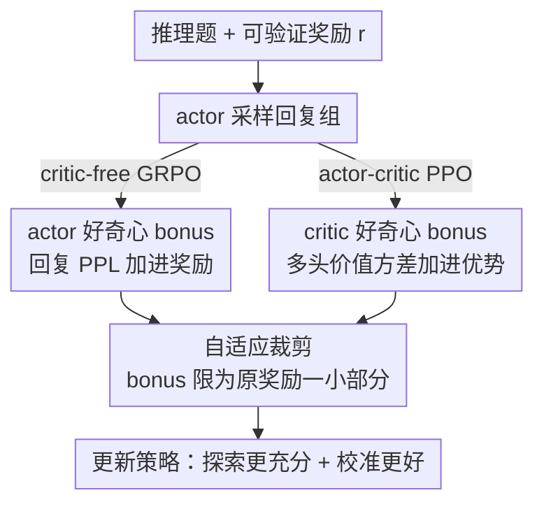

# CDE: Curiosity-Driven Exploration for Efficient Reinforcement Learning in Large Language Models

**会议**: ICLR 2026  
**OpenReview**: [https://openreview.net/forum?id=5rXN5knHKW](https://openreview.net/forum?id=5rXN5knHKW)  
**领域**: 强化学习 / LLM 推理  
**关键词**: RLVR, 好奇心驱动探索, 困惑度, 多头 critic, 校准

## 一句话总结
针对 RLVR（可验证奖励强化学习）训练 LLM 时探索不足、过早收敛、熵坍塌的问题，CDE 让模型用自身的"好奇心"来引导探索——actor 端用生成回复的困惑度（PPL）、critic 端用多头 critic 价值估计的方差作为探索奖励，无需训练额外表征模块，在 AIME 等数学推理 benchmark 上比标准 GRPO/PPO 稳定提升约 +3 点，还顺带修复了一个被称为"校准坍塌"的训练失效模式。

## 研究背景与动机

**领域现状**：RLVR 是当前提升 LLM 推理能力的主流范式——给一个规则化的验证器判定最终答案对错，用这个可验证的奖励信号直接优化策略，GRPO、DAPO、PPO 是代表性算法。

**现有痛点**：这类方法的训练过程严重偏向"利用"（exploitation）而非"探索"（exploration），频繁出现**过早收敛**和**熵坍塌**——策略很快塌缩到少数高奖励路径上，再也探不出更好的解。更糟的是，训出来的模型**校准很差**：不管答案对不对都同样自信。

**核心矛盾**：这本质上是强化学习经典的探索-利用困境。RL 文献里有一堆探索策略，但搬到 LLM 上都水土不服：ε-greedy、熵奖励这类简单启发式只是往环境里注入随机性或鼓励策略更随机，在复杂推理上效果存疑；而更有原则的 count-based（UCB、SimHash 伪计数）和 prediction-based（ICM、RND）方法**都依赖把一条推理轨迹压成定长嵌入**，但"如何有效表征一条 CoT 推理路径"本身就是未解难题——作者用 SimHash 实测发现，绝大多数回复都坍塌进极少数 hash 网格里，计数分布高度集中，伪计数失效。

**本文目标**：设计一种**不依赖显式计数、不依赖回复嵌入**、也不用训练额外辅助模块的探索机制，让它能直接嵌进 RLVR 框架。

**切入角度**：一个在海量推理语料上训过的 LLM，其实内部已经建立了"什么是熟悉/什么是新颖的推理模式"的精细模型。这就像幼儿的学习——不是靠外部对经验做计数和总结，而是被一种内在的好奇心驱动着去探索新情境。

**核心 idea**：用模型自身的"好奇心信号"当探索奖励——actor 对自己生成内容的不确定性（PPL）+ critic 对价值估计的不确定性（多头方差），两路信号都塑形进 RLVR 的奖励/优势函数里。

## 方法详解

### 整体框架
CDE 的输入是一道带标准答案的推理题，输出是经强化学习更新后、探索更充分且校准更好的策略。它的核心是给标准 RLVR 的奖励/优势加一个"好奇心 bonus"，bonus 来自两个互补的来源：**actor 好奇心**（回复级，PPL 越高=模型越意外=越值得探索）作用在 GRPO/PPO 的奖励上；**critic 好奇心**（token 级，多头 critic 价值估计的标准差越大=该区域数据覆盖越稀疏）作用在 PPO 的优势上。两路 bonus 都用同一个"自适应裁剪"公式约束，防止 bonus 喧宾夺主导致 reward hacking。理论上作者还证明了 actor bonus 会惩罚"自信的错误"、critic bonus 在线性 MDP 下等价于经典的伪计数 bonus。

### 关键设计

**1. actor 好奇心：用回复困惑度当"自我意外度"奖励**

针对的是"探索信号该从哪来"这个根本问题。作者把 actor 的好奇心定义为它对自己动作的不确定性——一个在当前策略下概率很低（很"意外"）的回复，多半落在学习分布中尚未充分探索的区域。具体用回复的负平均 log 概率（即 log-PPL）作为回复级 bonus：$B_{\text{actor}}(q,o) = -\frac{1}{T}\sum_{t=1}^{T}\log\pi(o_t|o_{<t},q)$，值越大表示越意外、探索激励越强。但直接把它加进奖励会不稳定——可能鼓励模型生成高 PPL 但低质量的回复（reward hacking）或过度探索不收敛。于是用一个**自适应裁剪**把 bonus 限制成原奖励的一小部分：$\hat{r}(q,o) = r(q,o) + \omega\min\big(\frac{|r(q,o)|}{\kappa},\,\alpha B_{\text{actor}}(q,o)\big)$。三个超参各司其职：$\omega$ 是带退火的动态权重（早期大力探索、后期转向利用）；$\kappa$ 是裁剪比，把 bonus 上限钉在 $|r|/\kappa$ 保证它只是补充信号；$\alpha$ 是缩放因子，决定 bonus 多容易触到裁剪阈值。

**2. PPL bonus 的校准效应：惩罚自信的错误、奖励新颖的正确**

这是 actor bonus 的一个关键副产品，解决了模型"校准坍塌"的问题。把回复按"对错×PPL高低"分四类，其中两类最关键：**低 PPL 的错误回复**意味着模型对错答案很自信，是过拟合，该重罚；**高 PPL 的正确回复**意味着模型对这种答案不熟但居然做对了，是有效探索，该鼓励。PPL bonus 天然实现了这一点——正确回复里越新颖（PPL 越高）拿到的正奖励越大；错误回复里越自信（PPL 越低）拿到的 bonus 越小、相对惩罚越大。论文用 Theorem 3.1 把它形式化：在 correct 回复中 PPL 高者获得更大的相对概率提升，在 incorrect 回复中 PPL 低者获得更大的相对概率下降。相比之下传统的熵奖励是 sample-agnostic 的——熵是在整个 next-token 分布上算的，跟实际采到哪个 token 无关，所以即便模型高置信度采了个错 token，熵奖励也惩罚不到它。PPL bonus 正是把"具体采样到了什么"这一信息补了进来。

**3. critic 好奇心：用多头 critic 的价值方差近似伪计数**

针对 actor PPL 只看"局部意外"、看不到"长期价值不确定性"这一局限。在 actor-critic 框架里，critic（价值函数）对 prompt-response 给出更高层的 reward-to-go 估计；由于估计是从采集到的轨迹里学的，它的后验分布天然反映数据覆盖度——数据密的地方后验集中（低方差），采样稀疏的地方不确定性高（高方差）。作者用经典的 **bootstrap** 来近似这个后验：实现成一个**多头 critic**——$K$ 个价值头共享同一个 LLM backbone，每个头在采集轨迹的一个有放回重采样子集上训练，从而得到后验的经验近似。然后用 $K$ 个头之间的标准差当好奇心信号：$B_{\text{critic}}(q,o_{i,\le t+1}) = \text{std}\big(\{\hat{V}_j(q,o_{i,\le t+1})\,|\,1\le j\le K\}\big)$，把策略推向"各头分歧大"的欠探索区域。这个 bonus 通过和设计 1 同款的裁剪公式加进 PPO 优势：$\hat{A}_{i,t} = \tilde{A}_{i,t} + \omega\min\big(\frac{|\tilde{A}_{i,t}|}{\kappa},\,\alpha B_{\text{critic}}\big)$，其中 $\tilde{A}_{i,t}$ 是把单一价值函数换成 $K$ 头均值后的 PPO 优势。理论上 Theorem 3.2 证明：在线性 MDP 假设下，多头标准差是经典伪计数 bonus $\sqrt{\phi^\top\Lambda^{-1}\phi}$（LSVI-UCB/CFPO 里用的那个）的一致估计——这给了"为什么方差能当探索信号"一个扎实的理论锚点。

### 损失函数 / 训练策略
多头 PPO 沿用标准 PPO 的三阶段（actor 采样 → 更新 actor → 更新 critic），唯一区别是把多头方差作为探索 bonus 注入优势。critic 更新时，每个头 $j$ 在一个有放回采样的子集 $D_j\subset D$ 上训练，子集大小由 $\zeta\in(0,1]$ 控制（$|D_j|=\zeta|D|$，$\zeta$ 小则头间多样性高、$\zeta$ 大则样本效率高），最小化 bootstrap 损失 $L_\phi = \frac{1}{\zeta K|D|}\sum_{j=1}^{K}\sum_{(q,o,r)\in D_j}(\hat{V}_j(q,o)-r)^2$。此外 bonus 权重 $\omega$ 的退火 schedule 很关键，作者对比了 No decay / Linear / Cosine / Staircase 四种。

## 实验关键数据

实验基于 Verl 框架，用 Qwen3-4B-Base 和 Llama-3.2-3B-Instruct 两个模型，在 DAPO-17K 上训练，在 MATH / AMC23 / AIME24 / AIME25 四个数学推理 benchmark 上评测。MATH 报 Avg@1，其余三个采 16 个样本报 Avg@16 与 Pass@16。

### 主实验

| 方法（Qwen3-4B-Base） | AMC23 Avg@16 | AIME24 Avg@16 | AIME24 Pass@16 | AIME25 Avg@16 | 总 Avg |
|--------|------|------|------|------|------|
| GRPO | 63.6 | 20.8 | 41.9 | 21.0 | 48.2 |
| GRPO + Entropy bonus | 64.3 | 21.8 | 39.4 | 21.2 | 48.5 |
| GRPO + i-MENTOR | 63.2 | 22.5 | 39.3 | 23.0 | 49.1 |
| **GRPO + PPL bonus** | **67.8** | **23.3** | **48.5** | **23.5** | **50.6** |
| PPO | 64.1 | 17.8 | 36.0 | 17.5 | 46.5 |
| **PPO + 4 Heads** | 63.9 | 21.5 | 35.5 | 21.5 | 48.5 |
| **PPO + 16 Heads** | 65.0 | 20.5 | 41.9 | 20.0 | 48.6 |

- GRPO 加 PPL bonus 全面优于 entropy bonus 和 curiosity 基线 i-MENTOR，总 Avg 从 48.2 提到 50.6（约 +2~3 点），AIME24 Pass@16 大涨约 +8 点（41.9→48.5）。
- 多头 PPO 稳定优于 vanilla PPO，$K=4/16$ 时总 Avg 提升约 +2 点，AIME 上 Pass@16 多处提升约 +10 点。
- Llama-3.2-3B-Instruct 上结论一致：GRPO+PPL 总 Avg 32.3→34.4，PPO+4 Heads 30.5→34.2。

### 消融实验

| 配置 | 现象 | 说明 |
|------|------|------|
| 头数 $K$=2 | 几乎无提升 | 头太少，方差信号不可靠 |
| 头数 $K\ge 4$ | 性能起飞后趋于平台 | 少量头即可捕获多数好奇心信号 |
| $\omega$ No decay | 总 Avg 48.2，最差 | 全程强探索不收敛 |
| $\omega$ Staircase decay | 总 Avg 50.6，最好 | 早期强探索后骤降，先扩覆盖再稳定收敛 |
| $\zeta$=0.5 vs 1.0 | 结果接近（48.6 vs 48.4，16 头） | 对子采样比例鲁棒 |

### 关键发现
- **bonus 权重衰减是必需的**：所有衰减 schedule 都优于 no-decay，且"早期强探索"最关键，Staircase（早期高探索、后期骤然撤掉 bonus）最优。
- **多头数 $K\ge 4$ 后收益饱和**：说明不需要很多头就能捕获主要好奇心信号，计算开销可控。
- **校准坍塌（calibration collapse）这一发现很原创**：标准 GRPO 训练早期正确回复 PPL 低于错误回复（更自信），但训着训着这个 gap 缩小、置信度与正确性脱钩；加了 PPL bonus 后这个分离被全程维持住——因为 bonus 压制了"自信的错误"。更好的校准还能支撑 self-certainty BoN、DeepConf 这类推理期选择策略。
- **训练动态上 CDE 先抑后扬**：早期测试精度落后于 PPO/GRPO 基线，但避免了过早利用伪高奖励路径，随着状态-动作覆盖扩大，最终精度天花板更高。

## 亮点与洞察
- **把"探索信号"从外部计数搬到模型内部**：count-based/RND 都要把推理轨迹压成定长嵌入，而嵌入表达力差导致坍塌；CDE 直接用 PPL 和多头方差这两个"模型自带"的不确定性，绕过了表征难题，零额外表征模块。
- **PPL bonus 同时解决探索与校准两件事**：一个简单的 log-PPL 项既鼓励探索新颖正确解，又惩罚自信错误，副产品是修好了校准坍塌——一举两得且有 Theorem 3.1 撑腰。
- **理论桥接很漂亮**：Theorem 3.2 证明多头方差在线性 MDP 下是经典伪计数 bonus 的一致估计，把一个工程上"多头分歧大就多探索"的直觉接到了 LSVI-UCB 的 UCB 理论上。
- **可迁移性**：自适应裁剪的 bonus 注入方式（限为原奖励/优势的一小部分 + 退火权重）是通用模板，任何想给 RLVR 加内在奖励的工作都能复用，避免 reward hacking。

## 局限与展望
- 实验只覆盖数学推理（MATH/AMC/AIME）和 3~4B 规模模型，能否推广到代码、agent、更大模型未验证。
- 提升幅度约 +2~3 点（AIME 上 Pass@16 较大），整体属稳健但非颠覆性；多头 critic 带来额外显存与运行开销（作者放在附录 C 讨论）。
- critic 好奇心只在 PPO（有 critic）下可用，GRPO 这类 critic-free 方法只能用 actor PPL bonus，两路信号无法在同一算法里叠满。
- Theorem 3.2 的等价性建立在线性 MDP 假设上，真实 LLM 远非线性，这层理论保证是近似性的。

## 相关工作与启发
- **vs 熵奖励（Entropy bonus）**：熵是 sample-agnostic 的、在整个 next-token 分布上算，采到高置信度错 token 也惩罚不到；PPL bonus 把"实际采样到什么"补进来，能精准惩罚自信的错误，可视为熵奖励的样本特定增强版。
- **vs count-based / RND / i-MENTOR**：它们依赖把推理轨迹表征成嵌入再计数/预测，CDE 实测发现 SimHash 计数会坍塌失效，转而用模型内在好奇心绕开表征难题，主实验上稳定优于 i-MENTOR。
- **vs 标准 GRPO/PPO**：在原算法上只加一个受裁剪约束的好奇心 bonus，几乎零侵入，却同时缓解了熵坍塌、过早收敛和校准坍塌。

## 评分
- 新颖性: ⭐⭐⭐⭐⭐ 把 actor PPL + critic 多头方差作为内在好奇心、并给出伪计数的理论等价，角度新且自洽
- 实验充分度: ⭐⭐⭐⭐ 两模型四 benchmark + schedule/头数/$\zeta$ 多维消融，但局限在数学推理与中小模型
- 写作质量: ⭐⭐⭐⭐⭐ 动机层层推导清晰，理论与直觉穿插，校准坍塌的发现叙述有说服力
- 价值: ⭐⭐⭐⭐ 给 RLVR 探索提供了即插即用且不易 reward hacking 的方案，校准副产品有实用意义

<!-- RELATED:START -->

## 相关论文

- [\[ICLR 2026\] Risk-Sensitive Reinforcement Learning for Alleviating Exploration Dilemmas in Large Language Models](risk-sensitive_reinforcement_learning_for_alleviating_exploration_dilemmas_in_la.md)
- [\[ICLR 2026\] Toward Efficient Exploration by Large Language Model Agents](toward_efficient_exploration_by_large_language_model_agents.md)
- [\[ICLR 2026\] On Predictability of Reinforcement Learning Dynamics for Large Language Models](on_predictability_of_reinforcement_learning_dynamics_for_large_language_models.md)
- [\[ICLR 2026\] Revolutionizing Reinforcement Learning Framework for Diffusion Large Language Models](revolutionizing_reinforcement_learning_framework_for_diffusion_large_language_mo.md)
- [\[ICLR 2026\] Using Reinforcement Learning to Train Large Language Models to Explain Human Decisions](using_reinforcement_learning_to_train_large_language_models_to_explain_human_dec.md)

<!-- RELATED:END -->
