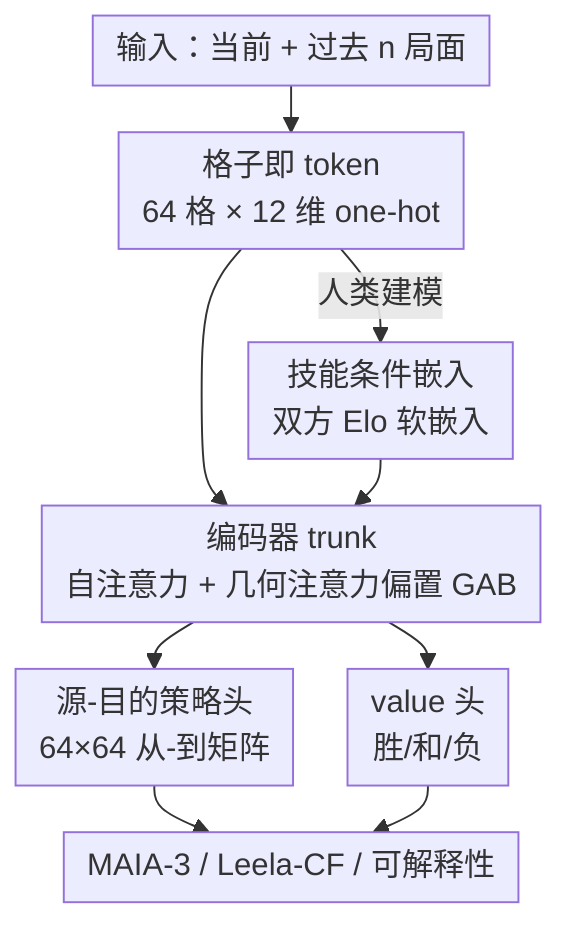

# Chessformer: A Unified Architecture for Chess Modeling

**会议**: ICLR2026  
**OpenReview**: [https://openreview.net/forum?id=2ltBRzEHyd](https://openreview.net/forum?id=2ltBRzEHyd)  
**代码**: https://github.com/CSSLab/maia3  
**领域**: 强化学习 / 博弈建模 / 表示学习  
**关键词**: 国际象棋、Transformer 架构、位置编码、人类行为建模、机械可解释性

## 一句话总结
把棋盘 64 个格子当作 token、再给自注意力加一套随局面动态生成的"几何注意力偏置"(GAB)，Chessformer 用一套统一架构同时把"引擎棋力""人类走子预测""可解释性"三个长期割裂的目标推到 SOTA——79M 参数的 MAIA-3 以不到对手四分之一的体量把人类走子匹配率提到 57.1%，而装进 Leela Chess Zero 的版本涨了 100+ Elo 并在多个顶级机器对弈赛上击败 Stockfish。

## 研究背景与动机
**领域现状**：国际象棋是 AI 的经典试验场，但围绕它的三个核心任务长期用三套完全不同的架构在做。追求棋力的，用 alpha-beta 搜索引擎（Deep Blue、Stockfish）、自对弈 policy-value 网络 + MCTS（AlphaZero、Leela Chess Zero），或把强 oracle 蒸馏进 transformer；模拟人类走子的，从 MAIA 的卷积网络栈一路演化到 MAIA-2 的技能感知注意力、再到 ALLIE 把整局走子序列当语言来自回归建模；可解释性那条线又是另一拨人在 AlphaZero / Leela 上做线性探针和电路分析。

**现有痛点**：这些架构不仅彼此不通，而且大多和象棋这个领域本身的几何结构对不上。最典型的是 Ruoss et al. (2024)：它也把 64 个格子 token 化了，却套了一维的旋转位置编码（RoPE），强行给二维棋盘加上线性顺序——结果是两个对角的角点之间注意力衰减被压到最大，可这两个角恰好同处一条主对角线，对象、后这类长程子和很多战术至关重要。位置在象棋里是头等大事，编码却和棋盘几何打架。

**核心矛盾**：象棋的"位置关系"不是简单的欧氏距离，而是随局面剧烈变化的。某个兵种的移动关系只有在该子还在盘上时才有意义；封闭局面（兵链固定）里远距离格子之间的联系本就更弱。语言/视觉里那套**静态**位置编码（绝对偏置、相对偏置、RoPE）天生表达不了这种"随状态变形"的几何，于是棋力、人类性、可解释性就被迫各用各的招。

**本文目标**：能不能用**单一架构**同时支撑棋力、人类建模、可解释性这三件事？

**切入角度**：作者押注在"让架构对齐领域结构"上——只要 token 化、位置编码、输出头三处都按象棋真实的几何来设计，三个目标就能一起涨，而不是互相拖累。

**核心 idea**：用"格子即 token"的棋盘表示 + 一套随局面动态生成的几何注意力偏置（GAB）+ 一个"源-目的"结构的注意力策略头，把领域几何直接焊进编码器型 transformer，让一个模型家族同时变强、变得像人、变得可解释。

## 方法详解

### 整体框架
Chessformer 是一个 **encoder-only transformer**：输入是一段棋盘状态序列（当前局面 + 过去 $n$ 个局面，默认 $n=7$），每个局面把 64 个格子各编成一个 12 维 one-hot 向量（指示该格上是哪一种棋子，盘面翻转到走子方视角），于是一个局面就是 64 个 token，沿深度维拼接历史后送进 trunk。trunk 的每一层自注意力都被加上 **GAB（几何注意力偏置）**——一组从压缩后的盘面状态动态生成、加到 dot-product logits 上的位置偏置。trunk 输出的 64 个 token 接两个头：一个 **value 头**（mean-pool 后预测胜/和/负），一个**源-目的策略头**（用注意力算出一个 $64\times64$ 的"从某格走到某格"矩阵）。

同一套 trunk 被用到三个目标上：① 人类走子预测（**MAIA-3**，额外把双方棋力做成 soft embedding 拼到 token 上）；② 引擎棋力（**Leela-CF**，把 Leela Chess Zero 的自对弈 oracle 监督蒸馏进来）；③ 可解释性（在激活上训 transcoder，借"格子即 token"做格点级归因）。

### 关键设计

**1. 格子即 token：让棋盘表示对齐二维几何**

针对"现有 token 化和棋盘几何打架"这个痛点，Chessformer 直接采用棋盘最自然的视觉表示——把 64 个格子当 64 个 token，token 之间因此具有由领域决定的、固定的二维位置关系，能被位置编码有效捕捉。每个格子表示为 12 维向量（6 种棋子 × 2 方），盘面翻转到走子方视角；要带历史就把当前和过去 $n$ 个局面沿深度拼接（不足则重复最早一帧），默认 $n=7$。这么做还有个额外好处：每个 token 只需"专精"它对应的那一格，而不必像线性化表示那样让单个 token 去承载整盘信息，大幅降低了对参数量的压力。和最接近的 Ruoss et al. (2024) 相比，后者把 64 格线性化后套一维 RoPE，等于人为强加了一条并不存在于象棋里的一维顺序；Chessformer 保留二维结构，把"该用什么位置关系"的活儿留给下面的 GAB 去动态决定。

**2. 几何注意力偏置 GAB：随局面动态生成的位置编码**

这是全文的核心。自注意力本身是置换不变的，位置信息必须靠位置编码注入；而象棋的位置关系会随盘面剧烈变化，静态编码（绝对/相对偏置、RoPE）表达不了。GAB 的做法是从**压缩后的盘面状态**动态生成每个注意力头的偏置：先把 token 做一次 $d_1$ 维线性投影并展平，再过一层 $d_2$ 维线性投影 + GELU + LayerNorm 得到盘面的压缩表示；然后用一层 $h\cdot d_3$ 维投影（$h$ 为头数）+ 激活 + 归一化、reshape 成 $h\times d_3$；最后过一层**全模型共享**的线性投影（共享是为了省参数、加速学习）得到 $h\times 4096$，reshape 成 $h\times 64\times 64$，在 softmax 前**加到 dot-product logits 上**。这最后一步可理解为把 $d_3$ 个"注意力偏置模板"按当前盘面动态混合。

GAB 的三个好处恰好解释了它为什么有效：其一，它**全局地**建模位置信息，而非靠单个 token 携带——这和论文后面的发现一致：模型主要让 GAB 去适配"开局/中局/残局"这类全局特征，而不是单子位置。其二，把最终注意力 logits 写成"dot-product 给的语义分量 + GAB 给的位置分量"之和，让自注意力层能把语义和几何两类工作**各归其位**；动态生成还允许注意力头随盘面被"改作他用"。其三，加性结构让训练/推理仍能复用 FlashAttention 这类省显存的注意力 kernel。消融显示，正是 GAB 把这套架构从"专才"变成了"通才"。

**3. 源-目的注意力策略头：让输出结构对齐动作空间**

象棋的走子天然是"从某格到某格"的二元结构，但此前各家都没顺着它来：ALLIE 把 1968 种 UCI 走子当 token 自回归预测，MAIA-2 直接上 MLP。Chessformer 提出一个基于自注意力的策略头：拿 trunk 输出的 64 个 token，线性投影出一组对应"起始格"的 query 向量和一组对应"目标格"的 key 向量（深度都等于 trunk 深度），再做缩放点积，得到一个 $64\times64$ 矩阵——它正好枚举了"从任一格走到任一格"的所有走法（兵升变另外特殊处理）。这种 from-to 形式不仅和动作空间结构严丝合缝、在不损失性能的前提下省去了 1968 类大输出层，更关键的是大幅提升了可解释性：每条走子 logit 都能被归因到具体的起点格和终点格，为后续机械可解释性研究铺了路。

**4. 技能条件软嵌入：同一架构上做人类建模**

要让同一套 trunk 去模拟人类走子（MAIA-3），还需把"棋力"喂进去。作者给每个局面前置两个 128 维 soft embedding，分别对应双方玩家的 Elo。具体地，一个评分 $k$ 的嵌入由两个可学习嵌入线性插值得到：弱者嵌入 $e_{weak}$（对应 0 分）和引擎级强者嵌入 $e_{strong}$（对应 5000 分），$e_k = \gamma e_{weak} + (1-\gamma) e_{strong}$，其中 $\gamma = \frac{5000-k}{5000}$。这两个嵌入拼到 64 个 token 上，输入深度因此是 $12\times(1+n) + 2\times128$，$n=7$ 时为 352。用嵌入而非标量喂评分，表达能力相同，但留出了刻画"个人棋风"等更细行为风格的余地——这也是为什么人类建模、引擎蒸馏能共用同一架构、只在输入与监督信号上分叉。

### 损失函数 / 训练策略
两个头共同训练：value 头预测三类对局结果（胜/和/负），policy 头预测走子（人类对局里是实际走子，引擎蒸馏里是 MCTS playout 对应的走子分布）。人类建模用 Lichess 2023.01–2025.07 的 blitz 对局，按棋力重采样让各水平均衡；引擎棋力则跳过最贵的自对弈生成步骤，直接固定一份 Leela 2024.04 RL 跑出的自对弈对局做**监督蒸馏**（把搜索增强的强 oracle 蒸进无搜索模型）。作者发现 oracle 的强度远比产生它的底层模型架构重要——用 CNN 还是 Chessformer 产的自对弈对局训出来的棋力几乎一样。

## 实验关键数据

### 主实验
人类走子预测（ALLIE 测试集，884,049 个局面，移动匹配准确率）：MAIA-3 用远小的参数量刷新 SOTA。

| 模型 | 准确率(%) | 参数量 | 历史 | 搜索 |
|------|-----------|--------|------|------|
| **MAIA-3-79M** | **57.1** | 79M | ✓ | ✗ |
| MAIA-3-23M | 56.6 | 23M | ✓ | ✗ |
| MAIA-3-5M | 55.4 | 5M | ✓ | ✗ |
| ALLIE-Adaptive-Search | 55.9 | 355M | ✓ | ✓ |
| ALLIE-Policy | 55.7 | 355M | ✓ | ✗ |
| MAIA-2 | 52.0 | 23M | ✗ | ✗ |
| GPT-3.5 | 53.7 | 175B | ✓ | ✗ |

79M 模型 57.1% 超过 355M 的搜索版 ALLIE（55.9%）；5M 模型 55.4% 已逼近此前 SOTA，但参数少 70 倍。

引擎棋力（无搜索 setting，相对 Elo + 1 万道残局谜题）：

| 智能体 | Elo | 谜题(%) | FLOPs |
|--------|-----|---------|-------|
| Leela-CF-policy（本文） | 2374 ± 37 | 93.5 | 7.6B |
| **Leela-CF-value（本文）** | **2466 ± 36** | **97.2** | 152B |
| AC-9M | 2044 | 86.2 | 14.2B |
| AC-136M | 2257 | 92.7 | 215B |
| AC-270M | 2299 | 94.2 | 427B |
| Leela-CNN-value | 2168 | 92.5 | 249B |

Leela-CF-policy 以最低算力打赢所有非 Chessformer 基线；Leela-CF-value 全面最强。装进完整 Leela 引擎后，2000 局对弈里 Chessformer 配置稳定带来 **100+ Elo** 提升（对比：Stockfish 16→17 历经 14 个月开发也才约 46 Elo），并在 TCEC Cup 11、TCEC Swiss 6/7 等多个顶级赛事上**击败 Stockfish 夺冠**。

### 消融实验

| 配置 | 相对 absolute 的变化 | 说明 |
|------|---------------------|------|
| GAB（完整） | 基准最强 | 动态几何偏置 |
| relative bias | 介于两者之间 | 单调劣于 GAB |
| absolute bias | 最弱 | 静态绝对偏置 |

在可比规模下，位置编码从 absolute → relative → GAB 性能单调上升。GAB 相对 absolute：policy 准确率 +1.9%、对局结果预测 +0.3%、谜题准确率 +3.2%、锦标赛 Elo +83 分；且只用约 **60%** 的参数与算力就能打平 absolute 版本。注意力结构分析（Table 3）显示 GAB 与 dot-product attention 确实分工互补：

| 平均相关性 | GAB | dot-product |
|------------|-----|-------------|
| 跨局面（between） | 0.770 | 0.230 |
| 局面内跨查询格（within） | 0.005 | 0.816 |

### 关键发现
- **GAB 是"通才能力"的关键驱动**：去掉它换静态编码，棋力、谜题、policy/value 全线下滑；MAIA-3-3M 用 GAB 就能在参数少 30%、FLOPs 少 40% 时打平带 absolute/relative 偏置的更大模型。
- **GAB 管几何、dot-product 管语义**：GAB 跨局面稳定（0.770）但同一局面内不同查询格差异极大（0.005），说明它编码的是和"哪个格子"强绑定的几何结构；dot-product 反之，跨局面多变（0.230）、局面内一致（0.816），编码的是全局语义。但 GAB 并非死板——同一个头会从开局建模"广泛子力移动"过渡到残局聚焦"王的走动"。
- **历史长度 $n$**：从 $n=0$ 到 $n=7$ 性能显著提升，$n=7$ 到 $n=31$ 几乎无增益，故取 7。
- **谜题准确率接近饱和**（Leela-CF-value 已 97.2%），作者提示需要更难的新评测。

## 亮点与洞察
- **"架构对齐领域几何"这条主线被三个目标同时验证**：token 化、位置编码、输出头三处都顺着象棋的真实结构来，棋力/人类性/可解释性一起涨而非互相牺牲——这是对"人类兼容与任务性能必然对立"这一默认假设的有力反例。
- **GAB 把位置编码从"静态查表"升级成"按状态动态混合模板"**：$h\times64\times64$ 的偏置由压缩盘面生成、加到 logits 上，既能随局面变形、又保持加性结构以复用 FlashAttention，思路可迁移到任何"位置关系随状态变化"的结构化决策域（如围棋、电路布局、分子构象）。
- **源-目的策略头是"性能不降、可解释性大涨"的免费午餐**：用 $64\times64$ from-to 矩阵替代 1968 类大输出，每条走子 logit 天然可归因到起终点格，配合"格子即 token"做出了格点级的 transcoder 特征归因（能定位到叉、牵制等战术所涉的具体格子）。
- **蒸馏实验给出一个反直觉结论**：自对弈 oracle 的强度远比产生它的网络架构重要，意味着可以低成本地把昂贵 RL 跑出的强 oracle 蒸进任意新架构。

## 局限与展望
- 作者承认 **GAB 目前专为象棋设计**，其收益可能依赖"几何关系居于核心"的领域；推广到别的结构化决策问题需要先识别出对应的领域对称性、token 化与动作表示。
- 可解释性结果仍是**初步**的——只展示了 GAB 与 dot-product 的分工和部分可解释特征，对它们如何共同支撑规划、评估、类人走子还缺深入的机械分析。
- 引擎棋力走的是**监督蒸馏**而非端到端 RL，强度上限被固定的 oracle 数据集（Leela 2024.04 一次 run）约束；谜题指标已近饱和，现有评测难以继续区分顶尖模型。
- 人类建模评测主要在 Lichess blitz，是否迁移到慢棋、其他平台或个体棋风（论文只说软嵌入"留出了"刻画个人风格的空间，未充分验证）仍待考察。

## 相关工作与启发
- **vs ALLIE（Zhang et al. 2025）**：ALLIE 把整局走子序列当语言、用 decoder-only transformer 自回归建模，靠 355M 参数 + 搜索拿到 55.9%；本文用"格子即 token"的 encoder + GAB，79M 无搜索就到 57.1%，证明对齐棋盘几何比把象棋硬塞进语言范式更高效。
- **vs Ruoss et al. (2024)**：两者都 token 化 64 格，但对方在线性化棋盘上套一维 RoPE，把二维几何压成一维顺序、最大衰减恰好打在关键对角线上；本文保留二维结构、用 GAB 动态生成偏置，消融里这正是 +83 Elo 的来源。
- **vs MAIA / MAIA-2**：MAIA 用一组卷积网络分段建模不同棋力、MAIA-2 用技能感知注意力但完全不用历史；本文统一成单模型、引入软棋力嵌入和可变历史长度，并把可解释性从"事后线性探针"变成架构自带的格点级归因。
- **vs AlphaZero / Leela Chess Zero**：本文不重跑昂贵自对弈，而是把 Leela 的搜索增强 oracle 监督蒸馏进 Chessformer，再装回 Leela 引擎反向涨 100+ Elo，给出了"用更好架构吃掉同一份 oracle 信号"的范式。

## 评分
- 新颖性: ⭐⭐⭐⭐⭐ GAB 这种"按盘面动态混合位置模板"的编码 + 一套架构同时刷三个目标，思路确实新。
- 实验充分度: ⭐⭐⭐⭐⭐ 人类预测、引擎棋力（含真实 TCEC 夺冠）、可解释性、位置编码消融全覆盖，且有参数/算力 Pareto 对照。
- 写作质量: ⭐⭐⭐⭐⭐ 主线"对齐领域几何"贯穿始终，三块实验都回扣同一论点，叙述清晰。
- 价值: ⭐⭐⭐⭐⭐ 不仅刷新象棋 SOTA，更给"结构化决策域如何设计领域对齐架构"提供了可复用配方。

<!-- RELATED:START -->

## 相关论文

- [\[ICLR 2026\] RM-R1: Reward Modeling as Reasoning](rm-r1_reward_modeling_as_reasoning.md)
- [\[ICLR 2026\] RESCHED: Rethinking Flexible Job Shop Scheduling from a Transformer-based Architecture with Simplified States](resched_rethinking_flexible_job_shop_scheduling_from_a_transformer-based_archite.md)
- [\[ICLR 2026\] The Markovian Thinker: Architecture-Agnostic Linear Scaling of Reasoning](the_markovian_thinker_architecture-agnostic_linear_scaling_of_reasoning.md)
- [\[ICLR 2026\] MergeMix: A Unified Augmentation Paradigm for Visual and Multi-Modal Understanding](mergemix_a_unified_augmentation_paradigm_for_visual_and_multi-modal_understandin.md)
- [\[ICML 2026\] How Reasoning Evolves from Post-Training Data: An Empirical Study Using Chess](../../ICML2026/reinforcement_learning/how_reasoning_evolves_from_post-training_data_an_empirical_study_using_chess.md)

<!-- RELATED:END -->
