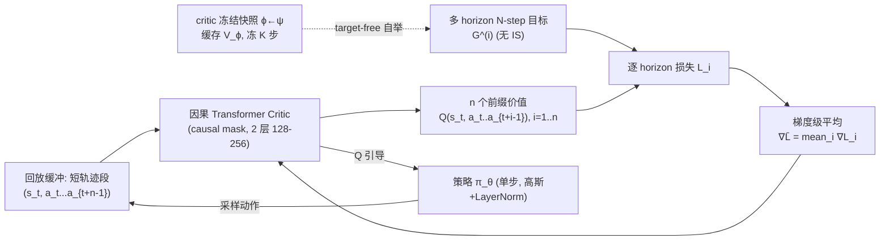

# Chunking the Critic: A Transformer-based Soft Actor-Critic with N-Step Returns

**会议**: ICLR 2026  
**OpenReview**: [https://openreview.net/forum?id=rb5eTktqbc](https://openreview.net/forum?id=rb5eTktqbc)  
**代码**: 有（GitHub + Weights & Biases 日志，论文中提及）  
**领域**: reinforcement learning  
**关键词**: Soft Actor-Critic, Transformer Critic, N-step Returns, 序列建模, 长程信用分配, Target-free 训练  

## 一句话总结
把 SAC 的 MLP critic 换成一个轻量级因果 Transformer，让 critic 直接对「状态 + 一小段动作序列」的所有前缀打分，并用多 horizon 的 N-step 回报做监督——既不需要重要性采样、又把策略保持为严格的单步，从而在长程稀疏奖励任务上大幅超越标准 SAC 与一众离线/episodic 基线。

## 研究背景与动机
- **领域现状**：Soft Actor-Critic（SAC）凭借样本效率和稳定性成为连续控制的主力，但它的 critic 是逐对评估 $(s,a)$ 的 MLP，缺乏对时间结构的建模能力。
- **现有痛点**：(1) 在离线（off-policy）设定下用 N-step 回报加速信用分配时，标准做法需要逐步重要性采样（IS）来纠正行为策略 $\mu$ 与目标策略 $\pi$ 的分布失配，而 IS 带来高方差、容易让训练发散，限制了有效 horizon；(2) 另一条路线是「动作分块（action chunking）」让策略输出开环动作序列，但固定 chunk 长度会降低控制频率与反应性，把性能绑死在一个 horizon 超参上，online off-policy 下收益不稳。
- **核心矛盾**：想要长程信用分配带来的好处（多步回报、序列结构），却不想付出 IS 的高方差代价，也不想牺牲单步策略的反应性。
- **本文目标**：在保持「策略严格单步、更新规则无需 IS」的前提下，把时间结构的建模搬进 critic 内部，专攻长程、稀疏奖励控制。
- **核心 idea**：**「强化 critic 而非策略」**——让 critic 成为一个对短轨迹段做因果注意力的 Transformer，对所有动作前缀 $(s_t, a_t, \dots, a_{t+i-1})$ 同时预测价值，并用「已实现前缀」的 N-step 目标监督；由于奖励严格跟随回放里记录的前缀，预测的就是回放分布下前缀的价值，从根上消除了对 IS 的需求。

## 方法详解

### 整体框架
T-SAC（Transformer-based SAC）保留 SAC 的整体骨架（随机策略、自动温度调节、单步策略更新），只把 critic 从 MLP 换成因果 Transformer。critic 输入一个状态 $s_t$ 加上后续 $n$ 个动作 $a_t, \dots, a_{t+n-1}$，输出 $n$ 个**前缀条件**的价值 $\{Q_\psi(s_t, a_t, \dots, a_{t+i-1})\}_{i=1}^n$；因果掩码保证位置 $i$ 只能看到 $\le i$ 的时间步，避免未来信息泄露。训练时用变长 horizon 的非软（non-soft）N-step 目标做多 horizon 监督，并在反向传播时对各 horizon 的梯度做平均；再用一个轻量的 critic 参数冻结策略替代 target network。

### 关键设计

**1. 前缀条件的 critic + 无 IS 的 N-step 监督：从源头消除重要性采样。** 标准离线 N-step TD 假设 $a_t$ 之后的动作来自当前策略 $\pi_\theta$，但回放数据来自行为策略 $\mu$，必须用逐步重要性比 $\rho_{t+k}=\pi_\theta/\mu$ 纠正，代价是高方差。T-SAC 换掉被预测的对象：critic 直接对回放中**已实现**的前缀做预测，第 $i$ 步目标为 $G^{(i)}(s_t, a_{t:t+i-1}) = \sum_{j=0}^{i-1}\gamma^j r_{t+j} + \gamma^i V_\phi(s_{t+i})$，其中 $V_\phi(s):=\mathbb{E}_{a\sim\pi_\theta}[Q_\phi(s,a)]$。因为奖励严格跟随记录的前缀 $a_{t:t+i-1}$，无需假设这些动作来自 $\pi_\theta$，于是**整条多步监督都不需要 IS**——只有终点的自举项 $V_\phi(s_{t+i})$ 才依赖当前策略。从理论上看，给定 $s_t$ 与已实现前缀后，未来奖励分布完全由环境动力学决定，与前缀「是怎么生成的」无关，这就是「多步监督、单步策略更新」能成立的根基。

**2. 梯度级平均而非目标级平均：在稀疏奖励下保住长程信号。** 经典的方差缩减做法是直接平均 N-step 目标 $\bar G^{(n)}=\frac1n\sum_{i=1}^n G^{(i)}$，但作者发现这种「目标级平均」会稀释稀疏的长程奖励（附录 F），在稀疏任务上表现很差。T-SAC 改为对每个 horizon 单独构造损失 $L_i(\psi)=\frac12(Q_\psi^{(i)}-G^{(i)})^2$，再平均它们的**梯度**：$\nabla_\psi\bar L=\frac1n\sum_{i=1}^n\nabla_\psi L_i$。由于相邻 horizon 对应同一网络中相邻解码位置、目标互相重叠，它们的逐参数梯度是「正相关但不完全相关」的——平均梯度既降低了更新方差，又不会像平均目标那样抹平稀疏信号。训练时对一个 mini-batch 随机采起点 $t$、并从 $\{\text{min\_length},\dots,\text{max\_length}\}$ 均匀采 $n$（默认 $n\sim\text{Unif}\{1,\dots,16\}$），对所有 horizon 求 MSE。

**3. 非软 critic + 策略侧熵正则：把熵从 critic 目标里剥离。** 与正统 SAC 不同，T-SAC 的 critic 估计的是**标准（非软）动作价值**，目标里完全不含熵项；最大熵正则全部交给策略侧处理（策略目标 $J_\pi=\mathbb{E}[\alpha\log\pi_\theta(a|s)-Q_\psi(s,a)]$，温度 $\alpha$ 自动调到目标熵）。这种「non-soft critic + policy-side regularization」的解耦与 MPO、AWAC、IQL 等方法一脉相承，让 critic 专注于无偏的价值回归。策略网络隐层还加了 Layer Normalization（沿用 Plappert 等的连续控制实践），在注入探索噪声时更稳。

**4. critic 参数冻结：用「硬拷贝快照」实现 target-free 训练。** CrossQ 靠 Batch Renorm + 有界激活去掉 target network；T-SAC 走另一条更简单的路：在每个 critic 段开始时把在线 critic 快照下来（$\phi\leftarrow\psi$），一次性预计算并缓存该段所有窗口的自举目标 $V_\phi(s)$，然后冻住这个快照、用缓存目标优化在线 critic 连续 $K$ 步（MuJoCo 上 $K=20$）。这等于用「段级目标缓存」替代 Polyak 平均，抑制了 target drift 又不需要 BRN 或受限激活。整个方案只引入一个超参——冻结间隔 $K$；在 Walker2d 上扫 $K\in\{20,100,1000,10000\}$ 表现基本稳定（仅最大 $K$ 轻微退化），说明 $K$ 不是个脆弱超参。

## 实验关键数据

### 主实验
评测覆盖 57 个任务：Meta-World ML1（50）、Gymnasium MuJoCo 运动控制（5）、Box-Pushing（dense/sparse，2），默认 8 个种子、95% bootstrap 置信区间，UTD 最大为 1。critic 仅 2 层 Transformer、128–256 隐藏单元。

| 基准 | 指标 | T-SAC | 对比 |
|------|------|-------|------|
| Meta-World ML1（50 任务） | 聚合成功率 IQM | 约 5M 步解决多数任务、IQM 最优 | TOP-ERL 需约 20M 步才达类似聚合 |
| Box-Pushing（dense，±5cm/±0.5rad） | 成功率 | **96.8%** | 此前基线 ≤85% |
| Box-Pushing（sparse） | 成功率 | 60%（硬拷贝 critic） | TOP-ERL 70% |
| 多阶段难任务（Assembly/Disassemble/Hammer/Stick-Pull） | 成功率 IQM | 显著领先 | SAC/CrossQ/PPO/GTrXL 等明显落后 |
| Gymnasium MuJoCo（Ant/Hopper/Walker2d） | 回报 IQM | 与 SAC 持平或更好 | — |
| HumanoidStandup / HalfCheetah | 回报 IQM | 增益最大 | — |

定位：T-SAC 保留单步策略更新，却在长程任务上超过 Transformer 类（GTrXL 策略、TOP-ERL），同时在运动控制上追平标准 SAC——部分弥合了「step-based 擅长运动 vs. episodic 擅长长程」的鸿沟。

### 消融实验
在 Box-Pushing（dense）与 MuJoCo Walker2d 上做定向消融：

| 消融项 | 设置 | 结论 |
|--------|------|------|
| Transformer 组件 | 去掉 ResNet / 因果掩码 / 自注意力 | 单独去**自注意力**会让段条件目标失效、训练发散；同时去掉自注意力+ResNet+掩码即退化为 MLP，明显变差 |
| 多 horizon 窗口 | 扫 (min_length, max_length)，如 min1max16 vs. minNmaxN 固定 horizon | 默认 $n\sim\text{Unif}\{1,16\}$ 优于固定单一 horizon |
| target-free 方案 | T-SAC 硬拷贝 vs. 软拷贝 vs. CrossQ/SAC/TD3 | 硬拷贝冻结调度在运动+稀疏任务上匹配或超过 Polyak |
| 平均方式 | 目标级平均 vs. 梯度级平均（附录 F） | 目标级平均在稀疏奖励下显著退化，验证梯度级平均的必要性 |

### 关键发现
- 把**序列建模放到 critic 侧**（而非策略侧的动作分块）能在保持单步反应性的同时获得长程信用分配的好处。
- 「预测已实现前缀的价值」让 N-step 监督**天然无需 IS**，是稳定长程学习的关键。
- target network 可以用极简的「段级目标缓存 + 短冻结」替代，超参 $K$ 鲁棒。

## 亮点与洞察
- **视角转换**：长程问题的解法不一定要改策略（动作分块）或加 IS，把时间结构「内化」进 critic 的条件与目标里，是一条更轻、更稳的路。
- **无 IS 的多步 TD**：通过「预测回放分布下已实现前缀的价值」绕开重要性采样，理论清晰（未来奖励分布只依赖动力学，与前缀生成方式无关）。
- **梯度级平均 vs. 目标级平均**：这是个很细但很实用的洞察——对稀疏奖励，平均梯度能在降方差的同时保住长程信号，而平均目标会把它抹平。
- **极简即强**：2 层 Transformer、UTD≤1、单一冻结超参，就在多 benchmark 上 SOTA，工程友好。

## 局限与展望
- 稀疏 Box-Pushing 上仍落后 TOP-ERL（60% vs. 70%），说明对极稀疏长程任务，纯 critic 侧序列建模还不足以完全取代 episodic 方法。
- 窗口为定长，变长 episode 需要额外的动作掩码避免跨 episode 自举（虽被定位为实现细节）。
- horizon 上限默认 16、冻结 $K$ 等仍需按任务设定；虽然作者论证 $K$ 鲁棒，但 horizon 分布的最优选择仍与任务相关。
- 只换了 critic；与更具表达力的策略（能量基/扩散策略）或 Decision Transformer 类序列策略的结合留作未来工作。

## 相关工作与启发
- **TOP-ERL**：同样用 Transformer critic + 截断 N-step 目标，但工作在 episodic、开环轨迹策略下（ProDMP + TRPL，约 20M 交互）；T-SAC 把这套思路搬到标准 step-based、闭环 SAC，时间抽象只活在 critic 的条件与目标里。
- **CrossQ**：证明用 BRN + 有界激活可去掉 target network；T-SAC 用「critic 参数冻结 + 段级目标缓存」给出另一条 target-free 路线。
- **Q-chunking / action chunking**：直接在分块动作空间里学 $Q(s_t, a_{t:t+H-1})$，但 critic 多为 MLP 且策略输出开环序列；T-SAC 把分块「放进 critic」并保持策略单步。
- **Decision Transformer 等离线序列策略**：与本文互补——它们做策略侧序列建模，T-SAC 只用 Transformer 做 critic，二者原则上可组合。
- **启发**：当一个任务需要「长程依赖 + 高反应性」二者兼得时，与其在策略侧做权衡，不如考虑把序列/记忆结构内化进价值函数。

## 评分
- **新颖性**: ⭐⭐⭐⭐ — 「序列建模放 critic 侧 + 预测已实现前缀以绕开 IS + 梯度级平均」组合清晰且立意巧妙，虽与 TOP-ERL 同源但 step-based 化与 target-free 化都是实质改动。
- **实验充分度**: ⭐⭐⭐⭐ — 57 任务跨三类 benchmark、8 种子、消融到组件级，论证扎实；稀疏任务仍略逊 TOP-ERL 留有遗憾。
- **写作质量**: ⭐⭐⭐⭐ — 动机、理论与设计层层递进，公式与定位清晰，附录支撑充分。
- **价值**: ⭐⭐⭐⭐ — 给 off-policy 长程控制提供了一条轻量、可复现、无需 IS 的强 baseline，工程落地友好。

<!-- RELATED:START -->

## 相关论文

- [\[ICLR 2026\] DR-SAC: Distributionally Robust Soft Actor-Critic for Reinforcement Learning under Uncertainty](dr-sac_distributionally_robust_soft_actor-critic_for_reinforcement_learning_unde.md)
- [\[ICLR 2026\] Flow Actor-Critic for Offline Reinforcement Learning (FAC)](flow_actor-critic_for_offline_reinforcement_learning.md)
- [\[ICLR 2026\] Neural+Symbolic Approaches for Interpretable Actor-Critic Reinforcement Learning](neuralsymbolic_approaches_for_interpretable_actor-critic_reinforcement_learning.md)
- [\[ICLR 2026\] Finite-Time Analysis of Actor-Critic Methods with Deep Neural Network Approximation](finite-time_analysis_of_actor-critic_methods_with_deep_neural_network_approximat.md)
- [\[AAAI 2026\] Risk-Sensitive Exponential Actor Critic](../../AAAI2026/reinforcement_learning/risk-sensitive_exponential_actor_critic.md)

<!-- RELATED:END -->
