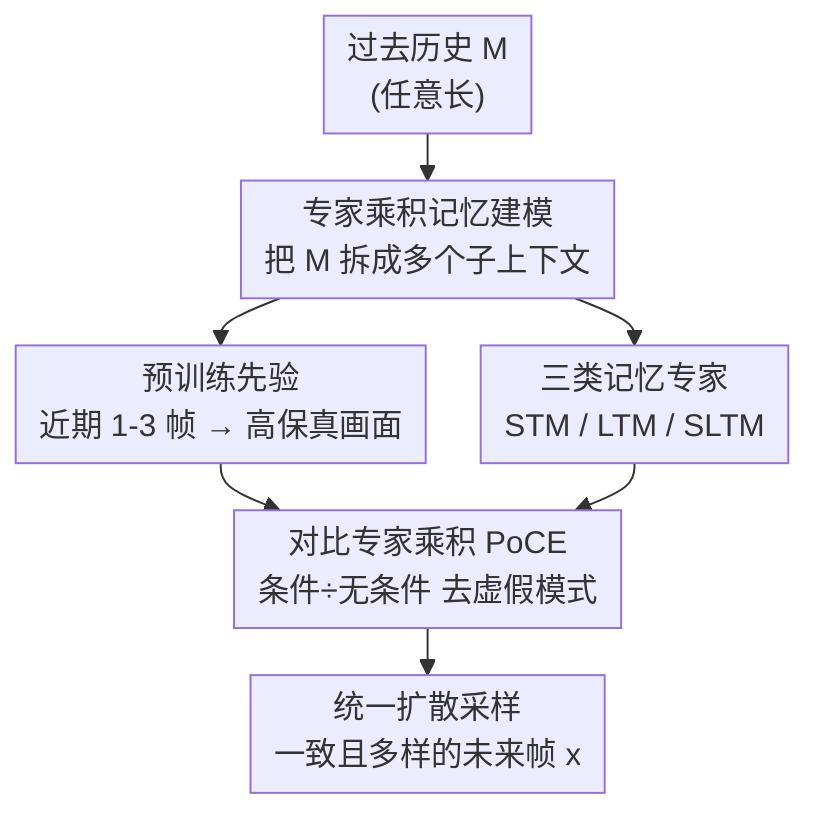

# Composition of Memory Experts for Diffusion World Models

**会议**: ICLR2026  
**OpenReview**: [https://openreview.net/forum?id=sUEdpZCHdp](https://openreview.net/forum?id=sUEdpZCHdp)  
**代码**: 待确认  
**领域**: 强化学习 / 世界模型  
**关键词**: 世界模型, 扩散模型, 记忆机制, 专家乘积, 测试时微调

## 一句话总结
针对世界模型"长上下文越准但算力越爆"的结构性矛盾，本文不再让单一骨干网络扛下所有记忆负担，而是把短期、长期、空间长期三类记忆做成各自独立的扩散专家，再用一种"对比专家乘积"（PoCE）在采样时把它们融合起来，从而在 500+ 帧上保持时序与空间一致性，且训练/推理成本远低于暴力堆 attention。

## 研究背景与动机
**领域现状**：世界模型（World Model）通过学习环境观测的分布，隐式地把环境的规则与动力学编码下来，让智能体能"想象"未来、在行动前评估候选轨迹——这正是强化学习里规划与决策的核心能力。近年扩散式世界模型在生成高质量未来帧上进步显著，尤其适合导航、交互这类需要预测未来再行动的任务。

**现有痛点**：想象出来的 rollout 只有在"和过去观测保持一致"时才有用——一个之前去过的房间，再访问时不该凭空换掉里面的陈设。而维持这种跨时间一致性恰恰最难。问题出在架构层面的结构性权衡：Transformer 能产出高保真 rollout，但二次方注意力让上下文长度被死死卡住、训练还容易不稳；RNN 与状态空间模型（SSM）在上下文长度上扩展得优雅，却把历史压进固定大小的隐状态里，时间一长细节必然丢失。

**核心矛盾**：每一类架构都只在某个 regime 里赢、在另一个 regime 里输——没有"银弹"。简单地"把上下文调长"不可持续：训练变得既不稳定又昂贵，推理成本很快冲破实际预算。本质矛盾是**把所有时间尺度的记忆需求都压在单一架构上**。

**本文目标**：把"未来—过去一致性"从任何单一架构里解耦出来，转而让一组各有所长的专家分工承担不同记忆角色，并在不重训的前提下把它们融合。

**切入角度**：作者借鉴人类认知——快速但容量受限的短期记忆（STM）与慢速但持久的长期记忆（LTM）在机制和用途上本就不同，正是这种分工让它们协同高效。同时扩散模型有个天然优势：它允许在推理时按"专家乘积"（Product of Experts, PoE）原则把异构专家组合起来，无需重训。

**核心 idea**：用"专家组合 + 对比专家乘积"代替"单骨干堆上下文"来解决世界模型的记忆一致性问题——并额外引入一条把长期记忆**直接存进外部扩散专家权重**里的通道（测试时轻量微调），使历史复用变成常数时间开销。

## 方法详解

### 整体框架
方法叫 **CoME（Composition of Memory Experts）**。要解决的事是：给定任意长的过去历史 $M$，建模条件分布 $p(x\mid M)$，让生成的未来视频片段 $x \in \mathbb{R}^{T\times 3\times H\times W}$（$T$ 固定、受设计限制）既忠于最近的画面、又与几百帧之前的历史保持一致。整体转法是：把历史 $M$ 拆成若干（可重叠）子集 $\{c_i\}$，每个子集交给一个**专门负责某种记忆角色**的扩散专家去建模，最后在采样时用专家乘积把它们融合成一个统一的生成分布。

具体而言，系统里有四个扩散模型在协作：一个负责高保真即时画面的**预训练先验**（image-to-video, 条件在 1–3 帧近期画面 $c$ 上）、一个**短期记忆专家** STM（条件在 10–100 帧滑窗 $c_{ST}$ 上）、一个**长期记忆专家** LTM（把 100–1000 帧历史 $c_{LT}$ 通过测试时微调存进权重 $\psi$ 里）、以及一个**空间长期记忆专家** SLTM（条件在从历史抽取的相机位姿/点云等空间信号 $S$ 上）。每个专家都不是直接进乘积，而是先被改造成"对比专家"——把它的条件版本与无条件版本做对比组合，去掉那些冗余、虚假的模式，再做乘积。最终得到统一分布 $p_{\text{CoME}}(x\mid c, c_{ST}, c_{LT}, S)$，从中采样即得下一段既一致又多样的未来帧。

### 关键设计

**1. 专家乘积式记忆建模：把"记忆问题"写成概率融合**

针对前面"单架构扛不下所有时间尺度"的痛点，本文把记忆建模重新表述成一个**专家乘积（PoE）**问题，从而获得记忆整合的统一概率视角。做法是：假设历史 $M$ 可以分解为多个（可能重叠）的子集 $\{c_i\}_{i=1}^K$，$c_i\subset M$ 且并集恰为 $M$；每个扩散专家 $p_i(x)$ 已被训练成"在子上下文 $c_i$ 条件下预测未来帧"。于是目标分布近似为
$$p(x\mid M) = p(x\mid c_1,\dots,c_K) \propto \prod_{i=1}^{K} p_i(x).$$
PoE 的几何含义是：乘积会放大"所有专家都认为高似然"的区域、压低其余区域，等于做了一次内容寻址式的检索——只保留同时满足所有证据来源的潜在状态。之所以选扩散模型来落地，是因为扩散天然支持这种**推理时组合**（组合的是各模型预测的分数 $\nabla_{x_t}\log p$），不需要任何重训，就能把大预训练骨干、轻量 adapter、辅助专家拼到一个统一生成流程里。

**2. 对比专家乘积（PoCE）：去掉"互相回声"的虚假模式**

朴素 PoE 有个致命问题：当多个专家共享一些"与过去并不一致"的模式时，乘积会**过度锐化**这些公共区域、把一致性直接压垮（mode collapse），专家越多越严重，多样性也随之下降。本文为此引入**对比专家乘积**：不直接用 $p_i(x)$，而是把每个条件专家 $p_i(x)$ 和它的无条件基线 $\overline{p_i}(x)$（即不给上下文 $c_i$ 的版本）做对比组合，
$$\tilde p_i(x) \propto p_i(x)^{\alpha_i}\,\overline{p_i}(x)^{\,1-\alpha_i},\qquad \alpha_i>1,$$
再对所有 $\tilde p_i$ 做乘积。这里有个关键的理论辨析：抑制虚假模式最直觉的办法是"退火"$p_i(x)^\alpha$，但对高斯核 $\big(\mathcal N(x;\mu,\Sigma)\big)^\alpha \propto \mathcal N(x;\mu,\tfrac1\alpha\Sigma)$ 会把方差缩小 $1/\alpha$——它在压低轻模式的同时也**收窄了核、改变了局部几何**，反而损失多样性。对比组合则不同：作者证明（Proposition 1，KDE 设定下、核支撑不交叠时）$\tilde p_i$ 只改混合权重 $\pi^i_k\mapsto (\pi^i_k)^{\alpha_i}(\omega^i_k)^{1-\alpha_i}$、**不动核 $h_k$ 本身**。直观是：$\alpha_i>1$ 让轻模式被不成比例地降权（这些往往是虚假模式），但每个模式的形状不变。代价是真实但次要的模式也会被削弱，所以 $\alpha_i$ 要在"去伪影"与"保多样"之间权衡。其有效性的前提是——条件专家 $p_i$ 在有效模式上的幅度比无条件基线 $\overline{p_i}$ 更大，而这正是这些专家被训练出来后应有的自然结果。

**3. 三类异构记忆专家：短期、权重式长期、空间长期**

针对时序条件的不同侧面，本文实例化三个互补专家，加上预训练先验共同组成记忆系统：

- **STM（短期记忆）**：一个直接 attend 到近期滑窗 $c_{ST}$（10–100 帧）的扩散模型，擅长捕捉局部动态与细节，但一致性受限于有限的上下文窗口。其对比基线是无条件版本 $p_\phi(x\mid\varnothing)$。
- **LTM（长期记忆）**：这是本文最有意思的设计。很多任务需要跨几百帧的一致性，但直接扩长上下文算力很快爆炸。作者改成**把长期历史 $c_{LT}$（100–1000 帧）通过测试时微调直接"写进"扩散模型的权重 $\psi$ 里**——记作 $p_{\psi(c_{LT})}(x\mid c)$，权重 $\psi$ 由在 $c_{LT}$ 上用扩散损失微调得到。这样一来，历史复用变成对权重的一次性"记忆化"更新，后续是常数时间开销，不必每步都把完整历史拖过核心模型。微调的隐忧是灾难性遗忘，作者发现只微调一组 **LoRA adapter** 就提供了足够的隐式正则——既避免对历史过拟合、又保住预训练模型的泛化能力、还省算力。对比基线是不带任何上下文的 $p_\psi(\varnothing)$。
- **SLTM（空间长期记忆）**：LTM 可看成"靠即时视觉线索检索长程知识"的联想记忆，但当线索本身有歧义（环路、视觉相似但实为不同的地点）时就不够。SLTM 把上下文 $M$ 扩展出辅助空间信号 $S=\text{Enc}_\lambda(M)$（相机位姿、点云等，$\text{Enc}_\lambda$ 可以是 SLAM 这类 SfM 算法或学到的编码器），定义空间先验 $p_\lambda(x\mid S)$，靠"在哪里看到的"来消歧、抑制重复/模糊环境里的漂移。对比基线同样是丢掉空间先验的 $p_\lambda(x\mid\varnothing)$。

把四者按式 (3) 都改造成对比专家后做乘积，就得到最终的组合分布：
$$p_{\text{CoME}} \propto \big[\overline{p_\theta}^{1-\alpha_0}p_\theta^{\alpha_0}\big]\big[\overline{p_\phi}^{1-\alpha_1}p_\phi^{\alpha_1}\big]\big[\overline{p_\psi}^{1-\alpha_2}p_{\psi(c_{LT})}^{\alpha_2}\big]\big[\overline{p_\lambda}^{1-\alpha_3}p_\lambda^{\alpha_3}\big],$$
系数 $\alpha_i\ge 1$ 平衡每个专家的无条件/条件贡献，让近期上下文、长期一致性、空间先验都以有原则的方式整合进同一次扩散采样。

### 一个完整示例
以流式（streaming）评测为例最能看清 LTM 的"写权重"机制怎么实际运转：在 Memory Maze 上，每一步模型先把**最近 50 帧拿来做 25 次梯度更新**（即把这段历史记忆进权重），然后预测接下来的帧，再把真值帧追加回上下文，如此重复 11 轮。光有 STM 时，靠强化短期动态，一致性已能在轮次间逐步改善；再叠加 LTM，效果是**复利式累积**——随着新观测不断被"写进"权重，一致性持续提升，说明 LTM 确实把额外信息存进了权重并在后续生成里取用。再看 recall 测试：在 RE10K 上让模型先正向 rollout 三段（边生成边记忆），再沿反向轨迹重建之前访问过的状态，用 LPIPS 比正/反向帧。CoME 能准确"取回"原始帧、保持场景视图一致；而无记忆的基线只能生成貌似合理却前后矛盾的画面，召回失败。

### 损失函数 / 训练策略
各专家用标准 DDPM 的简化目标 $L(\theta)=\mathbb E_{x_0,t,\epsilon}\big[\lVert \epsilon-\epsilon_\theta(x_t,t)\rVert^2\big]$ 训练。LTM/SLTM 的"记忆化"是测试时微调：在长期上下文上用同一扩散损失微调 LoRA adapter（实验中常用每帧 2–3 个梯度步）。融合发生在采样阶段，对各专家的分数按对比专家乘积加权组合，无需联合重训。各 baseline 训练 150k 步、参数预算可比。

## 实验关键数据

### 主实验
在 Memory Maze（3D 迷宫导航，30k 条 1k 帧轨迹）上比较不同记忆配置的重建质量（每帧 2 步）：

| 配置 | LPIPS ↓ | SSIM ↑ | PSNR ↑ |
|------|---------|--------|--------|
| Base（预训练先验） | 0.209 | 0.771 | 19.16 |
| + STM | 0.156 | 0.820 | 21.29 |
| + LTM | 0.171 | 0.805 | 19.98 |
| + SLTM | 0.150 | 0.833 | 20.65 |
| + STM+LTM | 0.114 | 0.862 | 22.32 |
| **CoME（全部）** | **0.097** | **0.892** | **23.07** |
| Sliding（滑窗注意力基线） | 0.183 | 0.753 | 19.02 |
| SSM（Mamba 风格） | 0.158 | 0.828 | 20.62 |
| Full（全注意力基线） | 0.113 | 0.859 | 22.78 |

CoME 在三项指标上全面超过包括全注意力在内的所有专用架构基线。而成本上，全注意力训练约需 STM 的 60×、Base 的 12× 算力，且要 3× 以上训练步才收敛、标准扩散 regime 下还训练不稳。导航规划上（RECON benchmark，ATE/RPE 越低越好）：

| 方法 | ATE ↓ | RPE ↓ |
|------|-------|-------|
| GNM | 1.87 | 0.73 |
| NOMAD | 1.93 | 0.52 |
| NWM | 1.13 | 0.35 |
| **CoME** | **0.96** | **0.28** |

CoME 在真实户外导航规划上也取得最低轨迹误差。RE10K 真实室内场景的召回测试中，CoME（LPIPS 0.359 / PSNR 21.3 / SSIM 0.83）同样优于 Base 与 HG 变体。

### 消融实验
对比专家是否启用，对各配置 LPIPS 的影响（Memory Maze）：

| 配置 | w/o 对比 | w/ 对比 |
|------|---------|---------|
| Base | 0.203 | 0.200 |
| STM | 0.175 | 0.156 |
| LTM | 0.188 | 0.171 |
| SLTM | 0.178 | 0.150 |
| STM+LTM | 0.170 | 0.114 |
| All | 0.192 | **0.097** |

LTM 的 LoRA 秩与上下文长度对 LPIPS 的影响（节选）：rank 8 在 450 帧时 0.146（仅 1% 参数），rank 256 降到 0.118（25% 参数），而 Full 微调在短上下文反而 0.221（过拟合）、长上下文才到 0.125。

### 关键发现
- **对比组合是命门**：不加对比时，把多专家堆起来（All, 0.192）几乎和 Base（0.200）打平、甚至个别配置更差；加上对比后 All 直接降到 0.097。朴素 PoE 会很快塌缩或抵消掉一致性增益，PoCE 才让叠加专家产生稳定提升。
- **LoRA 是隐式正则**：增大 LoRA 秩持续涨点，而 full fine-tuning 在上下文不够多样时会过拟合；LoRA 既能充分适配又保住通用先验。
- **长上下文不饱和**：LTM 的上下文从 50 增到 480 帧，LPIPS 持续下降、到 500 帧仍无饱和（受数据集长度所限），印证权重式长期记忆的可扩展性。
- **代价**：在线设定下用 LoRA（rank 64）做记忆化约带来 4× 采样开销，降到 rank 16 约 2×。

## 亮点与洞察
- **把"长期记忆"存进权重而非上下文**：LTM 通过测试时 LoRA 微调把几百帧历史"写进"权重，使历史复用从"每步拖着全历史过模型"的线性/二次开销变成一次性记忆化 + 常数时间复用——这是绕开 attention 二次墙的巧妙换道。
- **对比专家乘积的理论自洽**：作者没有止步于"加个对比项有用"，而是用 KDE + 不交叠核支撑证明了对比组合只改混合权重、不收窄核形状，从根上解释了为什么它能去虚假模式又不伤多样性，比朴素退火更可控。这套"条件÷无条件"的对比思路（本质和 classifier-free guidance 同源）可迁移到任何需要在 PoE 里抑制公共虚假模式的扩散组合场景。
- **"记忆即一组专家"的范式**：把短期/长期/空间记忆解耦成可在推理时即插即用的扩散专家，原则上允许 training-free 地组合不同预训练模型，给世界模型的记忆设计提供了一个模块化、可扩展的新范式。

## 局限与展望
- **作者承认**：当前 LTM 主要靠权重存"是什么"，并未显式建模时间依赖；未来计划让长期记忆显式捕捉时序依赖、引入更丰富的条件策略、以及更彻底的空间条件化。
- **推理开销不容忽视**：每帧多次记忆化梯度更新 + 多专家并行，在线设定下带来 2–4× 采样时间开销，对实时 RL 决策仍是负担。
- **超参敏感**：对比系数 $\alpha_i$ 要在去伪影与保多样之间手调，论文未给系统的自适应选择方案；full fine-tuning 与 LoRA 秩的选择也依赖上下文多样性。
- **空间先验依赖外部模块**：SLTM 依赖 SLAM/SfM 或学到的编码器提取位姿，编码器质量与适用环境会直接影响消歧效果。

## 相关工作与启发
- **vs SlowFast（Hong et al. 2025）**：同样给预训练扩散模型挂 LoRA 做快速适配，但 SlowFast 走的是 meta-learning 式的快/慢双环记忆、且需要额外训练可能很大的预训练网络；本文的记忆化是测试时微调、组合发生在采样阶段、无需联合重训。
- **vs 显式存帧检索（Xiao et al. 2025）**：那类方法把相关过去帧显式存下来再检索注入上下文窗口，会带来存储膨胀与检索复杂度；本文把长期信息压进权重，避开了存储与检索负担。
- **vs 状态空间世界模型（SSM / Mamba 类）**：SSM 在上下文扩展上优雅但压缩历史损失保真；实验里 CoME（0.097）显著优于 SSM 基线（0.158），说明"分布式专家 + 对比融合"比"单骨干压缩历史"更能兼顾效率与保真。
- **vs 朴素 PoE（Du et al. 2023; Liu et al. 2022）**：经典 PoE 用于图像/规划组合，但在异构记忆专家共享虚假模式时会过度锐化、塌缩一致性；PoCE 的对比项是本文相对经典 PoE 的关键改进。

## 评分
- 新颖性: ⭐⭐⭐⭐⭐ "权重式长期记忆 + 对比专家乘积"双创新，给世界模型记忆设计开了新范式
- 实验充分度: ⭐⭐⭐⭐ 合成+真实、重建+导航+召回多维验证，消融扎实；但缺与更多近期记忆世界模型的横向对比、且推理开销分析略薄
- 写作质量: ⭐⭐⭐⭐ 动机清晰、理论辨析（Proposition 1）到位；部分记号（PoCE/PoCM 混用）略有出入
- 价值: ⭐⭐⭐⭐⭐ 对长上下文一致性这一世界模型核心痛点给出可扩展、模块化且成本可控的解法，对 RL 规划有直接价值

<!-- RELATED:START -->

## 相关论文

- [\[ICML 2026\] Flow-Equivariant World Models: Memory for Partially Observed Dynamic Environments](../../ICML2026/reinforcement_learning/flow_equivariant_world_models_memory_for_partially_observed_dynamic_environments.md)
- [\[ICLR 2026\] Recurrent Action Transformer with Memory](recurrent_action_transformer_with_memory.md)
- [\[ICLR 2026\] Learning Massively Multitask World Models for Continuous Control](learning_massively_multitask_world_models_for_continuous_control.md)
- [\[ICLR 2026\] BranchGRPO: Stable and Efficient GRPO with Structured Branching in Diffusion Models](branchgrpo_stable_and_efficient_grpo_with_structured_branching_in_diffusion_mode.md)
- [\[ICLR 2026\] From Observations to Events: Event-Aware World Models for Reinforcement Learning](from_observations_to_events_event-aware_world_models_for_reinforcement_learning.md)

<!-- RELATED:END -->
