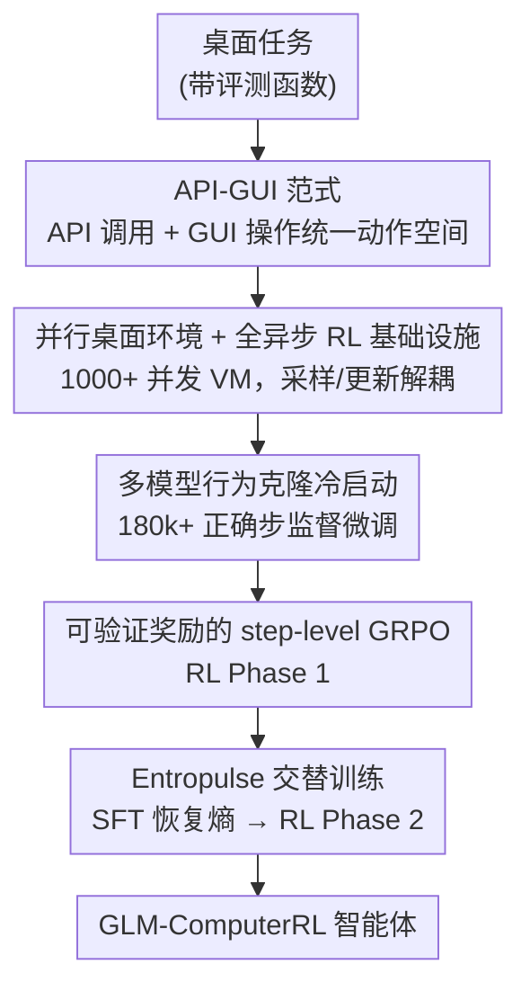

# ComputerRL: Scaling End-to-End Online Reinforcement Learning for Computer Use Agents

**会议**: ICLR2026  
**OpenReview**: [https://openreview.net/forum?id=oEVfNf0w4B](https://openreview.net/forum?id=oEVfNf0w4B)  
**代码**: https://github.com/THUDM/ComputerRL  
**领域**: 强化学习 / 计算机使用智能体 / GUI Agent  
**关键词**: 端到端在线 RL、API-GUI、桌面智能体、熵坍缩、step-level GRPO

## 一句话总结
ComputerRL 提出一个面向桌面计算机使用智能体的端到端在线 RL 框架：用 API-GUI 范式把程序化 API 调用和人类式 GUI 操作统一进同一动作空间，搭起可并发上千个虚拟桌面的分布式异步 RL 基础设施，再用 Entropulse（RL 与 SFT 交替）对抗长训练中的熵坍缩，最终让 9B 的 GLM-ComputerRL 在 OSWorld 上拿到 48.9% 的成功率，超过 OpenAI CUA o3、UI-TARS-1.5、Claude 4 等更大的闭源/开源智能体。

## 研究背景与动机
**领域现状**：让 LLM 驱动的智能体自主操作桌面（点击、滚动、输入、跨应用协作）是近一年的热点。主流路线是把屏幕截图喂给多模态模型，让它像人一样在 GUI 上一步步操作，训练上以行为克隆（behavior cloning, BC）为主——要么人工标注轨迹，要么从更强的教师模型蒸馏。

**现有痛点**：这条路有三处卡点。其一，GUI 本就是为人类设计的，让机器智能体去模拟人的鼠标键盘操作既笨重又低效，一个任务往往要几十步。其二，BC 的可扩展性差：人工标注对复杂任务贵得离谱，模型蒸馏又被教师模型的能力天花板锁死，两者都泛化弱、几乎不会从错误中恢复。其三，RL 虽然在桌面自动化上展现了潜力，但桌面环境复杂、收敛慢、采样效率低，大规模在线 RL 训练在工程上几乎跑不起来；即便跑起来，长训练中还会遭遇熵坍缩、KL 散度抬升导致探索枯竭、性能早早封顶。

**核心矛盾**：智能体想变强需要大规模端到端在线 RL，但「人类中心的 GUI 动作空间 + 不可扩展的桌面环境 + 长训练的熵坍缩」三座大山合在一起，让这条路在实践中难以规模化。

**本文目标**：把端到端在线 RL 在桌面智能体上真正「跑起来并扩起来」，具体拆成——(1) 重新设计一个对机器友好、更高效的动作空间；(2) 造一个能并发上千实例、稳定不崩的桌面环境与异步训练基础设施；(3) 设计一个能在长训练中持续涨点、不被熵坍缩拖死的 RL 算法。

**切入角度**：作者的关键观察是，智能体不必死守人类的交互范式——很多桌面操作（高亮、对比、播放、表格计算）用一行 API 调用就能完成，没必要一步步点 GUI。把 API 当成「快捷动作」和 GUI 混用，既保留 GUI 的通用性，又拿到 API 的效率。同时，长训练的熵坍缩本质是 RL 优化让策略越来越确定、探索枯竭，而 SFT 在正确轨迹上微调反而能把熵「打回去」，于是 RL 与 SFT 交替就能续命。

**核心 idea**：用「API-GUI 混合动作空间 + 上千并发桌面的分布式异步 RL + RL/SFT 交替的 Entropulse」把端到端在线 RL 扩展到桌面智能体，靠规模化在线试错而非模仿教师来获得能力与泛化。

## 方法详解

### 整体框架
ComputerRL 是一条从「任务集合」到「会操作桌面的 RL 智能体」的完整管线，可分成「框架层」和「训练层」两段。框架层解决「智能体怎么和桌面交互、环境怎么大规模并行、RL 怎么高效采样」：API-GUI 范式统一动作空间，可扩展 Ubuntu 环境提供上千个并发桌面，全异步 RL 框架把采样和更新解耦。训练层在此之上跑三阶段课程：先用多模型采集的成功轨迹做行为克隆冷启动，再用可验证奖励的 step-level GRPO 做第一轮 RL，最后用 Entropulse 把熵打回去并接着跑第二轮 RL。输入是带评测函数的桌面任务，输出是最终的 GLM-ComputerRL 智能体。

### 关键设计

**1. API-GUI 范式：用机器友好的混合动作空间取代纯人类式 GUI 操作**

针对「GUI 为人设计、纯模拟点击既慢又笨」的痛点，作者把动作空间从「只有 GUI」扩成「API 调用 + GUI 操作」二者并存：能用 API 一步搞定的（如表格计算、文档高亮、媒体播放）就走程序化接口，剩下没有 API 覆盖的长尾操作仍走 GUI，兼顾效率与通用性。难点在于为各类应用造 API 成本太高，于是他们做了一套 LLM 驱动的自动化 API 构建流水线，用户只需给出「示例任务」，系统分三步自造接口：**需求分析**（LLM 分析示例、抽取必要功能、和已有接口比对找缺口，优先生成通用函数以降复杂度）、**API 实现**（用指定 Python 库逐个实现接口，并加错误处理与日志）、**测试用例生成**（验证两点——调用无运行时错误、不同参数下结果正确，失败的接口把报错喂回去让 LLM 自我修正）。这样几乎不用人工就能为多个 Ubuntu 应用造出 API 集合。消融显示，在 GPT-4o 上 API-GUI 平均成功率 26.2%，比纯 GUI 的 11.2% 高出 134%，Office 域更是从 6.2% 跳到 27.9%；而且完成任务最多只需最强 baseline 约 1/3 的步数，效率提升明显。

**2. 大规模并行桌面环境与全异步 RL 基础设施：把「跑不起来的在线 RL」变得可扩展**

针对「桌面 RL 采样慢、环境不稳、扩不起来」的痛点，作者重建了一套可并行的 OSWorld 基础设施。原版 OSWorld 的虚拟机 CPU 重、高并发下易卡死、网络易掉 IP，且不支持多节点集群。他们的改造包括：用 AgentBench API 标准化解耦环境执行与计算后端、用 qemu-in-docker 部署轻量化容器 VM 降低单实例 CPU 占用、用 gRPC 把多个 CPU 节点连成分布式集群做集中调度、再配 Web 可视化监控环境与智能体状态。这套基础设施能在多节点 CPU 集群上并发上千个真实桌面实例。在此之上，训练侧接入 AgentRL 的全异步 RL 框架：**资源切分**让数据采集与训练各占独立资源、互不阻塞；**动态批大小**让训练器以灵活 batch 消费流入数据、减少空转；**模块隔离**让 actor / reference / critic 各自独立运行，用 PyTorch 分布式组与 NCCL 共享参数；**off-policy 偏差抑制**通过限制 replay buffer 大小、每次更新后同步轨迹，保证训练数据贴近最新策略。采样与更新解耦后，吞吐和 GPU 利用率都显著提升，这是端到端在线 RL 能「扩起来」的工程地基。

**3. 多模型行为克隆冷启动：用异构教师的互补性堆出高质量初始轨迹**

针对「单一教师模型轨迹同质、覆盖窄」的痛点，作者在 RL 之前先做 BC 冷启动，给策略一个像样的起点。他们人工收集任务并扩到 8k 任务集（每个任务都带评测函数），数据采集分三步：**初始采样**用多个闭源 LLM 对每个任务独立采样若干轨迹，记录完整交互与评测函数输出；**结果分层**按准确率把任务分成完全解决（acc=100%）、部分解决（0<acc<100%）、未解决（acc=0%）三档；**面向任务的分层增强**对部分解决的任务，先用初始轨迹 SFT 主干模型，再用微调后的模型补采轨迹以扩大覆盖，对未解决的任务则建一个高水平模型池、每个动作随机挑一个模型来产生，借「不同模型各有所长」的任务级方差，造出任何单一模型都生成不了的轨迹。最后聚合过滤、只留成功轨迹（180k+ 正确步）做监督微调。这一步让基座模型具备扎实的桌面操作与基础推理能力，为后续 RL 提供可探索的初始策略。

**4. 可验证奖励的 step-level GRPO：把 GRPO 下沉到步级、用规则奖励提供可靠信号**

针对「智能体 RL 信号噪声大、轨迹级回报难分配」的痛点，作者把 GRPO 扩展到 step-level，更贴合多步智能体训练。对每个任务 $\tau$，策略 $\pi_\theta$ 与桌面环境交互采样 $G$ 条轨迹，第 $i$ 条含 $L_i$ 个步级动作 $o_{i,1},\dots,o_{i,L_i}$；同一任务的所有步被分到一组，逐步计算优势并聚合所有步的优势求损失：

$$A_{i,j} = \frac{r_{i,j} - \mathrm{mean}(R)}{\mathrm{std}(R)}, \quad R = \{r_{u,v} \mid u=1,\dots,G,\; v=1,\dots,L_u\}$$

目标函数在 PPO 风格的 clip 比率项上对所有步求平均，并减去 $\beta D_{\mathrm{KL}}(\pi_\theta \| \pi_{\mathrm{ref}})$ 的正则项。奖励设计走可验证的规则路线：成功完成的轨迹里，每个格式正确且对解题有贡献的动作给奖励 1，失败轨迹或格式错误的动作给 0。与用 Bellman 方程逐步回传 return 的传统做法不同，这里把每个 prompt-response 对当作独立训练实例、奖励直接由最终轨迹结果决定，这种「直接奖励分配」把智能体行为和任务成功显式耦合，简单稳定。

**5. Entropulse 交替训练：用 SFT 在正确轨迹上「把熵打回去」续命长训练**

针对「RL 跑几百步后熵下降、性能封顶」的核心痛点，作者提出 Entropulse。他们先试过 DAPO 式增大 clip 阈值，发现能减缓熵下降却显著拖慢涨点，于是换思路：观察到 SFT 与 RL 的优化目标差异明显——RL 优化让熵单调下降、探索枯竭，而在正确轨迹上做 SFT 反而能抬升熵、增加轨迹多样性。具体做法是，把第一轮 RL 训练中各个训练步、各个策略产生的成功轨迹全部留存（这些通常用一次就丢，其实是高质量又多样的行为数据），按「每个任务随机选若干条成功轨迹」构造一个新 SFT 集，它同时具备高质量（都是完整成功轨迹）、多样性（来自不同训练步的异构策略）、计算高效（复用已有交互、无需额外 rollout）三个特性。在这个集合上 SFT 后，评测性能基本不变但策略熵相对上升、探索能力恢复；再接着跑第二轮 RL，就能突破第一轮的平台、继续涨点。训练消融显示，RL1 把 BC 的 31.9% 提到 42.0%，Entropulse 本身保持 41.5% 但显著提高熵，最终 RL2 达到 45.8%，验证了「熵恢复 → 有效训练步扩展 → 继续涨点」的链条。

## 实验关键数据

### 主实验
在 OSWorld 与 OSWorld-Verified 基准上，9B 的 GLM-ComputerRL 拿到 SOTA，超过一众更大的闭源/开源智能体；其中 RL 贡献了约 66% 的相对提升。

| 智能体 | 参数量 | OSWorld | OSWorld-Verified |
|--------|--------|---------|------------------|
| Claude 4.0 Sonnet | - | 30.7 | 43.9 |
| Agent S2 w/ Gemini-2.5-Pro | - | 41.4 | 45.8 |
| UI-TARS-1.5 | - | 42.5 | - |
| OpenAI CUA o3 | - | 42.9 | - |
| **ComputerRL w/ GLM-4-9B-0414** | 9B | **48.1±1.0** | 47.3 |
| **ComputerRL w/ GLM-4.1V-9B-Thinking** | 9B | **48.9±0.5** | **48.0** |

在自建的 OfficeWorld（180 个来自 SpreadsheetBench / PPTC / 自研 Writer 域的难任务）上，GLM-ComputerRL 平均 43.3%，明显高于 GPT-4.1（25.0）、Claude 4.0（24.4）、OpenAI o3（33.9）等。

### 消融实验
在 OSWorld 五个域上拆解框架与训练设计（框架消融用 GPT-4o，训练消融用 Qwen2.5-14B）：

| 配置 | OS | Office | Daily | Professional | Workflow | 平均 |
|------|----|--------|-------|--------------|----------|------|
| GUI Only | 41.7 | 6.2 | 12.3 | 14.3 | 7.5 | 11.2 |
| API-GUI | 52.6 | 27.9 | 25.7 | 41.6 | 10.8 | 26.2 |
| Untrained | 20.8 | 17.2 | 19.7 | 22.9 | 3.3 | 15.2 |
| + Behavior Cloning | 54.2 | 35.0 | 37.2 | 45.8 | 10.8 | 31.9 |
| + RL Phase 1 | 83.3 | 46.1 | 45.1 | 56.3 | 16.1 | 42.0 |
| + Entropulse | 75.0 | 42.3 | 50.6 | 52.1 | 18.9 | 41.5 |
| + RL Phase 2 | 83.3 | 46.2 | 46.7 | 60.4 | 27.2 | 45.8 |

### 关键发现
- API-GUI 是最大的单点收益来源：相比纯 GUI 平均 +134%（26.2 vs 11.2），Office 域 +350%、Professional 域 +191%，且任务步数最多压到最强 baseline 的约 1/3。
- 训练的增益主要来自 RL：BC 打底 31.9% → RL1 跳到 42.0%（+10.1）；Entropulse 单看性能持平（41.5%）但把熵抬上去，使 RL2 再涨到 45.8%（较 RL1 +3.8）。Workflow 域全程提升最戏剧（10.8 → 27.2），说明多阶段训练对难域尤其关键。
- 错误分布上，多应用协作失败占 34.4%、视觉感知错误 25.8%、操作幻觉 25.6%、其他 14.2%——跨应用协作仍是最大瓶颈。

## 亮点与洞察
- **把「人类中心」的假设直接掀掉**：智能体不必模仿人去点 GUI，能用 API 就用 API。这个看似朴素的视角转换带来了最大的单点提升，也提示「为机器重新设计交互界面」可能比「让机器学会人类界面」更高效。
- **Entropulse 是对熵坍缩的一个轻巧反制**：不靠改 clip 阈值硬扛，而是复用本来要丢弃的成功轨迹做 SFT 把熵打回去，零额外环境采样、即插即用。这个「RL 降熵、SFT 升熵、交替续命」的思路可迁移到任何长训练在线 RL（不限桌面智能体）。
- **LLM 自造 API 流水线值得复用**：需求分析→实现→测试自校正三步，把「为新应用扩动作空间」的人力成本压到接近零，是把 API-GUI 范式推广到更多软件的关键工程件。
- **工程地基同样是贡献**：上千并发桌面 + 全异步 RL 把「在线 RL 跑不起来」这件事真正解决了，这类基础设施往往是规模化实验能否成立的隐形门槛。

## 局限与展望
- 作者的错误分析坦承多应用协作（34.4%）、视觉感知（25.8%）、操作幻觉（25.6%）仍是主要失败来源，说明跨应用长程任务远未解决。
- API-GUI 的效果依赖「能为目标应用自动造出好用的 API」，对没有清晰可编程接口、或交互高度非结构化的应用，API 覆盖可能有限，退化为接近纯 GUI。
- 实验主要在 9B/14B 规模与 Ubuntu 桌面上验证，方法在更大模型、Windows/macOS 等异构系统、以及真实多用户环境下的稳定性与泛化仍待检验。
- Entropulse 的触发时机（何时插入 SFT、插几轮）目前偏经验，缺少自动化判据；若能用熵/KL 的在线监控自动触发，会更省心也更鲁棒。

## 相关工作与启发
- **vs 行为克隆 / 模型蒸馏（PC Agent-E、UI-TARS-SFT 等）**：他们靠模仿人工标注或教师模型，受教师能力天花板限制、泛化与纠错弱；本文用大规模在线 RL 让智能体在真实环境里自己试错，9B 模型即超过 72B 的 BC/DPO 路线。
- **vs 纯 GUI 智能体（OpenAI CUA、Claude Computer Use、UI-TARS 等）**：他们坚持人类式 GUI 操作、步数长效率低；本文用 API-GUI 混合动作空间，最多用约 1/3 步数完成同类任务且成功率更高。
- **vs DAPO 等对抗熵坍缩的方法**：DAPO 增大 clip 阈值能减缓熵下降但拖慢涨点；本文的 Entropulse 改用 RL/SFT 交替恢复熵，既维持探索又不牺牲收敛速度。
- **vs 同步 RL 框架**：传统同步训练采样与更新交替、互相阻塞；本文接入 AgentRL 全异步框架并配上千并发桌面，把端到端在线 RL 的吞吐推到可规模化的量级。

## 评分
- 新颖性: ⭐⭐⭐⭐ API-GUI 范式与 Entropulse 都是切中要害的实用创新，但更多是工程与训练策略层面的组合而非全新理论。
- 实验充分度: ⭐⭐⭐⭐⭐ OSWorld/OfficeWorld 主结果 + 框架/训练双消融 + 多基座模型重复 + 错误分析，覆盖很全。
- 写作质量: ⭐⭐⭐⭐ 框架与训练两段叙述清晰、图表到位；部分基础设施细节（功耗、吞吐）描述偏定性。
- 价值: ⭐⭐⭐⭐⭐ 9B 模型登顶 OSWorld 且代码开源，对桌面智能体与大规模在线 RL 社区都有很强的实用与复现价值。

<!-- RELATED:START -->

## 相关论文

- [\[CVPR 2026\] EVA: Efficient Reinforcement Learning for End-to-End Video Agent](../../CVPR2026/reinforcement_learning/eva_efficient_reinforcement_learning_for_end-to-end_video_agent.md)
- [\[ICML 2026\] You Can Learn Tokenization End-to-End with Reinforcement Learning](../../ICML2026/reinforcement_learning/you_can_learn_tokenization_end-to-end_with_reinforcement_learning.md)
- [\[ICLR 2026\] Use the Online Network If You Can: Towards Fast and Stable Reinforcement Learning](use_the_online_network_if_you_can_towards_fast_and_stable_reinforcement_learning.md)
- [\[ICLR 2026\] Adaptive Scaling of Policy Constraints for Offline Reinforcement Learning](adaptive_scaling_of_policy_constraints_for_offline_reinforcement_learning.md)
- [\[ICLR 2026\] AutoTool: Automatic Scaling of Tool-Use Capabilities in RL via Decoupled Entropy Constraints](autotool_automatic_scaling_of_tool-use_capabilities_in_rl_via_decoupled_entropy_.md)

<!-- RELATED:END -->
