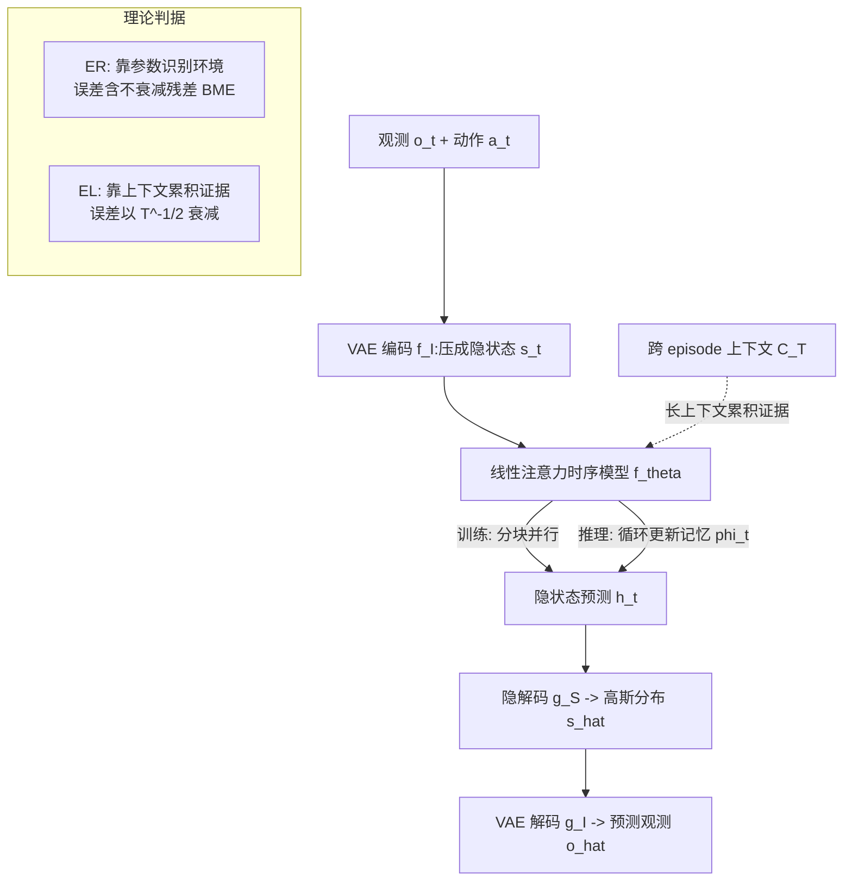

# Context and Diversity Matter: The Emergence of In-Context Learning in World Models

**会议**: ICLR 2026  
**OpenReview**: [https://openreview.net/forum?id=0GNBqoYcAP](https://openreview.net/forum?id=0GNBqoYcAP)  
**代码**: [https://github.com/airs-cuhk/airsoul/tree/main/projects/MazeWorld](https://github.com/airs-cuhk/airsoul/tree/main/projects/MazeWorld)  
**领域**: 强化学习 / 世界模型 / 上下文学习  
**关键词**: 世界模型, In-Context Learning, 环境识别(ER), 环境学习(EL), 长上下文, 线性注意力, 自适应  

## 一句话总结
本文把"世界模型的自适应"重新表述为一个上下文学习(ICL)问题，把它拆成"环境识别(ER)"与"环境学习(EL)"两种机制，推导出二者的误差上界，并据此论证：只有**足够长的上下文 + 足够多样的环境**才能催生真正的 EL，进而用线性注意力长上下文世界模型 L2World 在 cart-pole 和室内导航上实证验证了这套理论。

## 研究背景与动机
**领域现状**：世界模型(world model)是具身智能的基石——通过历史观测预测未来环境状态，从而支撑导航、自动驾驶、机器人等任务的规划与决策。但主流做法都是**静态世界模型**，针对 zero-shot / few-shot / 即时性能优化，一旦碰到训练时未见过的罕见环境就失灵，只能靠重新训练（in-weight learning, IWL）来适配。

**现有痛点**：人类和动物靠"预测编码"实现实时适应——预测误差驱动注意力、产生反馈、激发即时校准；而静态模型没有这种"在推理时持续学习"的能力。LLM 已经展示了 ICL（无需改参数、靠上下文就能泛化到新任务），但 ICL 的研究几乎都集中在语言、few-shot 分类/回归这类简单任务上，**世界模型里的 ICL 几乎是空白**，更缺乏刻画其"何时涌现"的理论。

**核心矛盾**：研究者一直盯着"上下文很短时的 zero/few-shot 单帧重建质量"（diffusion 类方法在这上面是 SOTA），却忽略了当**上下文无限增长**时世界模型能学到什么、它的渐近极限在哪。few-shot 的强表现不等于 many-shot 的强泛化，二者甚至可能背道而驰。

**本文目标**：把注意力从"zero-shot 性能"转向"世界模型随上下文增长的成长曲线与渐近极限"，回答 ICL 在世界模型里**靠什么机制涌现、被什么因素决定**。

**核心 idea**：**机制拆分** —— 沿用 ICL 的贝叶斯假说，把世界模型的 ICL 分成两种模式：**ER（环境识别）** 靠参数记忆识别"当前是训练集里哪个环境"，**EL（环境学习）** 完全不靠环境身份、直接从上下文里累积证据来预测；**理论判据** —— 推出两者的误差上界，证明 EL 的误差以 $T^{-1/2}$ 衰减、而 ER 有一个不衰减的"最佳匹配残差"，于是"低环境复杂度 + 多环境 + 长上下文 + 高多样性"是让 EL 战胜 ER 的关键。

## 方法详解

### 整体框架
论文先在 POMDP $e:\langle O,S,A,T_e,Z_e\rangle$ 上形式化世界模型 $\hat o_{t+1}\sim f_\theta(q_t)$，再引入跨 episode 的上下文 $C_T=(o_1^{(C)},a_1^{(C)},\dots)$，把 ICL 能力定义为"上下文越长、预测分布越逼近真实环境分布"。接着把 ICL 拆成 ER / EL 两条路径并各推一个误差上界（理论部分），最后给出一个能真正吃下长上下文的实现 **L2World**——用轻量 VAE 压观测、用线性（门控 slot）注意力做时序建模，训练时分块并行、推理时循环展开（实证部分）。理论告诉你"什么数据/什么架构才会涌现 EL"，实验则在 cart-pole 和迷宫导航上把这些预言一一兑现。

### 关键设计

**1. ER 与 EL 的机制分解：把"世界模型的 ICL"拆成两条可分析的路径。** 在有限环境集 $E=\{e_1,\dots,e_{|E|}\}$ 上，ER 模式把预测写成"识别环境 × 环境专属模型"的加权和 $\hat p_{\theta,ER}(o_{t+1}|q_t,C_T)=\sum_{e\in E}\hat p_\theta(e|q_t,C_T)\cdot\hat p_{\theta,e}(o_{t+1}|q_t)$——上下文只用来判断"现在是哪个见过的环境"，环境专属模型本身在推理时是冻结的（再往下还能拆成状态估计×动力学×观测模型）。EL 则完全绕开环境身份，直接从上下文里累积证据 $\hat p_{\theta,EL}(o_{t+1}|q_t,C_T)=\frac{p(q_t,o_{t+1}|C_T)}{p(q_t|C_T)}$，本质上至少是个"上下文记忆器"。这套分解是全文的分析骨架：ER 受限于训练集里见过的环境，EL 则有跨域学习新环境的潜力。

**2. ER/EL 的误差上界（Theorem 1）：用一条不等式预言哪种机制会涌现。** 在"离散空间、理想状态估计、上下文状态-动作均匀分布"等简化假设下，论文用 total-variation 距离推出二者的上界：

$$\mathrm{TV}(\hat p_{ER},p_{e_0})\le \min\Big[\tfrac{\alpha}{3}(|E|-1)T^{-1/2},\ \max_{e_1,e_2\in E}\mathrm{TV}(p_{e_1},p_{e_2})\Big]+\min_{e\in E}\mathrm{TV}(\hat p_{\theta,e},p_{e_0})$$

$$\mathrm{TV}(\hat p_{EL},p_{e_0})\le \sqrt{2|O||S||A|\log(4|O|/\delta)}\cdot T^{-1/2}$$

关键对比一目了然：EL 的上界整体以 $T^{-1/2}$ 衰减、只受**环境复杂度** $|O||S||A|$ 调制；ER 多了一个**最佳匹配误差(Best Matching Error, BME)** $\min_{e\in E}\mathrm{TV}(\hat p_{\theta,e},p_{e_0})$——它不随 $T$ 衰减，成为泛化到未见环境时的硬性天花板。由此得到三条可证伪的洞察：(i) **环境复杂度越低、环境数 $|E|$ 越多**，越偏向 EL（$|E|$ 只进 ER 界、复杂度只进 EL 界）；(ii) **长上下文 + 高多样性是两种机制共同的前提**——多样性太低时 ER 的识别误差趋零会"抢戏"，反而压制 EL 的涌现，只有多样性够大、两者上界都按 $T^{-1/2}$ 衰减时长上下文才不可或缺；(iii) **过度训练 + 强 IWL 会把模型从 EL 拉回 ER**（训练后期 BME 趋零，模型倾向于"识别"而非"学习"，呈现 ICL→IWL 的瞬态切换）。

**3. L2World：用线性注意力长上下文换时间可扩展性。** 既然理论要求"长上下文"，那 diffusion / 多 token 表征那套高保真单帧重建就因为内存和算力瓶颈撑不到 EL 所需的序列长度。L2World 干脆**牺牲每帧保真度、换时序可扩展性**：图像观测用轻量 ResNet 结构的 VAE（$f_I/g_I$）压成隐状态，低维观测就用小 MLP；时序建模用**门控 slot 注意力（线性注意力）**——训练时分块并行 $\phi_t,h_1,\dots,h_t=f_\theta(s_1,a_1,\dots,s_t,a_t)$，推理时退化成循环形式 $\phi_t,h_{t+1}=f_\theta(\phi_{t-1},s_t,a_t)$，靠"在上下文内高效更新记忆 $\phi_t$"实现自适应。它还把状态预测当成隐空间上的高斯 $\hat p\sim N(\hat s_t,\sigma_s^2)$，并用观测重建损失 + 状态转移 KL 损失联合训练；图像场景先预训练并冻结 VAE、再训时序模型。正是这种"线性复杂度 + 长上下文"的取舍，让它在长序列预测上反超依赖重型 diffusion backbone 的方法。

## 实验关键数据

### 主实验表格
**迷宫导航 1-step 预测 PSNR（节选，越高越好）**：

| 模型(训练集) | Seen T=1 | Seen T=10000 | Unseen T=1 | Unseen T=100 | Unseen T=10000 |
|---|---|---|---|---|---|
| L2World (Maze-32K-L) | 16.80 | 25.05 | 16.37 | 23.17 | **24.65** |
| L2World (Maze-128-L) | 18.54 | **26.00** | 17.54 | 20.96 | 21.52 |
| L2World (Maze-32K-S) | 18.57 | 20.48 | 18.45 | 19.63 | 20.31 |
| Dreamer (Maze-32K-L) | 16.40 | 21.89 | 16.81 | 21.40 | 22.12 |
| NWM (Maze-32K-L) | 20.84 | 21.89 | 16.20 | 17.00 | 17.85 |

要点：**32K-L（多环境+长轨迹）在未见环境上泛化最好**，且峰值出现在上下文渐近阶段（T 很大时）而非起点；**128-L（少环境+长轨迹）在 seen 上更强**，典型 ER 特征。Dreamer 的 LSTM 和 NWM 的 4 帧窗口都吃不下长上下文，长程明显落后。

**ProcTHOR 迁移 1-step PSNR（Unseen，越高越好）**：

| 模型 | 预训练 | T=10 | T=1000 | T=10000 |
|---|---|---|---|---|
| L2World | Maze-32K-L | 22.81 | **25.40** | 23.94 |
| L2World | — (ProcTHOR-5K) | 18.22 | 19.74 | 19.81 |
| Dreamer | — (ProcTHOR-40K) | 22.61 | 23.51 | 22.76 |
| NWM | — | 21.41 | 21.02 | 20.08 |

**EL 迁移性更强**：在 Maze-32K-L 上预训练（EL 模式）的模型，迁到全新 ProcTHOR 场景后仍大幅领先 128-L 和各 baseline。

### 消融实验表格
**Cart-pole（随机化 g/质量/杆长）的环境数 × 范围消融（定性结论）**：

| 训练配置 | 现象 | 机制判定 |
|---|---|---|
| 1-Env / 4-Envs | seen 与 unseen 差距巨大，无泛化 | 无 ICL / 纯 ER |
| 16-Envs (Scope1+2) | 泛化改善但仍受限 | 偏 ER |
| 8K-Envs (Scope1) | 与 16-Envs 相近 | 范围不足 |
| **8K-Envs (Scope1+2)** | 泛化最好，但 T>10 后才反超 4-Envs | **EL** |

### 关键发现
- **环境数量和环境范围都不可少**：只有"多环境 + 大范围"才催生 EL；长上下文是泛化的"代价"——更广的泛化要更长的上下文(T>10)才显现。
- **BME 验证（Fig.3）**：4-Env 模型的误差贴着 $error=BME$ 线，环境数增多后误差线逐步压到 BME 之下，直接印证 Theorem 1 中 BME 是 ER 的泛化瓶颈，以及"环境数↑ ⇒ ER→EL 切换"。
- **过度训练伤泛化**：4-Env 的早期 checkpoint 虽然 seen 上次优，但 unseen 泛化反而明显更好，证实"训练越久越退回 IWL/ER"。
- **EL 对上下文扰动更敏感（Fig.5）**：随机打乱 20%/50% 上下文观测后，Maze-32K-L(EL) 比 128-L(ER) 掉得更狠——说明 EL 真的"在读上下文"，ER 更依赖参数记忆。

## 亮点与洞察
- **把"自适应世界模型"翻译成可分析的 ICL 问题**：ER/EL 二分法 + 误差上界，给了一个能解释"为什么有的世界模型会泛化、有的不会"的统一语言，而不是停留在 benchmark 刷分。
- **理论预言被逐条实证**：复杂度↓、环境数↑、上下文↑、多样性↑ 这四个旋钮的作用，从离散假设一路验证到连续 MDP 与图像 POMDP，可证伪性强。
- **反直觉的"few-shot 与 many-shot 背离"**：泛化范围更广的模型在短上下文反而更差，提醒社区别再只盯 zero/few-shot 单帧质量。
- **架构取舍有据可依**：线性注意力的长上下文能力是 EL 涌现的硬件前提，论文用 Dreamer(LSTM)/NWM(4 帧) 的失败反衬了这一点，让"为什么用线性注意力"不再是工程口味而是理论结论。

## 局限与展望
- **只覆盖动力学模型**：奖励模型与策略模型未纳入，离完整的 In-Context Reinforcement Learning 还有距离（作者自陈是第一步）。
- **理论假设偏强**：离散空间、理想状态估计、上下文均匀分布等假设，与真实连续/高维场景有差距，上界更多是定性指导。
- **牺牲单帧保真**：L2World 为了长上下文放弃了高保真重建，在强随机环境里高斯隐状态假设可能损失精度；当前只在合成 cart-pole / 迷宫 / ProcTHOR 上验证，真实世界数据待补。
- **长度依赖明显**：ProcTHOR 从 5K 加到 40K 时 T=1K~10K 反而退化，说明短轨迹数据会侵蚀已习得的长 ICL 能力，数据"长度"和"数量"需要协同设计。

## 相关工作与启发
- **ICL 机制研究**：task learning vs task recognition、retrieval vs inference 等区分，以及 transience / task diversity / context length 对 ICL 涌现的影响——本文把这些从回归/分类搬到了世界模型，并补上了理论上界。
- **世界模型与 model-based RL**：Dreamer 系列、Navigation World Model(diffusion)、JEPA 类隐空间世界模型是直接对比对象；本文论证了"上下文长度"才是它们在跨环境自适应上的胜负手。
- **线性注意力 / 长上下文架构**：门控 slot 注意力等线性注意力是实现长上下文 EL 的关键载体，给"世界模型该用什么 backbone"提供了理论侧的答案。
- **启发**：对做自适应/终身学习智能体的人，本文提示——与其追求 zero-shot，不如刻意构造**多样化 + 长轨迹**的数据并配长上下文架构，让模型在推理时"边看边学"。

## 评分
- **新颖性**: ⭐⭐⭐⭐⭐ 首次把世界模型的自适应严格形式化为 ER/EL 两机制并给出误差上界，理论视角新颖且可证伪。
- **实验充分度**: ⭐⭐⭐⭐ cart-pole + 迷宫 + ProcTHOR 三套环境、多维度消融逐条印证理论；但仍限于合成/模拟环境，缺真实世界验证。
- **写作质量**: ⭐⭐⭐⭐ 理论与实验衔接紧密、洞察清晰；公式与符号偏密集，对非世界模型背景读者有一定门槛。
- **价值**: ⭐⭐⭐⭐ 为"自适应世界模型/具身 ICL"指明了数据与架构的设计原则，对 model-based RL 和具身智能有方法论意义。

<!-- RELATED:START -->

## 相关论文

- [\[ICLR 2026\] Scalable In-Context Q-Learning](scalable_in-context_q-learning.md)
- [\[ICLR 2026\] LongRLVR: Long-Context Reinforcement Learning Requires Verifiable Context Rewards](longrlvr_long-context_reinforcement_learning_requires_verifiable_context_rewards.md)
- [\[NeurIPS 2025\] Towards Provable Emergence of In-Context Reinforcement Learning](../../NeurIPS2025/reinforcement_learning/towards_provable_emergence_of_in-context_reinforcement_learning.md)
- [\[ICLR 2026\] In-Context Compositional Q-Learning for Offline Reinforcement Learning](in-context_compositional_q-learning_for_offline_reinforcement_learning.md)
- [\[ICLR 2026\] Reward is Enough: LLMs are In-Context Reinforcement Learners](reward_is_enough_llms_are_in-context_reinforcement_learners.md)

<!-- RELATED:END -->
