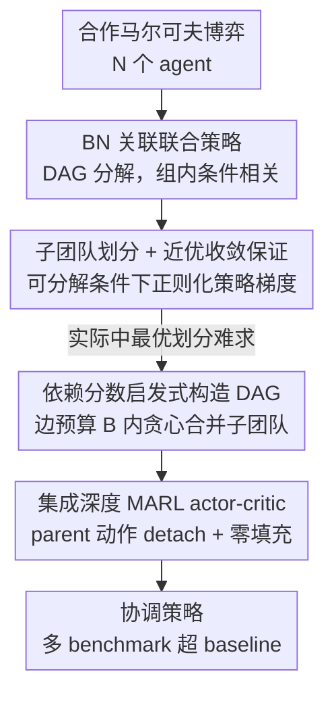

# Correlated Policy Optimization in Multi-Agent Subteams

**会议**: ICLR2026  
**OpenReview**: [https://openreview.net/forum?id=Tke3BVwUz6](https://openreview.net/forum?id=Tke3BVwUz6)  
**代码**: 待确认  
**领域**: 强化学习 / 多智能体协作 / 策略梯度理论  
**关键词**: 多智能体 RL、贝叶斯网络策略、子团队、策略梯度收敛、可分解性

## 一句话总结
把合作多智能体里的联合策略用一个 DAG（贝叶斯网络）来分解，让智能体在"子团队"内部完全关联、跨团队相互独立；在奖励/转移可分解的条件下证明正则化策略梯度能收敛到近优策略，并给出一个按"依赖分数 + 边预算"动态拼子团队的启发式，套进 MAPPO/MADDPG 后在多个 benchmark 上打过标准 baseline。

## 研究背景与动机
**领域现状**：合作多智能体强化学习（MARL）里最常用的是**乘积策略**（product policy）——联合策略写成各 agent 局部策略的连乘 $\pi(a|s)=\prod_i \pi_i(a_i|s)$。它好在可扩展、执行时不需要通信，但代价是强行假设各 agent 动作条件独立。

**现有痛点**：乘积策略的表达力受限，策略梯度优化它时一般**不保证收敛到全局最优**，多数理论结果只能给到 Nash 均衡这种比"全局最优"更弱的解概念。为了补回表达力，已有工作（Chen & Zhang 2023 等）用贝叶斯网络（BN）/DAG 在 agent 之间引入相关性，把联合策略写成若干"带条件"的局部策略连乘。但只要 BN 不是全连接，次优性依旧存在；而全连接又会让联合动作空间随 agent 数指数膨胀，回到维度灾难。

**核心矛盾**：表达力（更密的相关性 → 更可能最优）与可扩展性/可优化性（更密 → 维度爆炸、更难训）之间是直接对立的。现有 BN 方法要么不够表达、要么不可扩展，而且对"稀疏 BN 何时仍能最优"几乎没有理论刻画。

**切入角度**：作者从人类团队的组织方式得到启发——真实任务里 agent 往往呈现**簇状弱耦合**：每个小组内部紧密协调、组间几乎不交互（例如搜救任务里各无人机分区作业，区内强协调、跨区基本不通信）。如果环境的奖励/转移本就能按这种簇结构近似分解，那只在组内保留完全关联、组间强制独立，理论上既省维度又不太损最优性。

**核心 idea**：用一个把 agent 划成"子团队"的 DAG 来约束 BN 联合策略——**团队内全连接（完全关联）、团队间无边（条件独立）**；并证明在环境"可分解"的假设下，正则化策略梯度上升能收敛到次优性被显式量化的近优策略，次优界由"分解误差 + 子团队大小"共同决定。

## 方法详解

### 整体框架
论文要解决的问题是：在合作 MARL 里，**怎样的联合策略结构既能省掉乘积策略丢掉的协调能力，又不至于退化成不可扩展的全连接 BN，并且还能给出收敛与最优性保证**。整套方法分四步串起来：先用 DAG 把联合策略定义成可表达相关性的 BN 策略（连续地横跨"乘积↔全联合"两端）；再把 DAG 约束成"子团队划分"形式，并在环境可分解的条件下证明正则化策略梯度的近优收敛（先一个固定 DAG 的 warm-up 收敛率，再升级成带子团队的近优界）；接着因为实际中"哪种划分误差最小"难求，提出一个用依赖分数贪心合并、受边预算约束的启发式来动态构造 DAG；最后把这个带动态 DAG 的 BN 策略当 actor 接进深度 actor-critic（MAPPO/MADDPG），并解决变长 parent 动作输入的工程问题。

### 关键设计

**1. BN 关联联合策略：用 DAG 在"乘积"和"全联合"之间造一个连续谱**

针对乘积策略表达力不足、却又不想直接上不可扩展的全联合策略这个痛点，作者用一个有向无环图 $G=(N,E)$ 来定义联合策略：agent 是顶点，边 $(j,i)\in E$ 表示 $j$ 是 $i$ 的父节点。每个 agent 的局部策略不仅看全局状态，还看父节点的动作 $\pi_G^i(a_i|s, a_{P_i})$，于是联合策略分解为 $\pi_G(a|s)=\prod_{i\in N}\pi_G^i(a_i|s, a_{P_i})$。这个结构的妙处在于它是**连续的**：$G$ 无边时退化成乘积策略，$G$ 稠密时又能表达任意联合分布——表达力和图的密度直接挂钩。为给出有限时间保证，作者用 tabular softmax 参数化局部策略，并在目标里加一个**对数障碍正则**（每个 agent 的策略对均匀分布取 KL）：

$$L_\lambda(\theta) := V_\theta(\mu) - \lambda \sum_{i\in N} \mathbb{E}_{s,a_{P_i}\sim \mathrm{Unif}}\big[\mathrm{KL}(\mathrm{Unif}_{A_i},\, \pi_{\theta^i}^i(\cdot|s,a_{P_i}))\big]$$

正则项防止 softmax 概率塌到 0、保证梯度不退化。这里作者还把 BN 策略的均衡概念明确成 equilibrium gap $\mathrm{gap}(\pi_G)=\max_i \big(\max_{\bar\pi^i_G} V_{\bar\pi^i_G,\pi^{-i}_G}-V_{\pi_G}\big)$——和 Nash / 粗相关均衡都不同，因为它允许偏离的局部策略仍条件于父节点动作。

**2. 子团队划分 + 可分解条件下的近优收敛：把"均衡保证"升级成"最优保证"**

只证到均衡还不够——均衡可能任意次优。作者的核心理论贡献是刻画一类能保证最优的 DAG 结构。**子团队**（Definition 1）定义为 DAG 里一组顶点 $C$，其中任意两个 agent 之间都有一条有向边（受无环约束），即组内完全关联。**环境的可分解性**（Definition 2）则要求转移与奖励能按一个 agent 划分 $\{C_k\}_{k=1}^K$ 拆成各组的局部分量加上误差：

$$P(s'|s,a)=\sum_{k=1}^K P^k(s'|s,a_{C_k})+\epsilon_P(s'|s,a),\quad r(s,a)=\sum_{k=1}^K r^k(s,a_{C_k})+\epsilon_r(s,a)$$

由于误差项任意，这个分解对任何划分都"形式上"成立，关键是误差 $|\epsilon_P|,|\epsilon_r|$ 多大。Assumption 3 要求 DAG 的划分既是子团队、又对应一个可分解，且**跨子团队无任何边**（条件 iii，证明里需要它来做 telescoping）。在此之上：warm-up 的 Theorem 1 先给出固定 DAG 下 tabular softmax BN 策略梯度收敛到 $\epsilon$-均衡的有限时间率（关键技巧是把父动作 $a_{P_i}$ 并进状态当"增广状态"，从而把分析对齐到乘积策略的已有结果）；主结果 Theorem 2 把它强化成**近优**：

$$\min_{t\le T}\mathrm{subopt}(\pi_{\theta_t}) \le \epsilon + 2K\Big(\tfrac{|\epsilon_r|}{1-\gamma}+\tfrac{\gamma|S||\epsilon_P|}{(1-\gamma)^2}\Big)$$

第二项就是分解误差带来的渐近偏置。这里揭示了一个核心 trade-off：**划分越细（$K$ 越大）**，收敛越快（迭代复杂度里带一个偏好细划分的因子 $g(\{C_k\})=\sum_k 2^{|C_k|}-K$）、但分解误差越大、渐近次优越多；$K=1$（全员一个子团队）时无分解误差、可达 $\epsilon$-最优但维度最大。据作者所述这是首个**不要求 agent 完全独立**就能给出 BN 策略最优性保证的工作。

**3. 依赖分数驱动的子团队动态构造：在边预算内贪心拼出"低分解误差"的划分**

理论说"分解误差小的划分更好"，但实际中**哪种划分误差最小并不好求**。作者给一个启发式：给定至多 $B$ 条边的预算，先把每个 agent 当作单点子团队（无边），再依据先验的**依赖分数** $\{d_{ij}\}$（来自领域知识，粗略刻画两 agent 的耦合强度）迭代合并。每步选平均成对依赖最大的两个子团队合并：

$$d(C,C') := \frac{1}{|C||C'|}\sum_{i\in C, j\in C'} d_{ij}$$

合并即在两组间加满边，直到耗尽边预算 $B$。用"平均"而非"总和"是为了高效使用边预算——合并大子团队要更多边，平均化会抑制盲目把大组并一起。依赖分数还可以**随状态/episode 动态变化**，从而 context-aware 地逼近低分解误差的划分（例如按 agent 的空间位置/曼哈顿距离实时算）。

**4. 集成进深度 actor-critic：让 BN 策略当 actor，解决变长 parent 输入与信用分配**

要把上面的 BN 策略用进 MAPPO/MADDPG 这类深度算法，有两个实操问题。其一是**信用分配/训练稳定**：训练时把父节点动作从计算图里 detach（不让梯度回传到父节点），作者发现这样能保证恰当的信用分配并稳住训练。其二是**变长输入**：动态 DAG 下每个 agent 的父节点数会变，作者构造一个固定长度 $N\cdot\sum_i|A_i|$ 的输入向量，把非父节点 agent 的动作**零填充**，从而不同 DAG 拓扑下输入格式一致、可批处理。作者还把这套启发式**复用到中心化训练**：给 VAST（按子组做价值分解）用同一个启发式来定子组 $\{C_k\}$，替掉它原来的元学习划分（注意 VAST/QTRAN 属于 CTDE，执行时等价于无相关的乘积策略，这与前几节的相关策略本质不同）。

### 一个完整示例
以 $N=5$ 的 Coordination Game 为例走一遍。每个 agent 有二值局部状态/动作，奖励鼓励大家对齐局部状态。先看固定 DAG：把 5 个 agent 划成不同子团队拓扑——`product`（无边）、`1+4`、`2+3`、`full`（$K=1$ 全连接）。用三层 MLP 回归拟合各划分的 $\{P^k,r^k\}$ 得到分解误差（Table 1）：`full` 的 $|\epsilon_P|\approx7\mathrm{e}{-8}$ 几乎为 0，`1+4` 约 $0.34$，`2+3` 约 $0.48$，`product` 最大约 $0.60$。最终性能排序恰好与误差排序一致：`full`≈`1+4` > `2+3` > `product`——划分越粗、误差越小、表现越好，印证 Theorem 2。再看动态 DAG：给定边预算 $B=4$，依赖分数按"把二值状态当 1D 位置、用位置邻近"计算，启发式贪心合并出一个 DAG 接进 MAPPO；结果 `heuristic`≈`full` > `random`≈`product`——即在仅 4 条边预算下，启发式逼出了接近全连接的协调质量，却没付全连接的维度代价。

### 损失函数 / 训练策略
理论部分优化的是对数障碍正则化目标 $L_\lambda(\theta)$（见设计 1 的公式），用固定步长 $\eta\le 1/\beta_\lambda$ 的标准梯度上升 $\theta^i_{t+1}=\theta^i_t+\eta\nabla_{\theta^i}L_\lambda(\theta_t)$，并按 Theorem 2 取 $\lambda=\tfrac{\epsilon}{2}M^{-1}g(\{C_k\})^{-1}$。深度实现里则把 BN 策略作为 actor 接入 MAPPO（离散动作：Coordination Game、Aloha）和 MADDPG（连续动作：Predator-Prey），父动作 detach、非父动作零填充。

## 实验关键数据

### 主实验
论文实验分两条线：固定 DAG 的 tabular 精确梯度（验证理论）+ 动态 DAG 接深度 MARL（验证实用）。深度部分四种拓扑对比：

| 环境 | 基座算法 | 边预算 B | 性能排序（本文 heuristic 对比） |
|------|----------|----------|------------------------------|
| Coordination Game (N=5) | MAPPO | 4 | heuristic ≈ full > random ≈ product |
| Aloha (N=10) | MAPPO | 10 | heuristic、full 学得最快（末期四者接近） |
| Predator-Prey (N=15) | MADDPG | 50 | heuristic 最优，full 反而最差，random≈product |

中心化训练（VAST）复用启发式：

| 环境 | 方法 | 结果 |
|------|------|------|
| Warehouse (N=16) | VAST(heuristic) vs VAST(meta-learning) vs QTRAN | heuristic > meta-learning > QTRAN |
| Battle (N=40) | 同上 | heuristic 最优，两种 VAST 均超无分组 QTRAN |

### 消融实验
固定 DAG 下"分解误差 ↔ 最终性能"的对应关系本身就是核心消融（Table 1 + Figure 1）：

| 配置 (N=5) | 拟合 $\lvert\epsilon_P\rvert$ | 拟合 $\lvert\epsilon_r\rvert$ | 相对性能 |
|------|------|------|------|
| full ($K=1$) | 7.13e-08 | 3.73e-08 | 最好 |
| 1+4 | 3.38e-01 | 1.44e+00 | 接近 full |
| 2+3 | 4.80e-01 | 2.38e+00 | 居中 |
| product | 6.03e-01 | 1.56e+00 | 最差 |

### 关键发现
- **分解误差小的划分基本就是表现好的划分**，这正是 Theorem 2 的实证落地；多数情况严格对应，验证了"误差—次优"的理论关联。
- **唯一反例在 N=3**：`1+2` 的分解误差比 `product` 小却表现略差，作者解释为 `1+2` 引入的额外关联还不够显著到能换来收益，而 `product` 参数更少、更易优化。这提醒理论界是"渐近偏置"，小规模/优化难度会扰动实际排序。
- **更密不总是更好**：Predator-Prey 里 `full` 反而最差，说明在高复杂度连续环境中，盲目全连接带来的优化困难会压过表达力收益，而受预算约束的 `heuristic` 反而最稳。

## 亮点与洞察
- **用一个 DAG 把"乘积↔全联合"连成连续谱**很优雅：表达力变成图密度这个可调旋钮，子团队只是其中一类结构化取法，让"省维度"和"保协调"有了统一语言。
- **把父动作并进状态当增广状态**这一招让 BN 策略的收敛分析直接复用单 agent / 乘积策略的成熟结果，是理论能落地的关键技巧，思路可迁移到其他"带条件的结构化策略"分析。
- **"分解误差 vs 子团队数"的 trade-off 被显式写进次优界**（$K$ 越大收敛越快但偏置越大），把一个工程直觉变成可量化的设计准则——选多细的划分有了理论依据。
- **依赖分数启发式 + 边预算**把抽象的"找低误差划分"变成可执行的贪心合并，且能 context-aware 动态变；这个划分器还能即插即用地复用到 VAST 这类价值分解方法，复用性强。

## 局限与展望
- **可分解性是强假设**：Definition 2 虽形式上对任意划分都成立，但保证有意义需要 $|\epsilon_P|,|\epsilon_r|$ 真的小，现实环境是否近似可分解、误差多大并不易先验判断。
- **理论结果停在 tabular softmax 精确梯度**：Theorem 1/2 都建立在表格化、精确梯度上升上；深度版用启发式 DAG + 神经网络近似，理论保证并不直接覆盖实际算法，二者之间有 gap。
- **依赖分数依赖领域知识**：$\{d_{ij}\}$ 主要靠人手设计（如空间距离），换到没有自然几何结构的任务时怎么定义依赖分数是开放问题；自动学习依赖分数是自然的改进方向。
- **N 仍偏小**：最大到 N=40（Battle），离真正大规模 MARL 还有距离，启发式在更大规模、更复杂耦合下的可扩展性待验证。

## 相关工作与启发
- **vs 乘积策略方法（MAPPO/MADDPG/HAPPO 等）**：它们假设 agent 动作条件独立，可扩展但策略梯度一般不保证全局最优、多只到 Nash；本文在乘积策略之上引入 BN 相关性，并首次在"非完全独立"下给出最优性保证，代价是需要可分解假设。
- **vs 已有 BN/相关策略方法（Chen & Zhang 2023, Ye et al. 2023 等）**：它们也用 DAG 表达相关联合策略，但只要 BN 不全连接次优性就在，且多为渐近结果；本文给出固定 DAG 的有限时间收敛率，并刻画"子团队 + 可分解"这一可保证近优的子类。
- **vs 价值分解 / 协调图（VDN, QMIX, QTRAN, VAST, Deep Coordination Graph）**：那些方法在价值函数层面按结构分解、属 CTDE（执行时等价乘积策略）；本文是策略层面的相关性，且把自家启发式反向复用到 VAST 的子组划分上，实测优于其元学习划分。
- **vs 可分解性下的收敛工作（Dou et al. 2022 对 VDN）**：本文沿用类似可分解假设，但把保证从 value-based 算法推广到带 BN 相关策略的 policy gradient 方法。

## 评分
- 新颖性: ⭐⭐⭐⭐⭐ 首个在不要求 agent 完全独立下给出 BN 策略最优性保证，子团队视角统一了表达力与可扩展性
- 实验充分度: ⭐⭐⭐⭐ tabular 验证理论 + 5 个深度 benchmark + VAST 复用，但规模偏小、连续高维环境结论有波动
- 写作质量: ⭐⭐⭐⭐ 理论脉络（warm-up→主定理→trade-off）清晰，证明草图到位；启发式与理论的衔接稍跳
- 价值: ⭐⭐⭐⭐ 把"子团队划分"从工程直觉提升为有量化次优界的设计准则，划分器即插即用可复用

<!-- RELATED:START -->

## 相关论文

- [\[ICLR 2026\] Multi-Agent Guided Policy Optimization](multi-agent_guided_policy_optimization.md)
- [\[ICLR 2026\] Heterogeneous Agent Q-weighted Policy Optimization](heterogeneous_agent_q-weighted_policy_optimization.md)
- [\[ICLR 2026\] Boosting Multi-Domain Reasoning of LLMs via Curvature-Guided Policy Optimization](boosting_multi-domain_reasoning_of_llms_via_curvature-guided_policy_optimization.md)
- [\[ICLR 2026\] Inter-Agent Relative Representations for Multi-Agent Option Discovery](inter-agent_relative_representations_for_multi-agent_option_discovery.md)
- [\[AAAI 2026\] HCPO: Hierarchical Conductor-Based Policy Optimization in Multi-Agent Reinforcement Learning](../../AAAI2026/reinforcement_learning/hcpo_hierarchical_conductor-based_policy_optimization_in_multi-agent_reinforceme.md)

<!-- RELATED:END -->
