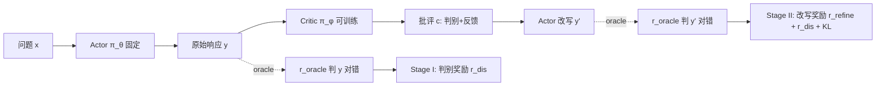

# Critique-RL: Training Language Models for Critiquing Through Two-Stage Reinforcement Learning

**会议**: ICLR 2026  
**OpenReview**: [https://openreview.net/forum?id=SsUjdSVdUl](https://openreview.net/forum?id=SsUjdSVdUl)  
**代码**: [https://github.com/WooooDyy/Critique-RL](https://github.com/WooooDyy/Critique-RL)  
**领域**: 强化学习 / LLM 可扩展监督  
**关键词**: critique model, scalable oversight, two-stage RL, discriminability, helpfulness, actor-critic  

## 一句话总结
Critique-RL 用一个不依赖更强监督者标注的在线 RL 方案训练「批评模型」，先用直接的规则奖励把判别力（discriminability）练好，再用基于改写正确率的间接奖励提升有用性（helpfulness）并加正则保住判别力，从而让弱模型也能产出又准又有用的反馈。

## 研究背景与动机
- **领域现状**：训练「批评/评审模型」（critic）去评估并反馈 actor 输出，是实现可扩展监督（scalable oversight）的有效路径——actor 据此改写，能在复杂推理、代码、决策等任务上显著提升表现。
- **现有痛点**：① 微调式方法（Saunders 等）依赖更强的监督者（如 GPT-4o）标注 critique 数据，昂贵且难扩展，标注分布还与学习者输出分布不匹配；② prompt 工程式方法（Self-Refine、CoVe 等）默认测试时存在 oracle verifier，让 critic 绕过「判别」只管「给建议」，一旦没有外部验证器就遭遇性能瓶颈。
- **核心矛盾**：在双玩家 actor-critic 框架里，最自然的做法是只用 actor 两次作答（原始 + 改写）的正确率作为**间接奖励**来训 critic。本文实证发现这条路会失败：critic 的**有用性**虽提升，但**判别力没被优化**，导致 critic 要么过度保守（不敢让 actor 改答案，$\Delta_{i\to c}$ 上不去）、要么过度激进（乱让 actor 改，$\Delta_{c\to i}$ 居高不下），最终 Acc@Refine 提升甚微，RL 甚至训练崩溃。
- **本文目标**：在**不依赖更强标注、也不依赖测试时 oracle verifier** 的前提下，训出同时具备高判别力与高有用性的批评模型。
- **核心 idea**：**判别力与有用性解耦、分两阶段优化** —— Stage I 用直接规则奖励专门把判别力练稳，Stage II 再引入间接的改写奖励提升有用性，同时保留判别奖励 + 对 Stage I 模型的 KL 正则防止判别力退化。

## 方法详解

### 整体框架
系统是一个「响应—批评—改写」的双玩家循环：固定的 actor $\pi_\theta$ 对问题 $x$ 生成原始响应 $y=\pi_\theta(x)$；可训练的 critic $\pi_\phi$ 读入 $(x,y)$ 产出批评 $c=\pi_\phi(x,y)$，批评里既要**判别**响应对错、又要给**有用**的自然语言反馈；actor 据 $c$ 改写得到 $y'=\pi_\theta(x,y,c)$。oracle 正确性验证器 $r_{\text{oracle}}$ 只在训练时对 $y$、$y'$ 打对错，由此构造 critic 的奖励。训练分两阶段串行：先练判别（Stage I），再练有用性（Stage II）。

### 关键设计

**1. 动机诊断：间接奖励为何练不出好 critic（失败模式的根因定位）。** 作者先把三种纯间接奖励摆上台面：$r_{\text{refine}}(x,y,c,y')=r_{\text{oracle}}(x,y')$ 只看改写对错；$r_\Delta=r_{\text{oracle}}(x,y')-r_{\text{oracle}}(x,y)$ 看两次作答的正确率差；以及分段的 $r_{\text{correction}}$（错改对给 1.0、对保持对给 0.2、改写错给 0）。在 GSM8K + Qwen2.5-3B 上跟踪训练动态后发现：$r_{\text{refine}}$ 与 $r_\Delta$ 能压低 $\Delta_{c\to i}$（不破坏原本对的答案）但 $\Delta_{i\to c}$ 上不去，critic 变得**过度保守**；$r_{\text{correction}}$ 反过来抬高 $\Delta_{i\to c}$ 却压不住 $\Delta_{c\to i}$，变得**过度激进**。根因在于这些奖励全部锚定 actor 的响应、只盯有用性，对「response 到底对不对」的判别力始终不被优化——对原本正确/错误的响应只能顾一头，另一头反而退化，最终瓶颈甚至崩溃。这一诊断直接逼出了「必须显式优化判别力」的设计。

**2. Stage I —— 用直接规则奖励把判别力练稳。** 关键转变是把奖励从「看 actor 改写结果」换成「看 critic 自己的判断对不对」。给定 $(x,y)$，critic 被要求对每一步和最终答案给出正确性判断，记 $f(x,y,c)$ 为 critic 判定的对错，则判别奖励是一个直接的规则信号：

$$r_{\text{dis}}(x,y,c)=\mathbb{1}\big(f(x,y,c)=r_{\text{oracle}}(x,y)\big)$$

即 critic 判断与真值一致才得 1 分。Stage I 最大化 $\mathbb{E}_{c\sim\pi_\phi^{\text{I}}}\big[r_{\text{dis}}(x,y,c)-\beta\,\mathrm{KL}(\pi_\phi^{\text{SFT}}\Vert\pi_\phi^{\text{I}})\big]$，其中对 SFT 模型的 KL 用来稳住训练。因为奖励不再绕经 actor，而是直接监督「判对/判错」，无论原始响应正确与否，判别力都能被稳定、对称地优化上去。

**3. Stage II —— 提升有用性的同时锁住判别力。** 以 Stage I 模型作初始化，引入基于改写正确率的间接奖励 $r_{\text{refine}}=r_{\text{oracle}}(x,y')$ 来练有用性；但为防止「练有用性又把判别力练废」，同时保留 $r_{\text{dis}}$ 并加上对 Stage I 模型的 KL 正则。目标为：

$$\mathbb{E}_{c\sim\pi_\phi^{\text{II}},\,y'\sim\pi_\theta}\Big[r_{\text{refine}}+\beta_1 r_{\text{dis}}(x,y,c)-\beta_2\,\mathrm{KL}\big(\pi_\phi^{\text{I}}(c|x,y)\Vert\pi_\phi^{\text{II}}(c|x,y)\big)\Big]$$

直接奖励 $r_{\text{dis}}$ 与 KL 正则共同把判别力钉在 Stage I 的水平，$r_{\text{refine}}$ 则推动 $\Delta_{i\to c}$ 上升、$\Delta_{c\to i}$ 下降，于是 Acc@Refine 稳步提升而不再保守或激进。选 $r_{\text{refine}}$ 而非 $r_\Delta/r_{\text{correction}}$ 是因为它最贴近测试时直接优化 Acc@Refine 的场景。底层用 RLOO（无需价值模型）做基础算法，$\beta_1=0.2$，KL 系数 0.01，每阶段训 500 步。

## 实验关键数据

数据集：训练用 MATH/GSM8K/AQuA（in-domain），OOD 用 SVAMP/TheoremQA；模型主要为 Qwen2.5-3B/7B。指标：Acc@Refine（改写后准确率）、$\Delta$（相对无 critic 的提升）、Acc@Dis（判别准确率）。

### 主实验表格（Acc@Refine / Acc@Dis，in-domain）

| 模型 | 方法 | MATH Acc | MATH Acc@Dis | GSM8K Acc | GSM8K Acc@Dis | AQuA Acc |
|------|------|----------|--------------|-----------|---------------|----------|
| Qwen2.5-3B | No Critic | 36.90 | – | 66.03 | – | 50.00 |
| | SFT | 44.24 | 66.51 | 69.14 | 76.34 | 46.46 |
| | STaR | 44.38 | 66.97 | 71.95 | 74.79 | 50.39 |
| | Retroformer | 44.54 | 65.11 | 70.51 | 77.59 | 51.18 |
| | CTRL | 46.14 | 69.29 | 70.58 | 76.71 | 53.54 |
| | **Critique-RL** | **48.60** | **82.80** | **75.89** | **87.44** | **56.69** |
| Qwen2.5-7B | No Critic | 45.74 | – | 75.66 | – | 63.39 |
| | CTRL | 53.86 | 71.42 | 81.35 | 83.44 | 64.96 |
| | **Critique-RL** | **58.40** | **85.20** | **87.72** | **90.43** | **65.75** |

判别力提升尤为突出：3B 在 MATH 上 Acc@Dis 从 SFT 的 66.5 拉到 82.8；7B 在 GSM8K 上比 CTRL 高 6.36 点。论文报告 7B 上 in-domain 平均 +9.02%、OOD 平均 +5.70%。

### 消融实验表格（Qwen2.5-3B，Acc@Refine / Acc@Dis）

| 方法 | MATH Acc | MATH Acc@Dis | AQuA Acc | AQuA Acc@Dis |
|------|----------|--------------|----------|--------------|
| Critique-RL（完整） | 48.6 | 82.8 | 56.7 | 69.9 |
| w/o Stage I | 47.6 | 79.7 | 53.9 | 66.5 |
| w/o Stage II | 45.9 | 78.7 | 54.7 | 68.2 |
| Stage II w/o discrimination | 47.3 | 77.7 | 53.5 | 61.6 |
| Stage II w/ $r_\Delta$ | 48.2 | 82.6 | 53.9 | 68.4 |
| Stage II w/ $r_{\text{correction}}$ | 47.7 | 82.0 | 54.7 | 68.4 |

### 关键发现
- **两阶段缺一不可**：去掉任一阶段都掉点；尤其 Stage II 去掉判别奖励 + KL 正则后，AQuA 的 Acc@Dis 从 69.9 暴跌到 61.6，印证「练有用性时必须守住判别力」。
- **RL > 微调**：SFT/STaR 在 AQuA 上甚至产生负提升，而 Critique-RL 稳定正向，说明在线 RL 更能激发批评能力。
- **可迭代增强**：交替跑两阶段做迭代训练，3B 在 MATH 上从 iter1 的 48.6 升到 iter2 的 51.0，Acc@Dis 升到 86.5。
- **推理算力扩展更高效**：做 $K\times$ 的「响应-批评-改写」采样比 $3K\times$ 并行采样更省算力，且抬高了性能天花板。

## 亮点与洞察
- **把「批评能力」拆成判别力 + 有用性两个可分别优化的子目标**，并用训练动态曲线把「过度保守 / 过度激进」的失败模式可视化，诊断清晰、说服力强。
- **直接规则奖励 $r_{\text{dis}}$** 是关键创新：让奖励不再绕经 actor，绕开了间接信号天然忽视判别力的缺陷。
- **不依赖更强监督者、也不依赖测试时 oracle verifier**，用同尺寸 base model 自产 SFT 批评数据起步，可扩展性好，对可扩展监督很有意义。
- Stage II 同时用「保留 $r_{\text{dis}}$」与「对 Stage I 的 KL 正则」双保险锁判别力，是个干净的「学新不忘旧」工程范式。

## 局限与展望
- 任务集中在数学推理（MATH/GSM8K/AQuA/SVAMP/TheoremQA），代码、决策、开放域生成等是否同样有效仍待验证。
- 训练时仍需 oracle 正确性验证器 $r_{\text{oracle}}$ 提供监督信号，在没有可靠自动验证器的任务（开放生成）上如何迁移是开放问题。
- actor 全程固定，未探索 actor 与 critic 协同进化；OOD 提升幅度（5.70%）小于 in-domain，泛化仍有空间。
- 超参（$\beta_1=0.2$、两阶段各 500 步）依赖经验设定，缺少对阶段切换时机的自适应机制。

## 相关工作与启发
- **Prompt 工程式批评**（Self-Refine、CoVe、Constitutional AI）：默认测试时有 oracle verifier，本文不做此假设。
- **微调式批评模型**（Saunders 等、Self-critiquing）：依赖更强标注，本文改为无更强标注的在线 RL。
- **间接奖励 RL**（Retroformer 用 PPO、CTRL 用 GRPO）：只用 actor 输出的间接信号，忽视判别力的联合优化；本文正是针对其缺陷提出两阶段方案，并把它们作为主要 baseline。
- 启发：当一个能力可分解为「判断对错」与「给出改进」两个子能力时，**先用直接监督练判断、再用间接信号练改进并正则锁住判断**，是一个可推广到自我纠错、奖励模型、agent 反思等场景的训练范式。

## 评分
- 新颖性: ⭐⭐⭐⭐ —— 两阶段解耦判别力/有用性、直接规则奖励 $r_{\text{dis}}$ 的设计针对性强且站得住脚，虽然框架仍在 actor-critic 老范式内。
- 实验充分度: ⭐⭐⭐⭐ —— 主实验 + 消融 + 迭代训练 + 推理算力扩展 + 多模型，覆盖较全；但限于数学推理，跨任务广度不足。
- 写作质量: ⭐⭐⭐⭐ —— 失败模式诊断→方法动机的逻辑链清晰，训练动态图佐证有力。
- 价值: ⭐⭐⭐⭐ —— 为「无更强监督的可扩展监督」提供了实用且稳定的 RL 配方，开源代码，落地性好。

<!-- RELATED:START -->

## 相关论文

- [\[ICLR 2026\] Representation-Based Exploration for Language Models: From Test-Time to Post-Training](representation-based_exploration_for_language_models_from_test-time_to_post-trai.md)
- [\[ICLR 2026\] Improving Human-AI Coordination through Online Adversarial Training and Generative Models](improving_human-ai_coordination_through_online_adversarial_training_and_generati.md)
- [\[ICLR 2026\] R1-Reward: Training Multimodal Reward Model Through Stable Reinforcement Learning](r1-reward_training_multimodal_reward_model_through_stable_reinforcement_learning.md)
- [\[ICLR 2026\] Post-training Large Language Models for Diverse High-Quality Responses](post-training_large_language_models_for_diverse_high-quality_responses.md)
- [\[ICLR 2026\] On Predictability of Reinforcement Learning Dynamics for Large Language Models](on_predictability_of_reinforcement_learning_dynamics_for_large_language_models.md)

<!-- RELATED:END -->
