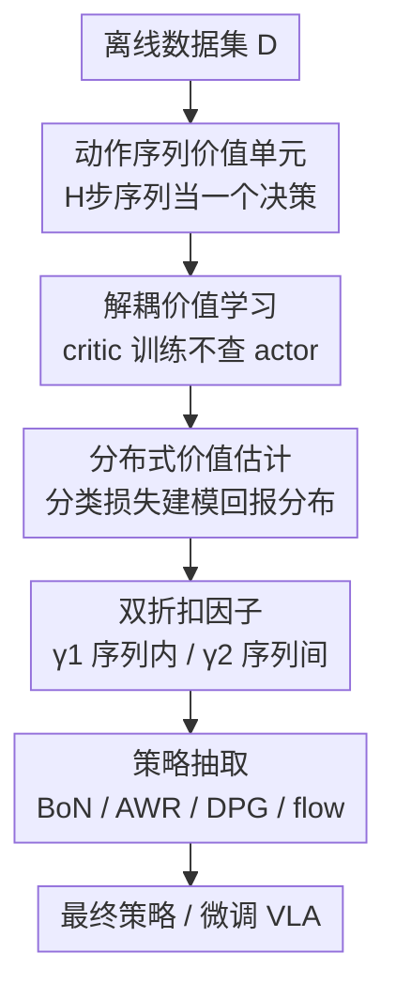

# DEAS: DEtached value learning with Action Sequence for Scalable Offline RL

**会议**: ICLR2026  
**OpenReview**: [https://openreview.net/forum?id=bVTaAXeBmE](https://openreview.net/forum?id=bVTaAXeBmE)  
**代码**: https://changyeon.site/deas （项目页，含开源实现）  
**领域**: 强化学习 / 离线RL / 机器人  
**关键词**: 离线强化学习, 动作序列, 解耦价值学习, 价值高估, VLA微调

## 一句话总结
DEAS 把「连续 H 步动作」当作价值函数的输入单元来做离线 RL，从而像 n-step TD 一样压缩有效规划视野；为了避免动作空间膨胀带来的价值高估，它用 IQL 式的「解耦价值学习」（critic 训练完全不依赖 actor）+ 分类式分布价值估计 + 双折扣因子来稳住训练，在 OGBench 长视野任务上大幅超过 FQL/Q-Chunking 等基线，并能直接挂到 GR00T、π0 这类大规模 VLA 上提升真机操作成功率。

## 研究背景与动机

**领域现状**：离线 RL 让我们从静态数据集学策略，不用在线交互、也不必采集昂贵的专家示范，很有吸引力。但主流方法大多只在短视野、稠密奖励的任务上验证过。近期工作（Park et al. 的 OGBench 系列）指出：要在复杂长视野任务上成功，关键是**缩短有效规划视野**——也就是缩短智能体必须往前规划的时间跨度，办法是在价值和策略学习里用大 $n$ 的 n-step TD 更新 + 分层策略。

**现有痛点**：这条「缩短视野」的路线目前严重依赖**目标条件 RL**（goal-conditioned），需要外部显式给定专家目标，而现实里目标往往拿不到。一旦没有显式目标，标准 RL 里把 $n$ 调大会引入额外的偏差和 bootstrap 误差，反而掉点。另一条直觉的路是直接用**动作序列**（behavior cloning 里早已证明序列能捕捉单步动作抓不到的时序依赖），但把动作序列塞进标准 actor-critic 框架会触发**严重的价值高估**：actor 会在被拉宽的动作空间里去最大化 critic 那些本就不准的估计，离线场景下分布漂移又把外推误差进一步放大。

**核心矛盾**：动作序列能天然带来视野缩短的好处，但「actor 去 exploit critic 的误差」和「序列让动作空间指数膨胀」这两件事叠在一起，让 critic 估值彻底失控。已有的两种妥协都不理想——Q-Chunking 保留了 actor-critic 耦合，高估问题没解决；CQN-AS 干脆把 actor 删掉做纯 value-based，但离散化误差会累积，限制了复杂任务表现，也用不了表达力强的策略类（如 flow/diffusion policy、VLA）。

**本文目标**：在**不需要显式目标**的前提下，用动作序列拿到视野缩短的收益，同时**既避免价值高估、又保持与任意表达力策略架构兼容**。

**切入角度**：作者的关键观察是——高估的根源在于「critic 的训练依赖 actor 的输出」。如果让 critic 的训练目标只朝着**数据集中真实出现过、且高回报**的动作序列收敛，根本不去查询 actor，那 actor 就没机会把误差喂回 critic。

**核心 idea**：用 IQL 式的 in-sample 期望分位回归把 critic 训练与 actor **彻底解耦**（detached value learning），并把价值函数的输入从单步动作换成 H 步动作序列——前者治高估，后者治长视野。

## 方法详解

### 整体框架
DEAS 是一个离线 RL 框架，输入是固定的离线数据集 $D$，输出是一个能在长视野任务上工作的策略 $\pi$（也可以是被微调的 VLA）。它的核心是把价值学习从「单步动作」搬到「H 步动作序列」上：critic $Q(s_t, \mathbf{a}_t;\theta)$ 估计的是从状态 $s_t$ 出发、按数据采集策略执行整段序列 $\mathbf{a}_t := a_{t:t+H-1}$ 的期望回报。整条管线分两块——4.1 把 TD 学习推广到动作序列（拿视野缩短），4.2 用「解耦 + 分布 + 双折扣」三件套把这种序列价值学习稳住（治高估和方差）。最后用任意一种策略抽取方法把价值函数变成可执行策略，因为价值训练全程不查询策略，二者可以完全分开训练。

### 关键设计

**1. 动作序列价值单元：用 H 步序列做决策单位换取视野缩短**

针对「长视野任务里单步动作信息太稀、规划跨度太长」这个痛点，DEAS 把每一段固定长度的 H 步动作序列 $\mathbf{a}_t = (a_t, \dots, a_{t+H-1}) \in A^H$ 当作**一个决策单元**，价值函数定义在序列上 $Q(s, \mathbf{a})$。执行 $\mathbf{a}_t$ 意味着按序施加这 H 个原子动作，收集折扣回报

$$\tilde{R}(s_t, \mathbf{a}_t, \gamma) := \mathbb{E}\Big[\sum_{k=0}^{H-1}\gamma^k R(s_{t+k}, a_{t+k}) \,\big|\, s_t, \mathbf{a}_t\Big],$$

然后跳转到 $s_{t+H}$。TD 更新直接在 $Q(s_t, \mathbf{a}_t)$ 上做、以 $\tilde{R}$ 作多步目标，等价于「每隔 H 步用时序扩展动作做一次决策」。这跟大 $n$ 的 n-step TD 一样压缩了有效视野，但区别在于：序列动作本身就携带了比单步动作更丰富的时序信息，从而**不需要显式目标条件**就能拿到视野缩短的好处，且对 H 步内回报保持无偏估计。消融表明 H=1,2 时方法几乎学不动，必须用足够长的序列（scene/puzzle 用 8、cube 用 4）才有意义。

**2. 解耦价值学习：把 critic 训练从 actor 上摘下来，治价值高估**

这是 DEAS 名字里的 "DEtached"，直击「actor 去 exploit critic 误差」这个高估根源。序列让动作空间膨胀后 critic 更难估准，而耦合的 actor-critic 会让 actor 专挑 critic 高估的区域，恶性循环。DEAS 借鉴 IQL，引入一个 critic $Q(s_t,\mathbf{a}_t;\theta)$ 和一个仅依赖状态的价值网络 $V(s_t;\psi)$，用 in-sample 期望分位回归把 $V$ 朝**数据集内**的高回报序列拉：

$$L_V(\psi) = \mathbb{E}_{(s_t,\mathbf{a}_t)\sim D}\big[L_2^\tau(\bar{Q}(s_t,\mathbf{a}_t;\bar\theta) - V(s_t;\psi))\big],$$
$$L_Q(\theta) = \mathbb{E}\big[(\tilde{R}(s_t,\mathbf{a}_t,\gamma_1) + \gamma_2^H V(s_{t+H};\psi) - Q(s_t,\mathbf{a}_t;\theta))^2\big],$$

其中 $L_2^\tau(u) = |\tau - \mathbb{1}(u<0)|u^2$ 是期望分位损失，取 $\tau>0.5$ 时正误差权重更大，使 $V$ 逼近 in-distribution TD 目标的上分位。关键点在于：**critic 的目标里从头到尾没有 actor 的输出**，actor 没法把误差喂回来，因此即便序列很长也不会高估。附录 E 给了把动作序列纳入解耦价值学习的理论证明。这也带来一个实用副产品——既然价值训练不查策略，最终策略可以用**任意**抽取方法（设计 5）。

**3. 分布式价值估计：用分类损失建模回报分布，压住多步回报的方差**

即使解耦了，当 H 较大时累积回报 $\tilde{R}$ 本身方差就很大，仍会拖累稳定性。DEAS 把 critic 和价值网络都改成**类别分布**形式（distributional RL），在固定支撑 $[v_{\min}, v_{\max}]$ 上离散成 $m$ 个 bin：

$$Q(s,\mathbf{a};\theta) = \mathbb{E}[Z(s,\mathbf{a};\theta)], \quad \hat p_i(s,\mathbf{a};\theta) = \frac{e^{l_i(s,\mathbf{a};\theta)}}{\sum_j e^{l_j(s,\mathbf{a};\theta)}}.$$

价值学习从回归换成**分类**（交叉熵），但保留 IQL 的期望分位加权：

$$L_V(\psi) = \mathbb{E}\Big[-\alpha_t \sum_i \hat p_i(s_t,\mathbf{a}_t;\bar\theta)\log \hat p_i(s_t;\psi)\Big], \quad \alpha_t = \begin{cases}\tau & \bar Q \ge V\\ 1-\tau & \text{否则}\end{cases}$$

目标分布 $p_i$ 取以 Bellman 目标为均值、$\sigma = 0.75\cdot(v_{\max}-v_{\min})/m$ 的截断正态（沿用 Farebrother et al. 的 HL-Gauss）。消融（表 4c）显示：只用分布式（HLG）或只用回归（IQL）都只有有限提升，**两者结合**才把成功率从 63/75 提到 88，说明解耦和分布估计是互补的、缺一不可。

**4. 双折扣因子：用两个 γ 分别管「序列内」和「序列间」的折扣**

长序列回报若用单一折扣容易出现价值爆炸或塌缩。DEAS 拆出两个折扣因子：$\gamma_1$ 折扣 H 步序列**内部**的逐步奖励，$\gamma_2$ 折扣**序列级决策点之间**的回报。TD 目标因此写成 $\tilde{R}(s_t,\mathbf{a}_t,\gamma_1) + \gamma_2^H \max Q(s_{t+H},\cdot)$。作者发现**调小 $\gamma_1$、调大 $\gamma_2$** 能显著稳住训练，且序列越长越关键；论文统一取 $\gamma_1=0.9$、$\gamma_2=0.999$（表 4d 中 $\gamma_1$ 从 0.9 升到 0.99/0.999 会掉 7~8 个点）。直觉上，小 $\gamma_1$ 让序列内的回报尺度可控、避免 H 步求和把数值撑爆，大 $\gamma_2$ 则保证跨决策点的长程信用分配不被过度衰减。

**5. 兼容任意策略抽取：解耦带来的「即插即用」红利**

因为价值训练不查询策略，最终策略 $\pi(s;\phi)$ 可以用任何抽取方法——加权 BC（AWR）、确定性策略梯度（DPG）、best-of-N 采样、flow-matching 等都行。这一点在 VLA 实验里被直接利用：对 GR00T N1.5、π0 这类预测超长动作块（H=16、甚至 50）的大模型，DEAS 用 **best-of-N 采样**——从 VLA 采多个动作序列、选 Q 值最高的那条执行，从而把离线 RL 的价值信号叠加到现成 VLA 上，而不必动 VLA 的策略类。这正是 CQN-AS 那种纯离散 value-based 方法做不到的。

### 损失函数 / 训练策略
训练循环（Algorithm 1）：从 $D$ 采 batch $(s_t, \mathbf{a}_t, R_{t:t+H-1}, s_{t+H})$ → 算 H 步折扣回报 $\tilde R$ → 用式 (7) 更新 $V$、式 (8) 更新 $Q$（均为分类交叉熵）→ 用任意抽取算法更新 actor → 软更新 target critic $\bar\theta \leftarrow (1-\beta)\bar\theta + \beta\theta$。OGBench 上数据规模按难度从 1M 到 100M transition 不等。

## 实验关键数据

### 主实验
OGBench 6 类操作任务（每类 5 个子任务，4 次运行的成功率 %）：

| 任务类别 | #数据 | FQL | N-step FQL | QC-FQL | CQN-AS | DEAS |
|--------|------|-----|-----------|--------|--------|------|
| scene-play | 1M | 50 | 36 | 73 | 1 | **76** |
| cube-double-play | 1M | 14 | 4 | 41 | 2 | **48** |
| puzzle-3x3-play | 1M | 44 | 36 | 62 | 0 | **91** |
| cube-triple-play | 10M | 10 | 23 | 83 | 0 | 82 |
| puzzle-4x4-play | 10M | 32 | 19 | 69 | 0 | **82** |
| cube-quadruple-play | 100M | 17 | 36 | 45 | 0 | **64** |

DEAS 在 6 类里有 5 类拿到最佳，在最难的 puzzle 和 cube-quadruple 上优势最明显。值得注意：N-step FQL 相比 FQL 普遍**掉点**，印证了「无目标条件下盲目加大 n 会引入偏差」；CQN-AS 几乎全线归零，作者归因于纯 value-based 的离散化累积误差 + 在以次优数据为主时的强 BC 正则。

VLA 实验（RoboCasa Kitchen，50 集成功率 %，3 seed）：

| 模型 | 平均成功率 |
|------|----------|
| GR00T N1.5（基座） | 12.0 |
| + Filtered BC | 18.5 |
| + IQL | 20.2 |
| + QC | 17.5 |
| **+ DEAS** | **25.2** |
| π0 + DEAS | 21.8（基座 12.3） |

真机（Franka，pick-and-place，部分成功率 %）：DEAS 平均 78.4，显著高于基座 64.0、IQL 66.3，而 QC 反而掉到 39.6（小数据 + 长序列下不稳）。

### 消融实验
均在 OGBench puzzle-4x4 上（成功率 %）：

| 配置 | 关键指标 | 说明 |
|------|---------|------|
| H=1 / H=2 | 21 / 25 | 单/双步动作几乎学不动，序列是必需 |
| H=8（默认） | 88 | 最优；H=16 需配更大 actor 才能回到 84 |
| 只 IQL（去分布） | 63 | 缺分布式估计 |
| 只 HLG（去解耦） | 75 | 缺解耦 |
| IQL + HLG（完整） | 88 | 两者互补缺一不可 |
| $\gamma_1$=0.9（默认） | 88 | 升到 0.99/0.999 掉到 81/80 |

### 关键发现
- **解耦 + 分布是乘性收益**：单独任一只有 63/75，合起来 88，说明二者解决的是不同问题（高估 vs 方差），不可相互替代。
- **序列长度有甜区**：H=8 最佳，再长（16）需要按比例放大 actor 才能 hold 住增大的动作维度，存在序列长度与算力的 trade-off。
- **价值校准更准**：在 puzzle-4x4 / cube-quadruple 的未见轨迹上，DEAS 的预测 Q 与蒙特卡洛真实回报的校准曲线明显比 QC-FQL 更贴近 $y=x$，直接佐证了「解耦 + 分布」确实压住了高估。
- **对数据质量鲁棒**：把 play 与 noisy 数据按不同比例混合，DEAS 在所有数据质量下都超过 QC-FQL 且校准更好。

## 亮点与洞察
- **「解耦」一招同时解两题**：把 critic 从 actor 上摘下来，既堵死了高估的反馈回路，又顺带让最终策略可以用任意抽取方法——这正是它能直接挂到 VLA 上的前提，思路非常经济。
- **动作序列 = 无目标版的视野缩短**：以往缩短视野要么靠大 n（引偏差）要么靠显式目标（现实拿不到），用动作序列承载时序信息是第三条路，绕开了 goal-conditioning 的硬约束。
- **best-of-N 把离线 RL 接上大 VLA**：不改 VLA 策略类、只用 Q 值给候选动作块打分排序，是一种很轻的「价值制导」方式，对任何会输出多候选的大模型都可迁移。
- **双折扣因子的工程直觉**：序列内小折扣防数值爆炸、序列间大折扣保长程信用，是处理「多步回报尺度」问题的一个干净 trick，可复用到其他 n-step / chunked RL。

## 局限与展望
- **序列长度受 actor 容量制约**：H>8 后必须放大 actor 网络才能维持性能，论文坦承存在序列长度 vs 计算效率的 trade-off，没有给出自适应选 H 的机制。
- **固定 H 的假设**：所有动作被切成等长块，对于子任务时长高度不均的场景，固定 H 可能并非最优切分。
- **仍是纯离线**：方法只在静态数据集上验证，未涉及 offline-to-online 微调；而 Q-Chunking 原本是为 offline-to-online 设计的，两者的适用边界不同。
- **分布式价值的超参敏感**：bin 数 $m$、支撑范围 $[v_{\min}, v_{\max}]$、$\sigma$ 等需要设定，论文未充分分析其敏感性（⚠️ 以原文为准）。

## 相关工作与启发
- **vs IQL**：DEAS 直接建立在 IQL 的 in-sample 期望分位回归之上，区别在于把价值输入从单步动作扩展到 H 步序列，并把回归换成分类式分布估计；继承了 IQL「critic 不查 actor」的解耦精神，但用它来治序列带来的高估。
- **vs Q-Chunking (QC)**：QC 同样用动作 chunk，但**保留了 actor-critic 耦合**，因而在膨胀的动作空间里仍会高估；DEAS 的解耦让它在校准曲线、长视野任务和小数据真机上都更稳（真机上 QC 甚至比基座还差）。
- **vs CQN-AS**：CQN-AS 通过删掉 actor、纯 value-based 来回避高估，但迭代离散化误差累积、用不了表达力强的策略类；DEAS 既避免高估又兼容 flow/VLA 等强策略，在复杂任务上把 CQN-AS 的近零成功率甩开一大截。
- **vs N-step FQL**：两者都想缩短视野，但 N-step FQL 在无目标的标准离线 RL 里加大 n 会引偏差反而掉点，DEAS 用动作序列承载时序信息拿到同样的视野缩短却不掉点。

## 评分
- 新颖性: ⭐⭐⭐⭐ 「解耦 + 动作序列」组合解高估与长视野，思路清晰且证明可挂到大 VLA，但各组件多为已有技术的精巧拼装。
- 实验充分度: ⭐⭐⭐⭐⭐ OGBench 30 任务 + RoboCasa + 真机 Franka + 完整消融 + 校准曲线 + 数据质量鲁棒性，覆盖很全。
- 写作质量: ⭐⭐⭐⭐ 动机推导清楚、图表到位；部分公式记号（如 $\hat R$ 与 $\tilde R$）略有跳跃。
- 价值: ⭐⭐⭐⭐⭐ 给出把离线 RL 接到大规模 VLA 的实用配方，真机验证有效，对机器人离线 RL 落地意义大。

<!-- RELATED:START -->

## 相关论文

- [\[ICLR 2026\] Learning to Reason as Action Abstractions with Scalable Mid-Training RL](learning_to_reason_as_action_abstractions_with_scalable_mid-training_rl.md)
- [\[ICLR 2026\] Recurrent Action Transformer with Memory](recurrent_action_transformer_with_memory.md)
- [\[ICLR 2026\] Beyond Penalization: Diffusion-based Out-of-Distribution Detection and Selective Regularization in Offline Reinforcement Learning](beyond_penalization_diffusion-based_out-of-distribution_detection_and_selective_.md)
- [\[ICLR 2026\] Peng's Q($\lambda$) for Conservative Value Estimation in Offline Reinforcement Learning](pengs_qlambda_for_conservative_value_estimation_in_offline_reinforcement_learnin.md)
- [\[ICLR 2026\] Accelerating Diffusion Planners in Offline RL via Reward-Aware Consistency Trajectory Distillation](accelerating_diffusion_planners_in_offline_rl_via_reward-aware_consistency_traje.md)

<!-- RELATED:END -->
