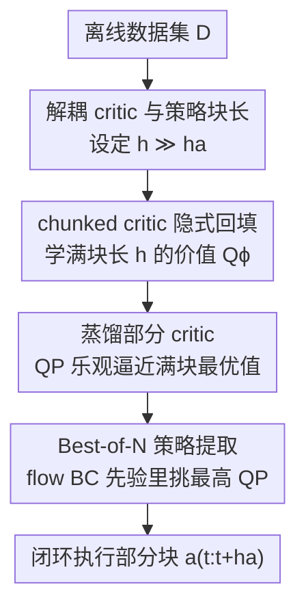

# Decoupled Q-Chunking

**会议**: ICLR2026  
**OpenReview**: [https://openreview.net/forum?id=aqGNdZQL9l](https://openreview.net/forum?id=aqGNdZQL9l)  
**代码**: https://github.com/ColinQiyangLi/dqc  
**领域**: 强化学习  
**关键词**: 离线强化学习、动作分块、时序差分、价值回填偏差、目标条件 RL

## 一句话总结
针对"分块 critic 能加速价值传播、但要求策略一次开环吐出整段动作块、难学又不灵活"的矛盾，本文提出 Decoupled Q-Chunking（DQC）：把 critic 的动作块长度 $h$ 和策略的动作块长度 $h_a$ 解耦（$h_a \ll h$），让策略只预测一小段动作块，并用一个从大 critic 乐观蒸馏出来的"部分 critic"来引导策略，从而既保留分块 critic 的多步价值传播优势、又绕开长动作块策略难学的问题，在 OGBench 最难的长程目标条件任务上稳定超过此前 SOTA。

## 研究背景与动机
**领域现状**：时序差分（TD）方法靠"用自己对下一步的价值预测来回归当前价值"实现高效的离策略学习，是离线 RL 和样本高效在线 RL 的主力。但这种自举（bootstrapping）天生带来 **bootstrapping bias**：单步预测的误差会沿时间步往回累积，在长程、稀疏奖励任务里尤其致命。

**现有痛点**：缓解自举偏差有两条老路，都有硬伤。一是多步回填（n-step return），把回归目标推到更远的未来、等效缩短时间视野，但它要沿着离策略轨迹累加奖励，引入额外的离策略偏差；重要性采样虽然理论上能纠偏，方差却很大，得靠截断等启发式才能数值稳定，难调。二是近期的 **分块 critic（chunked critic）**：直接估计一小段动作序列（"chunk"）$a_{t:t+h}$ 的价值 $Q(s_t, a_{t:t+h})$，天然支持多步回填又没有 n-step 的系统性悲观偏差。

**核心矛盾**：分块 critic 加速了价值学习，却把难题甩给了策略侧——要从分块 critic 里抽出策略，策略必须**一次性开环（open-loop）输出整段长度为 $h$ 的动作块**。块越长，这个动作分布越复杂、越难建模；而且开环执行牺牲了反应性（reactivity），在需要根据环境实时调整的任务里是次优的。换句话说，价值学得快（要大 $h$）和策略学得动、执行得灵活（要小 $h$）之间存在 trade-off。

**本文目标**：拆成两个子问题——(1) 在理论上说清楚分块 critic 的 Q-learning 到底何时收敛、何时该用、闭环执行何时近似最优；(2) 在算法上让策略不必预测整段长动作块，又能吃到大 critic chunk 的价值加速红利。

**切入角度**：作者的关键观察是，critic 的块长和策略的块长**本来就不必相等**。价值传播需要大块长 $h$ 来缩短视野，但策略只需要输出一小段（极端情况下只输出第一个动作）就能闭环执行。只要能把"长块最优动作的前半段"作为策略目标，就能同时拿到两边的好处。

**核心 idea**：解耦 critic 块长 $h$ 与策略块长 $h_a$（$h_a \ll h$），让策略只预测部分动作块；再训练一个**部分 critic** $Q^P$，它从原始分块 critic 乐观地回归，估计"这一小段动作块被补全成完整长块后能达到的最大价值"，用它来引导短策略。

## 方法详解

### 整体框架
DQC 是一套围绕"解耦"展开的离线 RL 流水线。输入是离线数据集 $D$（状态-动作-奖励轨迹段），输出是一个**只预测短动作块** $a_{t:t+h_a}$、闭环执行的策略。整条管线分四步串起来：先在大块长 $h$ 上学一个分块 critic $Q_\phi(s_t, a_{t:t+h})$（享受多步价值回填的加速）；再把这个大 critic **乐观蒸馏**成一个只吃短动作块 $a_{t:t+h_a}$ 的部分 critic $Q^P_\psi$，它逼近"短块被最优补全成长块后的价值"；策略侧不显式建模，而是用一个 flow-matching 行为克隆先验 $\pi_\beta$ 采 $N$ 个候选短块、用 $Q^P_\psi$ 挑分最高的（Best-of-N 提取，IDQL 式）；执行时只走前 $h_a$ 个动作、闭环重规划。核心红利就是：价值学习吃大块长的加速，策略学习只面对短块的简单分布，执行又保留单步策略的反应性。

### 关键设计

**1. 解耦 critic 块长与策略块长：把"价值学得快"和"策略学得动"拆开**

这一步直击核心矛盾。以往方法（如 Q-chunking）让 critic 和策略共用同一个块长 $h$：块长大则价值传播快，但策略要开环吐出整段长块，难学且不灵活；块长小则策略好学，但丢掉了多步回填的加速。DQC 的做法是引入两个独立的块长——critic 用大块长 $h$，策略用小块长 $h_a \ll h$。理论上，作者先把"开环执行同一段动作得到的轨迹分布 $P^\circ_D$ 与数据分布 $P_D$ 的差异"形式化为 **开环一致性（open-loop consistency, OLC）**：若两者在总变差距离下相差不超过 $\varepsilon_h$，则分块 critic 的价值估计偏差被 $\varepsilon_h H \bar{H}$ 这样的量界住（$H=1/(1-\gamma)$、$\bar H = 1/(1-\gamma^h)$ 分别是单步和 $h$ 步的有效视野）。在更强的开环一致性下，分块 Q-learning 能收敛到近最优的分块策略；而**闭环执行**（只执行长块的第一个动作）在"最优性变异度（optimality variability）有界"时还能进一步压低开环带来的次优。这套理论正是"解耦后只闭环执行短块"的合法性来源——它说明短策略 + 大 critic 的组合不会丢掉最优性。

**2. 蒸馏部分 critic：用乐观回归把"短块的潜力"算出来**

光有解耦还不够：策略目标里写的是 $Q_\phi(s_t, [a_{t:t+h_a}, a^\star_{t+h_a:t+h}])$，即"短块拼上最优后半段"的价值，而求 $a^\star_{t+h_a:t+h}=\arg\max_{a_{t+h_a:t+h}} Q_\phi$ 看起来又得学一个长块策略，转了一圈回到原点。DQC 的破解办法是单独学一个**部分 critic** $Q^P_\psi(s_t, a_{t:t+h_a})$，它只吃短块，却用来近似"这一短块被乐观补全成长块后能拿到的最大值"：

$$Q^P_\psi(s_t, a_{t:t+h_a}) \approx Q_\phi(s_t, [a_{t:t+h_a}, a^\star_{t+h_a:t+h}]).$$

训练它用的是**隐式最大化损失**（implicit maximization），即不显式枚举后半段动作，而是对原 critic 做乐观（期望分位 expectile）回归：$L(\psi)=f^{\kappa_d}_{\text{imp}}(\bar Q_\phi(s_t, a_{t:t+h})-Q^P_\psi(s_t, a_{t:t+h_a}))$。期望分位损失 $f^\kappa_{\text{expectile}}(c)=|\kappa-\mathbb{I}_{c<0}|c^2$ 在 $\kappa>0.5$ 时偏向高估，恰好让 $Q^P$ 收敛到"短块潜在最优值"而非平均值。这样策略目标就简化成只对短块的部分 critic 做爬山 $L(\pi)=-\mathbb{E}_{a_{t:t+h_a}\sim\pi}[Q^P_\psi(s_t,a_{t:t+h_a})]$，彻底甩掉了"学长块策略"的负担。消融显示这个蒸馏 critic 是必需的：去掉它（退化成 n-step 或 QC-NS）在多种 $(h,h_a)$ 配置下都掉点。

**3. chunked critic 的隐式价值回填：让大 critic 自己也能稳定地多步自举**

原始分块 critic $Q_\phi(s_t, a_{t:t+h})$ 的 TD 目标需要从下一长块状态出发求 $\max$，而这个 $\max$ 又依赖当前策略（要 Best-of-N 采样），直接算很贵。DQC 借鉴 IQL/IDQL 的**隐式价值回填**：先学一个状态价值 $V_\xi(s_t)$ 去近似部分 critic 的最大值，再用 $V_\xi$ 当回填目标，避免在每步 TD 更新里反复采样。这里选**分位数（quantile）损失** $f^{\kappa_b}_{\text{quantile}}$，原因很巧：Best-of-N 采样取的是 $N$ 个行为 Q 值里的最大序统计量，它估计的正是行为 Q 值分布的 $\frac{N-1}{N}$-分位数，所以把 $\kappa_b=\frac{N-1}{N}$ 设上去，$V_\xi$ 在最优时恰好对齐 Best-of-N 的提取目标（实践中取略小的 $\kappa_b$ 求数值稳定）。这个设计让大块 critic 的学习既稳定又和策略提取在数学上自洽。

**4. Best-of-N 策略提取：不显式建模策略，用行为先验采样挑最优短块**

最后一步是怎么从 $Q^P_\psi$ 抽出可执行策略。DQC 不显式训练参数化策略 $\pi$，而是 IDQL 式地：先用 flow-matching 在离线数据上训一个**行为克隆先验** $\pi_\beta$，执行时从 $\pi_\beta(\cdot|s_t)$ 采 $N$ 个候选短块，再用部分 critic 选分最高的那个

$$a^\star_{t:t+h_a}\leftarrow \arg\max_{\{a^i_{t:t+h_a}\}_{i=1}^N} Q^P_\psi(s_t, a^i_{t:t+h_a}),\quad a^i_{t:t+h_a}\sim\pi_\beta(\cdot|s_t).$$

这等价于在行为分布约束下最大化 $Q^P$（避免分布漂移），又把"短块分布简单"这一好处用满——短块（极端情况下只 1 个动作）远比长块容易被 $\pi_\beta$ 覆盖好。$N=32$ 已足够，再大（如 128）不再涨点；批大小要够大（4096）才稳。

### 损失函数 / 训练策略
三套目标协同：① 分块 critic $Q_\phi$ 用隐式价值回填（quantile，$\kappa_b$）做多步 TD；② 部分 critic $Q^P_\psi$ 用 expectile 乐观回归从 $Q_\phi$ 蒸馏（$\kappa_d$）；③ 行为先验 $\pi_\beta$ 用 flow-matching 训练，执行期 Best-of-N 提取。关键超参：$\kappa_b=0.93,\kappa_d=0.8$（必须带乐观，二者都取 0.5 即无乐观时大幅掉点），$N=32$，batch size 4096。蒸馏选 expectile、回填选 quantile 是经过对比后的最佳组合。

## 实验关键数据

### 主实验
在 OGBench（长程目标条件离线 RL benchmark，含 manipulation 与 locomotion）六个最难环境上，10 个随机种子，报均值与 95% 置信区间。DQC 在几乎所有环境上超过此前 SOTA（SHARSA）及各类基线。

| 任务 | SHARSA(旧SOTA) | NS(n-step) | QC(Q-chunking) | DQC-naïve | DQC(本文) |
|------|------|------|------|------|------|
| cube-triple-100M | 83 | 93 | 20 | 27 | **98** |
| cube-quadruple-100M | 64 | 27 | 35 | 40 | **92** |
| cube-octuple-1B | 34 | 9 | 0 | 3 | **34** |
| humanoidmaze-giant | 19 | 95 | 48 | 80 | 92 |
| puzzle-4x5 | 1 | 93 | 20 | 33 | **96** |
| puzzle-4x6-1B | 64 | 91 | 28 | 33 | 83 |

（数值为成功率 %）。聚合分数（Figure 1）：DQC 82 vs QC 25 vs NS 68 vs SHARSA 44 vs HIQL 18，DQC 明显领先。注意 QC（critic 与策略同块长）在多个任务上崩到很低（如 cube-triple 仅 20、cube-octuple 0），印证了"长块策略难学"这一痛点；DQC-naïve（用 QC 策略预测长块但只执行前 $h_a$ 个动作）虽有改善但仍远不如 DQC，说明问题不在执行而在**策略目标本身**——必须配上蒸馏的部分 critic。

### 消融实验

| 配置 | 关键发现 | 说明 |
|------|---------|------|
| DQC vs 去蒸馏 critic（$h{=}25,h_a{=}1$ 退化为 NS / $h_a{=}5$ 退化为 QC-NS） | DQC 持平或更好 | 蒸馏的部分 critic 是有效性的关键来源 |
| 隐式损失类型（蒸馏×回填的组合） | exp.蒸馏 + quan.回填（本文）最佳 | 对回填方法本身不敏感，但组合有讲究 |
| 乐观参数 $(\kappa_b,\kappa_d)$ | 二者都=0.5（无乐观）大幅掉点 | 只要保留某种乐观即可，乐观是必需的 |
| Best-of-N 的 $N$ | $N=32$ 足够，128 不再涨 | 太小不行，过大无益 |
| batch size | 4096 才稳，256/1024 不行 | 大批量对性能关键 |

### 关键发现
- **贡献最大的是"解耦 + 蒸馏部分 critic"这对组合**：单纯解耦执行（DQC-naïve）不够，去掉蒸馏 critic 也掉点，二者缺一不可。
- **乐观（optimism）不可省**：$\kappa_b=\kappa_d=0.5$ 时性能崩，说明部分 critic 必须乐观地估计"短块的潜力上界"，而非平均值。
- **QC 在长块下崩盘**：直接让策略学长块（QC）在多个任务上接近 0，是 DQC 解耦动机最直接的实证。

## 亮点与洞察
- **"解耦块长"这个观察本身很轻巧却击中要害**：价值传播要大视野、策略执行要小块灵活，以往把两者绑死在同一个 $h$ 上才陷入两难；拆开后只需多学一个部分 critic 就两全。
- **乐观蒸馏把"长块最优补全"问题转化掉**：策略目标里那个 $\arg\max$ 后半段动作本来是死结，用 expectile 隐式最大化的部分 critic 一步绕过，是很可复用的 trick——凡是"对某变量取 max 但又不想显式优化它"的场景都能借鉴。
- **$\kappa_b=\frac{N-1}{N}$ 与 Best-of-N 的对齐很优雅**：把"分位数回归的最优解 = N 个样本最大序统计量的期望"这一统计事实用来对齐价值回填目标与策略提取目标，让两套机制数学自洽，而非各调各的。
- **理论与算法咬合**：开环一致性 + 最优性变异度的分析不是装饰，而是直接论证了"短策略闭环执行长 critic"为何近最优——这给后续做自适应块长的工作铺了路。

## 局限与展望
- **块长固定**：作者承认 $h$ 和 $h_a$ 全程、全状态固定，但最优块长其实可能随状态变化（有些状态需要长程规划、有些只需短反应）；做状态自适应的块长是自然的下一步。
- **聚焦离线 RL**：实验只在 OGBench 离线目标条件任务上验证，在线 / offline-to-online、连续控制以外的场景（如真实机器人、视觉输入）尚未验证。
- **理论假设偏强**：强开环一致性、最优性变异度有界这些条件在真实复杂数据上是否成立、$\varepsilon_h$ 实际多大，论文未给经验测量；近最优保证落地到实践的 gap 仍待量化。
- **依赖行为先验质量**：Best-of-N 提取受限于 $\pi_\beta$ 的覆盖，若行为数据从未访问过最优短块，采样再多也挑不出来——这是离线 RL 的通病，DQC 未额外缓解。

## 相关工作与启发
- **vs Q-chunking（QC, Li et al. 2025b）**：QC 让 critic 与策略共用块长 $h$，吃到了价值加速但策略要学长块，块一长就崩；DQC 解耦 $h$ 与 $h_a$，并用蒸馏部分 critic 让策略只学短块，既保加速又好学——本文可视为 QC 的"策略侧解耦修正"，并补上了 QC 缺失的收敛性理论。
- **vs n-step return（NS）**：NS 用单步 critic + 多步奖励回填，会因离策略轨迹引入系统性悲观偏差，需重要性采样纠偏且方差大；DQC 用分块 critic 避开这种偏差，理论上还给出了"何时分块 critic 优于 n-step"的条件（Proposition 3）。
- **vs SHARSA（Park et al. 2025b，旧 SOTA）**：SHARSA 也走多步回填路线但用单步 critic；DQC 在 OGBench 几乎所有最难环境上反超，聚合分数 82 vs 44。
- **vs IQL/IDQL（Kostrikov 2022 / Hansen-Estruch 2023）**：DQC 的隐式价值回填、expectile/quantile 隐式最大化、Best-of-N 提取均承袭这条线，但把它们从单步价值学习搬到了"分块 critic + 蒸馏部分 critic"的双 critic 框架里。

## 评分
- 新颖性: ⭐⭐⭐⭐⭐ "解耦 critic/策略块长 + 乐观蒸馏部分 critic"是干净且击中要害的新点子，并首次给出分块 Q-learning 的收敛性理论
- 实验充分度: ⭐⭐⭐⭐ OGBench 六个最难环境 10 seeds、消融充分，但仅限离线目标条件任务，缺在线/真实机器人验证
- 写作质量: ⭐⭐⭐⭐⭐ 理论与算法咬合紧密，动机—矛盾—解法链条清晰，符号体系完整
- 价值: ⭐⭐⭐⭐⭐ 把分块 critic 从"块一长就崩"推到能 scale 到长程难任务，且理论铺垫对后续自适应块长有指导意义

<!-- RELATED:START -->

## 相关论文

- [\[ICLR 2026\] Chunking the Critic: A Transformer-based Soft Actor-Critic with N-Step Returns](chunking_the_critic_a_transformer-based_soft_actor-critic_with_n-step_returns.md)
- [\[ICLR 2026\] AutoTool: Automatic Scaling of Tool-Use Capabilities in RL via Decoupled Entropy Constraints](autotool_automatic_scaling_of_tool-use_capabilities_in_rl_via_decoupled_entropy_.md)
- [\[ICLR 2026\] Beyond Penalization: Diffusion-based Out-of-Distribution Detection and Selective Regularization in Offline Reinforcement Learning](beyond_penalization_diffusion-based_out-of-distribution_detection_and_selective_.md)
- [\[ICLR 2026\] Recurrent Action Transformer with Memory](recurrent_action_transformer_with_memory.md)
- [\[ICLR 2026\] ADM-v2: Pursuing Full-Horizon Roll-out in Dynamics Models for Offline Policy Learning and Evaluation](adm-v2_pursuing_full-horizon_roll-out_in_dynamics_models_for_offline_policy_lear.md)

<!-- RELATED:END -->
