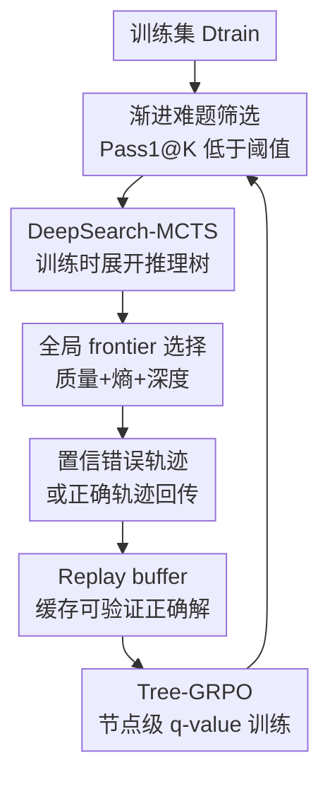

# DeepSearch: Overcome the Bottleneck of Reinforcement Learning with Verifiable Rewards via Tree-based Search

**会议**: ICLR2026  
**OpenReview**: [https://openreview.net/forum?id=Kx0G6v2c2S](https://openreview.net/forum?id=Kx0G6v2c2S)  
**代码**: https://github.com/smiles724/DeepSearch  
**领域**: 强化学习 / RLVR / LLM推理  
**关键词**: 可验证奖励, 蒙特卡洛树搜索, 训练时搜索, 数学推理, Tree-GRPO  

## 一句话总结
DeepSearch 把 MCTS 从推理阶段前移到 RLVR 训练循环中，用全局 frontier 选择、置信错误轨迹监督和 replay buffer 缓存来提升数学推理模型的探索效率，在 1.5B 模型上以 62.95% 平均准确率超过延长训练基线，并显著减少 GPU 开销。

## 研究背景与动机
**领域现状**：LLM 数学推理近两年的主线之一，是用 reinforcement learning with verifiable rewards（RLVR）让模型从可自动判分的答案中学习。对数学题来说，最终答案可以用规则 verifier 检查，因此 DAPO、GRPO、DeepScaleR、ProRL 这类方法可以不用人工偏好标注，直接用 outcome reward 训练模型。另一条并行路线是 test-time compute scaling：推理时采样更多 chain-of-thought、用 verifier 或 reward model 过滤，甚至用 Tree-of-Thought / MCTS 在多条推理路径之间搜索。

**现有痛点**：这两条路线有一个明显断裂：RLVR 训练时通常依赖有限 direct rollouts，推理时才用结构化搜索。训练阶段的采样因此很稀疏，模型往往反复看到高概率但低多样性的路径；如果当前策略从一开始就绕不开某个错误推理模式，继续增加训练步数只会在相似分布里多采样几次。论文把这种现象称为 RLVR 的训练 plateau：花更多 compute 做更长 RL，收益却快速变小。

**核心矛盾**：RLVR 的 reward 虽然可验证，但 reward 本身很稀疏；模型需要学会多步搜索式推理，却很少在训练中看到“搜索如何展开、哪些中间步骤通向正确答案、哪些高置信错误应该被纠正”。如果只在终点给 $+1/-1$，中间步骤的 credit assignment 很粗；如果只靠 direct rollout，很多深层 reasoning frontier 根本不会被访问。

**本文目标**：DeepSearch 试图同时解决三个子问题：第一，训练时要比 direct rollout 覆盖更多候选推理分支；第二，要把 verifier 的终点奖励回传到中间推理节点，让模型知道哪段前缀有价值；第三，搜索不能贵到无法用于 RL 训练，所以需要把 MCTS 预算集中在真正难、尚未解出的样本上。

**切入角度**：作者的观察是，test-time MCTS 已经证明结构化探索能帮助推理，但如果只把它当推理增强器，模型本身并没有从搜索过程里学习。于是 DeepSearch 把 MCTS 嵌入训练数据生成过程：每轮对 hard problems 建树，找正确轨迹或信息量高的错误轨迹，再用 tree-level q-value 训练策略模型。

**核心 idea**：用训练时 MCTS 代替单纯 direct rollout，让 RLVR 从“多采样终点”变成“系统探索推理树并学习中间节点价值”。

## 方法详解

### 整体框架
DeepSearch 的输入是一道可验证的数学题 $x$ 和当前策略模型 $\pi_\theta$，输出不是一条普通 rollout，而是一棵由逐步推理节点组成的 MCTS search tree。每个节点对应一段中间 reasoning step，终端节点由 verifier 判断正确、错误或未完成；树上得到的轨迹会进入 Tree-GRPO 训练，下一轮再用更新后的策略重新筛 hard subset。

整体流程可以理解为“筛难题 → 对未解题做 MCTS → 把搜索树转成训练信号 → 缓存已找到的正确解 → 更新策略”。其中 MCTS 不是经典 root-to-leaf UCT 的照搬，而是局部 sibling 比较用 UCT，全树下一步扩展用 global frontier score；训练也不是只看最终 outcome reward，而是用启发式 backup 给中间节点分配 q-value。

### 关键设计
**1. 训练时 DeepSearch-MCTS：把 RLVR 的探索从终点采样改成树搜索**

传统 RLVR 对一个问题 $x$ 采样若干完整答案，然后用 verifier 给每条轨迹一个 outcome reward。DeepSearch 把这个过程拆成树：根节点是问题，子节点是模型在当前前缀 observation $o_i=x\oplus s_1\oplus\cdots\oplus s_{i-1}$ 下生成的下一步 $s_i$，一条根到叶路径 $t=x\oplus s_1\oplus\cdots\oplus s_{end}$ 就是一条候选解。终端节点用 $V(s)\in\{0,1\}$ 判分，正确为 $+1$，错误或未完成为 $-1$。

这个设计的关键不是“用了 MCTS”四个字，而是把 MCTS 的中间状态暴露给训练。direct rollout 只告诉模型“整条答案对不对”，但树搜索会留下哪些前缀被扩展、哪些分支后来通向正确解、哪些分支一直错误。这样 verifier 的稀疏信号可以沿树回传到 reasoning step，训练样本也从若干条孤立答案变成带结构的探索记录。

**2. 全局 frontier 选择：不再反复从根走局部最优分支**

经典 MCTS 常用 UCT 从根节点一层层选到叶子，这对游戏树很自然，但在 LLM reasoning 里会浪费很多重复 traversal，也容易被局部看起来不错的子树吸住。DeepSearch 保留 UCT 做 sibling comparison，也就是同一父节点下生成多个候选 step 时，用 $Q(s)+\lambda\sqrt{\ln N_{parent}(s)/N(s)}$ 比较兄弟节点；但下一轮要扩展哪里，则直接在全树 frontier 集合里选。

论文定义 frontier 为 $F=\{s\in T\mid \xi(s)=0, s\notin S_{end}, d(s)<d_T\}$，也就是还没扩展、不是终点、深度没到上限的叶节点。每个 frontier 节点的优先级是：

$$
F(s)=\lambda_1\tanh(Q_{parent}(s))+\lambda_2 H(\pi_\theta(s\mid o_s))+\lambda_3D(d(s)).
$$

三项分别代表父节点质量潜力、策略熵引导和深度奖励。$\tanh$ 把可能为负的 $Q$ 平滑压到 $[-1,1]$，避免极端 q-value 支配搜索；$H(\pi_\theta)$ 让算法可以选择更不确定或更确定的区域；$D(d(s))=\sqrt{d(s)/d_T}$ 鼓励搜索走到更深的推理链。这样做的实际意义是：训练预算不再被固定的 root-to-leaf 过程绑架，而是每次都问“当前整棵树里，哪个未展开前缀最值得继续花 compute”。

**3. 置信错误轨迹和非对称 q-value backup：把错误也变成有用监督**

MCTS 展开一轮后，如果找到了正确终端节点，DeepSearch 会把正确轨迹用于回传；如果没有找到正确解，它不会随便挑一条错误轨迹，而是选择平均熵最低的错误终端：

$$
s^*_{neg}=\arg\min_{s\in S^{(k)}_{incorrect}} \bar H(t(s)),\quad
\bar H(t(s))=\frac{1}{|t(s)|}\sum_i H(\pi_\theta(s_i\mid o_i)).
$$

低熵错误的含义是模型很自信地走错了。相比随机错误或高熵错误，这类轨迹更像系统性误区：模型不是犹豫，而是稳定地相信某个错误推理路径。把它纳入监督，能更直接纠正当前 policy 的坏习惯。

回传时，终端 reward 按深度衰减给路径上的节点，深处节点权重大，因为它更接近最终结论。论文用 $\gamma(i,l)=\max(i/l,\gamma_{min})$，其中 $l$ 是终端节点位置，$\gamma_{min}=0.1$。更重要的是它采用非对称更新：如果一个节点曾经出现在正确轨迹中，就保持非负；如果它之前为负但后来出现在正确轨迹中，就用正值覆盖；如果它已经为正，后续偶然错误不再把它拉负。这相当于把“曾证明可通向正确解的前缀”和“目前只观察到通向死路的前缀”区分开，减少随机扩展失败对有价值节点的破坏。

**4. Adaptive training 与 Tree-GRPO：把 MCTS 预算用在真正难的样本上**

对每个训练样本都完整跑 MCTS 会非常贵，所以 DeepSearch 先用 Pass1@K 筛 hard subset。初始策略 $\pi_{\theta^{(0)}}$ 在训练集上做 $K=4$ 次 direct rollout，若 $Pass1@K(x,\pi)<\delta$，就把 $x$ 放入 $D^{(0)}_{hard}$；每轮训练后再筛一次，只保留当前模型仍解不稳的题。论文默认阈值约为 25%，目的不是设计复杂 curriculum，而是把已掌握的问题从高成本 MCTS 流程中剔除。

Replay buffer 负责保存 MCTS 已经找到的正确轨迹。如果某题已有缓存解，下一轮不再完整跑 MCTS，而是使用 $t_{cached}$ 加少量 direct rollouts；如果没有缓存，才执行 full MCTS。论文把这个策略写成：

$$
Rollout(x)=
\begin{cases}
 t_{cached}\cup DirectRollouts(x,\beta), & (x,t_{cached})\in R^{(i)},\\
 MCTS_{full}(x), & otherwise.
\end{cases}
$$

训练目标是 Tree-GRPO。它先对中间节点 q-value 做 soft clipping，$q(s_j)=\tanh(q^{(k_{max})}(s_j)/\epsilon_q)\cdot q_{max}$，防止多次 backup 后数值爆炸；再用 PPO/GRPO 风格的 ratio clipping 优化 token-level policy。优势函数不是简单终点 reward，而是节点 q-value 减去整棵树终端节点平均奖励 $\mu_t$：$\hat A_{j,k}=q(s_j)-\mu_t$。因此模型可以在同一条长推理里区分“这个中间步骤更像正确路径”还是“这个步骤虽然还没到终点，但已经在走偏”。

### 一个完整示例
假设一道数学题在当前模型下直接采样 4 次只对了 0 次，低于 $\delta=25\%$，它会进入 hard subset。DeepSearch 首先从题目根节点生成若干第一步推理，比如“代数化”“枚举”“几何构造”等候选；局部 UCT 选出较好的兄弟节点接入树，随后用 global frontier score 在整棵树所有未展开前缀中挑下一处扩展。

如果一条分支走到最终答案且 verifier 判对，这条根到叶轨迹被标成正确解，并把正 reward 依深度回传给沿途节点；如果这一轮所有终端都错，算法会找平均 token entropy 最低的一条错误解。比如模型非常自信地套用了错误恒等式，整条路径 entropy 很低却被 verifier 判错，这就会被当作“最该纠正的负例”回传。若这道题之后找到了正确解，它的正确轨迹进入 replay buffer；下一轮训练时，这道题不再每次完整跑树，而是复用 cached solution，并补少量当前策略的 direct rollouts 检查是否遗忘。

### 损失函数 / 训练策略
DeepSearch 基于 Nemotron-Research-Reasoning-Qwen-1.5B v2 初始化，使用 DeepMath-103K 作为训练集，在 veRL 框架里训练。MCTS 最大深度设为 64，原因是响应长度预算 16,384 tokens、每个节点扩展 256 tokens，近似得到 $16384/256\approx64$。每次扩展 8 个 children，UCT 局部探索系数设为 2.0；global frontier 默认使用 $\lambda_1=0.4, \lambda_3=0.01$ 和 $D(d)=\sqrt{d/d_T}$。

优化侧使用 AdamW，学习率 $1\times10^{-6}$，global batch size 为 256，训练阶段使用 16 张 H100 96GB，评估用 128 张 H100 96GB。Tree-GRPO 继承 DAPO 的 Clip-Higher 策略，低/高 clipping threshold 分别为 0.2 和 0.28，去掉 KL 正则，并对超过 4096 的过长 buffer 施加 penalty。评估时使用 temperature 0.6、top-p 0.95，主表报告 $n=32$ samples 下的 Pass1@1。

## 实验关键数据

### 主实验
论文在 6 个数学推理 benchmark 上比较 1.5B 级模型，包括 AIME 2024/2025、AMC2023、MATH500、Minerva 和 Olympiad。DeepSearch-1.5B 在所有 benchmark 上都超过初始化模型 Nemotron-Research-Reasoning-Qwen-1.5B v2，平均准确率从 61.70% 提升到 62.95%。

| 模型 | AIME24 | AIME25 | AMC23 | MATH | Minerva | Olympiad | Avg |
|------|--------|--------|-------|------|---------|----------|-----|
| DeepSeek-R1-Distill-Qwen-1.5B | 31.15 | 24.06 | 72.81 | 85.01 | 32.18 | 51.55 | 49.46 |
| DeepScaleR-1.5B | 38.54 | 30.52 | 80.86 | 88.79 | 36.19 | 58.95 | 55.64 |
| Nemotron-Research-Reasoning-Qwen-1.5B v1 | 45.62 | 33.85 | 85.70 | 92.01 | 39.27 | 64.56 | 60.17 |
| Nemotron-Research-Reasoning-Qwen-1.5B v2 | 51.77 | 32.92 | 88.83 | 92.24 | 39.75 | 64.69 | 61.70 |
| DeepSearch-1.5B | **53.65** | **35.42** | **90.39** | **92.53** | **40.00** | **65.72** | **62.95** |

效率对比更能体现本文观点：单纯延长 DAPO 训练在 1,875 additional steps 后平均只有 62.02%，而 DeepSearch 只额外训练 50 steps，就达到 62.95%。它使用约 330 GPU hours，比 1,883.2 GPU hours 的 extended training 省了约 5.7 倍资源。

| 方法 | RLVR | 额外步数 | GPU Hours | Math Score |
|------|------|----------|-----------|------------|
| DeepSeek-R1-Distill-Qwen-1.5B | - | - | - | 49.46 |
| Nemotron-Research-Reasoning-Qwen-1.5B v1 | DAPO | 2000 | 16000 | 60.10 |
| Nemotron-Research-Reasoning-Qwen-1.5B v2 | DAPO | 3000 | 24000 | 61.70 |
| Extended Training | DAPO | +325 | 326.4 | 61.78 |
| Extended Training | DAPO + KL | +785 | 788.8 | 62.08 |
| Extended Training | DAPO + KL | +1875 | 1883.2 | 62.02 |
| DeepSearch-1.5B | Tree-GRPO | +50 | **330** | **62.95** |

### 消融实验
组件演进表显示，简单把 MCTS 接进来并不自动有效，Vanilla DeepSearch 甚至低于基线；真正带来收益的是新的 q-value update、节点级 advantage normalization，以及最终的 frontier selection。最后一步加入 frontier selection 后，平均分从 62.32% 提升到 62.95%，是完整方法达到 SOTA 的关键。

| 配置 | Avg | 说明 |
|------|-----|------|
| Nemotron-Research-Reasoning-Qwen-1.5B v2 | 61.70 | 初始化 RLVR 模型 |
| + Vanilla DeepSearch | 60.27 | 简单 q-update 的 MCTS 集成，效果不稳定 |
| + New q Update & Coarse-grained Token Scores | 61.38 | 使用新 backup，但仍是 outcome 级 token score |
| + New q Update & Fine-grained Token Scores | 61.85 | 节点级 q-value 改善 credit assignment |
| + Standard Advantages Normalization | 62.27 | 标准归一化进一步稳定训练 |
| + Mean-only Advantages Normalization | 62.32 | 均值归一化缓解 GRPO miscalibration |
| + Frontier Selection | **62.95** | 全局 frontier 选择带来最终提升 |

搜索策略消融进一步说明为什么要全局选择 frontier。相比 vanilla UCT，global frontier selection 在保持相似深度和 entropy 的同时，把平均迭代数从 209.6 降到 187.7，并把轨迹 reward 从 -0.82 提高到 -0.65。不同深度奖励里，线性 $d(s)$ 最省时但 reward 变差，$\sqrt{d(s)/d_T}$ 提供了较好的效率-质量平衡。

| 搜索配置 | 深度 | Entropy | Reward | Num. Iter. | Time Per Tree |
|----------|------|---------|--------|-----------|---------------|
| Vanilla UCT | 20.11 | 1.23 | -0.82 | 209.6 | 1179.6s |
| Global Frontier, $\lambda_1=0.4$ | 20.28 | 1.23 | -0.65 | 187.7 | 1087.7s |
| + $D(d)=d(s)$ | 21.55 | 1.24 | -0.76 | 85.7 | 480.9s |
| + uncertainty + $\sqrt{d/d_T}$ | 20.83 | 1.31 | -0.79 | 92.5 | 505.2s |
| default $\sqrt{d/d_T}$ | 20.29 | 1.24 | -0.65 | 189.3 | 1070.7s |

### 关键发现
- DeepSearch 的收益不是来自更长训练，而是来自更高质量的训练时探索。Extended Training 的 GPU hours 从 326.4 增到 1883.2，分数只从 61.78 到 62.02；DeepSearch 用约同等于最短 extended training 的成本达到 62.95%。
- “最自信的错误”比随机错误或最不自信错误更有训练价值。选择 lowest-entropy incorrect trajectory 的平均分是 62.95，高于 random incorrect 的 62.09，也高于 least confident incorrect 的 61.90。
- Replay buffer 确实逐轮减少重复搜索。附录显示 cached problems 从第 1 轮的 0 增至第 5 轮的 2894，占 hard subset 的 33.2%；unsolved problems 从 13658 降到 5829，说明 MCTS 预算逐渐集中到尾部难题。
- profiling 显示 CPU 侧 MCTS 逻辑几乎不是瓶颈，per-tree runtime 超过 99% 来自 policy inference / generation。这意味着后续优化更可能来自 batching、KV-cache 复用或 speculative decoding，而不是把树搜索代码再微调几个毫秒。

## 亮点与洞察
- 最重要的洞察是把 search 当成训练数据生成机制，而不是推理时外挂。这样模型不仅能在 test-time 依赖搜索，还能在训练中学到“哪些前缀值得扩展”和“哪些自信错误需要避免”。
- 全局 frontier selection 很朴素但抓住了 LLM MCTS 的实际痛点：推理树不是棋类游戏那种规则清晰、转移便宜的状态空间，每次从根重复 traversal 都很贵。直接比较全树未展开叶子，能把预算更快挪到有信息量的前缀。
- lowest-entropy negative selection 是一个可迁移 trick。很多 RLVR 或 verifier-based 训练都只关注 correct samples，但对模型而言，最危险的往往是高置信错误；把这些轨迹显式纳入训练，有点像自动挖 hard negative。
- 非对称 q-value backup 的设计很符合推理任务：一个中间步骤如果曾经通向正确解，就不应因为别的后续展开失败而被完全否定。这比把每次终点 reward 平均到所有前缀更稳，也更接近“前缀本身可复用，后续展开可能失败”的真实情况。
- 论文也提醒了一个更广的方向：RLVR 的瓶颈不一定是 reward 不够好或训练不够久，也可能是 exploration interface 太弱。把算法搜索、缓存和课程式 hard filtering 放进训练环节，可能比单纯堆 GPU 更划算。

## 局限与展望
- 当前验证主要集中在数学推理。数学题有清晰答案 verifier，DeepSearch 的 MCTS 和 replay buffer 都依赖这个条件；如果迁移到开放式写作、对话、代码设计或多模态任务，需要近似 verifier、人类反馈或其他过程验证机制。
- 方法仍然有明显推理生成成本。虽然相对 extended training 更省 GPU hours，但每棵 MCTS tree 的主要耗时是 policy generation，且训练时要维护树、缓存和 hard subset。对更大模型或更长任务，工程复杂度会继续上升。
- Frontier priority 仍是手工启发式，$\lambda_1,\lambda_2,\lambda_3$、深度奖励和扩展宽度都来自离线选择。论文也指出，未来可以学习这些搜索组件，但那会变成类似 AlphaZero controller 的联合优化问题。
- 实验使用 1.5B 级模型，结论能否等比例迁移到 7B、32B 或更大 reasoning model 还需要验证。大模型 direct rollout 本身可能更强，MCTS 的边际收益和成本曲线未必相同。
- 训练目标依赖显式 reasoning trace 和较长输出。对于不希望暴露长 chain-of-thought、或者需要短答案高吞吐的应用，训练时搜索带来的行为变化还需要额外评估。

## 相关工作与启发
- **vs DAPO / GRPO 式 RLVR**: DAPO 类方法主要从多条 direct rollouts 的 outcome reward 学习，DeepSearch 则把 rollout 组织成搜索树，并给中间节点分配 q-value。优势是探索覆盖和 credit assignment 更细，代价是训练数据生成更复杂。
- **vs DeepScaleR / ProRL prolonged training**: prolonged RL 的方向是继续加训练步数和采样预算，DeepSearch 的方向是改变每一步训练看到的数据结构。实验上它用 50 额外步数超过 1875 步 extended training，说明在 plateau 区间算法效率比训练深度更关键。
- **vs Tree-of-Thought / inference-time MCTS**: 这些方法多在推理时搜索，模型参数本身不一定学习搜索过程。DeepSearch 把搜索结果回灌到 policy training，让 test-time search 的思想变成 training-time supervision。
- **vs AlphaGo 式 policy + MCTS**: 两者都把策略模型和树搜索结合，但 DeepSearch 面对的是自然语言推理轨迹，状态和动作都由文本生成，reward 也来自答案 verifier。它借鉴 MCTS 的结构，却必须重新设计 frontier selection、entropy negative 和 Tree-GRPO 来适配 LLM。
- **对后续研究的启发**: 可以尝试把 DeepSearch 的 hard-negative 选择用于代码 RL、定理证明、工具调用 agent；也可以把 replay buffer 扩展成跨题型的 solution memory，让模型复用可验证推理模板，而不是只缓存单题答案。

## 评分
- 新颖性: ⭐⭐⭐⭐⭐ 把 MCTS 系统性嵌入 RLVR 训练循环，并配套 frontier selection、置信错误轨迹和 Tree-GRPO，方向很清晰。
- 实验充分度: ⭐⭐⭐⭐ 覆盖主结果、效率、搜索策略、组件演进和定性案例；但主要限于数学推理和 1.5B 模型。
- 写作质量: ⭐⭐⭐⭐ 论文结构清楚，公式和算法图比较完整；个别 q-value 更新解释需要结合附录读才完全顺。
- 价值: ⭐⭐⭐⭐⭐ 对 RLVR plateau 给出了比“继续加步数”更有算法含量的解法，尤其适合作为训练时搜索与 verifier-based RL 结合的参考。

<!-- RELATED:START -->

## 相关论文

- [\[ICLR 2026\] Lookahead Tree-Based Rollouts for Enhanced Trajectory-Level Exploration in Reinforcement Learning with Verifiable Rewards](lookahead_tree-based_rollouts_for_enhanced_trajectory-level_exploration_in_reinf.md)
- [\[ICLR 2026\] RLVER: Reinforcement Learning with Verifiable Emotion Rewards for Empathetic Agents](rlver_reinforcement_learning_with_verifiable_emotion_rewards_for_empathetic_agen.md)
- [\[ICLR 2026\] LongRLVR: Long-Context Reinforcement Learning Requires Verifiable Context Rewards](longrlvr_long-context_reinforcement_learning_requires_verifiable_context_rewards.md)
- [\[ICLR 2026\] Rubrics as Rewards: Reinforcement Learning Beyond Verifiable Domains](rubrics_as_rewards_reinforcement_learning_beyond_verifiable_domains.md)
- [\[ICLR 2026\] RLVMR: Reinforcement Learning with Verifiable Meta-Reasoning Rewards for Robust Long-Horizon Agents](rlvmr_reinforcement_learning_with_verifiable_meta-reasoning_rewards_for_robust_l.md)

<!-- RELATED:END -->
