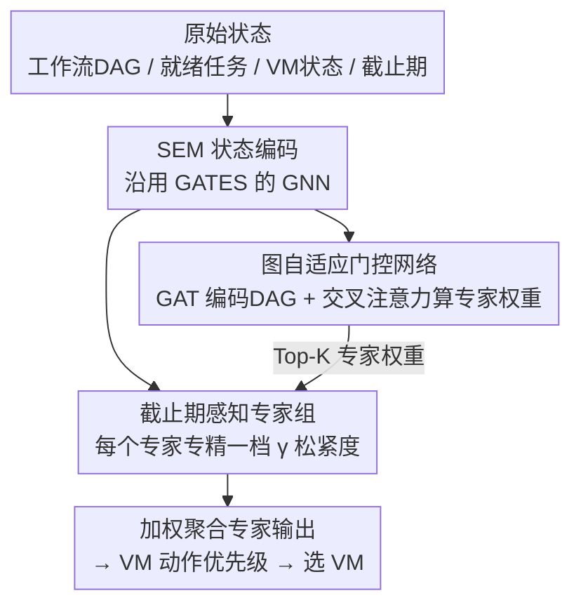

# Deft Scheduling of Dynamic Cloud Workflows with Varying Deadlines via Mixture-of-Experts

**会议**: ICLR2026  
**OpenReview**: [https://openreview.net/forum?id=yVFOdLjd7V](https://openreview.net/forum?id=yVFOdLjd7V)  
**代码**: https://github.com/yashenCS/DEFT  
**领域**: 强化学习 / 云工作流调度  
**关键词**: 混合专家、深度强化学习、云工作流调度、截止期感知、图自适应门控

## 一句话总结
DEFT 把混合专家（MoE）架构第一次引入动态云工作流调度，用一组各自专精不同"截止期松紧档"的专家替换掉传统 DRL 调度器里那个单路前馈策略头，再配一个能读懂工作流 DAG 结构与截止期紧迫度的图自适应门控网络做逐步路由，在大规模场景下把总调度成本相比 SOTA 降了近 30%。

## 研究背景与动机
**领域现状**：云计算里大量应用是由相互依赖的任务组成的工作流，天然建模成有向无环图（DAG），每个工作流带一个 SLA 截止期，违约要罚钱。把这种"成本感知动态工作流调度"（Cost-Aware Dynamic Workflow Scheduling, CADWS）问题交给深度强化学习（DRL）来解，已经成为主流——把调度器建模成一个与环境交互的智能体，让它在动态变化的虚拟机（VM）资源池上为每个就绪任务选一台 VM，目标是最小化"VM 租费 + 截止期违约罚金"的总成本。近年的 DRL 调度器（如 SPN-CWS 的 Transformer 策略、GATES 的 GNN 策略）已经明显超过传统启发式方法。

**现有痛点**：这些 DRL 调度器的策略网络通常拆成两块——状态嵌入模块（SEM，把原始环境状态编码成嵌入）和优先级映射模块（PMM，把嵌入映射成各 VM 动作的优先级）。学界的注意力几乎都花在 SEM 怎么设计上，PMM 则几乎一律是**一个固定的前馈网络（FFN）**，走的是一条单一、僵硬的推理通路。训练完之后，这条通路对所有调度场景一视同仁地套用同一套决策规则。

**核心矛盾**：可现实里工作流的截止期松紧差异极大——有的非常宽松（可以拖着用便宜慢 VM 省钱），有的极度紧迫（必须立刻上最快 VM 抢时间）。一条固定推理通路根本没法同时把这两端都伺候好：它要么偏保守（紧任务容易违约），要么偏激进（松任务白白多花 VM 钱）。这种"缺乏截止期感知能力"的单路架构，在时间压力跨度大的场景里就是天花板。

**本文目标**：让策略网络能根据每个决策步当下的工作流紧迫度，**自适应地切换**不同的推理行为，而不是一套规则走到底。

**切入角度**：作者借鉴大模型里的混合专家（MoE）思想——既然单个专家覆盖不了整个截止期谱系，那就训练一组专家、每个专精一档松紧度，再用门控按需激活。关键观察是：调度里"该激活哪个专家"不能只看一个标量紧迫度，得读懂工作流的 DAG 拓扑、当前任务在图中的位置、以及 VM 状态，所以门控必须是"图自适应"的。

**核心 idea**：用一组截止期专精的专家替换单路 PMM，并用一个融合 DAG 结构与截止期紧迫度的图自适应门控网络做逐步专家路由，让调度策略随工作流紧迫度细粒度地动态调制。

## 方法详解

### 整体框架
DEFT 是一个用来**替换 DRL 调度器策略网络中 PMM 那一块**的新结构，整条调度管线的骨架（SEM 状态编码、与环境交互、按优先级选 VM）沿用了 SOTA 方法 GATES：SEM 仍是 GATES 的 GNN，负责把原始的工作流/VM 状态编码成状态嵌入。DEFT 的改造在于：原来由单个 FFN 充当的 PMM，被换成"一组专家（MoE）+ 一个图自适应门控网络"。

在每个决策步，流程是这样转的：环境给出当前就绪任务、工作流 DAG、各 VM 状态 → SEM 编码出状态嵌入 → 图自适应门控网络读入 DAG 结构、就绪任务特征、VM 状态和截止期紧迫度，算出一组对各专家的权重 → 被选中的 Top-K 专家分别把状态嵌入映射成 VM 动作优先级 → 按门控权重加权聚合，得到最终各 VM 的优先级，选出动作。整套策略用进化策略 OpenAI-ES 训练，并采用"先单独预训专家、再联合训门控"的两阶段方案。

### 关键设计

**1. 截止期感知专家组：用一群"分工"的专家替换一条"全能"的单路 PMM**

针对单路 FFN 没法同时照顾松/紧两端的痛点，DEFT 把 PMM 拆成一组轻量 MLP 专家，并且让每个专家明确绑定一个"截止期松紧档"。具体地，截止期由松弛系数 $\gamma$ 控制：每个工作流 $W_i$ 的截止期定义为 $d_i = a_i + \gamma \cdot \text{minMakespan}(W_i)$，其中 $a_i$ 是到达时间，$\text{minMakespan}(W_i)$ 是给每个任务都配最快 VM、无任何延迟时能达到的最短完成时间，$\gamma \ge 1$ 越小截止期越紧。作者取一组离散的 $\gamma \in \{1.25, 1.75, 2.25, 5.0\}$，为每档实例化一个专家 $\text{EXP}_i$，并**只用该 $\gamma$ 生成的工作流**去单独预训它。这样每个专家学到的就是针对某一紧迫度的最优行为——紧档专家学"尽早激进调度"，松档专家学"容忍延迟、省 VM 钱"。这与单纯"把 FFN 加深加宽"有本质区别：消融里把 GATES 的 PMM 换成更深的 MLP，几乎没涨点（见 Table 3），说明收益来自"逐步挑选专精策略"而非堆容量。

**2. 图自适应门控网络：让路由读懂 DAG 结构与截止期紧迫度，而不是只看一个标量**

传统 MoE 门控只是简单线性层或浅 MLP，没法捕捉工作流的拓扑依赖与动态上下文，用在 CADWS 里选错专家。DEFT 为此设计了图自适应门控：先用图注意力网络（GAT）对当前工作流 DAG 编码，GAT 的注意力会动态地给邻接任务节点加权，捕捉任务间最关键的依赖，产出有信息量的 DAG 嵌入；再用一个**交叉注意力**机制做专家选择——把"DAG 嵌入 + 当前就绪任务特征 + SEM 给的 VM 状态嵌入 + 工作流动态截止期信息"四部分拼接成 Query $Q$，把各专家的特征表示作为 Key $K$ 和 Value $V$，注意力分数归一化后就是对专家的概率分布，用来挑选要激活的专家。这样路由不是"每个工作流固定用某专家"，而是**随决策步演化**：同一工作流在不同时刻、不同 VM 可用情况下可能切到不同专家，做到细粒度、截止期敏感的激活。这是已知首个把图神经表示与 MoE 路由结合进 DRL 调度器的门控设计。

**3. 两阶段训练：先让专家各自"专精"，再让门控学会"调度专家"**

如果一上来就把门控和专家一起从零训，专家很难分化出清晰分工。DEFT 用两阶段流水线解决：**阶段一（专家预训练）**对每个固定的 $\gamma \in \{1.25, 1.75, 2.25, 5.0\}$ 单独用 OpenAI-ES 把策略网络训到收敛，抽出参数作为对应专家的初始化，让每个专家先带着某一档紧迫度的专长进入系统。**阶段二（门控训练 + 专家微调）**把预训好的专家装入专家池，**同时**训练门控网络和 SEM，并继续微调所有专家；此阶段训练实例的 $\gamma$ 从更密的混合集合 $\{1.0, 1.25, 1.5, 1.75, 2.0, 2.25, 3.0\}$ 采样，逼着门控学会把不同紧迫度路由到合适专家。这种"专精 + 自适应门控"的混合策略，让 DEFT 既保留专家的专长、又获得跨场景的泛化与端到端一致性。

### 损失函数 / 训练策略
DEFT 不走梯度反传的策略梯度，而是用进化策略 **OpenAI-ES** 直接优化策略参数：种群规模 40、3000 代、初始学习率 0.01、高斯噪声标准差 0.05。优化目标即 MDP 的总回报（负的总成本）：$R(\tau) = -\sum_{t=0}^{T-1} C^{\text{vm}}_t - C^{\text{sla}}_T(W)$，其中每步 VM 租费 $C^{\text{vm}}_t = c_j \cdot \lceil cd_{O_{n^*}} / (v_j \cdot 3600) \rceil$（$c_j$ 是 VM 小时租金、$v_j$ 是处理速度），SLA 罚金 $C^{\text{sla}}_T(W_i) = \beta \cdot \max\{0, C_T(W_i) - d_i\}$（$\beta$ 为罚系数、$C_T(W_i)$ 为实际完成时间）。专家在 S 规模实例上预训（每实例 10 个工作流、同一 $\gamma$、泊松到达 $\lambda = 0.01$），阶段二同样在 S 规模混合截止期数据上联合训练；为公平，所有 baseline 都在与 DEFT 阶段二相同的混合截止期数据上训练。

## 实验关键数据

### 主实验
在广泛采用的云工作流模拟器上评测，含 CyberShake / Montage / Inspiral / SIPHT 四类工作流、S/M/L 三种规模，泊松到达 $\lambda=0.01$、罚系数 $\beta=0.24/\text{小时}$。对比 5 个 baseline：启发式 ProLis、GRP-HEFT，以及 DRL 的 ES-RL、SPN-CWS（Transformer 策略）、GATES（GNN 策略，DEFT 直接继承其 GNN 作为 SEM）。

动态截止期下的总成本（每个测试实例分配不同截止期，越大越差）：

| 规模 | ES-RL | SPN-CWS | GATES（之前 SOTA） | DEFT | 相对 GATES 提升 |
|------|-------|---------|--------------------|------|------------------|
| S | 65.39 | 54.99 | 52.95 | **52.46** | 0.49（0.9%） |
| M | 109.23 | 87.69 | 97.76 | **86.60** | 11.16（11.4%） |
| L | 225.46 | 149.26 | 195.65 | **137.69** | 57.96（29.6%） |

可以看到 DEFT 在所有规模都取得最低总成本，且**优势随规模放大**：S 几乎打平（同分布内大家接近），但 M/L 这两个训练时没见过的更大规模上拉开明显差距——这正是专家专精 + 图自适应门控带来的泛化收益。启发式方法（ProLis、GRP-HEFT）成本是 DRL 的 3~10 倍。从 VM/SLA 拆解看，DEFT 不死守某一项：S 规模它更偏压 SLA（VM 21.01 / SLA 31.45），M/L 规模转为狠压 VM（VM 41.06、70.88），靠自适应权衡赢下总成本。

### 消融实验
所有门控吃相同输入嵌入，只在"如何给专家打分"上不同；同时对比把 GATES 的 PMM 换成更深 MLP，并报告每步推理开销：

| 方法 | 总成本 S | 总成本 M | 总成本 L | 平均推理开销(S+M+L, 秒/步) |
|------|---------|---------|---------|----------------------------|
| GATES（原 PMM） | 52.95 | 97.76 | 195.65 | 0.2159 |
| GATES + 更深 MLP-PMM | 52.91 | 98.41 | 194.77 | 0.2973 |
| DEFT + 线性门控 | 52.85 | 88.41 | 142.27 | 0.2176 |
| DEFT + MLP 门控 | 52.70 | 87.34 | 141.62 | 0.2523 |
| **DEFT + 图自适应门控（本文）** | **52.46** | **86.60** | **137.69** | 0.2218 |

### 关键发现
- **收益来自 MoE 的"逐步挑专家"，不是更大容量**：GATES 和 GATES+更深 MLP-PMM 几乎打平（M 甚至略降），而所有 DEFT 变体都明显更好，证明涨点源于按决策步选择专精策略而非单纯加深网络。
- **门控设计才是上限**：线性 < MLP < 图自适应门控，图自适应门控在 S/M/L 全规模都最低，说明 CADWS 确实需要读懂工作流结构与截止期压力的门控，简单门控无法充分发挥专家专精。
- **开销代价很小**：加 MoE 后图自适应门控仅比原 GATES 慢一点点（0.2218 vs 0.2159 秒/步），因为它只算注意力权重；反而最慢的是"更深 MLP-PMM"（0.2973），即每步都要过更深 MLP。DEFT 拿到最佳性能且延迟温和。
- 规模越大、截止期越紧，DEFT 优势越突出（L 规模降 29.6%），泛化能力最强。

## 亮点与洞察
- **把 MoE 从"扩容工具"重新诠释为"自适应策略调制器"**：这是首个用 MoE 做动态云工作流调度的工作。它没把专家当成"更多参数"，而是让每个专家对应一个语义明确的截止期档位，路由就成了"按紧迫度切换调度风格"——这个视角迁移性很强，任何"输入难度/紧迫度跨度大、单一策略顾不过来"的 RL 决策问题（如多优先级任务调度、变负载资源分配）都能照搬。
- **门控的"图自适应"是关键巧思**：把 DAG 嵌入、就绪任务、VM 状态、截止期紧迫度一起拼成 Query，用专家表示当 Key/Value 做交叉注意力——让路由决策真正读懂"当前调度上下文"，而不是拿一个标量紧迫度去查表。消融直接证明了它比线性/MLP 门控更值钱。
- **专家激活随时间演化而非每工作流固定**：同一工作流在不同决策步可能切不同专家，这把"细粒度截止期感知"落到了实处，也解释了为何它在动态、混合截止期场景下稳定领先。
- **用进化策略（OpenAI-ES）训练**：绕开了策略梯度在长 horizon、稀疏 episodic 罚金（SLA 罚金在终态才结算）下的不稳定，是个值得复用的工程选择。

## 局限与展望
- **专家档位是离散手工设定**：$\gamma$ 档位（1.25/1.75/2.25/5.0）和专家数量靠人为指定，没有自动确定最优档位划分的机制；截止期分布若与预设档位偏差大，可能损失专精收益。
- **训练规模与测试规模不同源带来的隐患**：专家和门控都只在 S 规模上训练，靠泛化迁移到 M/L。虽然结果好，但更极端规模或更复杂工作流结构下的稳健性仍需验证。
- **缺可解释性**：门控为何在某步选某专家是黑箱，作者也把"给专家路由加可解释性"列为未来工作；这对生产环境的可信调度很重要。
- **单租户假设**：当前实验在单租户、单目标（总成本）下，多租户公平性、资源隔离等现实约束尚未纳入，作者展望扩展到多租户云环境。
- 训练用 OpenAI-ES 种群 40 × 3000 代，训练成本不低，论文未充分讨论训练开销与可扩展性。

## 相关工作与启发
- **vs GATES（之前 SOTA）**：GATES 用 GNN 做 SEM、但 PMM 仍是单路 FFN；DEFT 直接继承 GATES 的 GNN 当 SEM，只把那块单路 PMM 换成"MoE + 图自适应门控"。区别在于 DEFT 让推理通路随截止期紧迫度逐步切换，在 M/L 大规模上把成本再降 11%~30%，证明瓶颈确实在 PMM 的僵硬而非状态编码。
- **vs SPN-CWS**：SPN-CWS 用 Transformer 策略，激进压 VM 但常违约、不稳定；DEFT 靠专家分工同时压住 VM 与 SLA 两端，总成本更低更稳。
- **vs 静态组合优化里的 MoE（MVMoE、SHIELD 等 VRP 方法）**：那些工作面向静态问题、门控只是简单线性层，没法处理连续到达、截止期多变的 CADWS；DEFT 的图自适应门控正是针对"动态 + DAG 结构 + 截止期紧迫度"补上了这两个短板。
- **vs 传统启发式（ProLis、GRP-HEFT）**：启发式要么 SLA 罚金高（ProLis）、要么靠堆贵 VM 避违约（GRP-HEFT），成本是 DRL 的数倍，根本无法适应动态截止期。

## 评分
- 新颖性: ⭐⭐⭐⭐ 首个把 MoE + 图自适应门控引入动态云工作流调度，专家=截止期档位的诠释清晰且有针对性。
- 实验充分度: ⭐⭐⭐⭐ 5 个 baseline、S/M/L 三规模 + 多档固定截止期 + 门控/容量/开销三组消融，证据链完整；但只在单一模拟器、单租户下评测。
- 写作质量: ⭐⭐⭐⭐ 动机—方法—实验逻辑顺畅，图文对照清楚；部分模块细节下放到附录。
- 价值: ⭐⭐⭐⭐ 在 M/L 大规模上降本 11%~30% 且开销温和，对成本敏感的云调度有直接落地价值，思路可迁移到其他难度跨度大的 RL 调度问题。

<!-- RELATED:START -->

## 相关论文

- [\[ICML 2026\] SPHERE: Mitigating the Loss of Spectral Plasticity in Mixture-of-Experts for Deep Reinforcement Learning](../../ICML2026/reinforcement_learning/sphere_mitigating_the_loss_of_spectral_plasticity_in_mixture-of-experts_for_deep.md)
- [\[ICLR 2026\] Composition of Memory Experts for Diffusion World Models](composition_of_memory_experts_for_diffusion_world_models.md)
- [\[ICML 2026\] Parameter-free Dynamic Regret: Time-varying Movement Costs, Delayed Feedback, and Memory](../../ICML2026/reinforcement_learning/parameter-free_dynamic_regret_time-varying_movement_costs_delayed_feedback_and_m.md)
- [\[ICLR 2026\] On-Policy RL Meets Off-Policy Experts: Harmonizing Supervised Fine-Tuning and Reinforcement Learning via Dynamic Weighting](on-policy_rl_meets_off-policy_experts_harmonizing_supervised_fine-tuning_and_rei.md)
- [\[ICLR 2026\] Balancing the Experts: Unlocking LoRA-MoE for GRPO via Mechanism-Aware Rewards](balancing_the_experts_unlocking_lora-moe_for_grpo_via_mechanism-aware_rewards.md)

<!-- RELATED:END -->
