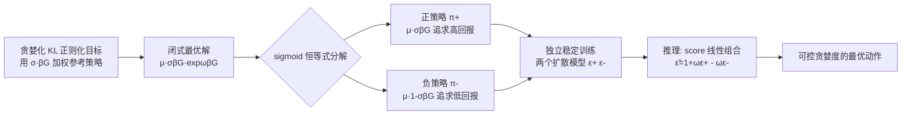

# Dichotomous Diffusion Policy Optimization

**会议**: ICLR 2026  
**OpenReview**: [https://openreview.net/forum?id=R8y089OGoo](https://openreview.net/forum?id=R8y089OGoo)  
**代码/主页**: [https://lrmbbj.github.io/DIPOLE/](https://lrmbbj.github.io/DIPOLE/)  
**领域**: 强化学习 / 扩散策略优化  
**关键词**: 扩散策略, KL 正则化 RL, 加权回归, 二分策略分解, classifier-free guidance, 离线/离线到在线 RL, VLA 自动驾驶  

## 一句话总结
DIPOLE 把 KL 正则化 RL 的最优策略指数权重项拆成一对有界的"二分策略"（一个追求高回报、一个追求低回报），用 sigmoid 加权稳定训练，再像 classifier-free guidance 那样在推理时线性组合二者的 score，实现可控贪婪度的稳定扩散策略优化。

## 研究背景与动机
**领域现状**：扩散/流匹配模型因擅长建模多模态动作分布、推理时可控生成，已成为机器人和自动驾驶等决策任务的主流策略类。但要用强化学习把大扩散策略训练到超越数据本身的水平，仍是公认的难题。

**现有痛点**：现有用 RL 训练扩散策略的路线各有硬伤——(1) 直接对值/奖励目标沿多步去噪过程反传梯度（如 DDPO、DRaFT），梯度噪声大、不稳定且算力昂贵；(2) 冻结扩散模型只搜噪声的推理时缩放路线，受限于预训练策略的性能上界；(3) 把去噪过程建模成多步 MDP、用高斯近似算中间步对数似然的策略梯度路线（如 DPPO），高斯近似只在去噪步足够小时才准，导致探索空间大、训练漫长、近似误差累积。

**核心矛盾**：KL 正则化 RL 给出了优雅的闭式加权回归解 $\pi^\star(a|s)\propto\mu(a|s)\cdot\exp(\beta G(s,a))$，只需在扩散回归损失上乘一个指数权重即可提取最优策略。但指数函数增长太快：要贪婪最大化回报就得把温度 $\beta$ 设大，结果权重爆炸、loss 失稳；而且损失被极少数高回报样本主导，学习低效、扩展性差。于是在"最优性 vs 稳定性"之间陷入两难。

**本文目标**：在保留加权回归简洁可扩展优点的前提下，构建一个稳定且对贪婪度可控的扩散策略 RL 方法。

**核心 idea**：**贪婪化 KL 正则化 + 二分策略分解**——把不稳定的指数权重项数学上拆成两个有界平滑的 sigmoid 权重项，从而把最优策略分解成一对可稳定训练的二分策略，推理时再用一个贪婪因子 $\omega$ 线性组合二者 score 来恢复最优策略。

## 方法详解

### 整体框架
DIPOLE 从一个比标准 KL 正则化更"贪婪"的目标出发，推导出最优策略的闭式解，发现它可被解耦成正/负两个用 sigmoid 加权、独立稳定训练的扩散策略，最后在推理时以 CFG 风格的 score 线性组合重建最优动作。

### 关键设计

**1. 贪婪化 KL 正则化目标：把"值感知"塞进参考策略**。标准 KL 正则化把策略 $\pi$ 约束到参考策略 $\mu$，最优解是指数加权的 $\mu\cdot\exp(\beta G)$。DIPOLE 不直接对着原始 $\mu$ 正则化，而是把它替换成一个被 sigmoid 加权的"值感知参考策略" $\mu(a|s)\cdot\sigma(\beta G(s,a))/Z(s)$，并额外引入一个贪婪因子 $\omega$：

$$\max_\pi \mathbb{E}_{s\sim d^\pi}\Big[\mathbb{E}_{a\sim\pi}[G(s,a)]-\tfrac{1}{\omega\beta}D_{\mathrm{KL}}\big(\pi(\cdot|s)\,\|\,\tfrac{\mu(\cdot|s)\sigma(\beta G)}{Z(s)}\big)\Big]$$

这里用有界平滑的 sigmoid 作为加权函数，对高回报样本给高权重但不会数值爆炸。求解后得到的闭式最优解（定理 1）为

$$\pi^\star(a|s)\propto\mu(a|s)\cdot\sigma(\beta G(s,a))\cdot\exp(\omega\beta G(s,a))$$

其中 $\beta$ 和 $\omega$ 共同控制贪婪程度——这一步把"贪婪度"显式参数化，为后续分解和可控生成埋下伏笔。

**2. 二分策略分解：把不稳定的指数权重拆成两个有界 sigmoid 项**。利用 sigmoid 的恒等式 $\exp(x)=\sigma(x)/(1-\sigma(x))$，可以把上面的最优解改写成两个加权参考策略的比值：

$$\pi^\star(a|s)\propto[\mu(a|s)\sigma(\beta G)]^{1+\omega}\big/[\mu(a|s)(1-\sigma(\beta G))]^{\omega}$$

由此自然定义出一对**二分策略**：正策略 $\pi^+\propto\mu\cdot\sigma(\beta G)$ 优先学高回报样本、追求回报最大化；负策略 $\pi^-\propto\mu\cdot(1-\sigma(\beta G))$ 优先学低回报样本、追求回报最小化，最优策略写成 $\pi^\star\propto[\pi^+]^{1+\omega}/[\pi^-]^\omega$。两个策略的权重都是严格有界的 sigmoid，从根上消除了原始指数权重的 loss 爆炸问题；而且正策略吃好数据、负策略吃坏数据，同时利用了数据集中的好坏样本，彻底解决了加权回归被少数高回报样本主导、学习低效的痛点。两个策略各用一个扩散模型 $\epsilon^+_{\theta_1},\epsilon^-_{\theta_2}$、配各自的有界 sigmoid 权重独立训练（式 9）。

**3. CFG 风格的可控生成：推理时线性组合 score**。因为 $\log\pi^\star=(1+\omega)\log\pi^+-\omega\log\pi^-+\text{const}$，对动作求梯度后 score 也满足同样的线性关系：

$$\nabla_a\log\pi^\star=(1+\omega)\nabla_a\log\pi^+-\omega\nabla_a\log\pi^-$$

利用扩散模型中 score 与噪声预测器的对应关系，采样时直接用 $\tilde\epsilon=(1+\omega)\epsilon^+_{\theta_1}-\omega\epsilon^-_{\theta_2}$ 跑反向过程即可。这个形式与 classifier-free guidance 的 $\tilde\epsilon=(1+\omega)\epsilon_\theta(x,c)-\omega\epsilon_\theta(x)$ 惊人地一致：正策略相当于"条件分布"，负策略相当于"无条件分布"，通过把负分布往反方向推来增强正分布。于是 $\omega$ 成了一个贪婪度旋钮——推理时无需重训就能灵活调节生成动作的最优性水平。相比同样借鉴 CFG 的 CFGRL（其 $\pi^+\propto\mu\cdot\mathbb{1}_{A\ge0}$、$\pi^-=\mu$，正负样本同权且缺理论支撑），DIPOLE 的非对称权重提供了更强的贪婪度和理论依据。

**实际落地**：标准多步 RL 中取 $G(s,a)$ 为优势函数 $A(s,a)$；离线设定下参考策略 $\mu$ 是数据集行为策略 $\pi_\beta$，离线到在线设定下 $\mu$ 取上一步更新的 $\pi_{k-1}$。自动驾驶上把方法扩到 10 亿参数 VLA 模型（DP-VLA，Florence-2 编码器 + 扩散动作头），用两个独立 LoRA 模块在解码器上分别构造正/负策略，按离线到在线方式微调。

## 实验关键数据

### 主实验：离线 RL（ExORL & OGBench）

ExORL（平均得分，8 seed）：

| Domain/Task | IQL | ReBRAC | CFGRL | IFQL | FQL | DIPOLE |
|---|---|---|---|---|---|---|
| Walker-stand | 603 | 461 | 782 | 873 | 801 | **953** |
| Walker-walk | 444 | 208 | 608 | 844 | 755 | **910** |
| Walker-run | 247 | 98 | 282 | 406 | 294 | **442** |
| Quadruped-walk | 776 | 344 | 762 | 883 | 739 | **928** |
| Cheetah-run | 168 | 97 | 216 | 269 | 222 | **274** |
| Cheetah-run-backward | 146 | 85 | 262 | 310 | 231 | **350** |

OGBench（各类别聚合成功率，8 seed）：

| 任务类别 | IQL | ReBRAC | IDQL | IFQL | FQL | DIPOLE |
|---|---|---|---|---|---|---|
| humanoidmaze-medium (5) | 33 | 2 | 1 | 60 | 58 | **68** |
| antsoccer-arena (5) | 8 | 0 | 12 | 33 | **60** | 57 |
| cube-double-play (5) | 7 | 12 | 15 | 14 | 29 | **44** |
| scene-play (5) | 28 | 41 | 46 | 30 | 56 | **60** |

DIPOLE 在多数域取得最优或接近最优，全面超过 Gaussian 加权回归的 IQL；即便去掉推理时拒绝采样（DIPOLE w/o rs）也优于 CFGRL，印证非对称贪婪设计的价值。

### 离线到在线 RL（OGBench，1M 在线更新前→后）

| 任务类别 | IFQL | FQL | DIPOLE |
|---|---|---|---|
| humanoidmaze-m | 56→82 | 12→22 | 61→**97** |
| antsoccer-arena | 26→39 | 28→86 | 43→**90** |
| scene | 0→60 | 82→100 | 97→**100** |

相比 IFQL 有更高的性能上界，相比直接值最大化的 FQL 也有竞争力，兼顾贪婪与稳定。

### 自动驾驶（NAVSIM 闭环，PDMS↑）

| 方法 | 输入 | NC | DAC | EP | PDMS |
|---|---|---|---|---|---|
| Hydra-MDP | Cam&Lidar | 98.3 | 96.0 | 78.7 | 86.5 |
| DP-VLA (ours) | Cam | 98.0 | 97.0 | 82.5 | 88.3 |
| DP-VLA w/ DPPO (navtest) | Cam | 97.9 | 97.6 | 83.5 | 89.0 |
| DP-VLA w/ DIPOLE (navtrain) | Cam | 98.2 | 98.0 | 83.6 | **89.7** |
| DP-VLA w/ DIPOLE (navtest) | Cam | **99.2** | **98.7** | **94.2** | **94.8** |

仅用相机的 DP-VLA 基线已超多模态 Hydra-MDP；经 DIPOLE 微调后 PDMS 进一步提升，且优于 DPPO，证明方法能扩到十亿参数 VLA 真实复杂场景。

### 关键发现
- 把指数权重拆成有界 sigmoid 二分项是稳定性的根源：避免 loss 爆炸，同时让好/坏数据都被利用。
- 贪婪因子 $\omega$ 在推理时即可调节贪婪度，无需重训，等价于一个 CFG 引导强度旋钮。
- 方法可从低维 state-based 任务一路扩到 1B VLA 的像素级自动驾驶，展现了良好可扩展性。

## 亮点与洞察
- **一个漂亮的数学拆解**：用 $\exp(x)=\sigma(x)/(1-\sigma(x))$ 把"不稳定的指数权重"恒等变换成"两个有界 sigmoid 权重之比"，把稳定性问题从工程 trick（clip/小 $\beta$）变成结构性解决，且不牺牲最优性。
- **统一视角**：揭示了 KL 正则化 RL 的贪婪策略提取与扩散模型 CFG 之间的内在联系——正/负策略正对应 CFG 的条件/无条件分支，把"RL 贪婪度"与"扩散引导强度"统一成同一个 $\omega$。
- **数据利用更充分**：正策略学好样本、负策略学坏样本，避免加权回归被少数高回报样本主导的低效问题。

## 局限与展望
- 需要同时训练正、负两个扩散策略（自动驾驶上靠两套 LoRA 缓解），相比单策略方法增加了训练/存储开销。
- 方法依赖优势/值函数 $G(s,a)$ 的估计质量，值函数偏差会同时污染正负两路加权。
- 自动驾驶用的是非反应式伪闭环仿真，真·闭环、多智能体交互场景下的稳健性仍待验证；navtest 变体在测试集上训练的设定也需谨慎解读其泛化含义。
- $\beta$ 与 $\omega$ 两个贪婪度旋钮如何自适应选择、二者的相互作用，留给后续工作。

## 相关工作与启发
- **加权回归类 RL**：AWR/AWAC、IQL、CFGRL 等给出 KL 正则化闭式解，DIPOLE 在其上做贪婪化与二分分解，是对这一脉络稳定性问题的正面回答。
- **扩散策略 RL**：相比 DDPO/DRaFT（直接反传）、DPPO（高斯近似策略梯度）、IDQL/IFQL/FQL（拒绝采样或流蒸馏），DIPOLE 避免了反传不稳定与似然近似误差，回归到简洁的加权扩散损失。
- **Classifier-free guidance**：把 CFG 从生成质量增强工具重新诠释为"RL 贪婪度控制"，为"用生成模型机制做策略优化"提供了可迁移的设计范式。

## 评分
- **新颖性**: ⭐⭐⭐⭐ 二分策略分解 + 把 CFG 与 KL 正则化 RL 贪婪度统一的视角很巧妙，是结构性而非工程性的创新。
- **实验充分度**: ⭐⭐⭐⭐ 覆盖 ExORL/OGBench 共 39 任务的离线、离线到在线，再加 NAVSIM 上 1B VLA 的真实场景验证，跨规模说服力强；但消融主要在附录、闭环 AD 评估设定略有讨论空间。
- **写作质量**: ⭐⭐⭐⭐ 从动机到推导逻辑清晰，数学拆解优雅，图示与 CFG 类比帮助理解。
- **价值**: ⭐⭐⭐⭐ 给"稳定训练大扩散策略"提供了简洁可扩展且有理论支撑的方案，对机器人/自动驾驶等落地方向实用价值高。

<!-- RELATED:START -->

## 相关论文

- [\[ICLR 2026\] Heterogeneous Agent Q-weighted Policy Optimization](heterogeneous_agent_q-weighted_policy_optimization.md)
- [\[ACL 2026\] d-TreeRPO: Towards More Reliable Policy Optimization for Diffusion Language Models](../../ACL2026/reinforcement_learning/d-treerpo_towards_more_reliable_policy_optimization_for_diffusion_language_model.md)
- [\[ICLR 2026\] Single-stream Policy Optimization](single-stream_policy_optimization.md)
- [\[ICLR 2026\] SPG: Sandwiched Policy Gradient for Masked Diffusion Language Models](spg_sandwiched_policy_gradient_for_masked_diffusion_language_models.md)
- [\[ICLR 2026\] Relative Entropy Pathwise Policy Optimization](relative_entropy_pathwise_policy_optimization.md)

<!-- RELATED:END -->
