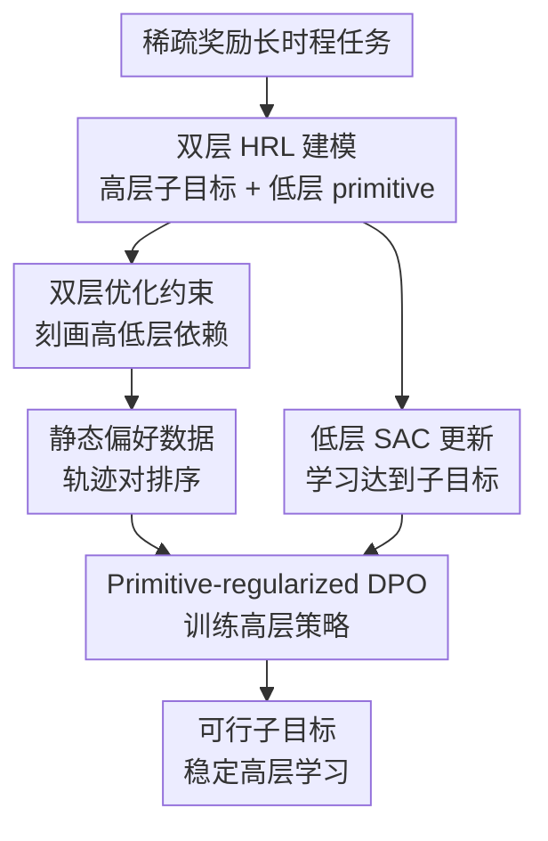

# Direct Preference Optimization for Primitive-Enabled Hierarchical RL: A Bilevel Approach

**会议**: ICLR2026  
**OpenReview**: [https://openreview.net/forum?id=wleUyyqTz2](https://openreview.net/forum?id=wleUyyqTz2)  
**代码**: 待发布  
**领域**: 层级强化学习 / 偏好优化 / 机器人控制  
**关键词**: 层级强化学习、DPO、双层优化、可行子目标、稀疏奖励  

## 一句话总结
DIPPER 把 goal-conditioned 层级强化学习写成双层优化问题，用带低层价值函数正则的 DPO 训练高层子目标策略，从而同时缓解低层策略演化带来的非平稳性和高层生成不可达子目标的问题，并在稀疏奖励机器人导航与操作任务上显著优于多种 HRL / DPO / 平坦 RL 基线。

## 研究背景与动机
**领域现状**：层级强化学习（HRL）的基本承诺，是把长时程任务拆成“高层决定子目标、低层执行原子动作”的两层结构。高层每隔 $K$ 个时间步输出一个子目标 $g_t$，低层策略 $\pi_L(a\mid s,g_t)$ 在这个窗口内尝试达到它。相比平坦 RL，这种时间抽象更适合稀疏奖励和长 horizon 任务，例如穿过迷宫、推方块、抓取放置，或 Franka kitchen 里连续完成多个操作。

**现有痛点**：这个结构在概念上很漂亮，但训练时有两个顽固问题。第一是非平稳性：低层策略 $\pi_L$ 一直在变，高层看到的“给出某个子目标后会到哪里、会得到多少奖励”也随之变化；于是高层 replay buffer 里的旧经验很快过期，学习信号漂移。第二是不可行子目标：高层可能提出当前低层根本达不到的 $g_t$，低层执行失败后，高层既得不到清晰 credit assignment，也会继续在错误子目标附近打转。

**核心矛盾**：这两个问题来自同一个耦合结构。高层的动作决定低层要学什么，低层的能力又决定高层动作是否有意义；传统 HRL 往往把两层分别当成普通 RL 来训，却没有一个足够明确的数学约束来表达“高层应该服务最终任务，同时不能超出低层当前可执行能力”。

**本文目标**：论文试图回答三个问题：如何把高低层的互相依赖写成一个原则性的优化形式；如何让高层学习不再直接依赖会随低层策略变化的环境奖励；以及如何把低层“能不能做到”显式放进高层子目标生成中。

**切入角度**：作者观察到，偏好数据可以提供比环境奖励更稳定的高层监督。只要偏好标签来自固定的轨迹比较，而不是训练过程中不断变化的低层策略，高层就可以通过 Direct Preference Optimization（DPO）学习“哪些子目标序列更好”。但直接把 DPO 套到机器人 HRL 上仍然不够，因为 DPO 只会偏好最终更好的轨迹，不会自动保证每个中间子目标对低层可达。

**核心 idea**：DIPPER 的关键是“用静态偏好比较训练高层，用低层价值函数约束高层”，也就是在 DPO 目标中加入 primitive regularization，让高层既朝最终任务偏好前进，又倾向于提出低层当前有高价值、可执行的子目标。

## 方法详解

### 整体框架
DIPPER 仍然采用 goal-conditioned HRL 的两层结构：高层策略 $\pi_H(g_t\mid s_t,g^*)$ 负责给出子目标，低层 primitive policy $\pi_L(a\mid s,g_t)$ 用 SAC 等 off-policy RL 去执行子目标。不同之处在于，高层不再用依赖低层行为的环境 reward 做普通 RL，而是从高层轨迹对的偏好标签中做 DPO；同时，高层 DPO 的隐式 reward 被低层价值函数正则化，鼓励它选择低层更容易达到的子目标。

训练过程可以理解成三条线并行推进。第一条线收集高层轨迹和低层 transition：高层轨迹进入偏好数据集 $D$，低层交互进入低层 replay buffer $R_L$。第二条线用低层 replay buffer 更新 $\pi_L$ 及其价值函数 $V^L$。第三条线从 $D$ 中采样成对高层轨迹 $(\tau^1,\tau^2,y)$，用 DIPPER 的 DPO 目标更新 $\pi_H$。这样，高层的主监督来自固定偏好比较，而“子目标是否现实”由低层价值函数持续提供约束。

### 关键设计
**1. 双层优化视角：把 HRL 的耦合问题写成约束而不是经验补丁**

普通 HRL 中，高层最大化最终任务回报，低层最大化达到子目标的回报，但两者通常只是交替更新。DIPPER 先把问题写成双层优化：高层要最大化 $J(\pi_H,\pi_L^*(\pi_H))$，而低层 $\pi_L^*(\pi_H)$ 是在高层子目标分布下最优的 primitive policy。形式上可以写成

$$
\max_{\pi_H,\pi_L} J(\pi_H,\pi_L^*(\pi_H))\quad
\text{s.t.}\quad
\pi_L^*(\pi_H)=\arg\max_{\pi_L}V^L(\pi_H).
$$

这个式子的意义不是直接求一个昂贵的精确双层解，而是把“高层动作必须考虑低层最优响应”这件事从直觉变成约束。作者进一步把它改写成近似 Lagrangian，在高层目标里加入 $V^L(s_t,g_t)-V^{L*}(s_t,g_t)$。由于 $V^{L*}$ 表示低层对该子目标的最优可达价值，高层如果提出当前低层价值很差的子目标，就会在这个约束项上吃亏。这样，不可行子目标不再只是训练失败后的现象，而是在目标函数里被提前惩罚。

**2. 静态偏好 DPO：让高层避开随低层策略漂移的奖励信号**

HRL 的非平稳性核心在于，高层环境 reward 和高层 transition 都依赖低层策略。低层今天能把 $g_t$ 做到，明天更新后可能做到不同状态；高层 replay 里同一个子目标的意义随时间改变。DIPPER 用偏好轨迹比较替代高层 RL：给定两条高层轨迹 $\tau^1$ 和 $\tau^2$，如果固定评分 $\hat R(\tau^1)>\hat R(\tau^2)$，就标注 $\tau^1\succ\tau^2$，然后用 DPO 直接提升 preferred 轨迹的似然、降低 dispreferred 轨迹的似然。

这里的关键不是“用了偏好学习”这么泛，而是偏好标签的构造被设计成不依赖正在更新的低层策略。论文采用 primitive-in-the-loop 风格，用轨迹中实际到达的状态相对最终目标 $g^*$ 的稀疏进展来定义每步评分，例如 $\hat r(s_{t*k},g^*,g_t)=1\{\lVert s_{t*(k+1)}-g^*\rVert_2\le\epsilon\}$，再累加得到 $\hat R(\tau)$。一旦这批轨迹对和偏好标签写入数据集，它们就是静态监督；高层训练时不需要每次重新查询当前低层能带来多少环境 reward，因此直接切断了高层主学习信号对低层策略漂移的依赖。

**3. Primitive regularization：用低层价值函数筛掉“看起来好但做不到”的子目标**

只用 DPO 会有一个危险：高层可能学到从偏好角度看很诱人的子目标序列，但其中某些子目标对当前低层来说太远或太难。DIPPER 在 DPO 的隐式 reward 中加入低层价值函数项，形成 primitive-regularized DPO。论文给出的核心形式可以概括为：

$$
\hat r(s_t,g_t,g^*)=\beta\log \pi_H(g_t\mid s_t,g^*)-
\lambda\bigl(V^L(s_t,g_t)-V_m^L(s_t,g_t)\bigr),
$$

其中 $V_m^L$ 是通过多步价值更新近似的低层最优价值，$\lambda$ 控制 primitive regularization 强度，$\beta$ 来自最大熵 / KL 正则的权重。直觉上，高层不是只问“这条轨迹是否被偏好”，还要问“这一步子目标在低层价值函数看来是否可行”。如果某个子目标使低层 value gap 很差，它在 DPO 排序里的有效得分就会被拉低。

这解决了直接 DPO 和直接 RLHF 在 HRL 上的共同缺陷。RLHF 奖励模型或 DPO 偏好目标可以绕开部分非平稳 reward，但如果没有低层可行性约束，高层仍然可能产生退化解：不断给出最终任务上合理、执行上荒唐的子目标。DIPPER 的正则项把“primitive 能力边界”注入高层策略，使子目标更像低层当前能完成的 stepping stones。

**4. 两个诊断指标：把非平稳性和不可行子目标从失败现象变成可测量量**

论文还补了一个很实际的缺口：以往 HRL 论文常说非平稳性和不可行子目标，但缺少直接指标。DIPPER 使用 Subgoal Distance Metric 和 Lower Q-Function Metric 来验证机制是否真的起作用。前者计算高层预测的子目标与低层实际达到的子目标之间的平均距离；距离越小，说明高层提出的目标越符合低层执行能力。后者统计高层预测子目标对应的低层 Q 值；Q 值越高，说明低层预期回报越好，子目标越可行。

这两个指标和方法设计是闭环的：primitive regularization 应该让高层选择更可达的 $g_t$，于是 subgoal distance 应该降低、lower Q 应该升高。实验中的 Figure 3 正是沿着这个逻辑展示：相比 DIPPER-No-V、HAC、RAPS、HIER 等基线，DIPPER 在四类任务上普遍产生更低的子目标距离和更高的低层 Q 值。这比单纯看 success rate 更有说服力，因为它直接观察了论文声称解决的两个 HRL 痛点。

### 一个完整示例
以 Franka kitchen 中“打开微波炉门并完成后续旋钮操作”的稀疏奖励任务为例，平坦 SAC 很可能长时间没有 reward；普通 HRL 的高层也可能一开始就给出“把门完全打开后再转旋钮”这类过远子目标，低层 primitive 在 $K=15$ 个 step 内做不到，导致 replay buffer 里充满难以解释的失败 transition。

在 DIPPER 中，高层轨迹可以被表示为一串 $(s_t,g_t)$。两条轨迹中，如果轨迹 A 在若干高层 step 后实际把末端执行器推进到微波炉门附近并触发了向最终目标的稀疏进展，而轨迹 B 一直给出远离门把手的子目标，那么 $\hat R(\tau_A)>\hat R(\tau_B)$，偏好数据会标注 $\tau_A\succ\tau_B$。高层 DPO 因而提升类似 A 的子目标序列概率。

但只偏好 A 仍不够。如果 A 中某一步子目标离当前 gripper 状态太远，低层价值函数会给出较低 $V^L(s_t,g_t)$，primitive regularization 会削弱这一选择。最终高层更倾向于输出一串对低层“够得着”的中间目标：先靠近门把手，再沿门把手方向移动，再推进到能触发稀疏奖励的状态。这个例子体现了 DIPPER 的核心分工：偏好告诉高层“哪类轨迹朝最终任务有用”，低层价值告诉高层“哪一步现在真的能执行”。

### 损失函数 / 训练策略
DIPPER 的高层目标来自 DPO。对偏好数据集 $D$ 中的轨迹对 $(\tau^1,\tau^2,y)$，论文从双层 Lagrangian 和最大熵 RL 的 advantage-policy 关系推导出 primitive-regularized DPO 目标。主文中的目标可以写成如下结构：

$$
L_O=-\mathbb{E}_{(\tau^1,\tau^2,y)\sim D}
\left[\log\sigma\left(\sum_{t=0}^{T-1}
\left(\beta\log\pi_H(g_t^1\mid s_t^1,g^*)-
\beta\log\pi_H(g_t^2\mid s_t^2,g^*)-
\lambda\Delta V_t\right)\right)\right],
$$

其中 $\Delta V_t=(V^L(s_t^1,g_t^1)-V_m^L(s_t^1,g_t^1))-(V^L(s_t^2,g_t^2)-V_m^L(s_t^2,g_t^2))$，$V_m^L$ 用 $m$ 次 value gradient update 近似最优低层价值 $V^{L*}$。梯度解释也很像标准 DPO：如果隐式 reward 排错了偏好对，就给该样本更大权重；更新方向提高 preferred 轨迹中高层子目标的 log-prob，降低 dispreferred 轨迹的 log-prob。

低层训练则保持更常规：低层 replay buffer 存储 $(s_{t+k},g_t,a_k,r_L,s_{t+k+1})$，用 SAC 优化 primitive policy。实验里 actor / critic 都是 3 层、每层 512 hidden units，Adam 优化；maze 和 kitchen 的 lower-level 执行窗口是 15 step，pick-and-place 与 push 是 7 step。偏好数据量约为每个环境 10,000 对轨迹比较，按环境步数折算，Maze 为 7,407 pairs/M steps，Pick & Place 为 11,111，Push 为 12,903，Kitchen 为 22,222。

## 实验关键数据

### 主实验
论文在四个稀疏奖励导航与机器人操作环境上评估：Maze navigation、Pick and Place、Push、Franka Kitchen。主图 Figure 2 给的是 5 个随机种子的 success rate 曲线；缓存文本没有逐点数值表，因此下面表格按论文图和文字结论做定性归纳，具体曲线数值应以原图为准。

| 任务 | 主要竞争基线 | DIPPER 表现 | 关键结论 |
|------|--------------|-------------|----------|
| Maze navigation | HAC、SAGA、RAPS、HIER、DPO-FLAT、FLAT | 不是最强，HAC/SAGA/RAPS 更好 | 简单迷宫中，已有 HRL / primitive prior 方法已经能有效工作，DIPPER 的优势不突出 |
| Pick and Place | HAC、SAGA、RAPS、PIPER、DIPPER-No-V | 明显优于多数基线 | 稀疏抓取放置需要可执行中间子目标，primitive regularization 开始体现价值 |
| Push | HAC、RAPS、HIER、DPO-FLAT、FLAT | 显著领先 | 平坦 DPO/RL 很难探索到奖励，DIPPER 借助层级结构和偏好监督更稳 |
| Franka Kitchen | HAC、RAPS、DAC、FLAT、PIPER | 显著领先，论文称最高约 40% 提升 | 长 horizon 稀疏组合任务中，高层非平稳性和不可行子目标最伤，DIPPER 改善最明显 |

### 消融实验
| 配置 / 指标 | 观察到的变化 | 说明 |
|-------------|--------------|------|
| DIPPER-No-V | 成功率低于完整 DIPPER | 去掉低层价值正则后，高层仍会产生更不可行的子目标，说明 primitive regularization 不是装饰项 |
| DPO-FLAT | 在复杂任务上明显弱于 DIPPER | 只做单层 DPO 缺少时间抽象，也没有低层 primitive 带来的探索优势 |
| $\lambda$ 太小 | 性能下降 | 正则太弱时，高层几乎退回只按偏好学，无法有效避免不可行子目标 |
| $\lambda$ 太大 | 可能退化为保守子目标 | 高层过度迎合低层当前能力，容易反复预测容易但不推进最终任务的 trivial subgoals |
| $\beta$ 太大 | 过度探索，子目标不够集中 | 最大熵项过强会让高层远离最优子目标序列 |
| $\beta$ 太小 | 探索不足，容易子最优 | 高层不愿尝试新的中间目标，稀疏奖励任务中会卡住 |

### 关键发现
- DIPPER 的优势主要出现在 Pick and Place、Push、Kitchen 这类更长、更稀疏、更依赖可行中间子目标的任务；在 Maze navigation 这种相对简单且行为 prior 很有效的任务上，RAPS、HAC、SAGA 可以超过 DIPPER。
- Figure 3 的诊断结果支持机制解释：DIPPER 的平均 subgoal distance 更低，说明低层实际达到的位置更接近高层提出的子目标；同时 lower Q-function value 更高，说明高层提出的子目标对低层来说更有回报、更可执行。
- 与 PIPER 这类 RLHF 式 HRL 相比，DIPPER 避免了先学 reward model 再跑 RL 的中间步骤，训练目标更直接；但它仍然继承了偏好数据质量和覆盖范围对策略学习的影响。
- 对 hard manipulation tasks，论文为了公平给所有相关基线都加入了一条 human demonstration 和低层 imitation objective 来加速训练。这说明 DIPPER 并不是完全从零解决所有操作探索难题，而是在相同额外信息下更好地利用层级和偏好结构。

## 亮点与洞察
- 把 HRL 的两个老问题统一到双层优化里，是这篇论文最清楚的理论抓手。很多 HRL 方法分别修 replay、修 relabel、修 subgoal 采样，但 DIPPER 明确指出非平稳性和不可行子目标都来自高低层相互依赖，因此需要一个同时约束两层的目标。
- 用 DPO 训练高层策略是一个很自然但不平凡的迁移。DPO 在语言模型里常被理解为“从偏好中对齐生成分布”，这里则被重解释为“从偏好轨迹中对齐高层子目标序列”，把 token-level DPO 的思路搬到 temporally extended control 上。
- Primitive regularization 的价值在于，它没有让偏好学习孤立地追求最终任务分数，而是把低层当前能力边界接入高层选择。这个思路可以迁移到其他多层决策系统，例如 option discovery、skill chaining、自动课程学习，甚至 LLM agent 的高层计划与低层工具执行之间的可行性约束。
- 两个诊断指标很实用。Subgoal distance 和 lower Q-value 不只是为了论文作图，也可以作为调试 HRL 系统的 dashboard：如果成功率低但 subgoal distance 也高，问题很可能是高层太激进；如果 Q-value 高但任务不推进，可能是 $\lambda$ 过大导致高层过保守。

## 局限与展望
- 偏好数据虽然是静态的，但不是免费的。论文用隐式稀疏奖励自动构造约 10,000 对轨迹比较，避免了人工标注；然而在真实机器人或 reward 更难定义的任务里，如何获得足够覆盖的偏好对仍是问题。
- DIPPER 是否比 reward-model-based HRLHF 更能泛化到分布外状态和动作，论文自己也没有回答。DPO 直接优化策略，可能更稳定，但也可能更依赖偏好数据覆盖到的状态分布。
- 高维子目标空间仍然困难。论文主要在连续控制里的状态/目标空间上做验证；如果子目标是图像、语言指令或复杂对象关系，低层价值函数如何稳定正则高层会更难。
- 实验数值主要以曲线展示，主文缺少可直接复现的最终成功率表。对于想快速比较方法的人，Figure 2 和 Figure 3 信息足够看趋势，但不够方便做严格数值引用。
- 在 hard manipulation tasks 中使用一条 human demonstration 和 imitation objective 是合理的公平设定，但也说明当前方法仍依赖额外引导来穿过最稀疏的早期探索阶段。未来可以研究 DIPPER 与自动课程、技能库预训练或更主动的偏好采样结合。

## 相关工作与启发
- **vs HAC / HIRO 类 HRL**: HAC 通过模拟最优低层行为来缓解非平稳性，HIRO 通过 relabeling 让高层经验更一致；DIPPER 则从高层学习目标本身入手，用静态偏好监督替代随低层漂移的 reward，再用低层价值约束子目标可行性。
- **vs SAGA**: SAGA 用 state-conditioned adversarial subgoal generation 让高层子目标贴合低层当前状态分布，在 Maze 上效果强；DIPPER 的区别是直接引入 preference optimization 和双层价值正则，在更复杂 manipulation 任务上更稳。
- **vs PIPER / RLHF-style HRL**: PIPER 也利用偏好思想缓解高层非平稳性，但它仍要学习 reward model 并进入 RL 优化；DIPPER 省掉显式 reward model，用 DPO 直接改高层策略，同时显式加入 primitive regularization。
- **vs DPO-FLAT**: DPO-FLAT 证明偏好优化本身不够，复杂控制任务还需要层级结构。DIPPER 的优势不是简单“DPO 比 RL 好”，而是 DPO、高层子目标、低层 value regularizer 三者组合后才形成完整方法。
- **对后续工作的启发**: 这篇论文可以启发一种更一般的“可执行偏好优化”范式：偏好目标负责方向，执行器价值函数负责可行性。无论执行器是机器人 primitive、检索工具、代码执行器还是多智能体中的下游 agent，都可以用类似思路避免高层计划生成“看似正确但无法落地”的动作。

## 评分
- 新颖性: ⭐⭐⭐⭐☆ 双层 HRL + primitive-regularized DPO 的组合有清晰新意，尤其是把 DPO 引入高层子目标策略并从双层约束推出可行性正则。
- 实验充分度: ⭐⭐⭐⭐☆ 覆盖 4 个稀疏奖励导航/操作任务、多个 HRL 和非 HRL 基线，并有机制指标；不足是主文缺少最终数值表，很多结论依赖曲线读图。
- 写作质量: ⭐⭐⭐⭐☆ 动机和方法链条清楚，公式推导完整；但符号复用略重，$\lambda$ 同时出现在熵和正则语境时读者需要仔细对照。
- 价值: ⭐⭐⭐⭐☆ 对 HRL 的非平稳性和不可行子目标给出一个可实现、可诊断的框架，特别适合长 horizon 稀疏奖励机器人任务，也能迁移启发更广泛的层级决策系统。

<!-- RELATED:START -->

## 相关论文

- [\[ICLR 2026\] Offline Preference-based Value Optimization](offline_preference-based_value_optimization.md)
- [\[ICLR 2026\] Preference-based Policy Optimization from Sparse-reward Offline Dataset](preference-based_policy_optimization_from_sparse-reward_offline_dataset.md)
- [\[ICLR 2026\] A Hierarchical Circuit Symbolic Discovery Framework for Efficient Logic Optimization](a_hierarchical_circuit_symbolic_discovery_framework_for_efficient_logic_optimiza.md)
- [\[ICML 2026\] Bilevel Optimization over Saddle Points of Zero-Sum Markov Games](../../ICML2026/reinforcement_learning/bilevel_optimization_over_saddle_points_of_zero-sum_markov_games.md)
- [\[ICLR 2026\] DuPO: Enabling Reliable Self-Verification via Dual Preference Optimization](dupo_enabling_reliable_self-verification_via_dual_preference_optimization.md)

<!-- RELATED:END -->
