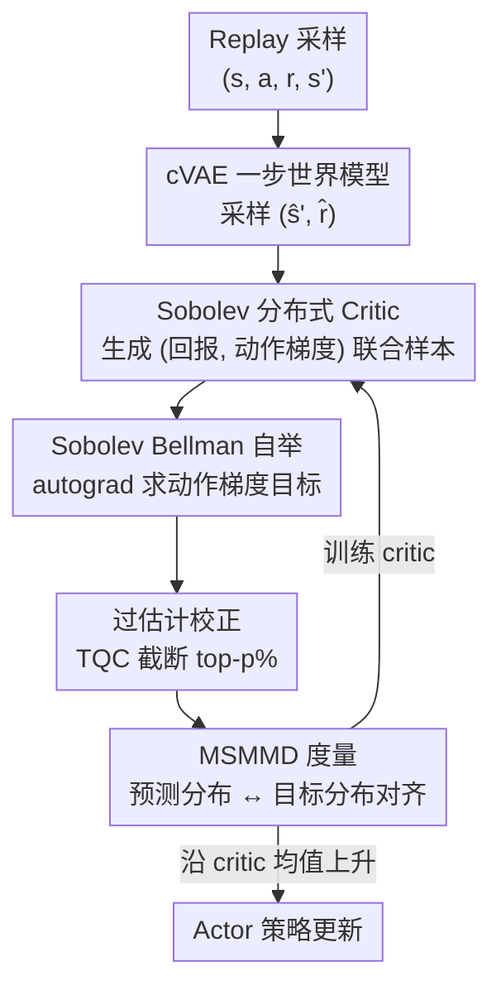

# Distributional value gradients for stochastic environments

**会议**: ICLR2026  
**OpenReview**: [https://openreview.net/forum?id=6hZAo6fZvJ](https://openreview.net/forum?id=6hZAo6fZvJ)  
**代码**: https://github.com/BaptisteDebes/Distributional-value-gradients （有，JAX）  
**领域**: 强化学习  
**关键词**: 分布式强化学习, 价值梯度, Sobolev 训练, 世界模型, 最大均值差异

## 一句话总结
针对 MAGE 这类"用价值梯度做信用分配"的方法在随机/噪声环境里失灵的问题，本文把分布式强化学习从"建模回报分布"扩展到"同时建模回报及其对动作的梯度的联合分布"，提出 Sobolev 分布式 Bellman 算子、可微世界模型与 max-sliced MMD 度量，给出梯度感知 RL 的首个收缩性证明，并在带噪 MuJoCo 上比确定性梯度方法更鲁棒。

## 研究背景与动机
**领域现状**：连续控制里的 off-policy actor-critic（DDPG/TD3/SAC）靠 critic 给 actor 提供动作梯度 $\nabla_a Q(s,a)$ 来做策略改进。一条很有前景的路线是"价值梯度"——MAGE（D'Oro & Jaskowski, 2020）等方法直接学一个可微的转移-奖励世界模型，把梯度信息（Sobolev training）注入 critic 训练，从而显式优化 critic 的动作梯度而不只是它的预测值，大幅提升样本效率。另一条线是分布式 RL，用回报分布而非期望来刻画环境的不可约不确定性，带来更稳定丰富的学习信号。

**现有痛点**：这两条线一直是分开走的。价值梯度方法（MAGE）用的是**确定性**梯度——它假设世界模型只需拟合条件期望 $(\hat s', \hat r)=\mathbb{E}[s',r\mid s,a]$，然后对这个确定性代理做反传。一旦环境本身是随机的（转移、奖励有噪声），要建模的梯度本身就变成了一个**随机量**，确定性梯度方法会把这个随机性抹平，在高维动作空间里损失掉它原本的样本效率优势。

**核心矛盾**：随机性不仅污染回报，**也污染回报对动作的梯度**。已有工作要么建模回报分布却忽略梯度（分布式 RL），要么建模梯度却当成确定性的（价值梯度）。没有方法在"分布"这个层面上同时刻画回报和它的梯度。

**本文目标**：(i) 定义一个能联合自举回报与动作梯度分布的 Bellman 算子；(ii) 设计一个能同时输出值和输入梯度样本的可微生成式 critic；(iii) 找一个可计算又能保证收缩的分布距离；(iv) 去掉"环境可微"这个不现实的假设。

**切入角度**：作者把 Sobolev training（"用近似器的梯度去拟合真函数的梯度"）的思想搬进分布式 RL——既然分布式 RL 已经在建模回报这个随机变量，那就把它扩展成一个 $(|A|+1)$ 维的随机变量，把动作梯度也当成一个需要被自举的随机量一起 TD。

**核心 idea**：用"分布建模梯度"代替"确定性建模梯度"——提出 **Distributional Sobolev RL**，让 critic 直接生成"回报-梯度"联合样本，用 max-sliced MMD 做收缩的分布式 TD，再用 cVAE 世界模型把随机环境变可微。

## 方法详解

### 整体框架
方法叫 **DSDPG（Distributional Sobolev Deterministic Policy Gradient）**：在标准 off-policy actor-critic 里把普通 critic 换成一个"分布式 Sobolev critic"，并配一个可微的 cVAE 一步世界模型，二者联合训练。一次更新里，系统先从世界模型采样下一步状态-奖励，让 critic 生成"回报 + 动作梯度"的联合样本，用 Sobolev Bellman 算子自举出目标分布（其中动作梯度项靠对 Bellman 目标自动求导得到），做过估计校正后用 MSMMD 把预测分布对齐到目标分布；actor 则沿 critic 估计的期望回报梯度上升。

核心是一个被作者称为"随机动作 Sobolev 回报"的随机变量——它把标量回报和回报对初始动作的梯度拼成一个高维随机变量：

$$Z^{Sa}(s,a)=\Big[\sum_{t=0}^{\infty}\gamma^t r(s_t,a_t);\ \nabla_a\sum_{t=0}^{\infty}\gamma^t r(s_t,a_t)\Big],\quad s_0=s,a_0=a.$$

整条 pipeline 如下：

### 关键设计

**1. Sobolev 分布式 Bellman 算子：把动作梯度也"自举"进 TD**

针对"梯度被当成确定性、随机性被抹平"这个痛点，本文不再把动作梯度当成 critic 训练时的辅助正则项，而是把它和标量回报一起塞进 TD 的对象里。作者定义 Sobolev 分布式 Bellman 算子 $\mathcal{T}^{Sa}_\pi$，作用在 $(|A|+1)$ 维随机变量上：采样 $s'\sim P,\ r\sim R,\ X'\sim\eta^{Sa}(s',a')$ 后，用一个逐点仿射映射把下一步分布前推。它的两个分量是

$$f^{return}(x)=r+\gamma\,x^{return},$$
$$f^{action}(x)=\frac{\partial r}{\partial a}(s,a)+\gamma\Big(\frac{\partial f}{\partial a}(s,a)\Big)^{T}\big(\partial_s x^{return}+(\partial_s\pi(s'))^{T}x^{action}\big).$$

这个动作梯度分量是新的——它来自对 Bellman 目标求导，刻画了回报的梯度在转移 $P(s',r\mid s,a)$ 下如何变换。整个 backup 可写成单一仿射算子形式 $Z^{Sa}(s,a)=b(s,a)+\mathcal{L}^{Sob}(s,a)[Z^{Sa}(s',a')]$，其中 $b(s,a)=(r(s,a),\partial_a r(s,a))$ 收集即时奖励及其动作梯度。因为 $f,r,\pi$ 都可微，这些更新直接靠对重参数化模拟器反传自动实现。和 MAGE 把动作梯度只当辅助信号根本不同，本文把它直接做成 TD 的量，这正是后面能给出收缩性分析的前提。

**2. 重参数化生成式 Sobolev critic：用一个网络同时吐出值和输入梯度的样本**

要在分布层面建模"回报+梯度"，需要一个既能采样、又能对输入 $(s,a)$ 廉价求导的 critic。作者把联合回报-梯度分布建模成一个确定性把噪声映射到样本的生成模型：

$$Z^{Sa}_\phi:(s,a,\xi)\mapsto\big(Z_\phi(s,a,\xi),\ \nabla_a Z_\phi(s,a,\xi)\big),\quad \xi\sim\mathcal{N}(0,I).$$

这种纯样本式（sample-based）的 critic 绕开了难算的似然，天然适配高维动作；而且因为输出就是网络本身的样本，对它求关于 $a$ 的梯度只是对同一张计算图再反传一次（Sobolev inductive bias：用近似器的梯度去当真函数的梯度）。这正好契合需求——既要值的样本又要梯度的样本，一个生成器一并给出。

**3. MSMMD（Max-sliced MMD）：既能收缩又能算的分布度量**

Wasserstein 距离虽是分布式 RL 最自然的度量，但多元最优传输代价高达 $O(m^3\log m)$，难以直接用于训练。MMD 是核方法度量，可计算、基于样本，但普通 MMD 没被证明对这个 Sobolev 算子收缩。作者把 MMD 用 max-sliced 框架"升维"：对单位球面上的方向 $\theta$ 取一维投影 $P_\theta(x)=\langle\theta,x\rangle$，定义

$$\mathrm{MSMMD}(\mu,\nu)=\sup_{\theta\in S^{d'-1}}\mathrm{MMD}\big((P_\theta)_\#\mu,(P_\theta)_\#\nu\big),$$

并用在单位球面上对 $\theta$ 做梯度优化来近似这个 sup。论文证明（Theorem 2）在适当光滑假设下 $\mathcal{T}^{Sa}_\pi$ 对 MSMMD 是严格收缩、有唯一不动点（条件 $\gamma\kappa<1$）。这里 $\kappa$ 由环境的 Jacobian 上界、策略敏感度决定，揭示了一个**根本的光滑性权衡**：要么压低 $\kappa$（约束 Jacobian、Lipschitz 耦合）增强光滑，要么缩短有效视野（减小 $\gamma$）；当环境物理本身梯度很大、$\kappa$ 无法消除时，唯一办法就是降低 $\gamma$。这是本文的一个核心理论贡献，也是首个梯度感知 RL 的收缩性结果。

**4. cVAE 一步世界模型：把随机不可微环境变成可采样可微的代理**

真实环境通常不可微，前面 Bellman 更新假设了已知可微动力学，这里把它放开。和 MAGE 只拟合条件期望不同，作者学一个**随机、可微**的模拟器 $g$，使其前推分布逼近真实转移-奖励分布：$(\hat s',\hat r)=g(s,a,\varepsilon),\ \varepsilon\sim\rho_w(\varepsilon),\ \mathrm{Law}[g(s,a)]\approx\mathrm{Law}[s',r\mid s,a]$。$g$ 用条件 VAE 实现（带学习先验、编码器、解码器）。选 cVAE 是因为 Sobolev TD 每次更新要采很多模型转移、并对每个样本关于 $(s,a)$ 求导，世界模型必须同时支持廉价采样和廉价重参数化梯度；扩散模型虽然生成质量高，但对生成样本关于条件求 Jacobian 要回传整条去噪链，对这种"反复一步查询并取梯度"的场景太贵，不适用。作者还做了消融，把 cVAE 换成轻量 normalizing flow，方法行为定性不变，说明收益来自"能利用梯度信息"而非具体生成架构。

**5. 过估计偏差校正：分布版的 TQC 截断**

价值估计普遍存在过估计，连梯度正则化的 critic 也会继承这个问题，会把策略推向被高估的动作。TD3 用双 critic 取最小值缓解；在本文的样本式分布设定下，作者沿用 TQC 的做法——训两个分布式 critic，各采 $N$ 个样本，按幅值丢掉最高的 $p\%$，把剩下的拼起来当目标分布。消融显示这个校正对稳定训练、达到高性能起到关键作用。

### 损失函数 / 训练策略
critic 训练目标是预测分布与自举目标分布之间的 MSMMD（或普通 MMD）：从一个 critic 采 $N$ 个预测 Sobolev 回报样本 $X$，从世界模型采 $(\hat s',\hat r)$，从两个 target critic 各采样、用 $r+\gamma\cdot$ 算标量回报、对动作自动求导得梯度，拼成联合样本，TQC 截断后得目标 $Y$，最小化 $\mathrm{MSMMD}(X,Y)$。actor 沿 critic 估计期望回报的梯度上升。MuJoCo 实验用 Dyna 设定，每步探索做 10 次 critic 更新（UTD=10），MMD 用 multiquadric 核 $h=100$，每个转移采 10 个样本。

## 实验关键数据

### 主实验
论文以图为主报告结果（无大表），以下表格为对图 2/图 3 结论的归纳（具体数值以原文为准）。

**玩具任务：2D 点质量（N 个奖励位置，N 越大回报分布越多模态）**

| 方法 | 小 N（近确定性） | 大 N（多模态高方差） | 结论 |
|------|------|------|------|
| MSMMD Sobolev（本文，可证收缩） | 好 | **最好** | 随 N 增大持续领先 |
| MMD Sobolev（本文） | 好 | 好（略逊 MSMMD） | 对多模态鲁棒 |
| Huber Sobolev / MAGE（确定性梯度） | 一般 | 无明显优势 | 相比无梯度 critic 没占到便宜 |

**MuJoCo（6 个任务，3 种设定）**

| 设定 | DSDPG（MSMMD/MMD Sobolev） | 确定性 Sobolev（MAGE）等基线 |
|------|------|------|
| 无噪声 | 与所有基线持平 | 持平 |
| 乘性观测噪声 $n\sim U[0.8,1.2]$ | 6 个中 **3 个**领先（尤其 Ant-v2、Humanoid-v2） | MAGE 在 Walker2d-v2、Humanoid-v2 严重掉点 |
| 加性高斯动力学噪声 | 6 个中 **3 个**领先 | 基线退化，Ant-v2 在该噪声下显著变难 |

基线含 TD3-Huber、MAGE（确定性 Sobolev）、IQN、标准 MMD；所有方法用同一基础架构，分布式变体均按重参数化采样、每转移采 10 样本。

### 消融实验

| 配置 | 关键现象 | 说明 |
|------|---------|------|
| 完整 DSDPG | 带噪环境鲁棒、高维任务收益更大 | — |
| w/o 过估计校正（关 TQC 截断 / 去双估计） | 训练稳定性与最终性能明显下降 | 该校正对稳定学习至关重要 |
| cVAE → normalizing flow（换世界模型） | 各 MuJoCo 任务定性行为不变 | 收益来自利用梯度信息，非具体生成架构 |
| MSMMD vs 普通 MMD | MSMMD 略优 | 可证收缩的度量带来温和优势 |

附录还报告了对噪声尺度、核带宽、Sobolev 样本数、世界模型容量的敏感性，以及 Humanoid-v2 的 wall-clock 运行时对比。

### 关键发现
- 去掉过估计偏差校正掉点最多——在样本式分布设定里这一步是稳定训练的关键。
- 优势随环境随机性与动作维度增大而放大：无噪声时只是持平，乘性/高斯噪声下才在高维任务（Ant、Humanoid）拉开差距，印证"随机性污染动作梯度、确定性梯度方法失效"的动机。
- 可证收缩的 MSMMD 比启发式的 MMD 稳定地略好，说明收缩性这条理论保证有实际价值。

## 亮点与洞察
- **把梯度当随机变量来 TD**：以往"价值梯度"线都把动作梯度当确定量或辅助正则，本文第一次把它和回报拼成联合随机变量直接自举，这个视角转换是全篇的"啊哈"点，也是能做收缩证明的根。
- **$\gamma\kappa<1$ 的光滑性权衡很有解释力**：它把"梯度感知 RL 何时收敛"量化成"要么更光滑、要么更短视野"，并指出当环境物理梯度大时唯一出路是降 $\gamma$——这种"算子层面的可收缩条件"对设计稳定的梯度感知 critic 有普适指导。
- **世界模型的选择被"需要廉价输入梯度"这个约束反推**：解释了为什么 cVAE/flow 行而扩散不行（扩散求条件 Jacobian 要回传整条去噪链），这条推理可迁移到任何"需要对生成样本反复取输入梯度"的场景。
- **Sobolev inductive bias 可迁移**：作者点名 PINN、神经体渲染等同样关心"梯度上的随机/不确定性"的领域都能借用"用近似器梯度拟合真梯度 + 生成式重参数化 + 可算分布距离"这套组合。

## 局限与展望
- **计算开销大**（作者承认）：策略评估与改进都要从分布式 critic 采多个样本并取其输入梯度，成本高；未来需要更高效的归纳偏置。
- **只用了 action-gradient 变体**：完整 Sobolev TD 还含 state-gradient，能提供回报随动力学变化的更多信息，但联合处理两种梯度计算更贵、实践上 non-trivial，本文为清晰和可行只做了 incomplete 版。
- **定位是"showcase"而非刷 SOTA**：MuJoCo 实验明确不追求各环境最优，只证明"在某些困难随机设定下分布式梯度更好"，因此优势是条件性的（无噪声时仅持平，6 任务里也只在 3 个领先）。
- 结果主要靠图呈现、缺大数值表，跨任务"领先/掉点"的强弱不宜直接横向比大小（噪声尺度、任务难度不同）。

## 相关工作与启发
- **vs MAGE / 确定性 Sobolev（D'Oro & Jaskowski 2020；Garibbo 2024）**：他们用确定性世界模型拟合条件期望、把动作梯度当辅助正则；本文把梯度建成分布、直接做 TD，并用随机可微世界模型，区别在随机环境下不抹平梯度噪声——这正是带噪 MuJoCo 上拉开差距的原因。
- **vs 分布式 RL（C51/IQN/分布式 DDPG，Bellemare 2017；Dabney 2018；Barth-Maron 2018）**：他们只建模回报分布；本文把分布建模扩展到回报对动作的多维梯度，因而需要可处理多维分布的距离（MMD/MSMMD），并把 critic 当成能产真实样本的生成模型，而非只给伪样本或统计量。
- **vs SVG / 模型基 RL（Heess 2015；Dyna；Dreamer 系）**：同样反传穿过世界模型，但本文世界模型服务于"提供可微一步转移以自举梯度分布"这一特定目的，用 cVAE 实例化，落在 Dyna 家族里。
- **vs PINN / 不确定性感知 PINN（Raissi 2017；Yang 2020）**：都把随机过程及其导数当随机变量处理，本文的 Sobolev inductive bias + 重参数化生成 + 可算分布距离的组合与之相通，作者也把这套思路列为可迁移到 PINN、体渲染的方向。

## 评分
- 新颖性: ⭐⭐⭐⭐⭐ 首次把回报梯度建成分布并直接 TD，给出梯度感知 RL 的首个收缩性证明，视角与理论都新。
- 实验充分度: ⭐⭐⭐⭐ 玩具+6 个 MuJoCo×3 噪声设定+多项消融较系统，但以图为主、定位为 showcase 而非 SOTA，优势条件性较强。
- 写作质量: ⭐⭐⭐⭐ 动机—理论—算法链条清晰，符号严谨；但大量推导压在附录、主文多处需结合附录才读透。
- 价值: ⭐⭐⭐⭐ 在随机/高维控制下提供更鲁棒的梯度感知 critic，光滑性权衡与 Sobolev inductive bias 对相关领域有借鉴意义；计算成本仍是落地瓶颈。

<!-- RELATED:START -->

## 相关论文

- [\[ICML 2026\] DRIVE: Distributional and Retrieval-Augmented Bidding with Value Evaluation](../../ICML2026/reinforcement_learning/drive_distributional_and_retrieval-augmented_bidding_with_value_evaluation.md)
- [\[ICLR 2026\] Does “Do Differentiable Simulators Give Better Policy Gradients?” Give Better Policy Gradients?](does_do_differentiable_simulators_give_better_policy_gradients_give_better_polic.md)
- [\[ICLR 2026\] One Life to Learn: Inferring Symbolic World Models for Stochastic Environments from Unguided Exploration](one_life_to_learn_inferring_symbolic_world_models_for_stochastic_environments_fr.md)
- [\[ICLR 2026\] Value Flows](value_flows.md)
- [\[ICML 2026\] Distributional Inverse Reinforcement Learning](../../ICML2026/reinforcement_learning/distributional_inverse_reinforcement_learning.md)

<!-- RELATED:END -->
