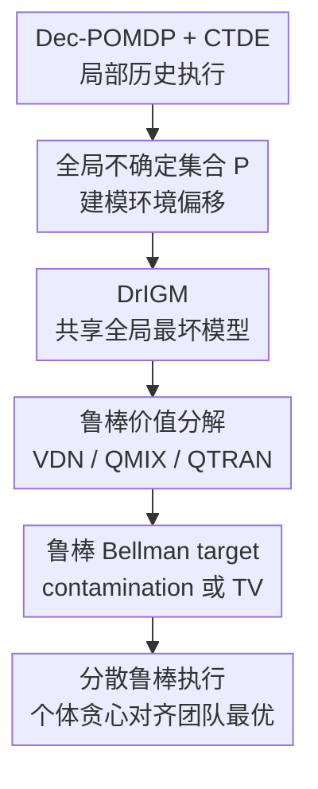

# Distributionally Robust Cooperative Multi-agent Reinforcement Learning with Value Factorization

**会议**: ICLR 2026  
**OpenReview**: [https://openreview.net/forum?id=2T3LOpqIOO](https://openreview.net/forum?id=2T3LOpqIOO)  
**代码**: https://github.com/crqu/robust-coMARL  
**领域**: 多智能体强化学习 / 鲁棒强化学习  
**关键词**: 分布鲁棒强化学习, 多智能体协作, 价值分解, CTDE, DrIGM  

## 一句话总结
本文把分布鲁棒强化学习引入合作式多智能体价值分解，提出 DrIGM 原则，让每个智能体的鲁棒贪心动作仍能拼成全局鲁棒最优联合动作，并在 VDN、QMIX、QTRAN 上实现了对环境分布偏移更稳的鲁棒版本。

## 研究背景与动机
**领域现状**：合作式多智能体强化学习里，CTDE 是很常见的训练范式：训练时可以使用全局状态、联合动作和团队奖励，执行时每个智能体只能根据自己的局部历史独立行动。为了让这种“集中训练、分散执行”不在执行阶段失配，VDN、QMIX、QTRAN 等价值分解方法通常依赖 IGM 原则，也就是每个智能体各自选择局部 Q 值最大的动作时，拼出来的联合动作应当也是全局联合 Q 值最大的动作。

**现有痛点**：这个范式在游戏和网格世界里已经很成熟，但真实系统常常存在训练环境和部署环境不一致的问题。例如楼宇 HVAC 控制会受到城市、气候、季节和传感噪声影响，StarCraft 中也可以人为加入观测扰动。单智能体分布鲁棒 RL 会把环境转移放进一个不确定集合里，学习最坏情况下也不差的策略；直接把这套思想搬到合作 MARL，却会遇到一个额外困难：每个智能体没有独立奖励，它们的价值来自共同团队目标，局部最坏情况和全局最坏情况不一定是同一个环境模型。

**核心矛盾**：鲁棒性要求“面对最坏环境仍然保守可靠”，价值分解要求“局部贪心动作能组合成全局贪心动作”。如果每个智能体各自找自己的最坏模型，智能体 1 认为安全的动作和智能体 2 认为安全的动作可能对应不同的 adversary，最终拼出来的联合动作反而不是团队鲁棒最优动作。换句话说，独立鲁棒化会破坏协作中的对齐关系。

**本文目标**：作者要解决的不是重新发明一个全新的 MARL 架构，而是给现有价值分解方法补上一个分布鲁棒版本。具体来说，论文需要定义什么叫鲁棒 IGM，证明怎样的个体鲁棒 Q 函数能保证分散执行对齐全局鲁棒最优，并把这个原则落到 VDN、QMIX、QTRAN 的 TD 训练目标里。

**切入角度**：论文的关键观察是，合作 MARL 关心的是整个团队在不确定环境下的最坏表现，而不是每个智能体分别面对自己的最坏环境。因此个体鲁棒价值不应由“各自最坏”定义，而应锚定到“使团队联合价值最坏的全局环境模型”。只要所有智能体都围绕同一个全局最坏模型做价值分解，分散贪心才有机会继续保持团队一致性。

**核心 idea**：用全局最坏联合 Q 函数来定义每个智能体的鲁棒个体 Q 值，再把这个定义嵌入 VDN/QMIX/QTRAN 的鲁棒 Bellman target，从而在不改变 CTDE 执行结构的前提下获得分布鲁棒的价值分解算法。

## 方法详解

### 整体框架
本文的方法可以理解成两层：理论层先把经典 IGM 改造成 DrIGM，说明“鲁棒个体贪心动作”什么时候能对齐“鲁棒全局贪心联合动作”；算法层再用这个原则改写价值分解训练目标，让 VDN、QMIX、QTRAN 在同一套 DR-RL 不确定集合下学习鲁棒 Q 值。执行时每个 agent 仍只看自己的局部历史，用自己的 $Q_i^{rob}(h_i,a_i)$ 做贪心或 $\epsilon$-greedy，不需要部署阶段通信。

形式化地，环境被写成 cooperative Dec-POMDP。每个智能体 $i$ 有局部历史 $h_i$ 和动作 $a_i$，联合历史为 $h=(h_1,\ldots,h_N)$，联合动作为 $a=(a_1,\ldots,a_N)$。训练时存在一个围绕 nominal model $P^0$ 的不确定集合 $\mathcal{P}$，论文采用 history-action rectangular uncertainty set：每个 $(h,a)$ 对应一个可独立扰动的转移集合 $\mathcal{P}_{h,a}$。鲁棒联合 Q 函数由最坏模型下的 Bellman 固定点给出：

$$
(TQ)(h,a)=r(s,a)+\gamma \inf_{P_{h,a}\in \mathcal{P}_{h,a}} \mathbb{E}_{h'\sim P_{h,a}}\left[\max_{a'} Q(h',a')\right].
$$

在这个框架里，算法不需要为每个 agent 设计单独 reward，也不需要让 agent 在部署时交换信息。训练阶段用全局状态和团队奖励学习鲁棒联合价值，执行阶段仍沿用价值分解的局部 Q 网络。

### 关键设计
**1. DrIGM：把“个体贪心等于团队贪心”推进到鲁棒场景**

经典 IGM 只关心 nominal 环境：如果每个 $Q_i(h_i,a_i)$ 的贪心动作组合起来落在 $\arg\max_a Q_{tot}(h,a)$ 中，就可以分散执行。本文提出的 DrIGM 把右侧替换成鲁棒联合价值 $Q_{tot}^{\mathcal{P}}$，要求

$$
\left(\arg\max_{a_1} Q_1^{rob}(h_1,a_1),\ldots,\arg\max_{a_N} Q_N^{rob}(h_N,a_N)\right)
\subseteq \arg\max_a Q_{tot}^{\mathcal{P}}(h,a).
$$

这个定义看似只是加了 “robust” 字样，真正重要的是它指出了合作 MARL 中鲁棒性的对象：不是每个 agent 独立求一个最安全动作，而是所有 agent 的局部动作必须服务于同一个团队最坏情况。论文在反例中说明，若照搬单智能体 DR-RL 的写法 $Q_i^{rob}=\inf_{P\in\mathcal{P}}Q_i^P$，不同 agent 的 infimum 可能由不同环境模型实现，局部最优组合会偏离全局鲁棒最优。DrIGM 因而不是一个装饰性定义，而是后续所有算法能否安全分散执行的判据。

**2. 全局最坏模型锚定：个体鲁棒值不各自找 adversary**

论文的核心定理给出一个充分条件：先找到鲁棒联合贪心动作 $\bar a\in\arg\max_a Q_{tot}^{\mathcal{P}}(h,a)$，再取使该联合动作下团队价值最差的模型

$$
P^{worst}(h,\bar a)\in \arg\inf_{P\in\mathcal{P}}Q_{tot}^P(h,\bar a),
$$

然后用这个同一个 $P^{worst}$ 下的个体价值定义每个 agent 的鲁棒个体 Q：

$$
Q_i^{rob}(h_i,a_i):=Q_i^{P^{worst}(h,\bar a)}(h_i,a_i).
$$

这一步的直觉很清楚：团队失败通常来自联合动力学和协作关系的错配，而不是某个 agent 单独面对一个私人坏环境。把所有个体 Q 都锚定到团队全局最坏模型，相当于让每个智能体在同一张“最坏地图”上规划局部动作，因此局部贪心才不会相互打架。Theorem 1 证明，在每个 $P\in\mathcal{P}$ 下存在满足 IGM 的个体 Q 时，上述构造一定满足 DrIGM；Theorem 3 进一步说明只要测试环境 $P_{test}\in\mathcal{P}$，鲁棒联合价值就是真实测试价值的下界。

**3. 兼容 VDN/QMIX/QTRAN：把理论条件落到现有价值分解器**

为了让方法可用，论文没有要求一个专门为鲁棒 MARL 重新设计的 mixer，而是证明 VDN、QMIX、QTRAN 的结构条件都能承载 DrIGM。VDN 对应加性分解 $Q_{tot}=\sum_i Q_i$；QMIX 对应对每个个体 Q 单调的 mixing network，即 $\partial Q_{tot}/\partial Q_i\ge 0$；QTRAN 则通过最优动作处等式和非最优动作处不等式约束，把更一般的联合 Q 与个体 Q 对齐。

这个设计的价值在工程上很大。已有 MARL 代码库通常已经实现了 DRQN agent、replay buffer、target network 和 mixer，本文只需要把 TD target 改成鲁棒 Bellman target，并在 QTRAN 里保留 $L_{opt}$、$L_{nopt}$ 这类一致性项。换句话说，DrIGM 是对现有 CTDE 训练目标的鲁棒化补丁，而不是一套需要重新组织通信、奖励分配或执行协议的系统。

**4. 两类不确定集合的鲁棒 Bellman target：用保守 bootstrap 抵抗环境偏移**

算法层面，论文实现了两种经典分布鲁棒不确定集合。对 $\rho$-contamination，真实转移被看作 nominal 转移和任意 adversarial 转移的混合：$P=(1-\rho)P^0+\rho\nu$。在 fail-state 或最小值归零假设下，鲁棒 target 变成

$$
y=r+\gamma(1-\rho)Q_{tot}^{\mathcal{P}}(h',\bar a';\theta^-),
$$

其中 $\bar a'_i=\arg\max_{a_i'}Q_i^{rob}(h_i',a_i';\theta^-)$。这相当于把 bootstrap 部分按 $1-\rho$ 折扣，承认一部分转移质量可能落到最差状态。

对 TV uncertainty，鲁棒 Bellman operator 通过一个 dual variable $\eta(s,a)$ 表达，训练时额外学习 dual network，并用 $[\eta-Q_{tot}(h',\bar a')]_+$ 这样的 hinge 项来刻画 TV ball 内的最坏期望。这个版本比 contamination 更复杂，但能更细粒度地根据当前 state-action 的 value 分布决定保守程度。两种 target 都共享同一件事：下一步动作不是联合枚举出来的，而是由 DrIGM 保证的个体贪心动作拼接得到，因此可扩展到多智能体执行。

### 一个完整示例
以楼宇 HVAC 控制为例，可以把每个房间或区域看作一个 agent。训练时系统知道完整建筑状态，包括各区域温度、室外温度、地面温度、太阳辐照和占用热增益；执行时每个 agent 只看到自己区域温度以及外部环境变量，并决定本区供热动作 $a_i\in[-1,1]$。普通 QMIX 可能在 Tucson 热干气候的第 1 到 200 天训练得很好，但换到 Seattle 或 New York，或者换到同一城市的另一个季节后，温度动力学和能耗-舒适度权衡都会变。

用本文方法训练时，replay buffer 里仍存储 $(h,a,s,r,h',s')$ 这样的转移。假设使用 robust QMIX + contamination uncertainty，target network 先让每个区域 agent 根据自己的 $Q_i^{rob}(h_i',a_i')$ 选出下一步局部动作，例如三个区域分别选出“少供热、维持、加热”。DrIGM 的作用是保证这三个局部选择可以被视为鲁棒联合 Q 下的贪心联合动作，而不是三个互不相干的局部保守决策。随后 mixer 用这些个体 Q 和全局状态算出 $Q_{tot}^{\mathcal{P}}(h',\bar a')$，target 再乘上 $\gamma(1-\rho)$。如果 $\rho$ 较小，模型只是轻微保守；如果 $\rho$ 太大，bootstrap 被压得过狠，策略会变得过度保守，这也解释了 SMAC 实验里 win rate 随 $\rho$ 先升后降。

### 损失函数 / 训练策略
所有算法都沿用 off-policy TD 学习。每个 agent 使用 DRQN 风格网络：局部 observation 和上一动作经过 MLP 编码，再进入 LSTM，最后输出该 agent 的动作 Q 值。训练时从 replay buffer 采样子轨迹，用 8 个 burn-in step 预热 LSTM hidden state，只用最后一步计算 loss。这个设置兼顾部分可观测性和计算效率。

对 VDN，联合 Q 是个体 Q 求和；对 QMIX，hypernetwork 根据全局状态生成非负 mixing weights，从而保持单调性；对 QTRAN，则学习单独的联合 Q 和 $V_{tot}(h)$，并加入

$$
L_{opt}=\left(Q_{tot}^{VDN}(h,\bar a)-\hat Q_{tot}^{QTRAN}(h,\bar a)+V_{tot}(h)\right)^2,
$$

以及非最优动作约束 $L_{nopt}$，使最优联合动作处满足等式、其他动作处满足松弛不等式。

总体 TD loss 写作

$$
L_{TD}=\left(Q_{tot}^{\mathcal{P}}(h,a;\theta)-(TQ_{tot}^{\mathcal{P}})(h,a;\theta^-)\right)^2.
$$

对 TV uncertainty，还要先更新 dual network $\eta_\xi$，最小化经验 dual loss；再用另一个 mini-batch 更新 Q 网络。训练中使用 $\epsilon$-greedy 探索、periodic target update 和 replay buffer，执行时则只保留每个智能体的局部 Q 网络与贪心动作选择。

## 实验关键数据

### 主实验
论文主要在两个环境上验证：SustainGym BuildingEnv 的 HVAC 多智能体控制，以及 SMAC 的 3s vs 5z 战斗场景。SustainGym 更接近真实控制系统，分布偏移来自气候、城市和季节；SMAC 用敌方单位位置观测噪声制造测试偏移。下面先列最能说明问题的 SustainGym seasonal shift 和 combined shift 结果。

| 设置 | 方法 | VDN | QMIX | QTRAN |
|------|------|-----|------|-------|
| Seasonal shift | Non-robust | 0.877 ± 0.012 | 0.895 ± 0.008 | 0.816 ± 0.036 |
| Seasonal shift | GroupDR baseline | 0.624 ± 0.040 | 0.499 ± 0.022 | 0.508 ± 0.048 |
| Seasonal shift | Robust TV | 0.898 ± 0.008 | 0.916 ± 0.006 | 0.861 ± 0.006 |
| Seasonal shift | Robust $\rho$-contamination | 0.869 ± 0.013 | 0.911 ± 0.005 | 0.825 ± 0.028 |
| Climate + season shift | Non-robust | 0.440 ± 0.040 | 0.478 ± 0.052 | 0.654 ± 0.066 |
| Climate + season shift | GroupDR baseline | 0.624 ± 0.056 | 0.383 ± 0.053 | 0.520 ± 0.049 |
| Climate + season shift | Robust TV | 0.627 ± 0.049 | 0.520 ± 0.048 | 0.733 ± 0.026 |
| Climate + season shift | Robust $\rho$-contamination | 0.551 ± 0.039 | 0.500 ± 0.075 | 0.682 ± 0.026 |

在最强偏移的 climate + season 设置下，robust TV 把 VDN 从 0.440 提到 0.627，把 QMIX 从 0.478 提到 0.520，把 QTRAN 从 0.654 提到 0.733。QTRAN 的提升尤其稳定，标准误从 non-robust 的 0.066 降到 0.026，说明鲁棒 target 不只是提高均值，也降低了跨 seed 波动。

### 消融实验
论文没有采用传统“去掉某个模块”的消融，而是比较不确定集合、鲁棒参数和不同 factorization 的影响。下面把关键分析整理成一个等价消融视角。

| 配置 | 关键指标 | 说明 |
|------|----------|------|
| Non-robust value factorization | combined shift 下 VDN/QMIX/QTRAN 为 0.440/0.478/0.654 | 标准 CTDE 在环境动力学变化时明显退化，尤其 VDN 和 QMIX 更脆弱 |
| GroupDR baseline | combined shift 下 0.624/0.383/0.520 | VDN 上有帮助，但扩展到 QMIX/QTRAN 并不稳定，说明只估计训练环境集合中的 worst-case reward 不足以保证价值分解对齐 |
| Robust TV | seasonal shift 全部超过 non-robust 和 GroupDR | TV ball 的 dual target 在季节偏移中最稳，尤其 QTRAN 从 0.816 提到 0.861 |
| Robust $\rho$-contamination | SMAC 小 $\rho$ 时 win rate 明显提升 | 简单保守 bootstrap 对观测噪声有效，但 $\rho$ 过大后过度保守，win rate 会下降 |
| DrIGM + decentralized greedy | HVAC 与 SMAC 均可执行 | 证明和实验共同说明，无需部署通信也能保持鲁棒联合动作对齐 |

### 关键发现
- SustainGym 的气候偏移实验显示，shift 越严重，non-robust baseline 越容易掉点；本文 robust 方法在 env 1 到 env 6 的多个测试环境上都维持更高 normalized team reward。
- 季节偏移中，TV uncertainty 比 contamination 更稳定，尤其在 QTRAN 上从 0.816 ± 0.036 提升到 0.861 ± 0.006，体现了 dual target 对 value 分布形状的适配能力。
- 气候 + 季节的组合偏移最难，robust TV 在三个分解器上都超过 non-robust 和 GroupDR；这说明 DrIGM 不是只适合某一个 mixer。
- SMAC 结果表明鲁棒参数 $\rho$ 存在甜点区间：小 $\rho$ 能抵消观测噪声，过大 $\rho$ 会让策略过度保守。这和鲁棒 RL 中“保守性换泛化”的理论直觉一致。
- 作者特别指出，合作 MARL 中鲁棒训练不一定牺牲训练环境表现。原因可能是部分可观测和分散执行本身带来误差，鲁棒 target 反而起到稳定协调的正则化作用。

## 亮点与洞察
- 最重要的亮点是把鲁棒性的粒度从“个体 agent”纠正为“团队联合系统”。这个视角避免了每个 agent 各自面对不同 worst-case model 的错配，也让 DrIGM 成为一个真正针对 cooperative MARL 的原则。
- 理论和工程衔接很顺：Theorem 1 解决鲁棒个体 Q 的定义，Theorem 2 说明 VDN/QMIX/QTRAN 的现有结构足以承载它，算法部分再只改 TD target。这种路线比重写一个复杂 robust MARL 框架更容易被复用。
- 论文把 $\rho$-contamination 和 TV uncertainty 都写成可训练 target，给使用者两个保守性选择。前者简单，近似像缩小 bootstrap；后者更复杂，但在 SustainGym 季节偏移中更稳。
- HVAC 控制这个实验选择很合适，因为它既有多区域协作，又天然存在气候和季节迁移，比只在游戏环境里加噪声更能说明分布鲁棒 MARL 的现实价值。
- 一个可迁移的启发是：凡是 CTDE + value factorization 的系统，如果部署时存在动力学或观测分布偏移，可以优先考虑“共享全局 worst-case target”而不是给每个 agent 单独做 adversarial regularization。

## 局限与展望
- 理论部分依赖 history-action rectangular uncertainty set，并且鲁棒 Bellman operator 的具体推导还用到了 fail-state 或最小值归零假设。这些假设在 DR-RL 文献中常见，但在真实复杂系统里不一定容易精确验证。
- DrIGM 的核心构造使用全局不确定集合。作者也承认未来可以扩展到 agent-wise uncertainty set；这会更贴近某些传感器或执行器只影响局部 agent 的场景，但也会重新带来个体 worst-case 与团队 worst-case 的对齐难题。
- 实验覆盖了 HVAC 和 SMAC，但还没有在大规模异构机器人群、交通网络或电网等更强耦合系统上验证。尤其是 action space 连续且 agent 数量更多时，QTRAN 或 TV dual network 的训练稳定性仍需要更多证据。
- Robustness parameter $\rho$ 需要通过 env 1 训练、env 2/3 验证来选择。真实部署中如果没有代表性验证环境，如何估计合理的 uncertainty radius 仍是一个实用问题。
- GroupDR baseline 的扩展实现虽然提供了对比，但 robust MARL 领域基线很多，未来还可以和 adversarial observation training、risk-sensitive value factorization、offline robust MARL 等方法做更系统比较。

## 相关工作与启发
- **vs VDN/QMIX/QTRAN**: 这些方法解决的是 cooperative MARL 的 credit assignment 和分散执行对齐，默认环境模型稳定；本文保留它们的 factorization 结构，但把训练目标替换为分布鲁棒 Bellman target，并证明鲁棒个体贪心仍能对齐鲁棒联合最优。
- **vs single-agent DR-RL**: 单智能体 DR-RL 可以直接对 $Q(s,a)$ 取最坏模型或用鲁棒 Bellman operator；本文指出在多智能体协作中不能独立对每个 $Q_i$ 这样做，因为各 agent 的 worst-case model 可能不一致。
- **vs GroupDR / robust cooperative MARL baseline**: GroupDR 依赖从训练环境集合估计 worst-case reward，本文则直接在价值分解的 Bellman target 中建模转移不确定性，并通过 DrIGM 保证分散贪心动作的全局对齐。
- **vs risk-sensitive MARL**: Risk-sensitive 方法通常在固定环境下关心 return tail 或 CVaR，本文关心的是环境模型本身发生分布偏移时的 worst-case transition，因此更适合 sim-to-real、气候迁移、模型 mismatch 等问题。
- **启发**: 对多智能体系统做鲁棒化时，优先检查“鲁棒目标是否还能被分散执行实现”。如果鲁棒训练只提升了 centralized critic，却让 decentralized actor 的局部贪心失去对齐，部署时仍可能失败；DrIGM 给了一个清晰的诊断标准。

## 评分
- 新颖性: ⭐⭐⭐⭐☆ 把 IGM 推广到分布鲁棒合作 MARL 的角度很清楚，核心贡献在于识别并修复个体 worst-case 与团队 worst-case 的错配。
- 实验充分度: ⭐⭐⭐⭐☆ SustainGym 的气候/季节偏移和 SMAC 观测噪声覆盖了真实控制与游戏环境，但更大规模真实多智能体系统仍可补充。
- 写作质量: ⭐⭐⭐⭐☆ 理论、算法和实验链条完整，反例也帮助理解动机；部分鲁棒 Bellman 推导依赖附录，初读门槛略高。
- 价值: ⭐⭐⭐⭐⭐ 对已有 VDN/QMIX/QTRAN 代码库很友好，适合需要 CTDE 且关心部署分布偏移的多智能体强化学习任务。

<!-- RELATED:START -->

## 相关论文

- [\[ICLR 2026\] Bayesian Robust Cooperative Multi-Agent Reinforcement Learning Against Unknown Adversaries](bayesian_robust_cooperative_multi-agent_reinforcement_learning_against_unknown_a.md)
- [\[ICLR 2026\] Potentially Optimal Joint Actions Recognition for Cooperative Multi-Agent Reinforcement Learning](potentially_optimal_joint_actions_recognition_for_cooperative_multi-agent_reinfo.md)
- [\[ICLR 2026\] When Is Diversity Rewarded in Cooperative Multi-Agent Learning?](when_is_diversity_rewarded_in_cooperative_multi-agent_learning.md)
- [\[ICML 2026\] LLM-Guided Communication for Cooperative Multi-Agent Reinforcement Learning](../../ICML2026/reinforcement_learning/llm-guided_communication_for_cooperative_multi-agent_reinforcement_learning.md)
- [\[ICLR 2026\] Continuous-Time Value Iteration for Multi-Agent Reinforcement Learning](continuous-time_value_iteration_for_multi-agent_reinforcement_learning.md)

<!-- RELATED:END -->
