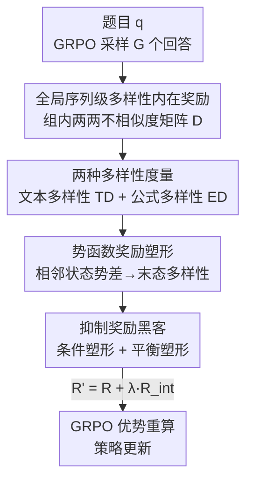

# Diversity-Incentivized Exploration for Versatile Reasoning

**会议**: ICLR2026  
**OpenReview**: [https://openreview.net/forum?id=9G7AbBrd27](https://openreview.net/forum?id=9G7AbBrd27)  
**代码**: https://github.com/NJU-RL/DIVER  
**领域**: 强化学习 / LLM 推理  
**关键词**: RLVR, 深度探索, 序列级多样性, 内在奖励, 势函数奖励塑形

## 一句话总结
DIVER 发现「一组回答的全局序列级多样性」和 LLM 的推理能力强正相关，于是把这种多样性做成一个内在奖励、再用势函数塑形保证最优策略不变、并用条件塑形堵住奖励黑客，从而让 RLVR 在数学推理上既不丢 Pass@1、又显著抬高 Pass@k 和跨域泛化。

## 研究背景与动机
**领域现状**：用可验证奖励做强化学习（RLVR，Reinforcement Learning with Verifiable Rewards）已经成为激发大模型推理能力的主流范式——给模型一道题，按答案对错给 0/1 奖励，再用 GRPO 这类算法更新策略。

**现有痛点**：推理任务的状态-动作空间随序列长度指数爆炸，加上奖励极度稀疏（大量「奖励荒漠」，模型大多数时候拿不到有意义的反馈），导致现有方法探索严重不足、样本效率低，很容易早早收敛到一两条固定的解题套路上。

**核心矛盾**：现有的探索手段几乎都停留在「局部 token 级」——比如缓解策略熵坍缩、只对高熵 token 分叉、只对高熵 token 保留梯度。这些做法本质是往动作分布里注入随机抖动，能帮策略逃出局部最优，但它们只在单个决策点上制造不确定性，无法保证跨多个时间步的、有方向的「深度探索」。而真正能拓宽解题路径的，是把整条推理序列层面的多样性顶起来。

**本文目标**：把探索从局部 token 级抬到全局序列级，让模型在语义结构化的空间里做深度探索，去发现新颖且有效的解题模式，同时还要解决三个工程问题——多样性怎么量化、加进奖励后会不会改变最优策略、会不会被模型钻空子（奖励黑客）。

**切入角度**：作者先做了一个验证性实验——把 GRPO 的 rollout 按序列级多样性切成高/低两组分别训练。结果发现高多样性训练在测试集上更强（域内 +1.8 分、跨域 +2.6 分），而且跨域增益比域内更明显。这说明全局多样性不是噪声，而是和推理能力强正相关、尤其利于泛化的信号。

**核心 idea**：把「一组回答之间的全局序列级多样性」显式做成内在奖励去激励深度探索，并用势函数奖励塑形保证它不破坏原任务的最优策略。

## 方法详解

### 整体框架
DIVER 建立在 GRPO 之上。GRPO 对每道题 $q$ 采样一组 $G$ 个回答 $\{o_1,\dots,o_G\}$，用规则验证器给每个回答一个二值奖励 $r_i\in\{0,1\}$，再用组内归一化得到优势 $A_i=(r_i-\mu_r)/\sigma_r$。DIVER 在这条主线上插入一个「多样性内在奖励」分支：先用两种度量（文本多样性 TD、公式多样性 ED）算出组内两两不相似度，得到一个 $G\times G$ 的多样性矩阵 $D$，对第 $i$ 个回答取它那一行的平均得到 $d(o_i)$；再通过势函数奖励塑形把 $d(\cdot)$ 折算成内在奖励 $R_{\text{int}}$，与原始正确性奖励线性组合成新奖励 $R'=R+\lambda R_{\text{int}}$；最后只把内在奖励发给「答对」的回答（条件塑形）并对它做裁剪与衰减（平衡塑形），用 $R'$ 替换 GRPO 里的 $r_i$ 重新算优势、更新策略。

### 关键设计

**1. 全局序列级多样性作为内在奖励：把探索从 token 抬到整条序列**

针对「局部 token 级抖动无法支撑深度探索」这个痛点，DIVER 不再盯着单个 token 的熵，而是衡量**一组回答整体上彼此有多不同**。对一组 $G$ 个回答，先算两两不相似度得到矩阵 $D$（元素 $d_i^j$ 是回答 $o_i$ 与 $o_j$ 的多样性），再对第 $i$ 行取平均得到该回答的组内多样性 $d(o_i)=\frac{1}{G-1}\sum_{j\neq i}d_i^j$。这个 $d(\cdot)$ 就是后续内在奖励的来源。和局部方法的本质区别在于：token 级方法只在某个决策点制造不确定性，而序列级多样性鼓励模型产出**结构上不同的整条解法**，从而在语义结构化的空间里做有方向、跨多步的深度探索——这正是验证性实验里和推理能力强正相关的那个量。

**2. 文本多样性 TD 与公式多样性 ED：两把量多样性的尺子**

多样性必须可量化，作者给了两个易实现的度量。**文本多样性（Textual Diversity, TD）** 用 BLEU 衡量回答间的文本相似度再取反：BLEU 通过 n-gram 重叠度算相似，分越高越像，于是对回答 $o_i$，它的 TD 是与组内其它回答 BLEU 相似度取反后的平均

$$\mathrm{TD}(o_i)=\frac{1}{G-1}\sum_{j\in[G]\setminus\{i\}}\big(1-\mathrm{BLEU}(o_i,o_j)\big).$$

**公式多样性（Equational Diversity, ED）** 针对数学题——同一道题常有多种解法、对应不同的公式形态。设 $F(o_i)$ 是回答 $o_i$ 中抽出的公式集合，$F_{-i}=\bigcup_{j\neq i}F(o_j)$ 是其它回答的公式集合，则 ED 是该回答里「独有公式」占其全部公式的比例

$$\mathrm{ED}(o_i)=\frac{|F(o_i)\setminus F_{-i}|}{|F(o_i)|}\quad(|F(o_i)|>0,\ \text{否则为 }0).$$

TD 看「说法多不多样」，ED 看「解法路径多不多样」；两者都是即插即用的，框架原则上兼容任何其它多样性度量，DIVER-MIX 则把两者一起用以取得最优多样性。

**3. 势函数奖励塑形：保证加了多样性也不改变最优策略，且只需算末态多样性**

直接把多样性当额外奖励塞进去会改变最优策略、把模型带偏（Ng 等人 1999 年的经典结论）。DIVER 改用**基于势函数（potential-based）的奖励塑形**：把序列级多样性 $d(\cdot)$ 当作状态上的势函数，内在奖励定义为相邻状态势函数的折扣差

$$R_{\text{int}}(s_t,a_t,s_{t+1})=\gamma d(s_{t+1})-d(s_t),$$

其中 LLM 设定下 $s_t:=[q,o_{i,\le t}]$、$a_t:=o_{i,t+1}$。因为 GRPO 沿用 PPO 的序列级策略梯度，整条回答的内在奖励是逐步求和，这一串折扣差会**望远镜式相消**，最终只剩末态的多样性：$R_{\text{int}}([q,o_i])=\gamma^T d([q,o_i])$（常数 query 的势 $d(q)=0$）。这一步很妙：它既由定理 1 保证「变换后 MDP 的任意最优策略仍是原 MDP 的最优策略」（最优策略不变性），又省掉了对所有中间句子算多样性的开销——只需对最终回答算一次。新奖励即 $R'([q,o_i])=R([q,o_i])+\lambda R_{\text{int}}([q,o_i])$，$\lambda$ 是平衡正确性与多样性的塑形系数。

**4. 抑制奖励黑客：条件塑形 + 平衡塑形，让多样性奖励只奖励真正答对的解**

虽然势函数塑形保证了最优策略不变，但训练中模型仍可能过度榨取内在奖励、忽略主目标——尤其难题上正确性奖励稀疏难拿，而多样性奖励相对好拿，模型容易「为了多样性而多样性」（典型表现是疯狂拉长回答骗多样性 bonus）。作者用两个简单启发式堵漏：**条件塑形（Conditional Shaping）** 只对组内**答对**的回答发多样性奖励，$r_i'=r_i+\lambda\cdot r_i^{\text{int}}\cdot \mathbb{I}(r_i)$，其中 $\mathbb{I}(r_i)$ 是「答对为 1、答错为 0」的指示函数——这把多样性激励锁死在合法解上，让塑形奖励和真实目标对齐；**平衡塑形（Balanced Shaping）** 把内在奖励裁剪到上界 $r_i^{\text{int}}=\mathrm{clip}(r_i^{\text{int}};0,\sigma)$ 防止过度榨取，并在训练中**逐渐衰减 $\lambda$**，对应经典 RL「早探索、晚利用」的哲学。消融显示：若把多样性奖励发给错误或全部回答，回答长度会爆炸、测试性能崩坏；加长度惩罚能压住长度爆炸但准确率仍差；唯有「只奖励正确回答」的条件塑形才真正稳住。

### 损失函数 / 训练策略
主干是 GRPO 目标（去掉了 KL 项，$\beta=0$），把优势里的原始奖励 $r_i$ 换成塑形后的 $r_i'$。训练数据用 OpenR1-Math-220k 的子集（prompt 取自 NuminaMath 1.5，沿用 LUFFY 设置）；采样 batch 128、更新 batch 32、每个 prompt rollout 8 个；higher clip 用 0.28（跟随 GRPO w/ Clip-higher）。

## 实验关键数据

### 主实验
基于 Qwen2.5-Math-7B，六个数学基准（AIME24/25、AMC、MATH-500、Minerva、OlympiadBench）取域内平均，三个跨域基准（ARC-c、GPQA*、MMLU-Pro）取跨域平均。

| 方法 | 域内 Avg | 跨域 Avg | 说明 |
|------|---------|---------|------|
| Qwen2.5-Math-7B（base） | 26.7 | 27.3 | 未经 RL |
| OpenReasoner-Zero | 41.0 | 51.6 | 强 RLVR baseline |
| Entropy-RL | 41.8 | 56.0 | 局部（动作级）探索最强 baseline |
| Pass@k Training | 41.5 | 55.3 | 组内 bootstrap 全局探索 |
| **DIVER-TD** | **42.3** | **58.4** | 文本多样性 |
| **DIVER-ED** | **43.0** | 56.5 | 公式多样性 |
| **DIVER-MIX** | **43.1** | **58.8** | 两度量混合，最优 |

DIVER 相比 OpenReasoner-Zero 域内 +2.0、跨域最高 +6.8，跨域上 ARC-c +10.1、GPQA +12.5；相比最强局部探索 Entropy-RL，域内平均 +1.2（OlympiadBench 上 +4.6）、跨域平均 +2.4。

### Pass@k 与消融

| 配置 / 设置 | 关键指标 | 说明 |
|------|---------|------|
| DIVER vs Entropy-RL @AIME25 Pass@32 | **+6.7** | 多次尝试下探索范围优势最明显 |
| DIVER @AIME24 Pass@1024 | 86.7% | 比次优 baseline +6.7，且 k 越大差距越大 |
| 多样性奖励发给「正确回答」 | 最佳（红线） | 条件塑形，准确率稳 |
| 多样性奖励发给「全部 / 错误回答」 | 性能崩、长度爆炸 | 奖励黑客 |
| 全部回答 + 长度惩罚 | 长度压住但准确率仍差 | 长度惩罚治标不治本 |
| 多样性视野：完整回答 vs 前 200/500/1000 token | 完整回答最优 | 视野越长、全局多样性越高、性能越好 |

### 关键发现
- DIVER 的优势是「不牺牲 Pass@1 的前提下显著抬高 Pass@k」——这正说明它扩大的是探索范围/推理上界，而非单纯换分布。
- 高多样性训练的好处在**跨域**比域内更突出，印证「多样性 → 更广解题模式 → 更强泛化」的动机。
- 训练动态上，Pass@k Training 和 Entropy-RL 的多样性随训练下降（探索退化），Clip-higher 后期熵异常升高（趋于崩溃），只有 DIVER 维持高多样性 + 合理熵，做到「受控探索」。
- 跨 Qwen2.5-Math-1.5B、Qwen2.5-7B-Base、LLaMA-3.1-8B-Instruct、DeepSeek-R1-Distill-Qwen-7B（长回答 2500-3500 token）都稳定增益，说明对模型规模/架构/推理长度都不挑。

## 亮点与洞察
- **「多样性=内在奖励」用势函数塑形求解得极其干净**：相邻状态势差逐步求和望远镜相消，整条序列的内在奖励恰好等于末态多样性 $\gamma^T d([q,o_i])$——既理论上保证最优策略不变（定理 1），又工程上省掉对所有中间句子算多样性的开销，是「理论优雅顺带带来工程便利」的范例。
- **条件塑形一句话堵住奖励黑客**：把多样性奖励的指示函数和正确性绑定，避免了「为多样性牺牲正确性」的常见塌方，这个 trick 几乎可直接迁移到任何「主奖励 + 辅助塑形奖励」的 RLVR 设置。
- **先证再做的研究范式**：先用 high/low diversity 切分实验确认「全局多样性和推理能力正相关」，再据此设计内在奖励，动机扎实而非拍脑袋。
- **TD/ED 即插即用**：框架与具体多样性度量解耦，BLEU 取反算文本、独有公式占比算公式，都很轻量，换别的度量也不影响主框架。

## 局限与展望
- 验证主要集中在数学推理（六个数学基准 + 三个跨域），ED 度量本身就是为数学公式设计的，迁到代码、定理证明、开放域推理时多样性该怎么量化仍待探索。
- 上界 $\sigma$、塑形系数 $\lambda$ 及其衰减、探索视野长度等是关键超参，论文显示性能对这些敏感（如视野过短显著掉点），实际落地需要调参成本。
- 内在奖励有效性依赖「答对/答错」的可验证信号做条件门控，在没有可靠验证器、只能用软奖励的任务上，条件塑形这条防奖励黑客的护栏会失效。
- 多样性度量是组内两两计算（$G\times G$ 矩阵），组规模 $G$ 增大时计算成本上升，长回答场景下 TD 的 n-gram 比较也会变重。

## 相关工作与启发
- **vs 局部 token 级探索（Entropy-RL / Clip-higher / 高熵 token 分叉）**：它们在单个决策点注入不确定性帮助逃局部最优，但无法支撑跨多步的深度探索；DIVER 把多样性抬到整条序列层面，跨域泛化和 Pass@k 上明显更优。
- **vs Pass@k Training**：同属「全局」探索，但 Pass@k Training 只是把 Pass@k 当奖励、并未显式优化候选解之间的多样性；DIVER 直接量化并奖励组内多样性，且用势函数保证不破坏最优策略。
- **vs 经典 RL 内在奖励（count-based / 信息增益 / 新颖性）**：DIVER 把经典 RL「内在奖励驱动探索」这一脉从小状态空间搬到 LLM 推理的高维文本空间，并用势函数塑形解决了「加奖励会改最优策略」这一在 LLM 场景同样致命的问题。
- **vs 前沿多样性 RL（无监督学多样技能 / 约束优化诱导多样行为）**：DIVER 把「促进全局多样性以增强深度探索」的原则首次系统性引入 LLM 推理，填补了「LLM 推理里高效深度探索机制尚未充分研究」这一空白。

## 评分
- 新颖性: ⭐⭐⭐⭐⭐ 首次把全局序列级多样性做成内在奖励引入 RLVR，并用势函数塑形给出最优策略不变性保证，角度和理论都新。
- 实验充分度: ⭐⭐⭐⭐⭐ 六数学 + 三跨域基准、Pass@k 到 1024、四种模型骨干、奖励黑客与视野消融齐全。
- 写作质量: ⭐⭐⭐⭐ 动机—度量—塑形—防黑客逻辑闭环清晰，公式推导（望远镜相消）讲得明白。
- 价值: ⭐⭐⭐⭐⭐ 不牺牲 Pass@1 抬高 Pass@k 与泛化，条件塑形等 trick 可直接复用，对 RLVR 探索方向有切实推动。

<!-- RELATED:START -->

## 相关论文

- [\[AAAI 2026\] Reasoning with Exploration: An Entropy Perspective](../../AAAI2026/reinforcement_learning/reasoning_with_exploration_an_entropy_perspective.md)
- [\[ICLR 2026\] Controllable Exploration in Hybrid-Policy RLVR for Multi-Modal Reasoning](controllable_exploration_in_hybrid-policy_rlvr_for_multi-modal_reasoning.md)
- [\[ACL 2026\] Semantic-Space Exploration and Exploitation in RLVR for LLM Reasoning](../../ACL2026/reinforcement_learning/semantic-space_exploration_and_exploitation_in_rlvr_for_llm_reasoning.md)
- [\[ICLR 2026\] Beyond Noisy-TVs: Noise-Robust Exploration Via Learning Progress Monitoring](beyond_noisy-tvs_noise-robust_exploration_via_learning_progress_monitoring.md)
- [\[ICLR 2026\] The Choice of Divergence: A Neglected Key to Mitigating Diversity Collapse in Reinforcement Learning with Verifiable Reward](the_choice_of_divergence_a_neglected_key_to_mitigating_diversity_collapse_in_rei.md)

<!-- RELATED:END -->
