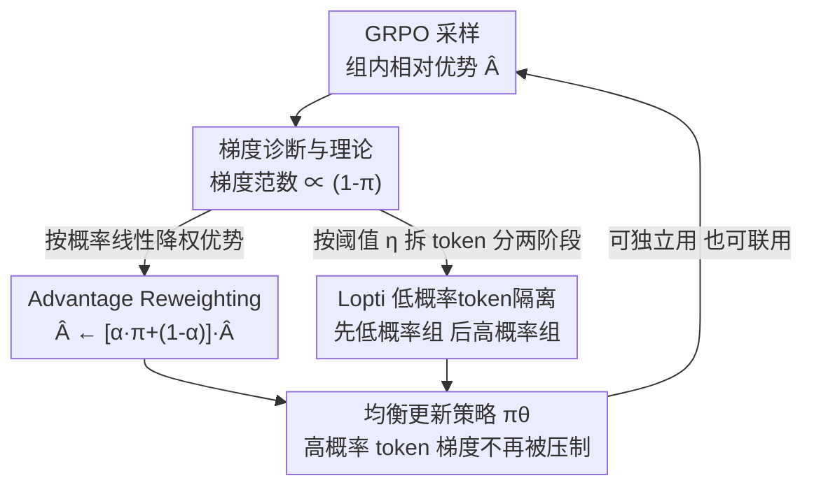

# Do Not Let Low-Probability Tokens Over-Dominate in RL for LLMs

**会议**: ICLR 2026  
**OpenReview**: [https://openreview.net/forum?id=FOnAdLo0tM](https://openreview.net/forum?id=FOnAdLo0tM)  
**代码**: https://github.com/zhyang2226/AR-Lopti  
**领域**: 对齐RLHF / LLM推理  
**关键词**: GRPO, 强化学习, 梯度偏置, 低概率token, token加权

## 一句话总结
本文指出在 GRPO 等 RL 训练 LLM 时，低概率 token 因梯度幅值过大而主导参数更新、压制了同样重要的高概率 token，并提出两个简单方法——Advantage Reweighting（按概率线性缩小低概率 token 权重）和 Lopti（先更新低概率 token、再更新高概率 token）——在 K&K 逻辑谜题上把 GRPO 提升最高 46.2%。

## 研究背景与动机
**领域现状**：RL（尤其是 DeepSeek-R1 带火的 GRPO）已经成为提升 LLM 推理能力的标准后训练手段。GRPO 去掉了 PPO 的价值网络，用「组内相对优势」估计 advantage，在数学、代码任务上效果突出，引出大量后续改进工作。

**现有痛点**：现有针对 GRPO 的改进几乎都聚焦在三个方向——样本质量、响应长度偏置（response 越长权重越偏）、以及防止熵塌缩。前人（Yu et al.、Liu et al.、Xiong et al.）已经发现 GRPO 目标里存在「更新权重偏置」会显著影响训练结果，但这些偏置都是从 response 层面或 prompt 难度层面来看的。

**核心矛盾**：本文发现了一个被忽视、且与上述偏置正交的**梯度层面偏置**——它和 token 的概率强相关。作者把 token 按概率四分位分成四组后观测到：低概率 token 产生的梯度范数远大于高概率 token（Figure 1d）。由于每次 RL 更新要在几十万个 token 上平均梯度、梯度之间相互干扰，低概率 token 就会主导整个更新方向，把高概率 token 的梯度压下去。更糟的是，高概率正样本 token 朝「正确方向」（概率应当上升）更新的比例反而更低——概率 > 0.75 的 token 朝对方向更新的比例甚至不到 50%（Figure 3）。

**本文目标**：在不破坏 GRPO 框架的前提下，削弱低概率 token 的过度主导，让高概率 token 的梯度得到应有的体现，从而促成「跨概率均衡」的参数更新。

**切入角度**：从单个 token 诱导的梯度入手做理论推导，证明任一层激活的梯度范数被夹在与 $(1-\pi)$ 成正比的上下界之间——概率越低梯度越大，概率趋近 1 梯度趋近 0。这给「低概率 token 主导」提供了严格解释，也指明了「按概率调权」就能对症下药。

**核心 idea**：既然问题根源是「梯度幅值 $\propto (1-\pi)$」，那就直接按 token 概率给优势/更新降权（Advantage Reweighting），或者把不同概率的 token 拆开分两阶段更新（Lopti），把低概率 token 的统治拆掉。

## 方法详解

### 整体框架
方法建立在去掉了长度归一化的 GRPO 之上（在整个 query-batch 的所有 token 间做归一化）。作者先把 GRPO 目标的梯度展开成「加权交叉熵」的形式 $\nabla_\theta J = \mathbb{E}\big[\sum w_{i,t}\cdot\nabla_\theta\log\pi_\theta(o_{i,t})\big]$，其中权重 $w_{i,t}$ 在多数情况下约等于优势 $\hat{A}_{i,t}$。再证明对任意层激活 $a_\ell$，单 token 梯度范数被夹在两个与 $(1-\pi_\theta(o_{i,t}))$ 成正比的界之间（Proposition 4.2）。这条性质就是「低概率 token 梯度大、主导更新」的根因。

基于这一诊断，作者给出两个互相独立、也可联用的干预：**Advantage Reweighting** 在计算优势时按概率线性降权低概率 token，几乎零额外开销；**Lopti** 用阈值 $\eta$ 把一个 mini-batch 的 token 分成低/高概率两组，**先更新低概率组、再更新高概率组**，靠更新顺序让高概率 token 的梯度在第二阶段获得关注。两者都把低概率 token 的梯度衰减、把更新重心移向高概率 token。

### 关键设计

**1. 梯度不均衡的诊断与 $(1-\pi)$ 理论界：先定位病灶再开药**

本文最核心的贡献其实是**把问题讲清楚**。作者把 GRPO 目标改写为加权交叉熵后，对网络做分层雅可比分析，在「每层雅可比奇异值有上下界」这一温和假设（Assumption 4.1）下证明 Proposition 4.2：对任意层 $\ell$，单 token 在该层激活上的梯度范数满足

$$\prod_{j=\ell+1}^{L} c_j \cdot |w_{i,t}| \cdot \sqrt{\tfrac{N}{N-1}}\cdot\big(1-\pi_\theta(o_{i,t})\big) \le \|\delta_\ell(o_{i,t})\| \le \prod_{j=\ell+1}^{L} d_j \cdot |w_{i,t}|\cdot\sqrt{2}\cdot\big(1-\pi_\theta(o_{i,t})\big),$$

其中除 $(1-\pi_\theta(o_{i,t}))$ 外其余项都近似常数（$w_{i,t}\approx\hat{A}_{i,t}$，$N$ 为词表大小）。这意味着梯度范数大致正比于 $(1-\pi)$：概率越低梯度越大，概率趋近 1 梯度趋近 0。配合 Figure 1 的实测（梯度范数与 $(1-\pi)$ 近似成比例）和 Figure 3（高概率正样本 token 朝对方向更新的比例反而更低），就坐实了「低概率 token 主导更新、并妨碍对全体 token 概率分布的精细调整」这一判断。两个方法都是冲着把这条 $(1-\pi)$ 的不均衡拍平去的。

**2. Advantage Reweighting：用一行优势缩放抹平低概率 token 的权重**

针对「低概率 token 权重过大」，最直接的做法就是在优势上按概率重新加权。作者把每个 token 的优势重算为

$$\hat{A}_{i,t} \leftarrow \big[\alpha\cdot\pi_\theta(o_{i,t}) + (1-\alpha)\big]\cdot\hat{A}_{i,t},$$

其中 $\alpha\in[0,1]$ 是手动超参。这个线性缩放对概率越低的 token 乘的系数越小（$\alpha=0$ 退化为原始 GRPO），从而线性地压低低概率 token 的更新权重。它的好处是几乎零额外计算成本——只是在算优势那一步多乘一个系数；而效果上（Figure 3 上半）能显著降低高概率正样本 token 的「更新方向错误率」。$\alpha$ 是任务敏感的：K&K 谜题推荐 $\alpha\in[0.2,0.3]$，数学任务则用 $\alpha=0.1$，超出区间反而可能比 GRPO 基线还差。

**3. Lopti（低概率 token 隔离）：靠更新顺序让高概率 token 的梯度浮上来**

Lopti 换一个思路：不改优势数值，而是把 token 拆开、分两阶段更新。给定一个 mini-batch，用阈值 $\eta\in(0,1)$（通用取 $\eta=0.5$）把 token 分成低概率组和高概率组，**先更新低概率组、再更新高概率组**（Algorithm 1 第 11–19 行，通过 mask 优势实现）。直觉来自 Figure 1(e)：第一阶段更新低概率 token 时，会间接带动尚未更新的高概率 token 的分布——如果某个正的高概率 token 被往对的方向（概率上升）带，它在第二阶段梯度就更小、自然让位；如果被往错方向（概率下降）带，它的梯度反而在高概率组内变得突出、在第二阶段获得更多关注。这样高概率 token 的梯度就不再被低概率 token 淹没。**更新顺序不能反**——消融显示先高后低会显著劣于 GRPO 基线、第 4 个 epoch 后甚至训练崩溃。代价是 Lopti 把 token 拆开更新了两次，计算开销更高（作者承认的局限）；启用 Lopti 时要跳过原始 GRPO 那一次更新（Algorithm 1 第 8–10 行）。Lopti 比 Advantage Reweighting 对超参更鲁棒，$\eta$ 在 $[0.3,0.5]$ 都稳。

### 损失函数 / 训练策略
底座是去掉长度归一化的 GRPO 目标（含 clip 的 trust-region 项 $\text{clip}(r_{i,t};1-\epsilon_l,1+\epsilon_h)$ 与 KL 正则 $\beta D_{KL}[\pi_\theta\|\pi_{ref}]$）。Advantage Reweighting 只改优势计算、其余照旧；Lopti 把每个 RL step 的更新拆成「低概率组 → 高概率组」两轮，用对优势做 mask（$\hat{A}_{i,t}=\hat{A}^{old}_{i,t}\odot \mathbb{I}(\pi_{old}\le\eta)$ 与其补集）来实现分组。两者可独立使用，也可叠加（在 K&K 上叠加能进一步涨点，但在数学任务上叠加不再额外受益，作者建议数学任务单独用其一）。

## 实验关键数据

### 主实验
K&K 逻辑谜题（3–7 人混合训练集，Logic-RL 规则奖励，训练 5 epoch），评测取最后三个 checkpoint 平均：

| 起点模型 | 方法 | Avg. 准确率 | 相对 GRPO 提升 |
|----------|------|------------|----------------|
| Qwen2.5-3B-Instruct | GRPO | 0.39 | — |
| | GRPO + Reweight | 0.53 | ↑35.9% |
| | GRPO + Lopti | 0.54 | ↑38.5% |
| | GRPO + Reweight + Lopti | **0.57** | **↑46.2%** |
| Qwen2.5-7B-Instruct-1M | GRPO | 0.77 | — |
| | GRPO + Reweight | 0.89 | ↑15.6% |
| | GRPO + Lopti | 0.86 | ↑9.1% |
| | GRPO + Reweight + Lopti | **0.91** | **↑18.2%** |

数学任务（Qwen2.5-7B，DSR-Uniform / ORZ 两个数据集，5 个 benchmark 取平均）：

| 数据集 | 方法 | Avg. all |
|--------|------|----------|
| DSR-Uniform | GRPO | 38.98 |
| | GRPO + Reweight | **40.01** |
| | GRPO + Lopti | 39.59 |
| ORZ | GRPO | 39.83 |
| | GRPO + Reweight | **41.09** |
| | GRPO + Lopti | 40.66 |

数学任务上两法叠加不再进一步涨点，故作者建议数学场景单独用其一。

### 消融实验
| 配置 | 结果 / 说明 |
|------|-------------|
| 只更新高概率 token（mask 低概率） | GRPO 性能显著下降——高概率 token 的梯度不可丢，验证「需要的是均衡而非偏废」 |
| Lopti 反转更新顺序（先高后低） | 显著劣于 GRPO 基线，第 4 epoch 后训练崩溃 |
| Advantage Reweighting 的 $\alpha$ | K&K 推荐 $[0.2,0.3]$，数学用 $0.1$；超区间反而比基线差，任务敏感 |
| Lopti 的 $\eta$ | $[0.3,0.5]$ 都稳，比 Reweight 对超参更鲁棒 |

### 关键发现
- **任务越难收益越大**：在玩家数多、正样本稀少的难题上，本文方法相对 GRPO 的差距最明显；简单题上几乎打平。因为难题里宝贵的正样本中那些高概率 token 在普通 GRPO 下得不到放大，正是本文要补的短板。
- **更新顺序是 Lopti 的命门**：先低后高才有效，反过来直接崩——印证了「靠第一阶段间接带动、再在第二阶段凸显高概率 token 梯度」的机理，不是随机收益。
- **语言学侧证**：本文方法生成的回答里，与奖励正相关的词类（分析、陈述、因果指示词）频率显著高于基线，负相关词类（结论指示、假设、断言）频率更低，间接说明推理行为变好了。

## 亮点与洞察
- **诊断＞方法**：真正有价值的是「低概率 token 凭借 $(1-\pi)$ 的大梯度主导更新」这个被忽视的偏置，外加一条干净的理论界把它解释清楚。方法本身简单到一行公式/一个 mask，却正中病灶——这种「先把问题讲透、药自然就浅」的范式很值得学。
- **零成本的 Advantage Reweighting**：只在算优势时多乘 $[\alpha\pi+(1-\alpha)]$，不增加任何前/反向计算，却能稳定提升，几乎是「白给」的 trick，可直接嵌进任何 policy-gradient RL。
- **可迁移性**：作者强调两法不限于 GRPO，对所有基于 policy-gradient 的 RL（如 REINFORCE++）都适用——本质是给 token 级梯度做按概率的再平衡，迁移成本极低。

## 局限与展望
- **Lopti 计算翻倍**：把 token 拆成两组各更新一次，单步开销明显高于原始 GRPO（作者在 Appendix F 承认）；Advantage Reweighting 则几乎无额外成本，二者有「效果 vs 成本」的取舍。
- **超参敏感**：Advantage Reweighting 的 $\alpha$ 任务敏感，需按数据集调（K&K 与数学的最优值不同），落地时要额外搜参。
- **叠加收益不稳定**：两法叠加只在 K&K 这类「持续学习型」任务上进一步涨点，在快速收敛的数学任务上反而无额外增益，组合策略的适用条件还需更系统的刻画。
- **理论界较松**：Proposition 4.2 只给出与 $(1-\pi)$ 成正比的上下界（夹在一个截断锥形区域内），是定性而非精确刻画；常数项被当作近似常数处理，严格性上仍有空间。

## 相关工作与启发
- **vs 长度偏置类改进（Yu et al. / Liu et al.）**：他们针对「response 越长更新权重越偏」做修正；本文偏置是 token 概率层面的、与长度偏置正交，可叠加使用。
- **vs PPO/GRPO 难度偏置分析（Xiong et al.）**：他们关注 GRPO 通过 prompt 内归一化丢弃过难 prompt 来缓解对错误响应的偏置；本文则从单 token 梯度幅值切入，是更细粒度的偏置来源。
- **vs DPO/SimPO 等离线偏好优化**：那条线是绕开在线 RL、直接用偏好数据优化；本文仍在在线 policy-gradient 框架内，改的是更新时的 token 级梯度均衡。

## 评分
- 新颖性: ⭐⭐⭐⭐⭐ 首次从「梯度不均衡 ∝ (1-π)」角度揭示并修正 RL-for-LLM 的 token 级更新偏置
- 实验充分度: ⭐⭐⭐⭐ 覆盖 K&K + 多个数学 benchmark、多基座、含顺序/超参/mask 消融，但主要绑定 GRPO 系
- 写作质量: ⭐⭐⭐⭐⭐ 「诊断—理论—方法—验证」逻辑清晰，图表把现象讲得很直观
- 价值: ⭐⭐⭐⭐⭐ 方法简单、近零成本、可迁移到各类 policy-gradient RL，实用价值高

<!-- RELATED:START -->

## 相关论文

- [\[ICLR 2026\] QeRL: Quantization-enhanced Low-rank Reinforcement Learning for LLMs](qerl_beyond_efficiency_-_quantization-enhanced_reinforcement_learning_for_llms.md)
- [\[ICLR 2026\] Principled RL for Diffusion LLMs Emerges from a Sequence-Level Perspective](principled_rl_for_diffusion_llms_emerges_from_a_sequence-level_perspective.md)
- [\[ICLR 2026\] From f(x) and g(x) to f(g(x)): LLMs Learn New Skills in RL by Composing Old Ones](from_fx_and_gx_to_fgx_llms_learn_new_skills_in_rl_by_composing_old_ones.md)
- [\[ICLR 2026\] Task Tokens: A Flexible Approach to Adapting Behavior Foundation Models](task_tokens_a_flexible_approach_to_adapting_behavior_foundation_models.md)
- [\[ICLR 2026\] Online Prediction of Stochastic Sequences with High Probability Regret Bounds](online_prediction_of_stochastic_sequences_with_high_probability_regret_bounds.md)

<!-- RELATED:END -->
