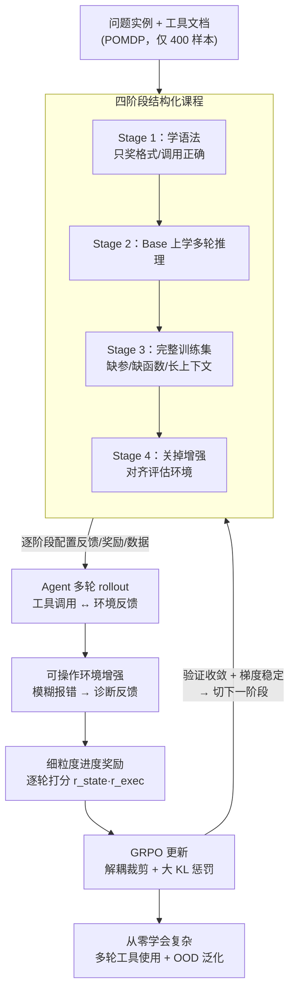

# Don't Just Fine-tune the Agent, Tune the Environment

**会议**: ICLR 2026  
**arXiv**: [2510.10197](https://arxiv.org/abs/2510.10197)  
**代码**: [https://github.com/inclusionAI/AWorld-RL/tree/main/EnvTuning](https://github.com/inclusionAI/AWorld-RL/tree/main/EnvTuning)  
**领域**: 强化学习 / LLM Agent  
**关键词**: Environment Tuning, LLM Agent, 多轮工具使用, 课程学习, 强化学习

## 一句话总结

提出 Environment Tuning 训练范式，通过结构化课程、可操作的环境增强反馈和细粒度进度奖励，使 LLM agent 仅用 400 个训练样本即可从零学会复杂的多轮工具使用，同时实现优异的分布外泛化能力。

## 研究背景与动机

LLM agent 在多轮工具使用任务中面临三大核心挑战：（1）**数据极度稀缺**——BFCL V3 多轮数据集仅有 800 个样本，高质量人工标注成本极高；（2）**环境复杂**——8 个不同领域、84 种工具需要跨域 API 调用和复杂编排；（3）**交互链长**——单个任务包含多轮用户查询，任意一轮失败即导致整体失败。

现有方案的关键矛盾在于：SFT 在合成轨迹上训练虽可快速获得能力，但容易过拟合、泛化性差；标准 RL 训练则存在严重的"冷启动"问题——初始能力不足的 agent 无法在庞大动作空间中有效探索，陷入低质量 rollout 的恶性循环，且长交互链导致训练不稳定、容易梯度爆炸。实验表明，直接在 400 样本上做单阶段 RL，训练在约 70 步后崩溃，仅获得约 10% 的改善。

本文的核心 idea 是：**与其在静态轨迹上模仿，不如让 agent 直接在经过精心设计的环境中学习**。通过"调环境"而非仅"调模型"，将失败的探索转化为有价值的学习信号。

## 方法详解

### 整体框架

Environment Tuning 把多轮工具使用建模为 POMDP，输入是问题实例与工具文档，输出是 agent 的工具调用和自然语言回答序列。它不在静态轨迹上做模仿，而是让 agent 在一个被精心改造的环境里直接探索学习，靠三个互补机制托底：结构化课程把学习难度从语法掌握逐级抬到去辅助泛化，可操作环境增强把模糊报错改写成有教学意义的诊断反馈，细粒度进度奖励则把稀疏的成败信号拆成逐轮的密集信号。整套流程是：课程决定每个阶段开/关哪些辅助、喂哪批数据，agent 在配置好的环境里多轮 rollout，环境增强和进度奖励塑造每一轮的反馈与信号，再用 GRPO 更新；一个阶段验证收敛且梯度稳定后才切到下一阶段。

### 关键设计

**1. 四阶段结构化课程：解决冷启动 agent 在巨大动作空间里无法有效探索的难题**

直接在 400 样本上做单阶段 RL，训练约 70 步后就会梯度爆炸崩溃、只换来约 10% 改善，原因是初始能力不足的 agent 在长交互链上探不到任何有效轨迹，陷入低质量 rollout 的恶性循环。课程的思路是"先学语法，再学推理，最后撤掉辅助轮子"。Stage 1 只要求 agent 产出格式正确、调用有效的工具，奖励设计为 $R_{\text{Stage1}} = I_{\text{tool}} \cdot (R_{\text{format}} + R_{\text{tool}})$，其中 $R_{\text{format}}$ 衡量 XML 格式正确率、$R_{\text{tool}}$ 衡量调用参数正确率，这一阶段迅速消除了 agent 只输出无用对话而不调用工具的"空轮次"。Stage 2 在 Base 数据集上开启进度奖励与环境增强，学基本的多轮推理；Stage 3 引入含缺失参数、缺失函数和长上下文的完整训练集，仍在增强反馈辅助下学习处理歧义和功能缺失；Stage 4 关掉环境增强，逼 agent 仅凭自身推理消化标准错误消息，从而对齐评估环境、保证分布外泛化。每个阶段必须同时满足验证准确率收敛和梯度范数稳定两个条件，才允许切换到下一阶段，这正是四阶段课程能全程保持梯度稳定、而单阶段 RL 会崩溃的关键。

**2. 可操作环境增强：把模糊报错改写成能指明下一步的诊断反馈**

标准环境的错误信息往往模糊甚至误导，让 agent 无从修正。环境增强的做法是把这些报错替换成精确、可操作的提示，帮 agent 看清工具间的依赖关系和工具内部的约束规则。比如订机票时误用城市名而非机场代码，标准环境只回 "No available route"，增强环境则回 "Invalid airport code[s]: destination airport 'Pinehaven'. Please use valid airport codes. You can use alternative tool to find the correct airport code for a city."，既点明错因又提示该去调哪个工具；又比如 `rm` 命令不支持路径参数，标准环境回 "No such file or directory" 会把 agent 带偏，增强环境直接回 "Paths are not allowed. Specify only file/directory name in current directory." 纠正误解。这种"把死胡同改成学习机会"的反馈在 Missing Parameters 和 Missing Functions 这类复杂场景上带来超过 20% 的提升。

**3. 细粒度进度奖励：把稀疏的二值终端奖励拆成逐轮密集信号**

稀疏的成败奖励无法区分"几乎做对"和"完全做错"的轨迹，在长交互链上几乎不可学。进度奖励给每一轮 $t$ 都打分，取环境状态评估 $r_t^{\text{state}}$ 与执行结果评估 $r_t^{\text{exec}}$ 的乘积，总奖励是所有轮次的平均成功率 $R_P = \frac{1}{T}\sum_{t=1}^{T} r_t^{\text{state}} \cdot r_t^{\text{exec}}$。消融显示，若把它换回二值奖励，Stage 3 的复杂任务直接训练失败，说明密集进度信号是长链任务能学起来的前提。

### 损失函数 / 训练策略

训练基于改进的 GRPO 算法（类 PPO），加入解耦裁剪机制和 KL 散度惩罚：

$$\mathcal{L}(\theta) = -\mathbb{E}_t\left[\min(r_t(\theta)\hat{A}_t, \text{clip}(r_t(\theta), 1-\epsilon_{\text{low}}, 1+\epsilon_{\text{high}})\hat{A}_t)\right] + \beta D_{\text{KL}}(\pi_\theta \| \pi_{\text{ref}})$$

关键超参数：$\beta = 0.1$（较大的 KL 系数对防止策略坍塌至关重要），$\epsilon_{\text{low}} = 0.2$，$\epsilon_{\text{high}} = 0.28$。优势函数通过组内归一化计算（无 critic 网络）。

## 实验关键数据

### 主实验

在 BFCL V3 多轮基准上的分布内结果（仅用 400 训练样本）：

| 模型 | 平均 (%) | Base (%) | Miss Func (%) | Miss Param (%) | Long Context (%) |
|------|----------|----------|-------------|----------------|-----------------|
| GPT-4o | 51.00 | 59.00 | 54.00 | 41.00 | 50.00 |
| o3 | 49.25 | 47.00 | 55.00 | 47.00 | 48.00 |
| xLAM-2-8b (SFT SOTA) | 70.50 | 77.85 | 69.15 | 65.80 | 69.20 |
| Qwen2.5-7B + EnvTuning | 36.92 | 50.33 | 40.33 | 29.33 | 27.67 |
| watt-tool-8B + EnvTuning | **54.34** | - | - | - | - |
| ToolACE-2 + EnvTuning | 47.18 | - | - | - | - |

分布外泛化（OOD）结果（BFCL V4 + ACEBench）：

| 模型 | Web Search (%) | ACEBench Agent (%) |
|------|---------------|-------------------|
| xLAM-2-8b (SFT) | 5.00 | 1.65 |
| ToolACE-2 | 9.00 | 8.34 |
| ToolACE-2 + EnvTuning | 14.00 | **15.00** |
| Llama + EnvTuning | **15.00** | 4.17 |

### 消融实验

| 配置 | 平均准确率 | 说明 |
|------|----------|------|
| Qwen2.5-7B 基础 | 7.00% | 直接推理 |
| + 直接 GRPO | ~17% | 无课程的直接 RL，效果有限 |
| + 完整 EnvTuning | 36.92% | 比直接 GRPO 提升 19.5% |
| 无环境增强 | 下降 >20% | 在 Missing Param/Func 上损失巨大 |
| 二值奖励替换进度奖励 | Stage 3 训练失败 | 在复杂任务上完全无法学习 |

### 关键发现

- **SFT 严重过拟合**: xLAM-2 在分布内达 70.50%，但 OOD Web Search 暴跌至 5.00%，证明轨迹模仿的泛化性极差
- **环境增强在复杂场景至关重要**: 在 Missing Parameters 和 Missing Functions 上带来超过 20% 的提升
- **KL 系数需要较大值**: $\beta = 0.1$ 比常用的 0.001 效果好得多，能有效维持策略熵、防止过早坍塌
- **单阶段 RL 在约 70 步后梯度爆炸**，而四阶段课程全程保持梯度范数稳定

## 亮点与洞察

- **范式创新**: 从"在轨迹上模仿"转向"在环境中探索"，是 LLM Agent 训练思路的重要转变。不需要任何专家示范轨迹，仅需问题实例即可训练
- **数据效率极高**: 仅 400 个问题实例就能训练出超越多个专有模型的 agent，这对数据稀缺场景意义重大
- **环境工程的重要性**: 环境反馈质量直接决定了 RL 探索效率，为环境设计提供了方法论——错误信息应该是可操作的、诊断性的
- **Case Study 精彩**: 通过文件系统、旅行 API、车辆控制三个场景清晰展示了增强反馈如何将"死胡同"变为"学习机会"
- **课程设计的阶段切换策略**（验证准确率收敛 + 梯度稳定）是工程实践中的有用经验

## 局限与展望

- **环境增强需要人工设计**: 当前的可操作反馈需要针对每个环境手动编写，自动化机制是重要的未来方向
- **分布内性能仍有差距**: 与使用大规模合成数据的 SFT 方法（如 xLAM-2 的 70.50%）相比仍有差距，说明数据量和探索效率的权衡仍有改进空间
- **泛化范围有限**: OOD 评估主要在 BFCL V4 和 ACEBench 上，更广泛的多模态 agent 场景尚未验证
- **仅在 7-8B 模型上验证**: 更大规模模型的表现未知，课程设计是否需要随模型规模调整也未探讨
- **课程阶段数和数据分配策略**的自动化确定是有价值的研究方向

## 相关工作与启发

- **SFT memorizes, RL generalizes**（Chu et al., 2025）的核心发现在本文中得到了充分验证——SFT 在 OOD 上的坍塌是普遍现象
- **与 ReCall、ARTIST 的对比**说明了直接 RL 在复杂多轮环境中的局限性，课程学习是必要的
- **环境增强思想**可推广到其他 Agent RL 领域：通过工程化环境反馈来引导探索，比改变奖励函数更自然
- **启发**: 在 LLM Agent 的自动训练流水线中，环境设计和奖励工程同样重要，值得系统性研究

## 评分

- 新颖性: ⭐⭐⭐⭐⭐
- 实验充分度: ⭐⭐⭐⭐
- 写作质量: ⭐⭐⭐⭐⭐
- 价值: ⭐⭐⭐⭐⭐

<!-- RELATED:START -->

## 相关论文

- [\[ICLR 2026\] TRACED: Transition-aware Regret Approximation with Co-learnability for Environment Design](traced_transition-aware_regret_approximation_with_co-learnability_for_environmen.md)
- [\[ICLR 2026\] Proximal Supervised Fine-Tuning](proximal_supervised_fine-tuning.md)
- [\[ICLR 2026\] Structured In-context Environment Scaling for Large Language Model Reasoning](structured_in-context_environment_scaling_for_large_language_model_reasoning.md)
- [\[ICLR 2026\] Q-Learning with Fine-Grained Gap-Dependent Regret](q-learning_with_fine-grained_gap-dependent_regret.md)
- [\[ACL 2026\] A Goal Without a Plan Is Just a Wish: Efficient and Effective Global Planner Training for Long-Horizon Agent Tasks (EAGLET)](../../ACL2026/reinforcement_learning/a_goal_without_a_plan_is_just_a_wish_efficient_and_effective_global_planner_trai.md)

<!-- RELATED:END -->
