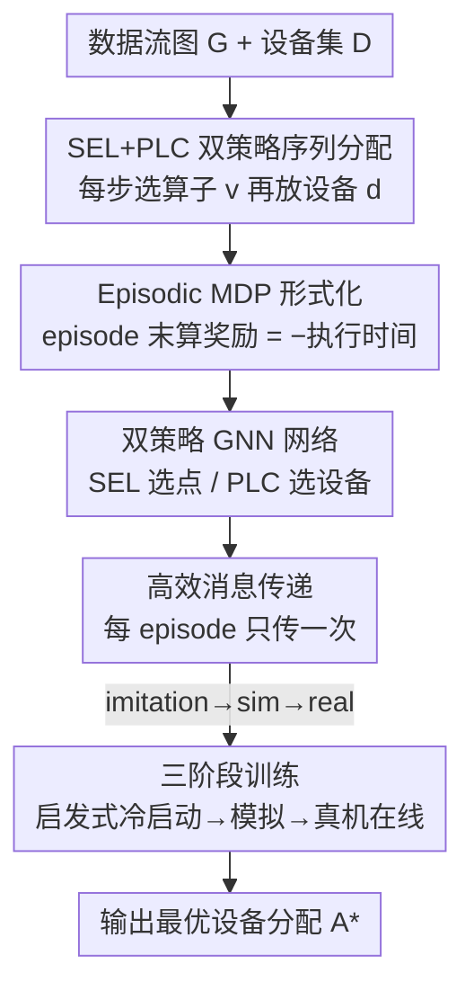

# DOPPLER: Dual-Policy Learning for Device Assignment in Asynchronous Dataflow Graphs

**会议**: ICLR2026  
**OpenReview**: [https://openreview.net/forum?id=OQQK8gMC5H](https://openreview.net/forum?id=OQQK8gMC5H)  
**代码**: https://github.com/xinyuyao/Doppler  
**领域**: 强化学习 / 设备分配 / 图调度  
**关键词**: 设备分配, 工作守恒调度, 双策略强化学习, 图神经网络, 数据流图

## 一句话总结
DOPPLER 把"把数据流图的算子分配到多块 GPU 上以最小化执行时间"建模成一个序列决策问题，用一对策略（SEL 选下一个算子、PLC 给它选设备）配合三阶段训练（模仿学习 → 模拟器 RL → 真机在线 RL），在异步、工作守恒（work-conserving）的执行环境下把执行时间相比最强基线最多降低 52.7%。

## 研究背景与动机
**领域现状**：现代深度学习系统（PyTorch、TensorFlow、JAX）执行计算图时普遍采用**批量同步**（bulk-synchronous）方式——一层算子全部算完，才能进入下一层的聚合/通信。以三矩阵链乘 $X\times Y\times Z$ 为例，每个矩阵切成 4 块分到 8 块 GPU，先做所有成对子矩阵乘法，全部完成后才能做聚合再算下一步。

**现有痛点**：这种 lock-step 执行有两个硬伤。其一，一个慢算子拖垮整层——聚合必须等最慢的那次乘法；其二，聚合阶段是通信主导的，此时 GPU 严重闲置。论文用实测说明：换成**工作守恒（WC）**调度器（只要资源能用就绝不让它闲着、动态地把能跑的算子立即下发）后，CHAINMM 工作负载执行时间从 185.3 ms 降到 139 ms（降 33%），FFNN 从 76.9 ms 降到 50.2 ms（降 53%）。在 ChatGPT 量级（每天百万次查询）的长期部署下，每次查询省下的几十毫秒能累积成每年超过 240 万 GPU 小时。

**核心矛盾**：WC 系统虽快，却让**设备分配**变得极难。批量同步靠 all-reduce 固定了执行顺序，而 WC 靠异步点对点通信，没有全局同步——执行顺序难以控制，性能对硬件异构和资源竞争高度敏感。一个好的分配必须同时平衡两个相互冲突的目标：（1）GPU 负载均衡；（2）最小化 GPU 间通信。传统放置方法只盯着通信最小化，但在 WC 调度器下执行顺序是随机的，负载均衡本质上是**时序问题**，变得格外棘手。

**核心矛盾的更深一层**：WC 系统里同一个分配 $A$ 每次跑出来的时间都不一样（执行顺序随机），根本写不出 $\text{ExecTime}(A)$ 的闭式表达。没有可微目标函数，就没法直接优化。

**本文目标**：在异步 WC 系统里学一个设备分配策略，既能捕捉随机执行动态，又能兼顾硬件约束。

**切入角度**：既然没有闭式目标，那就**边做边学**（learning-by-doing）——把分配丢进（模拟或真实的）WC 系统里跑，拿观测到的运行时当奖励。而且把"先选哪个算子、再放哪块设备"这两个本质不同的决策**拆成两个策略**，分别建模执行动态与硬件约束。

**核心 idea**：用"选择策略 SEL（决定下一个被分配的算子，相当于近似 WC 系统里那个不确定的'时间'流向）+ 放置策略 PLC（决定该算子放哪块 GPU）"的双策略序列决策替代以往的单一放置策略，再用三阶段训练把它从启发式冷启动一路打磨到真机在线自适应。

## 方法详解

### 整体框架
DOPPLER 要解决的是：给定一张静态数据流图 $G=\langle V,E\rangle$（顶点是计算核函数调用，边是数据依赖）和一组设备 $D$，求一个映射 $A:V\to D$ 使整图在 WC 系统下的执行时间最短。它的整体转法是：**把"构造一个完整分配"看成一个 episode**——在 $|V|$ 步里，每一步由 SEL 从候选集里挑一个还没分配的算子 $v$，再由 PLC 给 $v$ 选一块设备 $d$，逐步拼出整张图的分配 $A$；episode 结束后把 $A$ 丢进 WC 系统（模拟器或真机）跑一遍，拿负的执行时间当奖励，回头更新两个策略。两个策略都用图神经网络（GNN）编码数据流图、用前馈网络解码动作。

外层训练分三个阶段递进：先用**模仿学习**让双策略模仿一个现成的列表调度启发式（CRITICAL PATH）冷启动；再切到**模拟器强化学习**，用实现了 WC 调度逻辑的软件模拟器算奖励；最后**真机强化学习**，把策略部署到真实多 GPU 系统上，用服务请求时"白嫖"观测到的真实运行时持续在线微调。

### 关键设计

**1. SEL+PLC 双策略序列分解：把"何时调度"和"放在哪"拆开学**

以往的学习式放置（PLACETO、GDP、Mirhoseini 等）只学**一个**放置策略——给定算子直接吐设备。但在 WC 系统里，性能既取决于算子被调度的（近似）时间顺序，又取决于它落在哪块设备上，这两件事的语义完全不同。DOPPLER 因此用一个序列过程 $\text{ASSIGN}(\text{SEL}_\theta,\text{PLC}_\theta)$（论文 Algorithm 3）来构造分配：在 $t'\in\{1,\dots,m\}$ 的每一步，先 $v\leftarrow\text{SEL}_\theta(A,G)$ 选出下一个要分配的顶点，再 $d\leftarrow\text{PLC}_\theta(A,G,v,D)$ 给它选设备，然后把 $(v\to d)$ 加进 $A$。SEL 通过遍历"已部分分配的数据流图"来近似 WC 系统里那个不确定的"时间"流向（哪个算子大概会先被执行就先分配它），从而把执行动态显式编码进决策顺序；PLC 则专注于在这个顺序下做负载均衡与通信最小化。这种分离让模型同时吃进执行动态和硬件约束，产出真正贴合随机 WC 执行的分配，而不是像单策略那样把两类信息糊在一起。

**2. Episodic MDP + bandit 奖励：给无闭式目标的问题套上可优化的壳**

设备分配本质是一个 bandit 问题，臂数高达 $D^{|V|}$——比如 8 块 GPU、100 个顶点的图就有约 $2^{300}$ 种分配，经典 bandit 解法根本玩不转。论文的破局点是利用分配的**组合结构**：若两个分配 $A_1,A_2$ 只在少数顶点上不同，它们的奖励分布大概率相近，因此可以系统化地序列搜索。把 $\text{ASSIGN}$ 当成每个 time tick 选臂的机制后，问题被重写成一个**episodic MDP** $(\mathcal{S},\mathcal{A},H,P,R)$，horizon $H$ 等于图的节点数。状态 $s_h=(X_G,C_h,X_{D,h})$ 含静态图特征（节点/边特征，如到入口/出口节点的 bottom-level、top-level 路径长度、通信代价）、动态候选节点集 $C_h$、动态设备特征（各设备累计计算时间、计算结束时间）；动作 $a_h=(v_h,d_h)$ 同时选节点和设备；奖励只在 episode 末计算 $R_{s_H}=(-1)\times\text{ExecTime}(s_H)$，中间步奖励置零以提效。为稳定训练，还减掉一个基线——历史所有 episode 的平均执行时间 $\overline{R_{s_H}}$，最终奖励 $r_H=R_{s_H}-\overline{R_{s_H}}$，优化目标是最小化遗憾 $\rho=\sum_{t=1}^{T}\big(\mathbb{E}[R^*]-r_t\big)$。这样一来，任意标准策略梯度 RL 算法都能用来学 SEL 和 PLC。

**3. 双策略 GNN 网络 + 高效消息传递：让策略既懂图结构又跑得动**

SEL 和 PLC 都建在一个 $K$ 层消息传递 GNN 上，节点表示按 $h_v^{[k]}=\phi\big(h_v^{[k-1]},\bigoplus_{u\in N(v)}\psi(h_u^{[k-1]},h_v^{[k-1]},e_{uv})\big)$ 迭代更新，GNN 天然契合数据流图——沿依赖边传播信息、捕捉关键路径与通信边、还能泛化到不同大小的图。**SEL（选点）**：把每个候选节点 $v$ 的 GNN 表示 $H[v]$、它的 b-path / t-path 关键路径嵌入 $h_{v,b}\,\|\,h_{v,t}$（到入口/出口最长路径上节点的聚合）、以及特征表示 $Z[v]$ 拼成 $h_v$，过 FFNN 后 softmax 得 $Q_G(v)$，用 $\epsilon$-greedy 选 $\arg\max_v Q_G(v)$。**PLC（选设备）**：把节点表示 $H[v]$、已放到该设备上的节点聚合 $h_d$、设备特征 $Y[d]$、节点特征 $Z[v]$ 拼成 $h_{v,d}$，堆成设备嵌入矩阵 $H_D$，过 LeakyReLU+FFNN+softmax 得 $Q_D(d)$，同样 $\epsilon$-greedy 选设备。

关键的工程突破在**高效消息传递近似**：朴素做法要在每个 MDP step 调 SEL/PLC 时都做一轮消息传递，实验里高达 8k episode × 261 step ≈ 200 万步，PLACETO 正因每步一轮消息传递而训练极慢。DOPPLER 改成**每个 episode 只做一次消息传递**，每步新增的分配信息只更新进 $X_{D,h}$（动态设备特征）而不再重新传播图。实测这个改动对收敛几乎无影响，却大幅缩短训练时间，尤其在大网络上。

**4. 三阶段训练：从启发式冷启动一路爬到真机在线自适应**

直接在真机上从零强化学习有两个致命问题：初始策略太差导致探索期产生超长运行时（用户不可接受）、收敛慢且不稳定。DOPPLER 因此设计了递进的三阶段（论文 Fig. 3）。**Stage I 模仿学习（离线）**：让双策略模仿一个现成的列表调度教师 CRITICAL PATH，目标 $J(\theta)=\mathbb{E}_{a_{cp}\sim\Pi_{cp}(s)}[\nabla_\theta\log\Pi_\theta(a_{cp}|s)]$，相当于让策略先学会"把相邻顶点放同一设备"这类基本常识，给后续 RL 一个好起点、加速收敛。**Stage II 模拟器 RL（离线）**：策略生成的分配丢进实现了 WC 调度逻辑（Algorithm 1）的软件模拟器跑，模拟器只在 episode 末调用一次拿运行时，用策略梯度 $J(\theta)=\mathbb{E}_{a\sim\Pi_\theta(s)}[\nabla_\theta(\log\Pi_\theta(a|s))R(s,a)]$ 更新。**Stage III 真机 RL（在线）**：类比 sim-to-real——没有模拟器能完美刻画真实 GPU 竞争、NVLink 抖动、系统级调度噪声，所以部署后做轻量在线微调。由于前两阶段已给出高质量策略，部署时不会让用户经历漫长 warm-up 或不稳定探索；而且奖励信号是"免费"的——系统在正常服务请求时自然就观测到真实 $\text{ExecTime}$，DOPPLER 得以在生产环境里零额外开销地持续自我改进。

### 损失函数 / 训练策略
三阶段对应三个目标：模仿学习用对教师动作的对数似然梯度（式 9）；两个 RL 阶段都用带基线的 REINFORCE 式策略梯度（式 10），奖励为负执行时间减历史均值。超参方面：CHAINMM/FFNN 跑 4k episode，LLAMA-BLOCK/LLAMA-LAYER 跑 8k；DOPPLER 学习率 $1\text{e-}4$ 线性降到 $1\text{e-}7$，探索率 0.2 线性降到 0，熵权重 $1\text{e-}2$。

## 实验关键数据

### 主实验
在 4 块 NVIDIA Tesla P100（16GB）上对比真机执行时间（ms，越低越好）。DOPPLER-SYS 用全部三阶段，DOPPLER-SIM 只用 Stage I+II：

| 模型 | CRIT. PATH | PLACETO | GDP | ENUMOPT. | DOPPLER-SIM | DOPPLER-SYS | 相比最优基线降幅 |
|------|-----------|---------|-----|----------|-------------|-------------|------|
| CHAINMM | 230.4 | 137.1 | 198.0 | 139.0 | 122.5 | **123.4** | 10.7% |
| FFNN | 217.8 | 126.3 | 100.3 | 50.2 | 49.9 | **47.4** | 52.7% |
| LLAMA-BLOCK | 230.9 | 411.5 | 336.5 | 172.7 | 191.5 | **160.3** | 30.6% |
| LLAMA-LAYER | 292.6 | 295.1 | 231.5 | 174.8 | 167.0 | **150.6** | 48.5% |

DOPPLER-SYS 在多数设置下击败所有基线，相比 CRITICAL PATH 最多降 78.2%、相比 PLACETO 最多降 62.5%、相比 GDP 最多降 52.7%；即便对比作者自研的强基线 ENUMERATIVEOPTIMIZER 也最多再降 13.8%。

### 消融实验
**双策略消融（Q2）**：把某个策略换成 CRITICAL PATH 策略——DOPPLER-SEL 把选中节点丢给最早可用设备，DOPPLER-PLC 用"到出口最长路径"选节点。

| 模型 | DOPPLER-SYS（双策略） | DOPPLER-SEL | DOPPLER-PLC |
|------|------|------|------|
| CHAINMM | 123.4 | 127.0 | 121.6 |
| FFNN | **47.4** | 59.1 | 63.2 |
| LLAMA-BLOCK | **160.3** | 175.6 | 172.9 |
| LLAMA-LAYER | **150.6** | 161.7 | 159.5 |

除 CHAINMM 上 DOPPLER-PLC 略快几毫秒外，越复杂的模型上双策略协同优势越明显。

### 关键发现
- **三阶段缺一不可（Q3）**：只在真机上训练（缺 Stage I/II）因要从糟糕初始模型探索而收敛慢、性能不稳；加上模仿学习和模拟器后收敛更快、执行时间更低。
- **迁移能力强（Q5）**：从简单图（FFNN/CHAINMM）迁到 Llama 结构图，仅 2K 微调 episode 就能超过基线，4K episode（不到原训练一半）即可逼近完整训练效果。跨硬件（4×P100→8×V100）时，零样本下 82.7% 通信在 GPU 内、10.6% 跨无 NVLink 的 GPU；2K episode 后 GPU 内通信升到 94.7%（↑12.0%）、跨无 NVLink 通信降到 3.4%（↓7.2%）。
- **可扩展性（Q6）**：训练与推理时间随图节点数**线性**增长，且在 RL 基线（如 GDP）里训练/推理时间最低。
- **分配可解释（Q4）**：可视化 FFNN 分配显示 DOPPLER 同时做到了沿关键路径的负载均衡与通信最小化，profiling 进一步发现它的分配常让通信与计算跨 GPU 重叠、减少 stall。

## 亮点与洞察
- **把"时间"显式建进策略**：SEL 通过遍历部分分配图来近似 WC 系统里随机的执行时间流向，这是它区别于一切单策略放置方法的根本——它不是只决定"放哪"，而是先决定"按什么顺序考虑"，从而把异步执行的时序信息注入决策。
- **每 episode 一次消息传递**这个工程取舍非常实用：把更新后的分配信息塞进设备特征 $X_{D,h}$ 而非重新传播全图，在几乎不损收敛的前提下把 200 万步级别的训练成本砍下来，这个 trick 可直接迁移到其他"图上逐步决策"的 RL 任务。
- **奖励"免费"获取**的 Stage III 设计很巧：在线服务本来就要执行分配、本来就能观测运行时，于是持续学习不需要任何额外开销或对用户的打扰——这让 RL 调度器真正具备了生产可用性。
- **三阶段 = 课程式难度递进**：启发式监督（最简单、最稳）→ 模拟器 RL（无真机风险）→ 真机 RL（最真实但最贵），层层把好处叠加、把风险后置，是 sim-to-real 在系统调度场景的一个干净落地。

## 局限与展望
- **依赖静态数据流图**：方法建立在"图结构在训练/推理期间基本固定"的假设上（Transformer、MoE 确实如此），对结构高度动态的工作负载适用性存疑。
- **模拟器保真度**：Stage II 的软件模拟器无法完美刻画真实 GPU 竞争、NVLink 抖动等，虽由 Stage III 弥补，但模拟与真机的差距大时 Stage III 的微调负担会更重。
- **大图论证略弱**：作者论证"更大的图不会显著更复杂，因为大规模训练靠数据并行和流水线"，但这把超大模型的设备分配挑战部分外推掉了，真正万节点级图上的表现仍待验证。
- **实验硬件规模有限**：主实验在 4×P100、最多 8×V100 上，离工业级数百上千卡集群尚有距离。

## 相关工作与启发
- **vs CRITICAL PATH（经典列表调度）**：列表调度把问题拆成 select+place 两步序列，DOPPLER 可看作"神经化的列表调度启发式"——用 MDP 从观测里直接学 select 和 place，实验上稳定超过 CRITICAL PATH（最多降 78.2%），且它还把 CRITICAL PATH 当 Stage I 的教师。
- **vs PLACETO**：PLACETO 是 RL 放置方法，但只用单一（设备）策略、且每个 MDP step 做一轮消息传递导致训练极慢；DOPPLER 用双策略 + 每 episode 一次消息传递，既建模了选择顺序又大幅提速。
- **vs GDP**：GDP 用图嵌入 + 序列注意力的单策略 RL，DOPPLER 的双策略分解在复杂模型上最多再降 52.7%，且训练/推理时间随图规模增长更慢。
- **vs ENUMERATIVEOPTIMIZER（作者自研强基线）**：后者人工利用分片张量计算的结构做枚举优化，DOPPLER 在多数设置下仍能再降最多 13.8%，说明学习式方法能挖出人工启发式看不到的分配模式。

## 评分
- 新颖性: ⭐⭐⭐⭐ 双策略分解 + 把执行时序显式建进 SEL 是对 WC 设备分配的扎实创新。
- 实验充分度: ⭐⭐⭐⭐ 四类工作负载、双策略消融、三阶段消融、跨图跨硬件迁移、可扩展性都覆盖到了，但硬件规模偏小。
- 写作质量: ⭐⭐⭐⭐ 动机层层递进、算法与公式交代清楚，Q1–Q6 组织实验很清晰。
- 价值: ⭐⭐⭐⭐ 异步 WC 调度在大规模训练/推理里越来越重要，最多 52.7% 提速且能在线免费学习，落地价值高。

<!-- RELATED:START -->

## 相关论文

- [\[ICLR 2026\] Breaking Safety Paradox with Feasible Dual Policy Iteration](breaking_safety_paradox_with_feasible_dual_policy_iteration.md)
- [\[ICLR 2026\] Primal-Dual Policy Optimization for Linear CMDPs with Adversarial Losses](primal-dual_policy_optimization_for_linear_cmdps_with_adversarial_losses.md)
- [\[ICLR 2026\] Dual Goal Representations](dual_goal_representations.md)
- [\[ICLR 2026\] Dual-Objective Reinforcement Learning with Novel Hamilton-Jacobi-Bellman Formulations](dual-objective_reinforcement_learning_with_novel_hamilton-jacobi-bellman_formula.md)
- [\[ICLR 2026\] Occupancy Reward Shaping: Improving Credit Assignment for Offline Goal-Conditioned Reinforcement Learning](occupancy_reward_shaping_improving_credit_assignment_for_offline_goal-conditione.md)

<!-- RELATED:END -->
