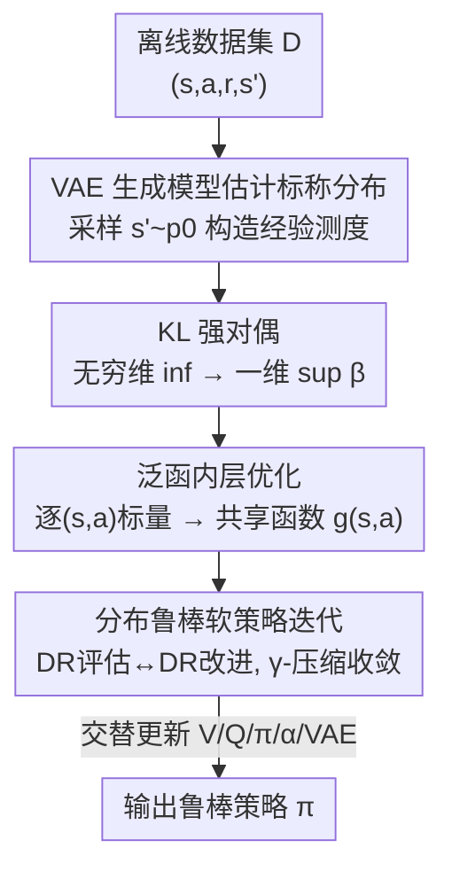

# DR-SAC: Distributionally Robust Soft Actor-Critic for Reinforcement Learning under Uncertainty

**会议**: ICLR2026  
**OpenReview**: [https://openreview.net/forum?id=a19MA0ksbc](https://openreview.net/forum?id=a19MA0ksbc)  
**代码**: https://github.com/Lemutisme/DR-SAC  
**领域**: 强化学习 / 分布鲁棒优化 / 离线RL  
**关键词**: 分布鲁棒RL, 软演员-评论家, 最大熵RL, KL散度不确定集, 生成模型

## 一句话总结
DR-SAC 是第一个面向连续动作空间、离线学习的 actor-critic 型分布鲁棒强化学习算法：它在以 KL 散度球刻画的转移分布不确定集上做"最坏情况下的最大熵优化"，给出带收敛保证的分布鲁棒软策略迭代，并用泛函化重写 + VAE 生成模型把算法落地到连续控制，扰动下平均回报最高比 SAC 高 9.8×、训练时间比已有 DR-RL 方法 RFQI 省 80% 以上。

## 研究背景与动机
**领域现状**：深度强化学习在游戏、机器人控制上已经很成功，离线 RL（只从固定数据集学策略、不再与环境交互）因为安全和数据效率好而越来越受关注。其中 Soft Actor-Critic（SAC）是最有代表性的算法之一——它在累积回报之外加一项策略熵正则 $\alpha\cdot H(\pi(s))$，鼓励探索、并有最大熵 RL 的理论支撑。

**现有痛点**：现实部署时，训练环境（或采集数据集的环境）和部署环境的转移分布往往不一致——参数漂移、观测噪声、执行器噪声、对抗扰动都会让"在标称环境里学好的策略"性能大幅滑坡。分布鲁棒 RL（DR-RL）用鲁棒马尔可夫决策过程（RMDP）来应对：不再假设单一 MDP，而是对标称分布周围一个不确定集里的"所有 MDP"求最坏情况最优。

**核心矛盾**：已有 DR-RL 几乎全是**表格设定下的 value-based 方法**，没法搬到连续动作空间。唯一能跑连续动作的是 Robust Fitted Q-Iteration（RFQI），但它有两处硬伤：其一，它的不确定集只能用全变差（TV）距离——TV 的对偶是分段线性、解析方便，但换成 KL 等其它散度就不成立；其二，它的非鲁棒底座 FQI 是 value-based，学出的是确定性策略、对高维动作空间适配差、对 Q 函数误差高度敏感。相比之下 actor-critic 兼具低方差价值估计和可扩展的策略优化，是连续控制的主流，却一直没有分布鲁棒版本。

**本文目标**：补上这个空白——做出第一个 actor-critic 型、能在连续动作空间离线学习的 DR-RL 算法，并把不确定集换成更通用的 KL 散度球。需要解决三个子问题：(1) 怎样把"最坏分布"这个无穷维内层优化变得可算；(2) 离线时标称转移分布 $p^0_{s,a}$ 未知，怎么估；(3) 怎样从"逐 $(s,a)$ 求最优"扩展到连续动作空间还不爆炸。

**核心 idea**：在 KL 球上对最大熵 RL 做分布鲁棒化，先用强对偶把无穷维内层优化压成一维标量优化，再用"泛函内层优化 + VAE 估计标称分布"把它工程化到连续离线控制。

## 方法详解

### 整体框架
DR-SAC 要解的是这样一个问题：给定一份离线数据集 $D=\{(s_i,a_i,r_i,s'_i)\}$，部署环境的真实转移分布落在以标称分布 $p^0_{s,a}$ 为中心、半径 $\delta$ 的 KL 球 $P_{s,a}(\delta)=\{p:D_{KL}(p\|p^0_{s,a})\le\delta\}$ 内，目标是学一个在**最坏转移分布**下也能最大化软价值函数（带熵正则）的策略。

整体上算法分三层、由内到外搭起来：(1) 理论层先给出"分布鲁棒软策略迭代"——把 SAC 的软贝尔曼算子换成对最坏分布取下确界的鲁棒版本，并证明它仍是 $\gamma$-压缩、迭代收敛到鲁棒最优策略；(2) 可算层用 KL 强对偶把"对无穷多分布求 inf"变成"对一个标量 $\beta$ 求 sup"，再用"最小化与积分可交换"的性质把逐 $(s,a)$ 的标量优化合并成一个共享的**泛函优化**，彻底摆脱状态-动作维度；(3) 落地层用 VAE 估计未知的标称转移分布、生成下一状态样本构造经验测度，绕过 KL 非线性对偶里的"双采样"难题；最后把 V/Q/策略都用神经网络参数化，按 SAC 的训练循环跑。

### 关键设计

**1. 分布鲁棒最大熵框架与软策略迭代：把"最坏分布"装进 SAC 并保住收敛**

针对"现有 DR-RL 都是表格 value-based、没有 actor-critic 鲁棒版本"这个空白，本文把 SAC 的软贝尔曼算子改造成分布鲁棒版本。标准软贝尔曼算子里对下一状态取期望，鲁棒版本则先对不确定集里的最坏转移分布取下确界：

$$\mathcal{T}^\pi_\delta Q(s,a) := \mathbb{E}[r] + \gamma\cdot\inf_{p_{s,a}\in P_{s,a}(\delta)}\Big(\mathbb{E}_{p_{s,a},\pi}\big[Q(s',a')-\alpha\log\pi(a'|s')\big]\Big).$$

算法在"DR 软策略评估"（反复施加 $\mathcal{T}^\pi_\delta$ 估出鲁棒 Q）和"DR 软策略改进"（用鲁棒 Q 替换非鲁棒 Q，按 $\pi_{k+1}=\arg\min_\pi D_{KL}(\pi(\cdot|s)\|\exp(\frac{1}{\alpha}Q^{\pi_k}_{M_\delta})/Z)$ 更新策略）之间交替。论文证明三件事：$\mathcal{T}^\pi_\delta$ 是 $\gamma$-压缩映射（故策略评估收敛到鲁棒 Q）、策略改进让鲁棒 Q 单调不减、整个迭代收敛到鲁棒最优策略 $\pi^\star$。这把 SAC 的全套理论性质完整搬到了 RMDP 上，是后面所有工程化的地基。

**2. KL 强对偶：把无穷维的最坏分布搜索压成一维标量优化**

直接算 $\mathcal{T}^\pi_\delta$ 要在转移分布空间上解无穷维优化，不可行。本文对"KL 球上的最坏期望"用强对偶，得到只依赖标称分布、且内层只剩一个标量 $\beta$ 的等价形式：

$$\mathcal{T}^\pi_\delta Q(s,a) = \mathbb{E}[r] + \gamma\cdot\sup_{\beta\ge 0}\Big\{-\beta\log\big(\mathbb{E}_{p^0_{s,a}}[\exp(-V(s')/\beta)]\big)-\beta\delta\Big\},$$

其中 $V(s)=\mathbb{E}_{a\sim\pi}[Q(s,a)-\alpha\log\pi(a|s)]$。这一步的关键在于：对偶形式**只用到标称分布 $p^0_{s,a}$**（不用枚举不确定集里那无穷多个分布），且内层从无穷维分布优化降成对标量 $\beta$ 的一维优化。这正是 KL 球相比 TV 球的代价与回报——KL 对偶是非线性指数形式（带来后面的双采样麻烦），但换来了对 KL 这一更常用散度的支持，补上了 RFQI 只能用 TV 的局限。

**3. 泛函内层优化：用一个共享函数 $g(s,a)$ 替掉逐 $(s,a)$ 的标量优化**

对偶虽然把内层降成一维，但**每个 $(s,a)$ 都要单独解一次 $\beta$**，大规模下仍然昂贵，且天然依赖状态-动作空间。本文用可分空间上"最小化与积分可交换"的性质（Rockafellar & Wets），把一堆逐点标量优化合并成对一个函数的单一泛函优化：

$$\mathbb{E}_{(s,a)\sim D}\Big[\sup_{\beta\ge 0} f((s,a),\beta)\Big] = \sup_{g\in\mathcal{G}}\mathbb{E}_{(s,a)\sim D}\big[f((s,a),g(s,a))\big],$$

直观上就是：不再在每个状态-动作对上分别求最优 $\beta^\star$，而是学一个函数 $g(s,a)$（用神经网络 $G_\eta$ 逼近）一次性逼近所有这些最优值。这样优化规模从 $|D|$ 个标量问题降为 1 个泛函问题，**摆脱了对状态-动作维度的依赖**、能用到连续动作空间，也是训练时间比 RFQI 省 80%+ 的主因（RFQI 每次更新要 1000 步梯度下降找最优函数，DR-SAC 只需约 5 步）。

**4. VAE 生成建模：估计未知标称分布、化解 KL 对偶的双采样难题**

离线设定下标称分布 $p^0_{s,a}$ 未知、也没有模拟器可额外采样；而 KL 对偶里的 $\mathbb{E}_{p^0_{s,a}}[\exp(-V(s')/\beta)]$ 是**非线性**的，直接用数据集里的样本估会遇到"双采样问题"（同一期望里既要采样估内层、又要采样估外层，经验风险最小化失效）。本文训练一个 VAE 在 $(s,a,s')$ 上学转移 $p^0_{s,a}$，再用它生成多份下一状态样本 $\{\tilde s'_i\}_{i=1}^m$ 构造经验测度 $\tilde p^0_{s,a}$，把期望写成 $\frac{1}{m}\sum_i h(\tilde s'_i)$——因为可以从同一个 $(s,a)$ 多次生成下一状态，就避开了双采样。据作者所知，这是首个把 VAE 用进 DR-RL 来估计标称转移分布并合成样本的工作。落地时 Q 网络的损失即拟合泛函鲁棒贝尔曼目标 $J^{DR}_Q(\theta)=\mathbb{E}_{(s,a)\sim D}[\frac12(Q_\theta(s,a)-\mathcal{T}^\pi_{\delta,\tilde g^\star}Q_\theta(s,a))^2]$，V/策略/温度 $\alpha$ 的损失同 SAC，VAE 用标准 ELBO。

### 损失函数 / 训练策略
算法采用带显式 V 网络的 SAC-v1 版本（作者发现加 V 网络能降低对离线数据集行为策略的敏感性），并用多个 Q 网络独立训练、取最小值更新 V/策略以缓解过估计偏差（在离线 RL 中优于 clipped double Q-learning）。每个梯度步依次更新：VAE 权重 → 用 VAE 生成样本构造经验测度并求最优函数 $\tilde g^\star$ → V 网络 → 各 Q 网络 → 策略 → 温度 → 目标网络软更新。论文还在附录给出了 regret bound。

## 实验关键数据

### 主实验
在 Gymnasium / MuJoCo 的 5 个连续控制任务（Pendulum、Cartpole、LunarLander、Reacher、HalfCheetah）上，所有算法在标称环境训练、在各种扰动下评估（参数漂移、观测高斯噪声、执行器随机噪声）。对比对象包括非鲁棒基线 SAC、FQI、DDPG、CQL，以及唯一可用于连续动作的离线 DR-RL 算法 RFQI。

| 环境 / 扰动 | 指标 | DR-SAC | 对比 | 结论 |
|--------|------|------|----------|------|
| Pendulum 长度扰动 20% | 平均回报 | — | SAC | 比 SAC 高 35% |
| LunarLander 引擎功率 −20% | 平均回报 | 240 | 其它均 <180 | 显著领先 |
| LunarLander 引擎功率 −30% | 平均回报倍率 | 9.8× SAC | SAC | 最高 9.8 倍 |
| HalfCheetah back_damping ±50% | 平均回报 | >6300（稳定） | SAC <5950（持续下滑） | 更稳更高 |
| Reacher 观测噪声 / damping | 平均回报 | 全噪声水平最佳 | SAC 等 | 各档领先 |

### 消融实验

| 配置 | 关键指标 | 说明 |
|------|---------|------|
| DR-SAC-Functional（完整） | 训练时间 <2% of Accurate | 泛函近似几乎不损鲁棒性 |
| DR-SAC-Accurate（逐点精确算子） | 鲁棒性相当但极慢 | 验证泛函近似的价值 |
| vs RFQI（训练时间，Cartpole/LunarLander/Reacher） | 4/36/32 min vs 93/238/159 min | RFQI 最高需 23.2× 训练时间 |
| VAE latent dim 5~20 | 鲁棒性不变 | 对 VAE 隐维不敏感 |
| diffusion / flow 替代 VAE | flow 不稳定；diffusion 需 ≥4.5× 训练时间 | 故选 VAE |

### 关键发现
- **泛函近似是效率核心**：DR-SAC-Functional 用不到 2% 的精确算子训练时间就拿到相当甚至更好的鲁棒性；与 RFQI 的效率差距主要来自优化复杂度——RFQI 每次更新需 1000 步 GD，DR-SAC 仅需约 5 步，减少 GD 步数会让 RFQI 即使在无扰动环境也严重掉点。
- **对生成模型选择鲁棒**：VAE 隐维在 5~20 间变化都不损性能；flow-based 在无扰动 Pendulum 上就不稳定，diffusion 鲁棒性相当但训练慢 4.5×+，故 VAE 是效率-鲁棒性的最佳折中（但作者强调 VAE 非唯一选择，可按任务替换）。
- **FQI/RFQI 在某些环境连标称都跑不好**：作者归因于 FQI 基于 BCQ、把动作限制在行为策略附近，与本文 epsilon-greedy 数据生成过程冲突；这是离线 RL 对数据集分布的敏感性问题，超出本文范围。

## 亮点与洞察
- **"理论保收敛 → 对偶降维 → 泛函化去维度 → 生成模型补未知分布"四步递进**：每一步都精准对掉一个落地障碍（无穷维内层、逐点优化、未知标称分布、双采样），逻辑闭合，是把一个表格理论一路推到连续离线控制的范本。
- **泛函内层优化这一招可迁移**：凡是"对偶后每个样本点都要单独解一个小优化"的鲁棒/分布鲁棒问题，都可以考虑用"最小化与积分可交换"把逐点优化换成学一个共享函数，从而摆脱维度依赖——这对其它 DR-RL（甚至分布鲁棒监督学习）都有借鉴意义。
- **用 VAE 解双采样问题很巧**：双采样的根源是"无法从同一条件分布多次独立采样"，而生成模型恰恰能任意多次条件生成，于是把统计难题转成了建模问题——这是把生成式建模引入鲁棒离线 RL 的新接口。

## 局限与展望
- **依赖 VAE 估计精度**：经验测度由 VAE 生成的样本构成，标称分布估计的偏差会传进鲁棒目标；论文虽显示对隐维不敏感，但在更高维/更复杂转移上 VAE 误差的影响仍是隐患。
- **理论假设 $|A|<\infty$**：收敛性证明继承自 SAC 的有限动作假设（为保证熵有界），连续动作空间是靠神经网络近似实际落地，理论与实现之间存在 gap。
- **KL 球这一不确定集形状的选择**：KL 对偶是非线性、带来双采样，虽用 VAE 化解，但不同散度（如 Wasserstein）能否套同样框架、代价如何，论文未展开。
- **离线 RL 对数据集分布的敏感性被划在范围外**：FQI/RFQI 在部分环境标称就崩，作者归因数据集覆盖，但 DR-SAC 自身在覆盖很差的数据集上的表现也值得进一步检验。

## 相关工作与启发
- **vs RFQI（Panaganti et al., 2022）**：同为连续动作离线 DR-RL，RFQI 用 TV 不确定集 + value-based 的 FQI 底座，学确定性策略、对 Q 误差敏感、每次更新需 1000 步 GD；DR-SAC 用 KL 球 + actor-critic 的 SAC 底座，学随机策略、训练时间省 80%+（最高 23.2× 快），鲁棒性相当或更好。
- **vs 表格型 DR-RL（基于 Q-learning / value iteration 的一系列工作）**：它们有可证保证但只适用于表格设定、无法上连续动作；DR-SAC 把分布鲁棒软策略迭代的收敛性保留，同时通过泛函化 + 生成建模真正落地到连续空间。
- **vs 非鲁棒离线 RL 里用 VAE 的工作（BCQ、各类策略约束/悲观价值正则）**：它们用 VAE 估行为策略来缓解分布漂移；本文首次把 VAE 用来估**标称转移分布**并合成样本，服务于 DR-RL 的鲁棒目标，而非约束策略。
- **vs 同名工作（Smirnova et al., 2019）**：名字相似但问题不同——它用 KL 约束的是"偏离行为策略的程度"、在单一 MDP 内，而非 RMDP 上的转移分布不确定集。

## 评分
- 新颖性: ⭐⭐⭐⭐⭐ 首个连续动作离线 actor-critic 型 DR-RL，且首次把 VAE 用于估计标称转移分布
- 实验充分度: ⭐⭐⭐⭐ 5 个连续控制任务 + 多种扰动 + 训练效率/生成模型消融，较扎实；但多为经典低维控制环境，缺更大规模任务
- 写作质量: ⭐⭐⭐⭐⭐ "理论→对偶→泛函→生成建模"四步推进清晰，挑战与对策一一对应
- 价值: ⭐⭐⭐⭐⭐ 补上 actor-critic 分布鲁棒 RL 空白，泛函内层优化 + VAE 解双采样两个 trick 可迁移

<!-- RELATED:START -->

## 相关论文

- [\[ICLR 2026\] Chunking the Critic: A Transformer-based Soft Actor-Critic with N-Step Returns](chunking_the_critic_a_transformer-based_soft_actor-critic_with_n-step_returns.md)
- [\[ICLR 2026\] Flow Actor-Critic for Offline Reinforcement Learning (FAC)](flow_actor-critic_for_offline_reinforcement_learning.md)
- [\[ICLR 2026\] Neural+Symbolic Approaches for Interpretable Actor-Critic Reinforcement Learning](neuralsymbolic_approaches_for_interpretable_actor-critic_reinforcement_learning.md)
- [\[ICLR 2026\] Convergence of an actor-critic gradient flow for entropy regularised MDPs in general spaces](convergence_of_an_actor-critic_gradient_flow_for_entropy_regularised_mdps_in_gen.md)
- [\[ICLR 2026\] Information-based Value Iteration Networks for Decision Making Under Uncertainty](information-based_value_iteration_networks_for_decision_making_under_uncertainty.md)

<!-- RELATED:END -->
