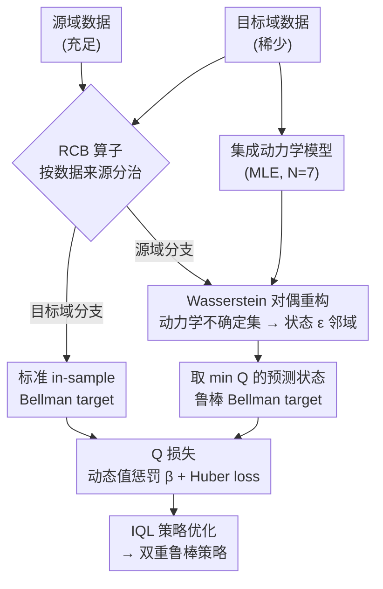

# Dual-Robust Cross-Domain Offline Reinforcement Learning Against Dynamics Shifts

**会议**: ICLR 2026  
**arXiv**: [2512.02486](https://arxiv.org/abs/2512.02486)  
**代码**: [https://github.com/zq2r/DROCO](https://github.com/zq2r/DROCO)  
**领域**: AI安全 / RL鲁棒性  
**关键词**: 离线强化学习, 跨域迁移, 动力学偏移, 双重鲁棒性, Bellman算子

## 一句话总结
首次在跨域离线 RL 中同时处理训练时鲁棒性（源域-目标域动力学不匹配）和测试时鲁棒性（部署环境动力学偏移）：提出 DROCO 算法，核心是 Robust Cross-Domain Bellman (RCB) 算子——对源域数据施加鲁棒 Bellman 更新、对目标域数据施加标准 in-sample 更新，并通过对偶重构将不可处理的动力学不确定性映射为状态空间扰动，在 D4RL 基准上总分 1105.2 超越次优方法 14%，且在 hard 级别动力学扰动下性能退化仅为基线的一半。

## 研究背景与动机

**领域现状**：跨域离线 RL 的核心场景是目标域数据稀少时借助源域大量数据来学习策略。例如机器人操控中，源域是仿真器数据（充足），目标域是真实机器人数据（极少）。源域和目标域共享状态空间、动作空间和奖励函数，但转移动力学 $P$ 不同。现有方法如 DARA（用域分类器修正奖励）、IGDF（用互信息过滤源域数据）、OTDF（用最优传输对齐动力学）都专注于解决源-目标域间的动力学不匹配问题，即所谓的"训练时鲁棒性"。

**现有痛点**：这些方法的隐含假设是：只要训练时处理好了源-目标域差异，在目标域部署时就能正常工作。但现实中，部署环境本身的动力学也会偏移——机器人零件磨损、关节松动、负载变化等都会导致实际转移动力学偏离训练时的目标域。作者的实验验证了这个问题：用 IGDF 在 hopper 任务上训练的策略，在 medium/hard 级别的运动学扰动下，性能分别下降 40.9% 和 72.4%。更严重的是，当目标域数据量减少到 10% 时，退化进一步加剧，因为策略更严重地过拟合到有限数据中的动力学特征。

**核心矛盾**：训练时鲁棒性和测试时鲁棒性是两个正交的需求——前者要处理已知的源-目标域差异（训练数据中可观测），后者要抵抗未知的部署环境扰动（训练时不可见）。现有跨域离线 RL 方法只解决了前者，而单域鲁棒 RL 方法虽然解决后者但不能处理跨域数据融合。

**本文目标** 设计一个统一框架，同时保证：(1) 安全地利用源域数据而不引入 OOD 动力学导致的 Q 值高估（train-time robustness）；(2) 学到的策略在部署环境动力学偏移时仍保持性能下界（test-time robustness）。

**切入角度**：作者观察到，对源域数据使用鲁棒 Bellman 算子（在 Wasserstein 不确定集内取最差情况），本身就蕴含了"保守估计"的效果——既能抑制 OOD 动力学导致的 Q 值膨胀（解决训练时问题），又能让策略对动力学扰动具备抵抗力（解决测试时问题）。对目标域数据则用标准 in-sample Bellman 更新，充分利用真实动力学信息。

**核心 idea**：用一个 RCB 算子统一双重鲁棒性——对源域数据做鲁棒 Bellman backup、对目标域数据做标准 backup，并通过 Wasserstein 对偶将动力学不确定性转化为可操作的状态扰动。

## 方法详解

### 整体框架
DROCO 要解决的是：目标域真实数据极少、只能借源域大量数据来训练，但既不能被源域那些"目标域里其实到不了"的动力学带偏（训练时鲁棒），又要让最终策略扛得住部署环境的动力学偏移（测试时鲁棒）。它的做法是给 Q 函数更新按数据来源分两条路：源域数据走"取最差情况"的鲁棒 Bellman 更新，目标域数据走老实利用真实动力学的标准 in-sample 更新。难点在于源域那条"取最差"原本要遍历无穷多个可能的转移动力学、根本算不动，于是先用 Wasserstein 对偶把它等价改写成"在观测到的下一状态附近找一个让 Q 最小的状态"，再直接用目标域训出的集成动力学模型生成的若干预测状态来近似这个邻域。最后给集成近似带来的估计偏差打两块补丁——动态值惩罚和 Huber loss，整体在 IQL 框架下优化。输入是源域、目标域两份离线数据集，输出是一个在目标域部署也鲁棒的策略。

### 关键设计

**1. Robust Cross-Domain Bellman (RCB) 算子：对源域和目标域分治，用一个算子撑起双重鲁棒性**

直接把源域、目标域数据混在一起做标准 Bellman 更新会埋下隐患：源域动力学 $P_{\text{src}}$ 可能把智能体送到一些目标域里高回报但其实不可达的状态，导致 Q 值被严重高估。RCB 的做法是按数据来源走两条不同的更新路径。对目标域数据 $(s,a,s') \in \mathcal{D}_{\text{tar}}$，它退化成标准 in-sample Bellman 算子 $r + \gamma \mathbb{E}_{s'}[\max_{a' \sim \hat{\mu}} Q(s',a')]$，老老实实利用真实动力学信息；对源域数据 $(s,a,s') \in \mathcal{D}_{\text{src}}$，则在 Wasserstein 不确定集 $\mathcal{M}_\epsilon$ 内取最差情况：

$$r + \gamma \inf_{\hat{\mathcal{M}} \in \mathcal{M}_\epsilon} \mathbb{E}_{s' \sim P_{\hat{\mathcal{M}}}}[\max_{a'} Q(s',a')].$$

正是这个针对源域的「取最差」操作，一箭双雕地同时压住了 OOD 动力学带来的 Q 值膨胀（训练时问题）、又让策略对动力学扰动天然具备抵抗力（测试时问题）。理论上作者证明 RCB 是 $\gamma$-压缩映射（Proposition 4.1），有唯一不动点、保证收敛；进一步给出两条关键保证：Proposition 4.4（train-time robustness）说明当 $\epsilon$ 大到不确定集覆盖 $P_{\text{tar}}$ 的支撑时，学到的 Q 值不会高估；Proposition 4.5（test-time robustness）说明只要部署环境的动力学偏移落在 Wasserstein 距离 $c$ 以内，策略在扰动环境中的实际表现就不低于学到的鲁棒值函数。$\epsilon$ 因此成了串联两种鲁棒性的旋钮。

**2. Wasserstein 对偶重构：把「动力学不确定集」上的优化换成「状态扰动」上的搜索**

RCB 算子虽然漂亮，但 $\inf_{\hat{\mathcal{M}} \in \mathcal{M}_\epsilon}$ 这一项无法直接算——它要求遍历源域动力学不确定集中无穷多个 MDP，而源域环境本身又是个黑盒，连 $\mathcal{M}_\epsilon$ 长什么样都不知道。作者借 Wasserstein 距离的对偶形式（Proposition 4.2）绕开了这道坎，把动力学层面的优化等价改写到状态层面：

$$\inf_{\hat{\mathcal{M}} \in \mathcal{M}_\epsilon} \mathbb{E}_{s' \sim P_{\hat{\mathcal{M}}}}[\cdots] \;=\; \mathbb{E}_{s' \sim P_{\mathcal{M}}}\Big[\inf_{\bar{s}:\, d(s',\bar{s}) \leq \epsilon} \max_{a'} Q(\bar{s}, a')\Big].$$

这一步把「枚举所有可能的转移动力学」变成了「在观测到的下一状态 $s'$ 的 $\epsilon$-邻域里找一个让 Q 值最小的状态 $\bar{s}$」，一个不可计算的泛函优化就此落地成有限维空间里的搜索。实现时连 $\epsilon$-球搜索都不显式做：直接拿目标域训练出的集成动力学模型生成的 $N$ 个预测 $\{s'_i\}$ 来近似这个邻域，取 $\min_i Q(s'_i, \pi(s'_i))$ 作为鲁棒 target。用集成模型的好处还在于不确定性是自适应的——模型越拿不准的区域，预测越分散，邻域自然越宽，避免了固定 $\epsilon$ 容易带来的过度保守。

**3. 动态值惩罚与 Huber loss：给集成近似带来的估计偏差打两块补丁**

把动力学不确定集换成集成模型的近似不是免费的午餐：Proposition 4.6 证明集成模型的 TV 距离误差 $\epsilon$ 最多会引入 $(1-(1-2\epsilon)^N) \cdot r_{\max}/(1-\gamma)$ 的 Q 值高估，而 inf 操作本身又容易把值压得过低。作者用两个独立的旋钮分别对症。其一是动态值惩罚项 $u(s,a,s') = \mathbb{I}(s' \sim P_{\text{src}}) \cdot (V(s') - \min_i V(s'_i))$，度量源域观测到的 $V(s')$ 与集成预测中最小 $V$ 值的差距，再用系数 $\beta$ 调强弱：$\beta=1$ 恢复原始 RCB，$\beta>1$ 加保守性压高估，$\beta<1$ 减保守性救低估。其二是把源域数据的 Bellman 更新从 L2 loss 换成 Huber loss——TD 误差 $|Q - \hat{\mathcal{T}}Q| < \delta$ 时仍是 L2，一旦超过 $\delta$ 就自动切到 L1，防止模型预测偶尔出格带来的超大 TD 误差直接把训练带崩。

### 损失函数 / 训练策略
总体 Q 函数损失为：$\mathcal{L}_Q = \mathbb{E}_{\mathcal{D}_{\text{src}}}[l_\delta(Q - \hat{\mathcal{T}}_{\text{RCB}} Q)] + \frac{1}{2}\mathbb{E}_{\mathcal{D}_{\text{tar}}}[(Q - \mathcal{T}Q)^2]$。其中源域部分使用 Huber loss $l_\delta$ 和 RCB target，目标域部分使用标准 L2 loss 和标准 Bellman target。集成动力学模型用目标域数据通过 MLE 训练：$\mathcal{L}_{\psi_i} = \mathbb{E}_{\mathcal{D}_{\text{tar}}}[\log \hat{P}_{\psi_i}(s'|s,a)]$。策略优化使用 IQL 框架。训练 1M 步，集成模型数量 $N=7$。

## 实验关键数据

### 主实验：Kinematic shift 下 16 个任务的归一化分数

| 任务 | IQL* | CQL* | BOSA | DARA | IGDF | OTDF | **DROCO** |
|------|------|------|------|------|------|------|-----------|
| half-m | 45.2 | 37.7 | 39.6 | 44.1 | 45.2 | 42.2 | **45.3** |
| half-mr | 22.1 | 23.6 | 26.3 | 21.6 | 22.9 | 15.6 | **26.9** |
| half-me | 43.7 | 54.8 | 42.2 | 52.7 | 57.1 | 46.7 | **60.1** |
| hopp-m | 48.8 | 35.7 | 71.4 | 48.8 | 54.3 | 46.3 | **55.4** |
| hopp-mr | 40.2 | 43.2 | 29.5 | 41.6 | 30.0 | 26.2 | **47.3** |
| walk-m | 48.7 | 47.7 | 44.5 | 43.4 | 51.8 | 43.0 | **70.8** |
| walk-mr | 12.6 | 17.8 | 4.8 | 15.6 | 11.2 | 10.7 | **27.7** |
| walk-e | 90.1 | 83.8 | 41.9 | 85.5 | 93.7 | 98.9 | **106.0** |
| ant-me | 106.1 | 100.6 | 102.5 | 104.8 | 112.8 | 105.1 | **119.0** |
| ant-e | 111.0 | 94.3 | 57.6 | 115.1 | 119.2 | 111.6 | **120.0** |
| **总分 (16任务)** | 925.4 | 789.9 | 774.5 | 923.0 | 964.3 | 969.8 | **1105.2** |

DROCO 在 16 个任务中有 9 个取得最优，总分超过次优方法 OTDF 14.0%（1105.2 vs 969.8）。尤其在 walker2d-medium（70.8 vs 51.8）和 walker2d-medium-replay（27.7 vs 17.8）上提升巨大。少数任务上（如 half-expert 67.4 vs BOSA 84.3）表现次优，作者归因于鲁棒性-性能的固有 trade-off。

### 测试时鲁棒性：不同扰动类型和强度下的性能退化

| 扰动类型 | 强度 | DROCO 退化率 | IGDF 退化率 | OTDF 退化率 |
|----------|------|-------------|-------------|-------------|
| 运动学扰动 | Easy | 19.3% | >50% | >50% |
| 运动学扰动 | Medium | ~30% | ~65% | ~55% |
| 运动学扰动 | Hard | ~45% | ~85% | ~75% |
| 形态学扰动 | Easy | 42.1% | 78.9% | 62.4% |
| Min-Q 攻击 | scale=0.2 | 37.9% | 84.0% | 73.6% |

DROCO 在所有扰动类型和强度下退化率均显著低于基线。值得注意的是，对于对抗性 min-Q 攻击（故意找使 Q 值最小的状态扰动），DROCO 在不同攻击强度下表现一致稳定，说明 RCB 算子的鲁棒设计确实在起作用。形态学扰动下退化较大（42.1% vs 运动学的 19.3%），因为训练时源域只有运动学偏移，形态学是训练时未见的扰动类型。

### 关键发现
- **双重鲁棒性的必要性**：仅有 train-time 鲁棒性的 IGDF 和 OTDF 在 clean 环境下表现不错，但部署偏移时退化严重——IGDF 在 hard 运动学扰动下退化 >85%。这直接验证了本文的核心动机
- **$\beta$ 和 $\delta$ 的调优规律**：$\beta \leq 1.0$ 适用于大多数任务（说明 inf 操作导致的低估比高估更常见），$\delta = 30$ 或 $50$ 是稳健的默认选择（L2 loss 对训练稳定性有利，只在极端异常值时切换 L1）
- **目标域数据量的影响**：当目标域数据从 100% 降到 10% 时，所有方法的测试时鲁棒性都大幅下降，但 DROCO 的相对优势更加明显，说明 RCB 算子在数据稀疏时更能发挥作用
- **不同任务偏好不同超参**：hopper 任务偏好 $\beta=0.1$（需要减少保守性），walker2d 偏好 $\beta=1.0$（需要充分保守），说明值估计偏差的方向和程度是任务相关的

## 亮点与洞察
- **RCB 算子的优雅统一**：一个算子同时解决两种鲁棒性需求，且理论上能证明两者之间通过 $\epsilon$ 参数控制 trade-off。这比设计两个独立机制更简洁，也更容易分析理论性质。巧妙之处在于发现了"对源域数据做鲁棒 Bellman"这一操作同时蕴含了 OOD 动力学保守估计和部署鲁棒性两个效果
- **对偶重构的实用化技巧**：将动力学不确定集上的优化（需要枚举无限多 MDP）转化为状态空间的 $\epsilon$-球搜索（只需在有限维空间中寻找最差状态），再进一步用集成模型的离散预测近似。这个从"不可能计算"到"可实际操作"的路径值得借鉴——其他涉及分布鲁棒优化的 RL 方法也可以考虑类似的对偶+集成近似策略
- **动态惩罚系数的设计思路**：不是用固定的保守程度，而是让惩罚量自适应——$u(s,a,s')$ 本身就度量了源域观测动力学与集成模型预测之间的差异大小，差异大则惩罚大。这种"数据驱动的保守性调节"可以迁移到其他涉及域差异的 offline RL 方法中

## 局限与展望
- **Lipschitz Q 函数假设**：理论分析（Proposition 4.4/4.5）依赖 Q 函数关于状态的 Lipschitz 连续性假设。在高维状态空间或用深度网络参数化 Q 时，这个假设难以验证和保证，尤其当 Q 函数出现尖锐的值变化时
- **集成模型质量的瓶颈**：核心的状态扰动近似完全依赖集成动力学模型的质量。当目标域数据极度稀缺时，模型本身可能严重过拟合，生成的"扰动状态"不再有意义。论文未充分讨论这个 failure mode
- **超参调优负担**：虽然作者给出了 $\beta \leq 1.0$、$\delta = 30$ 的经验指导，但不同任务的最优值确实不同。对于新任务仍需调优，且 $\epsilon$（通过集成模型隐式确定）也是一个隐含超参
- **仅在 MuJoCo 验证**：4 个连续控制任务的评估范围较窄。高维观测（图像输入）、离散动作空间、多智能体场景等更复杂的跨域 RL 设置未涉及
- **改进思路**：可以将集成模型替换为扩散模型来更准确地建模目标域动力学分布；也可以考虑自适应地根据状态区域调整 $\epsilon$，而非全局统一

## 相关工作与启发
- **vs IGDF (Wen et al., 2024)**：IGDF 用互信息过滤不可靠的源域数据，只解决 train-time 鲁棒性。DROCO 不过滤数据而是修改 Bellman 更新规则，同时获得 test-time 鲁棒性。DROCO 总分超出 IGDF 约 15%，且在部署扰动下优势更大
- **vs OTDF (Lyu et al., 2025)**：OTDF 用最优传输对齐源-目标域动力学，同样只关注 train-time。OTDF 在部分 expert 级别数据上表现优于 DROCO（如 hopper-expert 97.0 vs 89.3），说明当数据质量高时，精确的动力学对齐可能比保守的鲁棒估计更有效
- **vs MICRO (Liu et al., 2024c)**：MICRO 是单域离线 RL 的鲁棒方法，DROCO 的 RCB 算子设计受其启发，但扩展到了跨域场景并处理了源-目标域差异
- **vs 实际 sim-to-real 场景**：DROCO 的框架直接对应 sim-to-real RL 中仿真器（源域）→真实机器人（目标域）→实际部署（可能偏移的环境）的三级差异问题，具有明确的应用导向

## 评分
- 新颖性: ⭐⭐⭐⭐ 双重鲁棒性的问题定义新颖且有实际意义，RCB 算子通过分治源/目标域数据实现统一处理的思路优雅
- 实验充分度: ⭐⭐⭐⭐ D4RL 标准 16 任务 + 3 种测试时扰动类型 + 超参敏感性分析覆盖较全面，但缺少更复杂环境的验证
- 写作质量: ⭐⭐⭐⭐⭐ 理论推导清晰完整，从问题定义→理论算子→对偶重构→实用算法的逻辑链条连贯流畅
- 价值: ⭐⭐⭐⭐ 对 sim-to-real 场景的 RL 部署有直接指导意义，双重鲁棒性的概念可推广到其他跨域学习问题

<!-- RELATED:START -->

## 相关论文

- [\[ICLR 2026\] MOBODY: Model-Based Off-Dynamics Offline Reinforcement Learning](mobody_model-based_off-dynamics_offline_reinforcement_learning.md)
- [\[ICLR 2026\] Robust Deep Reinforcement Learning against Adversarial Behavior Manipulation](robust_deep_reinforcement_learning_against_adversarial_behavior_manipulation.md)
- [\[ICLR 2026\] Less is More: Clustered Cross-Covariance Control for Offline RL](less_is_more_clustered_cross-covariance_control_for_offline_rl.md)
- [\[ICLR 2026\] In-Context Compositional Q-Learning for Offline Reinforcement Learning](in-context_compositional_q-learning_for_offline_reinforcement_learning.md)
- [\[ICLR 2026\] Tackling Heavy-Tailed Q-Value Bias in Offline-to-Online Reinforcement Learning with Laplace-Robust Modeling](tackling_heavy-tailed_q-value_bias_in_offline-to-online_reinforcement_learning_w.md)

<!-- RELATED:END -->
