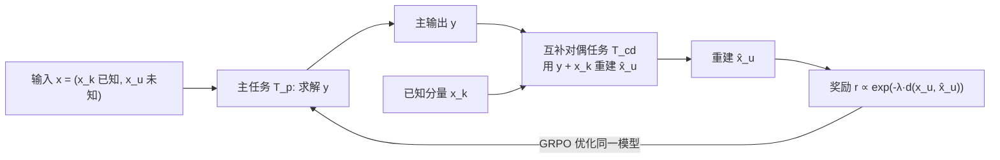

# DuPO: Enabling Reliable Self-Verification via Dual Preference Optimization

**会议**: ICLR 2026  
**OpenReview**: [https://openreview.net/forum?id=SD8Z231C45](https://openreview.net/forum?id=SD8Z231C45)  
**代码**: 待确认  
**领域**: 强化学习 / LLM 自监督优化  
**关键词**: 对偶学习, 偏好优化, 自监督奖励, 无标注 RL, 自验证, GRPO  

## 一句话总结
DuPO 把传统对偶学习从"严格可逆任务对"放宽为"互补依赖关系"——只让对偶任务从主任务输出里重建输入的某个**未知分量**，用重建一致性当自监督奖励，从而在数学推理、多语翻译等不可逆任务上实现无需任何标注的 RL 优化。

## 研究背景与动机

**领域现状**：当下增强 LLM 能力主要靠两条 RL 路线。RLHF 用人类偏好对齐，但人工标注昂贵且不一致；RLVR（可验证奖励 RL）用二值正确性奖励解决了数学、代码这类客观任务，大幅降低标注负担，是 DeepSeek-R1 等推理模型的核心训练范式。

**现有痛点**：RLVR 仍然离不开外部监督——获取"可验证答案"本身就是瓶颈，限制了规模化；而且它在生成式任务（如翻译）上力不从心，因为单条参考译文无法覆盖多样的高质量输出。RLAIF、Constitutional AI 这类尝试只是把依赖从"人类标注"换成"教师模型/规则"，没有触及核心瓶颈。

**核心矛盾**：对偶学习（He et al., 2016）本可提供自监督出路——通过主任务/对偶任务（如翻译与回译）的循环一致性，无需外部标签就能验证输出质量。但把它套到 LLM 上有两个硬伤：① **不可逆任务缺少对偶性**——数学解题的输出（一个数字 8）根本不足以唯一重建输入问题，对偶环路直接断裂；② **双向能力不对称**——LLM 在主/对偶任务上水平参差（擅长解题但不擅长由答案出题），弱对偶任务产生的噪声信号会污染优化。

**本文目标**：设计一个对一般任务都适用的"松弛对偶"框架，既保留自监督、无标注的优点，又能绕开不可逆与能力不对称两道坎。

**核心 idea**（**广义对偶 / Generalized Duality**）：不再要求对偶任务重建**整个输入** $x$，而是把输入拆成**已知分量** $x_k$ 与**未知分量** $x_u$，对偶任务只需借助主输出 $y$ 和已知的 $x_k$ 去重建 $x_u$。这一放宽同时修复了信息流断裂（任务不对称）和对偶端难度过高（能力不对称）两个问题。

## 方法详解

### 整体框架
DuPO 把任意任务视作条件生成 $\pi_\theta(y\mid x)$。对每个输入 $x$，先拆分出已知分量 $x_k$ 和被刻意"挖空"的未知分量 $x_u$；主任务正常产出 $y=T_p(x)$；互补对偶任务 $T_{cd}:(y,x_k)\mapsto \hat{x}_u$ 试图把 $x_u$ 重建回来；重建得越准，说明主输出 $y$ 信息越可靠，于是把重建一致性折算成自监督奖励，喂给 GRPO 去优化同一个模型。整条链路用一个 LLM 同时扮演主任务与对偶任务，全程不碰任何外部标注。

### 关键设计

**1. 广义对偶奖励：用"重建未知分量"代替"重建整个输入"。** 这是 DuPO 的根，也是它能从翻译这种可逆任务推广到数学这种不可逆任务的关键。传统对偶要求主输出 $y$ 完整编码输入 $x$，但 $8$ 显然无法唯一对应"3 红 + 5 蓝球共几个"。DuPO 把输入空间分解为不相交子空间 $X = X_k \times X_u$，只要求对偶任务满足互补一致性 $d\big(x_u, T_{cd}(y, x_k)\big)\le \epsilon$，奖励写成
$$r(x,y)\propto \exp\big(-\lambda\cdot d(x_u, T_{cd}(y,x_k))\big),$$
其中 $\lambda>0$ 控制对重建误差的敏感度。以"两数求和 $C=A+B$"为例：把 $A$ 当已知 $x_k$、$B$ 当未知 $x_u$，对偶任务就是 $B'=C-A$，奖励直接退化为指示函数 $r\propto\exp(-\lambda\cdot \mathbb{I}(B\neq B'))$——$B=B'$ 时奖励最大。已知分量 $x_k$ 在这里充当强上下文锚点，把重建的解空间死死约束住，于是哪怕对偶能力较弱也能给出可靠信号。

**2. 未知分量选择策略：让对偶任务"既答得出、又验得准"。** 光会拆还不够——挖空哪个分量决定了对偶任务的难度和奖励的信噪比。DuPO 用一个辅助 LLM（Qwen3-4B-Instruct）按两条原则挑 $x_u$：**对偶问题的可答性**（挖空后对偶任务确实能被解出，否则奖励全是噪声）和**正确补全的唯一性**（被挖的分量在给定 $y,x_k$ 下答案唯一，避免"多解"导致假阴性惩罚）。这条筛选把数学训练的初始对偶准确率拉到 52.6% 的合理水平，随主任务变强对偶题也越解越多，奖励信号被持续"解锁"。消融显示去掉筛选会让 1.5B/4B 模型平均掉 3.6/5.4 个点。

**3. 任务专属距离度量 + 单模型双角色 + GRPO。** DuPO 不锁死奖励形式：翻译用 BLEU 分数衡量回译一致性，数学则直接判变量相等给出二值奖励，灵活适配不同领域。优化目标是最大化对偶奖励的期望 $J(\theta)=\mathbb{E}_{y\sim\pi_\theta(y\mid x)}[r(x,y)]$，框架对 PPO、REINFORCE++ 都兼容，实验里选了简单高效的 GRPO。整个过程主任务与对偶任务都由**同一个** $\pi_\theta$ 实例化——这既利用了 LLM 预训练得来的广博能力（无需为对偶任务单设架构），又让模型自己的输出反过来变成自我提升的反馈源，比传统"两个独立模型"的对偶学习更彻底地化解了能力不对称。

## 实验关键数据

### 主实验表格

多语翻译（756 个方向 / 28 语言，Seed-X-7B-Instruct 为底座）：

| 模型 | BLEU | COMET | BLEURT | Avg. |
|---|---|---|---|---|
| Qwen3-235B-22B | 28.4 | 88.8 | 73.9 | 63.7 |
| DeepSeek-R1-0528 | 30.2 | 89.2 | 75.0 | 64.8 |
| Seed-X-7B-Instruct | 28.8 | 87.0 | 72.6 | 62.8 |
| **w/ DuPO (ours)** | **30.3** | **89.1** | **74.6** | **64.7** |

7B 模型 + DuPO 三项指标分别 +1.5/+2.1/+2.0，逼平甚至超过百亿级 SOTA 闭源系统，人评（Seed-X-Challenge）上与 GPT-4o、DeepSeek-R1 持平并显著优于 Google Translate。

数学推理（4 个竞赛级 benchmark，Avg@32）：

| 模型 | AMC23 | AIME24 | AIME25 | HMMT | Avg. |
|---|---|---|---|---|---|
| DeepSeek-R1-Distill-Qwen-1.5B | 67.5 | 20.0 | 20.0 | 13.3 | 30.2 |
| **w/ DuPO** | 72.5 | 30.0 | 26.7 | 16.7 | **36.5 (+6.3)** |
| Qwen3-4B | 95.0 | 70.0 | 66.7 | 40.0 | 67.9 |
| **w/ DuPO** | 97.5 | 83.3 | 70.0 | 46.7 | **74.4 (+6.5)** |
| OpenReasoning-Nemotron-7B | 95.0 | 83.3 | 73.3 | 56.7 | 77.1 |
| **w/ DuPO** | 97.5 | 83.3 | 90.0 | 66.7 | **84.4 (+7.3)** |

各尺度全面提升，Qwen3-4B+DuPO 反超 DeepSeek-R1-0120。

### 消融实验表格

跨架构鲁棒性（LlaMA 系，AMC23 / MATH500）：

| 模型 | AMC23 | MATH500 | Avg. |
|---|---|---|---|
| LlaMA-3.1-8B | 2.5 | 13.6 | 8.1 |
| w/ SimpleRL-Zoo（用 oracle 标注） | 15.0 | 23.0 | 19.0 |
| **w/ DuPO（无标注）** | 20.0 | 44.2 | **32.1** |
| OctoThinker-8B-Hybrid-Base | 5.0 | 42.6 | 23.8 |
| **w/ DuPO** | 55.0 | 70.0 | **62.5** |

无标注的 DuPO 反超用真值标注的 SimpleRL-Zoo（+13.1）；未知分量选择策略的消融见上文（去掉后 1.5B/4B 分别 -3.6/-5.4）。

### 关键发现
- **逼近 oracle 上界**：DuPO 全程紧贴 Oracle-RLVR，第 600 步两者准确率几乎重合（≈35%），说明自验证奖励与真值监督几乎一样准。
- **可唤醒 base 模型推理**：直接对 base 模型（无 SFT）训练，Forward Acc 从 15.2% 飙到 56.5%，AMC23 从 20% 涨到 70%，证明 DuPO 能从零激活潜在推理能力。
- **免训练推理期重排**：把对偶一致性（Backward Acc）当打分器做 reranking，Qwen3-4B 在 AIME 上 +9.3（77.7% 反超 DeepSeek-R1/Claude-Sonnet4），1.5B 模型 +18.7，纯靠"算力换准确率"。

## 亮点与洞察
- **重新定义了"对偶"**：把"必须可逆"放宽成"互补依赖"，一句话点破了对偶学习多年没能上 LLM 的症结，思路简洁但适用面骤然变宽。
- **已知分量当锚点**这个设计很巧——它同时解决了"重建唯一性"和"对偶任务太难"两个问题，是整个框架能稳定收敛的关键支点。
- **训练/推理双用**：同一套对偶奖励既能驱动 RL 训练，又能零成本充当推理期 reranker，复用度高、落地灵活。
- **真正的无标注**：在数学这种 RLVR 的强项任务上做到逼平 oracle，且在翻译这种 RLVR 的弱项上同样有效，验证了"自监督奖励"作为通用范式的潜力。

## 局限与展望
- **依赖未知分量可被良好选择**：选择策略本身用了一个额外 LLM，挑得好不好直接决定奖励信噪比；对结构复杂、难以清晰拆分已知/未知分量的开放式任务（如长文写作、对话）如何稳定选 $x_u$ 仍是开放问题。
- **验证任务有限**：目前只在翻译和数学两类任务上验证，代码生成、对话等论文宣称适用的领域尚无实证。
- **对偶任务能力天花板**：当主任务极强而对偶任务先天薄弱时，即便有 $x_k$ 锚点，奖励仍可能失真；框架缓解了不对称但未根除。
- **拆分粒度与度量设计**靠人工/启发式（BLEU、变量相等），缺少自动化的通用距离度量，迁移到新任务需要一定人工设计成本。

## 相关工作与启发
- **对偶学习谱系**：源自 He et al. (2016) 的对偶学习与回译（Sennrich et al., 2015），DuPO 是把这一思想"松弛化"后首次系统迁移到通用 LLM 优化。
- **对 RLVR 的补位**：相比 DeepSeek-R1、DAPO 等依赖可验证答案的 RLVR，DuPO 提供了一条"无标注也能拿到可靠奖励"的替代路径，二者实验上几乎等价（Oracle-RLVR 对照）。
- **对 RLAIF/Constitutional AI 的反思**：论文明确指出这些方法只是换了依赖源而非消除依赖，启发我们思考"自监督信号能否真正闭环"。
- **启发**：把"难以直接验证的任务"转化为"局部可重建的子问题"是一种通用的奖励工程思路，可推广到任何能定义"部分逆映射"的领域；这也是把 self-verification 推向开放式任务的有价值的第一步。

## 评分
- **新颖性**: ⭐⭐⭐⭐⭐ 把对偶学习从"严格可逆"放宽为"互补依赖"，单点切中对偶学习上 LLM 的核心障碍，概念优雅且通用。
- **实验充分度**: ⭐⭐⭐⭐ 覆盖翻译/数学、1.5B~8B 多尺度、多架构、训练与推理两种用法，并有 oracle 对照与消融；但仅两类任务、缺代码/对话等宣称领域的实证。
- **写作质量**: ⭐⭐⭐⭐ 动机—挑战—方法逻辑链清晰，定义与示例（两数求和）讲得很透；公式与图表支撑充分。
- **价值**: ⭐⭐⭐⭐⭐ 提供了可规模化、无标注、跨任务的 LLM 优化范式，对降低 RL 训练的标注依赖有实际意义。

<!-- RELATED:START -->

## 相关论文

- [\[ICLR 2026\] Group Verification-based Policy Optimization for Interactive Coding Agents](group_verification-based_policy_optimization_for_interactive_coding_agents.md)
- [\[ICLR 2026\] Offline Preference-based Value Optimization](offline_preference-based_value_optimization.md)
- [\[ICLR 2026\] FAPO: Flawed-Aware Policy Optimization for Efficient and Reliable Reasoning](fapo_flawed-aware_policy_optimization_for_efficient_and_reliable_reasoning.md)
- [\[ICLR 2026\] Preference-based Policy Optimization from Sparse-reward Offline Dataset](preference-based_policy_optimization_from_sparse-reward_offline_dataset.md)
- [\[ICLR 2026\] Primal-Dual Policy Optimization for Linear CMDPs with Adversarial Losses](primal-dual_policy_optimization_for_linear_cmdps_with_adversarial_losses.md)

<!-- RELATED:END -->
