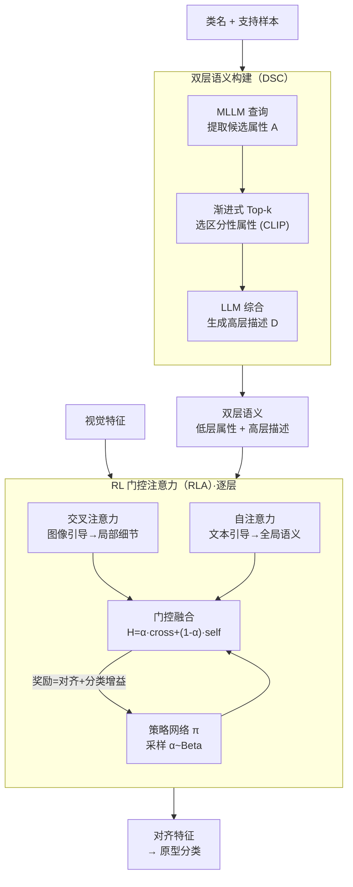

# DVLA-RL: Dual-Level Vision-Language Alignment with Reinforcement Learning Gating for Few-Shot Learning

**会议**: ICLR 2026  
**arXiv**: [2602.00795](https://arxiv.org/abs/2602.00795)  
**代码**: 无  
**领域**: 强化学习  
**关键词**: 少样本学习, 视觉-语言对齐, 强化学习门控, 双层语义, 跨模态融合

## 一句话总结

提出 DVLA-RL 框架，通过双层语义构建（DSC）生成互补的低层属性和高层描述，并以 RL 门控注意力（RLA）动态平衡自注意力和交叉注意力在不同网络层的贡献，实现从低层到高层的层次化视觉-语言对齐，在 9 个少样本学习基准上达到 SOTA。

## 研究背景与动机

少样本学习（FSL）旨在仅用少量样本泛化到新类别。当前基于语义的 FSL 方法利用 LLM 生成的文本语义来增强视觉表征，但存在两个关键不足：

**单层语义局限**：现有方法要么只用高层描述（如 SemFew 生成类别描述），要么只用低层属性（如 ECER 生成具体实体），无法同时提供细粒度区分和整体类别理解

**静态融合模块**：现有方法使用固定的 MLP 融合跨模态信息，无法在不同网络深度自适应地调整视觉-语言对齐策略——浅层应关注局部细节、深层应强调全局语义

核心创新：(1) 构建互补的双层语义（属性 + 描述）；(2) 首次将 RL 引入 FSL 的视觉-语言对齐，动态门控跨模态融合。

## 方法详解

### 整体框架

DVLA-RL 把少样本对齐拆成"准备语义"和"自适应融合"两步：先用双层语义构建（DSC）为每个类别造出互补的低层属性和高层描述，再让 RL 门控注意力（RLA）在网络的每一层动态决定交叉注意力与自注意力各占多少权重，从而把浅层的局部细节和深层的全局语义都对齐到视觉表征上。

### 关键设计

**1. 双层语义构建（DSC）：让一个类同时拥有细粒度属性和整体描述**

现有方法只取单层语义——SemFew 只生成高层类别描述，丢掉了区分近似类别的细节；ECER 只列低层属性，又缺乏整体类别理解。DSC 用三步把两者补齐。第一步是属性提取：以类别名和支持样本为条件查询多模态 LLM（Qwen2.5-VL-32B），用提示 `"What are the key distinguishing attributes of the CLASS in the given image?"` 得到候选属性集 $A = \{a_1, \dots, a_s\}$。LLM 的输出难免夹杂幻觉和冗余，所以第二步做渐进式 Top-k 选择：以 `"A photo of a {CLASS}"` 为初始模板 $T^{(0)}$，每轮用 CLIP 文本编码器对候选属性编码、与当前模板算余弦相似度 $s_j = \cos(T^{(i)}, a_j)$，选出最相关的属性嵌入模板 `"A photo of a {CLASS}, which has {attribute}"` 并更新 $T^{(i)}$，迭代 $k$ 次只留下最具区分性的属性，作为低层对齐信号。第三步把这些选中属性交给 LLM 综合成一段流畅的科学描述 $D_i$（例如 "The Komondor is a … dog with massive size and uniquely corded white coat"），作为与局部属性互补的高层语义。两层语义一精一概，恰好对应后面浅层关注细节、深层整合全局的需求。

**2. RL 门控注意力（RLA）：用强化学习按层动态平衡两条对齐路径**

跨模态融合用固定 MLP 的问题是，浅层和深层需要的对齐策略并不一样，但静态模块无法随深度调整。RLA 在每层并行跑两条对偶注意力：图像引导路径用文本查询图像、走交叉注意力 $\hat{H} = \mathrm{Attn}(W^q_\text{text}\bar{H}_\text{text}, W^k_\text{img}\bar{H}_\text{img}, W^v_\text{img}\bar{H}_\text{img})$，更聚焦属性级的局部细节；文本引导路径在文本内部走自注意力 $\tilde{H} = \mathrm{Attn}(W^q_\text{text}\bar{H}_\text{text}, W^k_\text{text}\bar{H}_\text{text}, W^v_\text{text}\bar{H}_\text{text})$，更强调整体语义。两条路径用一个随机门控系数融合 $H = \alpha \hat{H} + (1-\alpha) \tilde{H}$，而 $\alpha$ 不是手调的常数，而是从策略网络采样 $\alpha \sim \pi_\theta(\cdot|s)$。状态由当前层图文特征的全局池化及其相似度拼成 $s = \phi([\mathrm{GAP}(\bar{H}_\text{img}) \,\|\, \mathrm{GAP}(\bar{H}_\text{text}) \,\|\, \cos(\mathrm{GAP}(\bar{H}_\text{img}), \mathrm{GAP}(\bar{H}_\text{text}))])$，策略输出一个 Beta 分布 $\pi_\theta(\alpha|s) = \mathrm{Beta}(\kappa\, p_\theta(s), \kappa(1 - p_\theta(s)))$，其中 $\kappa$ 控制探索与确定性的平衡。Beta 分布天然支持 $[0,1]$ 连续门控，比 Bernoulli 或 Gaussian 更契合"按比例混合"这件事，于是模型学会了浅层给更大的 $\alpha$ 偏向交叉注意力、深层给更小的 $\alpha$ 偏向自注意力。

### 损失函数 / 训练策略

RLA 的策略由奖励驱动，奖励同时看对齐质量和分类增益：$R_t = \lambda_\text{sim} \cdot \cos(U \cdot \mathrm{GAP}(H), \mathbf{t}^\star) + \lambda_\text{imp} \cdot (\mathrm{Acc}_t - \mathrm{Acc}_{t-1})$，第一项是融合特征与 CLIP ground-truth 文本嵌入 $\mathbf{t}^\star$ 的余弦相似度、鼓励视觉-文本对齐，第二项衡量 episode 内准确率相对上一步的提升。策略用带熵正则的 REINFORCE 更新 $\nabla_\theta \mathcal{J} = \mathbb{E}[(R_t - b_t) \nabla_\theta \log \pi_\theta(\alpha|s)] + \tau \nabla_\theta \mathsf{H}(\pi_\theta(\cdot|s))$，其中指数移动平均基线 $b_t$ 减少梯度方差、熵项 $\mathsf{H}$ 防止策略过早坍缩到固定 $\alpha$。整体目标把监督和强化两路相加 $\mathcal{L}_\text{total} = \mathcal{L}_\text{sup} + \lambda \mathcal{L}_\text{RL}$，$\mathcal{L}_\text{sup}$ 是原型分类器的交叉熵。训练分两阶段：先做 300-800 epoch 的大规模预训练，再做 100 epoch 的 episode 式元调优；RL 超参取 $\kappa=10$、$\lambda_\text{sim}=0.5$、$\lambda_\text{imp}=1.0$、$\lambda=0.1$、$\tau=0.2$。

## 实验关键数据

### 主实验：通用少样本分类

| 方法 | miniImageNet 1-shot | miniImageNet 5-shot | tieredImageNet 1-shot | CIFAR-FS 1-shot |
|------|-------------------|-------------------|---------------------|----------------|
| SemFew (CVPR'24) | 78.94 | 86.49 | 82.37 | 84.34 |
| ECER (AAAI'25) | 81.14 | - | 81.81 | 86.01 |
| CPL (TPAMI'25) | 72.82 | 87.93 | 78.05 | 78.82 |
| **DVLA-RL** | **81.69** | **88.25** | **83.02** | **87.18** |

### 主实验：细粒度少样本分类

| 方法 | CUB 1-shot | CUB 5-shot | Dogs 1-shot | Cars 1-shot |
|------|-----------|-----------|------------|------------|
| SUITED (AAAI'25) | 86.02 | 94.13 | 76.55 | 89.97 |
| BSFA (TCSVT'23) | 86.00 | 92.53 | 69.58 | 88.93 |
| **DVLA-RL** | **91.93** | **95.06** | **89.64** | **92.95** |

在细粒度任务上超过次优方法 5.4%-15.3%（1-shot），表明双层语义对捕捉细微类间差异尤为有效。

### 跨域少样本分类

| 方法 | CUB 1-shot | Places 1-shot | ChestX 1-shot |
|------|-----------|--------------|--------------|
| MEFP (NeurIPS'24) | 51.55 | 52.06 | 22.82 |
| SVasP (AAAI'25) | 49.49 | 59.07 | 23.23 |
| **DVLA-RL** | **67.46** | **69.26** | **23.47** |

跨域场景下在 CUB 上超出次优 15.9%，在 Places 上超出 10.2%，展示出极强的域迁移能力。

### 消融实验

消融实验验证了各组件的必要性：

- 移除 DSC（仅用类名模板）：1-shot 下降 ~3-5%
- 固定 $\alpha$（消除 RL 门控）：性能显著下降，表明自适应融合优于静态融合
- 移除低层属性或高层描述：均导致下降，证明双层语义的互补性
- 移除 Progressive Top-k：属性质量下降导致性能降低

### 关键发现

- 浅层 RLA 倾向于更大的 $\alpha$（更多交叉注意力→聚焦属性细节），深层倾向更小的 $\alpha$（更多自注意力→整合全局语义）
- Beta 分布策略在不同 episode 任务中表现出明显的自适应行为

## 亮点与洞察

1. **首次将 RL 引入 FSL 的视觉-语言对齐**：Beta 分布策略+REINFORCE 算法优雅地实现了层级自适应融合
2. **双层语义互补**：低层属性提供细粒度区分线索，高层描述提供整体类别理解，渐进式 Top-k 有效抑制 LLM 幻觉
3. 细粒度和跨域场景的大幅度提升（5-16%）说明该方法对域迁移和细微差异的捕捉尤为有效
4. 设计轻量：RLA 模块仅增加少量参数，RL 训练稳定

## 局限与展望

1. 依赖 LLM（Qwen2.5-VL-32B）生成属性，推理时的 LLM 调用增加延迟
2. 属性和描述可以预计算，但新类别仍需 LLM 推理
3. ChestX 等极端跨域场景提升有限（<1%），极端域偏移下视觉-语言对齐仍面临挑战
4. RL 门控的 $\kappa$ 等超参需要验证集调优

## 相关工作与启发

- 相比 SemFew 仅用高层描述和 ECER 仅用低层实体，DSC 的双层设计是自然的统一
- RL 门控的思路可推广到任何需要自适应跨模态融合的场景（如 VQA、图文检索）
- Progressive Top-k 选择机制可用于其他需要从 LLM 输出中筛选高质量信息的任务
- Beta 分布策略相比 Bernoulli 或 Gaussian 更适合 [0,1] 区间的连续门控

## 评分

- 新颖性: ⭐⭐⭐⭐ (RL 门控+双层语义是有意义的创新组合)
- 实验充分度: ⭐⭐⭐⭐⭐ (9 个基准，3 种场景，20+ 基线)
- 写作质量: ⭐⭐⭐⭐ (结构清晰，公式完整)
- 价值: ⭐⭐⭐⭐ (SOTA 结果显著，方法通用性好)

<!-- RELATED:START -->

## 相关论文

- [\[ICLR 2026\] Object-Centric World Models from Few-Shot Annotations for Sample-Efficient Reinforcement Learning](object-centric_world_models_from_few-shot_annotations_for_sample-efficient_reinf.md)
- [\[ACL 2026\] HEALing Entropy Collapse: Enhancing Exploration in Few-Shot RLVR via Hybrid-Domain Entropy Dynamics Alignment](../../ACL2026/reinforcement_learning/healing_entropy_collapse_enhancing_exploration_in_few-shot_rlvr_via_hybrid-domai.md)
- [\[AAAI 2026\] Vision-Language Reasoning for Geolocalization: A Reinforcement Learning Approach](../../AAAI2026/reinforcement_learning/vision-language_reasoning_for_geolocalization_a_reinforcement_learning_approach.md)
- [\[ICLR 2026\] Principled RL for Diffusion LLMs Emerges from a Sequence-Level Perspective](principled_rl_for_diffusion_llms_emerges_from_a_sequence-level_perspective.md)
- [\[ICML 2025\] Zero-Shot Generalization of Vision-Based RL Without Data Augmentation](../../ICML2025/reinforcement_learning/zero-shot_generalization_of_vision-based_rl_without_data_augmentation.md)

<!-- RELATED:END -->
