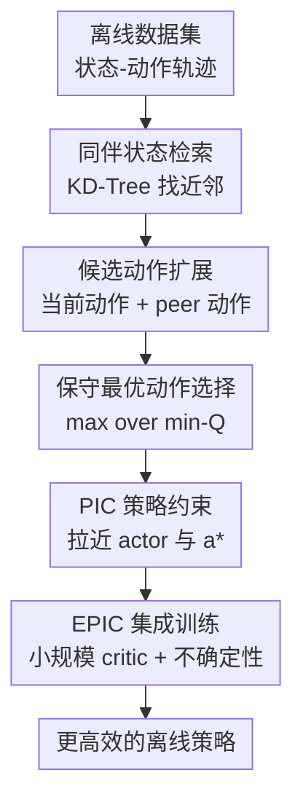

# Efficient Offline Reinforcement Learning via Peer-Influenced Constraint

**会议**: ICLR2026  
**OpenReview**: [https://openreview.net/forum?id=bPWCIJyp1K](https://openreview.net/forum?id=bPWCIJyp1K)  
**代码**: 待确认  
**领域**: 离线强化学习  
**关键词**: 离线强化学习, 行为约束, 同伴状态, 不确定性估计, 集成 critic

## 一句话总结

这篇论文提出 Peer-Influenced Constraint (PIC)：不再只把当前状态在数据集里的行为动作当作保守约束，而是从相似状态中借用候选动作、用 critic 选出更优的 in-distribution 动作来约束 actor，并进一步与小规模集成 critic 结合成 EPIC，在 D4RL 的 MuJoCo、AntMaze 和 Adroit 上取得更高平均分且保持较低训练开销。

## 研究背景与动机

**领域现状**：离线强化学习希望只用固定数据集 $D=\{(s,a,r,s')\}$ 训练策略，不再和环境交互。这个设定对机器人、医疗、工业控制很有吸引力，因为真实交互往往昂贵或危险；但它也让策略改进变得脆弱，因为 actor 一旦选择数据集没有覆盖的动作，critic 很可能给出过高估计，而训练过程没有在线反馈来纠错。

**现有痛点**：主流方法大致有两条路。价值正则化方法，例如 SAC-N、EDAC，会用多个 critic 的最小值或不确定性惩罚来压低 OOD 动作的 $Q$ 值，性能强但训练成本高，很多情况下需要很大的 ensemble。策略正则化方法，例如 TD3+BC、IQL、AWAC，则直接让策略贴近数据集动作，效率更高，但如果数据集里的行为策略本身不是最优，过强的行为克隆约束会把 actor 锁在局部最优附近。

**核心矛盾**：离线 RL 需要策略“留在数据分布内”，但“留在当前状态记录过的那一个行为动作附近”并不等价于“选择数据支持内的好动作”。在连续控制任务里，相近状态往往共享相似的可行动作和局部动力学结构。如果只使用严格的一对一状态-动作约束，方法会浪费掉数据集中跨状态的结构信息；如果完全放松约束，又会重新落入 OOD 过估计。

**本文目标**：作者想解决三个具体问题：第一，怎样在不训练额外生成模型、不大幅增加 critic 数量的前提下扩展离线策略可选择的安全动作集合；第二，怎样让这种约束既避免 OOD，又有机会摆脱次优行为策略；第三，怎样把这种策略约束和 ensemble 不确定性估计结合起来，用更少 critic 得到接近甚至超过大型 ensemble 的性能。

**切入角度**：论文的观察很直接：一个状态 $s$ 的原始行为动作未必最优，但它附近的 peer states 可能出现过更好的动作。只要这些 peer states 足够接近，借用它们对应的动作仍然大致位于数据支持内；再用当前 critic 对候选动作做保守筛选，就能在“数据内动作”里找一个更优的约束目标。

**核心 idea**：用“相似状态的动作候选 + critic 保守选择”替代“当前状态的单一行为动作”作为离线策略约束，让 actor 向数据支持内的高价值动作靠近，同时保留 TD3/EDAC 这类 actor-critic 主干的效率。

## 方法详解

### 整体框架

PIC 是一个可插拔的策略正则化模块。给定一个 minibatch 中的状态 $s$，方法先在离线数据集中检索 $K$ 个相似 peer states，再把这些 peer states 对应的行为动作和当前状态已有的动作合成候选动作集 $A'$；然后用 critic 对这些候选动作打分，选出一个保守意义上的最优动作 $a^*$；最后把 actor 输出 $\pi_\phi(s)$ 拉向 $a^*$，同时继续优化原来的 RL actor loss。

EPIC 是 PIC 的 ensemble 版本。它把 PIC 加到 EDAC 式的多 critic 框架里：actor 仍然用 ensemble 的最小 $Q$ 值做保守改进，候选动作选择也用 $\min_i Q_{\theta_i}(s,a)$，critic 端保留 EDAC 的 ensemble similarity 项来维持多 critic 多样性。论文还发现 PIC 强度 $\delta$ 与 ensemble size $N$ 存在 Coupling Effect：适度增强 PIC 后，策略更集中在数据支持内，OOD 动作的不确定性惩罚更有效，因此不必总靠很大的 $N$ 才能压住过估计。

### 关键设计

**1. 同伴状态检索：把行为约束从一对一动作扩展到局部数据邻域**

TD3+BC 的约束项本质上要求 $\pi_\phi(s)$ 接近数据集中同一个 $s$ 对应的行为动作 $a$。这在行为数据接近最优时很稳，但在动作覆盖不完整或行为策略次优时会过于保守。PIC 的第一步是为每个状态 $s$ 找到 $K$ 个 peer states $\hat{s}_j$，这些状态在状态空间里与 $s$ 最近，但显式排除 $s$ 自己以及已经选过的近邻：$\hat{s}_j=\arg\min_{\hat{s}\in D\setminus(D_{j-1}\cup\{s\})}\|s-\hat{s}\|$。

这个设计把“数据支持”理解成局部邻域，而不是单个样本点。只要环境满足一定局部平滑性，相近状态往往允许相近的好动作；因此，把 peer states 的动作纳入候选集，可以在仍然贴近数据分布的情况下增加动作多样性。为了避免训练时反复全量搜索，论文在训练前基于所有数据集状态建立 KD-Tree，训练时以 $O(|s|\log |D|)$ 的复杂度查询近邻；相比在状态-动作联合空间里搜索，这里只比较状态，开销更低，也减少了动作尺度对近邻检索的干扰。

**2. 保守最优动作选择：在数据内候选里找更可能带来提升的约束目标**

仅仅扩展候选动作还不够，因为 peer actions 里既可能有好动作，也可能有次优动作。PIC 对候选动作集 $A'$ 做第二层筛选：用 critic 估计每个候选动作在当前状态 $s$ 下的价值，并选择 $a^*=\arg\max_{a\in A'}\min_i Q_{\theta_i}(s,a)$。在 PIC-TD3 里通常使用两个 critic；在 EPIC 里使用 $N$ 个 critic 的最小值。

这里的关键是“先限制候选，再做价值选择”。如果直接最大化 $Q(s,\pi_\phi(s))$，actor 可能钻 critic 误差的空子，跑到 OOD 区域；如果只做 behavior cloning，又无法超过当前状态记录的行为动作。PIC 把 actor 的目标动作限制在数据中真实出现过的动作集合附近，再让 critic 在这些候选中挑一个高价值动作，相当于把策略改进的搜索范围放在“局部 in-distribution 的动作菜单”里。最终的 PIC distance 定义为 $d_D^{PIC}(s)=\|\pi_\phi(s)-a^*\|$，actor 通过惩罚这个距离被拉向 $a^*$。

**3. 耦合效应与 EPIC：用适度 PIC 强度换取更小的有效 ensemble**

论文不只把 PIC 加到 TD3 上，还系统观察了它与 uncertainty estimation 的关系。在 ensemble 方法里，较大的 $N$ 可以让 $\min_i Q_i$ 更悲观，从而惩罚 OOD 动作，但代价是训练慢、显存和计算开销高。作者发现，当 PIC 强度 $\delta$ 增大到适中范围时，策略动作更容易停留在数据支持内，同时潜在 OOD 候选上的 $Q_{min}$ 更悲观、$Q_{std}$ 和 $Q_{clip}=Q_{mean}-Q_{min}$ 更高。这说明 PIC 约束和 ensemble 不确定性不是彼此独立的两块，而是会共同加强 OOD 惩罚。

EPIC 就是围绕这个 Coupling Effect 设计的。它的 actor loss 写成 $L_{EPIC}(\phi)=\beta L_1(\phi)+\delta\mathbb{E}_{s\sim B}[d_D^{PIC}(s)]$，其中 $L_1$ 是基于 ensemble 最小 $Q$ 的保守 actor loss，$\delta$ 控制 peer constraint 强度。critic loss 沿用 EDAC 风格，在 TD 误差外加 ensemble similarity 项 $ES$ 来鼓励 critic 梯度多样性。这样一来，EPIC 不需要像 SAC-N 一样依赖极大的 critic 数量，而是通过“候选动作在数据内 + 多 critic 保守评估 + 适度 PIC 强度”组合出更高效的离线策略学习。

### 一个完整示例

可以把论文的动机实验想成一个二维 gridworld。某个关键状态附近的数据集中缺少“向右走”的动作，TD3+BC 看到的只有当前状态的历史动作，于是它会持续模仿这些次优动作，哪怕右侧才通向目标。PIC 的处理方式不同：它先找这个状态附近的 peer states，发现邻近状态里有人执行过“向右”或类似方向的动作，于是把这些动作和当前状态已有动作一起放入候选集。

随后 critic 会在候选动作里做保守比较。假设当前动作“向上”的最小 critic 值是 0.2，peer action“向右”的最小 critic 值是 0.8，另一个 peer action“向左”的最小 critic 值是 0.1，那么 PIC 会选 $a^*=$“向右”，再通过 $\|\pi_\phi(s)-a^*\|$ 把 actor 往这个动作拉。这个动作并不是凭空生成的 OOD 动作，而是来自相似状态的真实数据；它也不是盲目模仿 peer，而是经过当前状态下的 critic 选择。因此，PIC 有机会跳出严格行为克隆的局部最优。

### 损失函数 / 训练策略

PIC-TD3 的 actor 目标由 TD3-style 的 actor loss 与 PIC distance 组成：$L_{PT}(\phi)=\mathbb{E}_{s\sim B}[-\beta Q_{\theta_1}(s,a)]+\delta\mathbb{E}_{s\sim B}[d_D^{PIC}(s)]$，其中 $a=\pi_\phi(s)$，$\beta=\alpha |B|/\sum_{s_i,a_i}Q(s_i,a_i)$ 用来缓解 actor loss 对 $Q$ 尺度的敏感性，$\delta$ 是 PIC 约束强度。critic 仍按 TD3 的 TD loss 更新，actor 每隔固定频率更新一次。

EPIC 的 actor 目标是 $L_{EPIC}(\phi)=\beta L_1(\phi)+\delta\mathbb{E}_{s\sim B}[d_D^{PIC}(s)]$，其中 $L_1(\phi)=\mathbb{E}_{s\sim B}[-\min_i Q_{\theta_i}(s,\pi_\phi(s))]$。候选动作选择也从两 critic 扩展到 $N$ critic：$a^*=\arg\max_{a\in A'}\min_{i=1,\ldots,N}Q_{\theta_i}(s,a)$。critic 端使用 $L_{EPIC}(\theta_i)=\mathbb{E}[(y-Q_{\theta_i}(s,a))^2+ES]$，其中 $ES=\frac{\eta}{N-1}\sum_{i\ne j}\langle\nabla_a Q_{\theta_i}(s,a),\nabla_a Q_{\theta_j}(s,a)\rangle$，用于保持 ensemble 的差异性。

训练配置上，论文在 D4RL 的 Gym-MuJoCo、AntMaze 和 Adroit 上训练 100 万步，使用 Adam、学习率 $3\times10^{-4}$、batch size 256、隐藏层 256、折扣因子 0.99、target update rate $5\times10^{-3}$。常见有效范围是 $K=10$ 或 20，$\delta\in[1,3]$，$N$ 在 5 到 20 之间通常能在性能和效率之间取得较好平衡。

## 实验关键数据

### 主实验

论文主要在 D4RL 三类任务上评估：Gym-MuJoCo 连续控制、AntMaze 稀疏奖励导航、Adroit 机器人手操作。PIC-TD3 用来展示 peer constraint 本身的收益，EPIC 用来展示 PIC 与 ensemble 结合后的最终性能。

| 基准套件 | 最强相关基线 | PIC-TD3 平均分 | EPIC 平均分 | 关键结论 |
|--------|-------------|---------------|-------------|----------|
| Gym-MuJoCo 18 任务 | EDAC 85.2 / SAC-N 84.4 | 85.1 | 87.8 | EPIC 平均最高，PIC-TD3 已接近强 ensemble 方法 |
| AntMaze 6 任务 | SAC-BC-N 81.8 / MSG 80.6 | 75.6 | 82.9 | EPIC 在稀疏奖励导航上超过所有报告基线 |
| Adroit 12 任务 | IQL 53.5 / TD3+BC 49.9 | 53.8 | 62.5 | EPIC 对高维手操作任务提升最明显 |
| 总体趋势 | 价值正则化强但贵，BC 约束快但保守 | 中高性能、低开销 | 高性能、较高效率 | peer 动作选择缓解了保守性与 OOD 风险的冲突 |

更细地看，Gym-MuJoCo 中 EPIC 在 hopper-medium-expert 达到 112.3、walker2d-expert 达到 117.7、halfcheetah-expert 达到 107.9；AntMaze 中 EPIC 在 umaze、umaze-diverse、medium-play、large-play 等任务上都接近或超过强基线；Adroit 中 pen-human 从 EDAC 的 51.2 提升到 111.7，pen-cloned 从 68.2 提升到 94.6，说明 peer constraint 对行为数据质量不均的任务尤其有帮助。

### 消融实验

| 配置 / 因素 | 观察结果 | 说明 |
|------------|----------|------|
| peer 数量 $K$ | $K$ 从 2 增加到 10/20 通常提升性能，超过 20 后收益趋于饱和 | 更多 peer states 带来更丰富候选动作，但过多候选会引入 critic 选择误差 |
| PIC 强度 $\delta$ | $\delta<1$ 或 $\delta>4$ 时性能下降，$\delta\in[1,3]$ 较稳 | 过小约束不足，过大又压制策略改进 |
| ensemble size $N$ | 没有 PIC 时需要较大 $N$；加入适中 PIC 后，小规模 ensemble 已能达到强性能 | 支持论文提出的 Coupling Effect |
| 状态距离度量 | MuJoCo 中 Raw / Norm / PCA / Embed 的 EPIC 结果接近 | 标准连续控制状态结构清晰，PIC 不依赖单一距离技巧 |
| 高维 WTW locomotion | Embed 近邻最好，PCA/Norm 也能改善 raw Euclidean | 高维多模态场景下 peer 检索质量成为瓶颈 |

### 关键发现

- PIC-TD3 的平均分已经能追平或接近 EDAC/SAC-N 这类 ensemble 方法，说明“跨状态复用数据内动作”本身就是有效的策略正则化，而不是单纯靠更多 critic 堆出来的结果。
- EPIC 的优势来自组合效应：PIC 让策略动作更靠近数据支持，ensemble 的最小值和多样性项让候选动作选择更保守，二者一起减少 OOD 过估计。
- 参数敏感性有清晰规律：$K$ 需要足够大但不必无限增大，$\delta$ 需要适中，$N$ 太大反而可能因为过度悲观导致学习变慢。
- 离线到在线微调中，EPIC 在 AntMaze 和 Adroit 上也有竞争力，尤其 Adroit cloned 任务平均从 28.9 提升到在线后的 53.2，说明离线预训练得到的策略不是只在固定评估上“调参好看”。

## 亮点与洞察

- PIC 的巧妙之处在于重新定义了“保守约束”的对象。它没有要求 actor 死贴当前样本的行为动作，而是让 actor 贴近局部邻域中经 critic 筛选出的高价值动作，这比传统 BC 约束多了一层数据结构利用。
- 论文把 peer action 约束做成插件，而不是重写整个 offline RL 算法。这让 PIC 可以接到 TD3、SAC、IQL 以及 EDAC 上，附录里 PIC-SAC 和 PIC-IQL 在 AntMaze 上也有明显收益，说明机制具有迁移性。
- Coupling Effect 是这篇论文最有启发的部分。很多 offline RL 工作把“策略约束”和“不确定性估计”分开设计，本文展示了约束强度会改变策略动作分布，从而改变 ensemble uncertainty 的有效性，这对调节 conservative RL 的计算成本很有参考价值。
- KD-Tree 的使用很朴素，但工程上重要。PIC 如果每步都暴力找近邻，方法会失去效率优势；预建索引让它能保持接近策略约束方法的训练开销。
- 对其他任务的迁移思路也很自然：只要任务里相似状态共享可迁移动作，就可以考虑把“当前样本监督”扩展成“局部邻域候选监督”，例如离线机器人控制、多技能策略学习或轨迹数据不均衡的 imitation learning。

## 局限与展望

- 最大局限是 peer state 的语义质量。论文主方法主要用 raw state 的欧氏距离检索近邻，在 MuJoCo 这类低/中维状态任务上可行，但在视觉输入、高维机器人状态或多模态行为数据里，欧氏近邻未必是真正的动力学近邻。
- 候选动作仍然受数据覆盖限制。如果某个区域的数据极稀疏，peer actions 可能只是“看起来近但决策含义不同”的动作；如果整个邻域都缺少好动作，PIC 也不能凭空创造可靠的最优动作。
- 超参数仍需要调节。$\delta$、$K$、$N$ 对性能有明显影响，虽然论文给出了经验范围，但跨任务自动选择还没有解决。
- 理论分析依赖 Lipschitz 连续和平滑邻域假设，适合解释连续控制，但对离散决策、接触丰富的机器人任务或强非平滑动力学，界里的假设可能比较理想化。
- 后续可以把 peer retrieval 放到学习到的表示空间中，例如 contrastive state representation、action-conditioned metric 或 dynamics-aware embedding；也可以让 $\delta$ 随不确定性、邻域密度或训练阶段自适应调整。

## 相关工作与启发

- **vs TD3+BC**: TD3+BC 把 actor 拉向当前样本的行为动作，简单高效但容易继承次优行为；PIC-TD3 则把约束目标换成 peer action 候选中的高价值动作，因此在保持数据内约束的同时增加了策略改进空间。
- **vs EDAC / SAC-N**: EDAC 和 SAC-N 主要靠 ensemble 的 pessimism 来压制 OOD 动作，性能强但计算成本高；EPIC 用 PIC 先把策略动作推回数据支持内，再用小规模 ensemble 做保守评估，平均性能更高且不需要很大的 critic 数量。
- **vs PRDC**: PRDC 也使用 KD-Tree 和数据集约束，但更强调 state-action 距离约束，可能面临状态和动作优先级难平衡的问题；PIC 只在状态空间找 peer，然后用 critic 在动作候选中选择，避免把近邻检索和动作价值判断混在同一个距离度量里。
- **vs IQL / in-sample 方法**: IQL 避免显式评估 OOD 动作，训练稳定，但策略改进主要受 advantage-weighted BC 限制；PIC 提供了一种更主动的 in-sample action expansion，可以作为 IQL 或 SAC 的附加约束。
- **启发**: 离线 RL 不一定只能在“模仿行为策略”和“悲观压低 OOD”之间二选一。更细的方向是挖掘数据集内部结构：相似状态、轨迹片段、技能邻域、行为簇都可能为策略提供比单样本 BC 更好的约束目标。

## 评分

- 新颖性: ⭐⭐⭐⭐☆ 论文的组件都不复杂，但把 peer-state action reuse 与 conservative actor update 结合得很自然，Coupling Effect 的分析也有新意。
- 实验充分度: ⭐⭐⭐⭐⭐ 覆盖 MuJoCo、AntMaze、Adroit、offline-to-online、参数敏感性、距离度量和训练效率，实验面很完整。
- 写作质量: ⭐⭐⭐⭐☆ 主线清楚，图 2 对训练流程有帮助；但理论和 uncertainty 分析部分的因果解释还可以更紧，部分附录结果略堆。
- 价值: ⭐⭐⭐⭐☆ 方法易实现、可插拔、对已有 actor-critic 离线 RL 算法友好，尤其适合想在不显著增加 ensemble 成本的情况下提升策略约束质量的场景。

<!-- RELATED:START -->

## 相关论文

- [\[ICLR 2026\] Adaptive Scaling of Policy Constraints for Offline Reinforcement Learning](adaptive_scaling_of_policy_constraints_for_offline_reinforcement_learning.md)
- [\[ICLR 2026\] ADM-v2: Pursuing Full-Horizon Roll-out in Dynamics Models for Offline Policy Learning and Evaluation](adm-v2_pursuing_full-horizon_roll-out_in_dynamics_models_for_offline_policy_lear.md)
- [\[ICLR 2026\] Chain-of-Context Learning: Dynamic Constraint Understanding for Multi-Task VRPs](chain-of-context_learning_dynamic_constraint_understanding_for_multi-task_vrps.md)
- [\[ICML 2026\] Safe Reinforcement Learning with Preference-Based Constraint Inference](../../ICML2026/reinforcement_learning/safe_reinforcement_learning_with_preference-based_constraint_inference.md)
- [\[ICLR 2026\] Sample Efficient Offline RL via T-Symmetry Enforced Latent State-Stitching](sample_efficient_offline_rl_via_t-symmetry_enforced_latent_state-stitching.md)

<!-- RELATED:END -->
