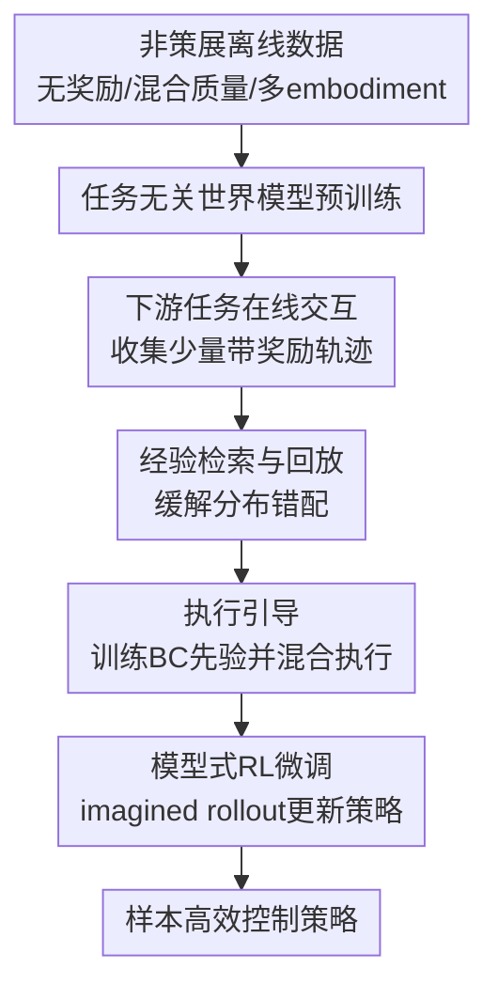

# Efficient Reinforcement Learning by Guiding World Models with Non-Curated Data

**会议**: ICLR 2026  
**OpenReview**: [https://openreview.net/forum?id=oBXfPyi47m](https://openreview.net/forum?id=oBXfPyi47m)  
**代码**: https://github.com/zhaoyi11/ncrl  
**领域**: 强化学习 / 世界模型  
**关键词**: 非策展离线数据, 世界模型, 样本高效强化学习, 离线到在线RL, 探索引导

## 一句话总结
NCRL 先用无奖励、混合质量、多 embodiment 的非策展数据预训练任务无关世界模型，再在在线 RL 阶段通过检索式经验回放和行为克隆先验策略引导探索，显著缓解离线预训练分布与在线微调分布错配，在 72 个视觉运动控制任务上用 150k 交互步达到接近从头训练数倍样本预算的效果。

## 研究背景与动机
**领域现状**：提高在线强化学习的样本效率，最直接的思路是利用已有离线数据。传统 offline RL 或 offline-to-online RL 往往默认离线数据是目标任务相关、带奖励标签，甚至质量较高的 demonstration；模型式方法则希望从离线轨迹里学到动态规律，再用世界模型做 imagined rollout 来训练 actor-critic。

**现有痛点**：真实机器人或视觉控制场景里，最容易收集到的并不是这种干净数据，而是大量没有奖励、质量参差不齐、来自不同 embodiment 的交互轨迹。给这些数据补奖励很贵，把它们直接当 offline RL 数据又不合适；只拿来预训练视觉 encoder，则浪费了动作、动态和状态覆盖信息；只预训练世界模型再在线 fine-tune，看似合理，却经常在难探索任务上不比从头训练好多少。

**核心矛盾**：问题不只是世界模型预训练得不够大，而是预训练数据分布和在线早期数据分布之间出现错配。在线 RL 初期策略很弱，收集到的状态分布窄且偏；如果世界模型只在这些窄分布上继续更新，既会忘掉离线数据里学到的动态，又会让 imagined rollout 的初始状态只来自低质量在线 buffer，策略训练自然很难看到高回报区域。

**本文目标**：作者要回答的是：在不要求奖励标签、不要求专家质量、不要求单一 embodiment 的情况下，如何把非策展离线数据真正转化为在线 RL 的样本效率收益？这个目标可以拆成三件事：先从杂乱数据里学一个可迁移的世界模型；再在下游任务微调时避免分布漂移带来的遗忘；最后用离线数据中有用的动作先验帮助早期探索。

**切入角度**：论文的观察很具体：非策展数据在预训练阶段有价值，但在 fine-tuning 阶段不能被丢掉。即便数据没有奖励，只要能从里面检索出和当前任务视觉状态相近的轨迹，它仍然可以作为世界模型微调的锚点、imagined rollout 的初始状态补充，以及行为克隆 prior 的训练材料。

**核心 idea**：NCRL 的核心就是“不要只用非策展数据预训练世界模型，而要在在线 RL 微调时继续用它来 rehearsal 和 guide execution”，从而把 reward-free mixed-quality 数据变成可用的探索与动态先验。

## 方法详解

### 整体框架
NCRL 是一个两阶段模型式 offline-to-online RL 管线。第一阶段从非策展离线数据 $D_{off}$ 中训练任务无关的多 embodiment 世界模型；第二阶段进入具体下游任务，用少量在线交互得到 $D_{on}$，同时从 $D_{off}$ 中检索任务相关轨迹 $D_{retrieved}$，并把这些轨迹同时用于世界模型 rehearsal、model rollout 初始状态扩展和行为克隆先验策略训练。

世界模型采用 Dreamer 系列常用的 recurrent state space model (RSSM)，包括序列模型 $f_\theta$、encoder $q_\theta$、dynamics predictor $p_\theta$ 和 decoder $d_\theta$。为了适配多 embodiment，作者移除任务相关 loss，用 zero-padding 统一不同 embodiment 的动作维度，并把模型扩到约 280M 参数。微调阶段仍沿用 DreamerV3 式的 latent imagination：从 replay buffer 采样初始 latent state，rollout policy $\pi_\phi(a|s)$ 和 dynamics，再用 $\lambda$-return 更新 critic 与 actor。

### 关键设计
**1. 非策展数据预训练世界模型：把无奖励多 embodiment 轨迹先变成动态先验**

本文刻意放宽了离线数据假设：$D_{off}$ 中轨迹没有奖励 $r_t$，质量混杂，并且来自多个 embodiment。这样的数据不能直接喂给依赖奖励标签的 offline RL，但它仍然包含“看到某类观测后，执行某类动作会转移到哪里”的动态信息。因此 NCRL 先只训练观测重建和 latent dynamics，不训练任务 reward 或 task head。

RSSM 的 latent 更新可以理解为：历史状态 $h_t=f_\theta(h_{t-1}, z_{t-1}, a_{t-1})$ 汇总过去，encoder 从当前观测得到后验 latent $z_t \sim q_\theta(z_t|h_t,o_t)$，dynamics predictor 预测先验 latent $\hat{z}_t \sim p_\theta(\hat{z}_t|h_t)$，decoder 重建观测 $\hat{o}_t \sim d_\theta(\hat{o}_t|h_t,z_t)$。训练目标由重建项、动态 KL 项和 representation KL 项组成：

$$
L(\theta)=\mathbb{E}_{D_{off}}\left[\frac{1}{T}\sum_{t=1}^{T}\left(\beta_1L_{pred}+\beta_2L_{dyn}+\beta_3L_{rep}\right)\right].
$$

这里的关键不是提出新 architecture，而是证明一个足够大的 RSSM 在 reward-free、mixed-quality、多 embodiment 数据上也能学到有用的视觉运动动态。相比只预训练视觉表示，世界模型保留了动作和未来状态的信息；相比多任务 offline RL，它不需要知道每条轨迹对应什么 reward。

**2. 经验检索与回放：只拿任务相关离线轨迹来对抗在线分布漂移**

论文最重要的诊断是：naive world model fine-tuning 失败，根因在于 $D_{off}$ 与早期 $D_{on}$ 分布不一致。在线训练初期，agent 可能只在起点附近乱动，$p_0(s)$ 很窄；世界模型若只在这批窄数据上更新，会忘记预训练中的动态覆盖，imagined rollout 也只能从低价值状态出发。直接 replay 全部非策展数据也不现实，因为离线数据规模大约比结构化 offline RL 数据大两个数量级，且包含大量无关任务和 embodiment。

NCRL 的做法是从 $D_{off}$ 中检索与当前任务视觉状态相近的轨迹。具体地，利用预训练 encoder $e_\theta$，比较在线 buffer 中初始观测 $o_{on}$ 与离线轨迹初始观测 $o_{off}$ 的特征距离：

$$
D=\|e_\theta(o_{on})-e_\theta(o_{off})\|_2.
$$

作者预先把离线轨迹 ID 和 neural feature 建成 key-value 索引，并用 Faiss 秒级取 top-$k$ 相似轨迹。检索出的 $D_{retrieved}$ 在 fine-tuning 中有三重作用：继续参与世界模型训练以防遗忘；补充 imagined rollout 的初始状态分布 $p_0(s)$，让策略更新能从更有希望的状态出发；同时作为行为克隆 prior 的训练数据。这个设计比“把所有离线数据拼进 replay buffer”更稳，因为它把非策展数据先压成任务相关的小集合；也比“只预训练一次”更强，因为它在微调阶段持续约束模型别被早期 online data 带偏。

**3. 执行引导：用检索轨迹训练先验策略，帮助早期探索进入可信区域**

仅仅修世界模型还不够，在线数据收集本身也需要变好。标准 RL 早期靠随机或未成熟策略探索，尤其在 Shelf Place、Assembly、Stick Pull 这类稀疏或长时序 manipulation 任务里，很难碰到有意义的状态。NCRL 因此在 $D_{retrieved}$ 上训练一个行为克隆 prior $\pi_{BC}$，再在真实环境采样时把它和当前 RL policy $\pi_{RL}$ 混合使用。

具体执行方式不是固定让 $\pi_{BC}$ 只在 episode 开头接管，而是在每个 episode 开始时按预设 schedule 决定是否启用 guidance；若启用，则随机采样一个开始时刻 $t_{bc}$ 和持续时间 $H$，在该片段内执行 $\pi_{BC}$，其余时间执行 $\pi_{RL}$。这样做比传统 JSRL-BC 更灵活：它不假设 prior 一定适合从初始状态连续滚很久，也能在 episode 中段把 agent 拉回离线数据覆盖过、世界模型更有信心的区域。

这个机制背后的直觉是，早期 $\pi_{BC}$ 往往比尚未学会任务的 $\pi_{RL}$ 更知道“合理动作长什么样”，即使检索数据不是专家演示，也能提供动作流形和状态覆盖。论文附录给了混合策略的性能下界：当 guide policy 相对 exploration policy 的 advantage 为正且混合比例 $\alpha$ 选得合适时，混合策略 $\tilde{\pi}=\alpha\pi_g+(1-\alpha)\pi_e$ 可以获得正的性能改进。这不是把 BC 当最终策略，而是把它当早期数据收集的方向盘。

**4. 模型式在线微调：让 rehearsal 和 guidance 同时服务于 imagined policy learning**

NCRL 的最终策略仍然通过模型式 RL 学出来，而不是简单模仿离线数据。在线交互得到带奖励轨迹 $D_{on}$ 后，reward model $r_\xi$ 只在在线数据上学习奖励；世界模型则同时用 $D_{on}$ 和 $D_{retrieved}$ 更新，因为后者没有奖励但有观测-动作-下一观测动态。actor 和 critic 使用 imagined trajectories 训练，critic 拟合 $\lambda$-return，actor 最大化想象轨迹中的 return 加 entropy 项。

这一点区分了 NCRL 与 UDS / ExPLORe / RLPD 类方法。UDS 给无标签数据硬标零 reward，容易引入偏差；ExPLORe 用不确定性构造奖励，但依赖 reward proxy 调参；RLPD 类方法通常需要带奖励的任务相关离线数据。NCRL 则把 reward-free 数据放在它更自然的位置：用于动态建模、状态初始化、动作 prior，而不是强行给它补一个可能错误的 reward。

### 一个完整示例
以 Meta-World 的 Shelf Place 为例，naive fine-tuning 时 agent 早期大多在初始区域乱动，在线 buffer 里的状态分布很窄；世界模型继续训练后，会越来越适应这些低价值状态，甚至忘掉预训练时见过的相似操控轨迹。于是 imagined rollout 的起点也集中在这些失败状态上，actor 很难通过模型想象到“拿起物体并放到架子上”的中后段状态。

NCRL 会先用当前在线初始观测去非策展数据中检索视觉特征相近的轨迹，例如同样出现机械臂、物体和架子布局的轨迹。即便这些轨迹成功率不一，它们仍提供了更接近任务的状态覆盖。训练时，世界模型一边看在线新数据，一边 rehearsal 这些检索轨迹；model rollout 的初始状态也可以来自检索轨迹中的 latent state。与此同时，BC prior 学到一些基础动作模式，例如靠近物体、抬升或移动到架子附近。在线采样时，RL policy 和 BC prior 随机分段混合执行，agent 更容易进入世界模型熟悉且有潜在回报的状态区域。这样，policy learning 不是从纯随机失败轨迹里硬熬，而是在“动态可信 + 状态更丰富 + 动作更合理”的条件下更新。

### 损失函数 / 训练策略
预训练阶段的世界模型损失包含观测重建、dynamics KL 和 representation KL：$L_{pred}=-\ln d_\theta(o_t|z_t,h_t)$，$L_{dyn}=\max(1,KL(sg(q_\theta)\|p_\theta))$，$L_{rep}=\max(1,KL(q_\theta\|sg(p_\theta)))$。这里使用 stop-gradient 分别稳定 dynamics prior 和 posterior representation。

微调阶段，记 $s_t=[h_t,z_t]$，actor rollout 使用 world model 生成 imagined trajectory。critic 预测 $\lambda$-return 分布，其中

$$
V_t^\lambda=\hat{r}_t+\gamma\begin{cases}(1-\lambda)v_{t+1}^\lambda+\lambda V_{t+1}^\lambda,&t<H\\v_H^\lambda,&t=H.\end{cases}
$$

critic 最大化目标 return 的 log likelihood，actor 通过 imagined latent state 和 action 反向传播来最大化 $V_t^\lambda$，并加上动作熵正则。关键超参包括：预训练 200k steps、batch size 16、sequence length 64、fine-tuning warm-up 15000 frames、offline data mix ratio 0.25、discount 0.99、$\lambda=0.95$、imagine horizon 16；execution guidance schedule 在 DMControl 上为 `linear(1,0,50000)`，Meta-World 上为 `linear(1,0,150000)`。

## 实验关键数据

### 主实验
论文在像素输入的 DMControl 和 Meta-World 上做实验，共 72 个视觉运动控制任务，覆盖 locomotion 与 robotic manipulation。离线数据由两部分组成：DMControl 中 5 个 embodiment、10k 条由 curiosity-based unsupervised RL agent 采集的轨迹；Meta-World 中 50 个任务、50k 条由 TDMPC-v2 agent 加噪声产生的混合质量轨迹。总计约 60k 条轨迹、1000 万 state-action pairs，且没有用于目标任务的奖励标签。

| 基准 | 样本预算 | DreamerV3 | DrQ-v2 | NCRL | 结论 |
|------|----------|-----------|--------|------|------|
| Meta-World 50 tasks, mean success | 150k | 0.360 | 0.430 | 0.748 | NCRL 接近 DrQ-v2 1M 的 0.753，但只用 15% 在线步数 |
| Meta-World 50 tasks, median success | 150k | 0.130 | 0.330 | 0.840 | 中位数提升更明显，说明不是少数任务拉高均值 |
| DMControl 22 tasks, mean return | 150k | 320.86 | 226.49 | 617.73 | NCRL 超过 DreamerV3/DrQ-v2 在 500k 时的均值对比中多数任务表现 |
| DMControl 22 tasks, median return | 150k | 204.35 | 166.05 | 733.3 | 对 locomotion 类任务样本效率提升很强 |

| 代表任务 | DreamerV3 @ 150k | DrQ-v2 @ 150k | NCRL @ 150k | 现象 |
|----------|------------------|---------------|-------------|------|
| Shelf Place | 0.0 | 0.0 | 0.80 | 难探索 manipulation 中，检索 rehearsal 和 guidance 带来明显收益 |
| Assembly | 0.0 | 0.0 | 0.44 | 从头训练几乎无进展，NCRL 能达到可观成功率 |
| Stick Pull | 0.0 | 0.0 | 0.52 | 长时序操控任务受益于先验动作与状态覆盖 |
| Quadruped Walk | 145.2 | 76.5 | 855.6 | 多 embodiment 世界模型对 locomotion 迁移很强 |
| Walker Walk Hard | -4.7 | -17.1 | 842.8 | 在 hard 变体上，NCRL 显著超过从头训练 |
| Walker Run | 224.4 | 143.0 | 707.7 | 离线探索轨迹对高速运动任务很有帮助 |

与利用离线数据的 baselines 相比，NCRL 也表现更强。论文比较了 R3M、UDS-RLPD、ExPLORe 和 JSRL-BC：R3M 只预训练视觉表示，多数任务无法稳定提升；UDS 给无标签数据标零 reward，收益有限；ExPLORe 在部分 locomotion 任务上有效，但在 hard manipulation 上仍落后；JSRL-BC 依赖能否从离线数据抽到足够好的 prior，而 NCRL 即使面对非专家轨迹也能通过世界模型和在线更新继续改进。

### 消融实验
| 配置 | 使用内容 | 代表结果 / 现象 | 说明 |
|------|----------|----------------|------|
| DreamerV3 | 从头训练世界模型与策略 | 在 Shelf Place、Assembly、Stick Pull 等任务上早期几乎为 0 | 没有离线动态和动作先验，稀疏探索困难 |
| +P | 只加入世界模型预训练 | Walker Run 等离线覆盖较广的任务有提升，但 Meta-World 窄分布任务不稳定 | 预训练本身有用，但不能解决 fine-tuning 分布漂移 |
| +P+ER | 加入 experience rehearsal | Cheetah Run Hard 和 manipulation 任务训练更稳 | 检索轨迹减少在线分布与离线/专家分布距离，并防止遗忘 |
| +P+ER+G | 加入 execution guidance，即 NCRL | 在 Fig. 6 的四个代表任务上整体最好 | 早期数据收集被 prior 引导，探索更容易进入有价值区域 |
| +OTS | 用 uncertainty-based reward labeling 替代 guidance | 在 Assembly、Stick Pull 等 hard exploration 任务明显落后 NCRL | 用不确定性奖励不如直接用先验策略引导执行稳定 |

| 额外分析 | 结果 | 含义 |
|----------|------|------|
| 检索精度 Precision@250 | Quadruped Run / Assembly / Shelf Place 为 100%，Door Open 为 84% | 简单 encoder 特征检索已经能找到高度相关轨迹 |
| 检索精度 Precision@500 | 前三个任务为 100%，Door Open 为 68% | Door Open 会混入 Door Close/Lock/Unlock 等相关但非同任务轨迹 |
| task-irrelevant data 注入 | 在 Shelf Place / Assembly / Stick Pull 中逐步替换 0%-100% 检索轨迹，NCRL 仍较鲁棒 | 方法不完全依赖完美检索，但高质量检索会更好 |
| fine-tune world model components | Quadruped Walk 上 full model fine-tuning 最好 | encoder、decoder、latent dynamics 在下游微调中都重要 |
| imitation baseline | Diffusion Policy 在混合质量非专家数据上表现不佳 | 数据不是专家演示，单纯模仿不能充分利用 |

### 关键发现
- naive 预训练世界模型并不是银弹。只用 $D_{off}$ 预训练、再丢掉离线数据去在线 fine-tune，容易被早期窄 online distribution 带偏，尤其在 hard exploration manipulation 任务上表现差。
- 检索式 rehearsal 的价值在于“选择性地继续使用离线数据”。它不是把 60k 条轨迹全塞回训练，而是把和当前任务视觉状态相近的轨迹拿出来，既减少分布距离，又保留 reward-free 数据的动态信息。
- execution guidance 的收益主要发生在在线早期。BC prior 不需要是专家，只要比随机探索更接近合理动作分布，就能帮助 agent 收集更有价值的数据；schedule 退火后，最终策略仍由 RL policy 接管并继续优化。
- NCRL 在 locomotion 与 manipulation 上都有收益，但个别任务仍困难。例如 Meta-World 中 Disassemble 成功率为 0，Pick Place 和 Soccer 的 150k 成功率也较低，说明长 horizon、小目标或严格成功判据仍可能需要更多预算或更强探索。

## 亮点与洞察
- 这篇论文最有价值的地方，是把“非策展数据怎么用于 RL”这个问题从预训练阶段推进到了 fine-tuning 阶段。很多工作会默认大数据只负责学 representation 或 world model，但 NCRL 指出真正的瓶颈往往发生在下游在线微调初期。
- 经验检索这个设计很朴素，却击中了非策展数据的可用性问题。数据越杂，越不能全量 replay；但完全丢掉又浪费。用预训练 encoder 做近邻检索，相当于给世界模型 fine-tuning 找一个任务相关的记忆子集。
- execution guidance 的思路比“给无奖励数据造 reward”更自然。非策展轨迹的动作未必最优，但它们能告诉 agent 哪些动作序列像真实控制行为；把这个先验用于早期采样，比硬标零奖励或 UCB reward 更少引入 reward 偏差。
- 论文把样本效率收益放在 72 个任务上检验，而不是只在少数 world model demo 任务上展示。这让结论更有说服力：NCRL 不是某个 manipulation benchmark 的技巧，而是对 model-based RL fine-tuning 流程的一种系统修正。
- 可迁移的启发是：在任何“预训练动态模型 + 下游在线适配”的系统中，都要关注预训练数据在适配阶段是否被继续正确使用。对机器人、自动驾驶或 embodied agent 来说，post-training 的数据调度可能和 pre-training architecture 一样重要。

## 局限与展望
- 当前世界模型仍基于 RSSM / RNN 风格结构，作者也承认它在继续 scale 时可能不如 Transformer 或 diffusion-based world model。NCRL 的 rehearsal/guidance 思路可以迁移，但最优 architecture 仍未解决。
- 离线数据虽然被称为 non-curated，但仍是 in-domain 数据：DMControl 和 Meta-World 的轨迹与下游任务属于同一大环境族。方法还没有证明可以直接利用更开放的 in-the-wild 视频或跨仿真器数据。
- 泛化到新 embodiment 仍然困难。论文展示了 unseen task 的趋势和 continual adaptation，但对完全新机器人形态、新相机配置或真实世界硬件的泛化还需要更多验证。
- 实验全部在模拟器中完成。真实机器人上 reward 稀缺、reset 成本高、传感噪声和安全约束更复杂，NCRL 的样本效率优势很有吸引力，但执行 guidance 在真实环境中也需要安全过滤。
- 检索策略比较简单，只用 initial observation 的 encoder 特征距离。对视觉相似但动力学/目标不同的任务，检索可能混入相关但不完全匹配的轨迹；未来可以结合动作、时序片段、语言任务描述或 learned task embedding 做更精细检索。

## 相关工作与启发
- **vs DreamerV3**: DreamerV3 从在线数据中学习世界模型并用 imagined rollout 训练策略，本文沿用其模型式 RL 框架，但额外加入非策展离线数据预训练、检索式 rehearsal 和 execution guidance。区别在于 NCRL 重点解决的是“预训练后的在线微调如何不被分布漂移毁掉”。
- **vs RLPD / offline-to-online RL**: RLPD 类方法把带奖励的离线数据和在线数据一起用于 off-policy update，假设数据与目标任务高度相关。NCRL 面对的是无奖励、混合质量、多 embodiment 数据，因此不直接学 Q-function，而是把离线数据用于世界模型和 prior。
- **vs ExPLORe / UDS**: ExPLORe 用不确定性给无标签离线数据构造 reward，UDS 则赋零 reward；本文认为 reward-free 数据更适合提供动态和行为先验，而不是被硬塞进 reward learning。实验中 NCRL 在 hard exploration manipulation 上明显优于这些 reward-labeling 思路。
- **vs JSRL-BC**: JSRL-BC 使用行为克隆 prior jump-start 在线探索，但通常依赖任务相关数据，并且 prior 主要在 episode 开头使用。NCRL 的 prior 来自检索出的非策展轨迹，且可在 episode 中随机片段接管，更适合 mixed-quality 数据。
- **vs iVideoGPT / world model pre-training**: iVideoGPT 等工作关注更强或更可扩展的 world model architecture，本文则强调 fine-tuning 机制。NCRL 不依赖 reward shaping 或 demonstration replay buffer prefill，也能在对齐设置中优于 iVideoGPT，说明“如何用离线数据指导在线阶段”本身就是关键变量。

## 评分
- 新颖性: ⭐⭐⭐⭐☆ 设定很现实，核心组件并不复杂，但把 reward-free non-curated 数据在 fine-tuning 阶段的三种用途组织成闭环，是一个清晰且有启发的贡献。
- 实验充分度: ⭐⭐⭐⭐⭐ 72 个任务、多个基线、组件消融、检索质量、guidance schedule、模型组件 fine-tuning 和 continual adaptation 都覆盖到了，证据链比较扎实。
- 写作质量: ⭐⭐⭐⭐☆ 问题诊断、方法动机和实验结论都比较清楚；少数完整曲线主要放在附录，读主文时需要来回对照。
- 价值: ⭐⭐⭐⭐⭐ 对样本高效 RL、机器人控制和世界模型 post-training 都有直接参考价值，尤其适合需要利用大量无奖励历史交互数据的场景。

<!-- RELATED:START -->

## 相关论文

- [\[ICLR 2026\] Object-Centric World Models from Few-Shot Annotations for Sample-Efficient Reinforcement Learning](object-centric_world_models_from_few-shot_annotations_for_sample-efficient_reinf.md)
- [\[ICLR 2026\] From Observations to Events: Event-Aware World Models for Reinforcement Learning](from_observations_to_events_event-aware_world_models_for_reinforcement_learning.md)
- [\[ICLR 2026\] Learning Massively Multitask World Models for Continuous Control](learning_massively_multitask_world_models_for_continuous_control.md)
- [\[ICLR 2026\] Mixture-of-World Models: Scaling Multi-Task Reinforcement Learning with Modular Latent Dynamics](mixture-of-world_models_scaling_multi-task_reinforcement_learning_with_modular_l.md)
- [\[ICLR 2026\] Learning to Be Uncertain: Pre-training World Models with Horizon-Calibrated Uncertainty](learning_to_be_uncertain_pre-training_world_models_with_horizon-calibrated_uncer.md)

<!-- RELATED:END -->
