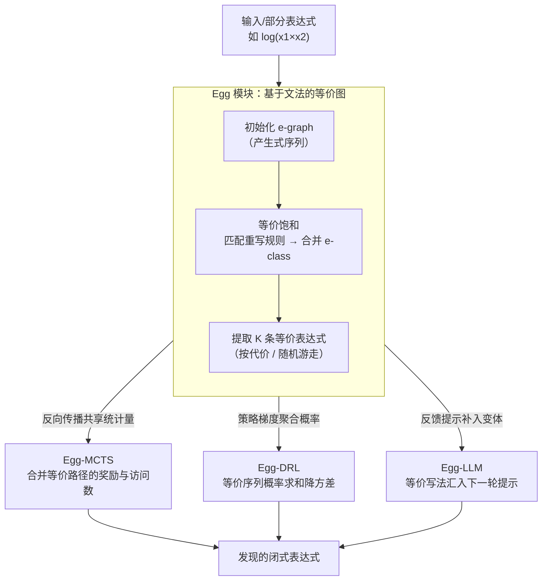

# EGG-SR: Embedding Symbolic Equivalence into Symbolic Regression via Equality Graph

**会议**: ICLR 2026  
**arXiv**: [2511.05849](https://arxiv.org/abs/2511.05849)  
**代码**: [项目页面](https://nan-jiang-group.github.io/egg-sr)  
**领域**: 强化学习  
**关键词**: 符号回归, 符号等价, 等价图, 蒙特卡洛树搜索, 深度强化学习

## 一句话总结

提出 Egg-SR 统一框架，通过等价图（e-graph）将符号等价性嵌入 MCTS、DRL 和 LLM 三类符号回归方法中，分别实现子树剪枝、梯度方差降低和反馈提示增强。理论证明 Egg-MCTS 收紧遗憾界、Egg-DRL 降低梯度估计方差，实验验证一致提升表达式发现精度。

## 研究背景与动机

符号回归（Symbolic Regression）旨在从实验数据中发现闭合形式的物理规律，是 AI 驱动科学发现的重要任务。搜索空间随数据维度呈指数增长，计算挑战巨大。

一个有前景但未充分探索的方向是**符号等价性**：许多语法不同的表达式定义相同函数。例如：
- $\log(x_1^2 x_2^3)$
- $\log(x_1^2) + \log(x_2^3)$
- $2\log(x_1) + 3\log(x_2)$

这三者在数学上完全等价，但现有算法将它们视为不同输出，导致：

**冗余探索**：MCTS 会独立搜索等价子树，浪费计算

**训练缓慢**：DRL 无法利用等价序列共享奖励信号，梯度方差大

**反馈信息不足**：LLM 仅看到单一表达式形式，错失等价变体的信息

核心挑战：如何统一且可扩展地表示符号等价表达式并嵌入现代学习框架？显式枚举等价变体的数量随表达式长度指数增长，不可行。

## 方法详解

### 整体框架

Egg-SR 的核心是一个可复用的等价表示模块 **Egg**（基于文法的等价图），它把一个表达式连同它在数学上所有的等价变体压缩进同一张 e-graph，再通过三个接口分别接入 MCTS、DRL 和 LLM。三类方法各自在最合适的环节调用 Egg：MCTS 在反向传播时共享等价路径的统计量，DRL 在计算策略梯度时聚合等价序列的概率，LLM 在生成反馈提示时补入等价变体。同一张 e-graph 被三类算法在各自最关键的环节复用，构成「一个等价表示 + 三种嵌入方式」的统一框架。

### 关键设计

**1. Egg 模块：用 e-graph 紧凑地装下所有等价表达式**

直接枚举一个表达式的等价变体会随长度指数爆炸——例如 $\log(x_1\times\cdots\times x_n)$ 就有 $2^{n-1}$ 个等价形式，根本存不下。Egg 先用一个上下文无关文法 $\langle V, \Sigma, R, S\rangle$ 表示表达式（$V=\{A\}$ 是非终结符，$\Sigma$ 是变量与常数等终结符，$R$ 是产生式规则，表达式通过对最左非终结符依次应用规则而生成），再把它装进 e-graph：e-graph 由若干等价类（e-class）组成，每个 e-class 是一组语义等价的 e-node，每个 e-node 编码一个运算并引用子 e-class。由于公共子表达式只存一份，等价变体之间大量共享结构，存储从指数级压回紧凑表示。构建过程称为**等价饱和**：先用输入表达式的产生式序列初始化 e-graph，然后对每条重写规则（如 $\log(ab)\leadsto\log(a)+\log(b)$）匹配其左部模式，在匹配处插入右部对应的新 e-node 并把两侧合并进同一 e-class，如此迭代直到再无新等价关系产生或达到最大迭代次数。需要取出表达式时有两种提取策略：按代价提取拿到最简形式，或随机游走采样一批等价表达式供下游使用。

**2. Egg-MCTS：把等价路径的搜索统计量并到一起**

标准 MCTS 走「UCT 选择 → 扩展 → 模拟 → 反向传播」四步，但它把 $\log(x_1\times A)$ 和 $\log(x_1)+\log(A)$ 这种数学上相同的路径当成两棵独立子树各搜一遍，浪费预算。Egg-MCTS 只改反向传播这一步：把当前部分表达式转成 e-graph 饱和后，从中采样多条等价序列，逐一检查搜索树里是否已有对应路径，若有就**同时**更新它们的奖励与访问计数。这等于重新定义了 UCT 里的访问数——$\mathtt{visits}(s)$ 不再是某个具体节点被访问的次数，而是它所在等价类中任一代表被访问的次数，作用类似博弈搜索里的换位表（transposition table）。一条路径上学到的信息因此能立刻惠及所有等价兄弟，避免冗余探索。理论上这收紧了遗憾界：记标准 MCTS 的近最优分支因子为 $\kappa$、Egg-MCTS 的为 $\kappa_\infty$，则有 $\kappa_\infty\le\kappa$，遗憾界从 $\tilde{\mathcal{O}}(n^{-\frac{\log(1/\gamma)}{\log\kappa}})$ 收紧到 $\tilde{\mathcal{O}}(n^{-\frac{\log(1/\gamma)}{\log\kappa_\infty}})$（定理 3.1）。

**3. Egg-DRL：用等价序列的概率之和降低梯度方差**

DRL 方法用序列解码器采样产生式序列 $\tau$，其策略梯度估计器为 $g(\theta)\approx\frac{1}{N}\sum_{i=1}^N(\mathtt{reward}(\tau_i)-b)\nabla_\theta\log p_\theta(\tau_i)$；由于等价序列被分散打分、各自贡献噪声，估计方差很大、训练缓慢。Egg-DRL 对每个采样到的 $\tau_i$ 构建 e-graph 并采样 $K-1$ 条等价序列，改用等价感知估计器

$$g_\mathtt{egg}(\theta) \approx \frac{1}{N}\sum_{i=1}^N (\mathtt{reward}(\tau_i) - b') \nabla_\theta \log\left[\sum_{k=1}^K p_\theta(\tau_i^{(k)})\right]$$

关键在于把单条序列的概率换成一组等价序列概率之和 $\sum_{k=1}^K p_\theta(\tau_i^{(k)})$。因为这 $K$ 条序列定义同一函数、共享同一奖励，把它们的概率合并相当于对组内变异做了平均，从而压低梯度噪声。该估计器被证明无偏且方差不大于标准 DRL：$\mathbb{V}\mathrm{ar}[g_\mathtt{egg}(\theta)]\le\mathbb{V}\mathrm{ar}[g(\theta)]$（定理 3.2）。

**4. Egg-LLM：把等价变体喂回反馈提示**

基于 LLM 的符号回归按「假设生成 → 数据评估 → 经验管理」循环迭代，但 LLM 每轮只看到自己写出的那一种表达式形式，错过了等价变体里隐含的结构线索。Egg-LLM 在反馈环节把 LLM 生成的 Python 表达式解析成符号表达式、转成 e-graph 提取若干等价变体，再把这些变体一并汇入反馈提示。这样下一轮 LLM 能观察到同一函数的多种写法，获得更丰富的信号来修正预测方向。

### 一个完整示例

以输入表达式 $\log(x_1\times x_2)$ 为例走一遍 Egg 的流程：先用其产生式序列初始化 e-graph；套用规则 $\log(ab)\leadsto\log(a)+\log(b)$ 后，$\log(x_1)+\log(x_2)$ 被加入同一等价类，两种写法共享子结构 $x_1$、$x_2$ 而只各存一份；饱和后从该等价类中采样出这两条等价序列。若用在 MCTS 中，两条路径在反向传播时统计量被合并更新；若用在 DRL 中，两条序列的概率被加和进同一项以平滑梯度；若用在 LLM 中，两种写法一起进入下一轮提示。同一张 e-graph，被三类算法在各自最关键的环节复用。

## 实验关键数据

### 主实验：三角函数数据集 NMSE

| 方法 | (2,1,1) 无噪声 | (3,2,2) 无噪声 | (4,4,6) 无噪声 | (2,1,1) 有噪声 | (3,2,2) 有噪声 |
|------|--------------|--------------|--------------|--------------|--------------|
| MCTS | 0.006 | 0.033 | 0.144 | 0.015 | 0.007 |
| **Egg-MCTS** | **<1E-6** | **<1E-6** | **0.006** | **0.005** | **0.012** |
| DRL | 0.030 | 0.277 | 2.990 | 0.09 | 0.44 |
| **Egg-DRL** | **0.020** | **0.161** | **2.381** | **0.07** | **0.35** |

Egg-MCTS 在无噪声简单情况下将 NMSE 从 0.006/0.033 降至 <1E-6，提升数个数量级。

### 主实验：科学基准 LLM 对比

| 方法 | Oscillation I IID | Oscillation II OOD | Bacterial OOD | Stress-Strain OOD |
|------|-----------------|-------------------|-------------|-----------------|
| LLM-SR (GPT3.5) | <1E-6 | 3.81E-5 | 0.0264 | 0.0516 |
| **Egg-LLM (GPT3.5)** | <1E-6 | **<1E-6** | **0.0198** | **0.0419** |
| LLM-SR (Mistral) | <1E-6 | 0.0291 | 0.0037 | 0.0946 |
| **Egg-LLM (Mistral)** | **<1E-6** | **0.0114** | **0.0107** | **0.0754** |

### 效率分析

**空间效率**：对 $\log(x_1 \times \cdots \times x_n)$ 有 $2^{n-1}$ 个等价变体，数组存储指数增长，e-graph 通过子表达式共享实现显著压缩。

**时间效率**：Egg 模块引入的时间开销可忽略不计，相比 DRL 中系数拟合和参数更新的耗时，Egg 的 e-graph 构建和等价序列采样占比极小。

### 关键发现

- Egg 在三类算法（MCTS/DRL/LLM）中一致提升性能，验证了框架的统一性
- Egg-MCTS 维持更广更深的搜索树，探索更大更多样的搜索空间
- Egg-DRL 的梯度估计方差在训练过程中显著降低（图 3 右）
- 三角函数表达式因含丰富的等价变体（三角恒等式），受益最大

## 亮点与洞察

1. **统一框架**：一个 Egg 模块同时服务 MCTS、DRL、LLM 三类方法，接口一致
2. **理论+实验双重验证**：定理 3.1 和 3.2 分别证明了 MCTS 遗憾界收紧和 DRL 方差降低，实验完全印证
3. e-graph 的核心优势在于**共享子表达式**实现指数压缩，变量数 n=8 时内存优势超过 100 倍
4. 与 Egg 位操作无关的等价关系（如系数等价 in SymNet）指出了有趣的开放问题

## 局限与展望

1. 重写规则集需人工定义，目前覆盖对数、三角等恒等式，更复杂的数学恒等式有待扩展
2. 对不含丰富等价变体的表达式（如纯多项式），Egg 收益有限
3. 当前仅支持基于文法的表达式表示，基于 SymNet 的层状表示需要扩展
4. Egg 在推理阶段（如 LLM）如何最优利用仍是开放问题
5. e-graph 饱和过程的终止条件（最大迭代次数）需要调优

## 相关工作与启发

- e-graph 源自程序综合和编译优化领域，本文首次统一嵌入到符号回归的学习算法中
- 与 GP 中 e-graph 用于去重和简化不同，Egg-SR 利用等价变体进行等价感知学习
- MCTS 中的等价路径共享类似博弈中的换位表，但需处理符号等价的模式匹配
- DRL 中概率聚合的思路可推广到任何存在输出等价性的序列生成任务
- 知识引导科学发现是 SR 的重要方向，Egg-SR 与 AI-Feynman 的对称性约束、单位约束等正交

## 评分

- 新颖性: ⭐⭐⭐⭐⭐ (统一框架 + 理论保证，首次系统性嵌入符号等价)
- 实验充分度: ⭐⭐⭐⭐ (MCTS/DRL/LLM 三类方法覆盖，含效率分析)
- 写作质量: ⭐⭐⭐⭐⭐ (图示精美，理论-实验衔接紧密)
- 价值: ⭐⭐⭐⭐ (对符号回归领域有实质推进，可推广到其他等价性场景)

<!-- RELATED:START -->

## 相关论文

- [\[ICLR 2026\] A Hierarchical Circuit Symbolic Discovery Framework for Efficient Logic Optimization](a_hierarchical_circuit_symbolic_discovery_framework_for_efficient_logic_optimiza.md)
- [\[ICLR 2026\] Neural+Symbolic Approaches for Interpretable Actor-Critic Reinforcement Learning](neuralsymbolic_approaches_for_interpretable_actor-critic_reinforcement_learning.md)
- [\[ICLR 2026\] One Life to Learn: Inferring Symbolic World Models for Stochastic Environments from Unguided Exploration](one_life_to_learn_inferring_symbolic_world_models_for_stochastic_environments_fr.md)
- [\[ICLR 2026\] Graph-Theoretic Intrinsic Reward: Guiding RL with Effective Resistance](graph-theoretic_intrinsic_reward_guiding_rl_with_effective_resistance.md)
- [\[ICLR 2026\] GraphOmni: A Comprehensive and Extensible Benchmark Framework for Large Language Models on Graph-theoretic Tasks](graphomni_a_comprehensive_and_extensible_benchmark_framework_for_large_language_.md)

<!-- RELATED:END -->
