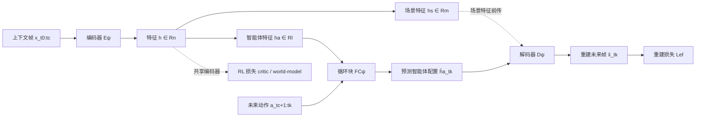

# Ego-Foresight: Self-supervised Learning of Agent-Aware Representations for Improved RL

**会议**: ICLR 2026  
**OpenReview**: [https://openreview.net/forum?id=6itufi98Q3](https://openreview.net/forum?id=6itufi98Q3)  
**代码**: [https://mserranunes.github.io/ego-foresight](https://mserranunes.github.io/ego-foresight)  
**领域**: 强化学习 / 自监督表示学习 / 视觉控制  
**关键词**: 智能体-环境解耦, 运动预测, 自监督辅助任务, 样本效率, 具身适应  

## 一句话总结
受人类"运动预测"启发，Ego-Foresight 用"智能体动起来时其身体配置可被未来动作预测"这一线索，**无需任何监督掩码**就把智能体特征从场景特征中解耦出来，作为辅助任务接到 DrQ-v2 和 TD-MPC2 上，显著提升视觉 RL 的样本效率与性能。

## 研究背景与动机
深度强化学习虽然进展迅猛，但**学一个有效策略所需的交互经验量**仍是模拟与真实环境中的核心瓶颈。一个被验证有效的提速思路是"分别建模智能体与环境"——让算法先把表征容量集中在学习自身控制上，再去处理外部交互。然而这类工作几乎都依赖一个**监督信号**：以智能体掩码的形式提供（来自仿真器几何 ID、微调分割模型、或机器人 CAD 模型）。

这带来两个痛点：其一，真实机器人场景里要额外搭一套分割系统，**复杂且难获取**；其二，监督掩码**绑死了智能体的身体图式（body-schema）**，当智能体拿起工具、形态发生变化时无法自适应。**核心矛盾**在于：要解耦智能体就要知道"哪部分是我"，而获得这个先验恰恰是最贵、最不灵活的环节。

人类的发育过程给出了另一条路：婴儿在没有掩码标注的情况下，通过运动逐渐建立"自我表征"，且这套表征既能随成长慢速适应、又能在拿起工具时快速扩展。本文据此提出**核心 idea——运动即解耦线索（motion as the cue for disentanglement）**：智能体身体配置的视觉变化是**可以从其未来动作预测的**，而外部物体的运动则不能；因此"能被动作预测的视觉部分"就定义了"自我"。**本文目标**是把这种自监督的"自我意识"作为辅助特征学习任务，无监督地提升底层 RL 算法的样本效率与对形态变化的适应性。

## 方法详解

### 整体框架
Ego-Foresight（EF）是一个**编码器-循环预测块-解码器**结构的视觉运动预测模型：从少量上下文帧编码出特征向量，将其切分为"场景特征"与"智能体特征"两部分，循环块只用智能体特征 + 未来动作序列去预测未来的智能体配置，解码器把"原场景特征 + 预测的智能体特征"重建成未来帧。训练完全自监督（用未来真实帧做监督）。把这个模块挂到已有 RL 算法的视觉编码器上，作为辅助损失项联合优化，就得到 DrQv2-EF 与 TD-MPC2-EF。

### 关键设计
**1. 运动驱动的智能体解耦：让"可被动作预测"的部分自己浮现出来。** 编码器从上下文帧产出特征 $h^{t_c}=E_\psi(x_{t_0:t_c})$，被切成场景部分 $h_s^{t_c}\in\mathbb{R}^m$ 与智能体部分 $h_a^{t_c}\in\mathbb{R}^l$（$l+m=n$）。循环块仅拿智能体特征与下一步动作，递推预测后续智能体配置 $\hat h_a^{t_{j+1}}=FC_\psi(\hat h_a^{t_j},a_{t_{j+1}})$，一直滚动到预测区间内随机采样的某个时刻 $t_k$。重建时把**未来的智能体预测**和**当前的场景特征**拼起来送进解码器 $\hat x_{t_k}=D_\psi(h_s^{t_c},\hat h_a^{t_k})$，最小化 $L_{ef}=\mathbb{E}\big[\|\hat x_{t_k}-x_{t_k}\|_2^2\big]$。由于场景内容是从 $t_c$ 直接"快进"过去的，重建帧除了智能体配置外都贴近 $x_{t_c}$——这就逼着 $\hat h_a^{t_k}$ 去承担"未来智能体长什么样"的全部信息。这套设计的精妙处在于：它不需要告诉模型"哪部分是机器人"，只要求"凡是能从未来动作预测出来的视觉变化"都归到智能体特征里，自然地把开门时静止的门（无法从动作预测）留在场景特征中、把被抓起后随手臂运动的锤子（可从动作预测）并入智能体特征。

**2. 维度瓶颈 + 场景快进：用容量约束逼出最可预测的动力学。** 关键在于把智能体特征的维度 $l$ 设成 $n$ 的一小部分，制造一个**信息瓶颈**。循环块容量有限，被迫只去预测"最可预测的动力学"——也就是智能体自身的运动，而不是整个环境的复杂变化。同时"把场景特征 $h_s$ 从上下文帧快进到重建时刻 $t_k$"这一操作，进一步打消了循环块去预测全环境动态的动机，把可预测信息压缩进 $h_a$。消融显示：$l$ 过大反而有害，因为较软的瓶颈会让循环块试图去预测其它环境特征、削弱解耦；而且 $h$ 总维度 $n$ 固定，$l$ 占多了 $h_s$ 的表征容量就被挤掉。

**3. 作为 RL 辅助任务的即插即用集成：当正则项用。** EF 接到任意"带视觉编码器 + 经验回放"的 RL 算法上：编码器与基线共享，循环块与解码器是额外模块，梯度回传到编码器。对 DrQ-v2，把 $L_{ef}$ 与 critic 损失加权相加 $L(\phi,\psi,D)=L_{critic}(\phi,D)+\beta L_{ef}(\psi,D)$（式 6）；对 TD-MPC2，则把 $L_{ef}$ 作为额外项并入世界模型目标 $L(\theta,\psi,D)=L_{TDMPC}(\theta,D)+\beta L_{ef}(\psi,D)$（式 7）。由于这两个算法的策略网络与编码器特征学习是分离的（策略只前向接收低维特征、梯度不回流编码器），EF 损失天然扮演了**与奖励/任务无关的特征正则项**：它强迫编码器学出"对智能体运动可预测"的特征，从而在训练早期把容量先集中到学习自身控制上。

**4. Motor-babbling 探索预热：给自监督喂够多样动作。** 与 RL 联合训练时，智能体为了拿奖励会做目标导向的运动，导致观测到的动作不够多样、学不好视觉运动映射。为此在训练开始的固定步数内加入一个可选的"运动咿呀（motor-babbling）"阶段，动作随机取 $\pm1$ 强制探索性运动。这让智能体特征的预测能力主要在训练初期建立；babbling 结束后 EF 继续按式 6 优化，从而保留后期适应能力（例如智能体开始拿起工具时把工具并入身体图式）。消融表明 babbling 是有意义的增益，但加太久会拖慢学习。

## 实验关键数据
在 MuJoCo 的 Meta-World（16 个任务，半数需用工具）与 DMC（10 个任务）共 26 个视觉控制任务上测试。用 **Efficiency Normalized Score (ENS)** 综合衡量样本效率与性能：找到任一基线达到其最高性能 95%（再取 90%、85% 阈值取平均）所需步数，比较各算法在该步的性能。每任务 5 个随机种子（DMC 上 TD-MPC2 用官方 3 种子）。

### 主实验表格

| 扩展算法 | 对比对象 | 结果 |
|---|---|---|
| DrQv2-EF | DrQ-v2 | 26 个任务中 **21 个有提升**，常大幅减少求解步数、多数情况提升渐近性能；**无任何任务被拉低** |
| DrQv2-EF | SEAR（监督掩码基线） | ENS 与 Rliable 指标在 Meta-World 和 DMC 上**均优于监督方法** |
| DrQv2-EF | CURL（自监督对比基线） | 两个 benchmark 上均优于 CURL |
| DrQv2-EF | Dreamer-v3（SOTA 模型基线） | **competitive**，与之相当 |
| TD-MPC2-EF | TD-MPC2 | 10 个任务中 **8 个提升**，其余 2 个持平；ENS 显著改善 |

特别地，在**需要用工具的任务**上，EF 相对基线的性能差距进一步拉大——因为工具被抓起后其运动由机器人动作决定，被自然并入智能体特征表示。

### 消融实验表格（DrQv2-EF，Meta-World Door Open）

| 超参 | 发现 |
|---|---|
| EF 损失权重 $\beta$ | 起正则作用，不显式优化奖励也能提升性能 |
| 预测时域 $H$ | 影响不一致，短时域也优于 DrQ-v2；$H=10$/$40$ 较强，默认取 $H=10$（算力更低） |
| 智能体特征维度 $l$ | 越大越有害，软瓶颈会让循环块去预测其它环境特征、削弱解耦 |
| Motor-babbling 步数 | 有意义的增益，但加太久会延迟学习 |

### 关键发现
- 特征可视化（按梯度强度缩放重建帧）显示：训练初期 $h_a$ 与 $h_s$ 影响相近，随训练进行 $h_s$ 持续编码场景所有变化部分（柜子、桌沿），$h_a$ 逐渐**专门化为智能体信息**。
- Door Open 任务里门被当作静态场景重建（门的运动与动作无固定对应），而 Hammer 任务里锤子被预测（抓起后运动由动作决定），直观印证了"运动可预测性 = 自我"的解耦准则，也展示了**对形态变化的自适应**——这是监督方法做不到的。

## 亮点与洞察
- **用"可预测性"替代"标注"做解耦**是真正优雅的点：它把"哪部分是我"这个本需人工先验的问题，转化为一个纯自监督的"什么能从我的动作预测出来"的问题，从根上去掉了掩码依赖。
- **工具适应是免费的副产品**：监督方法绑死身体图式，而 EF 因为以"可预测性"定义自我，抓起工具后工具自动并入智能体特征——这恰好解释了为什么工具任务上增益最大。
- **算法无关性**：同时在 model-free（DrQ-v2）与 model-based（TD-MPC2）上验证有效，且强调可推广到任意"带视觉编码器 + 经验回放"的算法，工程上即插即用。
- **作为正则项的视角**很有解释力：EF 损失与奖励/任务无关，却通过约束编码器学"对自身运动可预测"的特征，引导训练早期先学控制、后学交互。

## 局限与展望
- **仅在仿真验证**：Meta-World 与 DMC 都是 MuJoCo 仿真，未在真实机器人上验证（虽然去掉掩码本意正是为真机服务）。
- **预测会发散变模糊**：长时域预测（如训练时域 10、用到第 28 步）会偏离真值、产生模糊重建，对依赖长程预测的任务可能受限。
- **依赖 babbling 调参**：探索预热阶段步数需调，太长会拖慢学习；对某些奖励结构特殊的任务，自监督运动多样性仍可能不足。
- **解耦质量依赖瓶颈维度**：$l$ 需精心选取，过大破坏解耦、过小限制表征——缺乏自适应确定瓶颈大小的机制。
- 部分任务上 SEAR/CURL/Dreamer-v3 仍反超，作者归因于 benchmark 奖励函数多样、不同算法各有所长。

## 相关工作与启发
- **分别建模智能体与环境的监督路线**：SEAR（Gmelin et al., 2023，掩码切分智能体/环境特征）、Hu et al. (2022)（用 CAD 模型得掩码做跨机器人零样本迁移）、Mendonca et al. (2023)（忽略机器人变化以激励探索）——EF 的贡献正是去掉这些工作共同依赖的监督。
- **神经科学/发育机器人启发**：运动预测（Wolpert & Flanagan, 2001）、自我抑制（self-tickle 现象）、contingency awareness（Watson, 1966），以及 Zhang & Nagai (2018)、Lanillos et al. (2020) 的"自我-他者区分"工作，给"用运动定义自我"提供了理论根基。
- **解耦表征**：信息论路线（β-VAE/Higgins et al. 2017、Kim & Mnih 2018）vs. 利用数据结构偏置的序列解耦——EF 属于后者，利用"动作-视觉因果"这一结构偏置。
- **世界模型与视觉 RL**：建立在 DrQ-v2、TD-MPC2、Dreamer-v3 等之上，提示"自监督辅助任务"是提升样本效率的一条可叠加、低成本的正交方向。

## 评分
- **新颖性**: ⭐⭐⭐⭐ — "可被动作预测=自我"这一解耦准则简洁而深刻，把监督掩码需求彻底去掉，且工具适应是自然涌现的，思想原创性强。
- **实验充分度**: ⭐⭐⭐⭐ — 26 个任务、两类 RL 范式、监督/自监督/SOTA 三类基线、Rliable 严谨统计、完整超参消融；扣分点是全仿真、缺真机验证。
- **写作质量**: ⭐⭐⭐⭐ — 从神经科学动机到方法实现脉络清晰，特征可视化与门/锤对比把解耦讲得直观。
- **价值**: ⭐⭐⭐⭐ — 即插即用、算法无关的样本效率提升手段，对视觉机器人 RL 有实际落地潜力，尤其工具使用场景。

<!-- RELATED:START -->

## 相关论文

- [\[ICLR 2026\] Inter-Agent Relative Representations for Multi-Agent Option Discovery](inter-agent_relative_representations_for_multi-agent_option_discovery.md)
- [\[ICLR 2026\] REA-RL: Reflection-Aware Online Reinforcement Learning for Efficient Reasoning](rea-rl_reflection-aware_online_reinforcement_learning_for_efficient_reasoning.md)
- [\[ICLR 2026\] Self-Harmony: Learning to Harmonize Self-Supervision and Self-Play in Test-Time Reinforcement Learning](self-harmony_learning_to_harmonize_self-supervision_and_self-play_in_test-time_r.md)
- [\[ICLR 2026\] Proximal Supervised Fine-Tuning](proximal_supervised_fine-tuning.md)
- [\[ICLR 2026\] On-Policy RL Meets Off-Policy Experts: Harmonizing Supervised Fine-Tuning and Reinforcement Learning via Dynamic Weighting](on-policy_rl_meets_off-policy_experts_harmonizing_supervised_fine-tuning_and_rei.md)

<!-- RELATED:END -->
