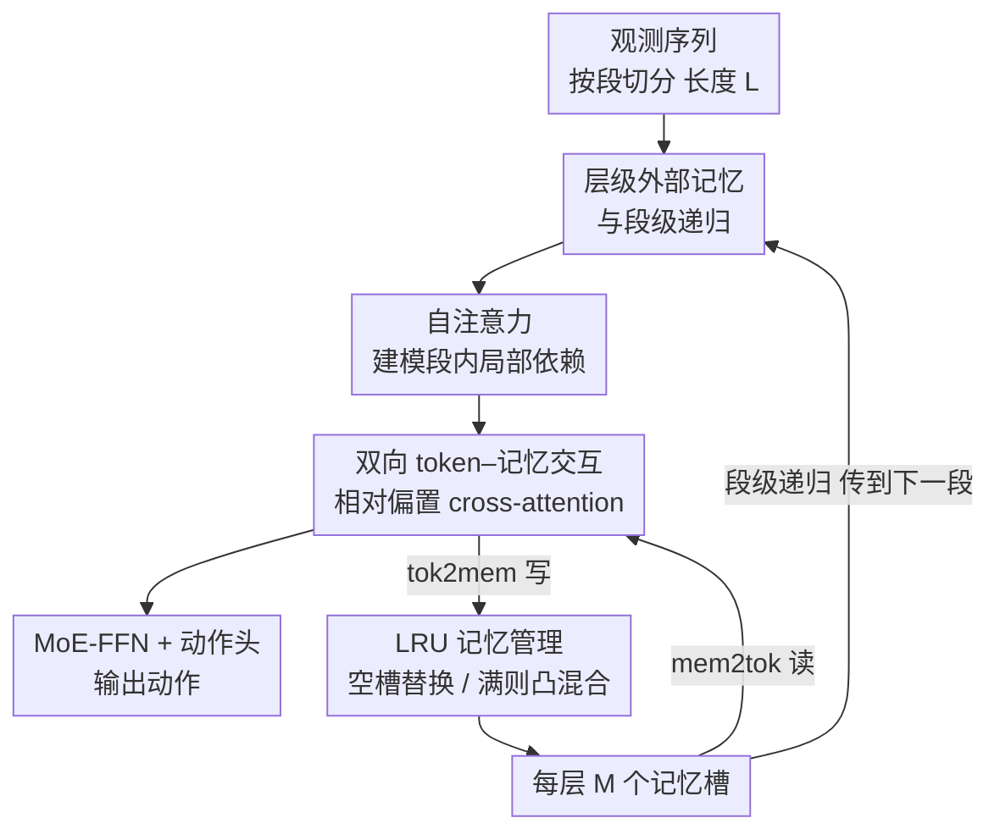

# ELMUR: External Layer Memory with Update/Rewrite for Long-Horizon RL Problems

**会议**: ICLR2026  
**OpenReview**: [https://openreview.net/forum?id=bm3rbtEMFj](https://openreview.net/forum?id=bm3rbtEMFj)  
**代码**: https://elmur-paper.github.io/  
**领域**: 强化学习 / 长程记忆 / 决策 Transformer  
**关键词**: 外部记忆, 段级递归, LRU, 部分可观测, 模仿学习

## 一句话总结
ELMUR 给 Transformer 的**每一层**都挂上一块结构化外部记忆，通过双向 cross-attention 读写、再用 LRU 规则（替换 / 凸混合）维护有界但持久的记忆，把有效记忆horizon 拉到注意力窗口的 10 万倍，在百万步 T-Maze 上拿到 100% 成功率，并在稀疏奖励的视觉机器人操作上把强基线的成功率几乎翻倍。

## 研究背景与动机
**领域现状**：现实中的机器人/控制智能体往往处在**部分可观测**（POMDP）且**长horizon**的环境里——关键线索（比如"盐已经加过了"）可能在它真正影响决策的几千步之前就出现了。当前主流的决策模型，无论是 RNN 还是 Decision Transformer 这类序列模型，基本都只依赖一个**固定的短观测窗口**来做动作预测。

**现有痛点**：固定窗口带来三个具体毛病：(i) 想直接拉长 context，自注意力是平方复杂度，代价爆炸；(ii) 一旦截断历史，窗口外的信息直接被遗忘；(iii) 在稀疏奖励、长horizon 下，任务相关信息根本留不住。朴素的记忆扩展（如缓存隐状态的 Transformer-XL）在规模和稀疏性面前也会失效。

**核心矛盾**：在"**扩展记忆horizon**"和"**计算/存储有界**"之间存在根本 trade-off——要记得久就得存得多、算得贵；要算得快就得截断历史、记不住。RNN 那样"每步更新全部记忆"会让旧信息被持续稀释，难以稳定保留远距离线索。

**本文目标**：让模仿学习（IL）/离线 RL 策略具备**高效的长期记忆**，从而在长horizon、部分可观测任务上做对决策——同时不让复杂度随序列长度爆炸。

**切入角度**：作者不把记忆当成"更长的 context"或"缓存的激活"，而是把它做成一块**显式的、层级局部的、可读可写的外部存储**，并把整条轨迹切成短段、用**段级递归**像 RNN 那样在段之间传递这块记忆。

**核心 idea**：给 Transformer 每一层配一条与 token 轨道并行的**记忆轨道**，token 与记忆通过双向 cross-attention 互相读写，再用 **LRU**（最近最少使用）规则决定刷新哪个记忆槽——空槽直接替换、满了就对最久未用的槽做凸混合，从而既有界又持久。

## 方法详解

### 整体框架
ELMUR 是一个 GPT 风格的 Transformer 解码器，但**每一层都被拆成两条耦合的轨道**：**Token 轨道**负责把观测处理成动作，**Memory 轨道**负责跨段维护一块外部记忆。整条轨迹被切成长度为 $L$ 的若干段 $S_i$，逐段顺序处理；每段结束时，token 的隐状态会更新这一层的记忆，并把记忆（detach 后）带到下一段——这就是"段级递归"。

在单层内的数据流是：观测先被编码成 token，经因果自注意力建模段内局部依赖；然后 token 通过 **mem2tok** 块以 cross-attention **读**记忆（把远处历史拉进来）；再过一个 MoE-FFN。最后一层之后接动作头输出动作。与此并行，记忆通过 **tok2mem** 块以 cross-attention 从 token **写**入更新，过 MoE-FFN 后，交给 **LRU** 块按"先填空槽、满了再凸混合最久未用槽"的规则刷新。读写两端都加了由 token 时间戳与记忆锚点之差算出的**相对偏置**，让交互在跨段的长horizon 下仍然时间一致。

### 关键设计

**1. 层级外部记忆与段级递归：把"记得久"和"算得起"解耦**

固定窗口要么因平方复杂度而拉不长、要么因截断而记不住。ELMUR 的做法是把"长期记忆"从注意力窗口里**剥离出来**，做成每层各自持有的外部记忆 $m \in \mathbb{R}^{M\times d}$（$M$ 个槽位），并把长度 $T$ 的轨迹切成 $S=\lceil T/L\rceil$ 个短段，逐段处理：$h^{(i)} = \text{TokenTrack}(S_i, \text{sg}(m^{i-1}))$，其中 $\text{sg}(\cdot)$ 表示对上一段记忆做 stop-gradient 后带入当前段。这等于把 Transformer 当成一个**在段之间递归的 RNN**：段内用注意力，段间用记忆传递。与 Transformer-XL 缓存历史激活不同，这里传递的是**显式的、可被读写策略管理的记忆**，所以复杂度只跟记忆大小 $M$ 有关、与序列长度无关——这正是它能把有效horizon 拉到注意力窗口 10 万倍的根本原因。

**2. 双向 token–记忆交互（mem2tok / tok2mem）：记忆既要会读、也要会写**

只读不写的记忆无法支撑长horizon 推理——过去的事件要么被遗忘、要么只是低效缓存。ELMUR 让 token 和记忆**双向**交互。读路径 mem2tok 把记忆当 key/value、token 当 query 做 cross-attention：$h_{\text{mem2tok}} = \text{AddNorm}(h_{sa} + \text{CrossAttention}(Q{=}h_{sa}, K,V{=}m))$，用非因果 mask，让当前预测不仅依赖近邻 token、也能调用存在记忆里的远距离事件。写路径 tok2mem 则反过来，把记忆当 query、token 当 key/value：$m_{\text{tok2mem}} = \text{AddNorm}(m + \text{CrossAttention}(Q{=}m, K,V{=}h))$，让 token 把这一段里的显著信息写回记忆、覆盖掉没用的内容。两条 FFN 都用 DeepSeek-MoE 块而非普通 MLP，靠稀疏专家路由在不成比例增加计算的前提下扩容（不过消融显示换回 MLP 精度不掉、还更快，见后文）。

**3. 相对偏置（relative bias）：跨段时让"谁离谁多远"始终一致**

当记忆跨越多个段时，绝对位置索引会变得**有歧义**——同一个 token 位置在不同段里对应轨迹上完全不同的时刻。ELMUR 给 cross-attention 的 logits 加一个可学习的相对偏置：$\text{Attn}(Q,K) = \frac{QK^\top}{\sqrt{d_h}} + B_{rel}$。$B_{rel}$ 来自 token 位置 $t$ 与记忆锚点 $p$（该槽最近一次更新时刻）的成对偏移 $\Delta = \pm(t-p)$，裁剪到 $[-D_{max}{+}1, D_{max}{-}1]$ 后查一张可学习嵌入表 $E$。读路径用 $E[t-p]$、写路径用反向的 $E[p-t]$——共享同一张表却能学出不同模式：读时偏向时间上更近的记忆、写时偏向与写入 token 时间对齐的槽。靠相对而非绝对时间，长horizon 下的记忆交互才能保持一致连贯。

**4. LRU 记忆管理（替换 / 凸混合）：有界容量下决定刷新谁、保留谁**

外部记忆必须有界——存下每个 token 不可行，但朴素截断又会灾难性遗忘。ELMUR 用 **LRU 块**管理每层的 $M$ 个槽，每个槽带一个向量和一个锚点（最近更新时刻）。冷启动时槽位用 $\mathcal{N}(0,\sigma^2 I)$ 初始化并标记为空；只要还有空槽，新内容就**直接替换**写入（$\alpha=1$）；一旦填满，就选**最久未用**的槽做**凸混合**：$m^{i+1}_j = \lambda\, m^{i+1}_{new} + (1-\lambda)\, m^i_j$，$\lambda\in[0,1]$ 控制覆盖与保留的平衡——$\lambda$ 大偏向快速可塑、$\lambda$ 小偏向长期稳定。这个规则先把容量用满再渐进混合，保证记忆**有界却持久**。作者还给了理论支撑：被反复覆盖 $k$ 次后旧内容的系数是 $(1-\lambda)^k$（**指数遗忘**，半衰期约 $\ln 2/\lambda$），而有效保留horizon $H(\epsilon)=M\cdot L\cdot\frac{\ln\epsilon}{\ln(1-\lambda)}$ 随槽数 $M$ 和段长 $L$ **线性增长**；同时在写入有界假设下证明记忆范数恒被半径 $C$ 的闭球包住，保证任意长轨迹下激活稳定。

### 损失函数 / 训练策略
全程**监督式**训练（模仿学习 / 行为克隆）：连续动作空间用均方误差、离散动作空间用交叉熵，损失在每个处理过的段上施加，梯度回传整个网络。段间记忆做 detach，避免跨段反传导致的计算与显存爆炸。所有实验在单张 A100（80GB）上从零训练。

## 实验关键数据

### 主实验
在三个专门考验"部分可观测下记忆能力"的基准上评测：合成 T-Maze、机器人操作套件 MIKASA-Robo（RGB 观测 + 连续动作 + 稀疏奖励）、以及 48 个 POPGym 谜题/控制任务。

| 基准 | 指标 | ELMUR | 之前最强基线 | 说明 |
|------|------|-------|------------|------|
| T-Maze（走廊 100 万步） | 成功率 | **100%** | 随长度衰减 | $L{=}10,S{=}3$，horizon 达注意力窗口 ~10 万倍 |
| MIKASA-Robo RememberColor3 | 成功率 | **0.89±0.07** | 0.65±0.04 (RATE) | 视觉色彩回忆 |
| MIKASA-Robo TakeItBack | 成功率 | **0.78±0.03** | 0.42±0.24 (RATE) | 延迟反转操作 |
| POPGym（48 任务聚合） | 回报 | **10.4** | 9.5 (RATE) | 谜题子集 1.2 vs RATE 0.45 |

MIKASA-Robo 上 ELMUR 在 23 个任务里 21 个夺冠，整体成功率较此前最强基线提升约 **70%**、几乎翻倍；POPGym 上 48 个任务里 24 个排第一，且在记忆密集的谜题任务上优势最大（DT、BC-LSTM 在谜题子集甚至为负分）。

### 消融实验
在 RememberColor3-v0 上拆解记忆设计（Table 3）：

| 配置 | 分数 | 说明 |
|------|------|------|
| 完整 ELMUR | 1.00±0.00 | 每层记忆 + 相对偏置 + LRU |
| Shared memory | 0.45±0.03 | 记忆跨层共享 → 大幅掉点 |
| No rel. bias | 0.95±0.05 | 去相对偏置 → 小幅下降 |
| No LRU | 0.43±0.22 | 去 LRU → 留下陈旧条目，大幅掉点 |
| No rel. bias + No LRU | 0.22±0.11 | 两者皆去 → 检索几乎失效 |
| MoE → MLP | 1.00±0.00 | 换回普通 MLP，精度不变还更快 |

### 关键发现
- **容量与 LRU 是主导因素**：成功率随记忆槽数 $M$ 变化——当 $M\ge N$（所需段数）时近乎满分，$M<N$（尤其 $M\approx N$）时急剧下降；去掉 LRU 会留下陈旧记忆而崩盘。
- **凸混合系数 $\lambda$ 中间值不稳**：$\lambda\approx0.4$–$0.6$ 时不稳定，更大的初始化 $\sigma$ 能缓解坍缩。
- **层级局部 > 跨层共享**：shared memory 掉到 0.45，印证"每层各有记忆"的价值。
- **相对偏置只是小幅增益**，但与 LRU 叠加缺一不可（同时去掉后跌到 0.22）。
- **效率反而更好**：T-Maze 上 ELMUR 2.1M 参数（RATE 1.7M、DT 1.8M），但每步 6.8±0.5 ms 比 RATE（7.2）和 DT（10.7）都快——因为复杂度只跟记忆大小走、不跟序列长度走。
- **不破坏全可观测 MDP**：CartPole-v1 上 ELMUR 与各基线都拿满 500 分，说明加记忆不会拖累标准 MDP 设定。

## 亮点与洞察
- **"层级局部外部记忆 + 段级递归"的组合拳**最巧妙：把记忆从注意力窗口里彻底剥离，复杂度跟 $M$ 而非序列长度走，于是"记得久"和"算得起"第一次被干净地解耦——这也是 10 万倍horizon 的来源。
- **LRU 用操作系统的缓存替换思想做神经记忆管理**：空槽替换 + 满槽凸混合，既保证容量有界、又让信息渐进衰减而非被一刀截断，且配了指数遗忘 / 线性horizon / 范数有界三条理论 bound，难得地"工程直觉 + 可证明性质"双全。
- **双向 cross-attention + 反向相对偏置**这个设计可迁移：任何需要"模型既读又写一块持久状态"的任务（如长对话记忆、检索增强、世界模型的隐状态维护）都能借用"读 mem2tok / 写 tok2mem + 共享偏置表但学不同模式"的范式。
- **MoE 在这里其实可有可无**：消融显示换成 MLP 精度不掉还更快，提醒读者真正的功臣是记忆机制本身，而非堆参数。

## 局限与展望
- **纯模仿学习 / 离线设定**：只对比序列模型与离线 RL，刻意不与在线 RL 比较（训练预算不可比），也没做真机实验（为避开延迟、复位、安全等混杂因素）——所以"对机器人有用"更多是仿真证据。
- **依赖专家示范**：作为 IL/BC 方法，性能受演示质量约束，稀疏奖励下若没有好示范仍是难题。
- **超参敏感**：$\lambda$ 中间值不稳、$M$ 必须 $\ge$ 所需段数 $N$ 才近满分，意味着部署前要对任务horizon 做容量预估；$\sigma$、段长 $(L,S)$ 也需调。
- **理论是保守下界**：$H(\epsilon)$ 的线性horizon 是下界，实际往往更长，但这也说明理论与经验之间还有解释 gap。
- 可改进：把 LRU 换成可学习的、内容感知的替换策略（而非纯时间锚点），或让 $\lambda$ 随槽/任务自适应，可能进一步提升稳定性。

## 相关工作与启发
- **vs Transformer-XL / 段级递归（Dai et al. 2019）**：两者都切段递归，但 XL 缓存的是隐状态激活、被动且无管理；ELMUR 传递的是**显式可读写、由 LRU 主动管理**的外部记忆，能选择性保留/覆盖，故horizon 远超缓存方案。
- **vs Decision Transformer / RATE**：DT、RATE 是记忆增强的策略 Transformer，但仍受固定窗口或较弱记忆机制限制；ELMUR 给**每一层**配独立外部记忆 + 双向读写，在 MIKASA-Robo 上把 RATE 的成功率几乎翻倍。
- **vs DMamba（状态空间模型）**：SSM 用高效递归替代注意力，但记忆是隐式连续状态、容量不显式可控；ELMUR 用离散有界槽位 + LRU，容量与遗忘可解析刻画。
- **vs RNN 类记忆**：RNN 每步更新**全部**记忆，旧信息被持续稀释；ELMUR 每段只刷新一个槽，未选中的槽**精确保留**直到被替换，被选中后才指数衰减——这是它保留远距离线索更稳的关键。

## 评分
- 新颖性: ⭐⭐⭐⭐⭐ 把"层级外部记忆 + 段级递归 + LRU 替换/凸混合"组合成一套既有界又可证明的长horizon 记忆架构，角度干净。
- 实验充分度: ⭐⭐⭐⭐ 三类基准 + 充分消融 + 理论 bound，但缺在线 RL 对比与真机验证。
- 写作质量: ⭐⭐⭐⭐⭐ 动机用"机器人煮意面反复加盐"开场，结构清晰、理论与实验衔接好。
- 价值: ⭐⭐⭐⭐⭐ 为部分可观测长horizon 决策提供了简单、可扩展、复杂度与序列长度无关的记忆方案，迁移面广。

<!-- RELATED:START -->

## 相关论文

- [\[ICLR 2026\] Strict Subgoal Execution: Reliable Long-Horizon Planning in Hierarchical Reinforcement Learning](strict_subgoal_execution_reliable_long-horizon_planning_in_hierarchical_reinforc.md)
- [\[ICLR 2026\] Recurrent Action Transformer with Memory](recurrent_action_transformer_with_memory.md)
- [\[ICLR 2026\] RLVMR: Reinforcement Learning with Verifiable Meta-Reasoning Rewards for Robust Long-Horizon Agents](rlvmr_reinforcement_learning_with_verifiable_meta-reasoning_rewards_for_robust_l.md)
- [\[ICLR 2026\] RD-HRL: Generating Reliable Sub-Goals for Long-Horizon Sparse-Reward Tasks](rd-hrl_generating_reliable_sub-goals_for_long-horizon_sparse-reward_tasks.md)
- [\[ICML 2026\] Long-Horizon Model-Based Offline Reinforcement Learning Without Explicit Conservatism](../../ICML2026/reinforcement_learning/long-horizon_model-based_offline_reinforcement_learning_without_explicit_conserv.md)

<!-- RELATED:END -->
