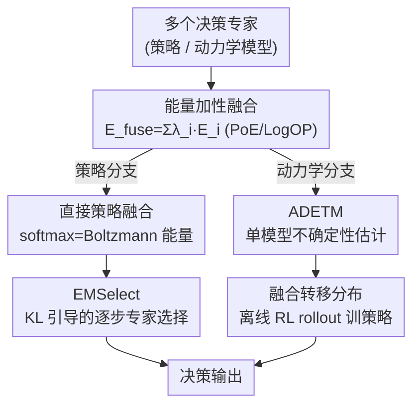

# EMFuse: Energy-based Model Fusion for Decision Making

**会议**: ICLR2026  
**OpenReview**: [https://openreview.net/forum?id=6wDp8XRmNI](https://openreview.net/forum?id=6wDp8XRmNI)  
**代码**: https://github.com/LAMDA-RL/EMFuse  
**领域**: 强化学习 / 决策智能 / 模型融合  
**关键词**: 能量模型, 模型融合, 离线强化学习, 专家乘积, 不确定性估计

## 一句话总结
EMFuse 把"直接策略融合"和"动力学模型融合"两件看似不同的事，统一到能量基模型（EBM）这一套语言下——能量相加等价于分布相乘（专家乘积 PoE），由此既能在推理时免训练地融合多个 LLM 专家，又能用一个新架构 ADETM 避开融合动力学集成时的指数级爆炸，在离散决策基准上涨 0.34%–6.63%、在 D4RL 连续控制上平均多拿 2.3–7.4 个归一化分。

## 研究背景与动机
**领域现状**：模型融合（model fusion）是一条很省资源的路线——不从头训练，而是把现成的预训练专家拼成一个更强的系统。参数空间平均（Model Soup）、对齐统计的加权合并（RegMean）、推理时 logit 融合（PackLLM）等方法已经在通用任务上跑得不错。

**现有痛点**：但这些方法几乎都瞄准通用文本任务，对"决策（decision-making）"这个专门领域的融合研究很少。而决策智能体的行为其实由两种东西决定：要么是一个直接学到的策略 $\pi(a\mid s)$，要么是先学一个动力学模型 $p(s'\mid s,a)$ 再从里面诱导出策略。这就出现了两个看起来八竿子打不着的子问题——**直接融合策略**（把多个策略的输出分布合在一起）和**融合动力学模型**（把多个对环境的预测性理解合成一个更可靠的模拟器）。它们各做各的，缺一套统一的语言。

**核心矛盾**：更要命的是动力学融合的计算代价。基于模型的离线 RL（MBRL）为了稳健的不确定性估计，惯例是给同一份数据训练一**整套集成（ensemble）**模型。如果要跨多套集成做融合，复杂度会随集成规模指数级爆炸——融合 $n$ 个域、每域 $K$ 个集成成员，组合数直接炸开。

**本文目标**：(1) 找到一套能同时覆盖策略融合和动力学融合的统一原理；(2) 让动力学融合的不确定性估计从"每域一套集成"降到"每域一个模型"，绕开指数爆炸。

**切入角度**：作者观察到能量基模型有一个漂亮性质——**独立专家组合时能量线性相加，对应未归一化密度相乘**。无论是策略输出还是动力学似然，都能写成 $p(y\mid x)=\exp(-E(x,y))/Z(x)$ 的形式。那么"融合"就自然变成一次能量求和 $E_{\text{fuse}}=\sum_i \lambda_i E_i$。

**核心 idea**：把能量当作融合的"通用货币"——策略融合和动力学融合只是同一条加性能量法则在不同 $(x,y)$ 和不同采样器下的两个实例。

## 方法详解

### 整体框架
EMFuse 的骨架就一条法则：给定一组专家能量 $\{E_i(x,y)\}_{i=1}^n$，每个定义归一化条件分布 $p_i(y\mid x)=\exp(-E_i)/Z_i$，用非负且和为 1 的权重 $\lambda_i$ 做融合，得到

$$E_{\text{fuse}}(x,y)=\sum_{i=1}^{n}\lambda_i E_i(x,y),\qquad p_{\text{fuse}}(y\mid x)\propto\prod_{i=1}^{n}p_i(y\mid x)^{\lambda_i}.$$

这正是**对数意见池**（LogOP，几何混合），也是加权反向 KL 投影 $\arg\min_q\sum_i\lambda_i \mathrm{KL}(q\Vert p_i)$ 的唯一最优解，在概率空间里等价于**专家乘积（PoE）**。这条法则与具体应用无关，只要把 $E_i$ 实例化成不同对象，就能落到两个分支：把 $E_i$ 取成 LLM 的 softmax 负对数概率 → 直接策略融合；把 $E_i$ 取成能量基转移模型（ETM）的转移能量 → 动力学融合。在策略分支上还衍生出一个选择算法 EMSelect；在动力学分支上则需要一个新架构 ADETM 来让"每域一个模型"也能给出集成级的不确定性。

### 关键设计

**1. 能量加性融合：把策略融合和动力学融合统一成一次能量求和**

这是全文的地基，针对的是"策略融合和动力学融合各做各的、没有共同语言"这个痛点。EBM 用未归一化能量表示分布 $p_\theta(x)\propto\exp(-E_\theta(x))$，当组合多个独立专家时，能量线性相加 $\Leftrightarrow$ 未归一化密度相乘。作者据此把融合定义成 $E_{\text{fuse}}=\sum_i\lambda_i E_i$，对应分布上的 $p_{\text{fuse}}\propto\prod_i p_i^{\lambda_i}$。它好在两点：一是**统一性**——只要专家能写成 $\exp(-E)/Z$ 的形式（策略、动力学似然、行为先验 $E_\beta(s,a)=-\log\pi_\beta(a\mid s)$ 都能），就都是这条法则的实例，差别只在 $x,y$ 的含义和采样器；二是**稳健性**——从 LogOP 视角看，融合相当于专家间的"保守共识 / AND 门"：任何一个专家给某 token 很低的概率，该 token 在融合分布里会被指数级压制，于是单个失准专家无法搅乱整体决策。

**2. 直接策略融合：LLM 的 softmax 输出天然就是 Boltzmann 能量**

这一设计把上面的抽象法则落到最实用的 LLM 上，针对"怎么把多个语言策略专家免训练地合起来"。关键观察是：自回归模型在每步把上下文 $x_{\le t}$ 映到 logits $z_t$，再经温度 $\tau$ 的 softmax 得到下一 token 分布 $p_\theta(y_t\mid x_{\le t})=\mathrm{softmax}(z_t/\tau)$，这**恰好等于**一个能量为 $E_\theta(x_{\le t},y)=-z_t(y)/\tau$ 的 Boltzmann 分布——对数概率就是（负的、差一个归一化常数的）能量，正是加性融合需要的形式。于是融合在 log 空间一行就能算：$\ell_{\text{fuse}}=\sum_i\lambda_i\,\mathrm{logsoftmax}(z_i/\tau_i)$，再归一化即可。前提是所有专家共享同一词表 $V$（同 tokenizer 或经词表映射对齐）。一个意外的好处：若词表映射引入尺度失真，会表现为更平（高熵）的能量面，而在 PoE 里这种平钝分布会被自动降权、让位给更尖锐自信的原生专家——等于免费过滤了映射噪声。实践中默认用均匀权重（基于熵的自适应权重经消融统计上不显著）。

**3. EMSelect：用融合分布当参照，逐步挑出最该发言的专家**

EMFuse 给的是"所有专家的保守共识"，但当专家是领域专精时，这个共识往往在 KL 上**贴近**当前上下文最匹配的那个专家。EMSelect 顺势把融合分布当成一面镜子，在每个解码步选出离它最近的专家来真正出手。两专家情形下，先做成对融合 $p_{i\oplus j}\propto p_i^\alpha p_j^{1-\alpha}$（默认 $\alpha=\tfrac12$），然后选 KL 更小的那个：$\text{选 }i \iff \mathrm{KL}(p_{i\oplus j}\Vert p_i)\le\mathrm{KL}(p_{i\oplus j}\Vert p_j)$。由于 $\mathrm{KL}(p\Vert q)=\mathbb{E}_p[\log p-\log q]$ 里的熵项相消，判据化简为"在成对融合参照下期望对数似然更高者胜"，即 $\mathbb{E}_{p_{i\oplus j}}[\log p_i]\ge\mathbb{E}_{p_{i\oplus j}}[\log p_j]$。对 $n$ 个专家就跑一个轻量"锦标赛"：固定顺序、首个为擂主，逐个用两专家判据比较、胜者留任。作者还给了理论保证：EMSelect 诱导的序列分布与 EMFuse 共识的 KL 被逐步最坏散度 $\Delta_t^{\max}$ 之和上界约束（实测每步 KL < 0.09，界很紧），意味着 EMSelect 被"拴"在保守的 EMFuse 几何上——能局部利用更尖锐的专家，但序列级偏离始终受共识约束。

**4. ADETM：单模型即可给出集成级不确定性，绕开动力学融合的指数爆炸**

动力学分支的拦路虎是集成：传统 MBRL 靠一整套集成估不确定性，跨多套集成融合会指数爆炸。ADETM（Any-step Dynamics Energy-based Transition Model）的思路是只用**每域一个模型**就拿到类集成的稳健不确定性。它保留 ETM 的能量主干和训练配方（对比 / InfoNCE 目标、Langevin 采样），外面包两个编码器：一个 MLP 状态编码器，一个对定长历史动作序列做多头注意力的动作编码器（带 valid-length 掩码），产出联合嵌入 $[h_s\Vert h_a]$ 去条件化转移能量 $E_\theta(s,a_{t-k:t},s')$。不确定性不靠多个模型，而靠**堆叠历史切片**：从最近 $k$ 个状态-动作对的 FIFO 队列里构造多条合法历史切片，都预测同一目标步 $\hat s_{t+1}^{(m)}$，再用它们之间的离散度当不确定性分数

$$u_\theta(s_t,a_t)=\frac{1}{k}\sum_{m=1}^{k}\big\Vert \hat s_{t+1}^{(m)}-\bar s_{t+1}\big\Vert_2^2,\qquad \bar s_{t+1}=\frac{1}{k}\sum_{m=1}^{k}\hat s_{t+1}^{(m)}.$$

这种"历史敏感度离散"行为上类似集成分歧，却只需一个 ADETM。于是 EMFuse 的 rollout 代价只随**专家数**增长、与集成规模无关，参数/FLOPs/延迟都轻很多。融合后的转移分布 $p_{\text{fuse}}(s'\mid s,a)$ 与 ADETM 的不确定性一起喂进离线 RL 循环（用 SAC 在生成的 rollout 上训策略）。

### 损失函数 / 训练策略
ADETM 沿用 ETM 的训练方式——对比 / InfoNCE 目标学转移能量，训练与诊断都用 Langevin 采样。下游用 SAC 在 ADETM 生成的模型 rollout 上做离线策略学习。策略融合分支（LLM）则完全免训练：专家各自 SFT 好后，在推理时按能量相加直接融合，默认均匀权重 $\lambda_i=1/n$。

## 实验关键数据

### 主实验
LLM 用两个家族：Family L（Llama，测分布保真度）和 Family Q（Qwen，测 OpenCompass 任务准确率）；动力学用 D4RL MuJoCo medium。

| 基准 | 指标 | EMFuse | EMSelect | 最强基线 |
|------|------|--------|----------|----------|
| OpenCompass 学科混合 | 平均准确率 | 63.49 | **64.80** | PackLLM 63.15 |
| OpenCompass 金融套件 | 平均准确率 | 89.21 | **90.39** | PackLLM 88.27 |
| D4RL MuJoCo（3 环境均值）| IQM 归一化回报 | **50.1** | — | Mixed Oracle 47.8 |

D4RL 逐环境（5 seeds，IQM）：Hopper 49.03 / Walker2d 59.53 / HalfCheetah 41.83，均值 50.1，超过 RegMean 43.8、Soup 42.7，甚至略超用混合数据训练的 Oracle 基线 47.8。

### 消融实验

| 配置 | 关键指标 | 说明 |
|------|---------|------|
| EMFuse（仅融合）| 学科混合 63.49 / 金融 89.21 | 保守共识 |
| + EMSelect | +1.31 / +1.18 | 逐步选择再涨点 |
| 熵自适应权重 | 统计不显著 | 故默认均匀权重 |
| Laplace 平滑 | 增益可忽略 | 防乘积坍缩但收益微小 |

### 关键发现
- **分布保真度（RQ2）**：每个 1B 域专家到 EMFuse 的 token 级 KL 仅 ≈0.04–0.08，远小于到其 8B 同族模型的 ≈0.20–0.59——说明融合比单纯堆容量更忠实地保留了域内 token 概率，也印证了 EMSelect 理论里"KL 很小"的前提。
- **EMSelect 非均匀获益**：涨点集中在金融（FPB +2.07、LendingClub +1.42）和医药（MedQAM +2.68），在部分数学集上反而小幅回退（MGSMZ −2.40）；作者解释为局部选择只在"专家专精强 + 校准相近"时最有利。
- **ADETM 省算**：把动力学融合的代价从"集成规模"降到"专家数"，参数/FLOPs/rollout 延迟都更轻。

## 亮点与洞察
- **"能量当通用货币"这个抽象很优雅**：把策略融合（离散 token）和动力学融合（连续状态）这两件看起来不相干的事，归约成同一条加性能量法则的两个实例，差别只在 $x,y$ 和采样器——这种统一视角本身就有迁移价值。
- **softmax = Boltzmann 能量的等价**很实用：任何共享词表的 LLM 专家都能免训练、在 log 空间一行代码融合，且 PoE 的"AND 门"特性自带对失准专家和词表映射噪声的鲁棒性。
- **ADETM 用"堆叠历史切片的预测离散度"替代集成分歧**：这是把"集成不确定性"重写成"单模型时序一致性"的巧思，可迁移到任何需要不确定性又怕集成开销的世界模型场景。
- **EMSelect 的理论"拴绳"**：用 KL 链式法则把逐步选择的序列偏离上界约束在共识几何里，给"既要尖锐又要稳"提供了可证明的折中。

## 局限与展望
- **评测异质**：Family Q 用准确率（OpenCompass）、Family L 用偏好（AlpacaEval），作者刻意不跨家族比绝对数值，每套协议各自解读——所以"涨多少"在不同任务间不可直接横比。
- **KL 分析只在 Family L**：为保证共享 tokenizer，分布保真度实验局限在 Llama 家族，扩到其他家族受算力限制留作未来工作。
- **离线 RL 方差大**：部分环境（如 Walker2d）置信区间很宽，结论主要靠聚合 IQM，单任务不宜过度解读。
- **EMSelect 不普适**：在数学集上会掉点，依赖"专家专精强 + 校准相近"的前提。
- **基线范围有限**：只比了免训练 merger（Soup/RegMean）和 logit 融合（PackLLM），需调参或吃数据的融合方法不在比较范围。

## 相关工作与启发
- **vs Model Soup / RegMean**：它们在参数空间做平均/对齐合并，EMFuse 在能量（输出分布）空间做 PoE 融合，区别在于前者改权重、后者改输出分布；EMFuse 在决策任务上更稳健且能保留域内分布，但需要专家共享支撑集（词表/状态动作空间）。
- **vs PackLLM**：同为推理时 logit 空间融合，PackLLM 的成对打包启发了 EMSelect 的锦标赛设计；EMFuse 把它纳入统一的能量/PoE 框架并给出 KL 引导的选择判据与理论上界。
- **vs 经典 PoE（Hinton 2002）**：EMFuse 本质是把经典专家乘积接到决策场景，并首次把策略融合与动力学融合统一在同一加性能量法则下。
- **vs ADMPO（Lin et al. 2025）**：ADETM 借鉴了 ADMPO"单模型用变长输入估不确定性"的思路，但把它建在能量基转移模型（ETM）上、用堆叠历史切片的预测离散度做不确定性，服务于动力学融合。

## 评分
- 新颖性: ⭐⭐⭐⭐⭐ 用 EBM 把策略融合与动力学融合统一成一条加性能量法则，视角干净且有衍生（EMSelect/ADETM）
- 实验充分度: ⭐⭐⭐⭐ LLM + 离线 RL 双线验证，但部分环境方差大、跨家族不可比、关键细节在附录
- 写作质量: ⭐⭐⭐⭐ 框架与推导清晰，但大量结果与编码器细节下放到附录，正文略显单薄
- 价值: ⭐⭐⭐⭐ 免训练融合 + 绕开集成爆炸，对决策智能体的模型复用有实用价值

<!-- RELATED:START -->

## 相关论文

- [\[ICLR 2026\] Ada-Diffuser: Latent-Aware Adaptive Diffusion for Decision-Making](ada-diffuser_latent-aware_adaptive_diffusion_for_decision-making.md)
- [\[ICLR 2026\] Information-based Value Iteration Networks for Decision Making Under Uncertainty](information-based_value_iteration_networks_for_decision_making_under_uncertainty.md)
- [\[ICLR 2026\] Offline Reinforcement Learning with Adaptive Feature Fusion](offline_reinforcement_learning_with_adaptive_feature_fusion.md)
- [\[NeurIPS 2025\] Optimizing the Unknown: Black Box Bayesian Optimization with Energy-Based Model and Reinforcement Learning](../../NeurIPS2025/reinforcement_learning/optimizing_the_unknown_black_box_bayesian_optimization_with_energy-based_model_a.md)
- [\[NeurIPS 2025\] Structured Reinforcement Learning for Combinatorial Decision-Making](../../NeurIPS2025/reinforcement_learning/structured_reinforcement_learning_for_combinatorial_decision-making.md)

<!-- RELATED:END -->
