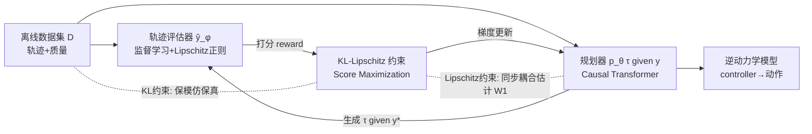

# Enhancing Generative Auto-bidding with Offline Reward Evaluation and Policy Search

**会议**: ICLR 2026  
**OpenReview**: [https://openreview.net/forum?id=kMuQBgPIdg](https://openreview.net/forum?id=kMuQBgPIdg)  
**代码**: 待确认  
**领域**: 离线强化学习 / 生成式决策 / 计算广告（自动出价）  
**关键词**: auto-bidding, generative planning, offline RL, trajectory evaluator, KL-Lipschitz constraint, score maximization  

## 一句话总结
本文提出 AIGB-Pearl，给"生成式自动出价"（AIGB）配上一个轨迹评估器作为离线 reward 信号，并用一套有理论保证的 **KL-Lipschitz 约束 score-maximization** 让生成规划器安全地探索离线数据集之外的高质量轨迹，从而突破纯模仿学习的性能天花板。

## 研究背景与动机
**领域现状**：自动出价（auto-bidding）把广告主在预算约束下最大化曝光价值的问题建模成一个离线序贯决策任务（MDP，状态含时间步/累计花费比/广告主特征，动作是出价缩放因子）。由于线上系统的安全顾虑，只能从静态历史数据集学习。近年最强的范式是 **AIGB（AI-Generated Bidding）**——把出价当作轨迹生成任务，用条件生成模型（如扩散模型 DiffBid、Causal Transformer DT）拟合"给定轨迹质量 $y$ 的条件轨迹分布" $p_\theta(\tau|y)$，推理时给一个略高于数据集最优质量的目标条件 $y^*=(1+\epsilon)y_m$ 来生成高质量轨迹，再用逆动力学模型还原动作。AIGB 避开了 TD bootstrapping，训练更稳，效果已超过离线 RL。

**现有痛点**：AIGB 本质是对离线数据集的**条件行为克隆（模仿）**，没有任何性能反馈来指导它改进生成质量。一旦目标条件落到外推区间（$y^*>y_m$，即"比见过的最好轨迹还要好"），生成就缺乏可靠依据，可能退化甚至产出风险轨迹（超额花费、节奏倒挂、预算用不完），且没有任何理论保证。

**核心矛盾**：想给 AIGB 加 reward 引导去探索数据集之外的更优轨迹——但 (i) AIGB 里**根本没有 reward 信号**，生成质量在训练时不可知；(ii) **没有为 AIGB 量身定做的离线 RL 算法**，直接把评估器当 reward 去最大化会触发臭名昭著的 OOD 问题（评估器在数据支撑外不可信），在风险敏感的广告场景可能造成真金白银的损失。

**本文目标 / 核心 idea**：**用一个监督训练的轨迹评估器把 reward 注入 AIGB，并把"探索"限制在评估器可信的认证邻域内**。具体而言，先理论分析评估器偏差的上界，据此设计一个带次优性界（sub-optimality bound）的 KL-Lipschitz 约束 score-maximization 目标，再配一套用同步耦合（synchronous coupling）技术保证生成模型 Lipschitz 正则性的实用算法。

## 方法详解

### 整体框架
AIGB-Pearl 由两个组件协同：一个**轨迹评估器** $\hat{y}_\phi(\tau)$ 通过监督学习在离线数据集上拟合轨迹质量 $y(\tau)=\sum_t \bar r_t$，给生成轨迹打分作为 reward；一个**规划器** $p_\theta(\tau|y)$（Causal Transformer）在固定评估器后，通过与评估器的持续交互去最大化生成轨迹的得分 $L(\theta)=\mathbb{E}_{\tau\sim p_\theta(\tau|y^*)}[\hat y_\phi(\tau)]$。关键在于这个 score-maximization 不是无约束的，而是被 KL 约束（保持对离线数据的模仿保真度）和 Lipschitz 约束（限制生成对条件的敏感度）双重锁在评估器可信的区域内。

### 关键设计

**1. 轨迹评估器：把缺失的 reward 信号补出来。** AIGB 没有 reward，AIGB-Pearl 的第一步就是训一个评估器来估计轨迹质量。它通过监督学习最小化 $\min_\phi \mathbb{E}_{\tau\sim D}[(\hat y_\phi(\tau)-y(\tau))^2]$ 来拟合真实质量。但要让评估器在指导探索时可信，本文（Theorem 1）证明真实轨迹质量 $y(\tau)$ 关于 Frobenius 范数是 $\sqrt{T}R_m$-Lipschitz 连续的（$R_m$ 是单次曝光 ROI 上界，$T$ 是步数），于是给评估器损失加一项 Lipschitz 惩罚让它继承这个性质：$l_e(\phi)=\mathbb{E}_{\tau\sim D}[(\hat y_\phi(\tau)-y(\tau))^2]+\beta_1\mathbb{E}_{\tau_1,\tau_2}[\,|\hat y_\phi(\tau_1)-\hat y_\phi(\tau_2)|-\sqrt{T}R_m\|\tau_1-\tau_2\|_F\,]_+$。这样评估器在 OOD 区域不会出现剧烈的数值跳变，从而支撑更可靠的外推（另配 LLM embedding 增强与 pairwise learning 进一步提精度）。

**2. KL-Lipschitz 约束 score-maximization：把探索锁进认证邻域。** 直接最大化评估器得分 $L(\theta)$ 会被评估器的泛化误差带偏。本文的核心理论（Theorem 2）给出规划器得分 $L(\theta)$ 与真实性能 $J(\theta)=\mathbb{E}_{\tau\sim p_\theta(\tau|y^*)}[y(\tau)]$ 之间的偏差上界，把它拆成三块：评估器训练误差 $\delta_D$、规划器对条件 $y$ 的**生成敏感度**（一个 1-Wasserstein 项）、规划器在 $D$ 上的**模仿误差**（另一个 Wasserstein 项）。要让偏差可控，就分别约束后两项——前者可被规划器关于 $y$ 的 Lipschitz 常数 $\mathrm{Lip}_{W_1}(p_\theta)\le L_p$ 界住，后者可被一个 KL 散度约束 $\mathbb{E}_{y\sim p_D}[D_{KL}(p_D(\tau|y)\,\|\,p_\theta(\tau|y))]\le \delta_K$ 界住。于是无约束目标 Eq.4 被改写成约束优化：

$$\max_\theta L(\theta)\quad \text{s.t.}\quad \mathbb{E}_{y}[D_{KL}(p_D(\tau|y)\|p_\theta(\tau|y))]\le\delta_K,\quad \mathrm{Lip}_{W_1}(p_\theta(\tau|y))\le L_p.$$

直觉上（Remark 1），KL 约束让生成贴着离线数据集做条件行为克隆，Lipschitz 约束让 $y^*$ 下的生成停留在数据集最优轨迹的半径 $\epsilon L_p y_m$ 邻域内——两者合起来把探索圈在评估器仍然准确的"D-邻域"里，安全地往更高质量推。

**3. 次优性界：给"安全探索"上理论锁。** 本文进一步（Theorem 3）证明约束解 $\hat\theta$ 与真实最优 $\theta^*$ 的性能差被显式界住：$J(\theta^*)-J(\hat\theta)\le 2\delta_D+(1+2k)\sqrt{T}R_m(\sqrt{\delta_M}+\sqrt{\delta_K}+(1+\epsilon)y_m L_p)$，其中 $k$ 衡量评估器对 Lipschitz 约束的违背程度（越接近 1 越好）。这个界揭示了清晰的 trade-off：评估器训练误差 $\delta_D$ 越小、$k$ 越接近 1、行为克隆误差 $\delta_K$ 与 Lipschitz 常数 $L_p$ 越小，次优性 gap 越小；但 $L_p$ 又不能太小（太小则无法克隆 $D$，反而拉大 $\delta_K$），因此本文取 $L_p$ 的理论下界（即离线条件分布 $p_D(\tau|y)$ 自身的 Lipschitz 常数）。

**4. 同步耦合 Wasserstein：让 Lipschitz 约束可实操。** 规划器损失 $l_p(\theta)$ 把上面约束转成三项：得分项 $-L(\theta)$、条件行为克隆项（对应 KL 约束）、Lipschitz 惩罚项（对应 Lipschitz 约束）。难点在于 Lipschitz 项里的 $W_1(p_\theta(\tau|y_1),p_\theta(\tau|y_2))$ 难以精确计算（需求最优耦合）。本文取一个特定耦合得到其上界 $\hat W_1$ 作为充分条件，并用**同步耦合**——让条件 $y_1$、$y_2$ 下的两条轨迹共享同一串高斯噪声 $\{\eta_1,\dots,\eta_T\}$ 来生成——对齐随机性、消除虚假方差，使上界更紧（$\hat W_1(y_1,y_2;\theta)=\sum_t\|\mu_\theta(s^1_{1:t},y_1,t)-\mu_\theta(s^2_{1:t},y_2,t)\|$，当方差固定时）。这一步让"保证生成模型的 Lipschitz 正则性"从理论要求落地为可微的训练惩罚。

## 实验关键数据

### 主实验表格
仿真环境（30 广告主，4 个预算档，GMV 指标，∆ 为相对最强 baseline 的提升）：

| Budget | IQL | DT | DiffBid | **AIGB-Pearl** | ∆ |
|---|---|---|---|---|---|
| 1.5k | 456.80 | 477.39 | 480.76 | **502.98** | +4.62% |
| 2.0k | 486.56 | 507.30 | 511.17 | **521.84** | +2.09% |
| 2.5k | 518.27 | 527.88 | 531.29 | **545.03** | +2.59% |
| 3.0k | 549.19 | 550.66 | 556.32 | **574.17** | +3.21% |

真实 A/B 测试（淘宝，6k 广告主，19 天）：相对 DiffBid GMV **+3.00%**、BuyCnt +2.20%、ROI +1.89%，Cost 波动仅 +1.10%（<2% 容忍带内）。对 USCB 提升 GMV +3.43%、ROI +4.24%。

### 消融实验表格
真实 A/B 测试（6k 广告主，8 天）逐项移除约束：

| 变体 | GMV ∆ | ROI ∆ |
|---|---|---|
| with KL（vs w/o KL） | +1.09% | +0.08% |
| with Lipschitz（vs w/o Lipschitz） | +1.81% | +1.05% |

KL 约束贡献 +1.1% GMV，Lipschitz 约束贡献 +1.8% GMV，二者各自有效。

### 关键发现
- **泛化能力**：在未参与生成离线数据的 4k 新广告主上，AIGB-Pearl 相对 DiffBid 仍有 GMV +3.32%、相对 DT +3.08%，说明 reward 引导的探索带来真正的泛化提升，而非过拟合数据集。
- **同 controller 对比净增益来自 planner**：AIGB-Pearl 与 DiffBid 共用同一逆动力学 controller，所有性能增益完全来自 planner 的 score-maximization 训练。
- **轨迹可视化验证约束必要性**：去掉 KL+Lipschitz 约束后生成的轨迹出现明显病态行为（超额花费、节奏倒挂、预算用不完），偏离离线最优轨迹，直接佐证约束的必要性。
- **业务意义**：淘宝级平台上 GMV 提升超 2% 即"高度显著"，对应每日数百万 RMB 增量；TargetROAS 变体上更达 +5% GMV。

## 亮点与洞察
- **把"生成式规划 + 策略优化"真正缝合**：AIGB 稳但只会模仿，离线 RL 能优化但 TD 不稳。本文用"监督训练的评估器当 reward + 约束式 score-maximization"取两者之长，既不用 bootstrapping（保持训练稳定），又拿回了性能反馈驱动的探索。
- **理论与工程闭环漂亮**：从 $y(\tau)$ 的 Lipschitz 性（Thm1）→ 评估器偏差界（Thm2）→ 次优性界（Thm3）→ 同步耦合落地，每一步约束都有理论出处，而非启发式拼凑。这是 auto-bidding 里少见的"可证安全外推"。
- **同步耦合的巧思**：用共享噪声把两条条件轨迹的随机性对齐，把难算的 Wasserstein 变成可微的状态均值差，是让 Lipschitz 约束工程化的关键技巧。
- **风险敏感场景的安全意识**：明确把探索锁进"评估器可信的 D-邻域"，针对广告这种"一错就赔钱"的领域，比通用离线 RL 的保守性更有的放矢。

## 局限与展望
- **依赖评估器质量**：整套理论的紧致性都系于评估器训练误差 $\delta_D$ 和 Lipschitz 违背度 $k$，若评估器在某些广告主上拟合差，安全保证会松弛；论文靠 LLM embedding 与 pairwise learning 补救，但对其失效边界讨论有限。
- **超参较多且耦合**：$\epsilon, \delta_K, L_p, \beta_1, \beta_2, \beta_3$ 等彼此牵制（如 $L_p$ 取下界、$k$ 不能太小），实际调参成本和对新平台的迁移性需更多说明。
- **探索范围仍受限于离线数据**：方法本质是"在 D 邻域内的安全外推"，对离线数据完全没覆盖的市场结构变化（如竞价环境剧烈漂移）能否泛化，仍待验证。
- **同步耦合是上界近似**：用 $\hat W_1$ 作 Wasserstein 的上界代理是充分条件而非精确，约束可能偏保守，理论上限与实际增益的差距值得进一步压缩。

## 相关工作与启发
- **AIGB / 生成式决策**：DiffBid（扩散模型条件生成）、Decision Transformer（DT，Causal Transformer 条件行为克隆）是直接前身；本文把它们从"纯模仿"升级到"带 reward 的约束优化"。
- **离线 RL**：BCQ/CQL/IQL（model-free）、MOPO/MORL（model-based）通过保守策略搜索缓解 OOD，但受 TD bootstrapping 训练不稳之苦；本文规避了 TD，提供了另一条"稳定 + 可优化"的路线。
- **对自动出价以外的启发**："监督评估器 + KL-Lipschitz 约束 score-maximization + 同步耦合"是一个相对通用的"让条件生成模型安全外推"配方，对其他风险敏感的离线生成式决策（推荐、运筹、机器人规划）可能可迁移。

## 评分
- **新颖性**: ⭐⭐⭐⭐ 把评估器 reward 注入 AIGB、并给生成式规划器配上有次优性界的 KL-Lipschitz 约束探索，是 auto-bidding 领域少见的"可证安全外推"组合，同步耦合的工程化也很巧。
- **实验充分度**: ⭐⭐⭐⭐ 仿真 + 淘宝真实 A/B（6k/4k 广告主、19 天）、泛化测试、逐约束消融、轨迹可视化俱全，业务量级有说服力；但消融天数较短、超参敏感性分析略薄。
- **写作质量**: ⭐⭐⭐⭐ 痛点—矛盾—理论—算法层层递进，三条定理串起整套设计，图示与 Remark 帮助理解；理论部分较密集，对非 RL 背景读者门槛偏高。
- **价值**: ⭐⭐⭐⭐ 工业可落地、GMV 提升在淘宝级平台对应日增数百万 RMB，且方法范式对其他离线生成式决策有借鉴意义。

<!-- RELATED:START -->

## 相关论文

- [\[ICLR 2026\] GAS: Enhancing Reward-Cost Balance of Generative Model-assisted Offline Safe RL](gas_enhancing_reward-cost_balance_of_generative_model-assisted_offline_safe_rl.md)
- [\[ICLR 2026\] Preference-based Policy Optimization from Sparse-reward Offline Dataset](preference-based_policy_optimization_from_sparse-reward_offline_dataset.md)
- [\[ICML 2026\] DRIVE: Distributional and Retrieval-Augmented Bidding with Value Evaluation](../../ICML2026/reinforcement_learning/drive_distributional_and_retrieval-augmented_bidding_with_value_evaluation.md)
- [\[ICLR 2026\] A Unifying View of Coverage in Linear Off-Policy Evaluation](a_unifying_view_of_coverage_in_linear_off-policy_evaluation.md)
- [\[ICLR 2026\] GRACE: Generative Representation Learning via Contrastive Policy Optimization](grace_generative_representation_learning_via_contrastive_policy_optimization.md)

<!-- RELATED:END -->
