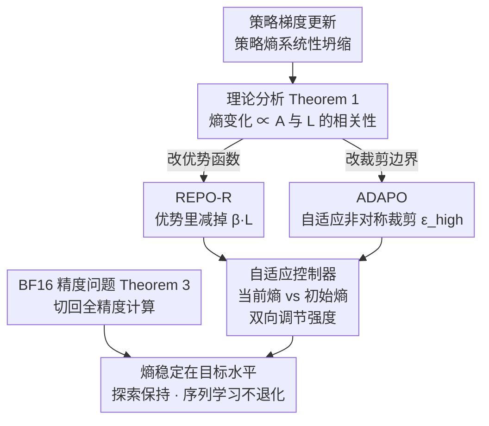

# Entropy-Preserving Reinforcement Learning (REPO / ADAPO)

**会议**: ICLR 2026  
**arXiv**: [2603.11682](https://arxiv.org/abs/2603.11682)  
**代码**: 无  
**领域**: 强化学习 / LLM 训练  
**关键词**: 熵保持, 策略梯度, LLM后训练, GRPO, 探索  

## 一句话总结
本文揭示了策略梯度 RL 算法在 LLM 后训练中系统性导致策略熵坍缩的理论根因（优势函数与对数概率的正相关性），并提出两种互补的解法：REPO（通过修改优势函数去相关）和 ADAPO（自适应非对称裁剪），在交互式工具使用任务上实现 SOTA 性能。

## 研究背景与动机

**领域现状**：GRPO、PPO、RLOO 等策略梯度算法被广泛用于 LLM 推理能力的 RL 后训练。DAPO 提出非对称裁剪来隐式保持熵，GSPO 使用序列级裁剪。

**现有痛点**：策略梯度更新系统性地坍缩策略熵——模型将概率集中在已经高概率的正确解上，忽略其他同样正确但概率较低的解。后果：pass@1 提升但 pass@k 下降；探索能力丧失；无法在新任务上继续微调（sequential learning 失败）。

**核心矛盾**：当模型已经对奖励"校准"（高概率动作获得高奖励），策略梯度更新天然锐化分布，减少熵——这是策略梯度的内在属性而非 bug。

**切入角度**：从理论上精确刻画每步更新的熵变化量，发现它正比于优势函数与对数概率的相关性——打破这个相关性即可保持熵。

**核心 idea**：通过修改优势函数（减去与 log-prob 成比例的项）来去除导致熵坍缩的相关性，同时保持策略改进方向。

## 方法详解

### 整体框架
这篇论文要解决的是「为什么策略梯度 RL 会把 LLM 的策略熵越训越低」这个问题，并给出可以直接挂到现有算法上的修复。整条路线是先做理论分析、再做工程干预：先精确写出每步更新后熵的变化量，找到导致熵坍缩的那一项；然后顺着这个根因设计两条互补的控制路径——一条直接改优势函数（REPO），一条改 PPO 的裁剪边界（ADAPO）；两条都配一个自适应控制器，把当前熵和初始熵比较后双向调节强度，让熵稳在目标水平；最后还顺手揪出 BF16 计算里一个被忽视的精度偏差，把它修掉。

### 关键设计

**1. 理论分析（Theorem 1）：把"熵为什么掉"写成一个可干预的式子**

熵坍缩长期被当成策略梯度的经验现象，本文把它精确化：单步更新后的熵变化满足

$$\Delta\mathcal{H} \propto -\mathbb{E}_{a \sim \pi}[A(\mathbf{s},a) \cdot L(\mathbf{s},a) \cdot \pi(a|\mathbf{s})]$$

其中 $L$ 是均值中心化后的对数概率。式子读出来就是：当优势 $A$ 与 $L$ 正相关时——也就是高概率动作恰好拿到高奖励、模型已经被奖励"校准"——这一项为正，$\Delta\mathcal{H}$ 为负，熵必然下降。这正好解释了为什么熵坍缩是策略梯度的内在属性而非 bug。更关键的是，它给出了一个精确的干预目标：只要打破 $A$ 和 $L$ 的相关性，就能止住熵的塌缩，而后面两个设计都是冲这个目标去的。

**2. REPO-R（Rescale 变体）：直接在优势函数里减掉那一项相关性**

既然熵坍缩来自 $A$ 与 $L$ 的正相关，最直接的办法就是把这部分从优势里扣掉：

$$A_{\text{REPO}}(s,a) = A(s,a) - \beta \cdot L(s,a)$$

实用变体 REPO-R 取 $\beta = \zeta \cdot |A|$，展开后对正负优势分别变成 $A^+ = A(1 - \zeta\log\pi)$ 和 $A^- = A(1 + \zeta\log\pi)$。效果是稀有但正确的动作（$\log\pi$ 很负）被额外增强，稀有但错误的动作被减轻惩罚——也就是把更新方向往"别急着把概率往已知好动作上堆"的方向掰，从而保住低概率正确解的存活空间，缓解 pass@1 涨而 pass@k 跌的现象。强度 $\zeta$ 不是固定的：配一个自适应控制器，当前熵低于初始熵就把 $\zeta$ 翻倍、高于初始熵就减半，双向调控让熵稳在起点附近。

**3. ADAPO（自适应非对称裁剪）：从裁剪边界这一侧管熵**

REPO 改的是优势，ADAPO 则改 PPO 的裁剪。Theorem 2 证明 PPO 的裁剪会把熵变化约束在 $[(1-\epsilon_{\text{low}})\mathcal{H}, (1+\epsilon_{\text{high}})\mathcal{H}]$ 这个区间内，于是非对称裁剪参数 $\epsilon_{\text{high}}$ 就成了一个可以直接拧的旋钮：熵太低就调大 $\epsilon_{\text{high}}$ 放更多熵增进来，太高就调小。这一步是对 DAPO 的修正——DAPO 用固定的非对称裁剪来隐式保熵，但在大模型某些设置下会矫枉过正，把熵推到失控增长（实验里 +298%），ADAPO 把固定阈值换成同样按当前熵与目标熵之差双向调节，才稳得住。

**4. BF16 精度问题（Theorem 3）：一个被忽视的偏差正在反向拉熵**

最后一个设计来自一个反直觉的发现：在 BF16 下计算重要性比率 $r = \pi_\theta / \pi_{\text{old}}$ 存在一个向上的乘性偏差，它等效于在「熵减少」的方向上额外施加了一次非对称裁剪——方向恰好和 DAPO 想要的保熵意图相反。也就是说，一个只影响极少 token 的低精度数值问题，足以悄悄把训练动态往熵坍缩那边带偏。修复很简单：把 log-prob 改成全精度计算，DAPO 的行为就从熵坍缩翻转回熵增长。

### 损失函数 / 训练策略
REPO 不引入新的损失项，只是替换优势函数，因此可以叠加在任何策略梯度算法（GRPO、RLOO、DAPO）之上，零额外内存开销，且兼容 Cut Cross-Entropy——这也是它相比显式熵奖励的优势：显式 $\beta\mathcal{H}$ 需要把 logit 物化、与 CCE 不兼容，而 REPO 通过 REINFORCE 估计达到等价效果却省下这笔开销。

## 实验关键数据

### 主实验
AppWorld（交互式工具使用）— Qwen-3-32B：

| 算法 | Test Normal↑ | Test Challenge↑ | 熵变化 |
|------|-------------|----------------|-------|
| GRPO | 0.67 | 0.46 | -57% |
| DAPO | 0.73 | 0.52 | +298% (失控) |
| RLOO (FP16 修复) | **0.79** | **0.71** | -36% |
| ADAPO | 0.78 | 0.58 | +102% |
| REPO-R | 0.73 | 0.54 | +7% |

AIME 2024/2025（数学推理）— Qwen-3-8B：差异较小（0.43-0.47），因基线模型已高度优化。

### 消融实验

| 发现 | 说明 |
|------|------|
| BF16→FP16 修复 | 定性改变 DAPO 行为（熵坍缩→熵增长） |
| 累积熵与最终性能正相关 | "关键是旅程而非目的地"——训练中保持高熵的模型最终性能更好 |
| 序列学习能力 | GRPO 训练的模型（熵坍缩）在新任务上灾难性失败，REPO/DAPO 模型成功迁移 |
| 显式熵奖励 vs REPO | 显式 $\beta\mathcal{H}$ 需要 logit 物化（不兼容 CCE），REPO 更高效 |

### 关键发现
- 严格 on-policy 的 RLOO（修复精度问题后）实际上是最强基线，引发疑问：熵坍缩主要是 off-policy 训练引入的？
- DAPO 在大模型上熵增失控（+298%），ADAPO 通过双向调控解决
- 熵保持对探索密集型任务（AppWorld）帮助大，对已充分优化的任务（AIME）帮助小

## 亮点与洞察
- **理论驱动的实践改进**：Theorem 1 精确刻画了熵坍缩的机制（A-L 相关性），REPO 直接干预这个相关性——理论指导实践的典范。
- **BF16 偏差的发现**意义重大：一个影响 <0.1% token 的精度问题就能定性改变训练动态。这对所有使用 BF16 的 RL 训练都有警示意义。
- **序列学习能力评估**提供了新的评测视角：不仅看单任务最终性能，还要看模型是否保留了继续学习新任务的能力。

## 局限与展望
- AIME 上改善有限，说明对已充分优化的领域效果不明显
- 自适应控制器使用启发式倍增/减半，无收敛保证
- 所有实验用 LoRA 微调，全量微调效果是否一致未知
- 一阶 Taylor 近似和 score function 正交性假设在深度 Transformer 中不一定成立

## 相关工作与启发
- **vs GRPO**: GRPO 熵坍缩 -64% (8B) / -57% (32B)，是最严重的；REPO 可直接叠加在 GRPO 上修复
- **vs DAPO**: DAPO 的固定非对称裁剪不够灵活（可能失控），ADAPO 自适应调控更稳定
- **vs 显式熵奖励**: REPO 通过 REINFORCE 估计达到等价效果但零额外内存

## 评分
- 新颖性: ⭐⭐⭐⭐⭐ 从理论到实践完整链条——分析问题根因→设计干预→修复精度 bug→实验验证
- 实验充分度: ⭐⭐⭐⭐ 在 AppWorld 上效果显著，AIME 上改善有限；缺少非 LoRA 实验
- 写作质量: ⭐⭐⭐⭐⭐ 理论推导严谨且与实验发现紧密对应
- 价值: ⭐⭐⭐⭐⭐ 对 LLM RL 训练中的熵管理提供了理论基础和实用工具

<!-- RELATED:START -->

## 相关论文

- [\[ACL 2026\] CE-GPPO: Coordinating Entropy via Gradient-Preserving Clipping Policy Optimization in Reinforcement Learning](../../ACL2026/reinforcement_learning/ce-gppo_coordinating_entropy_via_gradient-preserving_clipping_policy_optimizatio.md)
- [\[ICLR 2026\] AutoTool: Automatic Scaling of Tool-Use Capabilities in RL via Decoupled Entropy Constraints](autotool_automatic_scaling_of_tool-use_capabilities_in_rl_via_decoupled_entropy_.md)
- [\[ACL 2026\] Targeted Exploration via Unified Entropy Control for Reinforcement Learning](../../ACL2026/reinforcement_learning/targeted_exploration_via_unified_entropy_control_for_reinforcement_learning.md)
- [\[ICLR 2026\] Exploration vs Exploitation: Rethinking RLVR through Clipping, Entropy, and Spurious Reward](exploration_vs_exploitation_rethinking_rlvr_through_clipping_entropy_and_spuriou.md)
- [\[ICLR 2026\] Relative Entropy Pathwise Policy Optimization](relative_entropy_pathwise_policy_optimization.md)

<!-- RELATED:END -->
